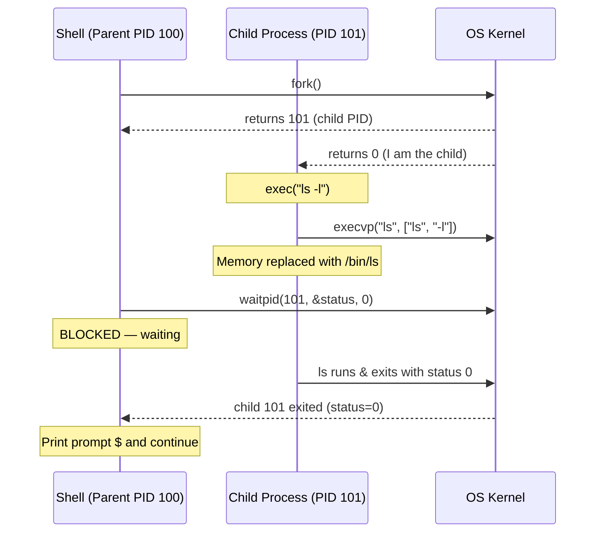

# Process Creation and Termination

Har process ka apna ek lifecycle hota hai — bilkul insaan ki tarah. Woh paida hota hai (create), apna kaam karta hai (execute), aur phir khatam ho jata hai (terminate). Bas farak itna hai ki process ka "birth certificate" `fork()` system call banata hai, aur "naya avatar lena" (jaise Ola driver app khol ke Ola bikey app mein badal jaye) `exec()` karta hai.

Unix/Linux mein process creation ek chhote se, lekin bahut powerful set of system calls pe tika hai -- `fork()`, `exec()`, `wait()`, aur `exit()`. In chaaron ke aapasi interaction se hi poora process hierarchy (parent-child tree) banta hai aur resource cleanup (zombie na banne dena) sunishchit hota hai.

Socho Zomato ka backend system hai. Ek main "order manager" process chal raha hai. Jaise hi naya order aata hai, woh apne aap ko duplicate karta hai (fork) taaki har order alag se, parallel mein handle ho sake. Phir woh duplicate copy apna "role" badal leti hai (exec) -- ho sakta hai "payment processor" ban jaye ya "delivery partner assigner" ban jaye. Yehi cheez OS level pe fork-exec pattern se hoti hai.

## What You'll Learn

- `fork()` kaise parent ko duplicate karke naya child process banata hai
- `exec()` family kaise process ki poori memory image ko naye program se replace karti hai
- Shells jo fork-exec pattern use karte hain
- Parent-child relationships aur process tree kaise banta hai
- Orphan aur zombie process kya hote hain aur inko kaise handle karein
- Process kaise terminate hote hain aur parent unka exit status kaise collect karta hai
- Copy-on-Write (COW) optimization -- fork() ko fast banane ka jugaad

---

## Process Creation with fork()

`fork()` system call ek **naya process** (child) banata hai jo calling process (parent) ki almost hoo-baho copy hota hai.

**Kya hota hai?** Jab tum `fork()` call karte ho, OS us waqt tumhare poore process ka ek "clone" bana deta hai -- same code, same data, same stack, same open file descriptors. Bas do cheezein alag hoti hain: PID (process ID) aur `fork()` ka return value.

```
Before fork()                After fork()
┌─────────────┐             ┌─────────────┐   ┌─────────────┐
│   Parent     │             │   Parent     │   │   Child      │
│   PID: 100   │    fork()   │   PID: 100   │   │   PID: 101   │
│              │  ────────>  │   fork()=101 │   │   fork()=0   │
│   Code       │             │   Code       │   │   Code       │
│   Data       │             │   Data       │   │   Data (copy)│
│   Stack      │             │   Stack      │   │   Stack(copy)│
└─────────────┘             └─────────────┘   └─────────────┘
```

Isko aise samjho: tum ek document Xerox (photocopy) karwane jaate ho. Original tumhare paas rehta hai (parent), aur ek naya copy nikal ke tumhe milta hai (child). Dono documents ek jaise dikhte hain, lekin ab dono independent hain -- ek pe kuch likho, dusre pe koi asar nahi padega.

`fork()` ke baare mein yeh key facts yaad rakho:
- Parent ko **child ka PID** return hota hai
- Child ko **0** return hota hai
- Agar kuch galat ho gaya (jaise system mein resources kam hain), toh **-1** return hota hai
- Child ko parent ke address space, file descriptors, aur signal handlers ki copy milti hai

> [!tip]
> `fork()` ka return value hi woh "if-else" hai jisse tum decide karte ho ki abhi tum parent code path pe ho ya child code path pe. Ek hi function call, do alag jagah return -- yeh pehli baar samajhna thoda ajeeb lagta hai, lekin practice se clear ho jayega.

### Basic fork() Example

```c
#include <stdio.h>
#include <stdlib.h>
#include <unistd.h>

int main(void) {
    pid_t pid;
    int x = 10;

    pid = fork();

    if (pid < 0) {
        perror("fork failed");
        exit(EXIT_FAILURE);
    } else if (pid == 0) {
        /* Child process */
        x += 10;
        printf("Child:  PID=%d, PPID=%d, x=%d\n", getpid(), getppid(), x);
    } else {
        /* Parent process */
        x -= 5;
        printf("Parent: PID=%d, Child PID=%d, x=%d\n", getpid(), pid, x);
    }

    return 0;
}
```

Output (order thoda alag bhi ho sakta hai, kyunki scheduler decide karta hai pehle kaun chalega):

```
Parent: PID=1000, Child PID=1001, x=5
Child:  PID=1001, PPID=1000, x=20
```

Dekho `x` dono processes mein **independent** ho gaya -- child mein `+10` kiya toh woh `20` ban gaya, parent mein `-5` kiya toh woh `5` ban gaya. Ek process ke changes doosre process ko touch nahi karte, kyunki fork ke baad dono ke paas apna-apna separate memory space hai (technically COW ke through, jo hum aage discuss karenge).

---

## The exec() Family

`exec()` current process ki memory image ko naye program se **replace** kar deta hai. PID wahi rehta hai, sirf code, data, aur stack replace ho jaate hain.

**Kyun zaruri hai?** Sochke dekho -- `fork()` sirf duplicate banata hai, koi naya kaam nahi karta. Agar tumhe apne child process se koi bilkul alag program run karwana hai (jaise `ls`, `python3`, ya `node`), toh us duplicate process ko "naya roop" dena padega. Yehi kaam `exec()` karta hai.

Real life analogy: socho tum Swiggy delivery partner ho. Tumhara "process" (tum khud) same hai, PID bhi same hai (tum wahi insaan ho), lekin jab tum ek order deliver karke doosra order lete ho, tumhara "code" badal jaata hai -- naya restaurant, naya address, naye instructions. Body wahi hai (PID same), lekin "kaam" (memory image) poora replace ho gaya.

```
Before exec()               After exec("/bin/ls")
┌─────────────┐             ┌─────────────┐
│  PID: 101   │             │  PID: 101   │
│  my_program │   exec()    │  /bin/ls    │
│  code/data  │  ────────>  │  code/data  │
│  stack      │             │  stack      │
└─────────────┘             └─────────────┘
```

`exec()` ek single call nahi, poora **family** hai:

| Function | Description |
|----------|-------------|
| `execl()` | List of arguments |
| `execlp()` | List + search PATH |
| `execle()` | List + environment |
| `execv()` | Array of arguments |
| `execvp()` | Array + search PATH |
| `execve()` | Array + environment (raw syscall) |

Naming convention yaad rakhna easy hai: `l` = list (jaise comma-separated arguments ek-ek karke pass karna), `v` = vector (array of arguments), `p` = PATH mein search karna (matlab tumhe binary ka full path nahi dena padega, jaise sirf `"ls"` bolne se PATH mein dhoondh lega), `e` = custom environment variables pass karna.

```c
#include <stdio.h>
#include <unistd.h>

int main(void) {
    printf("Before exec\n");

    /* Replace this process with /bin/ls */
    execlp("ls", "ls", "-l", NULL);

    /* This line only runs if exec fails */
    perror("exec failed");
    return 1;
}
```

> [!warning]
> `exec()` ke baad wala code **kabhi nahi chalta** jab tak `exec()` khud fail na ho jaye. Kyunki `exec()` successful hone pe poori process image hi replace ho jaati hai -- purana program literally "exist" hi nahi karta ab. Isliye upar wale example mein `perror("exec failed")` sirf tab print hoga jab `execlp` fail ho.

---

## The fork() + exec() Pattern

Shell (bash, zsh, jo bhi tum terminal mein use karte ho) is pattern ko use karte hain commands run karne ke liye: pehle ek child process fork karo, phir us child mein desired program ko exec karo, jabki parent (shell khud) wait karta hai.

Socho jab tum terminal mein `ls -l` type karte ho, tumhari shell khud `ls` nahi ban jaati -- warna shell khatam ho jaati aur terminal band ho jaata! Isliye shell pehle apna ek clone banati hai (`fork()`), aur us clone ko `ls` program mein badal deti hai (`exec()`), jabki asli shell wahin khadi rehti hai wait karke.



### Complete fork-exec-wait Example

```c
#include <stdio.h>
#include <stdlib.h>
#include <unistd.h>
#include <sys/wait.h>

int main(void) {
    pid_t pid = fork();

    if (pid < 0) {
        perror("fork");
        exit(EXIT_FAILURE);
    }

    if (pid == 0) {
        /* Child: execute "ls -la" */
        printf("Child (PID %d): about to exec ls\n", getpid());
        execlp("ls", "ls", "-la", NULL);
        perror("exec failed");  /* only reached on error */
        exit(EXIT_FAILURE);
    }

    /* Parent: wait for child to finish */
    int status;
    pid_t waited = waitpid(pid, &status, 0);

    if (WIFEXITED(status)) {
        printf("Parent: child %d exited with status %d\n",
               waited, WEXITSTATUS(status));
    } else if (WIFSIGNALED(status)) {
        printf("Parent: child %d killed by signal %d\n",
               waited, WTERMSIG(status));
    }

    return 0;
}
```

Yeh teeno steps -- `fork()`, `exec()`, `wait()` -- mila ke poora "run a command" ka flow banate hain. Yeh pattern itna common hai ki almost har shell (bash, zsh, sh) isi tarah kaam karta hai andar se.

---

## Process Hierarchy (Process Tree)

**Kya hota hai?** Unix/Linux mein har process (PID 1, jo `init`/`systemd` hota hai, uske alawa) ka koi na koi parent hota hai. Isse ek tree structure banta hai, exactly jaise ek company ka org chart hota hai -- CEO (PID 1) ke niche managers, unke niche team leads, unke niche developers.

**Kyun zaruri hai?** Yeh hierarchy sirf record-keeping ke liye nahi hai -- yeh kaafi practical cheezon ko power karti hai. Jab tum ek terminal band karte ho, shell apne saare child processes ko bhi terminate karne ki koshish karta hai (kyunki woh usi tree ke andar hain). Jab koi process crash ho jaata hai bina apne children ko properly terminate kiye, OS ko pata hota hai un orphaned children ko kis "guardian" (init) ke paas bhejna hai, kyunki tree structure already define karta hai relationships. Container systems jaise Docker bhi isi hierarchy pe depend karte hain -- ek container ke andar PID 1 hi decide karta hai ki poora container kab tak zinda rahega.

```
systemd (PID 1)
├── sshd (PID 500)
│   └── bash (PID 1200)
│       ├── vim (PID 1350)
│       └── gcc (PID 1351)
├── cron (PID 501)
├── nginx (PID 502)
│   ├── nginx worker (PID 510)
│   └── nginx worker (PID 511)
└── dockerd (PID 503)
```

Isko dekhne ke liye:

```bash
pstree -p          # show PIDs
pstree -p -s 1350  # show ancestors of PID 1350
```

Real-world example: `nginx` jaise web server mein ek "master process" hota hai (PID 502) jo requests handle karne ke liye multiple "worker processes" (510, 511) fork karta hai -- bilkul Swiggy ke ek main dispatch center ki tarah jo alag-alag areas ke liye alag delivery riders assign karta hai. Agar ek worker crash ho jaaye, master process usse dobara fork kar sakta hai bina poore server ko restart kiye -- exactly jaise ek rider chhutti pe chala jaaye toh dispatch center bas ek naya rider assign kar deta hai, poora Swiggy app down nahi hota.

---

## Zombie Processes

**Zombie** (defunct) process woh hota hai jo terminate ho chuka hai, lekin uska parent abhi tak `wait()` call karke uska exit status collect nahi kar paaya. Process table mein uski entry abhi bhi baithi hai.

**Kya hota hai?** Socho tumne Swiggy pe order diya, delivery ho gaya, khana aa gaya -- lekin app mein "Order Delivered" ka confirmation kabhi nahi aaya kyunki app crash ho gaya check karne se pehle. Delivery toh ho chuki hai (process terminate ho chuka hai), lekin system ne officially usse "close" nahi kiya (parent ne `wait()` nahi kiya). System mein woh order record atka reh jaata hai -- zombie state.

```
Timeline:
1. Child calls exit()       → child becomes zombie
2. Parent calls wait()      → zombie entry removed
    (or parent never calls wait → zombie persists)
```

```
$ ps aux | grep Z
USER  PID  STAT  COMMAND
john  1234  Z+   [myprog] <defunct>
```

> [!info]
> Zombies **memory ya CPU consume nahi karte** -- woh sirf ek PID aur process table ka ek slot occupy karte hain (jaise ek exit status hold karne ke liye chhota sa record). Lekin agar bahut saare zombies accumulate ho jaayein (jaise ek buggy server jo kabhi `wait()` nahi karta), toh yeh poora PID space exhaust kar sakte hain -- aur naye process create hi nahi ho paayenge!

### Creating a Zombie (demonstration)

```c
#include <stdio.h>
#include <stdlib.h>
#include <unistd.h>

int main(void) {
    pid_t pid = fork();

    if (pid == 0) {
        /* Child exits immediately */
        printf("Child (PID %d) exiting.\n", getpid());
        exit(0);
    }

    /* Parent sleeps without calling wait() */
    printf("Parent sleeping. Check 'ps aux | grep Z'.\n");
    sleep(60);

    return 0;
}
```

Is code mein child turant exit ho jaata hai, lekin parent 60 second tak sleep karta hai bina `wait()` bulaye. Is 60 second ke window mein agar tum `ps aux | grep Z` chalao, tumhe zombie process dikhega.

---

## Orphan Processes

**Kya hota hai?** **Orphan** process woh child hota hai jiska parent terminate ho chuka hai lekin child abhi bhi chal raha hai. OS automatically orphan ko `init` (PID 1) ke saath re-parent kar deta hai, jo periodically `wait()` call karta rehta hai orphans ko clean karne ke liye.

**Analogy**: Socho ek IRCTC ka background job (child process) chal raha hai jo tatkal tickets book kar raha hai, aur uska parent process (jisne isse launch kiya tha) achanak crash ho gaya. Ab yeh child process "anaath" (orphan) ho gaya -- lekin OS isse turant `init` (system ka "guardian") ke adopt kar deta hai, taaki jab yeh child bhi khatam ho, koi na koi isse properly reap kare aur zombie na bane.

Yeh reparenting mechanism hi ensure karta hai ki koi bhi process permanently "unwaited" na reh jaaye. Agar orphan reparenting nahi hoti, toh original parent ke crash hone ke baad us child ka exit status collect karne wala koi bhi nahi hota, aur woh bhi zombie ban ke atka reh jaata -- forever ke liye, kyunki uska original parent toh gayab ho chuka. `init`/`systemd` ka poora job hi yeh hai ki woh in adopted children ka `wait()` karta rahe, unke exit status ko discard kar de, aur unki process table entry free kar de.

```
Before parent exits:         After parent exits:
  Parent (100)                 init (1)
    └── Child (101)              └── Child (101)  ← re-parented
```

### Creating an Orphan (demonstration)

```c
#include <stdio.h>
#include <stdlib.h>
#include <unistd.h>

int main(void) {
    pid_t pid = fork();

    if (pid == 0) {
        /* Child: sleep to outlive parent */
        sleep(5);
        printf("Child: my PPID is now %d (should be 1 or init)\n", getppid());
        exit(0);
    }

    /* Parent exits immediately */
    printf("Parent (PID %d) exiting. Child = %d\n", getpid(), pid);
    exit(0);
}
```

Yahan parent turant exit ho jaata hai, lekin child 5 second sleep karta hai. Us 5 second ke andar parent mar chuka hota hai, isliye jab child jaagta hai aur `getppid()` call karta hai, uska naya parent PID 1 (ya systemd) dikhega.

> [!tip]
> Zombie aur Orphan mein confuse mat hona -- **Zombie** matlab "child mar gaya, parent zinda hai lekin usne clean nahi kiya". **Orphan** matlab "parent mar gaya, child zinda hai". Dono alag problems hain, alag solutions hain.

---

## Process Termination

**Kya hota hai?** Processes terminate hote hain ya toh `exit()` call karke, ya phir kisi unhandled signal ke through (jaise koi bahar se force kill kar de). Yeh woh moment hai jab OS process ke saare resources (memory, file descriptors, ports) waapas le leta hai, aur process table mein us process ka final record (exit status) reh jaata hai, jab tak parent usse collect na kar le.

| Method | Description |
|--------|-------------|
| `exit(status)` | Normal termination, stdio buffers flush karta hai |
| `_exit(status)` | Immediate termination, koi cleanup nahi |
| `return` from `main()` | `exit(return_value)` jaisa hi hai |
| Signal (SIGKILL, SIGTERM) | Abnormal termination |

`exit()` aur `_exit()` mein farak samajhna zaruri hai: `exit()` "polite" hai -- pehle stdio buffers ko flush karta hai (matlab agar tumne `printf` kiya hai lekin newline nahi diya, phir bhi woh output print ho jayega exit hone se pehle), registered cleanup functions (`atexit()`) chalata hai, phir process ko khatam karta hai. `_exit()` seedha bina kuch flush kiye process ko turant khatam kar deta hai -- yeh usually `fork()` ke baad child process mein use hota hai jab exec fail ho jaaye, taaki parent ke stdio buffers double-flush na ho jaayein.

### Sending Signals

```bash
kill -SIGTERM 1234    # polite termination request
kill -SIGKILL 1234    # forceful kill (cannot be caught)
kill -9 1234          # same as SIGKILL
killall myprogram     # kill by name
```

`SIGTERM` ek "request" hai -- process chahe toh usse ignore/handle kar sakta hai (jaise pehle cleanup karke phir close ho). Yeh bilkul aisa hai jaise tum kisi ko polite tareeke se bolo "bhai please shop band kar do", woh apna kaam finish karke band karega. `SIGKILL` (ya `-9`) ek "order" hai -- process ise handle ya ignore nahi kar sakta, OS turant use force-kill kar deta hai. Yeh aisa hai jaise bijli department bina warning diye connection kaat de -- process ko cleanup ka mauka bhi nahi milta, isliye ismein data loss ka risk rehta hai.

> [!warning]
> `SIGKILL` ka use last resort ke roop mein karo. Agar process database transaction ke beech mein hai ya temp files clean kar raha hai, `-9` se force kill karne se corruption ho sakta hai. Pehle `SIGTERM` try karo, thoda wait karo, tab jaake `SIGKILL` use karo.

---

## wait() and waitpid()

**Kyun zaruri hai?** Bina `wait()`/`waitpid()` ke, koi bhi terminated child apne exit status ke saath process table mein zombie bana reh jaata -- kyunki OS ko nahi pata parent ko yeh info chahiye ya nahi, jab tak parent explicitly maang na le. Yeh function calls hi woh "pickup confirmation" hain jo delivery complete hone ke baad system ko batate hain "haan mujhe pata chal gaya, ab is record ko clear kar do".

Parents `wait()` ya `waitpid()` use karte hain teen kaam ke liye:
1. Child terminate hone tak block/wait karna
2. Child ka exit status collect karna
3. Child ki process table entry free karna (zombie ko reap karna)

```c
#include <sys/wait.h>

pid_t wait(int *status);               /* wait for any child */
pid_t waitpid(pid_t pid, int *status, int options);  /* wait for specific child */
```

`wait()` "kisi bhi" child ke khatam hone ka wait karta hai, jabki `waitpid()` tumhe specific PID choose karne deta hai -- jo bahut useful hai jab tumhare paas multiple children ho aur tumhe pata hona chahiye kaunsa kab khatam hua.

Status inspect karne ke macros:

| Macro | Returns |
|-------|---------|
| `WIFEXITED(status)` | True agar child normally exit hua |
| `WEXITSTATUS(status)` | Exit code (0-255) |
| `WIFSIGNALED(status)` | True agar signal se killed hua |
| `WTERMSIG(status)` | Wo signal number jisne child ko maara |

`waitpid` ke options:
- `WNOHANG` -- turant return karo agar koi bhi child exit nahi hua (non-blocking). Yeh useful hai jab tumhe blocking wait nahi karna, balki periodically check karna hai (poll karna hai) ki koi child khatam hua ya nahi.

---

## Copy-on-Write (COW)

**Kyun zaruri hai?** Agar naively socho, `fork()` ko parent ke poore address space ko duplicate karna chahiye -- matlab poori memory copy karo. Lekin yeh bahut slow aur wasteful hota, especially jab child turant `exec()` call karke apni memory replace kar deta hai (jaise fork-exec pattern mein hota hai) -- toh copy kiya hua data bekaar hi jaata!

Modern kernels isliye **Copy-on-Write (COW)** technique use karte hain: fork() ke turant baad, parent aur child dono ek hi physical memory pages ko **share** karte hain, aur inhe read-only mark kar dete hain. Actual copy sirf tab hoti hai jab koi ek process (parent ya child) us page mein **likhne** ki koshish karta hai.

Isko aise socho: tumne aur tumhare roommate ne mil ke ek hi Netflix account share kiya (shared page, read-only jaisa). Jab tak dono sirf "dekh" (read) rahe ho, koi problem nahi -- ek hi account chalta rahega. Lekin jaise hi ek banda apna khud ka password badalna chahta hai (write karna chahta hai), tabhi system ek naya, alag account (copy) bana deta hai us insaan ke liye. Tab tak dono ka ek hi resource chal raha tha!

```
After fork() with COW:
┌────────────┐          Physical Memory
│  Parent     │  page A ──┐
│  Page Table │  page B ──┼──> ┌───────────────┐
└────────────┘  page C ──┤    │ Shared Pages   │
                          │    │ (read-only)    │
┌────────────┐           │    └───────────────┘
│  Child      │  page A ──┤
│  Page Table │  page B ──┤
└────────────┘  page C ──┘

After child writes to page B:
                              ┌─────────────────┐
Parent page B ───────────────>│ Original page B  │
                              └─────────────────┘
                              ┌─────────────────┐
Child  page B ───────────────>│ Copied page B    │  ← new copy
                              └─────────────────┘
```

COW `fork()` ko bahut **fast** banata hai kyunki actual memory tab tak copy nahi hoti jab tak zaroorat na pade. Yeh khaaskar fork-exec pattern mein bahut faayde ka hai, jahan child turant `exec()` call karke apni memory replace kar deta hai aur parent ke pages ko kabhi use hi nahi karta -- toh unhe copy karne ki zaroorat hi nahi padi!

> [!info]
> Agar tumne kabhi suna hai ki "fork() bahut cheap operation hai", COW hi uski wajah hai. Bina COW ke, ek 2GB memory wale process ko fork karna matlab poore 2GB ko copy karna -- bahut slow. COW ke saath, fork() sirf page tables set up karta hai, actual data copy tab hoga jab zaroorat padegi.

---

## Practical: pstree Command

```bash
# Show full process tree with PIDs
pstree -p

# Show tree for current user
pstree -u $USER

# Show ancestors of a specific PID
pstree -s -p 1234

# Show command-line arguments
pstree -a
```

`pstree` tumhe visually poora process hierarchy dikhata hai -- kaafi useful jab tum debug kar rahe ho ki kaunsa process kisne spawn kiya, ya koi rogue orphan process dhoondh rahe ho.

---

## Exercises

### Beginner

1. Ek C program likho jo `fork()` call kare aur parent aur child dono se PID aur PPID print kare. Isse multiple baar run karo aur note karo PIDs kaise change hote hain.
2. `pstree -p` use karke apni shell process se lekar PID 1 tak ka parent chain dhoondho. Har process ka naam aur PID likh lo.
3. Apne shabdon mein samjhao ki `fork()` parent aur child ko alag-alag values kyun return karta hai. Yeh design kyun useful hai?

### Intermediate

4. Ek program likho jo loop mein 5 child processes create kare. Har child apna PID print kare aur apne index (0-4) ke barabar exit status ke saath exit ho. Parent sab children ka wait kare aur har child ka exit status print kare.
5. Upar diye gaye tareeke se ek zombie process banao. `ps aux | grep Z` use karke usse observe karo. Phir parent ko modify karo ki thodi der baad `wait()` call kare aur verify karo ki zombie reap ho gaya.
6. Ek mini-shell likho jo stdin se commands padhe, ek child fork kare, aur `execlp()` use karke unhe run kare. Single-word commands support karo jaise `ls`, `pwd`, `date`.

### Advanced

7. Ek program implement karo jo child fork kare, aur woh child ek grandchild fork kare. Original parent child ka wait kare, aur child grandchild ka wait kare. Program ke andar se `pstree` use karke process tree print karo (hint: `sprintf` use karke PIDs ke saath command string banao).
8. Ek program likho jo COW demonstrate kare: fork karo, phir child mein ek bade array mein likho. `/proc/[pid]/status` (specifically `VmRSS`) ka use karke write se pehle aur baad mein memory usage change observe karo.
9. `SIGCHLD` use karke ek signal handler implement karo jo automatically zombie children ko reap kare bina `wait()` pe block kiye. 10 children create aur terminate karke test karo.

---

## Key Takeaways

- `fork()` ek child process banata hai jo parent ki copy hota hai; child ko 0 return hota hai, parent ko child ka PID return hota hai.
- `exec()` current process image ko naye program se replace karta hai bina PID change kiye.
- Shells fork-exec-wait pattern use karte hain commands run karne ke liye.
- Process hierarchy PID 1 pe rooted ek tree hoti hai, aur yeh tree hi decide karti hai ki crash hone pe orphans kis "guardian" ko re-parent honge.
- Zombie ek terminate ho chuka child hai jiska parent abhi tak `wait()` nahi kar paaya. Orphan ek aisa child hai jiska parent mar chuka hai (jo re-parented ho jaata hai init ko).
- Hamesha `wait()`/`waitpid()` call karo children ko reap karne ke liye, taaki zombie accumulation na ho.
- Copy-on-Write `fork()` ko efficient banata hai memory copying ko tab tak defer karke jab tak actual write na ho.
- Process tree PID 1 (`init`/`systemd`) pe rooted hota hai; har doosre process ka koi na koi parent hota hai.

---

## Navigation

- **Previous**: [Processes and Threads](./01_processes_and_threads.md)
- **Next**: [CPU Scheduling Algorithms](./03_cpu_scheduling.md)
- **Section home**: [Process Management](./README.md)
