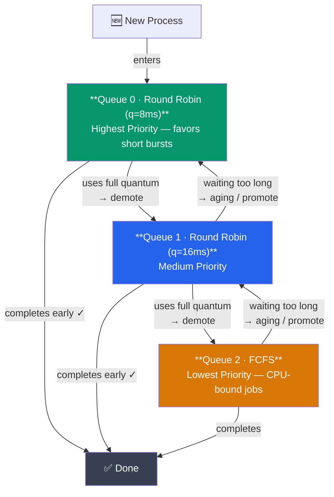

# CPU Scheduling Algorithms

## What You'll Learn

- CPU scheduling fundamentals and goals
- Preemptive vs non-preemptive scheduling
- CPU scheduling algorithms (FCFS, SJF, SRTF, Priority, Round Robin)
- Multilevel queue and multilevel feedback queue scheduling
- How to calculate average waiting time and turnaround time
- Linux CFS (Completely Fair Scheduler)

## Introduction to CPU Scheduling

**CPU Scheduling** is the process of determining which process in the ready queue gets the CPU for execution. Good scheduling maximizes CPU utilization and improves system responsiveness.

### Why Do We Need CPU Scheduling?

```
Without Scheduling:
- CPU sits idle when process waits for I/O
- Poor resource utilization
- Unfair distribution of CPU time

With Scheduling:
✓ Multiple processes share CPU efficiently
✓ Better CPU utilization (keep CPU busy)
✓ Fair allocation of resources
✓ Improved responsiveness
```

## Process Behavior

### CPU Burst and I/O Burst

Processes alternate between two states:

```
Process Execution Pattern:

[CPU Burst] → [I/O Burst] → [CPU Burst] → [I/O Burst] → ...
    ↓              ↓              ↓              ↓
  Computing    Waiting for    Computing    Waiting for
               Disk/Network                 Disk/Network
```

### CPU-Bound vs I/O-Bound

| Type | Characteristics | Example |
|------|----------------|---------|
| **CPU-Bound** | Long CPU bursts, few I/O operations | Video encoding, scientific computing, cryptography |
| **I/O-Bound** | Short CPU bursts, many I/O operations | Text editor, web browser, database queries |

## Scheduling Criteria

Metrics to evaluate scheduling algorithms:

| Criterion | Description | Goal |
|-----------|-------------|------|
| **CPU Utilization** | Percentage of time CPU is busy | Maximize (40-90%) |
| **Throughput** | Number of processes completed per unit time | Maximize |
| **Turnaround Time** | Time from submission to completion | Minimize |
| **Waiting Time** | Time spent in ready queue | Minimize |
| **Response Time** | Time from submission to first response | Minimize |

### Formulas

```
Turnaround Time = Completion Time - Arrival Time
Waiting Time = Turnaround Time - Burst Time
Response Time = Time of First CPU Allocation - Arrival Time
```

## Preemptive vs Non-Preemptive Scheduling

### Non-Preemptive

```
Once CPU is allocated to a process:
→ Process runs until completion or blocks for I/O
→ Cannot be interrupted by other processes
→ Simpler to implement
→ Lower overhead

Examples: FCFS, SJF (non-preemptive)
```

### Preemptive

```
CPU can be taken away from a process:
→ Higher priority process arrives
→ Time quantum expires (Round Robin)
→ More responsive to high-priority tasks
→ Higher overhead (context switching)

Examples: SRTF, Priority (preemptive), Round Robin
```

## Scheduling Algorithms

### 1. First Come First Served (FCFS)

**Algorithm**: Processes are executed in the order they arrive.

**Type**: Non-preemptive

**Example**:

```
Processes:
Process | Arrival Time | Burst Time
--------|--------------|------------
   P1   |      0       |     24
   P2   |      1       |      3
   P3   |      2       |      3

Gantt Chart:
0        24   27   30
|---P1---|P2-|P3-|

Waiting Time:
P1: 0 - 0 = 0
P2: 24 - 1 = 23
P3: 27 - 2 = 25

Average Waiting Time = (0 + 23 + 25) / 3 = 16 ms
```

**Advantages**:
- Simple to implement
- Fair (FIFO order)

**Disadvantages**:
- **Convoy Effect**: Short processes wait for long processes
- Poor average waiting time
- Not suitable for time-sharing systems

### 2. Shortest Job First (SJF)

**Algorithm**: Select process with shortest burst time.

**Type**: Non-preemptive (can be preemptive → SRTF)

**Example**:

```
Processes:
Process | Arrival Time | Burst Time
--------|--------------|------------
   P1   |      0       |      6
   P2   |      0       |      8
   P3   |      0       |      7
   P4   |      0       |      3

Execution Order (by burst time): P4 → P1 → P3 → P2

Gantt Chart:
0    3    9    16   24
|P4-|--P1--|--P3--|--P2--|

Waiting Time:
P1: 3 - 0 = 3
P2: 16 - 0 = 16
P3: 9 - 0 = 9
P4: 0 - 0 = 0

Average Waiting Time = (3 + 16 + 9 + 0) / 4 = 7 ms
```

**Advantages**:
- Optimal (minimum average waiting time)
- Good for batch systems

**Disadvantages**:
- Requires knowing burst time (prediction needed)
- **Starvation**: Long processes may never execute
- Not practical for interactive systems

### 3. Shortest Remaining Time First (SRTF)

**Algorithm**: Preemptive version of SJF. Switch to process with shortest remaining time.

**Type**: Preemptive

**Example**:

```
Processes:
Process | Arrival Time | Burst Time
--------|--------------|------------
   P1   |      0       |      8
   P2   |      1       |      4
   P3   |      2       |      9
   P4   |      3       |      5

Timeline:
Time 0: P1 starts (remaining: 8)
Time 1: P2 arrives (4 < 7), preempt P1, run P2
Time 2: P3 arrives (9 > 3), continue P2
Time 3: P4 arrives (5 > 2), continue P2
Time 5: P2 completes, P4 has shortest (5 < 7 < 9)
Time 10: P4 completes, P1 continues
Time 17: P1 completes, P3 runs
Time 26: P3 completes

Gantt Chart:
0 1    5    10    17     26
|P1|--P2--|--P4--|--P1--|--P3--|

Average Waiting Time = ((9+1) + (5-1) + (17-2) + (5-3)) / 4 = 7.75 ms
```

**Advantages**:
- Optimal for preemptive scheduling
- Better response time for short processes

**Disadvantages**:
- More context switches (higher overhead)
- Requires burst time prediction
- Starvation of long processes

### 4. Priority Scheduling

**Algorithm**: Each process has a priority. CPU allocated to highest priority process.

**Type**: Can be preemptive or non-preemptive

**Priority Assignment**:
- Lower number = higher priority (Unix/Linux)
- Or higher number = higher priority (Windows)

**Example** (non-preemptive):

```
Processes:
Process | Arrival | Burst | Priority (lower = higher)
--------|---------|-------|---------------------------
   P1   |    0    |  10   |    3
   P2   |    0    |   1   |    1 (highest)
   P3   |    0    |   2   |    4
   P4   |    0    |   1   |    5
   P5   |    0    |   5   |    2

Execution Order: P2 → P5 → P1 → P3 → P4

Gantt Chart:
0  1      6      16    18 19
|P2|--P5--|--P1--|--P3-|P4|

Average Waiting Time = (6 + 0 + 16 + 11 + 1) / 5 = 6.8 ms
```

**Advantages**:
- Can give preference to important processes
- Flexible

**Disadvantages**:
- **Starvation**: Low-priority processes may never execute
- Solution: **Aging** (gradually increase priority of waiting processes)

### 5. Round Robin (RR)

**Algorithm**: Each process gets a small time quantum (time slice). If not finished, goes to end of queue.

**Type**: Preemptive

**Time Quantum**: Typically 10-100 milliseconds

**Example** (Time Quantum = 4 ms):

```
Processes:
Process | Arrival | Burst Time
--------|---------|------------
   P1   |    0    |    24
   P2   |    0    |     3
   P3   |    0    |     3

Execution:
Round 1: P1(4), P2(3), P3(3) - P2, P3 complete
Round 2: P1(4)
Round 3: P1(4)
Round 4: P1(4)
Round 5: P1(4)
Round 6: P1(4) - P1 completes

Gantt Chart:
0    4  7  10  14  18  22  26  30
|--P1--|P2|P3|P1|P1|P1|P1|P1|

Waiting Time:
P1: (30-24) = 6
P2: (7-3) - 0 = 4
P3: (10-3) - 3 = 4

Average Waiting Time = (6 + 4 + 4) / 3 = 4.67 ms
```

**Time Quantum Considerations**:

```
Too Large:
→ Behaves like FCFS
→ Poor response time

Too Small:
→ Too many context switches
→ High overhead
→ Low throughput

Optimal:
→ 80% of CPU bursts should be shorter than quantum
```

**Advantages**:
- Fair allocation
- Good response time
- No starvation
- Suitable for time-sharing systems

**Disadvantages**:
- Higher average waiting time than SJF
- Context switch overhead
- Performance depends on time quantum

### 6. Multilevel Queue Scheduling

**Algorithm**: Ready queue is divided into multiple queues with different priorities.

```
Queue Structure:

┌─────────────────────────────┐
│  System Processes (Highest) │ → Round Robin (q=8)
├─────────────────────────────┤
│  Interactive Processes      │ → Round Robin (q=16)
├─────────────────────────────┤
│  Batch Processes (Lowest)   │ → FCFS
└─────────────────────────────┘

Scheduling:
- Higher priority queues are always served first
- Process cannot move between queues
```

**Example Use**:
- Queue 1 (System): kernel processes
- Queue 2 (Interactive): user applications
- Queue 3 (Batch): background tasks

**Disadvantages**:
- Starvation of lower priority queues
- Inflexible (no movement between queues)

### 7. Multilevel Feedback Queue Scheduling

**Algorithm**: Similar to multilevel queue, but processes can move between queues.



Aging: Long-waiting processes promoted to higher queue

**Rules**:
1. New process enters highest priority queue
2. If uses full quantum, demoted to next lower queue
3. If completes or blocks before quantum expires, stays in same queue (or promoted)
4. Priority: Queue 0 > Queue 1 > Queue 2

**Advantages**:
- Favors short processes (good response time)
- Favors I/O-bound processes
- Prevents starvation (via aging)
- Most general and flexible

**Disadvantages**:
- Complex to implement
- Requires tuning of parameters

## Linux Completely Fair Scheduler (CFS)

Modern Linux (2.6.23+) uses CFS:

```
Key Concepts:

1. Virtual Runtime (vruntime):
   - Tracks how much CPU time each process has received
   - Weighted by process priority (nice value)

2. Red-Black Tree:
   - Processes sorted by vruntime
   - Leftmost node = process with least vruntime (runs next)

3. Fair Scheduling:
   - Each process gets proportional share of CPU
   - Nice values: -20 (high priority) to +19 (low priority)

vruntime calculation:
vruntime += (actual_runtime × nice_0_weight) / process_weight
```

**Viewing Process Priorities**:

```bash
# View nice values
ps -eo pid,ni,comm

# Change nice value (requires privileges for negative values)
nice -n 10 ./myprogram      # Start with nice value 10
renice -n 5 -p 1234         # Change running process PID 1234 to nice 5

# View scheduler statistics
cat /proc/sched_debug
```

## Scheduling Algorithm Comparison

| Algorithm | Selection | Preemptive | Avg Wait | Starvation | Overhead | Use Case |
|-----------|-----------|------------|----------|------------|----------|----------|
| **FCFS** | First arrival | No | High | No | Low | Batch systems |
| **SJF** | Shortest burst | No | Low (optimal) | Yes | Low | Batch (if burst known) |
| **SRTF** | Shortest remaining | Yes | Lowest | Yes | Medium | Interactive |
| **Priority** | Highest priority | Both | Varies | Yes | Low-Medium | Real-time, important tasks |
| **Round Robin** | Time quantum | Yes | Medium | No | High | Time-sharing |
| **Multilevel Queue** | Queue priority | Yes | Varies | Possible | Medium | Mixed workloads |
| **Multilevel Feedback** | Dynamic queues | Yes | Good | No (with aging) | High | General-purpose OS |

## Real-World Example: Web Server Scheduling

```
Scenario: Web server with 100 requests

Request Types:
- Static files (fast, 10ms): 60 requests
- Dynamic pages (medium, 50ms): 30 requests
- Database queries (slow, 200ms): 10 requests

Algorithm Comparison:

FCFS:
- First query takes 200ms → all others wait
- Poor user experience

SJF/SRTF:
- Serve static files first (10ms each)
- Good average response time
- Long queries starve

Round Robin (q=20ms):
- All requests get some CPU time quickly
- Fair, good response time
- Best for mixed workloads

Priority:
- High priority for paying customers
- Low priority for free tier
- Business logic determines scheduling
```

## Exercises

### Beginner

1. Calculate average waiting time for FCFS:
   ```
   Process | Arrival | Burst
   --------|---------|-------
      P1   |    0    |   5
      P2   |    1    |   3
      P3   |    2    |   8
   ```

2. Explain the convoy effect in FCFS scheduling.

3. Why is SRTF better than SJF for interactive systems?

### Intermediate

4. Calculate average waiting time for Round Robin (quantum=4):
   ```
   Process | Arrival | Burst
   --------|---------|-------
      P1   |    0    |   10
      P2   |    0    |   5
      P3   |    0    |   8
   ```

5. Design a multilevel feedback queue with 3 queues. Specify:
   - Scheduling algorithm for each queue
   - Time quantum (if RR)
   - Promotion/demotion rules

6. Explain how aging prevents starvation in priority scheduling.

### Advanced

7. Implement a simple Round Robin scheduler simulator in Python or C.

8. Analyze the Linux CFS scheduler:
   ```bash
   # Run CPU-intensive process with different nice values
   nice -n -10 ./cpu_bound &
   nice -n 10 ./cpu_bound &
   
   # Observe CPU usage with top
   top -p $(pgrep cpu_bound)
   ```
   Compare CPU time allocated to each process.

9. Research and explain how real-time scheduling differs from general-purpose scheduling (e.g., SCHED_FIFO, SCHED_RR in Linux).

## Key Takeaways

- CPU scheduling allocates CPU time among competing processes
- **FCFS** is simple but suffers from convoy effect
- **SJF/SRTF** minimizes waiting time but requires burst time prediction
- **Priority** scheduling can lead to starvation (solved by aging)
- **Round Robin** is fair and prevents starvation, good for time-sharing
- **Multilevel Feedback Queue** is most flexible, used in modern OS
- Linux uses **CFS** for fair, proportional CPU allocation
- Trade-offs: response time vs throughput vs fairness vs overhead

## Next Steps

Continue to [Context Switching](./04_context_switching.md) to learn about the overhead involved in switching between processes.

---

[← Previous: Process Lifecycle](./02_process_lifecycle.md) | [Next: Context Switching →](./04_context_switching.md)
