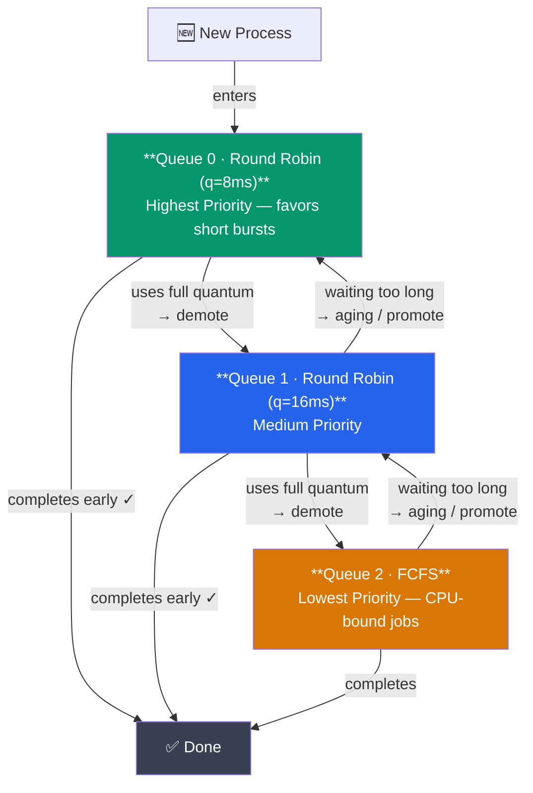

# CPU Scheduling Algorithms

## What You'll Learn

- CPU scheduling fundamentals aur goals
- Preemptive vs non-preemptive scheduling
- CPU scheduling algorithms (FCFS, SJF, SRTF, Priority, Round Robin)
- Multilevel queue aur multilevel feedback queue scheduling
- Average waiting time aur turnaround time kaise calculate karein
- Linux CFS (Completely Fair Scheduler)

## Introduction to CPU Scheduling

Socho tum Swiggy delivery hub ke manager ho. Ek time pe tumhare paas 50 orders ready hain aur sirf 5 delivery boys hain. Ab decide kaun karega ki kaunsa order kis delivery boy ko pehle milega? Yehi decision "scheduling" hai.

**CPU Scheduling** bhi bilkul yehi kaam karta hai — OS ko decide karna hota hai ki ready queue mein khade hue kaunse process ko CPU (jo ki ek limited resource hai, bilkul delivery boy jaisa) kab milega. Achhi scheduling CPU ka zyada se zyada use karti hai aur system ko responsive rakhti hai — matlab user ko lagna chahiye ki system "turant" respond kar raha hai, chahe background mein 100 processes chal rahe hon.

Ek baat clear kar lete hain shuru mein hi — tumhare laptop mein chahe 4 cores hon ya 8, us se kahin zyada processes chal rahe hote hain (Chrome ke 50 tabs, VS Code, Slack, background services...). CPU cores limited hain, demand unlimited hai. Scheduler wahi entity hai jo yeh decide karta hai ki agla "turn" kisko milega, aur kitni der ke liye. Yeh decision milliseconds mein hazaaron baar hota hai — isliye scheduler khud bhi bahut fast aur efficient hona chahiye, warna khud scheduler hi CPU time khaane lag jaayega.

### Kyun Zaruri Hai CPU Scheduling?

Agar scheduling na ho, socho kya hoga — ek process disk se data read karne ke liye wait kar raha hai, aur us dauraan CPU khali baitha hai kuch nahi kar raha! Bilkul aisa jaise ek Zomato rider order deliver karke wapas aaya, aur naya order milne tak khada hi rehta agar manager smart tarike se agla order assign na kare.

```
Without Scheduling:
- CPU sits idle when process waits for I/O
- Poor resource utilization
- Unfair distribution of CPU time

With Scheduling:
✓ Multiple processes share CPU efficiently
✓ Better CPU utilization (keep CPU busy)
✓ Fair allocation of resources
✓ Improved responsiveness
```

> [!info]
> Simple soch: jab ek process I/O (disk, network) ka wait kar raha ho, scheduler turant kisi doosre ready process ko CPU de deta hai. Isse CPU kabhi idle nahi baithta — bilkul waise jaise ek smart restaurant manager, jab ek waiter kitchen se order lene gaya ho, doosre waiter ko agle table pe bhej deta hai.

Ek aur analogy jo Node.js developers ko turant click karegi — yeh bilkul Node.js ke **event loop** jaisa concept hai. Jab ek async operation (DB query, file read) pending hoti hai, Node.js single thread ko block nahi karta, balki us waqt doosra kaam process kar leta hai. OS scheduler bhi conceptually wahi kar raha hai, bas process/thread level pe, aur multiple cores ke saath — CPU ko kabhi bhi "waiting" mein waste nahi hone deta.

## Process Behavior

### CPU Burst aur I/O Burst

Har process apni life mein baar baar do states ke beech switch karta rehta hai — kabhi CPU pe compute kar raha hota hai (**CPU burst**), kabhi kisi cheez ka wait kar raha hota hai jaise disk read ya network response (**I/O burst**).

```
Process Execution Pattern:

[CPU Burst] → [I/O Burst] → [CPU Burst] → [I/O Burst] → ...
    ↓              ↓              ↓              ↓
  Computing    Waiting for    Computing    Waiting for
               Disk/Network                 Disk/Network
```

Socho ek Zomato app ka backend request handle kar raha hai — pehle CPU thoda computation karega (auth check, validation), fir database se data fetch karne ke liye wait karega (I/O), fir CPU response format karega. Yeh cycle chalta rehta hai.

Yeh pattern itna common hai ki OS researchers isko histogram bana ke study karte hain — zyada tar processes ke bursts **chhote** hote hain (kuch milliseconds), aur bahut kam processes ke bursts lambe hote hain. Isi observation pe SJF jaise algorithms ki puri theory based hai — chhote bursts ko pehle nikaal do, waiting time automatically kam ho jaayega.

### CPU-Bound vs I/O-Bound

Kya hota hai jab process zyada compute karta hai vs zyada wait karta hai? Iske basis pe processes do categories mein bant jaate hain:

| Type | Characteristics | Example |
|------|----------------|---------|
| **CPU-Bound** | Lambe CPU bursts, kam I/O operations | Video encoding, scientific computing, cryptography |
| **I/O-Bound** | Chhote CPU bursts, zyada I/O operations | Text editor, web browser, database queries |

Video editing software (jaise Adobe Premiere export karte waqt) CPU-bound hai — woh continuously number-crunching karta hai. Jabki tumhara chat app ya database query wala backend I/O-bound hai — woh zyada time network/disk ka wait karne mein bitata hai, CPU pe kaam kam karta hai.

> [!tip]
> Ek achha scheduler in dono types ka **mix** rakhna chahta hai ready queue mein. Agar sirf CPU-bound processes chal rahe hon toh I/O devices (disk, network) idle baithe rahenge. Agar sirf I/O-bound processes hon toh CPU idle baithega. Isliye OS jaan bujh kar I/O-bound processes ko thodi priority deta hai (jaldi CPU de deta hai) taaki woh apna chhota sa CPU burst karke turant wapas I/O pe chale jaayein — is se dono resources (CPU + I/O devices) parallel mein busy rehte hain, aur overall system throughput badhta hai.

## Scheduling Criteria

Kaunsa scheduling algorithm "achha" hai — yeh kaise decide karein? Iske liye kuch metrics use hote hain:

| Criterion | Description | Goal |
|-----------|-------------|------|
| **CPU Utilization** | CPU kitne percent time busy raha | Maximize (40-90%) |
| **Throughput** | Per unit time kitne processes complete hue | Maximize |
| **Turnaround Time** | Submission se completion tak ka total time | Minimize |
| **Waiting Time** | Ready queue mein wait karne mein bita time | Minimize |
| **Response Time** | Submission se pehli baar CPU milne tak ka time | Minimize |

Zomato analogy se samjho — **Turnaround Time** matlab order place karne se lekar deliver hone tak ka poora time. **Waiting Time** matlab order kitni der kitchen queue mein pada raha before koi chef usko banana start kare. **Response Time** matlab order place karte hi restaurant ne kitni jaldi "order accepted" bola — poora ban ke deliver hone ka wait nahi.

Zaruri baat — inme se kayi goals ek doosre ke **against** kaam karte hain. Zyada throughput chahiye toh chhote jobs ko priority doge, lekin fir lambe jobs ka turnaround time bigdega. Response time achha chahiye toh frequent context switch karoge, lekin fir CPU utilization thoda gir sakta hai (switching overhead). Isliye "best" scheduling algorithm jaisi koi cheez universally nahi hoti — depends karta hai system kis type ka hai (batch, interactive, real-time).

### Formulas

```
Turnaround Time = Completion Time - Arrival Time
Waiting Time = Turnaround Time - Burst Time
Response Time = Time of First CPU Allocation - Arrival Time
```

> [!info]
> Yaad rakhna: **Waiting Time = Turnaround Time - Burst Time**. Matlab total time mein se jo actually CPU pe kaam kiya (burst time) woh minus kar do, jo bacha woh sara waiting hi tha. Isse exercises solve karte waqt confusion nahi hogi.

## Preemptive vs Non-Preemptive Scheduling

### Non-Preemptive

Yeh us waiter jaisa hai jo ek table ka poora order serve karke hi doosre table pe jaata hai — beech mein interrupt nahi hota.

```
Once CPU is allocated to a process:
→ Process runs until completion or blocks for I/O
→ Cannot be interrupted by other processes
→ Simpler to implement
→ Lower overhead

Examples: FCFS, SJF (non-preemptive)
```

### Preemptive

Yeh us smart manager jaisa hai jo dekh raha hai ki VIP customer aaya hai to turant current kaam rok ke usko attend karega.

```
CPU can be taken away from a process:
→ Higher priority process arrives
→ Time quantum expires (Round Robin)
→ More responsive to high-priority tasks
→ Higher overhead (context switching)

Examples: SRTF, Priority (preemptive), Round Robin
```

> [!warning]
> Preemptive scheduling zyada responsive hoti hai, lekin har baar CPU chheen ke doosre process ko dene mein **context switch** ka overhead lagta hai. Yeh overhead bhi ek "cost" hai jo consider karni padti hai. (Context switching ke internals agle note — [Context Switching](./04_context_switching.md) — mein cover honge.)

Practically dekha jaaye toh aaj ke saare general-purpose OS (Linux, Windows, macOS) **preemptive** scheduling use karte hain — kyunki agar preemption na ho, toh ek buggy ya infinite-loop wala process poore system ko hang kar sakta hai (jaise purane cooperative-multitasking wale Windows 3.1 mein hota tha, jahan ek badtameez app poori machine freeze kar deti thi).

## Scheduling Algorithms

### 1. First Come First Served (FCFS)

**Kya hota hai?** Sabse simple algorithm — jo pehle line mein aaya, use pehle CPU milega. Bilkul IRCTC ticket counter jaisa — jo pehle queue mein khada, uska number pehle aayega, chahe uska kaam 2 minute ka ho ya 20 minute ka.

**Algorithm**: Processes execute hote hain jis order mein woh arrive karte hain.

**Type**: Non-preemptive

**Example**:

```
Processes:
Process | Arrival Time | Burst Time
--------|--------------|------------
   P1   |      0       |     24
   P2   |      1       |      3
   P3   |      2       |      3

Gantt Chart:
0        24   27   30
|---P1---|P2-|P3-|

Waiting Time:
P1: 0 - 0 = 0
P2: 24 - 1 = 23
P3: 27 - 2 = 25

Average Waiting Time = (0 + 23 + 25) / 3 = 16 ms
```

**Advantages**:
- Simple to implement
- Fair (FIFO order)

**Disadvantages**:
- **Convoy Effect**: Chhote processes bade processes ke peeche wait karte hain
- Poor average waiting time
- Time-sharing systems ke liye suitable nahi

> [!warning]
> **Convoy Effect** ka matlab samjho — socho IRCTC counter pe ek aadmi group booking (10 tickets) karwa raha hai, aur uske peeche wale sab log sirf 1-1 ticket lena chahte hain lekin unhe 20 minute wait karna padega. Yehi hota hai jab ek lamba process (P1 = 24ms) chhote processes (P2, P3 = 3ms each) ko block kar deta hai. FCFS mein yeh common problem hai.

Implementation ki baat karein toh FCFS ek simple **FIFO queue** hi hoti hai — jo pehle enqueue hua woh pehle dequeue hoga. Data structure level pe yeh sabse aasan algorithm hai, isliye kayi jagah ek "default" ya "fallback" ke roop mein use hota hai (jaise multilevel queue ke sabse lowest-priority queue mein aksar FCFS hi rakha jaata hai, kyunki wahan tak jo process pahunch chuka hai, uski urgency waise bhi kam hai).

### 2. Shortest Job First (SJF)

**Kya hota hai?** Yahan sabse pehle woh process chalega jiska burst time (CPU time chahiye) sabse kam hai — chahe woh line mein baad mein aaya ho. Bilkul jaise supermarket mein "express billing" counter hota hai — jinke paas kam items hain unko pehle nikaal do, taaki poori line fast move kare.

**Algorithm**: Sabse kam burst time wala process select karo.

**Type**: Non-preemptive (preemptive version → SRTF)

**Example**:

```
Processes:
Process | Arrival Time | Burst Time
--------|--------------|------------
   P1   |      0       |      6
   P2   |      0       |      8
   P3   |      0       |      7
   P4   |      0       |      3

Execution Order (by burst time): P4 → P1 → P3 → P2

Gantt Chart:
0    3    9    16   24
|P4-|--P1--|--P3--|--P2--|

Waiting Time:
P1: 3 - 0 = 3
P2: 16 - 0 = 16
P3: 9 - 0 = 9
P4: 0 - 0 = 0

Average Waiting Time = (3 + 16 + 9 + 0) / 4 = 7 ms
```

**Advantages**:
- Optimal (minimum average waiting time — mathematically best hai)
- Batch systems ke liye achha

**Disadvantages**:
- Burst time pehle se pata hona chahiye (prediction karni padti hai — yeh practically mushkil hai)
- **Starvation**: Lambe processes kabhi execute hi nahi honge agar chhote processes continuously aate rahe
- Interactive systems ke liye practical nahi

> [!tip]
> SJF ek theoretically "optimal" algorithm hai (average waiting time minimum karta hai), lekin real duniya mein problem yeh hai ki OS ko future mein process kitna time lega yeh pehle se pata nahi hota. Isliye SJF mostly batch systems mein use hota hai jahan job ka time estimate pehle se available hota hai (jaise printing jobs ki size).

Burst time predict kaise kiya jaata hai practically? OS **exponential averaging** jaisi technique use karta hai — process ke past CPU bursts dekh kar next burst ka estimate nikalta hai (formula: `τ(n+1) = α × t(n) + (1-α) × τ(n)`, jahan `t(n)` actual last burst tha aur `τ(n)` predicted tha). Yeh bilkul waisa hai jaise Swiggy tumhare past orders dekh kar predict karta hai ki agla order deliver hone mein kitna time lagega — perfect nahi hoga, lekin ek reasonable guess zaroor milta hai.

### 3. Shortest Remaining Time First (SRTF)

**Kya hota hai?** SJF ka preemptive version. Jaise hi koi naya process aaye jiska remaining time current chal rahe process se kam hai, turant switch kar do. Socho ek delivery boy already 8 min ka order leke nikla hai, lekin beech mein 2 min wala order aa gaya — smart dispatcher usko turant priority dega.

**Algorithm**: SJF ka preemptive version. Sabse kam remaining time wale process pe switch karo.

**Type**: Preemptive

**Example**:

```
Processes:
Process | Arrival Time | Burst Time
--------|--------------|------------
   P1   |      0       |      8
   P2   |      1       |      4
   P3   |      2       |      9
   P4   |      3       |      5

Timeline:
Time 0: P1 starts (remaining: 8)
Time 1: P2 arrives (4 < 7), preempt P1, run P2
Time 2: P3 arrives (9 > 3), continue P2
Time 3: P4 arrives (5 > 2), continue P2
Time 5: P2 completes, P4 has shortest (5 < 7 < 9)
Time 10: P4 completes, P1 continues
Time 17: P1 completes, P3 runs
Time 26: P3 completes

Gantt Chart:
0 1    5    10    17     26
|P1|--P2--|--P4--|--P1--|--P3--|

Average Waiting Time = ((9+1) + (5-1) + (17-2) + (5-3)) / 4 = 7.75 ms
```

**Advantages**:
- Preemptive scheduling ke liye optimal
- Chhote processes ke liye behtar response time

**Disadvantages**:
- Zyada context switches (higher overhead)
- Burst time prediction chahiye
- Lambe processes ka starvation

> [!warning]
> SRTF mein ek subtlety dhyan mein rakhna — CPU har baar naya process arrive hote hi "remaining time" compare karta hai, sirf original burst time nahi. Yani P1 ka remaining time is example mein arrival ke waqt change hota rehta hai jaise-jaise woh execute hota hai. Yehi cheez SRTF ko SJF se zyada "sharp" banati hai lekin implement karna bhi thoda tricky.

### 4. Priority Scheduling

**Kya hota hai?** Har process ko ek priority number diya jaata hai, aur highest priority wale ko CPU milta hai — chahe uska burst time kuch bhi ho. Bilkul CRED ya Ola jaisa — jahan premium/loyal customers ko pehle preference milti hai, regardless ki unka request kitna simple ya complex hai.

**Algorithm**: Har process ki ek priority hoti hai. Highest priority wale process ko CPU allocate hota hai.

**Type**: Preemptive ya non-preemptive dono ho sakta hai

**Priority Assignment**:
- Lower number = higher priority (Unix/Linux)
- Ya higher number = higher priority (Windows)

**Example** (non-preemptive):

```
Processes:
Process | Arrival | Burst | Priority (lower = higher)
--------|---------|-------|---------------------------
   P1   |    0    |  10   |    3
   P2   |    0    |   1   |    1 (highest)
   P3   |    0    |   2   |    4
   P4   |    0    |   1   |    5
   P5   |    0    |   5   |    2

Execution Order: P2 → P5 → P1 → P3 → P4

Gantt Chart:
0  1      6      16    18 19
|P2|--P5--|--P1--|--P3-|P4|

Average Waiting Time = (6 + 0 + 16 + 11 + 1) / 5 = 6.8 ms
```

**Advantages**:
- Important processes ko preference de sakte hain
- Flexible

**Disadvantages**:
- **Starvation**: Low-priority processes kabhi execute nahi ho paate
- Solution: **Aging** (wait karte-karte process ki priority gradually badhaana)

> [!warning]
> Starvation ka real-life example — socho ek railway reservation counter pe "Tatkal" wale customers ko hamesha pehle serve kiya jaata hai. Agar Tatkal customers continuously aate rahe, toh normal booking wale kabhi serve hi nahi honge! Isko fix karne ke liye **Aging** use hota hai — jitni der koi wait karta hai, uski priority utni badhti jaati hai, taaki eventually usko bhi chance mile.

Priority kahan se aati hai? Do tarike hote hain — **internal** priority (OS khud decide karta hai, jaise process ki memory requirement, I/O vs CPU-bound nature, ya files ki number open) aur **external** priority (kisi bahar ke factor se assign hoti hai, jaise process ka importance business ke liye, ya user ka subscription tier — bilkul CRED wale example jaisa). Real-time OS mein priority extremely critical hoti hai — jaise ek car ke airbag control system ka process, entertainment system ke process se kahin zyada priority pe chalna chahiye, hamesha, bina exception ke.

### 5. Round Robin (RR)

**Kya hota hai?** Har process ko ek chhota fixed time slice ("time quantum") milta hai. Agar us slice mein kaam complete nahi hua, process queue ke end mein chala jaata hai aur agle process ko chance milta hai. Bilkul jaise cricket mein overs rotate hote hain — har bowler ko ek over milta hai, phir doosre ko, round-robin fashion mein.

**Algorithm**: Har process ko chhota time quantum (time slice) milta hai. Agar finish nahi hua, queue ke end mein chala jaata hai.

**Type**: Preemptive

**Time Quantum**: Typically 10-100 milliseconds

**Example** (Time Quantum = 4 ms):

```
Processes:
Process | Arrival | Burst Time
--------|---------|------------
   P1   |    0    |    24
   P2   |    0    |     3
   P3   |    0    |     3

Execution:
Round 1: P1(4), P2(3), P3(3) - P2, P3 complete
Round 2: P1(4)
Round 3: P1(4)
Round 4: P1(4)
Round 5: P1(4)
Round 6: P1(4) - P1 completes

Gantt Chart:
0    4  7  10  14  18  22  26  30
|--P1--|P2|P3|P1|P1|P1|P1|P1|

Waiting Time:
P1: (30-24) = 6
P2: (7-3) - 0 = 4
P3: (10-3) - 3 = 4

Average Waiting Time = (6 + 4 + 4) / 3 = 4.67 ms
```

**Time Quantum Considerations**:

Time quantum kitna bada rakhna chahiye — yeh ek balance ka game hai.

```
Too Large:
→ Behaves like FCFS
→ Poor response time

Too Small:
→ Too many context switches
→ High overhead
→ Low throughput

Optimal:
→ 80% of CPU bursts should be shorter than quantum
```

> [!tip]
> Quantum bahut chhota rakhoge toh CPU apna zyada time context-switching mein hi waste karega, jaise koi delivery boy har 30 second mein hi bike se utar ke doosra order pick karne lage — usse actual delivery kam, switching zyada hoga. Aur quantum bahut bada rakhoge toh Round Robin practically FCFS jaisa hi ban jayega.

**Advantages**:
- Fair allocation
- Achha response time
- No starvation
- Time-sharing systems ke liye suitable

**Disadvantages**:
- SJF se zyada average waiting time
- Context switch overhead
- Performance time quantum pe depend karta hai

Round Robin hi asal mein woh algorithm hai jo tumhare desktop/laptop ko "multitasking" feel karwata hai — jab tum ek saath Chrome, VS Code, aur Spotify chala rahe ho, sabko baari-baari itni jaldi-jaldi (milliseconds ke andar) CPU milta hai ki tumhe lagta hai sab **saath mein** chal rahe hain, jabki actually ek single-core CPU pe woh ek-ek karke hi chal rahe hote hain, bas switching itni fast hai ki human eye/perception ko pata hi nahi chalta.

### 6. Multilevel Queue Scheduling

**Kya hota hai?** Ready queue ko multiple separate queues mein baant diya jaata hai, har queue ki apni priority aur apna scheduling algorithm hota hai. Socho ek hospital ki emergency ward — Critical patients, OPD patients, aur routine checkup wale — teeno alag queue mein hain aur alag treat hote hain, aur ek patient apni queue se doosri queue mein move nahi ho sakta.

**Algorithm**: Ready queue ko multiple queues mein divide kiya jaata hai, har ek ki alag priority hoti hai.

```
Queue Structure:

┌─────────────────────────────┐
│  System Processes (Highest) │ → Round Robin (q=8)
├─────────────────────────────┤
│  Interactive Processes      │ → Round Robin (q=16)
├─────────────────────────────┤
│  Batch Processes (Lowest)   │ → FCFS
└─────────────────────────────┘

Scheduling:
- Higher priority queues are always served first
- Process cannot move between queues
```

**Example Use**:
- Queue 1 (System): kernel processes
- Queue 2 (Interactive): user applications
- Queue 3 (Batch): background tasks

**Disadvantages**:
- Lower priority queues ka starvation
- Inflexible (queues ke beech movement nahi ho sakta)

Yahan biggest limitation yeh hai ki process **permanently** ek queue mein assign hota hai — jaise ek process ki category decide ho gayi "batch" toh woh hamesha batch queue mein hi rahega, chahe uska behavior badal jaaye (jaise woh interactive ban jaaye). Yeh rigidity hi agle algorithm — Multilevel Feedback Queue — ko janm deti hai.

### 7. Multilevel Feedback Queue Scheduling

**Kya hota hai?** Multilevel Queue jaisa hi hai, lekin fark yeh hai ki processes queues ke beech move ho sakte hain — behaviour ke hisaab se. Jo process jyaada CPU maang raha hai (CPU-bound), usko demote karke lower priority queue mein bhej diya jaata hai. Jo process jaldi complete ho jaata hai ya I/O ke liye jaata hai (I/O-bound, interactive), usko high priority queue mein hi rakha jaata hai.

Socho isko IRCTC ke Tatkal system se milte-julte kisi smart system se — agar tum baar-baar lambi der tak counter occupy karte ho, tumhe "slow lane" mein bhej diya jaata hai; agar tum jaldi apna kaam nipta lete ho, tum "fast lane" mein hi bane rehte ho.



Aging: Bahut der se wait kar rahe processes ko higher queue mein promote kiya jaata hai.

**Rules**:
1. Naya process highest priority queue mein enter hota hai
2. Agar poora quantum use karta hai, next lower queue mein demote hota hai
3. Agar quantum expire hone se pehle hi complete ho jaata hai ya block hota hai, same queue mein rehta hai (ya promote hota hai)
4. Priority: Queue 0 > Queue 1 > Queue 2

**Advantages**:
- Chhote processes ko favor karta hai (achha response time)
- I/O-bound processes ko favor karta hai
- Starvation prevent karta hai (aging ke through)
- Sabse general aur flexible

**Disadvantages**:
- Implement karna complex hai
- Parameters ki tuning chahiye

Yahi wajah hai ki Multilevel Feedback Queue ko "most general" CPU scheduling algorithm kaha jaata hai — kyunki tum apni marzi ke parameters (number of queues, har queue ka quantum, promotion/demotion rules) set kar ke isse FCFS, SJF, ya Round Robin — kuch bhi banwa sakte ho. Yehi flexibility isko production OS ke design ke close bhi banati hai (jaise purana Linux O(1) scheduler isi philosophy pe based tha, before CFS aaya).

## Linux Completely Fair Scheduler (CFS)

**Kyun zaruri hai?** Purane scheduling algorithms (jaise plain priority-based) mein starvation aur unfairness ki dikkat aati thi. Modern Linux (kernel 2.6.23+) ne isko fix karne ke liye ek naya approach diya — **CFS (Completely Fair Scheduler)**, jiska core idea hai: har process ko CPU ka "fair share" milna chahiye, proportional to uski priority.

```
Key Concepts:

1. Virtual Runtime (vruntime):
   - Tracks how much CPU time each process has received
   - Weighted by process priority (nice value)

2. Red-Black Tree:
   - Processes sorted by vruntime
   - Leftmost node = process with least vruntime (runs next)

3. Fair Scheduling:
   - Each process gets proportional share of CPU
   - Nice values: -20 (high priority) to +19 (low priority)

vruntime calculation:
vruntime += (actual_runtime × nice_0_weight) / process_weight
```

Isko aise samjho — socho ek office cafeteria mein sabko lunch ke liye equal time milna chahiye. CFS ek register maintain karta hai ki kisne "kitna time CPU pe bita liya" (vruntime), aur jis process ne sabse kam time bitaya hai, use next chance milta hai. Yeh register ek **Red-Black Tree** (ek self-balancing binary search tree) mein store hota hai, jisse "sabse kam vruntime wala process dhoondo" operation O(log n) mein ho jaata hai — bahut fast.

**Nice value** ka matlab hai process kitna "nice" (considerate) hai doosre processes ke liye — jitna zyada nice value, utni kam priority (woh apna CPU share doosron ke liye chhodta hai). Jaise koi office mein khud kam meeting rooms book karke doosron ko zyada mauka deta hai.

CFS ka naam khud hi self-explanatory hai — "Completely **Fair**" Scheduler. Purane schedulers mein ek fixed time-quantum hota tha jo sabko barabar milta tha (Round Robin jaisa), lekin CFS mein koi fixed quantum nahi hota. Instead, CFS conceptually socht hai — "agar mere paas `n` processes hain aur ek CPU hai, toh ideal duniya mein har process ko `1/n` CPU milna chahiye, hamesha, continuously (jaise ek perfectly divisible resource)." Practically yeh impossible hai (CPU ek time pe sirf ek hi process chala sakta hai), isliye CFS is ideal ko approximate karta hai — jis process ka vruntime sabse kam hai (matlab jisko sabse kam CPU mila hai ab tak, apne fair-share ke comparison mein), usko turant CPU de deta hai. Yeh process har baar red-black tree ke bilkul left-most node se pick hota hai.

**Real-World se connect karein** — socho tumhare paas ek Node.js server hai jisme `pm2` cluster mode mein 4 worker processes chal rahe hain, saath mein tumhara VS Code aur Chrome bhi khula hai. CFS in sab ko nice value ke hisaab se dynamically fair share deta rehta hai — koi bhi ek process CPU ko "hijack" nahi kar sakta, jab tak tum khud manually `nice`/`renice` se uski priority explicitly change na karo.

**Viewing Process Priorities**:

```bash
# View nice values
ps -eo pid,ni,comm

# Change nice value (requires privileges for negative values)
nice -n 10 ./myprogram      # Start with nice value 10
renice -n 5 -p 1234         # Change running process PID 1234 to nice 5

# View scheduler statistics
cat /proc/sched_debug
```

> [!info]
> Nice value ki range **-20 se +19** hoti hai. `-20` matlab sabse zyada priority (process kam "nice" hai, zyada CPU maangta hai), `+19` matlab sabse kam priority (process bahut "nice" hai, doosron ko CPU dene ke liye ready). Default nice value `0` hoti hai. Negative nice value set karne ke liye root/sudo privilege chahiye — warna koi bhi process khud ko artificially high priority de kar poore system ko hog kar sakta tha.

## Scheduling Algorithm Comparison

Ek nazar mein sab algorithms ka comparison:

| Algorithm | Selection | Preemptive | Avg Wait | Starvation | Overhead | Use Case |
|-----------|-----------|------------|----------|------------|----------|----------|
| **FCFS** | First arrival | No | High | No | Low | Batch systems |
| **SJF** | Shortest burst | No | Low (optimal) | Yes | Low | Batch (if burst known) |
| **SRTF** | Shortest remaining | Yes | Lowest | Yes | Medium | Interactive |
| **Priority** | Highest priority | Both | Varies | Yes | Low-Medium | Real-time, important tasks |
| **Round Robin** | Time quantum | Yes | Medium | No | High | Time-sharing |
| **Multilevel Queue** | Queue priority | Yes | Varies | Possible | Medium | Mixed workloads |
| **Multilevel Feedback** | Dynamic queues | Yes | Good | No (with aging) | High | General-purpose OS |

## Real-World Example: Web Server Scheduling

Ab isko apne Node.js/backend duniya se connect karte hain — socho tumhare paas ek web server hai jispe ek saath alag-alag tarah ke requests aa rahe hain:

```
Scenario: Web server with 100 requests

Request Types:
- Static files (fast, 10ms): 60 requests
- Dynamic pages (medium, 50ms): 30 requests
- Database queries (slow, 200ms): 10 requests

Algorithm Comparison:

FCFS:
- First query takes 200ms → all others wait
- Poor user experience

SJF/SRTF:
- Serve static files first (10ms each)
- Good average response time
- Long queries starve

Round Robin (q=20ms):
- All requests get some CPU time quickly
- Fair, good response time
- Best for mixed workloads

Priority:
- High priority for paying customers
- Low priority for free tier
- Business logic determines scheduling
```

Yeh bilkul waisa hai jaise BigBasket ka order processing system — agar FCFS use karte, ek bulk grocery order (jisme 200 items hain) queue mein aage aa jaaye toh uske peeche ek simple 2-item order bhi atak jaayega. Isliye smart systems Round Robin ya Priority jaisi strategy use karte hain taaki sab requests ko fair aur fast response mile.

> [!tip]
> Yeh concepts sirf OS tak limited nahi hain — Node.js ka event loop, database connection pools, load balancers (jaise Nginx ya AWS ELB), sab jagah "scheduling" ka koi na koi form use hota hai. Jab tum kabhi apne backend mein rate-limiting ya request-prioritization design karoge (jaise "premium users ki API calls ko pehle process karo"), tum literally ek **Priority Scheduling** algorithm hi implement kar rahe hoge — bas OS level pe nahi, application level pe.

## Exercises

### Beginner

1. FCFS ke liye average waiting time calculate karo:
   ```
   Process | Arrival | Burst
   --------|---------|-------
      P1   |    0    |   5
      P2   |    1    |   3
      P3   |    2    |   8
   ```

2. FCFS scheduling mein convoy effect explain karo.

3. Interactive systems ke liye SRTF, SJF se better kyun hai?

### Intermediate

4. Round Robin ke liye average waiting time calculate karo (quantum=4):
   ```
   Process | Arrival | Burst
   --------|---------|-------
      P1   |    0    |   10
      P2   |    0    |   5
      P3   |    0    |   8
   ```

5. 3 queues ke saath ek multilevel feedback queue design karo. Specify karo:
   - Har queue ke liye scheduling algorithm
   - Time quantum (agar RR hai toh)
   - Promotion/demotion rules

6. Explain karo ki aging kaise priority scheduling mein starvation prevent karta hai.

### Advanced

7. Python ya C mein ek simple Round Robin scheduler simulator implement karo.

8. Linux CFS scheduler ko analyze karo:
   ```bash
   # Run CPU-intensive process with different nice values
   nice -n -10 ./cpu_bound &
   nice -n 10 ./cpu_bound &
   
   # Observe CPU usage with top
   top -p $(pgrep cpu_bound)
   ```
   Compare karo ki har process ko kitna CPU time allocate hua.

9. Research karo aur explain karo ki real-time scheduling general-purpose scheduling se kaise alag hai (e.g., SCHED_FIFO, SCHED_RR in Linux).

## Key Takeaways

- CPU scheduling competing processes ke beech CPU time allocate karta hai, taaki CPU kabhi idle na baithe aur system responsive rahe
- Har process CPU burst aur I/O burst ke beech switch karta hai — CPU-bound processes zyada compute karte hain, I/O-bound processes zyada wait karte hain
- Scheduling criteria (utilization, throughput, turnaround, waiting, response time) aksar ek doosre se trade-off mein hote hain — koi "perfect" algorithm nahi hota
- **FCFS** simple hai lekin convoy effect ka shikaar hota hai
- **SJF/SRTF** waiting time minimize karta hai lekin burst time prediction chahiye, aur starvation ka risk rehta hai
- **Priority** scheduling starvation ki taraf le ja sakti hai (aging se solve hota hai)
- **Round Robin** fair hai aur starvation prevent karta hai, time-sharing ke liye achha — time quantum ka size performance decide karta hai
- **Multilevel Queue** rigid hoti hai; **Multilevel Feedback Queue** sabse flexible hai aur processes ko behavior ke hisaab se dynamically queues ke beech move karti hai
- Linux fair, proportional CPU allocation ke liye **CFS** use karta hai — vruntime aur red-black tree ke through
- Trade-offs yaad rakho: response time vs throughput vs fairness vs overhead
- Yeh scheduling concepts sirf OS tak limited nahi — application-level design (rate limiting, request prioritization, load balancing) mein bhi wahi principles apply hote hain

## Next Steps

Continue to [Context Switching](./04_context_switching.md) to learn about the overhead involved in switching between processes.

---

[← Previous: Process Lifecycle](./02_process_lifecycle.md) | [Next: Context Switching →](./04_context_switching.md)
