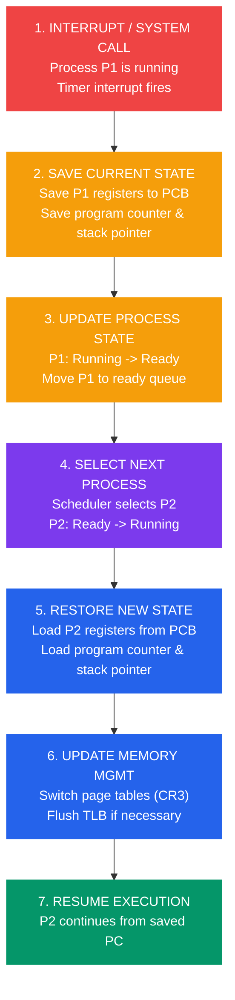
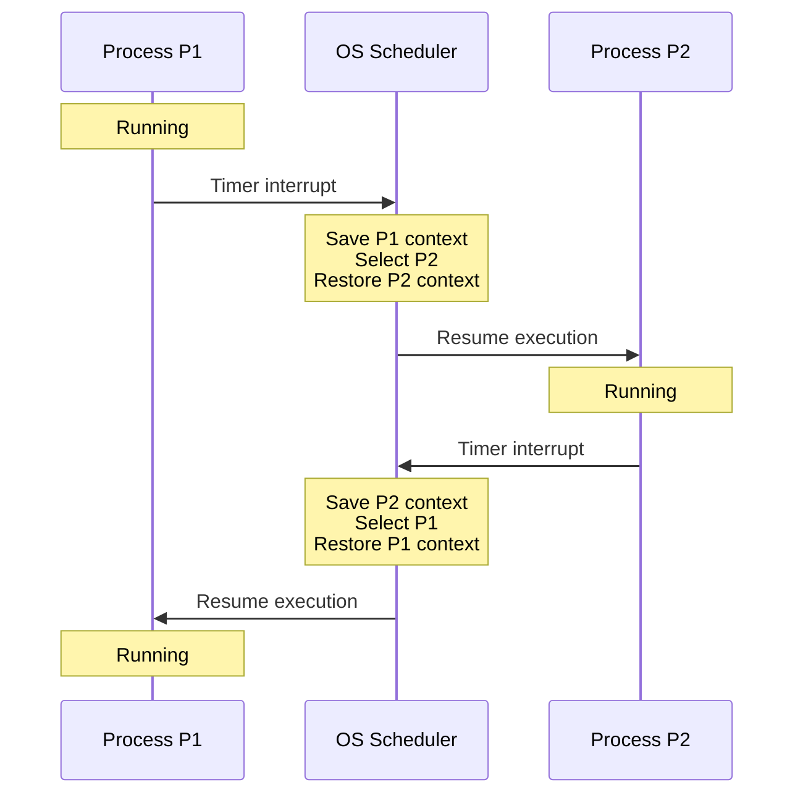

# Context Switching

## What You'll Learn

- What context switching is and why it's necessary
- Components of process context (CPU state, memory, I/O)
- Context switching mechanism and steps
- Overhead and performance implications
- Thread context switching vs process context switching
- How to measure and optimize context switching
- Hardware support for context switching

## Introduction to Context Switching

**Context Switching** is the process of saving the state of a currently running process or thread and restoring the state of the next process or thread to be executed. It's fundamental to multitasking operating systems.

### Why Context Switching?

```
Single CPU, Multiple Processes:

Time →
CPU: [P1] → Switch → [P2] → Switch → [P3] → Switch → [P1] ...

Without Context Switching:
- Only one process runs until completion
- No multitasking
- Poor resource utilization

With Context Switching:
✓ Multiple processes appear to run simultaneously
✓ Better CPU utilization
✓ Responsive user experience
✓ Time-sharing capability
```

## Process Context

The **context** of a process includes all information needed to resume execution:

```
Process Context Components:

┌─────────────────────────────────┐
│     CPU State (Registers)       │
├─────────────────────────────────┤
│  • Program Counter (PC)         │
│  • Stack Pointer (SP)           │
│  • General Purpose Registers    │
│  • Condition Codes              │
│  • Floating Point Registers     │
└─────────────────────────────────┘
         ↓
┌─────────────────────────────────┐
│     Process Control Block       │
├─────────────────────────────────┤
│  • Process ID (PID)             │
│  • Process State                │
│  • Priority                     │
│  • Program Counter              │
│  • CPU Registers                │
│  • Memory Management Info       │
│  • I/O Status                   │
│  • Accounting Info              │
└─────────────────────────────────┘
         ↓
┌─────────────────────────────────┐
│     Memory Context              │
├─────────────────────────────────┤
│  • Page Tables                  │
│  • Segment Tables               │
│  • Base and Limit Registers     │
└─────────────────────────────────┘
         ↓
┌─────────────────────────────────┐
│     I/O Context                 │
├─────────────────────────────────┤
│  • Open File Descriptors        │
│  • I/O Buffer State             │
│  • Network Connections          │
└─────────────────────────────────┘
```

### Process Control Block (PCB)

| Field | Description | Example Value |
|-------|-------------|---------------|
| **Process ID** | Unique identifier | 1234 |
| **State** | Current state | Running, Ready, Waiting |
| **Program Counter** | Next instruction address | 0x08048000 |
| **CPU Registers** | All register values | EAX=5, EBX=10, etc. |
| **Priority** | Scheduling priority | 20 (nice value) |
| **Memory Limits** | Base and limit | Base=0x1000, Limit=0x5000 |
| **Open Files** | File descriptor table | stdin, stdout, file.txt |
| **Accounting** | CPU usage, time | 2.5 seconds |

## Context Switching Mechanism

### Context Switch Steps



```
Step-by-Step Process:

1. INTERRUPT/SYSTEM CALL OCCURS
   ┌─────────────────────────────┐
   │ Process P1 is running       │
   │ Timer interrupt fires       │
   └─────────────────────────────┘
           ↓

2. SAVE CURRENT PROCESS STATE
   ┌─────────────────────────────┐
   │ Save P1's registers to PCB  │
   │ Save program counter        │
   │ Save stack pointer          │
   └─────────────────────────────┘
           ↓

3. UPDATE PROCESS STATE
   ┌─────────────────────────────┐
   │ P1: Running → Ready         │
   │ Move P1 to ready queue      │
   └─────────────────────────────┘
           ↓

4. SELECT NEXT PROCESS
   ┌─────────────────────────────┐
   │ Scheduler selects P2        │
   │ P2: Ready → Running         │
   └─────────────────────────────┘
           ↓

5. RESTORE NEW PROCESS STATE
   ┌─────────────────────────────┐
   │ Load P2's registers from PCB│
   │ Load program counter        │
   │ Load stack pointer          │
   └─────────────────────────────┘
           ↓

6. UPDATE MEMORY MANAGEMENT
   ┌─────────────────────────────┐
   │ Switch page tables (CR3)    │
   │ Flush TLB if necessary      │
   └─────────────────────────────┘
           ↓

7. RESUME EXECUTION
   ┌─────────────────────────────┐
   │ P2 continues execution      │
   │ from saved PC               │
   └─────────────────────────────┘
```

### Timeline Visualization



```
Time →
0ms        5ms       10ms      15ms      20ms
|          |          |          |          |
[  P1 Running  ][Switch][ P2 Running ][Switch][ P1 Running ]
                  ↑                      ↑
                  |                      |
            Context Switch         Context Switch
            (1-2 ms overhead)      (1-2 ms overhead)
```

## Context Switching Code Example

### Assembly-Level Context Switch

```c
// Simplified context switch in C (x86 architecture)

typedef struct {
    uint32_t eax, ebx, ecx, edx;
    uint32_t esi, edi, esp, ebp;
    uint32_t eip;  // Program counter
    uint32_t eflags;
    uint32_t cr3;  // Page directory base register
} context_t;

// Save current context
void save_context(context_t *ctx) {
    asm volatile(
        "movl %%eax, %0\n\t"
        "movl %%ebx, %1\n\t"
        "movl %%ecx, %2\n\t"
        "movl %%edx, %3\n\t"
        "movl %%esi, %4\n\t"
        "movl %%edi, %5\n\t"
        "movl %%esp, %6\n\t"
        "movl %%ebp, %7\n\t"
        : "=m"(ctx->eax), "=m"(ctx->ebx), "=m"(ctx->ecx), "=m"(ctx->edx),
          "=m"(ctx->esi), "=m"(ctx->edi), "=m"(ctx->esp), "=m"(ctx->ebp)
    );
}

// Restore context
void restore_context(context_t *ctx) {
    asm volatile(
        "movl %0, %%eax\n\t"
        "movl %1, %%ebx\n\t"
        "movl %2, %%ecx\n\t"
        "movl %3, %%edx\n\t"
        "movl %4, %%esi\n\t"
        "movl %5, %%edi\n\t"
        "movl %6, %%esp\n\t"
        "movl %7, %%ebp\n\t"
        :
        : "m"(ctx->eax), "m"(ctx->ebx), "m"(ctx->ecx), "m"(ctx->edx),
          "m"(ctx->esi), "m"(ctx->edi), "m"(ctx->esp), "m"(ctx->ebp)
    );
}

// Complete context switch
void context_switch(context_t *old_ctx, context_t *new_ctx) {
    // Save current process context
    save_context(old_ctx);
    
    // Switch page tables (if different address spaces)
    if (old_ctx->cr3 != new_ctx->cr3) {
        asm volatile("movl %0, %%cr3" : : "r"(new_ctx->cr3));
    }
    
    // Restore new process context
    restore_context(new_ctx);
}
```

### Linux Context Switch (Simplified)

```c
// Simplified from Linux kernel (kernel/sched/core.c)

static void context_switch(struct rq *rq, struct task_struct *prev,
                           struct task_struct *next) {
    // Prepare memory management
    struct mm_struct *mm, *oldmm;
    
    // Architecture-specific preparation
    prepare_task_switch(rq, prev, next);
    
    mm = next->mm;
    oldmm = prev->active_mm;
    
    // Switch memory context
    if (!mm) {
        // Kernel thread
        next->active_mm = oldmm;
        atomic_inc(&oldmm->mm_count);
    } else {
        // User process - switch page tables
        switch_mm(oldmm, mm, next);
    }
    
    // Switch CPU context (registers, stack, etc.)
    switch_to(prev, next, prev);
    
    // Finish the switch
    finish_task_switch(prev);
}
```

### User-Space Context Switch Example

```c
// User-level thread context switch using getcontext/setcontext

#include <stdio.h>
#include <ucontext.h>
#include <stdlib.h>

#define STACK_SIZE 8192

ucontext_t main_context, thread1_context, thread2_context;
char thread1_stack[STACK_SIZE];
char thread2_stack[STACK_SIZE];

void thread1_func() {
    for (int i = 0; i < 3; i++) {
        printf("Thread 1: iteration %d\n", i);
        swapcontext(&thread1_context, &thread2_context);  // Switch to thread 2
    }
}

void thread2_func() {
    for (int i = 0; i < 3; i++) {
        printf("Thread 2: iteration %d\n", i);
        swapcontext(&thread2_context, &thread1_context);  // Switch to thread 1
    }
}

int main() {
    // Initialize thread 1 context
    getcontext(&thread1_context);
    thread1_context.uc_stack.ss_sp = thread1_stack;
    thread1_context.uc_stack.ss_size = STACK_SIZE;
    thread1_context.uc_link = &main_context;
    makecontext(&thread1_context, thread1_func, 0);
    
    // Initialize thread 2 context
    getcontext(&thread2_context);
    thread2_context.uc_stack.ss_sp = thread2_stack;
    thread2_context.uc_stack.ss_size = STACK_SIZE;
    thread2_context.uc_link = &main_context;
    makecontext(&thread2_context, thread2_func, 0);
    
    printf("Starting context switching...\n");
    swapcontext(&main_context, &thread1_context);  // Start thread 1
    printf("Back to main context\n");
    
    return 0;
}
```

## Context Switching Overhead

### Performance Cost

```
Context Switch Overhead Components:

1. Direct Costs:
   ├─ Save registers (10-50 cycles)
   ├─ Switch page tables (50-100 cycles)
   ├─ Restore registers (10-50 cycles)
   └─ Total: ~100-200 CPU cycles

2. Indirect Costs:
   ├─ TLB flush (100-1000 cycles per miss)
   ├─ Cache pollution (1000-10000 cycles)
   ├─ Pipeline flush (10-50 cycles)
   └─ Total: Can be 10-100x direct cost

Typical Total Overhead: 1-5 microseconds
(varies by CPU, cache size, and workload)
```

### Measurement Example

```bash
#!/bin/bash
# Measure context switch time on Linux

# Using vmstat to see context switches
vmstat 1 5

# Output:
# procs -----------memory---------- ---swap-- -----io---- -system-- ------cpu-----
#  r  b   swpd   free   buff  cache   si   so    bi    bo   in   cs us sy id wa st
#  1  0      0 2048512 150412 1234096  0    0     0     0  500 5000  5  2 93  0  0
#                                                              ↑
#                                                    Context Switches per second

# Using lmbench for precise measurement
sudo apt-get install lmbench
lat_ctx -s 0 2

# Output: Context switching - times in microseconds
# 2 processes: 2.41 microseconds
```

### Context Switch Cost Comparison

| Operation | Time | Context Switches Equivalent |
|-----------|------|----------------------------|
| L1 cache access | 1 ns | 0.0005 |
| L2 cache access | 5 ns | 0.0025 |
| Main memory access | 100 ns | 0.05 |
| **Context Switch** | **2-5 μs** | **1** |
| System call | 1-10 μs | 0.5-5 |
| Process creation | 100-1000 μs | 50-500 |
| Disk I/O | 5-10 ms | 2500-5000 |

## Process vs Thread Context Switching

### Process Context Switch

```
Process Context Switch:

Heavy Weight:
├─ Save all CPU registers
├─ Save memory management info
├─ Switch page tables (CR3 register)
├─ Flush TLB (Translation Lookaside Buffer)
├─ Cache pollution (different memory space)
└─ Total time: 3-5 microseconds

Memory Spaces:
Process 1: [0x1000-0x9000] → Process 2: [0xA000-0xF000]
           (Completely different)
```

### Thread Context Switch

```
Thread Context Switch:

Light Weight:
├─ Save CPU registers
├─ Switch stack pointer
├─ Keep same page table (same address space)
├─ No TLB flush
├─ Better cache locality
└─ Total time: 0.5-1 microseconds

Memory Spaces:
Thread 1: [Stack at 0x5000] → Thread 2: [Stack at 0x6000]
          (Shared heap, code, data)
```

### Comparison Table

| Aspect | Process Context Switch | Thread Context Switch |
|--------|----------------------|----------------------|
| **Time** | 3-5 μs | 0.5-1 μs |
| **Memory Space** | Different | Shared |
| **Page Table Switch** | Yes | No |
| **TLB Flush** | Yes | No |
| **Cache Impact** | High | Low |
| **Registers Saved** | All | Fewer |
| **Use Case** | Isolation needed | Shared data, performance critical |

## Minimizing Context Switch Overhead

### Techniques

```
1. Reduce Context Switch Frequency:
   ├─ Larger time quantum (less frequent switches)
   ├─ Use threads instead of processes
   ├─ Batch operations
   └─ Async I/O to avoid blocking

2. Hardware Support:
   ├─ Tagged TLB (keep multiple address space entries)
   ├─ ASID (Address Space Identifier)
   ├─ Hardware page table walkers
   └─ Larger caches

3. Software Optimizations:
   ├─ CPU affinity (keep process on same CPU)
   ├─ Lazy FPU state saving
   ├─ User-level threads
   └─ Cooperative scheduling
```

### CPU Affinity Example

```c
// Set CPU affinity in Linux
#define _GNU_SOURCE
#include <sched.h>
#include <stdio.h>
#include <stdlib.h>
#include <unistd.h>

void set_cpu_affinity(int cpu_id) {
    cpu_set_t cpuset;
    CPU_ZERO(&cpuset);
    CPU_SET(cpu_id, &cpuset);
    
    if (sched_setaffinity(0, sizeof(cpuset), &cpuset) == -1) {
        perror("sched_setaffinity");
        exit(1);
    }
    
    printf("Process bound to CPU %d\n", cpu_id);
}

int main() {
    // Pin this process to CPU 0
    set_cpu_affinity(0);
    
    // Do work...
    for (int i = 0; i < 1000000; i++) {
        // CPU-bound work
    }
    
    return 0;
}
```

### Monitoring Context Switches

```bash
#!/bin/bash
# Monitor context switches for a process

# Get PID of process
PID=$(pgrep myapp)

# Watch voluntary and involuntary context switches
while true; do
    grep ctxt_switches /proc/$PID/status
    sleep 1
done

# Output:
# voluntary_ctxt_switches: 1234
# nonvoluntary_ctxt_switches: 567

# voluntary: Process gave up CPU (e.g., I/O wait)
# nonvoluntary: Preempted by scheduler
```

```c
// Program to measure its own context switches
#include <stdio.h>
#include <stdlib.h>
#include <string.h>
#include <unistd.h>

void get_context_switches(long *voluntary, long *involuntary) {
    FILE *f = fopen("/proc/self/status", "r");
    char line[256];
    
    while (fgets(line, sizeof(line), f)) {
        if (strncmp(line, "voluntary_ctxt_switches:", 24) == 0) {
            sscanf(line + 24, "%ld", voluntary);
        } else if (strncmp(line, "nonvoluntary_ctxt_switches:", 27) == 0) {
            sscanf(line + 27, "%ld", involuntary);
        }
    }
    fclose(f);
}

int main() {
    long vol1, invol1, vol2, invol2;
    
    get_context_switches(&vol1, &invol1);
    
    // Do some work
    for (int i = 0; i < 1000000; i++) {
        // Simulate work
    }
    
    get_context_switches(&vol2, &invol2);
    
    printf("Context switches during execution:\n");
    printf("  Voluntary: %ld\n", vol2 - vol1);
    printf("  Involuntary: %ld\n", invol2 - invol1);
    
    return 0;
}
```

## Real-World Impact

### Server Example

```
Web Server Handling 1000 Requests/sec:

Scenario 1: Process per Request
├─ 1000 context switches/sec × 5 μs = 5 ms CPU time
├─ Plus cache/TLB misses: ~50 ms total
└─ 5% CPU overhead

Scenario 2: Thread per Request
├─ 1000 context switches/sec × 1 μs = 1 ms CPU time
├─ Less cache impact: ~10 ms total
└─ 1% CPU overhead

Scenario 3: Event Loop (Async I/O)
├─ Minimal context switches
├─ Single thread handles all requests
└─ 0.1% CPU overhead
```

## Hardware Support for Context Switching

### x86 Task State Segment (TSS)

```
Hardware Context Switch Support:

Intel x86:
┌──────────────────────────────┐
│ Task State Segment (TSS)     │
├──────────────────────────────┤
│  EIP (Program Counter)       │
│  EFLAGS                      │
│  EAX, EBX, ECX, EDX          │
│  ESI, EDI, EBP, ESP          │
│  Segment Registers           │
│  CR3 (Page Directory)        │
└──────────────────────────────┘

Hardware task switch (rarely used):
- Single instruction: JMP TSS_DESCRIPTOR
- Automatic save/restore
- High overhead (200-300 cycles)
- Modern OSes use software switching (faster)
```

### ARM Context ID Register

```
ARM Architecture:

CONTEXTIDR (Context ID Register):
- Identifies current process
- Used by debug and trace units
- Fast process identification
- No TLB flush needed for debug
```

## Exercises

### Beginner

1. Explain the difference between a context switch and a mode switch (user to kernel mode).

2. List five pieces of information stored in a Process Control Block.

3. Why do thread context switches have less overhead than process context switches?

### Intermediate

4. Write a program that measures the context switch time on your system using the `getrusage()` system call.

5. Calculate the overhead: If a system performs 10,000 context switches per second, and each switch takes 3 μs, what percentage of CPU time is spent on context switching?

6. Explain how CPU affinity can improve performance by reducing context switch overhead.

### Advanced

7. Implement a simple cooperative threading library with context switching using `setjmp`/`longjmp` in C.

8. Analyze the impact of context switches on your application:
   ```bash
   # Run your program
   ./myapp &
   PID=$!
   
   # Monitor for 60 seconds
   for i in {1..60}; do
       grep ctxt /proc/$PID/status >> context_switches.log
       sleep 1
   done
   
   # Analyze the data
   awk '/voluntary/ {v+=$2} /nonvoluntary/ {nv+=$2} 
        END {print "Avg voluntary/sec:", v/60; 
             print "Avg nonvoluntary/sec:", nv/60}' context_switches.log
   ```

9. Research and compare context switching mechanisms in different architectures (x86, ARM, RISC-V).

## Key Takeaways

- Context switching enables multitasking by saving and restoring process state
- Process context includes CPU registers, memory management info, and I/O state
- Context switches have both direct (register save/restore) and indirect (cache/TLB) costs
- Thread context switches are faster than process context switches (shared memory space)
- Typical context switch overhead: 1-5 microseconds
- Minimizing context switches improves performance (batching, async I/O, threads)
- Hardware features like tagged TLB reduce context switching cost
- Monitoring voluntary vs involuntary context switches helps identify performance issues

## Next Steps

Continue to [Inter-Process Communication (IPC)](./05_ipc.md) to learn how processes share data and coordinate.

---

[← Previous: CPU Scheduling](./03_cpu_scheduling.md) | [Next: Inter-Process Communication →](./05_ipc.md)
