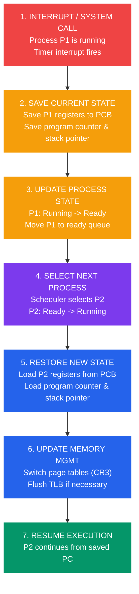
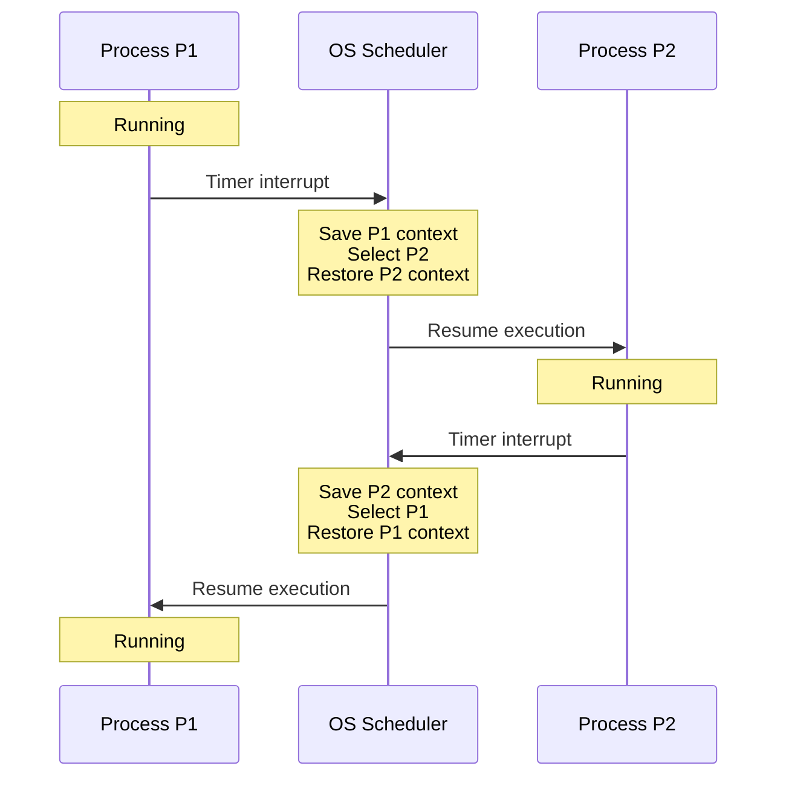

# Context Switching

## What You'll Learn

- Context switching kya hota hai aur yeh zaruri kyun hai
- Process context ke components (CPU state, memory, I/O)
- Context switching ka mechanism aur steps
- Overhead aur performance implications
- Thread context switching vs process context switching
- Context switching ko measure aur optimize kaise karein
- Hardware support for context switching

## Context Switching — Introduction

Socho tum Swiggy delivery boy ho aur ek saath 5 orders manage kar rahe ho. Tum ek order deliver karne jaate ho, beech mein customer ka call aata hai dusre order ke baare mein, toh tum pehle wale order ka "state" yaad rakhte ho (kahan tak pahuncha tha, kya baaki hai) aur dusre order pe switch kar jaate ho. Jab wapas pehle order pe aate ho, tum exactly wahin se continue karte ho jahan chhoda tha.

CPU bhi bilkul yahi karta hai. **Context Switching** matlab hai — currently running process/thread ka poora state (registers, program counter, memory info) save karke, agle process/thread ka saved state restore karna, taaki wo exactly wahin se resume ho jaha usse rok diya gaya tha. Yeh poore multitasking operating system ka backbone hai.

### Context Switching Zaruri Kyun Hai?

```
Single CPU, Multiple Processes:

Time →
CPU: [P1] → Switch → [P2] → Switch → [P3] → Switch → [P1] ...

Without Context Switching:
- Sirf ek process chalega jab tak wo complete na ho jaaye
- Koi multitasking nahi
- Resource utilization bekaar

With Context Switching:
✓ Multiple processes ek saath chalte hue dikhte hain
✓ Better CPU utilization
✓ Responsive user experience
✓ Time-sharing capability
```

Agar context switching na ho, toh tumhara laptop ek time pe sirf ek hi kaam kar payega — matlab Chrome khola toh Spotify band, VS Code khola toh Chrome freeze. Ek CPU core par actually ek time pe ek hi instruction chalti hai, lekin OS itni fast switching karta hai (millisecond ke andar) ki humein lagta hai sab kuch parallel chal raha hai. Yeh illusion hi hai jo modern computing possible banata hai.

## Process Context

**Process context kya hota hai?** Kisi bhi process ka **context** matlab wo saari information jo uski execution ko exact wahin se resume karne ke liye chahiye jahan usse rok diya gaya tha. Isko aise socho — jaise tum kisi novel ka chapter padh rahe ho aur beech mein rukna pade, toh bookmark laga dete ho page number pe. OS bhi exactly wahi karta hai, bas registers, memory pointers aur file handles ka "bookmark" laga deta hai.

```
Process Context Components:

┌─────────────────────────────────┐
│     CPU State (Registers)       │
├─────────────────────────────────┤
│  • Program Counter (PC)         │
│  • Stack Pointer (SP)           │
│  • General Purpose Registers    │
│  • Condition Codes              │
│  • Floating Point Registers     │
└─────────────────────────────────┘
         ↓
┌─────────────────────────────────┐
│     Process Control Block       │
├─────────────────────────────────┤
│  • Process ID (PID)             │
│  • Process State                │
│  • Priority                     │
│  • Program Counter              │
│  • CPU Registers                │
│  • Memory Management Info       │
│  • I/O Status                   │
│  • Accounting Info              │
└─────────────────────────────────┘
         ↓
┌─────────────────────────────────┐
│     Memory Context              │
├─────────────────────────────────┤
│  • Page Tables                  │
│  • Segment Tables                │
│  • Base and Limit Registers     │
└─────────────────────────────────┘
         ↓
┌─────────────────────────────────┐
│     I/O Context                 │
├─────────────────────────────────┤
│  • Open File Descriptors        │
│  • I/O Buffer State             │
│  • Network Connections          │
└─────────────────────────────────┘
```

Yaani context sirf "CPU ke registers" tak limited nahi hai — isme process ka poora surrounding environment shamil hai: wo kaunse memory pages use kar raha tha, kaunsi files khuli thi, kaunse network sockets open the. Sab kuch bookmark karna padta hai.

### Process Control Block (PCB)

**PCB kya hota hai?** Har process ke liye OS ek data structure maintain karta hai jisme uski poori "identity card" hoti hai — bilkul jaise IRCTC ke system mein tumhara PNR record hota hai jisme tumhara naam, seat number, journey status sab kuch hota hai.

| Field | Description | Example Value |
|-------|-------------|---------------|
| **Process ID** | Unique identifier | 1234 |
| **State** | Current state | Running, Ready, Waiting |
| **Program Counter** | Agli instruction ka address | 0x08048000 |
| **CPU Registers** | Saare register values | EAX=5, EBX=10, etc. |
| **Priority** | Scheduling priority | 20 (nice value) |
| **Memory Limits** | Base aur limit | Base=0x1000, Limit=0x5000 |
| **Open Files** | File descriptor table | stdin, stdout, file.txt |
| **Accounting** | CPU usage, time | 2.5 seconds |

> [!info]
> PCB kernel memory mein store hota hai, user process usse directly access nahi kar sakta. Yeh kernel ka internal record hai — jaise railway ka reservation chart passenger ko directly edit karne nahi diya jaata, sirf dikhaya jaata hai.

## Context Switching Mechanism

### Context Switch Ke Steps

**Actually andar hota kya hai?** Chalo step-by-step dekhte hain ki jab CPU ek process se dusre process pe switch karta hai, toh actually andar kya hota hai. Yeh bilkul restaurant ke waiter jaisa hai — ek table ka order (state) yaad rakhna, kitchen ko batana, dusre table pe jaana, uska order lena.



```
Step-by-Step Process:

1. INTERRUPT/SYSTEM CALL OCCURS
   ┌─────────────────────────────┐
   │ Process P1 chal raha hai    │
   │ Timer interrupt fire hua    │
   └─────────────────────────────┘
           ↓

2. SAVE CURRENT PROCESS STATE
   ┌─────────────────────────────┐
   │ P1 ke registers PCB mein    │
   │ save karo                   │
   │ Program counter save karo   │
   │ Stack pointer save karo     │
   └─────────────────────────────┘
           ↓

3. UPDATE PROCESS STATE
   ┌─────────────────────────────┐
   │ P1: Running → Ready         │
   │ P1 ko ready queue mein daalo│
   └─────────────────────────────┘
           ↓

4. SELECT NEXT PROCESS
   ┌─────────────────────────────┐
   │ Scheduler P2 ko select karta│
   │ hai                         │
   │ P2: Ready → Running         │
   └─────────────────────────────┘
           ↓

5. RESTORE NEW PROCESS STATE
   ┌─────────────────────────────┐
   │ P2 ke registers PCB se      │
   │ load karo                   │
   │ Program counter load karo   │
   │ Stack pointer load karo     │
   └─────────────────────────────┘
           ↓

6. UPDATE MEMORY MANAGEMENT
   ┌─────────────────────────────┐
   │ Page tables switch karo     │
   │ (CR3)                       │
   │ Zaroorat pade toh TLB flush │
   │ karo                        │
   └─────────────────────────────┘
           ↓

7. RESUME EXECUTION
   ┌─────────────────────────────┐
   │ P2 apni saved PC se         │
   │ execution continue karta hai│
   └─────────────────────────────┘
```

Step 1 mein interrupt kyun aata hai? Ho sakta hai timer interrupt ho (time quantum khatam), ho sakta hai P1 ne khud I/O request kiya ho (jaise file read), ya phir higher priority process ready ho gaya ho. Teeno cases mein OS ko decide karna padta hai — "abhi kaun chalega CPU pe?"

Step 6 sabse interesting hai — agar naya process (P2) ka memory space alag hai P1 se, toh **page table switch** karna padta hai, jisse **TLB flush** bhi karna pad sakta hai. Yeh sabse costly step hai, isko thodi der mein detail mein samjhenge.

### Timeline Visualization



```
Time →
0ms        5ms       10ms      15ms      20ms
|          |          |          |          |
[  P1 Running  ][Switch][ P2 Running ][Switch][ P1 Running ]
                  ↑                      ↑
                  |                      |
            Context Switch         Context Switch
            (1-2 ms overhead)      (1-2 ms overhead)
```

Notice karo — jitna time context switch mein jaata hai, wo pure waste hai. Us duration mein CPU koi "useful" kaam nahi kar raha, sirf bookkeeping kar raha hai. Isliye har OS ki koshish rehti hai ki context switches kam se kam ho aur jab hon, fast ho.

## Context Switching Code Example

### Assembly-Level Context Switch

Yeh dekhne mein daunting lagega, lekin idea simple hai — CPU ke saare registers ek struct mein copy karo (save), phir dusre process ke registers ko wapas CPU mein load karo (restore).

```c
// Simplified context switch in C (x86 architecture)

typedef struct {
    uint32_t eax, ebx, ecx, edx;
    uint32_t esi, edi, esp, ebp;
    uint32_t eip;  // Program counter
    uint32_t eflags;
    uint32_t cr3;  // Page directory base register
} context_t;

// Save current context
void save_context(context_t *ctx) {
    asm volatile(
        "movl %%eax, %0\n\t"
        "movl %%ebx, %1\n\t"
        "movl %%ecx, %2\n\t"
        "movl %%edx, %3\n\t"
        "movl %%esi, %4\n\t"
        "movl %%edi, %5\n\t"
        "movl %%esp, %6\n\t"
        "movl %%ebp, %7\n\t"
        : "=m"(ctx->eax), "=m"(ctx->ebx), "=m"(ctx->ecx), "=m"(ctx->edx),
          "=m"(ctx->esi), "=m"(ctx->edi), "=m"(ctx->esp), "=m"(ctx->ebp)
    );
}

// Restore context
void restore_context(context_t *ctx) {
    asm volatile(
        "movl %0, %%eax\n\t"
        "movl %1, %%ebx\n\t"
        "movl %2, %%ecx\n\t"
        "movl %3, %%edx\n\t"
        "movl %4, %%esi\n\t"
        "movl %5, %%edi\n\t"
        "movl %6, %%esp\n\t"
        "movl %7, %%ebp\n\t"
        :
        : "m"(ctx->eax), "m"(ctx->ebx), "m"(ctx->ecx), "m"(ctx->edx),
          "m"(ctx->esi), "m"(ctx->edi), "m"(ctx->esp), "m"(ctx->ebp)
    );
}

// Complete context switch
void context_switch(context_t *old_ctx, context_t *new_ctx) {
    // Save current process context
    save_context(old_ctx);
    
    // Switch page tables (if different address spaces)
    if (old_ctx->cr3 != new_ctx->cr3) {
        asm volatile("movl %0, %%cr3" : : "r"(new_ctx->cr3));
    }
    
    // Restore new process context
    restore_context(new_ctx);
}
```

`CR3` register wo hai jo current page table ka base address hold karta hai. Jab ismein value change hoti hai, CPU ko pata chal jaata hai "ab hum different memory space mein hain" — aur yehi TLB flush trigger karta hai.

### Linux Context Switch (Simplified)

Ab dekhte hain actual Linux kernel mein (simplified version) context switch kaisa dikhta hai:

```c
// Simplified from Linux kernel (kernel/sched/core.c)

static void context_switch(struct rq *rq, struct task_struct *prev,
                           struct task_struct *next) {
    // Prepare memory management
    struct mm_struct *mm, *oldmm;
    
    // Architecture-specific preparation
    prepare_task_switch(rq, prev, next);
    
    mm = next->mm;
    oldmm = prev->active_mm;
    
    // Switch memory context
    if (!mm) {
        // Kernel thread
        next->active_mm = oldmm;
        atomic_inc(&oldmm->mm_count);
    } else {
        // User process - switch page tables
        switch_mm(oldmm, mm, next);
    }
    
    // Switch CPU context (registers, stack, etc.)
    switch_to(prev, next, prev);
    
    // Finish the switch
    finish_task_switch(prev);
}
```

Interesting cheez notice karo — agar `next` ek **kernel thread** hai (jiska apna koi user-space memory nahi hota, jaise `kworker` threads), toh Linux page table switch **skip** kar deta hai aur previous process ka `active_mm` reuse karta hai. Yeh ek chhota sa optimization hai jo unnecessary TLB flush bacha leta hai — smart engineering ka example.

### User-Space Context Switch Example

Yeh example dikhata hai ki kaise user-space mein bhi (bina kernel involve kiye) hum "cooperative" context switching kar sakte hain `ucontext.h` library use karke. Isko **coroutines** ya **green threads** ka basic idea samajh sakte ho.

```c
// User-level thread context switch using getcontext/setcontext

#include <stdio.h>
#include <ucontext.h>
#include <stdlib.h>

#define STACK_SIZE 8192

ucontext_t main_context, thread1_context, thread2_context;
char thread1_stack[STACK_SIZE];
char thread2_stack[STACK_SIZE];

void thread1_func() {
    for (int i = 0; i < 3; i++) {
        printf("Thread 1: iteration %d\n", i);
        swapcontext(&thread1_context, &thread2_context);  // Switch to thread 2
    }
}

void thread2_func() {
    for (int i = 0; i < 3; i++) {
        printf("Thread 2: iteration %d\n", i);
        swapcontext(&thread2_context, &thread1_context);  // Switch to thread 1
    }
}

int main() {
    // Initialize thread 1 context
    getcontext(&thread1_context);
    thread1_context.uc_stack.ss_sp = thread1_stack;
    thread1_context.uc_stack.ss_size = STACK_SIZE;
    thread1_context.uc_link = &main_context;
    makecontext(&thread1_context, thread1_func, 0);
    
    // Initialize thread 2 context
    getcontext(&thread2_context);
    thread2_context.uc_stack.ss_sp = thread2_stack;
    thread2_context.uc_stack.ss_size = STACK_SIZE;
    thread2_context.uc_link = &main_context;
    makecontext(&thread2_context, thread2_func, 0);
    
    printf("Starting context switching...\n");
    swapcontext(&main_context, &thread1_context);  // Start thread 1
    printf("Back to main context\n");
    
    return 0;
}
```

Yahan `swapcontext()` call hi actual context switch kar raha hai — bina kernel ki madad ke! Yeh scheduler-less, purely programmer-controlled switching hai (Node.js jaise event-loop languages mein similar concept internally use hota hai, though implementation different hai).

## Context Switching Overhead

### Performance Cost

**Context switch ki cost kitni hai?** Yaha ek important sawaal aata hai — context switch "free" nahi hai, iski ek cost hai. Socho jaise Zomato delivery boy ek order beech mein chhodke dusra pickup karne jaaye — jitna time route change karne mein jaata hai (bike mudna, naya address search karna), utna time "wasted" hai jo actual delivery mein nahi laga.

```
Context Switch Overhead Components:

1. Direct Costs:
   ├─ Registers save karna (10-50 cycles)
   ├─ Page tables switch karna (50-100 cycles)
   ├─ Registers restore karna (10-50 cycles)
   └─ Total: ~100-200 CPU cycles

2. Indirect Costs:
   ├─ TLB flush (100-1000 cycles per miss)
   ├─ Cache pollution (1000-10000 cycles)
   ├─ Pipeline flush (10-50 cycles)
   └─ Total: Direct cost ka 10-100x tak ho sakta hai

Typical Total Overhead: 1-5 microseconds
(CPU, cache size, aur workload ke hisaab se vary karta hai)
```

> [!warning]
> Sabse bada cost **direct** registers save/restore nahi hai — wo toh sirf 100-200 cycles hai. Asli maar padti hai **indirect costs** se — cache aur TLB "cold" ho jaate hain naye process ke liye, matlab jo data pehle CPU cache mein tha (fast access), wo purge ho jaata hai aur naye process ko phir se main memory se fetch karna padta hai (slow access). Isko **cache pollution** kehte hain.

### Measurement Example

Chalo dekhte hain apne Linux system pe context switches ko practically kaise measure karein:

```bash
#!/bin/bash
# Linux pe context switch time measure karna

# vmstat use karke context switches dekhna
vmstat 1 5

# Output:
# procs -----------memory---------- ---swap-- -----io---- -system-- ------cpu-----
#  r  b   swpd   free   buff  cache   si   so    bi    bo   in   cs us sy id wa st
#  1  0      0 2048512 150412 1234096  0    0     0     0  500 5000  5  2 93  0  0
#                                                              ↑
#                                                    Per second context switches

# Precise measurement ke liye lmbench use karo
sudo apt-get install lmbench
lat_ctx -s 0 2

# Output: Context switching - times in microseconds
# 2 processes: 2.41 microseconds
```

`vmstat` ke output mein `cs` column dekho — yeh batata hai per second kitne context switches ho rahe hain. Agar yeh number bohot high hai (jaise lakhs mein) tumhare production server par, toh samajh lo kuch gadbad hai — ya toh bohot saari threads/processes contend kar rahi hain CPU ke liye, ya phir koi busy-loop/polling ho raha hai jo unnecessary switching cause kar raha hai.

### Context Switch Cost Comparison

Perspective ke liye dekhte hain context switch ki cost kitni bada hai baaki operations ke muqable mein:

| Operation | Time | Context Switches ke Equivalent |
|-----------|------|----------------------------|
| L1 cache access | 1 ns | 0.0005 |
| L2 cache access | 5 ns | 0.0025 |
| Main memory access | 100 ns | 0.05 |
| **Context Switch** | **2-5 μs** | **1** |
| System call | 1-10 μs | 0.5-5 |
| Process creation | 100-1000 μs | 50-500 |
| Disk I/O | 5-10 ms | 2500-5000 |

Dekho — ek context switch, L1 cache access se ~2000-5000 guna slow hai! Yehi wajah hai ki high-performance systems (jaise trading engines, database servers) context switches ko avoid karne ke liye extreme steps lete hain — CPU pinning, lock-free data structures, etc.

## Process vs Thread Context Switching

### Process Context Switch

**Process switch itna bhaari kyun padta hai?** Process context switch **heavyweight** operation hai kyunki har process apna alag, independent memory space rakhta hai — bilkul do alag flats ki tarah, jinme koi shared wall nahi hoti.

```
Process Context Switch:

Heavy Weight:
├─ Saare CPU registers save karna
├─ Memory management info save karna
├─ Page tables switch karna (CR3 register)
├─ TLB flush karna (Translation Lookaside Buffer)
├─ Cache pollution (different memory space)
└─ Total time: 3-5 microseconds

Memory Spaces:
Process 1: [0x1000-0x9000] → Process 2: [0xA000-0xF000]
           (Bilkul alag)
```

### Thread Context Switch

**Toh thread switch halka kyun hota hai?** Thread context switch **lightweight** hota hai kyunki ek hi process ke saare threads apni heap, code aur global data **share** karte hain — sirf har thread ka apna stack aur registers alag hote hain. Isko socho — ek hi PG (paying guest) ke andar do roommates, dono common kitchen aur bathroom share karte hain, bas apna apna bed/table alag hai.

```
Thread Context Switch:

Light Weight:
├─ CPU registers save karna
├─ Stack pointer switch karna
├─ Same page table use karna (same address space)
├─ Koi TLB flush nahi
├─ Better cache locality
└─ Total time: 0.5-1 microseconds

Memory Spaces:
Thread 1: [Stack at 0x5000] → Thread 2: [Stack at 0x6000]
          (Heap, code, data — sab shared)
```

### Comparison Table

| Aspect | Process Context Switch | Thread Context Switch |
|--------|----------------------|----------------------|
| **Time** | 3-5 μs | 0.5-1 μs |
| **Memory Space** | Alag-alag | Shared |
| **Page Table Switch** | Haan | Nahi |
| **TLB Flush** | Haan | Nahi |
| **Cache Impact** | High | Low |
| **Registers Saved** | Saare | Kam |
| **Use Case** | Isolation chahiye | Shared data, performance critical |

> [!tip]
> Yehi wajah hai ki Node.js jaisi runtime single-threaded event loop model use karti hai — heavy context switching se bachne ke liye. Aur jab tumhe true parallelism chahiye Node mein, `worker_threads` use hota hai (threads, processes nahi), kyunki thread switch kaafi sasta hai process switch ke muqable mein.

## Context Switch Overhead Kam Kaise Karein

### Techniques

**Overhead kam kaise karein?** Kuch proven techniques hain jo real systems mein use hoti hain.

```
1. Context Switch Frequency Kam Karo:
   ├─ Bada time quantum rakho (kam frequent switches)
   ├─ Processes ki jagah threads use karo
   ├─ Operations batch karo
   └─ Blocking se bachne ke liye Async I/O use karo

2. Hardware Support:
   ├─ Tagged TLB (multiple address space entries rakhna)
   ├─ ASID (Address Space Identifier)
   ├─ Hardware page table walkers
   └─ Bade caches

3. Software Optimizations:
   ├─ CPU affinity (process ko same CPU pe rakhna)
   ├─ Lazy FPU state saving
   ├─ User-level threads
   └─ Cooperative scheduling
```

Chalo in techniques ko thoda unpack karte hain:

- **Bada time quantum**: Agar OS process ko lamba time deta hai CPU pe rehne ke liye (jaise 50ms ki jagah 100ms), toh per second kam switches honge. Lekin trade-off yeh hai ki responsiveness kam ho sakti hai — agar tumhara UI thread bhi lambe quantum wait kar raha hai, app "hang" jaisa feel hoga.
- **Threads over processes**: Agar tumhe parallel kaam karna hai lekin data share karna hai, threads use karo processes ki jagah — switch cost kaafi kam hoga.
- **Async I/O**: Node.js ka poora selling point yehi hai — jab I/O (DB query, file read, network call) ka wait karna ho, thread ko block mat karo (jo context switch trigger karega), balki event loop ko free rehne do aur callback/promise se result baad mein handle karo.
- **CPU Affinity**: Process ko ek particular CPU core se "pin" kar dena, taaki uska cache warm rahe aur baar baar different cores pe migrate na ho (jisse cache cold ho jaata).

### CPU Affinity Example

```c
// Linux mein CPU affinity set karna
#define _GNU_SOURCE
#include <sched.h>
#include <stdio.h>
#include <stdlib.h>
#include <unistd.h>

void set_cpu_affinity(int cpu_id) {
    cpu_set_t cpuset;
    CPU_ZERO(&cpuset);
    CPU_SET(cpu_id, &cpuset);
    
    if (sched_setaffinity(0, sizeof(cpuset), &cpuset) == -1) {
        perror("sched_setaffinity");
        exit(1);
    }
    
    printf("Process bound to CPU %d\n", cpu_id);
}

int main() {
    // Is process ko CPU 0 pe pin karo
    set_cpu_affinity(0);
    
    // Kaam karo...
    for (int i = 0; i < 1000000; i++) {
        // CPU-bound work
    }
    
    return 0;
}
```

Yeh production systems mein kaafi common hai — jaise Kubernetes mein CPU-intensive pods ko dedicated cores allocate karna (`CPU pinning`), taaki wo baar baar migrate na ho aur cache locality maintain rahe.

### Context Switches Monitor Karna

Agar tum debug kar rahe ho ki tumhara application slow kyun hai, context switches check karna ek acha starting point hai:

```bash
#!/bin/bash
# Ek process ke context switches monitor karo

# Process ka PID lo
PID=$(pgrep myapp)

# Voluntary aur involuntary context switches dekho
while true; do
    grep ctxt_switches /proc/$PID/status
    sleep 1
done

# Output:
# voluntary_ctxt_switches: 1234
# nonvoluntary_ctxt_switches: 567

# voluntary: Process ne khud CPU chhoda (e.g., I/O wait ke liye)
# nonvoluntary: Scheduler ne preempt kiya
```

**Voluntary vs involuntary** ka fark samajhna important hai:
- **Voluntary context switch**: Process khud bola "mujhe abhi CPU nahi chahiye" — jaise usne file read call kiya aur ab disk se result ka wait kar raha hai. Yeh normal hai.
- **Involuntary context switch**: OS ne process ko forcefully hataya CPU se — ya toh uska time quantum khatam ho gaya, ya koi higher priority process aa gaya. Agar involuntary switches bohot zyada hain, matlab CPU pe overcrowding hai — bahut zyada processes competition kar rahe hain limited CPU cores ke liye.

```c
// Apne khud ke context switches measure karne wala program
#include <stdio.h>
#include <stdlib.h>
#include <string.h>
#include <unistd.h>

void get_context_switches(long *voluntary, long *involuntary) {
    FILE *f = fopen("/proc/self/status", "r");
    char line[256];
    
    while (fgets(line, sizeof(line), f)) {
        if (strncmp(line, "voluntary_ctxt_switches:", 24) == 0) {
            sscanf(line + 24, "%ld", voluntary);
        } else if (strncmp(line, "nonvoluntary_ctxt_switches:", 27) == 0) {
            sscanf(line + 27, "%ld", involuntary);
        }
    }
    fclose(f);
}

int main() {
    long vol1, invol1, vol2, invol2;
    
    get_context_switches(&vol1, &invol1);
    
    // Kuch kaam karo
    for (int i = 0; i < 1000000; i++) {
        // Simulate work
    }
    
    get_context_switches(&vol2, &invol2);
    
    printf("Context switches during execution:\n");
    printf("  Voluntary: %ld\n", vol2 - vol1);
    printf("  Involuntary: %ld\n", invol2 - invol1);
    
    return 0;
}
```

## Real-World Impact

### Server Example

**Yeh sab real duniya mein matter kyun karta hai?** Chalo isko real production scenario mein dekhte hain — socho tum ek web server bana rahe ho jo 1000 requests/sec handle karta hai (jaise ek mid-size e-commerce API). Architecture choice se context switch overhead kitna badal jaata hai, dekho:

```
Web Server Handling 1000 Requests/sec:

Scenario 1: Process per Request (jaise purana CGI model)
├─ 1000 context switches/sec × 5 μs = 5 ms CPU time
├─ Plus cache/TLB misses: ~50 ms total
└─ 5% CPU overhead

Scenario 2: Thread per Request (jaise Java ka traditional thread-per-request model)
├─ 1000 context switches/sec × 1 μs = 1 ms CPU time
├─ Kam cache impact: ~10 ms total
└─ 1% CPU overhead

Scenario 3: Event Loop (Async I/O) — jaise Node.js
├─ Minimal context switches
├─ Ek single thread saari requests handle karta hai
└─ 0.1% CPU overhead
```

Yehi exact reason hai ki Node.js jaisi event-loop based runtimes high-concurrency I/O-bound workloads (APIs, chat servers) mein itni efficient hain — wo context switch ka overhead almost khatam kar deti hain kyunki ek hi thread saari concurrent connections handle karta hai, callbacks/promises ke through. Lekin CPU-bound heavy computation ke liye yeh model kaam nahi karta — wahan tumhe worker threads ya separate processes chahiye hi honge.

## Hardware Support for Context Switching

### x86 Task State Segment (TSS)

**Kya hardware khud context switch nahi kar sakta?** Karta hai, lekin practically use nahi hota — dekho kyun.

```
Hardware Context Switch Support:

Intel x86:
┌──────────────────────────────┐
│ Task State Segment (TSS)     │
├──────────────────────────────┤
│  EIP (Program Counter)       │
│  EFLAGS                      │
│  EAX, EBX, ECX, EDX          │
│  ESI, EDI, EBP, ESP          │
│  Segment Registers           │
│  CR3 (Page Directory)        │
└──────────────────────────────┘

Hardware task switch (bahut kam use hota hai):
- Ek hi instruction: JMP TSS_DESCRIPTOR
- Automatic save/restore
- High overhead (200-300 cycles)
- Modern OS software switching use karte hain (faster)
```

Interesting fact — Intel ne hardware-level task switching design kiya tha (TSS ke through), lekin practically Linux jaise modern OS isko **use hi nahi karte** kyunki software-based switching (jo hum upar Linux kernel code mein dekh chuke hain) actually faster hai! Yeh classic example hai ki kaise hardware design decisions kabhi kabhi software evolution se overtake ho jaate hain.

### ARM Context ID Register

```
ARM Architecture:

CONTEXTIDR (Context ID Register):
- Current process identify karta hai
- Debug aur trace units use karte hain
- Fast process identification
- Debug ke liye TLB flush nahi chahiye
```

## Exercises

### Beginner

1. Context switch aur mode switch (user se kernel mode) mein kya fark hai, explain karo.

2. Process Control Block mein store hone wali 5 cheezein list karo.

3. Thread context switches, process context switches se kam overhead wale kyun hote hain?

### Intermediate

4. Ek program likho jo `getrusage()` system call use karke apne system pe context switch time measure kare.

5. Overhead calculate karo: Agar ek system 10,000 context switches per second perform karta hai, aur har switch 3 μs leta hai, toh CPU time ka kitna percentage context switching mein ja raha hai?

6. Explain karo ki CPU affinity kaise performance improve karti hai context switch overhead kam karke.

### Advanced

7. `setjmp`/`longjmp` use karke C mein ek simple cooperative threading library implement karo jisme context switching ho.

8. Apne application par context switches ka impact analyze karo:
   ```bash
   # Apna program run karo
   ./myapp &
   PID=$!
   
   # 60 seconds monitor karo
   for i in {1..60}; do
       grep ctxt /proc/$PID/status >> context_switches.log
       sleep 1
   done
   
   # Data analyze karo
   awk '/voluntary/ {v+=$2} /nonvoluntary/ {nv+=$2} 
        END {print "Avg voluntary/sec:", v/60; 
             print "Avg nonvoluntary/sec:", nv/60}' context_switches.log
   ```

9. Different architectures (x86, ARM, RISC-V) mein context switching mechanisms research karke compare karo.

## Key Takeaways

- Context switching multitasking possible banata hai — process ka state save karke, agle process ka state restore karke
- Process context mein CPU registers, memory management info, aur I/O state shamil hota hai
- Context switches ki direct cost (register save/restore) aur indirect cost (cache/TLB pollution) dono hoti hain
- Thread context switches process context switches se fast hote hain (shared memory space ki wajah se)
- Typical context switch overhead: 1-5 microseconds
- Context switches kam karna performance improve karta hai (batching, async I/O, threads)
- Tagged TLB jaise hardware features context switching cost kam karte hain
- Voluntary vs involuntary context switches monitor karna performance issues identify karne mein madad karta hai

## Next Steps

Continue to [Inter-Process Communication (IPC)](./05_ipc.md) to learn how processes share data and coordinate.

---

[← Previous: CPU Scheduling](./03_cpu_scheduling.md) | [Next: Inter-Process Communication →](./05_ipc.md)
