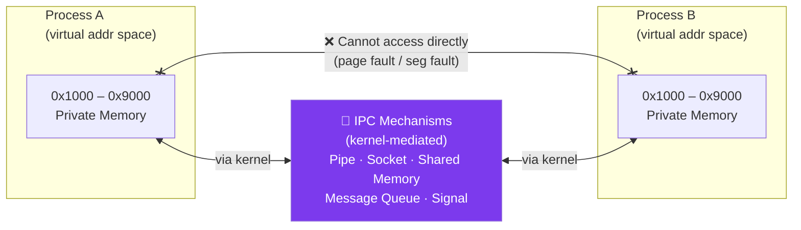

# Inter-Process Communication (IPC)

## What You'll Learn

- IPC kya hota hai aur yeh zaruri kyun hai
- IPC ke mechanisms: pipes, FIFOs, message queues, shared memory, semaphores, sockets
- IPC mein synchronization kaise kaam karti hai
- Alag-alag IPC methods ka comparison aur kab kaunsa use karna hai
- Producer-consumer aur reader-writer problems
- C aur shell scripts mein implementation examples
- POSIX aur System V IPC

## Inter-Process Communication ka Intro

Socho ek second ke liye — tumne Zomato pe order place kiya. Us ek order ke peeche kai alag-alag processes kaam kar rahe hote hain: order-service, payment-service, restaurant-notification-service, delivery-assignment-service. Yeh sab alag-alag processes hain, alag memory space mein chal rahe hain, phir bhi inhe ek doosre se baat karni padti hai — "payment ho gaya", "restaurant ne accept kar liya", "delivery boy assign ho gaya". Yehi communication jo processes ke beech hoti hai, usko hi hum **Inter-Process Communication (IPC)** kehte hain.

**IPC** processes ko ek doosre ke saath data exchange karne aur apne actions ko coordinate karne deta hai. Ab yahan pe ek important cheez samajhna zaruri hai — har process ka apna **alag address space** hota hai. Matlab Process A ki memory, Process B seedha access nahi kar sakta. Yeh koi limitation nahi, balki ek **security aur isolation feature** hai — agar ek process crash ho jaye ya corrupt ho jaye, toh doosre process ka data safe rehta hai. Lekin isi wajah se, jab do processes ko genuinely baat karni ho, unhe koi special mechanism chahiye hota hai jo kernel provide karta hai.

### IPC Kyun Zaruri Hai?

Socho do alag ghar hain (Process A aur Process B), dono ke apne alag locks, apna alag saaman. Agar Process A ko Process B ke ghar ka koi cheez chahiye, toh woh seedha deewar phaad ke andar nahi ja sakta (yeh toh segmentation fault jaisa hoga!). Uske liye ek common route chahiye — jaise ek courier service (yahan par kernel) jo dono ghar ke beech saaman transfer karta hai.



Dekho, dono processes seedha ek doosre se baat nahi kar sakte — beech mein **kernel** ek mediator/bouncer ki tarah khada hai. Kernel hi decide karta hai ki data safely, controlled tareeke se transfer ho, taaki koi process doosre ke memory space mein ghus ke gadbad na kare.

### IPC Use Cases — Real Life Mein Kahan Milta Hai

| Use Case | Example | IPC Method |
|----------|---------|------------|
| **Parent-Child Communication** | Shell pipes: `ls \| grep txt` | Pipe |
| **Client-Server** | Database connections | Socket |
| **Producer-Consumer** | Log processing pipeline | Message Queue |
| **Shared Data** | Multiple readers, one writer | Shared Memory + Semaphore |
| **Event Notification** | GUI event handling | Signal |
| **RPC** | Microservices | Socket, gRPC |

Socho IRCTC ka tatkal booking system — jab lakhon log ek saath ticket book karne ki koshish karte hain, backend mein multiple processes hote hain jo seat availability check karte hain, payment process karte hain, aur PNR generate karte hain. Yeh sab processes ko real-time mein sync mein rehna padta hai — warna do log ek hi seat book kar lenge! Yehi cheez IPC + synchronization mechanisms (semaphores, locks) solve karte hain.

## IPC Mechanisms ka Overview

Har IPC method ka apna trade-off hai — kuch fast hain but limited capacity ke, kuch slow hain but bahut zyada data handle kar sakte hain. Jaise Ola/Uber choose karne jaisa — bike fast hai lekin sirf ek person, cab thoda slow hai lekin zyada log aur saaman.

```
IPC Mechanisms Comparison:

┌────────────────────┬───────────┬──────────┬─────────────┐
│ Mechanism          │ Speed     │ Capacity │ Complexity  │
├────────────────────┼───────────┼──────────┼─────────────┤
│ Pipe               │ Fast      │ Limited  │ Simple      │
│ Named Pipe (FIFO)  │ Fast      │ Limited  │ Simple      │
│ Message Queue      │ Medium    │ Medium   │ Medium      │
│ Shared Memory      │ Fastest   │ Large    │ Complex     │
│ Semaphore          │ Fast      │ N/A      │ Medium      │
│ Socket             │ Medium    │ Large    │ Complex     │
│ Signal             │ Fast      │ Tiny     │ Simple      │
└────────────────────┴───────────┴──────────┴─────────────┘
```

## 1. Pipes

**Pipes** ek unidirectional (yani ek-tarfa) communication channel hai, jo related processes ke beech use hota hai — usually parent-child. Isko socho ek water pipe ki tarah — ek taraf se paani daalo (write), doosri taraf se nikalta hai (read). Paani sirf ek direction mein flow karta hai, ulta nahi ho sakta.

### Anonymous Pipes

Kya hota hai? Jab tum shell mein `ls | grep txt` likhte ho, tab dono commands ke beech OS ek **anonymous pipe** create karta hai. `ls` apna output pipe mein "write" karta hai, aur `grep` usse "read" karta hai — bina kisi temporary file banaye. Yeh pipe naam-less hota hai (isliye "anonymous") aur sirf un processes ke beech kaam karta hai jo ek common parent se derive hue hain (fork() se banaye gaye).

```
Pipe Structure:

Process A (Writer)          Process B (Reader)
     │                           │
     ├──→ [Write FD] ──→ [Kernel Buffer] ──→ [Read FD] ──→│
     │                      (FIFO)                         │
     │                                                     │
  write()                                              read()
```

Yahan `pipefd[2]` array mein do file descriptors milte hain — `pipefd[0]` read end aur `pipefd[1]` write end. Kernel ke andar ek buffer banta hai jo FIFO (First In First Out) order mein data store karta hai.

#### Pipe Example in C

```c
// pipe_example.c
#include <stdio.h>
#include <stdlib.h>
#include <unistd.h>
#include <string.h>

int main() {
    int pipefd[2];  // pipefd[0] = read end, pipefd[1] = write end
    pid_t pid;
    char write_msg[] = "Hello from parent!";
    char read_msg[100];
    
    // Create pipe
    if (pipe(pipefd) == -1) {
        perror("pipe");
        exit(1);
    }
    
    pid = fork();
    
    if (pid == -1) {
        perror("fork");
        exit(1);
    }
    
    if (pid == 0) {
        // Child process - reader
        close(pipefd[1]);  // Close write end
        
        ssize_t n = read(pipefd[0], read_msg, sizeof(read_msg));
        if (n > 0) {
            printf("Child received: %s\n", read_msg);
        }
        
        close(pipefd[0]);
        exit(0);
    } else {
        // Parent process - writer
        close(pipefd[0]);  // Close read end
        
        write(pipefd[1], write_msg, strlen(write_msg) + 1);
        printf("Parent sent: %s\n", write_msg);
        
        close(pipefd[1]);
        wait(NULL);  // Wait for child
    }
    
    return 0;
}
```

> [!tip]
> Notice kiya kaise child apna write end (`pipefd[1]`) close kar deta hai aur parent apna read end (`pipefd[0]`) close kar deta hai? Yeh koi optional cleanup step nahi hai — yeh **zaruri** hai. Agar tum extra file descriptors khule chhod doge jo use nahi ho rahe, toh `read()` kabhi EOF signal nahi milega aur process hमेशा ke liye block ho sakta hai. Socho jaise ek call pe do log ek saath baat kar rahe hain but koi hang up hi nahi kar raha — line kabhi free nahi hogi.

#### Shell Pipe Example

Yeh wahi cheez hai jo tum daily terminal mein use karte ho, bina realize kiye ki peeche IPC ho rahi hai:

```bash
#!/bin/bash
# Pipes in shell commands

# Simple pipe
ls -l | grep ".txt"

# Multiple pipes (pipeline)
cat /var/log/syslog | grep "error" | wc -l

# Named pipe example
mkfifo mypipe

# Terminal 1:
echo "Hello from terminal 1" > mypipe

# Terminal 2:
cat < mypipe

# Cleanup
rm mypipe
```

### Pipe ki Characteristics

```
Pipe Properties:

✓ Unidirectional (one-way communication)
✓ FIFO (First In, First Out)
✓ Data read once and removed from buffer
✓ Limited capacity (typically 64KB)
✓ Blocking: read blocks if empty, write blocks if full
✓ Only between related processes (parent-child)

Limitations:
✗ Cannot be used by unrelated processes
✗ No random access
✗ Data lost if not read
```

Yaad rakho — pipe ka data ek baar read ho gaya toh gone hai, buffer se hat jaata hai. Yeh koi database table nahi hai jahan tum baar-baar query maar sako. Aur capacity bhi limited hoti hai (typically 64KB Linux pe) — agar writer bahut zyada data bhej de bina reader ke padhe, toh writer **block** ho jayega jab tak reader kuch space free na kare.

## 2. Named Pipes (FIFOs)

Ab problem yeh hai ki anonymous pipe sirf related processes (parent-child, ya fork se bane siblings) ke beech kaam karta hai. Agar do bilkul independent programs — jinka koi common ancestor nahi hai — ek doosre se baat karna chahein toh? Iske liye **FIFOs (named pipes)** aate hain.

**FIFOs** named pipes hote hain jo unrelated processes bhi use kar sakte hain, kyunki inka ek naam hota hai filesystem mein (jaise `/tmp/my_fifo`) — jaise WhatsApp group ka naam hota hai jisse koi bhi (jisko invite mila ho) join kar sakta hai, bina yeh jaane ki group kisne banaya.

### FIFO Example

```c
// fifo_writer.c
#include <stdio.h>
#include <stdlib.h>
#include <fcntl.h>
#include <sys/stat.h>
#include <unistd.h>
#include <string.h>

#define FIFO_NAME "/tmp/my_fifo"

int main() {
    int fd;
    char *message = "Hello through FIFO!";
    
    // Create FIFO (named pipe)
    mkfifo(FIFO_NAME, 0666);
    
    printf("Writer: Opening FIFO...\n");
    fd = open(FIFO_NAME, O_WRONLY);
    
    printf("Writer: Writing message...\n");
    write(fd, message, strlen(message) + 1);
    
    close(fd);
    printf("Writer: Done.\n");
    
    return 0;
}
```

```c
// fifo_reader.c
#include <stdio.h>
#include <stdlib.h>
#include <fcntl.h>
#include <sys/stat.h>
#include <unistd.h>

#define FIFO_NAME "/tmp/my_fifo"

int main() {
    int fd;
    char buffer[100];
    
    printf("Reader: Opening FIFO...\n");
    fd = open(FIFO_NAME, O_RDONLY);
    
    printf("Reader: Reading message...\n");
    read(fd, buffer, sizeof(buffer));
    printf("Reader: Received: %s\n", buffer);
    
    close(fd);
    unlink(FIFO_NAME);  // Remove FIFO
    
    return 0;
}
```

```bash
# Compile and run
gcc -o writer fifo_writer.c
gcc -o reader fifo_reader.c

# Terminal 1:
./reader

# Terminal 2:
./writer
```

> [!info]
> Notice kiya `mkfifo` ek **special file type** banata hai filesystem mein (`ls -l` karoge toh `p` type dikhega). Yeh actual file nahi hai jisme data store hota hai — yeh ek "rendezvous point" hai. Jab tak koi reader aur writer dono side se `open()` nahi karte, `open()` call **block** ho jaata hai. Bilkul Zomato delivery ki tarah — jab tak delivery boy aur restaurant dono ready na ho, order handoff nahi hoga.

## 3. Message Queues

Pipes aur FIFOs ka ek limitation hai — data ek continuous byte stream hota hai, koi "message boundaries" nahi hoti. Agar tumhe structured messages bhejni hain (jaise "yeh ek order hai, yeh ek payment update hai"), toh **Message Queues** kaam aati hain.

**Message Queues** processes ko ek doosre ko structured messages bhejne deti hain — bilkul jaise Kafka ya RabbitMQ jaisi message brokers kaam karti hain (bas yeh OS-level, single-machine version hai). Har message ka apna type/priority hota hai, aur receiver specific type ke messages pick kar sakta hai.

### System V Message Queue

Socho ek restaurant ki kitchen — orders ek queue mein aate hain, har order pe ek "type" hota hai (starter, main course, dessert), aur alag chefs sirf apne type ke orders utha ke banate hain. Yehi kaam `msg_type` field karta hai.

```c
// message_queue.c
#include <stdio.h>
#include <stdlib.h>
#include <string.h>
#include <sys/ipc.h>
#include <sys/msg.h>
#include <unistd.h>

// Message structure
struct message {
    long msg_type;
    char msg_text[100];
};

// Sender
void sender() {
    key_t key;
    int msgid;
    struct message msg;
    
    // Generate unique key
    key = ftok("/tmp", 'A');
    
    // Create message queue
    msgid = msgget(key, 0666 | IPC_CREAT);
    
    // Prepare message
    msg.msg_type = 1;
    strcpy(msg.msg_text, "Hello from sender!");
    
    // Send message
    msgsnd(msgid, &msg, sizeof(msg.msg_text), 0);
    printf("Sender: Message sent: %s\n", msg.msg_text);
}

// Receiver
void receiver() {
    key_t key;
    int msgid;
    struct message msg;
    
    // Generate same key
    key = ftok("/tmp", 'A');
    
    // Connect to message queue
    msgid = msgget(key, 0666 | IPC_CREAT);
    
    // Receive message
    msgrcv(msgid, &msg, sizeof(msg.msg_text), 1, 0);
    printf("Receiver: Message received: %s\n", msg.msg_text);
    
    // Destroy message queue
    msgctl(msgid, IPC_RMID, NULL);
}

int main() {
    pid_t pid = fork();
    
    if (pid == 0) {
        sleep(1);  // Let parent create queue first
        receiver();
    } else {
        sender();
        wait(NULL);
    }
    
    return 0;
}
```

`ftok()` ek unique key generate karta hai jisse dono processes (jo ek doosre ko jaante bhi nahi hain, bas ek common file path aur ek char pe agree kar lete hain) ek hi queue ko refer kar sakte hain. Socho isko ek shared "meeting point code" ki tarah — jaise CRED app pe dono friends ek hi UPI ID daal ke payment link generate kar lete hain.

### POSIX Message Queue

System V ka syntax thoda purana-school hai. POSIX message queue ek zyada modern, file-descriptor-based approach deta hai jo baaki POSIX APIs (jaise files) ke saath consistent feel hota hai.

```c
// posix_mq.c
#include <stdio.h>
#include <stdlib.h>
#include <string.h>
#include <fcntl.h>
#include <sys/stat.h>
#include <mqueue.h>

#define QUEUE_NAME "/my_queue"
#define MAX_SIZE 1024

int main() {
    mqd_t mq;
    struct mq_attr attr;
    char buffer[MAX_SIZE];
    
    // Set queue attributes
    attr.mq_flags = 0;
    attr.mq_maxmsg = 10;
    attr.mq_msgsize = MAX_SIZE;
    attr.mq_curmsgs = 0;
    
    // Create/open queue
    mq = mq_open(QUEUE_NAME, O_CREAT | O_RDWR, 0644, &attr);
    
    if (fork() == 0) {
        // Child - sender
        const char *msg = "Hello from POSIX MQ!";
        mq_send(mq, msg, strlen(msg) + 1, 0);
        printf("Sent: %s\n", msg);
    } else {
        // Parent - receiver
        sleep(1);  // Wait for message
        mq_receive(mq, buffer, MAX_SIZE, NULL);
        printf("Received: %s\n", buffer);
        
        // Cleanup
        mq_close(mq);
        mq_unlink(QUEUE_NAME);
        wait(NULL);
    }
    
    return 0;
}

// Compile: gcc posix_mq.c -o posix_mq -lrt
```

### Message Queue ke Advantages

Pipe ke comparison mein message queues bahut zyada flexible hain:

```
Message Queues vs Pipes:

✓ Bidirectional communication
✓ Message boundaries preserved
✓ Priority-based messaging
✓ Non-blocking options
✓ Persistent (survive process termination)
✓ Multiple readers/writers
```

Yeh "Persistent" wala point important hai — agar sender process crash ho jaye, toh message queue mein wo message abhi bhi safe rehta hai kernel mein, jab tak koi use consume na kare. Yeh Kafka jaisi durability, bas OS-level pe.

```
Use Cases:
- Task queues (job distribution)
- Request/response patterns
- Event-driven systems
- Decoupled microservices
```

Real-world example: Swiggy ka order-assignment system. Jab order aata hai, ek message queue mein daal diya jaata hai, aur available delivery partners (multiple consumer processes) us queue se pick karte hain — jisko pehle mila, usko order assign ho jaata hai. Sender aur receiver ek doosre se directly connected nahi hain — bas queue ke through decoupled tareeke se baat karte hain.

## 4. Shared Memory

Ab tak jitne methods dekhe (pipe, FIFO, message queue) — sab mein data ko **kernel ke through copy** karna padta hai. Process A apna data kernel buffer mein likhta hai, phir kernel se Process B padhta hai. Yeh do copy operations hain — thoda overhead.

**Shared Memory** iss overhead ko poori tarah khatam kar deta hai. Yeh sabse **fastest IPC method** hai, kyunki yahan dono processes literally **ek hi physical memory region** ko apne virtual address space mein map kar lete hain. Ek baar map ho gaya, toh data likhna/padhna seedha memory access jaisa hai — koi kernel call nahi, koi copy nahi.

Socho isko aise — do alag flats hain building mein (do processes), lekin dono ka ek common **shared terrace** hai jahan dono directly access rakh sakte hain. Kisi bhi cheez ko terrace pe rakhne ke liye watchman (kernel) ko bulane ki zarurat nahi — bas seedha jaake rakh do.

```
Shared Memory Architecture:

Process A                 Process B
┌───────────┐            ┌───────────┐
│  Virtual  │            │  Virtual  │
│  Address  │            │  Address  │
│  Space    │            │  Space    │
├───────────┤            ├───────────┤
│ 0x7000 ───┼───┐    ┌───┼─ 0x5000   │
└───────────┘   │    │   └───────────┘
                ↓    ↓
          ┌──────────────┐
          │Shared Memory │
          │  Segment     │
          │  (Physical)  │
          └──────────────┘
```

Dono processes ke virtual addresses alag ho sakte hain (`0x7000` vs `0x5000`), lekin dono underlying **same physical memory frame** ko point karte hain.

> [!warning]
> Speed ke saath ek badi zimmedari aati hai — shared memory **koi built-in synchronization nahi deta**. Agar Process A aur Process B ek saath usi memory pe likhne/padhne ki koshish karein, toh race condition ho sakti hai — data corrupt ho sakta hai. Isiliye shared memory ko **hamesha semaphore ya mutex ke saath** use karte hain (neeche dekhenge).

### System V Shared Memory

```c
// shm_writer.c
#include <stdio.h>
#include <stdlib.h>
#include <string.h>
#include <sys/ipc.h>
#include <sys/shm.h>
#include <unistd.h>

#define SHM_SIZE 1024

int main() {
    key_t key;
    int shmid;
    char *data;
    
    // Generate key
    key = ftok("/tmp", 'R');
    
    // Create shared memory segment
    shmid = shmget(key, SHM_SIZE, 0644 | IPC_CREAT);
    if (shmid == -1) {
        perror("shmget");
        exit(1);
    }
    
    // Attach to shared memory
    data = (char *)shmat(shmid, NULL, 0);
    if (data == (char *)(-1)) {
        perror("shmat");
        exit(1);
    }
    
    printf("Writer: Writing to shared memory...\n");
    strcpy(data, "Hello from shared memory!");
    
    printf("Writer: Data written: %s\n", data);
    
    // Detach from shared memory
    shmdt(data);
    
    return 0;
}
```

```c
// shm_reader.c
#include <stdio.h>
#include <stdlib.h>
#include <sys/ipc.h>
#include <sys/shm.h>
#include <unistd.h>

#define SHM_SIZE 1024

int main() {
    key_t key;
    int shmid;
    char *data;
    
    // Generate same key
    key = ftok("/tmp", 'R');
    
    // Get shared memory segment
    shmid = shmget(key, SHM_SIZE, 0644);
    if (shmid == -1) {
        perror("shmget");
        exit(1);
    }
    
    // Attach to shared memory
    data = (char *)shmat(shmid, NULL, 0);
    if (data == (char *)(-1)) {
        perror("shmat");
        exit(1);
    }
    
    printf("Reader: Reading from shared memory...\n");
    printf("Reader: Data read: %s\n", data);
    
    // Detach from shared memory
    shmdt(data);
    
    // Destroy shared memory segment
    shmctl(shmid, IPC_RMID, NULL);
    
    return 0;
}
```

`shmget()` segment create/reference karta hai, `shmat()` usse process ke apne address space mein "attach" karta hai (map karta hai), aur `shmdt()` detach karta hai. Yaad rakho — jab tak koi `shmctl(shmid, IPC_RMID, ...)` call karke destroy nahi karta, segment kernel mein reh jaata hai — even process crash hone ke baad bhi! Yeh ek common bug hai jahan log `ipcs` command se dekhte hain ki system mein purane, orphaned shared memory segments padi hain jo kisi ne clean nahi kiya.

### POSIX Shared Memory

Modern approach — file-descriptor based, `mmap()` ke saath use hota hai:

```c
// posix_shm.c
#include <stdio.h>
#include <stdlib.h>
#include <string.h>
#include <fcntl.h>
#include <sys/mman.h>
#include <unistd.h>

#define SHM_NAME "/my_shm"
#define SHM_SIZE 1024

int main() {
    int shm_fd;
    void *ptr;
    
    if (fork() == 0) {
        // Child - writer
        sleep(1);  // Wait for parent to create shm
        
        shm_fd = shm_open(SHM_NAME, O_RDWR, 0666);
        ptr = mmap(0, SHM_SIZE, PROT_READ | PROT_WRITE, MAP_SHARED, shm_fd, 0);
        
        sprintf(ptr, "Hello from child process!");
        printf("Child wrote: %s\n", (char *)ptr);
        
        munmap(ptr, SHM_SIZE);
        close(shm_fd);
    } else {
        // Parent - reader
        shm_fd = shm_open(SHM_NAME, O_CREAT | O_RDWR, 0666);
        ftruncate(shm_fd, SHM_SIZE);
        ptr = mmap(0, SHM_SIZE, PROT_READ | PROT_WRITE, MAP_SHARED, shm_fd, 0);
        
        wait(NULL);  // Wait for child to write
        
        printf("Parent read: %s\n", (char *)ptr);
        
        munmap(ptr, SHM_SIZE);
        close(shm_fd);
        shm_unlink(SHM_NAME);
    }
    
    return 0;
}

// Compile: gcc posix_shm.c -o posix_shm -lrt
```

## 5. Semaphores

Ab jaise humne dekha, shared memory fast toh hai lekin khud se koi traffic-control nahi karta. Yahan **Semaphores** kaam aate hain — yeh ek counter-based mechanism hai jo shared resource tak access ko synchronize/control karta hai.

**Semaphores** shared resources tak access ko synchronize karte hain. Socho isko ek building ke parking lot ki tarah — agar sirf 3 parking slots hain (semaphore value = 3), toh sirf 3 cars ek time pe andar aa sakti hain. 4th car ko wait karna padega jab tak koi ek car bahar na nikle.

```
Semaphore Operations:

wait() / P() / down():
    if (sem_value > 0)
        sem_value--;
    else
        block_process();

signal() / V() / up():
    sem_value++;
    wake_up_blocked_process();
```

`wait()` (jise P() ya "down" bhi kehte hain) resource lene ki koshish karta hai — agar available hai toh counter decrement karke aage badh jaata hai, warna process block ho jaata hai. `signal()` (V() ya "up") resource wapas karta hai aur agar koi process wait kar raha tha, usse wake up kar deta hai.

### Binary Semaphore Example

Jab semaphore ki initial value **1** hoti hai, usko "binary semaphore" kehte hain — yeh basically ek **mutex/lock** ki tarah kaam karta hai. Sirf ek thread/process ek time pe critical section mein ja sakta hai.

```c
// semaphore_example.c
#include <stdio.h>
#include <stdlib.h>
#include <pthread.h>
#include <semaphore.h>
#include <unistd.h>

sem_t semaphore;
int shared_counter = 0;

void* increment(void* arg) {
    for (int i = 0; i < 5; i++) {
        sem_wait(&semaphore);  // Lock
        
        // Critical section
        int temp = shared_counter;
        printf("Thread %ld: Reading %d\n", (long)arg, temp);
        usleep(100000);  // Simulate work
        shared_counter = temp + 1;
        printf("Thread %ld: Writing %d\n", (long)arg, shared_counter);
        
        sem_post(&semaphore);  // Unlock
        usleep(100000);
    }
    return NULL;
}

int main() {
    pthread_t t1, t2;
    
    // Initialize semaphore (1 = binary semaphore / mutex)
    sem_init(&semaphore, 0, 1);
    
    pthread_create(&t1, NULL, increment, (void*)1);
    pthread_create(&t2, NULL, increment, (void*)2);
    
    pthread_join(t1, NULL);
    pthread_join(t2, NULL);
    
    printf("Final counter: %d (expected: 10)\n", shared_counter);
    
    sem_destroy(&semaphore);
    return 0;
}

// Compile: gcc semaphore_example.c -o semaphore_example -lpthread
```

Agar yahan `sem_wait()` aur `sem_post()` na hote, toh dono threads ek saath `shared_counter` ko read-modify-write karne ki koshish karte, aur final answer 10 ki jagah 7 ya 8 aa sakta tha — classic **race condition**. Yeh bilkul waise hi hai jaise IRCTC pe ek hi tatkal seat pe do log ek saath book karne ki koshish karein bina kisi lock ke — dono ko confirm mil jayega but train mein seat ek hi hai!

### Producer-Consumer with Semaphores

Yeh ek **classic OS problem** hai jo har jagah milta hai — ek "producer" data generate karta hai, ek "consumer" use consume karta hai, aur beech mein ek fixed-size buffer hota hai. Socho isko Swiggy kitchen ki tarah — chef (producer) dishes banake ek counter (buffer) pe rakhta hai, delivery boy (consumer) wahan se utha ke le jaata hai. Agar counter full hai, chef ko rukna padega. Agar counter empty hai, delivery boy ko wait karna padega.

Teen semaphores use hote hain:
- `empty` — kitne empty slots hain buffer mein (producer isse check karta hai)
- `full` — kitne filled slots hain (consumer isse check karta hai)
- `mutex` — buffer ko access karte waqt mutual exclusion (taaki dono ek saath buffer index modify na karein)

```c
// producer_consumer.c
#include <stdio.h>
#include <stdlib.h>
#include <pthread.h>
#include <semaphore.h>
#include <unistd.h>

#define BUFFER_SIZE 5

int buffer[BUFFER_SIZE];
int in = 0, out = 0;

sem_t empty;  // Count of empty slots
sem_t full;   // Count of full slots
sem_t mutex;  // Mutual exclusion for buffer

void* producer(void* arg) {
    int item;
    for (int i = 0; i < 10; i++) {
        item = rand() % 100;
        
        sem_wait(&empty);  // Wait for empty slot
        sem_wait(&mutex);  // Lock buffer
        
        // Produce item
        buffer[in] = item;
        printf("Producer: Produced %d at position %d\n", item, in);
        in = (in + 1) % BUFFER_SIZE;
        
        sem_post(&mutex);  // Unlock buffer
        sem_post(&full);   // Signal full slot
        
        usleep(rand() % 500000);
    }
    return NULL;
}

void* consumer(void* arg) {
    int item;
    for (int i = 0; i < 10; i++) {
        sem_wait(&full);   // Wait for full slot
        sem_wait(&mutex);  // Lock buffer
        
        // Consume item
        item = buffer[out];
        printf("Consumer: Consumed %d from position %d\n", item, out);
        out = (out + 1) % BUFFER_SIZE;
        
        sem_post(&mutex);  // Unlock buffer
        sem_post(&empty);  // Signal empty slot
        
        usleep(rand() % 500000);
    }
    return NULL;
}

int main() {
    pthread_t prod, cons;
    
    // Initialize semaphores
    sem_init(&empty, 0, BUFFER_SIZE);  // Initially all empty
    sem_init(&full, 0, 0);             // Initially none full
    sem_init(&mutex, 0, 1);            // Binary semaphore
    
    pthread_create(&prod, NULL, producer, NULL);
    pthread_create(&cons, NULL, consumer, NULL);
    
    pthread_join(prod, NULL);
    pthread_join(cons, NULL);
    
    // Cleanup
    sem_destroy(&empty);
    sem_destroy(&full);
    sem_destroy(&mutex);
    
    return 0;
}
```

> [!tip]
> Order dhyan se dekho — `sem_wait(&empty)` pehle aata hai, phir `sem_wait(&mutex)`. Agar tum yeh order ulta kar do (`mutex` pehle lock karo, phir `empty` ke liye wait karo), toh **deadlock** ho sakta hai — kyunki agar buffer full hai aur producer `mutex` hold karke `empty` ka wait kar raha hai, toh consumer kabhi `mutex` le hi nahi payega item consume karne ke liye, aur `empty` kabhi signal hi nahi hoga. Order matter karta hai!

### Reader-Writer Problem

Producer-consumer ke alawa ek aur **classic synchronization problem** hai jo tumhe har jagah milega — **Readers-Writers Problem**. Socho Wikipedia ke kisi popular page ko — usi waqt lakhon log woh page **padh** (read) rahe hote hain, lekin kabhi-kabhi koi editor us page ko **edit** (write) bhi kar raha hota hai. Yahan rule simple hai:

- **Multiple readers** ek saath data padh sakte hain — koi problem nahi, kyunki reading se data change nahi hota.
- **Sirf ek writer** ek time pe likh sakta hai — aur jab writer likh raha ho, koi aur (na reader, na doosra writer) us data ko touch nahi kar sakta.

Real-life analogy socho — IRCTC ka **seat availability display**. Lakhon log ek saath train ki seat availability check kar rahe hain (readers) — sabko simultaneously dikhna chahiye, isse koi fark nahi padta kitne log ek saath dekh rahe hain. Lekin jis moment backend system seat allocate karta hai (writer — data update ho raha hai), us waqt tak koi aur na toh naya read kar sakta hai na koi doosra write — warna log stale ya corrupt availability dekh lenge, aur do logon ko ek hi seat "available" dikh sakti hai.

Isko solve karne ke liye do semaphores aur ek counter use hota hai:

- `rw_mutex` — binary semaphore jo **writer ko exclusive access** deta hai
- `mutex` — `read_count` variable ko protect karta hai (kyunki multiple readers isko simultaneously modify kar sakte hain)
- `read_count` — kitne readers is waqt data padh rahe hain, iska counter

Trick yeh hai: **pehla reader** jo aata hai, woh `rw_mutex` lock kar leta hai (taaki writer block ho jaye), aur **aakhri reader** jo nikalta hai, woh `rw_mutex` unlock kar deta hai. Beech ke readers ko `rw_mutex` se koi matlab nahi — woh sirf `read_count` increment/decrement karte hain.

```c
// reader_writer.c
#include <stdio.h>
#include <stdlib.h>
#include <pthread.h>
#include <semaphore.h>
#include <unistd.h>

sem_t rw_mutex;   // Writer ko exclusive access dene ke liye
sem_t mutex;      // read_count ko protect karne ke liye
int read_count = 0;
int shared_data = 0;

void* reader(void* arg) {
    long id = (long)arg;

    sem_wait(&mutex);
    read_count++;
    if (read_count == 1) {
        sem_wait(&rw_mutex);   // Pehla reader writer ko block karta hai
    }
    sem_post(&mutex);

    // Critical section - reading
    printf("Reader %ld: Data = %d\n", id, shared_data);
    usleep(200000);

    sem_wait(&mutex);
    read_count--;
    if (read_count == 0) {
        sem_post(&rw_mutex);  // Aakhri reader writer ko unblock karta hai
    }
    sem_post(&mutex);

    return NULL;
}

void* writer(void* arg) {
    long id = (long)arg;

    sem_wait(&rw_mutex);   // Exclusive access lo

    // Critical section - writing
    shared_data++;
    printf("Writer %ld: Updated data to %d\n", id, shared_data);
    usleep(300000);

    sem_post(&rw_mutex);   // Access release karo

    return NULL;
}

int main() {
    pthread_t readers[3], writers[2];

    sem_init(&rw_mutex, 0, 1);
    sem_init(&mutex, 0, 1);

    for (long i = 0; i < 3; i++) pthread_create(&readers[i], NULL, reader, (void*)i);
    for (long i = 0; i < 2; i++) pthread_create(&writers[i], NULL, writer, (void*)i);

    for (int i = 0; i < 3; i++) pthread_join(readers[i], NULL);
    for (int i = 0; i < 2; i++) pthread_join(writers[i], NULL);

    sem_destroy(&rw_mutex);
    sem_destroy(&mutex);

    return 0;
}

// Compile: gcc reader_writer.c -o reader_writer -lpthread
```

> [!warning]
> Yeh wala version **"readers-preference"** solution hai — jab tak readers aate rahenge, writer humesha wait karta rahega, kyunki koi na koi reader hamesha `read_count > 0` rakh sakta hai. Isse **writer starvation** ho sakta hai — writer ko kabhi chance hi nahi milega! Real systems (jaise database engines) isse avoid karne ke liye "fair" ya "writer-preference" solutions use karte hain, jahan ek naya writer aane ke baad naye readers ko queue mein rok diya jaata hai jab tak writer apna kaam na kar le. Socho jaise IRCTC pe agar ek admin maintenance update push kar raha hai, toh naye users ko thoda wait karwaya jaata hai taaki update jaldi lag jaye — warna admin ka update kabhi complete hi nahi hoga agar traffic continuous flow mein aata rahe.

## 6. Sockets

Ab tak jo bhi mechanisms dekhe — pipe, FIFO, message queue, shared memory, semaphore — yeh sab **same machine** ke andar processes ke beech kaam karte hain. Lekin agar Process A ek machine pe hai aur Process B kisi doosre machine (ya server) pe hai, toh? Yahan **Sockets** kaam aate hain.

**Sockets** same machine ya different machines pe chal rahe processes ke beech communication enable karte hain. Yeh basically network communication ka foundation hai — jab tum browser se koi website open karte ho, tumhara browser aur server ke beech socket connection banta hai.

### Unix Domain Socket

Interesting baat yeh hai ki sockets sirf network ke liye nahi hain — **Unix Domain Sockets** same machine ke processes ke beech bhi use ho sakte hain, aur yeh regular network sockets se **fast** hote hain kyunki inhe TCP/IP stack se guzarna nahi padta — seedha kernel ke andar transfer hota hai. Socho isko intercom system ki tarah jo ek hi building ke andar kaam karta hai, bahar jaane ki zarurat nahi.

```c
// socket_server.c
#include <stdio.h>
#include <stdlib.h>
#include <string.h>
#include <sys/socket.h>
#include <sys/un.h>
#include <unistd.h>

#define SOCKET_PATH "/tmp/my_socket"

int main() {
    int server_fd, client_fd;
    struct sockaddr_un addr;
    char buffer[100];
    
    // Create socket
    server_fd = socket(AF_UNIX, SOCK_STREAM, 0);
    
    // Setup address
    memset(&addr, 0, sizeof(addr));
    addr.sun_family = AF_UNIX;
    strncpy(addr.sun_path, SOCKET_PATH, sizeof(addr.sun_path) - 1);
    
    // Remove old socket file
    unlink(SOCKET_PATH);
    
    // Bind and listen
    bind(server_fd, (struct sockaddr*)&addr, sizeof(addr));
    listen(server_fd, 5);
    
    printf("Server: Waiting for connection...\n");
    client_fd = accept(server_fd, NULL, NULL);
    
    // Receive message
    read(client_fd, buffer, sizeof(buffer));
    printf("Server: Received: %s\n", buffer);
    
    // Send response
    write(client_fd, "Message received!", 17);
    
    close(client_fd);
    close(server_fd);
    unlink(SOCKET_PATH);
    
    return 0;
}
```

```c
// socket_client.c
#include <stdio.h>
#include <stdlib.h>
#include <string.h>
#include <sys/socket.h>
#include <sys/un.h>
#include <unistd.h>

#define SOCKET_PATH "/tmp/my_socket"

int main() {
    int sock_fd;
    struct sockaddr_un addr;
    char buffer[100];
    
    // Create socket
    sock_fd = socket(AF_UNIX, SOCK_STREAM, 0);
    
    // Setup address
    memset(&addr, 0, sizeof(addr));
    addr.sun_family = AF_UNIX;
    strncpy(addr.sun_path, SOCKET_PATH, sizeof(addr.sun_path) - 1);
    
    // Connect
    if (connect(sock_fd, (struct sockaddr*)&addr, sizeof(addr)) == -1) {
        perror("connect");
        exit(1);
    }
    
    printf("Client: Connected to server\n");
    
    // Send message
    write(sock_fd, "Hello from client!", 18);
    
    // Receive response
    read(sock_fd, buffer, sizeof(buffer));
    printf("Client: Server response: %s\n", buffer);
    
    close(sock_fd);
    
    return 0;
}
```

Real-world mein, `docker.sock`, `postgres` ka local connection, aur Nginx-to-PHP-FPM communication — yeh sab Unix domain sockets use karte hain kyunki same machine pe hain aur network overhead avoid karna hota hai.

## IPC Comparison Table

Ab yeh table save kar lo — jab bhi confusion ho ki "kaunsa IPC method use karu", isse consult karo:

| Mechanism | Speed | Data Size | Processes | Synchronization | Persistence | Network |
|-----------|-------|-----------|-----------|----------------|-------------|---------|
| **Pipe** | Fast | Small | Related | No | No | No |
| **FIFO** | Fast | Small | Any | No | No | No |
| **Msg Queue** | Medium | Medium | Any | Built-in | Yes | No |
| **Shared Mem** | Fastest | Large | Any | Manual (semaphore) | Yes | No |
| **Semaphore** | Fast | N/A | Any | Yes | Yes | No |
| **Socket** | Slow | Large | Any | No | No | Yes |

Quick decision guide:
- **Related processes, simple one-way data flow** (jaise `cmd1 | cmd2`) → **Pipe**
- **Unrelated processes, same machine, simple data flow** → **FIFO**
- **Structured messages, priority chahiye, persistence chahiye** → **Message Queue**
- **Bahut zyada data, speed critical hai (jaise video processing, database buffers)** → **Shared Memory + Semaphore**
- **Sirf coordination chahiye, data transfer nahi** → **Semaphore**
- **Different machines, ya same machine but network-style architecture** → **Socket**

## Exercises

### Beginner

1. Explain karo ki shared memory, message passing se faster kyun hoti hai.

2. Ek shell script likho jo pipes use karke kisi directory mein `.c` files ki count nikaale.

3. Named pipes (FIFOs) ke anonymous pipes ke comparison mein kya advantages hain?

### Intermediate

4. Named pipes use karke ek simple chat program implement karo jahan do processes ek doosre ko messages bhej sakein.

5. Producer-consumer example ko modify karo taaki 2 producers aur 3 consumers ho.

6. System V aur POSIX IPC mechanisms ka comparison karo. Ek naye project ke liye tum kaunsa choose karoge aur kyun?

### Advanced

7. Shared memory mein ek ring buffer implement karo, semaphores ke through proper synchronization ke saath.

8. Message queues use karke ek multi-process task queue system banao jahan worker processes tasks fetch aur execute karein.

9. Shared memory use karke ek simple database cache banao jisme multiple processes concurrently read kar sakein but sirf ek hi process ek time pe write kar sake.

## Key Takeaways

- IPC isolated processes ke beech communication aur coordination enable karta hai
- **Pipes** simple hain lekin sirf related processes tak limited hain
- **Message queues** structured, prioritized communication dete hain
- **Shared memory** sabse fast hai lekin manual synchronization maangta hai
- **Semaphores** shared resources tak access ko coordinate karte hain
- **Sockets** network communication enable karte hain (same machine ya different machines dono pe)
- Sahi IPC method choose karne ke liye dekho: speed, data size, process relationship, aur synchronization ki zarurat
- IPC resources ko hamesha properly clean up karo (queues destroy karo, FIFOs unlink karo, shared memory segments detach/destroy karo) — warna orphaned resources system mein padi reh jaati hain

## Next Steps

Continue to [Deadlocks](./06_deadlocks.md) to learn about preventing and resolving deadlock situations in IPC and synchronization.

---

[← Previous: Context Switching](./04_context_switching.md) | [Next: Deadlocks →](./06_deadlocks.md)
