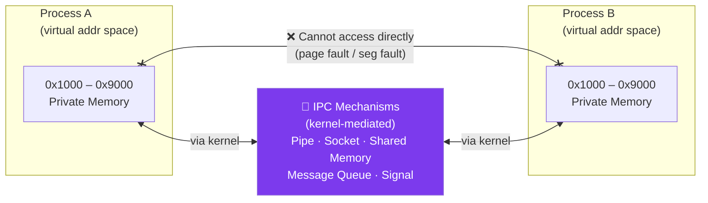

# Inter-Process Communication (IPC)

## What You'll Learn

- What IPC is and why it's necessary
- IPC mechanisms: pipes, FIFOs, message queues, shared memory, semaphores, sockets
- Synchronization in IPC
- Comparison of IPC methods and when to use each
- Producer-consumer and reader-writer problems
- Implementation examples in C and shell scripts
- POSIX and System V IPC

## Introduction to Inter-Process Communication

**Inter-Process Communication (IPC)** enables processes to exchange data and coordinate their actions. Since processes have separate address spaces, they need special mechanisms to communicate.

### Why IPC?



### IPC Use Cases

| Use Case | Example | IPC Method |
|----------|---------|------------|
| **Parent-Child Communication** | Shell pipes: `ls \| grep txt` | Pipe |
| **Client-Server** | Database connections | Socket |
| **Producer-Consumer** | Log processing pipeline | Message Queue |
| **Shared Data** | Multiple readers, one writer | Shared Memory + Semaphore |
| **Event Notification** | GUI event handling | Signal |
| **RPC** | Microservices | Socket, gRPC |

## IPC Mechanisms Overview

```
IPC Mechanisms Comparison:

┌────────────────────┬───────────┬──────────┬─────────────┐
│ Mechanism          │ Speed     │ Capacity │ Complexity  │
├────────────────────┼───────────┼──────────┼─────────────┤
│ Pipe               │ Fast      │ Limited  │ Simple      │
│ Named Pipe (FIFO)  │ Fast      │ Limited  │ Simple      │
│ Message Queue      │ Medium    │ Medium   │ Medium      │
│ Shared Memory      │ Fastest   │ Large    │ Complex     │
│ Semaphore          │ Fast      │ N/A      │ Medium      │
│ Socket             │ Medium    │ Large    │ Complex     │
│ Signal             │ Fast      │ Tiny     │ Simple      │
└────────────────────┴───────────┴──────────┴─────────────┘
```

## 1. Pipes

**Pipes** are unidirectional communication channels between related processes (usually parent-child).

### Anonymous Pipes

```
Pipe Structure:

Process A (Writer)          Process B (Reader)
     │                           │
     ├──→ [Write FD] ──→ [Kernel Buffer] ──→ [Read FD] ──→│
     │                      (FIFO)                         │
     │                                                     │
  write()                                              read()
```

#### Pipe Example in C

```c
// pipe_example.c
#include <stdio.h>
#include <stdlib.h>
#include <unistd.h>
#include <string.h>

int main() {
    int pipefd[2];  // pipefd[0] = read end, pipefd[1] = write end
    pid_t pid;
    char write_msg[] = "Hello from parent!";
    char read_msg[100];
    
    // Create pipe
    if (pipe(pipefd) == -1) {
        perror("pipe");
        exit(1);
    }
    
    pid = fork();
    
    if (pid == -1) {
        perror("fork");
        exit(1);
    }
    
    if (pid == 0) {
        // Child process - reader
        close(pipefd[1]);  // Close write end
        
        ssize_t n = read(pipefd[0], read_msg, sizeof(read_msg));
        if (n > 0) {
            printf("Child received: %s\n", read_msg);
        }
        
        close(pipefd[0]);
        exit(0);
    } else {
        // Parent process - writer
        close(pipefd[0]);  // Close read end
        
        write(pipefd[1], write_msg, strlen(write_msg) + 1);
        printf("Parent sent: %s\n", write_msg);
        
        close(pipefd[1]);
        wait(NULL);  // Wait for child
    }
    
    return 0;
}
```

#### Shell Pipe Example

```bash
#!/bin/bash
# Pipes in shell commands

# Simple pipe
ls -l | grep ".txt"

# Multiple pipes (pipeline)
cat /var/log/syslog | grep "error" | wc -l

# Named pipe example
mkfifo mypipe

# Terminal 1:
echo "Hello from terminal 1" > mypipe

# Terminal 2:
cat < mypipe

# Cleanup
rm mypipe
```

### Pipe Characteristics

```
Pipe Properties:

✓ Unidirectional (one-way communication)
✓ FIFO (First In, First Out)
✓ Data read once and removed from buffer
✓ Limited capacity (typically 64KB)
✓ Blocking: read blocks if empty, write blocks if full
✓ Only between related processes (parent-child)

Limitations:
✗ Cannot be used by unrelated processes
✗ No random access
✗ Data lost if not read
```

## 2. Named Pipes (FIFOs)

**FIFOs** are named pipes that can be used by unrelated processes.

### FIFO Example

```c
// fifo_writer.c
#include <stdio.h>
#include <stdlib.h>
#include <fcntl.h>
#include <sys/stat.h>
#include <unistd.h>
#include <string.h>

#define FIFO_NAME "/tmp/my_fifo"

int main() {
    int fd;
    char *message = "Hello through FIFO!";
    
    // Create FIFO (named pipe)
    mkfifo(FIFO_NAME, 0666);
    
    printf("Writer: Opening FIFO...\n");
    fd = open(FIFO_NAME, O_WRONLY);
    
    printf("Writer: Writing message...\n");
    write(fd, message, strlen(message) + 1);
    
    close(fd);
    printf("Writer: Done.\n");
    
    return 0;
}
```

```c
// fifo_reader.c
#include <stdio.h>
#include <stdlib.h>
#include <fcntl.h>
#include <sys/stat.h>
#include <unistd.h>

#define FIFO_NAME "/tmp/my_fifo"

int main() {
    int fd;
    char buffer[100];
    
    printf("Reader: Opening FIFO...\n");
    fd = open(FIFO_NAME, O_RDONLY);
    
    printf("Reader: Reading message...\n");
    read(fd, buffer, sizeof(buffer));
    printf("Reader: Received: %s\n", buffer);
    
    close(fd);
    unlink(FIFO_NAME);  // Remove FIFO
    
    return 0;
}
```

```bash
# Compile and run
gcc -o writer fifo_writer.c
gcc -o reader fifo_reader.c

# Terminal 1:
./reader

# Terminal 2:
./writer
```

## 3. Message Queues

**Message Queues** allow processes to send structured messages to each other.

### System V Message Queue

```c
// message_queue.c
#include <stdio.h>
#include <stdlib.h>
#include <string.h>
#include <sys/ipc.h>
#include <sys/msg.h>
#include <unistd.h>

// Message structure
struct message {
    long msg_type;
    char msg_text[100];
};

// Sender
void sender() {
    key_t key;
    int msgid;
    struct message msg;
    
    // Generate unique key
    key = ftok("/tmp", 'A');
    
    // Create message queue
    msgid = msgget(key, 0666 | IPC_CREAT);
    
    // Prepare message
    msg.msg_type = 1;
    strcpy(msg.msg_text, "Hello from sender!");
    
    // Send message
    msgsnd(msgid, &msg, sizeof(msg.msg_text), 0);
    printf("Sender: Message sent: %s\n", msg.msg_text);
}

// Receiver
void receiver() {
    key_t key;
    int msgid;
    struct message msg;
    
    // Generate same key
    key = ftok("/tmp", 'A');
    
    // Connect to message queue
    msgid = msgget(key, 0666 | IPC_CREAT);
    
    // Receive message
    msgrcv(msgid, &msg, sizeof(msg.msg_text), 1, 0);
    printf("Receiver: Message received: %s\n", msg.msg_text);
    
    // Destroy message queue
    msgctl(msgid, IPC_RMID, NULL);
}

int main() {
    pid_t pid = fork();
    
    if (pid == 0) {
        sleep(1);  // Let parent create queue first
        receiver();
    } else {
        sender();
        wait(NULL);
    }
    
    return 0;
}
```

### POSIX Message Queue

```c
// posix_mq.c
#include <stdio.h>
#include <stdlib.h>
#include <string.h>
#include <fcntl.h>
#include <sys/stat.h>
#include <mqueue.h>

#define QUEUE_NAME "/my_queue"
#define MAX_SIZE 1024

int main() {
    mqd_t mq;
    struct mq_attr attr;
    char buffer[MAX_SIZE];
    
    // Set queue attributes
    attr.mq_flags = 0;
    attr.mq_maxmsg = 10;
    attr.mq_msgsize = MAX_SIZE;
    attr.mq_curmsgs = 0;
    
    // Create/open queue
    mq = mq_open(QUEUE_NAME, O_CREAT | O_RDWR, 0644, &attr);
    
    if (fork() == 0) {
        // Child - sender
        const char *msg = "Hello from POSIX MQ!";
        mq_send(mq, msg, strlen(msg) + 1, 0);
        printf("Sent: %s\n", msg);
    } else {
        // Parent - receiver
        sleep(1);  // Wait for message
        mq_receive(mq, buffer, MAX_SIZE, NULL);
        printf("Received: %s\n", buffer);
        
        // Cleanup
        mq_close(mq);
        mq_unlink(QUEUE_NAME);
        wait(NULL);
    }
    
    return 0;
}

// Compile: gcc posix_mq.c -o posix_mq -lrt
```

### Message Queue Advantages

```
Message Queues vs Pipes:

✓ Bidirectional communication
✓ Message boundaries preserved
✓ Priority-based messaging
✓ Non-blocking options
✓ Persistent (survive process termination)
✓ Multiple readers/writers

Use Cases:
- Task queues (job distribution)
- Request/response patterns
- Event-driven systems
- Decoupled microservices
```

## 4. Shared Memory

**Shared Memory** is the fastest IPC method, allowing processes to access the same memory region.

```
Shared Memory Architecture:

Process A                 Process B
┌───────────┐            ┌───────────┐
│  Virtual  │            │  Virtual  │
│  Address  │            │  Address  │
│  Space    │            │  Space    │
├───────────┤            ├───────────┤
│ 0x7000 ───┼───┐    ┌───┼─ 0x5000   │
└───────────┘   │    │   └───────────┘
                ↓    ↓
          ┌──────────────┐
          │Shared Memory │
          │  Segment     │
          │  (Physical)  │
          └──────────────┘
```

### System V Shared Memory

```c
// shm_writer.c
#include <stdio.h>
#include <stdlib.h>
#include <string.h>
#include <sys/ipc.h>
#include <sys/shm.h>
#include <unistd.h>

#define SHM_SIZE 1024

int main() {
    key_t key;
    int shmid;
    char *data;
    
    // Generate key
    key = ftok("/tmp", 'R');
    
    // Create shared memory segment
    shmid = shmget(key, SHM_SIZE, 0644 | IPC_CREAT);
    if (shmid == -1) {
        perror("shmget");
        exit(1);
    }
    
    // Attach to shared memory
    data = (char *)shmat(shmid, NULL, 0);
    if (data == (char *)(-1)) {
        perror("shmat");
        exit(1);
    }
    
    printf("Writer: Writing to shared memory...\n");
    strcpy(data, "Hello from shared memory!");
    
    printf("Writer: Data written: %s\n", data);
    
    // Detach from shared memory
    shmdt(data);
    
    return 0;
}
```

```c
// shm_reader.c
#include <stdio.h>
#include <stdlib.h>
#include <sys/ipc.h>
#include <sys/shm.h>
#include <unistd.h>

#define SHM_SIZE 1024

int main() {
    key_t key;
    int shmid;
    char *data;
    
    // Generate same key
    key = ftok("/tmp", 'R');
    
    // Get shared memory segment
    shmid = shmget(key, SHM_SIZE, 0644);
    if (shmid == -1) {
        perror("shmget");
        exit(1);
    }
    
    // Attach to shared memory
    data = (char *)shmat(shmid, NULL, 0);
    if (data == (char *)(-1)) {
        perror("shmat");
        exit(1);
    }
    
    printf("Reader: Reading from shared memory...\n");
    printf("Reader: Data read: %s\n", data);
    
    // Detach from shared memory
    shmdt(data);
    
    // Destroy shared memory segment
    shmctl(shmid, IPC_RMID, NULL);
    
    return 0;
}
```

### POSIX Shared Memory

```c
// posix_shm.c
#include <stdio.h>
#include <stdlib.h>
#include <string.h>
#include <fcntl.h>
#include <sys/mman.h>
#include <unistd.h>

#define SHM_NAME "/my_shm"
#define SHM_SIZE 1024

int main() {
    int shm_fd;
    void *ptr;
    
    if (fork() == 0) {
        // Child - writer
        sleep(1);  // Wait for parent to create shm
        
        shm_fd = shm_open(SHM_NAME, O_RDWR, 0666);
        ptr = mmap(0, SHM_SIZE, PROT_READ | PROT_WRITE, MAP_SHARED, shm_fd, 0);
        
        sprintf(ptr, "Hello from child process!");
        printf("Child wrote: %s\n", (char *)ptr);
        
        munmap(ptr, SHM_SIZE);
        close(shm_fd);
    } else {
        // Parent - reader
        shm_fd = shm_open(SHM_NAME, O_CREAT | O_RDWR, 0666);
        ftruncate(shm_fd, SHM_SIZE);
        ptr = mmap(0, SHM_SIZE, PROT_READ | PROT_WRITE, MAP_SHARED, shm_fd, 0);
        
        wait(NULL);  // Wait for child to write
        
        printf("Parent read: %s\n", (char *)ptr);
        
        munmap(ptr, SHM_SIZE);
        close(shm_fd);
        shm_unlink(SHM_NAME);
    }
    
    return 0;
}

// Compile: gcc posix_shm.c -o posix_shm -lrt
```

## 5. Semaphores

**Semaphores** synchronize access to shared resources.

```
Semaphore Operations:

wait() / P() / down():
    if (sem_value > 0)
        sem_value--;
    else
        block_process();

signal() / V() / up():
    sem_value++;
    wake_up_blocked_process();
```

### Binary Semaphore Example

```c
// semaphore_example.c
#include <stdio.h>
#include <stdlib.h>
#include <pthread.h>
#include <semaphore.h>
#include <unistd.h>

sem_t semaphore;
int shared_counter = 0;

void* increment(void* arg) {
    for (int i = 0; i < 5; i++) {
        sem_wait(&semaphore);  // Lock
        
        // Critical section
        int temp = shared_counter;
        printf("Thread %ld: Reading %d\n", (long)arg, temp);
        usleep(100000);  // Simulate work
        shared_counter = temp + 1;
        printf("Thread %ld: Writing %d\n", (long)arg, shared_counter);
        
        sem_post(&semaphore);  // Unlock
        usleep(100000);
    }
    return NULL;
}

int main() {
    pthread_t t1, t2;
    
    // Initialize semaphore (1 = binary semaphore / mutex)
    sem_init(&semaphore, 0, 1);
    
    pthread_create(&t1, NULL, increment, (void*)1);
    pthread_create(&t2, NULL, increment, (void*)2);
    
    pthread_join(t1, NULL);
    pthread_join(t2, NULL);
    
    printf("Final counter: %d (expected: 10)\n", shared_counter);
    
    sem_destroy(&semaphore);
    return 0;
}

// Compile: gcc semaphore_example.c -o semaphore_example -lpthread
```

### Producer-Consumer with Semaphores

```c
// producer_consumer.c
#include <stdio.h>
#include <stdlib.h>
#include <pthread.h>
#include <semaphore.h>
#include <unistd.h>

#define BUFFER_SIZE 5

int buffer[BUFFER_SIZE];
int in = 0, out = 0;

sem_t empty;  // Count of empty slots
sem_t full;   // Count of full slots
sem_t mutex;  // Mutual exclusion for buffer

void* producer(void* arg) {
    int item;
    for (int i = 0; i < 10; i++) {
        item = rand() % 100;
        
        sem_wait(&empty);  // Wait for empty slot
        sem_wait(&mutex);  // Lock buffer
        
        // Produce item
        buffer[in] = item;
        printf("Producer: Produced %d at position %d\n", item, in);
        in = (in + 1) % BUFFER_SIZE;
        
        sem_post(&mutex);  // Unlock buffer
        sem_post(&full);   // Signal full slot
        
        usleep(rand() % 500000);
    }
    return NULL;
}

void* consumer(void* arg) {
    int item;
    for (int i = 0; i < 10; i++) {
        sem_wait(&full);   // Wait for full slot
        sem_wait(&mutex);  // Lock buffer
        
        // Consume item
        item = buffer[out];
        printf("Consumer: Consumed %d from position %d\n", item, out);
        out = (out + 1) % BUFFER_SIZE;
        
        sem_post(&mutex);  // Unlock buffer
        sem_post(&empty);  // Signal empty slot
        
        usleep(rand() % 500000);
    }
    return NULL;
}

int main() {
    pthread_t prod, cons;
    
    // Initialize semaphores
    sem_init(&empty, 0, BUFFER_SIZE);  // Initially all empty
    sem_init(&full, 0, 0);             // Initially none full
    sem_init(&mutex, 0, 1);            // Binary semaphore
    
    pthread_create(&prod, NULL, producer, NULL);
    pthread_create(&cons, NULL, consumer, NULL);
    
    pthread_join(prod, NULL);
    pthread_join(cons, NULL);
    
    // Cleanup
    sem_destroy(&empty);
    sem_destroy(&full);
    sem_destroy(&mutex);
    
    return 0;
}
```

## 6. Sockets

**Sockets** enable communication between processes on same or different machines.

### Unix Domain Socket

```c
// socket_server.c
#include <stdio.h>
#include <stdlib.h>
#include <string.h>
#include <sys/socket.h>
#include <sys/un.h>
#include <unistd.h>

#define SOCKET_PATH "/tmp/my_socket"

int main() {
    int server_fd, client_fd;
    struct sockaddr_un addr;
    char buffer[100];
    
    // Create socket
    server_fd = socket(AF_UNIX, SOCK_STREAM, 0);
    
    // Setup address
    memset(&addr, 0, sizeof(addr));
    addr.sun_family = AF_UNIX;
    strncpy(addr.sun_path, SOCKET_PATH, sizeof(addr.sun_path) - 1);
    
    // Remove old socket file
    unlink(SOCKET_PATH);
    
    // Bind and listen
    bind(server_fd, (struct sockaddr*)&addr, sizeof(addr));
    listen(server_fd, 5);
    
    printf("Server: Waiting for connection...\n");
    client_fd = accept(server_fd, NULL, NULL);
    
    // Receive message
    read(client_fd, buffer, sizeof(buffer));
    printf("Server: Received: %s\n", buffer);
    
    // Send response
    write(client_fd, "Message received!", 17);
    
    close(client_fd);
    close(server_fd);
    unlink(SOCKET_PATH);
    
    return 0;
}
```

```c
// socket_client.c
#include <stdio.h>
#include <stdlib.h>
#include <string.h>
#include <sys/socket.h>
#include <sys/un.h>
#include <unistd.h>

#define SOCKET_PATH "/tmp/my_socket"

int main() {
    int sock_fd;
    struct sockaddr_un addr;
    char buffer[100];
    
    // Create socket
    sock_fd = socket(AF_UNIX, SOCK_STREAM, 0);
    
    // Setup address
    memset(&addr, 0, sizeof(addr));
    addr.sun_family = AF_UNIX;
    strncpy(addr.sun_path, SOCKET_PATH, sizeof(addr.sun_path) - 1);
    
    // Connect
    if (connect(sock_fd, (struct sockaddr*)&addr, sizeof(addr)) == -1) {
        perror("connect");
        exit(1);
    }
    
    printf("Client: Connected to server\n");
    
    // Send message
    write(sock_fd, "Hello from client!", 18);
    
    // Receive response
    read(sock_fd, buffer, sizeof(buffer));
    printf("Client: Server response: %s\n", buffer);
    
    close(sock_fd);
    
    return 0;
}
```

## IPC Comparison Table

| Mechanism | Speed | Data Size | Processes | Synchronization | Persistence | Network |
|-----------|-------|-----------|-----------|----------------|-------------|---------|
| **Pipe** | Fast | Small | Related | No | No | No |
| **FIFO** | Fast | Small | Any | No | No | No |
| **Msg Queue** | Medium | Medium | Any | Built-in | Yes | No |
| **Shared Mem** | Fastest | Large | Any | Manual (semaphore) | Yes | No |
| **Semaphore** | Fast | N/A | Any | Yes | Yes | No |
| **Socket** | Slow | Large | Any | No | No | Yes |

## Exercises

### Beginner

1. Explain why shared memory is faster than message passing.

2. Write a shell script that uses pipes to count the number of `.c` files in a directory.

3. What are the advantages of named pipes (FIFOs) over anonymous pipes?

### Intermediate

4. Implement a simple chat program using named pipes where two processes can send messages to each other.

5. Modify the producer-consumer example to have 2 producers and 3 consumers.

6. Compare System V and POSIX IPC mechanisms. Which would you choose for a new project?

### Advanced

7. Implement a ring buffer in shared memory with proper synchronization using semaphores.

8. Create a multi-process task queue system using message queues where worker processes fetch and execute tasks.

9. Build a simple database cache using shared memory that multiple processes can read from concurrently but only one can write to at a time.

## Key Takeaways

- IPC enables communication and coordination between isolated processes
- **Pipes** are simple but limited to related processes
- **Message queues** provide structured, prioritized communication
- **Shared memory** is fastest but requires manual synchronization
- **Semaphores** coordinate access to shared resources
- **Sockets** enable network communication
- Choose IPC method based on: speed, data size, process relationship, and synchronization needs
- Always properly clean up IPC resources (destroy queues, unlink FIFOs, etc.)

## Next Steps

Continue to [Deadlocks](./06_deadlocks.md) to learn about preventing and resolving deadlock situations in IPC and synchronization.

---

[← Previous: Context Switching](./04_context_switching.md) | [Next: Deadlocks →](./06_deadlocks.md)
