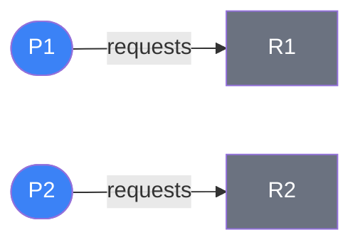
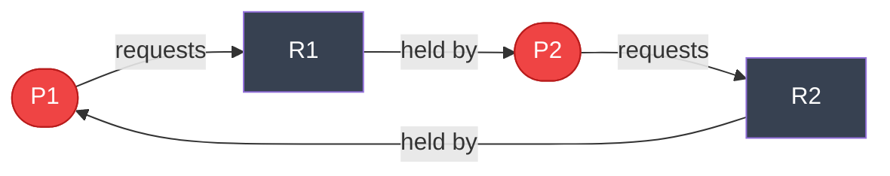
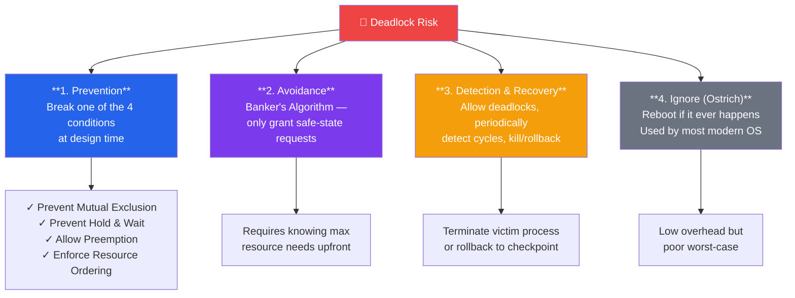

# Deadlocks

## What You'll Learn

- What deadlocks are and conditions for their occurrence
- Deadlock prevention, avoidance, detection, and recovery strategies
- Resource allocation graphs
- Banker's algorithm for deadlock avoidance
- Deadlock detection algorithms
- Real-world examples and prevention techniques
- Livelock and starvation

## Introduction to Deadlocks

**Deadlock** is a situation where a set of processes are blocked forever, each waiting for a resource held by another process in the set.

### Classic Deadlock Example

```
Dining Philosophers Problem:

    Fork 1
      │
   P1─┼─P2
  │   │   │
Fork  │  Fork
  5   │   2
  │   │   │
   P5─┼─P3
      │
    Fork 4    Fork 3
      
Each philosopher needs TWO forks to eat.
If all grab left fork simultaneously → DEADLOCK!
```

### Real-World Deadlock

```
Database Deadlock:

Transaction T1          Transaction T2
────────────────────────────────────────
Lock(Account A)         Lock(Account B)
   ...                     ...
Wait for Account B      Wait for Account A
   ↓                       ↓
  DEADLOCK! Both waiting for each other
```

## Deadlock Conditions

Four conditions must hold **simultaneously** for deadlock to occur:

```
Necessary Conditions for Deadlock:

1. MUTUAL EXCLUSION
   ┌──────────────────────────────────┐
   │ At least one resource must be    │
   │ held in non-shareable mode       │
   └──────────────────────────────────┘
   Example: Printer, Mutex lock

2. HOLD AND WAIT
   ┌──────────────────────────────────┐
   │ Process holds resources while    │
   │ waiting for additional resources │
   └──────────────────────────────────┘
   Example: Hold file A, wait for file B

3. NO PREEMPTION
   ┌──────────────────────────────────┐
   │ Resources cannot be forcibly     │
   │ taken from processes             │
   └──────────────────────────────────┘
   Example: Cannot forcibly release a lock

4. CIRCULAR WAIT
   ┌──────────────────────────────────┐
   │ Circular chain of processes,     │
   │ each waiting for next resource   │
   └──────────────────────────────────┘
   Example: P1→R1→P2→R2→P1 (cycle)
```

### Condition Examples

| Condition | Resource Example | Breaking It Prevents Deadlock |
|-----------|------------------|------------------------------|
| **Mutual Exclusion** | Printer, Critical section | Allow sharing (not always possible) |
| **Hold and Wait** | Lock A, wait for Lock B | Request all resources at once |
| **No Preemption** | Cannot take lock from process | Allow resource preemption |
| **Circular Wait** | P1→P2→P3→P1 | Order resources, request in order |

## Resource Allocation Graph (RAG)

Visual representation of resource allocation and requests. Processes are circles, resources are rectangles.

**Scenario 1: No Deadlock** — no circular dependency.



**Scenario 2: Deadlock** — circular wait creates a cycle.



**Scenario 3: Cycle but No Deadlock** — R1 has 2 instances, so P3 can still proceed.


## Deadlock Handling Strategies



## Deadlock Prevention

Break one of the four necessary conditions.

### 1. Prevent Mutual Exclusion

```
Make resources shareable (not always possible)

✓ Read-only files (shareable)
✗ Printers (non-shareable)
✗ Write access to files (non-shareable)

Example:
Instead of: Lock file exclusively
Do: Use read-write locks (multiple readers, one writer)
```

### 2. Prevent Hold and Wait

```c
// Approach A: Request all resources at once
void* process_alloc_all(void* arg) {
    // Request all resources atomically
    pthread_mutex_lock(&global_lock);
    
    if (available(resource1) && available(resource2)) {
        acquire(resource1);
        acquire(resource2);
        pthread_mutex_unlock(&global_lock);
        
        // Use resources
        work();
        
        release(resource1);
        release(resource2);
    } else {
        pthread_mutex_unlock(&global_lock);
        // Retry later
    }
    
    return NULL;
}

// Approach B: Release all before requesting more
void* process_release_before_request(void* arg) {
    acquire(resource1);
    
    // Need resource2
    release(resource1);  // Release first!
    
    acquire(resource1);
    acquire(resource2);
    
    // Use resources
    work();
    
    release(resource1);
    release(resource2);
    
    return NULL;
}
```

**Disadvantages**:
- Low resource utilization (resources locked but not used)
- Starvation possible (process needs many resources)
- May not know all required resources upfront

### 3. Allow Preemption

```c
// Preemption example
void* process_with_preemption(void* arg) {
    int retry = 0;
    
    while (retry < MAX_RETRIES) {
        acquire(resource1);
        
        if (try_acquire(resource2)) {
            // Got both resources
            work();
            release(resource2);
            release(resource1);
            return NULL;
        } else {
            // Couldn't get resource2, release resource1
            release(resource1);
            usleep(rand() % 1000);  // Backoff
            retry++;
        }
    }
    
    return NULL;
}
```

**Disadvantages**:
- Only works for certain resource types (CPU, memory)
- Cannot preempt printer mid-job
- Overhead of saving/restoring state

### 4. Prevent Circular Wait

```c
// Impose ordering on resources
#define RESOURCE_A 1
#define RESOURCE_B 2
#define RESOURCE_C 3

pthread_mutex_t mutex_a, mutex_b, mutex_c;

void* process_ordered_locking(void* arg) {
    // Always acquire locks in order: A → B → C
    pthread_mutex_lock(&mutex_a);
    printf("Acquired Resource A\n");
    
    pthread_mutex_lock(&mutex_b);
    printf("Acquired Resource B\n");
    
    pthread_mutex_lock(&mutex_c);
    printf("Acquired Resource C\n");
    
    // Critical section
    work();
    
    // Release in any order
    pthread_mutex_unlock(&mutex_c);
    pthread_mutex_unlock(&mutex_b);
    pthread_mutex_unlock(&mutex_a);
    
    return NULL;
}

// Example: Multiple processes follow same order
void* process1(void* arg) {
    pthread_mutex_lock(&mutex_a);  // Order: A, B
    pthread_mutex_lock(&mutex_b);
    // work...
    pthread_mutex_unlock(&mutex_b);
    pthread_mutex_unlock(&mutex_a);
    return NULL;
}

void* process2(void* arg) {
    pthread_mutex_lock(&mutex_a);  // Same order: A, B
    pthread_mutex_lock(&mutex_b);
    // work...
    pthread_mutex_unlock(&mutex_b);
    pthread_mutex_unlock(&mutex_a);
    return NULL;
}
// No circular wait possible!
```

## Deadlock Avoidance

Dynamically check if resource allocation leads to unsafe state.

### Safe State

```
Safe State:
  System can allocate resources to each process
  in some order and avoid deadlock.

Unsafe State:
  No guarantee of deadlock avoidance
  (but deadlock not inevitable)

┌────────────────────────────────────┐
│        All States                  │
│  ┌──────────────────────────────┐  │
│  │      Safe States             │  │
│  │  ┌────────────────────────┐  │  │
│  │  │  Current Allocation    │  │  │
│  │  └────────────────────────┘  │  │
│  └──────────────────────────────┘  │
│                                    │
│      Unsafe States                 │
│      (Deadlock possible)           │
└────────────────────────────────────┘
```

### Banker's Algorithm

Ensures system stays in safe state.

```
Data Structures:

Available[m]:      Available instances of each resource
Max[n][m]:         Max demand of each process
Allocation[n][m]:  Currently allocated resources
Need[n][m]:        Remaining resource need
                   Need = Max - Allocation

n = number of processes
m = number of resource types
```

#### Banker's Algorithm Example

```c
// banker.c - Simplified Banker's Algorithm
#include <stdio.h>
#include <stdbool.h>

#define P 5  // Number of processes
#define R 3  // Number of resource types

int available[R] = {3, 3, 2};  // Available instances

int maximum[P][R] = {
    {7, 5, 3},  // P0
    {3, 2, 2},  // P1
    {9, 0, 2},  // P2
    {2, 2, 2},  // P3
    {4, 3, 3}   // P4
};

int allocation[P][R] = {
    {0, 1, 0},  // P0
    {2, 0, 0},  // P1
    {3, 0, 2},  // P2
    {2, 1, 1},  // P3
    {0, 0, 2}   // P4
};

int need[P][R];

void calculate_need() {
    for (int i = 0; i < P; i++) {
        for (int j = 0; j < R; j++) {
            need[i][j] = maximum[i][j] - allocation[i][j];
        }
    }
}

bool is_safe() {
    int work[R];
    bool finish[P] = {false};
    
    // Initialize work = available
    for (int i = 0; i < R; i++) {
        work[i] = available[i];
    }
    
    // Find safe sequence
    int count = 0;
    while (count < P) {
        bool found = false;
        
        for (int i = 0; i < P; i++) {
            if (!finish[i]) {
                // Check if process can be satisfied
                bool can_allocate = true;
                for (int j = 0; j < R; j++) {
                    if (need[i][j] > work[j]) {
                        can_allocate = false;
                        break;
                    }
                }
                
                if (can_allocate) {
                    // Simulate process completion
                    for (int j = 0; j < R; j++) {
                        work[j] += allocation[i][j];
                    }
                    finish[i] = true;
                    found = true;
                    count++;
                    printf("P%d ", i);
                }
            }
        }
        
        if (!found) {
            printf("\nSystem is in UNSAFE state!\n");
            return false;
        }
    }
    
    printf("\nSystem is in SAFE state!\n");
    return true;
}

bool request_resources(int process, int request[]) {
    // Check if request <= need
    for (int i = 0; i < R; i++) {
        if (request[i] > need[process][i]) {
            printf("Error: Process has exceeded its maximum claim\n");
            return false;
        }
    }
    
    // Check if request <= available
    for (int i = 0; i < R; i++) {
        if (request[i] > available[i]) {
            printf("Process must wait, resources not available\n");
            return false;
        }
    }
    
    // Try allocating (pretend)
    for (int i = 0; i < R; i++) {
        available[i] -= request[i];
        allocation[process][i] += request[i];
        need[process][i] -= request[i];
    }
    
    // Check if safe
    if (is_safe()) {
        printf("Request granted\n");
        return true;
    } else {
        // Rollback
        for (int i = 0; i < R; i++) {
            available[i] += request[i];
            allocation[process][i] -= request[i];
            need[process][i] += request[i];
        }
        printf("Request denied (would lead to unsafe state)\n");
        return false;
    }
}

int main() {
    calculate_need();
    
    printf("Initial state - Safe sequence: ");
    is_safe();
    
    // Request: P1 requests (1, 0, 2)
    int request1[R] = {1, 0, 2};
    printf("\nP1 requests (1, 0, 2): ");
    request_resources(1, request1);
    
    return 0;
}
```

**Banker's Algorithm Limitations**:
- Requires knowing maximum resource needs in advance
- Number of processes must be fixed
- Resources must be finite and known
- Processes must return resources in finite time
- High overhead for large systems

## Deadlock Detection

Allow deadlocks to occur, then detect and recover.

### Detection Algorithm

```c
// deadlock_detection.c
#include <stdio.h>
#include <stdbool.h>

#define P 5
#define R 3

int available[R] = {0, 0, 0};
int allocation[P][R] = {
    {0, 1, 0},
    {2, 0, 0},
    {3, 0, 3},
    {2, 1, 1},
    {0, 0, 2}
};

int request[P][R] = {
    {0, 0, 0},
    {2, 0, 2},
    {0, 0, 0},
    {1, 0, 0},
    {0, 0, 2}
};

bool detect_deadlock() {
    int work[R];
    bool finish[P];
    
    // Initialize
    for (int i = 0; i < R; i++) {
        work[i] = available[i];
    }
    
    for (int i = 0; i < P; i++) {
        bool has_allocation = false;
        for (int j = 0; j < R; j++) {
            if (allocation[i][j] != 0) {
                has_allocation = true;
                break;
            }
        }
        finish[i] = !has_allocation;
    }
    
    // Find processes that can complete
    bool progress = true;
    while (progress) {
        progress = false;
        
        for (int i = 0; i < P; i++) {
            if (!finish[i]) {
                bool can_finish = true;
                for (int j = 0; j < R; j++) {
                    if (request[i][j] > work[j]) {
                        can_finish = false;
                        break;
                    }
                }
                
                if (can_finish) {
                    for (int j = 0; j < R; j++) {
                        work[j] += allocation[i][j];
                    }
                    finish[i] = true;
                    progress = true;
                }
            }
        }
    }
    
    // Check for deadlock
    printf("Deadlocked processes: ");
    bool deadlock = false;
    for (int i = 0; i < P; i++) {
        if (!finish[i]) {
            printf("P%d ", i);
            deadlock = true;
        }
    }
    
    if (!deadlock) {
        printf("None");
    }
    printf("\n");
    
    return deadlock;
}

int main() {
    if (detect_deadlock()) {
        printf("DEADLOCK DETECTED!\n");
    } else {
        printf("No deadlock.\n");
    }
    return 0;
}
```

### Detection Frequency

| Frequency | Pros | Cons |
|-----------|------|------|
| **Every Request** | Early detection | High overhead |
| **Periodic** | Balanced | Delayed detection |
| **On Demand** | Low overhead | Late detection |
| **When Utilization Low** | Detects when likely | May miss some |

## Deadlock Recovery

Once deadlock detected, recover using:

```
Recovery Strategies:

1. PROCESS TERMINATION
   ├─ Abort all deadlocked processes
   │  • Simple, high cost
   │  • Lost work
   │
   └─ Abort one process at a time
      • Check after each abort
      • Lower cost, more overhead

2. RESOURCE PREEMPTION
   ├─ Select victim process
   ├─ Rollback to safe state
   └─ Restart from checkpoint

Selection Criteria:
• Priority of process
• CPU time consumed
• Resources held
• Resources needed to complete
• Number of processes affected
• Interactive vs batch
```

### Recovery Example

```c
// recovery.c - Simple deadlock recovery
#include <stdio.h>
#include <stdlib.h>
#include <signal.h>
#include <sys/types.h>

typedef struct {
    pid_t pid;
    int priority;
    int cpu_time;
    int resources_held;
} Process;

Process deadlocked_processes[] = {
    {1234, 5, 100, 3},
    {1235, 3, 50, 2},
    {1236, 7, 200, 4}
};

int select_victim() {
    int victim = 0;
    int min_cost = deadlocked_processes[0].priority * 
                   deadlocked_processes[0].cpu_time;
    
    for (int i = 1; i < 3; i++) {
        int cost = deadlocked_processes[i].priority * 
                   deadlocked_processes[i].cpu_time;
        if (cost < min_cost) {
            min_cost = cost;
            victim = i;
        }
    }
    
    return victim;
}

void terminate_process(int victim_index) {
    Process victim = deadlocked_processes[victim_index];
    
    printf("Terminating process PID %d\n", victim.pid);
    printf("  Priority: %d\n", victim.priority);
    printf("  CPU time: %d\n", victim.cpu_time);
    printf("  Resources held: %d\n", victim.resources_held);
    
    // In real system: kill(victim.pid, SIGTERM);
}

int main() {
    printf("DEADLOCK DETECTED!\n");
    printf("Selecting victim for termination...\n\n");
    
    int victim = select_victim();
    terminate_process(victim);
    
    return 0;
}
```

## Livelock and Starvation

### Livelock

```
Livelock: Processes actively changing state but making no progress

Example: Two people in hallway
Person A steps left ←  → Person B steps right
Person A steps right → ← Person B steps left
(Repeat forever...)

Code Example:
while (resource_locked) {
    release_my_resources();
    wait_random_time();
    acquire_my_resources();
    // Other process does same → Livelock!
}

Solution: Exponential backoff, randomization
```

### Starvation

```
Starvation: Process waits indefinitely for resources

Example: Priority scheduling
High-priority processes keep arriving
→ Low-priority process never executes

Solution: Aging (gradually increase priority)
```

## Real-World Deadlock Examples

### 1. Database Deadlock

```sql
-- Transaction 1
BEGIN TRANSACTION;
UPDATE accounts SET balance = balance - 100 WHERE id = 1;
-- Context switch here
UPDATE accounts SET balance = balance + 100 WHERE id = 2;
COMMIT;

-- Transaction 2
BEGIN TRANSACTION;
UPDATE accounts SET balance = balance - 50 WHERE id = 2;
-- Context switch here
UPDATE accounts SET balance = balance + 50 WHERE id = 1;
COMMIT;

-- DEADLOCK! T1 locks row 1, T2 locks row 2
-- T1 waits for row 2, T2 waits for row 1
```

### 2. File System Deadlock

```bash
# Process A
flock /tmp/file1
  flock /tmp/file2
    # work
  funlock /tmp/file2
funlock /tmp/file1

# Process B
flock /tmp/file2  # Different order!
  flock /tmp/file1
    # work
  funlock /tmp/file1
funlock /tmp/file2

# DEADLOCK if both lock first file simultaneously
```

## Exercises

### Beginner

1. List the four necessary conditions for deadlock to occur.

2. Draw a resource allocation graph for:
   - P1 holds R1, requests R2
   - P2 holds R2, requests R1
   - Is there a deadlock?

3. Explain the difference between deadlock prevention and avoidance.

### Intermediate

4. Given:
   ```
   Available: (3, 3, 2)
   Allocation:     Max:
   P0: (0,1,0)     (7,5,3)
   P1: (2,0,0)     (3,2,2)
   P2: (3,0,2)     (9,0,2)
   ```
   Is the system in a safe state? Find a safe sequence if exists.

5. Implement resource ordering to prevent deadlock in a multi-threaded program that uses 3 mutexes.

6. Explain why the Banker's algorithm is not commonly used in modern operating systems.

### Advanced

7. Implement a deadlock detection algorithm for a resource allocation graph.

8. Write a program that demonstrates deadlock and then modify it to prevent deadlock using:
   a) Resource ordering
   b) Timeout and retry
   c) Try-lock mechanism

9. Design a distributed deadlock detection algorithm for a system with multiple nodes.

## Key Takeaways

- Deadlock requires four conditions: mutual exclusion, hold and wait, no preemption, circular wait
- **Prevention**: Break at least one necessary condition
- **Avoidance**: Use Banker's algorithm to stay in safe state
- **Detection**: Allow deadlocks, detect using RAG or algorithm, then recover
- **Ignore**: Ostrich algorithm (used by most modern OS)
- Resource ordering prevents circular wait
- Preemption and timeouts can break deadlocks
- Database and file systems use detection and recovery
- Livelock: processes active but no progress
- Starvation: indefinite waiting (solved by aging)

## Next Steps

Continue to [Synchronization and Locks](./07_synchronization.md) to learn about coordinating concurrent processes safely.

---

[← Previous: Inter-Process Communication](./05_ipc.md) | [Next: Synchronization and Locks →](./07_synchronization.md)
