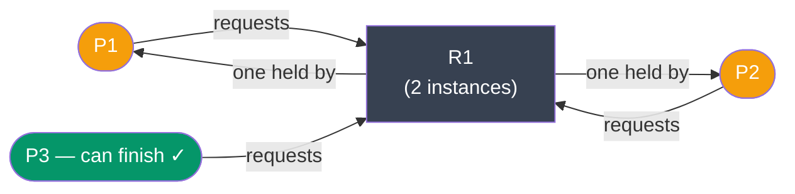
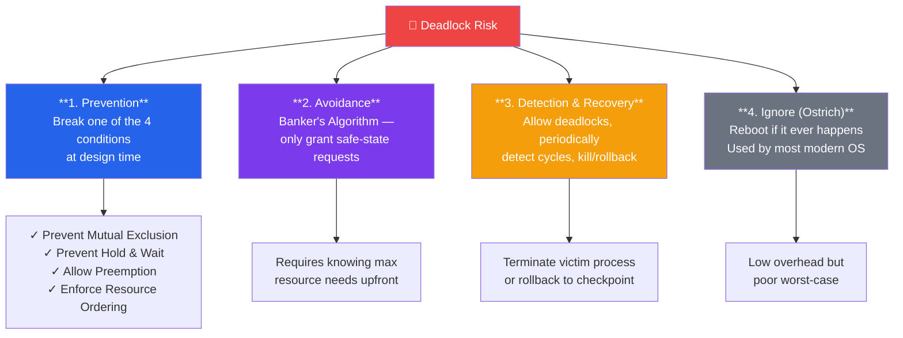

# Deadlocks

## What You'll Learn

- Deadlock kya hota hai aur ye hone ke liye kaunsi conditions chahiye
- Deadlock prevention, avoidance, detection, aur recovery strategies
- Resource allocation graphs
- Banker's algorithm — deadlock avoidance ke liye
- Deadlock detection algorithms
- Real-world examples aur prevention techniques
- Livelock aur starvation

## Introduction to Deadlocks

Socho tumne IRCTC pe tatkal ticket book karne ki koshish ki. Payment gateway ne tumhare account se paisa hold kar liya, lekin seat confirmation ka response IRCTC server se wait kar raha hai. Udhar IRCTC ka system seat lock kiye baitha hai, lekin payment confirmation ka wait kar raha hai. Dono ek dusre ka wait kar rahe hain, aur koi bhi aage nahi badh raha. Yahi hai **deadlock**.

**Kya hota hai?** Deadlock ek aisi situation hai jisme processes ka ek group hamesha ke liye ruk jata hai — kyunki har process kisi aise resource ka wait kar raha hai jo group ke kisi doosre process ne pakad rakha hai. Na koi aage badhega, na koi resource release hoga — system bilkul jam ho jayega, jaise Mumbai local mein rush hour mein do log ek hi seat pe baithne ki zid kar rahe hon aur koi peeche hatne ko taiyar na ho.

**Kyun zaruri hai samajhna?** Kyunki tum jab bhi multi-threaded code likhte ho — locks, mutexes, database transactions, file handles — deadlock ka risk hamesha rehta hai. Aur ye bugs aise hote hain jo production mein months baad, sirf specific timing pe trigger hote hain. Isliye inhe design time pe hi samajhna zaruri hai.

### Classic Deadlock Example — Dining Philosophers Problem

Ye ek famous CS problem hai jo deadlock samjhane ke liye use hoti hai. Socho 5 philosophers ek gol table pe baithe hain, aur unke beech mein sirf 5 forks rakhe hain (ek fork do logon ke beech mein). Khana khane ke liye har philosopher ko DO forks chahiye — apna left wala aur apna right wala.

```
Dining Philosophers Problem:

    Fork 1
      │
   P1─┼─P2
  │   │   │
Fork  │  Fork
  5   │   2
  │   │   │
   P5─┼─P3
      │
    Fork 4    Fork 3
      
Each philosopher needs TWO forks to eat.
If all grab left fork simultaneously → DEADLOCK!
```

Ab socho agar sabhi 5 philosophers EK SAATH apna-apna LEFT fork utha lein. Ab har koi apne right fork ka wait kar raha hai — jo unka neighbour already pakad ke baitha hai. Koi bhi khana nahi kha payega, sab bhooke baithe rahenge forever. Ye bilkul Swiggy delivery boys jaisa hai jahan har rider ko do cheezein chahiye — apni bike aur delivery bag — aur agar sab ek doosre ka bag le ke baithe hon toh koi delivery hi nahi hogi.

### Real-World Deadlock — Bank Transfer Example

Ab isko real coding scenario mein dekhte hain — jaise Paytm/PhonePe pe money transfer ka case:

```
Database Deadlock:

Transaction T1          Transaction T2
────────────────────────────────────────
Lock(Account A)         Lock(Account B)
   ...                     ...
Wait for Account B      Wait for Account A
   ↓                       ↓
  DEADLOCK! Both waiting for each other
```

Yahan T1 (transaction 1) Account A ko lock karke baitha hai aur Account B ka wait kar raha hai (kyunki usko A se B mein paisa transfer karna hai). Usi waqt T2, Account B ko lock karke Account A ka wait kar raha hai (opposite direction transfer). Dono transactions ek dusre ka forever wait karenge — jaise do log UPI transfer karte waqt ek dusre ke "confirm" button dabane ka wait karte reh jayein.

## Deadlock Conditions

**Kyun zaruri hai jaanna?** Kyunki deadlock kabhi achanak nahi hota — usse hone ke liye EK SAATH chaar conditions ka sach hona zaruri hai. Agar tum in chaaron mein se ek bhi todd do, deadlock ho hi nahi sakta. Yehi cheez prevention strategies ka base banti hai.

```
Necessary Conditions for Deadlock:

1. MUTUAL EXCLUSION
   ┌──────────────────────────────────┐
   │ At least one resource must be    │
   │ held in non-shareable mode       │
   └──────────────────────────────────┘
   Example: Printer, Mutex lock

2. HOLD AND WAIT
   ┌──────────────────────────────────┐
   │ Process holds resources while    │
   │ waiting for additional resources │
   └──────────────────────────────────┘
   Example: Hold file A, wait for file B

3. NO PREEMPTION
   ┌──────────────────────────────────┐
   │ Resources cannot be forcibly     │
   │ taken from processes             │
   └──────────────────────────────────┘
   Example: Cannot forcibly release a lock

4. CIRCULAR WAIT
   ┌──────────────────────────────────┐
   │ Circular chain of processes,     │
   │ each waiting for next resource   │
   └──────────────────────────────────┘
   Example: P1→R1→P2→R2→P1 (cycle)
```

Chalo ek-ek karke samajhte hain:

**1. Mutual Exclusion** — Resource sirf ek waqt mein ek hi process use kar sakta hai, share nahi ho sakta. Jaise ek OYO room — ek waqt mein ek hi guest check-in kar sakta hai. Ya ek printer — do log ek saath usme print nahi kar sakte.

**2. Hold and Wait** — Process ek resource pakad ke baitha hai, aur doosre resource ka wait kar raha hai — bina pehle wala chodhe. Jaise koi Zomato delivery boy pehle se ek order ka food le ke baitha hai, aur doosre restaurant se doosra order bhi pickup karne ka wait kar raha hai, bina pehla deliver kiye.

**3. No Preemption** — Kisi process se resource jabardasti nahi cheena ja sakta. Usko khud hi release karna padega. Jaise agar koi CRED pe payment kar raha hai, beech mein uska session forcibly cancel nahi kar sakte — usko complete hone dena padega ya khud cancel karna padega.

**4. Circular Wait** — Processes ek circular chain bana lete hain, jahan har process agle process ke resource ka wait kar raha hai, aur last process pehle wale ka. Jaise ek group chat mein A, B ka jawab wait kar raha hai, B, C ka, aur C, A ka — sab atke reh jate hain.

### Condition Examples

| Condition | Resource Example | Breaking It Prevents Deadlock |
|-----------|------------------|------------------------------|
| **Mutual Exclusion** | Printer, Critical section | Sharing allow karo (hamesha possible nahi) |
| **Hold and Wait** | Lock A, Lock B ka wait | Saare resources ek saath maango |
| **No Preemption** | Process se lock cheen nahi sakte | Preemption allow karo |
| **Circular Wait** | P1→P2→P3→P1 | Resources ko order do, order mein hi maango |

> [!tip]
> Agar tumhe interview mein deadlock ki definition puchi jaye, seedha bol do: "Deadlock ke liye ye 4 conditions **ek saath** true honi chahiye — Mutual Exclusion, Hold & Wait, No Preemption, aur Circular Wait." Ye ek famous fact hai jo har OS course mein aata hai.

## Resource Allocation Graph (RAG)

**Kya hota hai?** RAG ek visual tarika hai deadlock detect karne ka. Isme processes ko circles se aur resources ko rectangles se represent karte hain. Arrow ka matlab hota hai "request" (process → resource) ya "held by / allocated" (resource → process).

**Scenario 1: No Deadlock** — koi circular dependency nahi hai, sab clean hai.


**Scenario 2: Deadlock** — yahan circular wait ban raha hai, ek cycle create ho gaya.


P1, R1 maang raha hai jo P2 ke paas hai. P2, R2 maang raha hai jo P1 ke paas hai. Dono ek dusre ka wait kar rahe hain — cycle complete, deadlock confirmed.

**Scenario 3: Cycle hai lekin Deadlock nahi** — yahan interesting twist hai. R1 ke do instances hain, isliye P3 ka kaam ho sakta hai.



> [!info]
> Ye scenario 3 bahut important insight deta hai — **cycle hona necessary hai deadlock ke liye, lekin sufficient nahi**. Agar resource ke multiple instances available hain (jaise BigBasket ke warehouse mein ek hi product ke 2 units), toh cycle ke bawajood koi process complete ho sakta hai aur deadlock avoid ho sakta hai. Single-instance resources ke case mein hi cycle = deadlock guaranteed hota hai.

## Deadlock Handling Strategies

OS designers ke paas deadlock se nipatne ke chaar broad strategies hain — socho jaise ek company traffic jam se nipatne ke liye alag-alag approach le sakti hai: routes plan karna (prevention), real-time traffic dekh ke decide karna (avoidance), jam ho jaye toh clear karna (detection & recovery), ya bas ignore karke assume karna ki jam rarely hota hai (ostrich algorithm).



Interesting fact: **Linux aur Windows jaise modern OS mostly "Ostrich Algorithm" use karte hain** — matlab wo deadlock ko bilkul ignore karte hain aur assume karte hain ki ye rarely hota hai. Agar ho gaya, user manually reboot kar dega. Kyun? Kyunki deadlock prevention/avoidance ka overhead itna zyada hota hai ki normal use-case mein wo cost-effective nahi hai.

## Deadlock Prevention

**Kya hota hai?** Prevention ka matlab hai design time pe hi in chaar conditions mein se koi ek todd dena, taaki deadlock ho hi na sake — chahe kuch bhi ho jaye.

### 1. Prevent Mutual Exclusion

Sabse simple idea — resources ko shareable bana do taaki koi exclusive lock ki zarurat hi na pade. Lekin practically ye hamesha possible nahi hota.

```
Make resources shareable (not always possible)

✓ Read-only files (shareable)
✗ Printers (non-shareable)
✗ Write access to files (non-shareable)

Example:
Instead of: Lock file exclusively
Do: Use read-write locks (multiple readers, one writer)
```

Jaise Google Docs mein multiple log ek saath document READ kar sakte hain (shareable), lekin jab ek user edit kar raha ho, tab conflict avoid karne ke liye kuch coordination chahiye hoti hai. Read-write locks isi idea pe based hain — jitne chaho readers aa sakte hain, lekin writer akela hona chahiye.

### 2. Prevent Hold and Wait

**Kya hota hai?** Process ko ya toh saare resources ek saath allocate karo, ya phir naya resource maangne se pehle purane sab release karwao. Isse "hold karte hue wait karna" scenario hi khatam ho jata hai.

```c
// Approach A: Request all resources at once
void* process_alloc_all(void* arg) {
    // Request all resources atomically
    pthread_mutex_lock(&global_lock);
    
    if (available(resource1) && available(resource2)) {
        acquire(resource1);
        acquire(resource2);
        pthread_mutex_unlock(&global_lock);
        
        // Use resources
        work();
        
        release(resource1);
        release(resource2);
    } else {
        pthread_mutex_unlock(&global_lock);
        // Retry later
    }
    
    return NULL;
}

// Approach B: Release all before requesting more
void* process_release_before_request(void* arg) {
    acquire(resource1);
    
    // Need resource2
    release(resource1);  // Release first!
    
    acquire(resource1);
    acquire(resource2);
    
    // Use resources
    work();
    
    release(resource1);
    release(resource2);
    
    return NULL;
}
```

Approach A mein process pehle check karta hai ki dono resources available hain ya nahi, tabhi allocate karta hai — nahi toh kuch bhi hold nahi karta, seedha retry karega. Approach B mein agar process ke paas resource1 hai aur usko resource2 chahiye, toh pehle resource1 release karo, phir dono ko fresh se maango.

**Disadvantages** (yeh yaad rakhna zaruri hai — real interviews mein poochha jata hai):
- Low resource utilization — resources lock ho jate hain lekin actually use nahi ho rahe hote (jaise Ola driver ne car book kar rakhi hai lekin trip start hi nahi ki)
- Starvation possible — agar process ko bahut saare resources chahiye, toh usko baar-baar sab kuch ek saath milna mushkil ho sakta hai
- Real life mein process ko pehle se pata hi nahi hota ki usko aage kaunse resources chahiye honge

### 3. Allow Preemption

**Kya hota hai?** Agar process doosra resource nahi le pa raha, toh usse force karo ki wo apna current resource bhi chod de aur baad mein retry kare. Isse "no preemption" condition break hoti hai.

```c
// Preemption example
void* process_with_preemption(void* arg) {
    int retry = 0;
    
    while (retry < MAX_RETRIES) {
        acquire(resource1);
        
        if (try_acquire(resource2)) {
            // Got both resources
            work();
            release(resource2);
            release(resource1);
            return NULL;
        } else {
            // Couldn't get resource2, release resource1
            release(resource1);
            usleep(rand() % 1000);  // Backoff
            retry++;
        }
    }
    
    return NULL;
}
```

Yahan process resource1 leta hai, phir resource2 try karta hai (`try_acquire` — non-blocking check). Agar mil gaya, kaam karke dono release kar deta hai. Agar nahi mila, toh resource1 bhi chod deta hai aur thoda random time wait karke phir try karta hai — ye **exponential backoff** jaisa pattern hai, bilkul waise hi jaise app crash hone pe retry mechanism kaam karta hai.

**Disadvantages**:
- Sirf kuch resource types pe kaam karta hai (CPU, memory) — printer jaisi cheez ko beech job mein preempt nahi kar sakte (adhoora print nikal ke kaise use hoga?)
- State ko save/restore karne ka overhead hota hai

### 4. Prevent Circular Wait

**Kya hota hai?** Sabse practical aur widely-used solution — saare resources pe ek **global ordering** define kar do, aur har process ko usi order mein resources maangna mandatory karo. Isse circular wait ban hi nahi sakta.

```c
// Impose ordering on resources
#define RESOURCE_A 1
#define RESOURCE_B 2
#define RESOURCE_C 3

pthread_mutex_t mutex_a, mutex_b, mutex_c;

void* process_ordered_locking(void* arg) {
    // Always acquire locks in order: A → B → C
    pthread_mutex_lock(&mutex_a);
    printf("Acquired Resource A\n");
    
    pthread_mutex_lock(&mutex_b);
    printf("Acquired Resource B\n");
    
    pthread_mutex_lock(&mutex_c);
    printf("Acquired Resource C\n");
    
    // Critical section
    work();
    
    // Release in any order
    pthread_mutex_unlock(&mutex_c);
    pthread_mutex_unlock(&mutex_b);
    pthread_mutex_unlock(&mutex_a);
    
    return NULL;
}

// Example: Multiple processes follow same order
void* process1(void* arg) {
    pthread_mutex_lock(&mutex_a);  // Order: A, B
    pthread_mutex_lock(&mutex_b);
    // work...
    pthread_mutex_unlock(&mutex_b);
    pthread_mutex_unlock(&mutex_a);
    return NULL;
}

void* process2(void* arg) {
    pthread_mutex_lock(&mutex_a);  // Same order: A, B
    pthread_mutex_lock(&mutex_b);
    // work...
    pthread_mutex_unlock(&mutex_b);
    pthread_mutex_unlock(&mutex_a);
    return NULL;
}
// No circular wait possible!
```

Idea simple hai: agar sabhi processes hamesha A phir B phir C ke order mein hi lock lenge (kabhi ulta nahi), toh circular wait ban hi nahi sakta. Ye bilkul waise hai jaise bank transfer mein hamesha ek fixed rule ho — "chota account ID wala lock pehle lo" — isse do transactions kabhi ek dusre ko block nahi karenge.

> [!tip]
> Real-world mein Node.js/TypeScript developer hote hue tumhe database transactions likhte waqt yehi rule follow karna chahiye — jaise agar tum do rows ko update kar rahe ho (transfer jaisa case), toh hamesha lower ID wali row ko pehle lock karo. Ye ek-line ka discipline bahut saare production deadlocks bachata hai.

## Deadlock Avoidance

**Kya hota hai?** Avoidance, prevention se thoda alag hai — yahan hum rules fix nahi karte, balki **runtime** pe dynamically check karte hain ki agar ye resource allocate kiya gaya, toh system deadlock ki taraf toh nahi ja raha?

### Safe State

```
Safe State:
  System can allocate resources to each process
  in some order and avoid deadlock.

Unsafe State:
  No guarantee of deadlock avoidance
  (but deadlock not inevitable)

┌────────────────────────────────────┐
│        All States                  │
│  ┌──────────────────────────────┐  │
│  │      Safe States             │  │
│  │  ┌────────────────────────┐  │  │
│  │  │  Current Allocation    │  │  │
│  │  └────────────────────────┘  │  │
│  └──────────────────────────────┘  │
│                                    │
│      Unsafe States                 │
│      (Deadlock possible)           │
└────────────────────────────────────┘
```

Socho ek bank manager ka scenario. Agar bank ke paas itna paisa hai ki har customer ko unki EMI amount de sake — kisi bhi order mein — toh bank "safe state" mein hai. Agar aisa koi order exist hi nahi karta, toh bank "unsafe state" mein hai (matlab deadlock ho sakta hai, guaranteed nahi hai, par risk hai). **Safe state** ka matlab hai — koi na koi aisa sequence exist karta hai jisme sab processes complete ho sakein bina deadlock ke.

### Banker's Algorithm

**Kya hota hai?** Ye algorithm bilkul bank manager ki tarah kaam karta hai — jaise ek bank loan dene se pehle check karta hai ki agar sabko max loan diya jaye toh bhi bank paisa wapas kar payega ya nahi. Isi tarah ye algorithm ek resource request grant karne se pehle check karta hai ki agar ye grant kiya gaya, toh system "safe state" mein rahega ya "unsafe state" mein chala jayega.

```
Data Structures:

Available[m]:      Available instances of each resource
Max[n][m]:         Max demand of each process
Allocation[n][m]:  Currently allocated resources
Need[n][m]:        Remaining resource need
                   Need = Max - Allocation

n = number of processes
m = number of resource types
```

Ye 4 tables yaad karo:
- **Available** — abhi kitne resources free hain
- **Max** — har process ko total kitna max chahiye ho sakta hai (pehle se declare karna padta hai)
- **Allocation** — abhi har process ke paas kitna hai
- **Need** — abhi bhi kitna aur chahiye (`Need = Max - Allocation`)

#### Banker's Algorithm Example

```c
// banker.c - Simplified Banker's Algorithm
#include <stdio.h>
#include <stdbool.h>

#define P 5  // Number of processes
#define R 3  // Number of resource types

int available[R] = {3, 3, 2};  // Available instances

int maximum[P][R] = {
    {7, 5, 3},  // P0
    {3, 2, 2},  // P1
    {9, 0, 2},  // P2
    {2, 2, 2},  // P3
    {4, 3, 3}   // P4
};

int allocation[P][R] = {
    {0, 1, 0},  // P0
    {2, 0, 0},  // P1
    {3, 0, 2},  // P2
    {2, 1, 1},  // P3
    {0, 0, 2}   // P4
};

int need[P][R];

void calculate_need() {
    for (int i = 0; i < P; i++) {
        for (int j = 0; j < R; j++) {
            need[i][j] = maximum[i][j] - allocation[i][j];
        }
    }
}

bool is_safe() {
    int work[R];
    bool finish[P] = {false};
    
    // Initialize work = available
    for (int i = 0; i < R; i++) {
        work[i] = available[i];
    }
    
    // Find safe sequence
    int count = 0;
    while (count < P) {
        bool found = false;
        
        for (int i = 0; i < P; i++) {
            if (!finish[i]) {
                // Check if process can be satisfied
                bool can_allocate = true;
                for (int j = 0; j < R; j++) {
                    if (need[i][j] > work[j]) {
                        can_allocate = false;
                        break;
                    }
                }
                
                if (can_allocate) {
                    // Simulate process completion
                    for (int j = 0; j < R; j++) {
                        work[j] += allocation[i][j];
                    }
                    finish[i] = true;
                    found = true;
                    count++;
                    printf("P%d ", i);
                }
            }
        }
        
        if (!found) {
            printf("\nSystem is in UNSAFE state!\n");
            return false;
        }
    }
    
    printf("\nSystem is in SAFE state!\n");
    return true;
}

bool request_resources(int process, int request[]) {
    // Check if request <= need
    for (int i = 0; i < R; i++) {
        if (request[i] > need[process][i]) {
            printf("Error: Process has exceeded its maximum claim\n");
            return false;
        }
    }
    
    // Check if request <= available
    for (int i = 0; i < R; i++) {
        if (request[i] > available[i]) {
            printf("Process must wait, resources not available\n");
            return false;
        }
    }
    
    // Try allocating (pretend)
    for (int i = 0; i < R; i++) {
        available[i] -= request[i];
        allocation[process][i] += request[i];
        need[process][i] -= request[i];
    }
    
    // Check if safe
    if (is_safe()) {
        printf("Request granted\n");
        return true;
    } else {
        // Rollback
        for (int i = 0; i < R; i++) {
            available[i] += request[i];
            allocation[process][i] -= request[i];
            need[process][i] += request[i];
        }
        printf("Request denied (would lead to unsafe state)\n");
        return false;
    }
}

int main() {
    calculate_need();
    
    printf("Initial state - Safe sequence: ");
    is_safe();
    
    // Request: P1 requests (1, 0, 2)
    int request1[R] = {1, 0, 2};
    printf("\nP1 requests (1, 0, 2): ");
    request_resources(1, request1);
    
    return 0;
}
```

**Ye code kya kar raha hai, step by step samjho:**

1. `calculate_need()` — har process ka `Need` calculate karta hai (Max minus jo already allocate hai).
2. `is_safe()` — ye "safe sequence" dhoondhta hai. Ye simulate karta hai: "agar main is order mein processes ko complete hone dun, kya sab complete ho payenge?" Jo bhi process apni `Need` ko current `work` (available resources) se satisfy kar sakta hai, use "finish" mark karke uske allocated resources ko wapas `work` mein add kar deta hai (jaise wo process complete hoke apne resources return kar raha hai). Agar ek bhi round mein koi process satisfy nahi ho pata, matlab system "UNSAFE" hai.
3. `request_resources()` — jab koi process naya resource maange, ye function pretend-allocate karta hai (temporarily grant kar deta hai), phir `is_safe()` check karta hai. Agar safe hai, request confirm ho jati hai. Agar unsafe hoti, toh rollback karke request deny kar deta hai.

Isko UPI ke daily transaction limit jaisa socho — bank tumhe turant paisa transfer karne dega agar usse uska daily reserve "safe zone" mein rahe, lekin agar tumhari request se bank ka reserve risky level tak chala jaye, toh wo request ko temporarily hold/deny kar dega.

**Banker's Algorithm Limitations** (ye important hai — isliye real OS isko use nahi karte):
- Har process ko apni **maximum resource need pehle se pata honi chahiye** — practically ye bahut mushkil hai (kaunsa developer pehle se bata sakta hai ki uska program max kitni memory maangega?)
- Number of processes fixed hona chahiye
- Resources finite aur known hone chahiye
- Processes ko finite time mein resources wapas karna hi hoga
- Bade systems ke liye overhead bahut high hai

## Deadlock Detection

**Kya hota hai?** Is approach mein hum deadlock hone se rokte nahi — hum use hone dete hain, aur phir periodically check karte hain ki kahin deadlock ho toh nahi gaya. Agar ho gaya, toh recover karte hain. Ye zyada practical approach hai kyunki prevention/avoidance ka overhead bahut zyada hota hai.

### Detection Algorithm

```c
// deadlock_detection.c
#include <stdio.h>
#include <stdbool.h>

#define P 5
#define R 3

int available[R] = {0, 0, 0};
int allocation[P][R] = {
    {0, 1, 0},
    {2, 0, 0},
    {3, 0, 3},
    {2, 1, 1},
    {0, 0, 2}
};

int request[P][R] = {
    {0, 0, 0},
    {2, 0, 2},
    {0, 0, 0},
    {1, 0, 0},
    {0, 0, 2}
};

bool detect_deadlock() {
    int work[R];
    bool finish[P];
    
    // Initialize
    for (int i = 0; i < R; i++) {
        work[i] = available[i];
    }
    
    for (int i = 0; i < P; i++) {
        bool has_allocation = false;
        for (int j = 0; j < R; j++) {
            if (allocation[i][j] != 0) {
                has_allocation = true;
                break;
            }
        }
        finish[i] = !has_allocation;
    }
    
    // Find processes that can complete
    bool progress = true;
    while (progress) {
        progress = false;
        
        for (int i = 0; i < P; i++) {
            if (!finish[i]) {
                bool can_finish = true;
                for (int j = 0; j < R; j++) {
                    if (request[i][j] > work[j]) {
                        can_finish = false;
                        break;
                    }
                }
                
                if (can_finish) {
                    for (int j = 0; j < R; j++) {
                        work[j] += allocation[i][j];
                    }
                    finish[i] = true;
                    progress = true;
                }
            }
        }
    }
    
    // Check for deadlock
    printf("Deadlocked processes: ");
    bool deadlock = false;
    for (int i = 0; i < P; i++) {
        if (!finish[i]) {
            printf("P%d ", i);
            deadlock = true;
        }
    }
    
    if (!deadlock) {
        printf("None");
    }
    printf("\n");
    
    return deadlock;
}

int main() {
    if (detect_deadlock()) {
        printf("DEADLOCK DETECTED!\n");
    } else {
        printf("No deadlock.\n");
    }
    return 0;
}
```

Ye Banker's Algorithm ke `is_safe()` se kaafi milta-julta hai, bas farak ye hai — yahan hum "Max Need" ki jagah actual pending `request` use karte hain (kyunki hume Max pehle se pata nahi hota, hum sirf jaanna chahte hain ki abhi ke pending requests satisfy ho sakte hain ya nahi). Jo processes end mein bhi `finish[i] = false` reh jate hain, wahi deadlocked processes hain.

### Detection Frequency

Ab sawaal ye aata hai — ye detection algorithm kitni baar chalayein? Har baar chalana costly hai, kabhi na chalana risky hai. Trade-off dekho:

| Frequency | Pros | Cons |
|-----------|------|------|
| **Every Request** | Jaldi detect ho jata hai | Overhead bahut high |
| **Periodic** | Balanced approach | Detection thoda late hota hai |
| **On Demand** | Overhead kam | Detection kaafi late |
| **When Utilization Low** | Jab likely ho tabhi check karo | Kuch cases miss ho sakte hain |

## Deadlock Recovery

Deadlock detect ho gaya — ab aage kya? Do main strategies hain:

```
Recovery Strategies:

1. PROCESS TERMINATION
   ├─ Abort all deadlocked processes
   │  • Simple, high cost
   │  • Lost work
   │
   └─ Abort one process at a time
      • Check after each abort
      • Lower cost, more overhead

2. RESOURCE PREEMPTION
   ├─ Select victim process
   ├─ Rollback to safe state
   └─ Restart from checkpoint

Selection Criteria:
• Priority of process
• CPU time consumed
• Resources held
• Resources needed to complete
• Number of processes affected
• Interactive vs batch
```

**Process Termination** — Sabse simple hai sab deadlocked processes ko kill kar dena. Lekin isse sabka progress waste ho jata hai. Better approach hai ek-ek karke process kill karna, aur har baar check karna ki deadlock resolve hua ya nahi — ye slower hai lekin kam damage karta hai.

**Resource Preemption** — Ek "victim" process choose karo, uske resources cheen lo, aur usse rollback karke checkpoint se restart karo. Ye database transactions mein common hai — jab MySQL/PostgreSQL deadlock detect karta hai, toh wo ek transaction ko "rollback" kar deta hai (ROLLBACK error dega) aur doosre ko continue karne deta hai.

**Victim kaise choose karte hain?** Priority, CPU time already consumed, kitne resources hold kiye hain, kitne aur chahiye, kitne processes affect honge — ye sab factors consider karte hain. Practically, jo process **sabse kam progress kar chuka hai aur kam resources hold kar raha hai**, use victim banate hain — kyunki uska loss sabse kam hoga (jaise IRCTC agar kisi tatkal booking ko cancel karega, toh us user ka jo abhi payment page pe hi hai, use pehle cancel karega, na ki jiska payment ho chuka hai).

### Recovery Example

```c
// recovery.c - Simple deadlock recovery
#include <stdio.h>
#include <stdlib.h>
#include <signal.h>
#include <sys/types.h>

typedef struct {
    pid_t pid;
    int priority;
    int cpu_time;
    int resources_held;
} Process;

Process deadlocked_processes[] = {
    {1234, 5, 100, 3},
    {1235, 3, 50, 2},
    {1236, 7, 200, 4}
};

int select_victim() {
    int victim = 0;
    int min_cost = deadlocked_processes[0].priority * 
                   deadlocked_processes[0].cpu_time;
    
    for (int i = 1; i < 3; i++) {
        int cost = deadlocked_processes[i].priority * 
                   deadlocked_processes[i].cpu_time;
        if (cost < min_cost) {
            min_cost = cost;
            victim = i;
        }
    }
    
    return victim;
}

void terminate_process(int victim_index) {
    Process victim = deadlocked_processes[victim_index];
    
    printf("Terminating process PID %d\n", victim.pid);
    printf("  Priority: %d\n", victim.priority);
    printf("  CPU time: %d\n", victim.cpu_time);
    printf("  Resources held: %d\n", victim.resources_held);
    
    // In real system: kill(victim.pid, SIGTERM);
}

int main() {
    printf("DEADLOCK DETECTED!\n");
    printf("Selecting victim for termination...\n\n");
    
    int victim = select_victim();
    terminate_process(victim);
    
    return 0;
}
```

Yahan `select_victim()` ek simple cost function use karta hai (`priority * cpu_time`) — jiska cost sabse kam hai, wahi victim banega. Real systems mein ye cost function zyada sophisticated hota hai (resources held, restart cost, waiting processes count, sab factor karte hain).

## Livelock and Starvation

### Livelock

**Kya hota hai?** Livelock deadlock jaisa hi hai, bas farak ye hai ki processes **stuck nahi hote — active rehte hain**, apna state change karte rehte hain, lekin overall koi progress nahi hoti. Ye bilkul waise hai jaise ek narrow gali mein do log aamne-saamne aa jayein — dono politeness mein ek hi side move karte hain baar-baar, phir dono doosri side, aur ye cycle chalta rehta hai, koi pass hi nahi ho pata.

```
Livelock: Processes actively changing state but making no progress

Example: Two people in hallway
Person A steps left ←  → Person B steps right
Person A steps right → ← Person B steps left
(Repeat forever...)

Code Example:
while (resource_locked) {
    release_my_resources();
    wait_random_time();
    acquire_my_resources();
    // Other process does same → Livelock!
}

Solution: Exponential backoff, randomization
```

Interesting baat ye hai — deadlock mein CPU usage nazar aayega ki processes "waiting" state mein hain (idle), lekin livelock mein CPU active dikhega (kaam karta hua lagega) lekin actually koi useful progress nahi ho rahi. Isko debug karna deadlock se bhi zyada tricky hota hai kyunki system "stuck" nahi lagta.

**Solution?** Randomization aur exponential backoff — jaise WiFi collision detection mein hota hai, ya jaise humne "Allow Preemption" section mein `usleep(rand() % 1000)` dekha tha. Random wait time se dono processes ka retry timing alag ho jata hai, aur unme se koi ek aage badh jata hai.

### Starvation

**Kya hota hai?** Starvation ek process ka ANANT wait hai — resource available toh hai, lekin usse yeh process kabhi mil hi nahi raha kyunki koi doosra hamesha priority le jata hai.

```
Starvation: Process waits indefinitely for resources

Example: Priority scheduling
High-priority processes keep arriving
→ Low-priority process never executes

Solution: Aging (gradually increase priority)
```

Real-life example socho — Swiggy One member (high priority) ka order hamesha pehle assign hota hai delivery boy ko, aur regular customer (low priority) ka order baar-baar peeche push hota rehta hai — agar naye high-priority orders continuously aate rahein, toh regular customer ka order kabhi assign hi nahi hoga. Ye starvation hai.

**Solution: Aging** — jitna zyada der ek process wait karta hai, uski priority utni hi gradually badhao. Isse eventually har process, chahe kitni bhi low priority se start hua ho, ek din highest priority pa jayega aur execute hoga. Ye guarantee karta hai ki koi bhi process forever bhooka na rahe.

> [!warning]
> Deadlock aur Starvation confuse mat karo. Deadlock mein processes ka koi progress hi possible nahi hota (structurally impossible). Starvation mein progress possible hai, bas kismat kharab hai — resource baar-baar kisi aur ko mil jata hai.

## Real-World Deadlock Examples

### 1. Database Deadlock

Ye sabse common real-world deadlock hai jo tum production mein dekhoge — especially jab tum Node.js se Postgres/MySQL use karte ho aur multiple concurrent transactions same rows update kar rahe hon.

```sql
-- Transaction 1
BEGIN TRANSACTION;
UPDATE accounts SET balance = balance - 100 WHERE id = 1;
-- Context switch here
UPDATE accounts SET balance = balance + 100 WHERE id = 2;
COMMIT;

-- Transaction 2
BEGIN TRANSACTION;
UPDATE accounts SET balance = balance - 50 WHERE id = 2;
-- Context switch here
UPDATE accounts SET balance = balance + 50 WHERE id = 1;
COMMIT;

-- DEADLOCK! T1 locks row 1, T2 locks row 2
-- T1 waits for row 2, T2 waits for row 1
```

T1 pehle row `id=1` ko lock karta hai (balance minus karne ke liye), aur T2 usi waqt row `id=2` ko lock karta hai. Ab T1 ko row 2 chahiye (jo T2 ne le rakhi hai) aur T2 ko row 1 chahiye (jo T1 ne le rakhi hai). Classic circular wait! Most databases (Postgres, MySQL) apne aap ye detect kar lete hain aur ek transaction ko forcibly ROLLBACK karke error de dete hain: `deadlock detected, please retry transaction`. Isliye production code mein aisi transactions ke around **retry logic** likhna best practice hai.

### 2. File System Deadlock

```bash
# Process A
flock /tmp/file1
  flock /tmp/file2
    # work
  funlock /tmp/file2
funlock /tmp/file1

# Process B
flock /tmp/file2  # Different order!
  flock /tmp/file1
    # work
  funlock /tmp/file1
funlock /tmp/file2

# DEADLOCK if both lock first file simultaneously
```

Yahan bhi wahi purana pattern hai — Process A order `file1 → file2` follow kar raha hai, jabki Process B order `file2 → file1` follow kar raha hai. Agar dono ne apna pehla file simultaneously lock kar liya, toh dusre ka wait karte reh jayenge forever. Iska solution wahi hai jo humne upar dekha — **resource ordering**: dono processes ko same order (file1 phir file2) follow karwao.

## Exercises

### Beginner

1. Deadlock hone ke liye jo chaar necessary conditions chahiye, unko list karo.

2. Ek resource allocation graph banao jisme:
   - P1, R1 hold kar raha hai, R2 request kar raha hai
   - P2, R2 hold kar raha hai, R1 request kar raha hai
   - Kya yahan deadlock hai?

3. Deadlock prevention aur avoidance mein kya farak hai, explain karo.

### Intermediate

4. Given:
   ```
   Available: (3, 3, 2)
   Allocation:     Max:
   P0: (0,1,0)     (7,5,3)
   P1: (2,0,0)     (3,2,2)
   P2: (3,0,2)     (9,0,2)
   ```
   Kya system safe state mein hai? Agar hai, toh ek safe sequence dhoondho.

5. Ek multi-threaded program (jo 3 mutexes use karta hai) mein resource ordering implement karo taaki deadlock prevent ho.

6. Explain karo ki Banker's algorithm modern operating systems mein kyun commonly use nahi hota.

### Advanced

7. Resource allocation graph ke liye ek deadlock detection algorithm implement karo.

8. Ek program likho jo deadlock demonstrate kare, aur phir usse modify karo deadlock prevent karne ke liye, in teen tareeko se:
   a) Resource ordering
   b) Timeout and retry
   c) Try-lock mechanism

9. Multiple nodes wale system ke liye ek distributed deadlock detection algorithm design karo.

## Key Takeaways

- Deadlock ke liye chaar conditions ek saath chahiye: mutual exclusion, hold and wait, no preemption, circular wait
- **Prevention**: In chaaron mein se kam se kam ek condition ko design time pe hi todd do
- **Avoidance**: Banker's algorithm use karke system ko hamesha "safe state" mein rakho
- **Detection**: Deadlock hone do, RAG ya algorithm se detect karo, phir recover karo (terminate ya preempt)
- **Ignore**: Ostrich algorithm — zyada modern OS isi ka use karte hain, kyunki prevention/avoidance ka overhead bahut zyada hai
- Resource ordering circular wait ko prevent karne ka sabse practical tarika hai
- Preemption aur timeouts deadlock ko break kar sakte hain
- Databases aur file systems mostly detection + recovery approach use karte hain (jaise Postgres ka automatic deadlock rollback)
- Livelock: processes active rehte hain lekin progress zero hoti hai
- Starvation: process indefinitely wait karta hai (solution: aging — priority gradually badhao)

## Next Steps

Continue to [Synchronization and Locks](./07_synchronization.md) to learn about coordinating concurrent processes safely.

---

[← Previous: Inter-Process Communication](./05_ipc.md) | [Next: Synchronization and Locks →](./07_synchronization.md)
