# Synchronization and Locks

## What You'll Learn

- Critical sections and race conditions
- Synchronization primitives: locks, mutexes, semaphores, monitors
- Peterson's solution and hardware support (test-and-set, compare-and-swap)
- Reader-writer locks and spinlocks
- Lock-free and wait-free algorithms
- Common synchronization problems (producer-consumer, readers-writers, dining philosophers)
- Lock performance and optimization
- Futex and modern synchronization

## Introduction to Synchronization

**Synchronization** coordinates concurrent access to shared resources to prevent race conditions and ensure data consistency.

### The Race Condition Problem

```c
// Shared variable
int counter = 0;

// Thread 1
void increment() {
    for (int i = 0; i < 1000000; i++) {
        counter++;  // NOT atomic!
    }
}

// Thread 2
void increment() {
    for (int i = 0; i < 1000000; i++) {
        counter++;  // NOT atomic!
    }
}

// Expected: counter = 2000000
// Actual: counter = ??? (anywhere from 1000000 to 2000000)

Why? counter++ is actually three operations:
1. Load counter into register
2. Increment register
3. Store register back to counter

Interleaving causes lost updates!
```

### Race Condition Visualization

```mermaid
sequenceDiagram
    participant T1 as Thread 1
    participant T2 as Thread 2
    participant M as counter (shared)

    Note over M: counter = 0

    rect rgb(127, 29, 29)
        Note over T1,T2: ❌ Without Synchronization — RACE CONDITION
        T1->>M: LOAD counter → reg1 = 0
        T2->>M: LOAD counter → reg2 = 0
        Note over T1: increment: reg1 = 1
        Note over T2: increment: reg2 = 1
        T1->>M: STORE 1 → counter = 1
        T2->>M: STORE 1 → counter = 1  ← LOST UPDATE!
        Note over M: Expected 2, got 1
    end

    Note over M: counter = 0 (reset)

    rect rgb(5, 46, 22)
        Note over T1,T2: ✅ With Mutex Lock — CORRECT
        T1->>M: Lock() — T2 blocks
        T1->>M: LOAD (0) → increment → STORE 1
        T1->>M: Unlock() — counter = 1
        T2->>M: Lock() (unblocked)
        T2->>M: LOAD (1) → increment → STORE 2
        T2->>M: Unlock() — counter = 2 ✓
    end
```



## Critical Section

The part of code that accesses shared resources.

```
Critical Section Requirements:

1. MUTUAL EXCLUSION
   Only one process in critical section at a time

2. PROGRESS
   If no process in critical section, selection of next
   process cannot be postponed indefinitely

3. BOUNDED WAITING
   Limit on number of times other processes can enter
   their critical sections before a waiting process gets in

4. NO ASSUMPTIONS
   No assumptions about CPU speed or number of CPUs
```

### Critical Section Structure

```c
// General structure
do {
    // Entry section
    acquire_lock();
    
    // Critical section
    shared_variable++;
    
    // Exit section
    release_lock();
    
    // Remainder section
    // Non-critical work
} while (1);
```

## Software Solutions

### Peterson's Solution (Two Processes)

```c
// peterson.c - Peterson's algorithm for 2 processes
#include <stdio.h>
#include <pthread.h>
#include <stdbool.h>
#include <unistd.h>

#define P0 0
#define P1 1

bool flag[2] = {false, false};  // Interest in entering CS
int turn = P0;                   // Whose turn
int shared_counter = 0;

void* process0(void* arg) {
    for (int i = 0; i < 1000000; i++) {
        // Entry section
        flag[P0] = true;
        turn = P1;  // Give priority to other process
        while (flag[P1] && turn == P1) {
            // Busy wait
        }
        
        // Critical section
        shared_counter++;
        
        // Exit section
        flag[P0] = false;
        
        // Remainder section
    }
    return NULL;
}

void* process1(void* arg) {
    for (int i = 0; i < 1000000; i++) {
        // Entry section
        flag[P1] = true;
        turn = P0;
        while (flag[P0] && turn == P0) {
            // Busy wait
        }
        
        // Critical section
        shared_counter++;
        
        // Exit section
        flag[P1] = false;
        
        // Remainder section
    }
    return NULL;
}

int main() {
    pthread_t t0, t1;
    
    pthread_create(&t0, NULL, process0, NULL);
    pthread_create(&t1, NULL, process1, NULL);
    
    pthread_join(t0, NULL);
    pthread_join(t1, NULL);
    
    printf("Counter: %d (expected: 2000000)\n", shared_counter);
    return 0;
}
```

**Peterson's Solution Properties**:
- ✓ Mutual exclusion guaranteed
- ✓ Progress guaranteed
- ✓ Bounded waiting (max 1 other entry)
- ✗ Busy waiting (CPU cycles wasted)
- ✗ Only works for 2 processes
- ✗ May not work on modern CPUs (instruction reordering)

## Hardware Support

### Test-and-Set

```c
// test_and_set.c
#include <stdio.h>
#include <stdbool.h>
#include <pthread.h>

// Atomic test-and-set instruction
bool test_and_set(bool *target) {
    bool old = *target;
    *target = true;
    return old;
}

bool lock = false;
int counter = 0;

void* worker(void* arg) {
    for (int i = 0; i < 1000000; i++) {
        // Acquire lock
        while (test_and_set(&lock)) {
            // Busy wait
        }
        
        // Critical section
        counter++;
        
        // Release lock
        lock = false;
    }
    return NULL;
}

int main() {
    pthread_t t1, t2;
    
    pthread_create(&t1, NULL, worker, NULL);
    pthread_create(&t2, NULL, worker, NULL);
    
    pthread_join(t1, NULL);
    pthread_join(t2, NULL);
    
    printf("Counter: %d\n", counter);
    return 0;
}
```

### Compare-and-Swap (CAS)

```c
// compare_and_swap.c
#include <stdio.h>
#include <stdatomic.h>
#include <pthread.h>
#include <stdbool.h>

// Atomic compare-and-swap
bool compare_and_swap(int *value, int expected, int new_value) {
    return atomic_compare_exchange_strong(value, &expected, new_value);
}

atomic_int lock = 0;  // 0 = unlocked, 1 = locked
int counter = 0;

void* worker(void* arg) {
    for (int i = 0; i < 1000000; i++) {
        // Acquire lock
        while (!compare_and_swap(&lock, 0, 1)) {
            // Busy wait
        }
        
        // Critical section
        counter++;
        
        // Release lock
        atomic_store(&lock, 0);
    }
    return NULL;
}

int main() {
    pthread_t t1, t2;
    
    pthread_create(&t1, NULL, worker, NULL);
    pthread_create(&t2, NULL, worker, NULL);
    
    pthread_join(t1, NULL);
    pthread_join(t2, NULL);
    
    printf("Counter: %d\n", counter);
    return 0;
}

// Compile: gcc compare_and_swap.c -o compare_and_swap -lpthread
```

## Mutex (Mutual Exclusion Lock)

```c
// mutex_example.c
#include <stdio.h>
#include <pthread.h>
#include <unistd.h>

pthread_mutex_t mutex = PTHREAD_MUTEX_INITIALIZER;
int shared_resource = 0;

void* increment_thread(void* arg) {
    for (int i = 0; i < 1000000; i++) {
        pthread_mutex_lock(&mutex);
        
        // Critical section
        shared_resource++;
        
        pthread_mutex_unlock(&mutex);
    }
    return NULL;
}

int main() {
    pthread_t t1, t2, t3;
    
    pthread_create(&t1, NULL, increment_thread, NULL);
    pthread_create(&t2, NULL, increment_thread, NULL);
    pthread_create(&t3, NULL, increment_thread, NULL);
    
    pthread_join(t1, NULL);
    pthread_join(t2, NULL);
    pthread_join(t3, NULL);
    
    printf("Shared resource: %d (expected: 3000000)\n", shared_resource);
    
    pthread_mutex_destroy(&mutex);
    return 0;
}
```

### Mutex Variants

```c
// Trylock - non-blocking lock attempt
if (pthread_mutex_trylock(&mutex) == 0) {
    // Got lock
    critical_section();
    pthread_mutex_unlock(&mutex);
} else {
    // Couldn't get lock, do something else
    alternative_work();
}

// Timed lock - wait with timeout
struct timespec timeout;
clock_gettime(CLOCK_REALTIME, &timeout);
timeout.tv_sec += 5;  // Wait max 5 seconds

if (pthread_mutex_timedlock(&mutex, &timeout) == 0) {
    critical_section();
    pthread_mutex_unlock(&mutex);
} else {
    // Timeout or error
    handle_timeout();
}

// Recursive mutex - same thread can lock multiple times
pthread_mutexattr_t attr;
pthread_mutexattr_init(&attr);
pthread_mutexattr_settype(&attr, PTHREAD_MUTEX_RECURSIVE);
pthread_mutex_init(&recursive_mutex, &attr);

pthread_mutex_lock(&recursive_mutex);
pthread_mutex_lock(&recursive_mutex);  // OK!
pthread_mutex_unlock(&recursive_mutex);
pthread_mutex_unlock(&recursive_mutex);
```

## Semaphores

Already covered in detail in IPC section. Quick recap:

```c
// Binary semaphore (mutex-like)
sem_t binary_sem;
sem_init(&binary_sem, 0, 1);  // Initial value = 1

sem_wait(&binary_sem);   // P operation (lock)
// Critical section
sem_post(&binary_sem);   // V operation (unlock)

// Counting semaphore (resource count)
sem_t counting_sem;
sem_init(&counting_sem, 0, 5);  // 5 resources available

sem_wait(&counting_sem);  // Acquire resource
// Use resource
sem_post(&counting_sem);  // Release resource
```

## Reader-Writer Locks

Allow multiple readers OR one writer.

```c
// reader_writer.c
#include <stdio.h>
#include <pthread.h>
#include <unistd.h>

pthread_rwlock_t rwlock = PTHREAD_RWLOCK_INITIALIZER;
int shared_data = 0;

void* reader(void* arg) {
    int id = *(int*)arg;
    
    for (int i = 0; i < 5; i++) {
        pthread_rwlock_rdlock(&rwlock);  // Read lock
        
        printf("Reader %d: Read value %d\n", id, shared_data);
        usleep(100000);
        
        pthread_rwlock_unlock(&rwlock);
        usleep(200000);
    }
    return NULL;
}

void* writer(void* arg) {
    int id = *(int*)arg;
    
    for (int i = 0; i < 5; i++) {
        pthread_rwlock_wrlock(&rwlock);  // Write lock
        
        shared_data++;
        printf("Writer %d: Wrote value %d\n", id, shared_data);
        usleep(100000);
        
        pthread_rwlock_unlock(&rwlock);
        usleep(300000);
    }
    return NULL;
}

int main() {
    pthread_t readers[3], writers[2];
    int ids[5] = {1, 2, 3, 4, 5};
    
    // Create readers and writers
    for (int i = 0; i < 3; i++) {
        pthread_create(&readers[i], NULL, reader, &ids[i]);
    }
    for (int i = 0; i < 2; i++) {
        pthread_create(&writers[i], NULL, writer, &ids[3 + i]);
    }
    
    // Wait for all
    for (int i = 0; i < 3; i++) {
        pthread_join(readers[i], NULL);
    }
    for (int i = 0; i < 2; i++) {
        pthread_join(writers[i], NULL);
    }
    
    pthread_rwlock_destroy(&rwlock);
    return 0;
}
```

### Reader-Writer Lock Behavior

```
Scenario: Multiple readers allowed

Timeline:
0ms:  R1 acquires read lock    ✓
5ms:  R2 acquires read lock    ✓ (readers concurrent)
10ms: W1 requests write lock   ✗ (waits for readers)
15ms: R3 requests read lock    ✗ (waits for writer)
20ms: R1 releases
25ms: R2 releases
30ms: W1 acquires write lock   ✓ (exclusive)
35ms: W1 releases
40ms: R3 acquires read lock    ✓
```

## Spinlocks

Busy-wait locks (don't sleep, keep checking).

```c
// spinlock_example.c
#include <stdio.h>
#include <pthread.h>
#include <stdatomic.h>

typedef struct {
    atomic_flag flag;
} spinlock_t;

void spinlock_init(spinlock_t *lock) {
    atomic_flag_clear(&lock->flag);
}

void spinlock_lock(spinlock_t *lock) {
    while (atomic_flag_test_and_set(&lock->flag)) {
        // Busy wait (spin)
    }
}

void spinlock_unlock(spinlock_t *lock) {
    atomic_flag_clear(&lock->flag);
}

spinlock_t lock;
int counter = 0;

void* worker(void* arg) {
    for (int i = 0; i < 1000000; i++) {
        spinlock_lock(&lock);
        counter++;
        spinlock_unlock(&lock);
    }
    return NULL;
}

int main() {
    pthread_t t1, t2;
    
    spinlock_init(&lock);
    
    pthread_create(&t1, NULL, worker, NULL);
    pthread_create(&t2, NULL, worker, NULL);
    
    pthread_join(t1, NULL);
    pthread_join(t2, NULL);
    
    printf("Counter: %d\n", counter);
    return 0;
}
```

### Spinlock vs Mutex

| Aspect | Spinlock | Mutex |
|--------|----------|-------|
| **Waiting** | Busy-wait (spin) | Sleep (context switch) |
| **CPU Usage** | High (wastes cycles) | Low (sleeps) |
| **Latency** | Low (no context switch) | Higher (context switch) |
| **Best For** | Short critical sections | Long critical sections |
| **Use Case** | Kernel, multicore | User space, general |

## Condition Variables

Signal threads to wake up when condition met.

```c
// condition_variable.c
#include <stdio.h>
#include <pthread.h>
#include <unistd.h>
#include <stdbool.h>

pthread_mutex_t mutex = PTHREAD_MUTEX_INITIALIZER;
pthread_cond_t cond = PTHREAD_COND_INITIALIZER;
bool ready = false;

void* waiter(void* arg) {
    int id = *(int*)arg;
    
    pthread_mutex_lock(&mutex);
    
    printf("Thread %d: Waiting for signal...\n", id);
    while (!ready) {  // Always use while, not if!
        pthread_cond_wait(&cond, &mutex);  // Releases mutex, waits, reacquires
    }
    
    printf("Thread %d: Received signal!\n", id);
    
    pthread_mutex_unlock(&mutex);
    return NULL;
}

void* signaler(void* arg) {
    sleep(2);
    
    pthread_mutex_lock(&mutex);
    
    printf("Signaler: Setting ready and broadcasting...\n");
    ready = true;
    pthread_cond_broadcast(&cond);  // Wake all waiters
    
    pthread_mutex_unlock(&mutex);
    return NULL;
}

int main() {
    pthread_t waiters[3], sig;
    int ids[3] = {1, 2, 3};
    
    for (int i = 0; i < 3; i++) {
        pthread_create(&waiters[i], NULL, waiter, &ids[i]);
    }
    
    pthread_create(&sig, NULL, signaler, NULL);
    
    for (int i = 0; i < 3; i++) {
        pthread_join(waiters[i], NULL);
    }
    pthread_join(sig, NULL);
    
    pthread_cond_destroy(&cond);
    pthread_mutex_destroy(&mutex);
    return 0;
}
```

## Classic Synchronization Problems

### 1. Producer-Consumer (Bounded Buffer)

Already shown in semaphore section and IPC.

### 2. Dining Philosophers

```c
// dining_philosophers.c
#include <stdio.h>
#include <pthread.h>
#include <unistd.h>

#define N 5  // Number of philosophers

pthread_mutex_t forks[N];

void think(int id) {
    printf("Philosopher %d is thinking\n", id);
    usleep(rand() % 1000000);
}

void eat(int id) {
    printf("Philosopher %d is eating\n", id);
    usleep(rand() % 1000000);
}

// Solution: Acquire forks in order (prevent circular wait)
void* philosopher(void* arg) {
    int id = *(int*)arg;
    int left = id;
    int right = (id + 1) % N;
    
    // Ensure consistent ordering to prevent deadlock
    int first = (left < right) ? left : right;
    int second = (left < right) ? right : left;
    
    for (int i = 0; i < 3; i++) {
        think(id);
        
        // Pick up forks in order
        pthread_mutex_lock(&forks[first]);
        pthread_mutex_lock(&forks[second]);
        
        eat(id);
        
        // Put down forks
        pthread_mutex_unlock(&forks[second]);
        pthread_mutex_unlock(&forks[first]);
    }
    
    return NULL;
}

int main() {
    pthread_t philosophers[N];
    int ids[N];
    
    // Initialize forks
    for (int i = 0; i < N; i++) {
        pthread_mutex_init(&forks[i], NULL);
        ids[i] = i;
    }
    
    // Create philosophers
    for (int i = 0; i < N; i++) {
        pthread_create(&philosophers[i], NULL, philosopher, &ids[i]);
    }
    
    // Wait for all
    for (int i = 0; i < N; i++) {
        pthread_join(philosophers[i], NULL);
    }
    
    // Cleanup
    for (int i = 0; i < N; i++) {
        pthread_mutex_destroy(&forks[i]);
    }
    
    return 0;
}
```

### 3. Readers-Writers Problem

```c
// readers_writers.c - Readers preference
#include <stdio.h>
#include <pthread.h>
#include <semaphore.h>
#include <unistd.h>

int read_count = 0;
pthread_mutex_t mutex = PTHREAD_MUTEX_INITIALIZER;
sem_t wrt;  // Controls write access

void* reader(void* arg) {
    int id = *(int*)arg;
    
    // Entry
    pthread_mutex_lock(&mutex);
    read_count++;
    if (read_count == 1) {
        sem_wait(&wrt);  // First reader blocks writers
    }
    pthread_mutex_unlock(&mutex);
    
    // Reading
    printf("Reader %d: Reading...\n", id);
    usleep(100000);
    
    // Exit
    pthread_mutex_lock(&mutex);
    read_count--;
    if (read_count == 0) {
        sem_post(&wrt);  // Last reader unblocks writers
    }
    pthread_mutex_unlock(&mutex);
    
    return NULL;
}

void* writer(void* arg) {
    int id = *(int*)arg;
    
    sem_wait(&wrt);
    
    // Writing
    printf("Writer %d: Writing...\n", id);
    usleep(200000);
    
    sem_post(&wrt);
    
    return NULL;
}

int main() {
    pthread_t readers[5], writers[2];
    int ids[7];
    
    sem_init(&wrt, 0, 1);
    
    for (int i = 0; i < 5; i++) {
        ids[i] = i + 1;
        pthread_create(&readers[i], NULL, reader, &ids[i]);
    }
    
    for (int i = 0; i < 2; i++) {
        ids[5 + i] = i + 1;
        pthread_create(&writers[i], NULL, writer, &ids[5 + i]);
    }
    
    for (int i = 0; i < 5; i++) {
        pthread_join(readers[i], NULL);
    }
    for (int i = 0; i < 2; i++) {
        pthread_join(writers[i], NULL);
    }
    
    sem_destroy(&wrt);
    pthread_mutex_destroy(&mutex);
    
    return 0;
}
```

## Lock-Free Programming

```c
// lock_free_stack.c
#include <stdio.h>
#include <stdlib.h>
#include <stdatomic.h>
#include <pthread.h>

typedef struct node {
    int value;
    struct node* next;
} node_t;

typedef struct {
    atomic_uintptr_t head;
} lock_free_stack_t;

void stack_init(lock_free_stack_t* stack) {
    atomic_init(&stack->head, 0);
}

void stack_push(lock_free_stack_t* stack, int value) {
    node_t* new_node = malloc(sizeof(node_t));
    new_node->value = value;
    
    uintptr_t old_head;
    do {
        old_head = atomic_load(&stack->head);
        new_node->next = (node_t*)old_head;
    } while (!atomic_compare_exchange_weak(&stack->head, &old_head, (uintptr_t)new_node));
}

bool stack_pop(lock_free_stack_t* stack, int* value) {
    uintptr_t old_head;
    node_t* node;
    
    do {
        old_head = atomic_load(&stack->head);
        if (old_head == 0) {
            return false;  // Stack empty
        }
        node = (node_t*)old_head;
    } while (!atomic_compare_exchange_weak(&stack->head, &old_head, (uintptr_t)node->next));
    
    *value = node->value;
    free(node);
    return true;
}

lock_free_stack_t stack;

void* pusher(void* arg) {
    for (int i = 0; i < 1000; i++) {
        stack_push(&stack, i);
    }
    return NULL;
}

void* popper(void* arg) {
    int value;
    int count = 0;
    while (count < 1000) {
        if (stack_pop(&stack, &value)) {
            count++;
        }
    }
    return NULL;
}

int main() {
    pthread_t pushers[2], poppers[2];
    
    stack_init(&stack);
    
    for (int i = 0; i < 2; i++) {
        pthread_create(&pushers[i], NULL, pusher, NULL);
        pthread_create(&poppers[i], NULL, popper, NULL);
    }
    
    for (int i = 0; i < 2; i++) {
        pthread_join(pushers[i], NULL);
        pthread_join(poppers[i], NULL);
    }
    
    printf("Lock-free stack operations completed\n");
    return 0;
}
```

## Performance Considerations

```
Lock Overhead Comparison:

Operation               Cycles    Time (approx)
─────────────────────────────────────────────────
Atomic CAS              20-40     ~10 ns
Spinlock (uncontended)  50-100    ~25 ns
Mutex (uncontended)     50-100    ~25 ns
Mutex (contended)       1000+     ~500 ns
Context Switch          3000+     ~1-5 μs

Guidelines:
• Use spinlock for very short critical sections (<100 cycles)
• Use mutex for most user-space code
• Use atomic operations for simple counter operations
• Avoid locks when possible (lock-free algorithms)
```

## Exercises

### Beginner

1. Explain what a race condition is and provide an example.

2. What are the three requirements for a critical section solution?

3. Compare mutex and semaphore. When would you use each?

### Intermediate

4. Implement a thread-safe bounded queue using mutex and condition variables.

5. Modify the dining philosophers solution to use a waiter (limiting concurrent diners to N-1).

6. Explain why condition variable waits should use `while` instead of `if`.

### Advanced

7. Implement a readers-writers lock with writer preference (writers have priority over new readers).

8. Create a lock-free queue implementation using CAS operations.

9. Benchmark spinlock vs mutex performance for different critical section lengths. Plot the results.

## Key Takeaways

- **Synchronization** prevents race conditions in concurrent programs
- **Mutex** provides mutual exclusion for critical sections
- **Semaphores** count resources and coordinate access
- **Reader-writer locks** allow multiple readers or one writer
- **Condition variables** enable threads to wait for events
- **Spinlocks** busy-wait, good for short critical sections
- Hardware instructions (CAS, test-and-set) enable atomic operations
- Lock-free algorithms avoid locks using atomic operations
- Classic problems: producer-consumer, dining philosophers, readers-writers
- Always unlock what you lock, avoid deadlock, minimize critical section time

## Next Steps

Continue to [Memory Hierarchy](../03_memory_management/01_memory_hierarchy.md) to learn about memory organization and performance.

---

[← Previous: Deadlocks](./06_deadlocks.md) | [Next: Memory Hierarchy →](../03_memory_management/01_memory_hierarchy.md)
