# Synchronization and Locks

## What You'll Learn

- Critical sections and race conditions
- Synchronization primitives: locks, mutexes, semaphores, monitors
- Peterson's solution and hardware support (test-and-set, compare-and-swap)
- Reader-writer locks and spinlocks
- Lock-free and wait-free algorithms
- Common synchronization problems (producer-consumer, readers-writers, dining philosophers)
- Lock performance and optimization
- Futex and modern synchronization

## Introduction to Synchronization

Socho tum Zomato pe ek restaurant chala rahe ho, aur tumhare paas ek hi cash register hai. Do waiters ek saath aake usmein paisa daalne ki koshish karein toh kya hoga? Agar dono ek saath drawer khol ke apna-apna hisaab likhne lagein, toh final total galat aa sakta hai — kisi ek ka update "lost" ho jayega. Bilkul yehi problem multi-threaded programs mein hoti hai jab multiple threads ek shared variable ko ek saath touch karte hain.

**Synchronization** ka matlab hai — concurrent (ek saath chal rahe) threads/processes ko coordinate karna jisse shared resources pe access safe rahe aur data consistent rahe. Bina synchronization ke, tumhara program "kabhi sahi answer, kabhi galat answer" wala lottery ban jata hai.

### The Race Condition Problem

Yeh dekho — do threads ek hi `counter` variable ko 1 million baar increment kar rahe hain. Tumhe lagega final answer 2000000 aayega, lekin actual mein aayega kuch bhi — kabhi 1500000, kabhi 1800000. Yeh hai **race condition** — jab result timing pe depend karta hai ki kaunsa thread pehle CPU pe daudta hai.

```c
// Shared variable
int counter = 0;

// Thread 1
void increment() {
    for (int i = 0; i < 1000000; i++) {
        counter++;  // NOT atomic!
    }
}

// Thread 2
void increment() {
    for (int i = 0; i < 1000000; i++) {
        counter++;  // NOT atomic!
    }
}

// Expected: counter = 2000000
// Actual: counter = ??? (anywhere from 1000000 to 2000000)

Why? counter++ is actually three operations:
1. Load counter into register
2. Increment register
3. Store register back to counter

Interleaving causes lost updates!
```

Kyun hota hai yeh? Kyunki `counter++` jo dikhta hai ek line ka code hai, actually CPU level pe teen alag operations hain — LOAD, INCREMENT, STORE. Agar Thread 1 LOAD karke abhi INCREMENT bhi nahi kar paya aur beech mein Thread 2 aake same purani value LOAD kar leta hai, toh dono ka kaam waste ho jata hai — jaise do log ek hi UPI balance check karke, dono ek saath transaction kar dein bina ek dusre ka pata chale, aur bank ka final balance galat ho jaye.

> [!warning]
> `counter++` atomic nahi hota by default! Yeh ek common misconception hai jo bahut saare production bugs ka reason banta hai — especially jab code single-threaded assume karke likha gaya ho aur baad mein multi-threaded bana diya jaye.

### Race Condition Visualization

```mermaid
sequenceDiagram
    participant T1 as Thread 1
    participant T2 as Thread 2
    participant M as counter (shared)

    Note over M: counter = 0

    rect rgb(127, 29, 29)
        Note over T1,T2: ❌ Without Synchronization — RACE CONDITION
        T1->>M: LOAD counter → reg1 = 0
        T2->>M: LOAD counter → reg2 = 0
        Note over T1: increment: reg1 = 1
        Note over T2: increment: reg2 = 1
        T1->>M: STORE 1 → counter = 1
        T2->>M: STORE 1 → counter = 1  ← LOST UPDATE!
        Note over M: Expected 2, got 1
    end

    Note over M: counter = 0 (reset)

    rect rgb(5, 46, 22)
        Note over T1,T2: ✅ With Mutex Lock — CORRECT
        T1->>M: Lock() — T2 blocks
        T1->>M: LOAD (0) → increment → STORE 1
        T1->>M: Unlock() — counter = 1
        T2->>M: Lock() (unblocked)
        T2->>M: LOAD (1) → increment → STORE 2
        T2->>M: Unlock() — counter = 2 ✓
    end
```

Neeche wala diagram exactly wahi dikhata hai jo humne UPI wale example mein socha — pehla scenario (bina lock ke) mein ek update "lost" ho jata hai, doosra scenario (mutex lock ke saath) mein sab kuch sahi order mein hota hai.



## Critical Section

**Kya hota hai Critical Section?** Yeh code ka woh hissa hai jo shared resource ko touch karta hai — jaise bank account balance update karna, ya shared array mein entry likhna. Isi part ko humein "protect" karna hota hai taaki ek time pe sirf ek thread yahan enter kare.

Socho IRCTC ka tatkal booking system — jab seat allotment ho raha hota hai, woh part critical section hai. Agar do log ek hi seat book karne ki koshish kar rahe hain, toh sirf ek hi successfully book kar paye, dusre ko "seat not available" milna chahiye. Agar yeh critical section properly protect na ho, toh double-booking ho sakti hai!

Ek proper critical section solution ke 4 requirements hone chahiye:

```
Critical Section Requirements:

1. MUTUAL EXCLUSION
   Only one process in critical section at a time

2. PROGRESS
   If no process in critical section, selection of next
   process cannot be postponed indefinitely

3. BOUNDED WAITING
   Limit on number of times other processes can enter
   their critical sections before a waiting process gets in

4. NO ASSUMPTIONS
   No assumptions about CPU speed or number of CPUs
```

Inko simple bhasha mein samjho:

1. **Mutual Exclusion** — ek time pe sirf ek hi process/thread critical section ke andar ho sakta hai. Jaise ek IRCTC counter pe ek time pe ek hi customer serve hoga.
2. **Progress** — agar koi bhi critical section mein nahi hai aur kuch log ander jaane ke liye wait kar rahe hain, toh decision (kaun jayega) infinite time tak postpone nahi ho sakta. Kisi ko toh chance milna chahiye.
3. **Bounded Waiting** — ek waiting process ko forever wait nahi karna chahiye. Ek limit honi chahiye ki kitni baar dusre logo ko pehle chance milega — warna "starvation" ho jayega (jaise OYO ki booking queue mein tumhara number kabhi na aaye).
4. **No Assumptions** — solution ko CPU speed ya cores ki sankhya pe depend nahi karna chahiye — chahe single core ho ya 64 core, solution kaam karna chahiye.

### Critical Section Structure

General pattern hamesha yeh hota hai — entry section mein lock lo, critical section mein kaam karo, exit section mein lock chhodo:

```c
// General structure
do {
    // Entry section
    acquire_lock();
    
    // Critical section
    shared_variable++;
    
    // Exit section
    release_lock();
    
    // Remainder section
    // Non-critical work
} while (1);
```

## Software Solutions

### Peterson's Solution (Two Processes)

**Kyun zaruri hai yeh?** Peterson's solution historically important hai kyunki yeh dikhata hai ki sirf software (bina hardware ke special instructions ke) se bhi mutual exclusion achieve ki ja sakti hai — sirf 2 processes ke liye. Isme do cheezein use hoti hain: `flag[]` array (kaun interested hai enter karne mein) aur `turn` variable (abhi kiski baari hai).

Socho do dost hain jo ek hi bathroom share karte hain (2 processes). Dono ek dusre ko politely bolte hain "tum jao pehle" (`turn = other`), lekin agar dono ek saath jaana chahte hain toh jiski turn hai wahi pehle jayega. Yeh polite gentleman's agreement hi Peterson's algorithm ka core idea hai.

```c
// peterson.c - Peterson's algorithm for 2 processes
#include <stdio.h>
#include <pthread.h>
#include <stdbool.h>
#include <unistd.h>

#define P0 0
#define P1 1

bool flag[2] = {false, false};  // Interest in entering CS
int turn = P0;                   // Whose turn
int shared_counter = 0;

void* process0(void* arg) {
    for (int i = 0; i < 1000000; i++) {
        // Entry section
        flag[P0] = true;
        turn = P1;  // Give priority to other process
        while (flag[P1] && turn == P1) {
            // Busy wait
        }
        
        // Critical section
        shared_counter++;
        
        // Exit section
        flag[P0] = false;
        
        // Remainder section
    }
    return NULL;
}

void* process1(void* arg) {
    for (int i = 0; i < 1000000; i++) {
        // Entry section
        flag[P1] = true;
        turn = P0;
        while (flag[P0] && turn == P0) {
            // Busy wait
        }
        
        // Critical section
        shared_counter++;
        
        // Exit section
        flag[P1] = false;
        
        // Remainder section
    }
    return NULL;
}

int main() {
    pthread_t t0, t1;
    
    pthread_create(&t0, NULL, process0, NULL);
    pthread_create(&t1, NULL, process1, NULL);
    
    pthread_join(t0, NULL);
    pthread_join(t1, NULL);
    
    printf("Counter: %d (expected: 2000000)\n", shared_counter);
    return 0;
}
```

**Peterson's Solution Properties**:
- ✓ Mutual exclusion guaranteed
- ✓ Progress guaranteed
- ✓ Bounded waiting (max 1 other entry)
- ✗ Busy waiting (CPU cycles wasted)
- ✗ Only works for 2 processes
- ✗ May not work on modern CPUs (instruction reordering)

> [!info]
> Aaj kal Peterson's solution production code mein practically use nahi hoti — modern CPUs instruction reordering (compiler optimizations, out-of-order execution) karte hain jisse yeh algorithm break ho sakta hai bina memory barriers ke. Lekin interview aur OS fundamentals ke liye samajhna zaruri hai.

## Hardware Support

Software solutions (jaise Peterson's) mein busy-waiting ka overhead hai aur scalability ka issue hai (sirf 2 process). Isliye modern CPUs kuch special **atomic instructions** provide karte hain jo hardware level pe guarantee dete hain ki operation bina interruption ke complete hoga — beech mein koi doosra thread interfere nahi kar sakta.

### Test-and-Set

**Test-and-Set** ek atomic instruction hai jo ek hi CPU cycle mein do kaam karti hai: purani value read karo AUR nayi value (true) set karo — aur yeh sab ek indivisible operation ki tarah hota hai, beech mein koi interrupt nahi aa sakta.

Socho jaise ek railway reservation window pe "OCCUPIED" board lagane ka process — jaisa hi tum board dekhte ho aur simultaneously usko "OCCUPIED" set karte ho, koi doosra insaan usi microsecond mein enter nahi kar sakta. Yeh atomicity hi lock ka core hai.

```c
// test_and_set.c
#include <stdio.h>
#include <stdbool.h>
#include <pthread.h>

// Atomic test-and-set instruction
bool test_and_set(bool *target) {
    bool old = *target;
    *target = true;
    return old;
}

bool lock = false;
int counter = 0;

void* worker(void* arg) {
    for (int i = 0; i < 1000000; i++) {
        // Acquire lock
        while (test_and_set(&lock)) {
            // Busy wait
        }
        
        // Critical section
        counter++;
        
        // Release lock
        lock = false;
    }
    return NULL;
}

int main() {
    pthread_t t1, t2;
    
    pthread_create(&t1, NULL, worker, NULL);
    pthread_create(&t2, NULL, worker, NULL);
    
    pthread_join(t1, NULL);
    pthread_join(t2, NULL);
    
    printf("Counter: %d\n", counter);
    return 0;
}
```

### Compare-and-Swap (CAS)

**CAS** ek aur powerful atomic instruction hai — "agar value abhi bhi expected wali hai, tabhi nayi value set karo, warna kuch mat karo." Yeh lock-free programming ka foundation hai, kyunki iske through tum "optimistic" approach use kar sakte ho — pehle assume karo ki koi conflict nahi hoga, agar hua toh retry karo.

Socho CRED app pe reward points redeem karna — system check karta hai "kya balance abhi bhi 500 points hai jo maine dekha tha?" Agar haan, toh deduct karke redeem kar do. Agar nahi (kisi aur transaction ne beech mein balance change kar diya), toh operation fail ho aur retry karo. Yehi CAS ka logic hai.

```c
// compare_and_swap.c
#include <stdio.h>
#include <stdatomic.h>
#include <pthread.h>
#include <stdbool.h>

// Atomic compare-and-swap
bool compare_and_swap(int *value, int expected, int new_value) {
    return atomic_compare_exchange_strong(value, &expected, new_value);
}

atomic_int lock = 0;  // 0 = unlocked, 1 = locked
int counter = 0;

void* worker(void* arg) {
    for (int i = 0; i < 1000000; i++) {
        // Acquire lock
        while (!compare_and_swap(&lock, 0, 1)) {
            // Busy wait
        }
        
        // Critical section
        counter++;
        
        // Release lock
        atomic_store(&lock, 0);
    }
    return NULL;
}

int main() {
    pthread_t t1, t2;
    
    pthread_create(&t1, NULL, worker, NULL);
    pthread_create(&t2, NULL, worker, NULL);
    
    pthread_join(t1, NULL);
    pthread_join(t2, NULL);
    
    printf("Counter: %d\n", counter);
    return 0;
}

// Compile: gcc compare_and_swap.c -o compare_and_swap -lpthread
```

## Mutex (Mutual Exclusion Lock)

**Mutex** (Mutual Exclusion) sabse commonly use hone wala synchronization primitive hai. Test-and-set aur CAS raw hardware instructions hain jo busy-wait karte hain (CPU cycles waste karte hain), lekin mutex ek higher-level abstraction hai jo OS ki madad se thread ko **sula** deta hai jab lock available nahi hota — CPU khali busy-wait nahi karta, balki thread ko "sleep" state mein bhej diya jata hai jab tak lock free na ho.

Socho Swiggy ke ek single delivery bike ki tarah — agar bike already kisi order ke liye nikal chuki hai, toh dusra order wale delivery boy ko bike ke liye wait karna padega, lekin woh khadा rehke energy waste nahi karta, balki queue mein baith jata hai aur jab bike free hoti hai tabhi call aati hai.

```c
// mutex_example.c
#include <stdio.h>
#include <pthread.h>
#include <unistd.h>

pthread_mutex_t mutex = PTHREAD_MUTEX_INITIALIZER;
int shared_resource = 0;

void* increment_thread(void* arg) {
    for (int i = 0; i < 1000000; i++) {
        pthread_mutex_lock(&mutex);
        
        // Critical section
        shared_resource++;
        
        pthread_mutex_unlock(&mutex);
    }
    return NULL;
}

int main() {
    pthread_t t1, t2, t3;
    
    pthread_create(&t1, NULL, increment_thread, NULL);
    pthread_create(&t2, NULL, increment_thread, NULL);
    pthread_create(&t3, NULL, increment_thread, NULL);
    
    pthread_join(t1, NULL);
    pthread_join(t2, NULL);
    pthread_join(t3, NULL);
    
    printf("Shared resource: %d (expected: 3000000)\n", shared_resource);
    
    pthread_mutex_destroy(&mutex);
    return 0;
}
```

### Mutex Variants

Real-world mein plain `lock()`/`unlock()` hamesha kaafi nahi hota. Kabhi tumhe chahiye hota hai ki agar lock nahi mila toh block hone ke bajaye kuch aur kaam karo, ya limited time tak hi wait karo, ya same thread ko ek hi lock baar-baar lene do. Isliye pthread teen useful variants deta hai:

```c
// Trylock - non-blocking lock attempt
if (pthread_mutex_trylock(&mutex) == 0) {
    // Got lock
    critical_section();
    pthread_mutex_unlock(&mutex);
} else {
    // Couldn't get lock, do something else
    alternative_work();
}

// Timed lock - wait with timeout
struct timespec timeout;
clock_gettime(CLOCK_REALTIME, &timeout);
timeout.tv_sec += 5;  // Wait max 5 seconds

if (pthread_mutex_timedlock(&mutex, &timeout) == 0) {
    critical_section();
    pthread_mutex_unlock(&mutex);
} else {
    // Timeout or error
    handle_timeout();
}

// Recursive mutex - same thread can lock multiple times
pthread_mutexattr_t attr;
pthread_mutexattr_init(&attr);
pthread_mutexattr_settype(&attr, PTHREAD_MUTEX_RECURSIVE);
pthread_mutex_init(&recursive_mutex, &attr);

pthread_mutex_lock(&recursive_mutex);
pthread_mutex_lock(&recursive_mutex);  // OK!
pthread_mutex_unlock(&recursive_mutex);
pthread_mutex_unlock(&recursive_mutex);
```

- **Trylock**: jaise Zomato pe "check karo bike available hai kya, agar nahi toh dusra option try karo" — kabhi block nahi hoge.
- **Timed lock**: "5 second tak wait karo, uske baad give up karke user ko error dikhao" — jaise payment gateway timeouts.
- **Recursive mutex**: jab ek function jo already lock hold kar raha hai, apne aap ko (ya nested function ko) dobara call kare jo same lock lene ki koshish kare — normal mutex mein yeh deadlock ho jayega (khud apne aap se hi wait karega), recursive mutex isko handle karta hai (internally lock count rakhta hai).

> [!warning]
> Recursive mutex ka overuse code smell hai — usually iska matlab hai design mein kuch messy hai. Jahan tak ho sake, normal mutex se hi kaam chalao.

## Semaphores

IPC section mein already detail mein cover kiya tha. Quick recap — semaphore ek counter hai jo `wait()` (P operation) pe decrement hota hai aur `post()` (V operation) pe increment hota hai. Agar counter 0 ho jaye, toh `wait()` block ho jata hai jab tak koi `post()` na kare.

**Binary semaphore** mutex jaisa lagta hai (0 ya 1), jabki **counting semaphore** ek limited resource pool manage karta hai — jaise BigBasket ke paas 5 delivery slots available hain, jab tak sab busy na ho tab tak naye orders assign hote rahenge, 6th customer ko wait karna padega.

```c
// Binary semaphore (mutex-like)
sem_t binary_sem;
sem_init(&binary_sem, 0, 1);  // Initial value = 1

sem_wait(&binary_sem);   // P operation (lock)
// Critical section
sem_post(&binary_sem);   // V operation (unlock)

// Counting semaphore (resource count)
sem_t counting_sem;
sem_init(&counting_sem, 0, 5);  // 5 resources available

sem_wait(&counting_sem);  // Acquire resource
// Use resource
sem_post(&counting_sem);  // Release resource
```

## Reader-Writer Locks

**Kyun zaruri hai?** Bahut saari real situations mein reads writes se kaafi zyada hoti hain — jaise ek product catalog jise hazaron log padh rahe hain lekin admin kabhi-kabhi price update karta hai. Agar tum simple mutex use karo, toh sabhi readers ko bhi ek-ek karke sequentially padhna padega — jo bahut inefficient hai jab reading se data change nahi ho raha.

**Reader-Writer Lock** iska solution hai — yeh multiple readers ko ek saath allow karta hai (kyunki read karne se data change nahi hota), lekin writer ko exclusive access deta hai (koi reader ya doosra writer us waqt access nahi kar sakta).

Socho Flipkart ka product page — lakho customers ek saath price/description dekh sakte hain (reads concurrent), lekin jab seller apna stock/price update kare (write), tab tak koi aur write nahi kar sakta aur ideally us update ke process ke dauraan naya write clash nahi hona chahiye.

```c
// reader_writer.c
#include <stdio.h>
#include <pthread.h>
#include <unistd.h>

pthread_rwlock_t rwlock = PTHREAD_RWLOCK_INITIALIZER;
int shared_data = 0;

void* reader(void* arg) {
    int id = *(int*)arg;
    
    for (int i = 0; i < 5; i++) {
        pthread_rwlock_rdlock(&rwlock);  // Read lock
        
        printf("Reader %d: Read value %d\n", id, shared_data);
        usleep(100000);
        
        pthread_rwlock_unlock(&rwlock);
        usleep(200000);
    }
    return NULL;
}

void* writer(void* arg) {
    int id = *(int*)arg;
    
    for (int i = 0; i < 5; i++) {
        pthread_rwlock_wrlock(&rwlock);  // Write lock
        
        shared_data++;
        printf("Writer %d: Wrote value %d\n", id, shared_data);
        usleep(100000);
        
        pthread_rwlock_unlock(&rwlock);
        usleep(300000);
    }
    return NULL;
}

int main() {
    pthread_t readers[3], writers[2];
    int ids[5] = {1, 2, 3, 4, 5};
    
    // Create readers and writers
    for (int i = 0; i < 3; i++) {
        pthread_create(&readers[i], NULL, reader, &ids[i]);
    }
    for (int i = 0; i < 2; i++) {
        pthread_create(&writers[i], NULL, writer, &ids[3 + i]);
    }
    
    // Wait for all
    for (int i = 0; i < 3; i++) {
        pthread_join(readers[i], NULL);
    }
    for (int i = 0; i < 2; i++) {
        pthread_join(writers[i], NULL);
    }
    
    pthread_rwlock_destroy(&rwlock);
    return 0;
}
```

### Reader-Writer Lock Behavior

Yeh timeline dekho — kaise multiple readers concurrently chalte hain, lekin writer ko exclusive turn milta hai aur naye readers ko writer ke complete hone tak wait karna padta hai:

```
Scenario: Multiple readers allowed

Timeline:
0ms:  R1 acquires read lock    ✓
5ms:  R2 acquires read lock    ✓ (readers concurrent)
10ms: W1 requests write lock   ✗ (waits for readers)
15ms: R3 requests read lock    ✗ (waits for writer)
20ms: R1 releases
25ms: R2 releases
30ms: W1 acquires write lock   ✓ (exclusive)
35ms: W1 releases
40ms: R3 acquires read lock    ✓
```

Notice karo — jab W1 ne write lock request kiya (10ms pe), tab R3 jo baad mein aaya usko bhi wait karna pada, kyunki isse writer starvation na ho. Yeh "writer preference" jaisa hi behavior hai jisko hum aage discuss karenge.

## Spinlocks

**Spinlock** ek aisa lock hai jo sleep nahi karta — jab lock available nahi hota, toh thread continuously "check-check-check" karta rehta hai (busy-wait / spin karta hai) jab tak lock free na ho jaye.

Yeh mutex se alag kaise hai? Mutex mein jab lock nahi milta, OS thread ko sula deta hai (context switch hota hai), lekin spinlock mein thread CPU pe hi rehta hai, bas loop mein check karta rehta hai. Agar critical section bahut chhota hai (kuch nanoseconds), toh context switch ka overhead spinning se zyada expensive ho sakta hai — isliye kernel-level code mein spinlocks common hain.

Socho jaise tum Swiggy delivery track kar rahe ho aur baar-baar app refresh kar rahe ho "aa gaya kya, aa gaya kya" — yeh CPU ko busy rakhta hai lekin turant pata chal jata hai jab status change ho. Versus, tum notification aane ka wait karo aur meanwhile so jao (mutex jaisa) — jyada efficient agar wait lamba ho.

```c
// spinlock_example.c
#include <stdio.h>
#include <pthread.h>
#include <stdatomic.h>

typedef struct {
    atomic_flag flag;
} spinlock_t;

void spinlock_init(spinlock_t *lock) {
    atomic_flag_clear(&lock->flag);
}

void spinlock_lock(spinlock_t *lock) {
    while (atomic_flag_test_and_set(&lock->flag)) {
        // Busy wait (spin)
    }
}

void spinlock_unlock(spinlock_t *lock) {
    atomic_flag_clear(&lock->flag);
}

spinlock_t lock;
int counter = 0;

void* worker(void* arg) {
    for (int i = 0; i < 1000000; i++) {
        spinlock_lock(&lock);
        counter++;
        spinlock_unlock(&lock);
    }
    return NULL;
}

int main() {
    pthread_t t1, t2;
    
    spinlock_init(&lock);
    
    pthread_create(&t1, NULL, worker, NULL);
    pthread_create(&t2, NULL, worker, NULL);
    
    pthread_join(t1, NULL);
    pthread_join(t2, NULL);
    
    printf("Counter: %d\n", counter);
    return 0;
}
```

### Spinlock vs Mutex

| Aspect | Spinlock | Mutex |
|--------|----------|-------|
| **Waiting** | Busy-wait (spin) | Sleep (context switch) |
| **CPU Usage** | High (wastes cycles) | Low (sleeps) |
| **Latency** | Low (no context switch) | Higher (context switch) |
| **Best For** | Short critical sections | Long critical sections |
| **Use Case** | Kernel, multicore | User space, general |

> [!tip]
> Rule of thumb: agar critical section ka kaam context switch se bhi kam time leta hai (typically <100 CPU cycles), tab spinlock better hai. Agar zyada time lagta hai, mutex use karo — CPU cycles waste karne se better hai thread ko sula do.

## Condition Variables

**Kya hota hai?** Condition variable ek mechanism hai jisse ek thread doosre thread(s) ko signal bhej sakta hai "ab woh condition true ho gayi hai jiska tum wait kar rahe the." Yeh mutex ke saath combine hoke use hota hai — mutex data ko protect karta hai, condition variable "kab wake ho" yeh batata hai.

Socho jaise tum Zomato order kar chuke ho aur "order ready" ka wait kar rahe ho — tum baar-baar kitchen mein jaake nahi poochte rehte (yeh spinlock jaisa hoga), balki tum apni table pe baithe ho aur jab order ready hota hai, waiter tumhe bulata hai (signal/broadcast). Condition variable exactly yehi karta hai.

```c
// condition_variable.c
#include <stdio.h>
#include <pthread.h>
#include <unistd.h>
#include <stdbool.h>

pthread_mutex_t mutex = PTHREAD_MUTEX_INITIALIZER;
pthread_cond_t cond = PTHREAD_COND_INITIALIZER;
bool ready = false;

void* waiter(void* arg) {
    int id = *(int*)arg;
    
    pthread_mutex_lock(&mutex);
    
    printf("Thread %d: Waiting for signal...\n", id);
    while (!ready) {  // Always use while, not if!
        pthread_cond_wait(&cond, &mutex);  // Releases mutex, waits, reacquires
    }
    
    printf("Thread %d: Received signal!\n", id);
    
    pthread_mutex_unlock(&mutex);
    return NULL;
}

void* signaler(void* arg) {
    sleep(2);
    
    pthread_mutex_lock(&mutex);
    
    printf("Signaler: Setting ready and broadcasting...\n");
    ready = true;
    pthread_cond_broadcast(&cond);  // Wake all waiters
    
    pthread_mutex_unlock(&mutex);
    return NULL;
}

int main() {
    pthread_t waiters[3], sig;
    int ids[3] = {1, 2, 3};
    
    for (int i = 0; i < 3; i++) {
        pthread_create(&waiters[i], NULL, waiter, &ids[i]);
    }
    
    pthread_create(&sig, NULL, signaler, NULL);
    
    for (int i = 0; i < 3; i++) {
        pthread_join(waiters[i], NULL);
    }
    pthread_join(sig, NULL);
    
    pthread_cond_destroy(&cond);
    pthread_mutex_destroy(&mutex);
    return 0;
}
```

> [!warning]
> Notice karo code mein comment: "Always use while, not if!" Yeh ek bahut important gotcha hai. Jab `pthread_cond_wait()` se thread wake hota hai, iska matlab yeh nahi ki condition zaroor true hai — **spurious wakeups** ho sakte hain (thread bina reason ke bhi wake ho sakta hai), ya ho sakta hai koi doosra thread pehle hi condition consume kar chuka ho (jaise 3 waiters mein sirf ek "ready" flag consume karega agar logic aisi ho). Isliye hamesha `while (!condition)` use karo, `if` nahi — taaki wake hone ke baad bhi dobara check ho jaye.

## Classic Synchronization Problems

Yeh kuch "classic" problems hain jo OS courses mein isliye padhaye jate hain kyunki inme woh saare patterns hain jo real-world concurrency issues mein baar-baar dikhte hain — resource sharing, mutual exclusion, deadlock avoidance, starvation prevention.

### 1. Producer-Consumer (Bounded Buffer)

Already shown in semaphore section and IPC.

### 2. Dining Philosophers

**Problem kya hai?** 5 philosophers ek gol mez pe baithe hain, beech mein rice ka bowl hai, aur unke beech mein sirf 5 forks hain (har philosopher ke left aur right mein ek-ek fork, jo unke neighbours ke saath shared hai). Har philosopher ko khane ke liye dono forks (left aur right) chahiye. Agar sab ek saath apna-apna left fork utha lein, toh sab hamesha ke liye apne right fork ka wait karte reh jayenge — yeh hai **deadlock** ka classic example.

Socho paanch dost ek round table pe baithe hain Swiggy se aaya hua ek combo khana kha rahe hain, lekin unke paas sirf 5 chopsticks hain (ek-ek beech mein shared). Agar sab ek saath apni left wali chopstick utha lein, koi bhi apni right wali nahi utha payega kyunki wo unke neighbour ke paas hai — sab hamesha ke liye ruk jayenge!

**Solution**: Forks ko ek consistent order mein pick karo (jaise hamesha chhote number wala fork pehle) — isse circular wait break ho jata hai, jo deadlock ka ek necessary condition hai.

```c
// dining_philosophers.c
#include <stdio.h>
#include <pthread.h>
#include <unistd.h>

#define N 5  // Number of philosophers

pthread_mutex_t forks[N];

void think(int id) {
    printf("Philosopher %d is thinking\n", id);
    usleep(rand() % 1000000);
}

void eat(int id) {
    printf("Philosopher %d is eating\n", id);
    usleep(rand() % 1000000);
}

// Solution: Acquire forks in order (prevent circular wait)
void* philosopher(void* arg) {
    int id = *(int*)arg;
    int left = id;
    int right = (id + 1) % N;
    
    // Ensure consistent ordering to prevent deadlock
    int first = (left < right) ? left : right;
    int second = (left < right) ? right : left;
    
    for (int i = 0; i < 3; i++) {
        think(id);
        
        // Pick up forks in order
        pthread_mutex_lock(&forks[first]);
        pthread_mutex_lock(&forks[second]);
        
        eat(id);
        
        // Put down forks
        pthread_mutex_unlock(&forks[second]);
        pthread_mutex_unlock(&forks[first]);
    }
    
    return NULL;
}

int main() {
    pthread_t philosophers[N];
    int ids[N];
    
    // Initialize forks
    for (int i = 0; i < N; i++) {
        pthread_mutex_init(&forks[i], NULL);
        ids[i] = i;
    }
    
    // Create philosophers
    for (int i = 0; i < N; i++) {
        pthread_create(&philosophers[i], NULL, philosopher, &ids[i]);
    }
    
    // Wait for all
    for (int i = 0; i < N; i++) {
        pthread_join(philosophers[i], NULL);
    }
    
    // Cleanup
    for (int i = 0; i < N; i++) {
        pthread_mutex_destroy(&forks[i]);
    }
    
    return 0;
}
```

### 3. Readers-Writers Problem

Iska ek proper implementation dekhte hain jisme "reader preference" strategy use hoti hai — jab tak koi reader padh raha hai, writer ko wait karna padega. `read_count` track karta hai kitne readers abhi active hain, aur jab pehla reader aata hai woh writer lock (`wrt` semaphore) le leta hai, aur jab last reader jata hai woh usse release karta hai.

Socho ek Wikipedia jaise page — jab tak koi bhi user page padh raha hai, editor apna edit "publish" nahi kar sakta jab tak sabhi current readers khatam na ho jayein. Yeh reader-friendly approach hai, lekin agar readers continuously aate rahein toh writer "starve" ho sakta hai (kabhi chance hi nahi milega) — iska fix hum reader-writer lock ke exercises mein explore karenge.

```c
// readers_writers.c - Readers preference
#include <stdio.h>
#include <pthread.h>
#include <semaphore.h>
#include <unistd.h>

int read_count = 0;
pthread_mutex_t mutex = PTHREAD_MUTEX_INITIALIZER;
sem_t wrt;  // Controls write access

void* reader(void* arg) {
    int id = *(int*)arg;
    
    // Entry
    pthread_mutex_lock(&mutex);
    read_count++;
    if (read_count == 1) {
        sem_wait(&wrt);  // First reader blocks writers
    }
    pthread_mutex_unlock(&mutex);
    
    // Reading
    printf("Reader %d: Reading...\n", id);
    usleep(100000);
    
    // Exit
    pthread_mutex_lock(&mutex);
    read_count--;
    if (read_count == 0) {
        sem_post(&wrt);  // Last reader unblocks writers
    }
    pthread_mutex_unlock(&mutex);
    
    return NULL;
}

void* writer(void* arg) {
    int id = *(int*)arg;
    
    sem_wait(&wrt);
    
    // Writing
    printf("Writer %d: Writing...\n", id);
    usleep(200000);
    
    sem_post(&wrt);
    
    return NULL;
}

int main() {
    pthread_t readers[5], writers[2];
    int ids[7];
    
    sem_init(&wrt, 0, 1);
    
    for (int i = 0; i < 5; i++) {
        ids[i] = i + 1;
        pthread_create(&readers[i], NULL, reader, &ids[i]);
    }
    
    for (int i = 0; i < 2; i++) {
        ids[5 + i] = i + 1;
        pthread_create(&writers[i], NULL, writer, &ids[5 + i]);
    }
    
    for (int i = 0; i < 5; i++) {
        pthread_join(readers[i], NULL);
    }
    for (int i = 0; i < 2; i++) {
        pthread_join(writers[i], NULL);
    }
    
    sem_destroy(&wrt);
    pthread_mutex_destroy(&mutex);
    
    return 0;
}
```

## Lock-Free Programming

**Kyun chahiye lock-free algorithms?** Locks ka ek fundamental problem hai — agar jo thread lock hold kar raha hai woh crash ho jaye, ya scheduler usko preempt kar de, ya priority inversion ho jaye, toh baaki sare threads permanently block ho sakte hain. High-performance systems (trading systems, real-time systems) mein yeh acceptable nahi hota.

**Lock-free** algorithms locks bilkul use nahi karte — instead woh CAS (Compare-and-Swap) jaisi atomic instructions ka use karke "optimistic concurrency" implement karte hain: koi bhi thread apna operation try karta hai, agar beech mein koi doosra thread interfere kar gaya (CAS fail ho gaya), toh woh simply retry karta hai loop mein, bina kabhi block hue.

Neeche wala example ek **lock-free stack** hai — push aur pop dono CAS-based retry loop use karte hain. Socho isse jaise UPI transaction retry mechanism — agar tumhara transaction fail hua kyunki state change ho gayi thi (kisi aur ne pehle apna transaction complete kar diya), toh system automatically latest state ke saath retry karta hai, tumhe manually kuch nahi karna padta, aur na hi poora system "lock" ho jata hai ek transaction ki wajah se.

```c
// lock_free_stack.c
#include <stdio.h>
#include <stdlib.h>
#include <stdatomic.h>
#include <pthread.h>

typedef struct node {
    int value;
    struct node* next;
} node_t;

typedef struct {
    atomic_uintptr_t head;
} lock_free_stack_t;

void stack_init(lock_free_stack_t* stack) {
    atomic_init(&stack->head, 0);
}

void stack_push(lock_free_stack_t* stack, int value) {
    node_t* new_node = malloc(sizeof(node_t));
    new_node->value = value;
    
    uintptr_t old_head;
    do {
        old_head = atomic_load(&stack->head);
        new_node->next = (node_t*)old_head;
    } while (!atomic_compare_exchange_weak(&stack->head, &old_head, (uintptr_t)new_node));
}

bool stack_pop(lock_free_stack_t* stack, int* value) {
    uintptr_t old_head;
    node_t* node;
    
    do {
        old_head = atomic_load(&stack->head);
        if (old_head == 0) {
            return false;  // Stack empty
        }
        node = (node_t*)old_head;
    } while (!atomic_compare_exchange_weak(&stack->head, &old_head, (uintptr_t)node->next));
    
    *value = node->value;
    free(node);
    return true;
}

lock_free_stack_t stack;

void* pusher(void* arg) {
    for (int i = 0; i < 1000; i++) {
        stack_push(&stack, i);
    }
    return NULL;
}

void* popper(void* arg) {
    int value;
    int count = 0;
    while (count < 1000) {
        if (stack_pop(&stack, &value)) {
            count++;
        }
    }
    return NULL;
}

int main() {
    pthread_t pushers[2], poppers[2];
    
    stack_init(&stack);
    
    for (int i = 0; i < 2; i++) {
        pthread_create(&pushers[i], NULL, pusher, NULL);
        pthread_create(&poppers[i], NULL, popper, NULL);
    }
    
    for (int i = 0; i < 2; i++) {
        pthread_join(pushers[i], NULL);
        pthread_join(poppers[i], NULL);
    }
    
    printf("Lock-free stack operations completed\n");
    return 0;
}
```

> [!info]
> Lock-free code likhna aasan nahi hai — ABA problem, memory reclamation (kab `free()` karein jab doosra thread abhi bhi pointer use kar raha ho), aur reasoning about correctness bahut tricky ho jati hai. Production mein zyada tar cases mein well-tested libraries (jaise `folly`, `boost::lockfree`) use karna better hota hai apna khud ka lock-free data structure likhne se.

## Performance Considerations

**Kyun matter karta hai performance?** Different synchronization primitives ka cost bahut different hota hai — ek atomic CAS operation nanoseconds mein complete ho jata hai, jabki ek contended mutex (jahan bahut saare threads ek hi lock ke liye fight kar rahe hain) microseconds tak le sakta hai kyunki usme context switch involve hota hai. Galat primitive choose karna tumhare poore system ki throughput ko crash kar sakta hai.

```
Lock Overhead Comparison:

Operation               Cycles    Time (approx)
─────────────────────────────────────────────────
Atomic CAS              20-40     ~10 ns
Spinlock (uncontended)  50-100    ~25 ns
Mutex (uncontended)     50-100    ~25 ns
Mutex (contended)       1000+     ~500 ns
Context Switch          3000+     ~1-5 μs

Guidelines:
• Use spinlock for very short critical sections (<100 cycles)
• Use mutex for most user-space code
• Use atomic operations for simple counter operations
• Avoid locks when possible (lock-free algorithms)
```

Notice karo — contended mutex (jab actual mein lock ke liye contention/fight ho rahi hai) uncontended mutex se 10x zyada expensive hai, aur context switch sabse mehnga operation hai (~1-5 microseconds, jo CAS se ~100-500x zyada slow hai). Isliye modern Linux mutex implementations (**futex** — fast userspace mutex) ek smart hybrid approach use karte hain: pehle userspace mein hi CAS try karte hain (bina kernel involve kiye — fast path), aur sirf tab kernel mein jaate hain (slow path, actual sleep/wake) jab genuinely contention ho. Isse most common case (uncontended lock) bahut fast rehta hai.

## Exercises

### Beginner

1. Explain what a race condition is and provide an example.

2. What are the three requirements for a critical section solution?

3. Compare mutex and semaphore. When would you use each?

### Intermediate

4. Implement a thread-safe bounded queue using mutex and condition variables.

5. Modify the dining philosophers solution to use a waiter (limiting concurrent diners to N-1).

6. Explain why condition variable waits should use `while` instead of `if`.

### Advanced

7. Implement a readers-writers lock with writer preference (writers have priority over new readers).

8. Create a lock-free queue implementation using CAS operations.

9. Benchmark spinlock vs mutex performance for different critical section lengths. Plot the results.

## Key Takeaways

- **Synchronization** prevents race conditions in concurrent programs
- **Mutex** provides mutual exclusion for critical sections
- **Semaphores** count resources and coordinate access
- **Reader-writer locks** allow multiple readers or one writer
- **Condition variables** enable threads to wait for events
- **Spinlocks** busy-wait, good for short critical sections
- Hardware instructions (CAS, test-and-set) enable atomic operations
- Lock-free algorithms avoid locks using atomic operations
- Classic problems: producer-consumer, dining philosophers, readers-writers
- Always unlock what you lock, avoid deadlock, minimize critical section time

## Next Steps

Continue to [Memory Hierarchy](../03_memory_management/01_memory_hierarchy.md) to learn about memory organization and performance.

---

[← Previous: Deadlocks](./06_deadlocks.md) | [Next: Memory Hierarchy →](../03_memory_management/01_memory_hierarchy.md)
