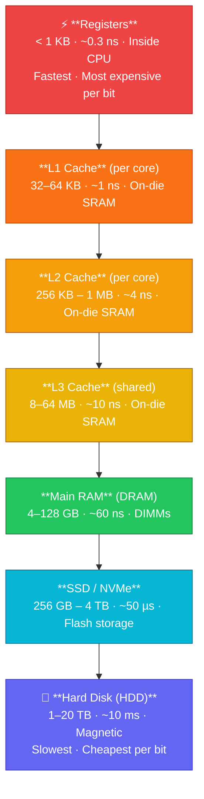

# Memory Hierarchy

## What You'll Learn

In this tutorial, you'll explore the memory hierarchy - a fundamental concept in computer architecture that organizes memory systems by speed, size, and cost. You'll understand:

- The levels of memory hierarchy from registers to disk
- Cache memory organization and types (L1, L2, L3)
- How cache hits and misses impact performance
- Cache mapping techniques (direct, associative, set-associative)
- Principles of locality (temporal and spatial)
- The memory wall problem
- How to analyze cache performance
- Tools to examine CPU cache on Linux systems

## Introduction

Modern computer systems use a hierarchy of memory technologies, each with different speeds, sizes, and costs. The goal is to provide the illusion of large, fast, and cheap memory by combining these technologies effectively.

### The Memory Hierarchy Pyramid



## Memory Hierarchy Levels

### 1. Registers

**Characteristics**:
- Built into the CPU
- Fastest memory available
- Very limited capacity (typically 16-32 registers)
- Access time: < 1 nanosecond
- Cost: Extremely expensive per bit

**Usage**: Store operands for ALU operations, instruction addresses, temporary values.

### 2. Cache Memory

**Characteristics**:
- Located on or very close to CPU chip
- Multiple levels (L1, L2, L3)
- SRAM (Static RAM) technology
- Access time: 1-20 nanoseconds
- Cost: Very expensive per bit

**Cache Levels**:

```
┌─────────────────────────────────────────────────┐
│              CPU Core                           │
│  ┌────────────┐  ┌────────────┐                │
│  │ L1 Data    │  │ L1 Instr   │  ← Per Core   │
│  │ 32-64 KB   │  │ 32-64 KB   │                │
│  └─────┬──────┘  └─────┬──────┘                │
│        │               │                        │
│        └───────┬───────┘                        │
│                │                                │
│        ┌───────▼────────┐                       │
│        │   L2 Cache     │       ← Per Core     │
│        │  256 KB-1 MB   │                       │
│        └───────┬────────┘                       │
└────────────────┼──────────────────────────────  ┘
                 │
         ┌───────▼────────┐
         │   L3 Cache     │       ← Shared
         │   8-64 MB      │
         └───────┬────────┘
                 │
         ┌───────▼────────┐
         │   Main Memory  │
         │   (DRAM)       │
         └────────────────┘
```

| Cache Level | Typical Size | Access Time | Scope |
|-------------|--------------|-------------|-------|
| L1 Data | 32-64 KB | 1-2 ns | Per core |
| L1 Instruction | 32-64 KB | 1-2 ns | Per core |
| L2 | 256 KB-1 MB | 3-10 ns | Per core |
| L3 | 8-64 MB | 10-20 ns | Shared across cores |

### 3. Main Memory (RAM)

**Characteristics**:
- DRAM (Dynamic RAM) technology
- Volatile (loses data when power off)
- Access time: 50-100 nanoseconds
- Typical size: 4-128 GB
- Cost: Moderate per bit

### 4. Secondary Storage (SSD/HDD)

**Characteristics**:
- Non-volatile (persists without power)
- Much larger capacity
- Access time: 0.1-10 milliseconds
- Cost: Inexpensive per bit

| Storage Type | Access Time | Typical Size | Cost/GB |
|--------------|-------------|--------------|---------|
| NVMe SSD | 0.1 ms | 256 GB-4 TB | $0.10-0.30 |
| SATA SSD | 0.5 ms | 256 GB-4 TB | $0.08-0.20 |
| HDD | 5-10 ms | 1-20 TB | $0.02-0.05 |

## Access Time Comparison

```
Operation                            Time (approx)    Human Scale
─────────────────────────────────────────────────────────────────
L1 cache reference                   1 ns             1 second
L2 cache reference                   4 ns             4 seconds
L3 cache reference                   12 ns            12 seconds
Main memory reference                100 ns           1.7 minutes
SSD random read                      100,000 ns       1.2 days
HDD seek + read                      10,000,000 ns    4 months
```

If L1 cache access was 1 second, accessing HDD would take 4 months!

## Cache Memory in Detail

### Cache Line

A **cache line** (or cache block) is the unit of data transfer between cache and main memory.

- Typical size: 64 bytes
- When CPU requests 1 byte, entire cache line is fetched
- Exploits spatial locality

```
Cache Line Structure (64 bytes):
┌───────────────────────────────────────────────────────────┐
│  Byte 0  │  Byte 1  │  ...  │  Byte 62  │  Byte 63  │
└───────────────────────────────────────────────────────────┘
```

### Cache Hit and Miss

**Cache Hit**: Requested data is found in cache
- Fast access
- CPU continues execution without delay

**Cache Miss**: Requested data is not in cache
- Must fetch from slower memory
- Causes pipeline stall
- Data brought to cache for future use

```
Memory Access Flow:

CPU Request
    │
    ▼
┌─────────┐
│ Check   │───Yes─→ Cache Hit  ─→ Return Data (Fast)
│ Cache   │
└─────────┘
    │
    No (Cache Miss)
    │
    ▼
┌─────────┐
│ Fetch   │
│ from    │
│ RAM     │
└─────────┘
    │
    ▼
┌─────────┐
│ Update  │
│ Cache   │
└─────────┘
    │
    ▼
Return Data (Slow)
```

### Hit Ratio and Effective Access Time

**Hit Ratio (h)**: Fraction of accesses found in cache

```
Hit Ratio = Cache Hits / Total Accesses
```

**Effective Access Time (EAT)**:

```
EAT = h × Cache_Time + (1 - h) × (Cache_Time + Memory_Time)
```

**Example Calculation**:
- L1 cache time: 1 ns
- Memory time: 100 ns
- Hit ratio: 95%

```
EAT = 0.95 × 1 + 0.05 × (1 + 100)
    = 0.95 + 0.05 × 101
    = 0.95 + 5.05
    = 6.0 ns
```

Even with 5% misses, average access time is only 6 ns instead of 100 ns!

## Cache Mapping Techniques

### 1. Direct Mapped Cache

Each memory block maps to exactly one cache line.

```
Mapping: Cache Line = (Memory Block Address) % (Number of Cache Lines)

Memory Address Structure:
┌──────────┬──────────┬────────┐
│   Tag    │  Index   │ Offset │
└──────────┴──────────┴────────┘
```

**Example**: 8 cache lines, 64-byte lines, 32-bit addresses

```
Address bits: | Tag (22 bits) | Index (3 bits) | Offset (6 bits) |
```

**Advantage**: Simple, fast, cheap
**Disadvantage**: High conflict misses

```
Memory Blocks:       Cache Lines:
   0  ───────┐          0
   1         │          1
   2         │          2
   3         │          3
   4         ├────→     4
   5         │          5
   6         │          6
   7         │          7
   8  ───────┘
   9  ───────────────→  1 (conflict!)
```

### 2. Fully Associative Cache

Any memory block can go in any cache line.

```
Memory Address Structure:
┌──────────────────┬────────┐
│      Tag         │ Offset │
└──────────────────┴────────┘
```

**Advantage**: No conflict misses, highest hit rate
**Disadvantage**: Expensive, slow (must check all lines)

```
Memory Block can go to ANY cache line:
Block 0 ──→  Line 0, 1, 2, 3, 4, 5, 6, or 7
```

### 3. Set-Associative Cache

Compromise between direct and fully associative.

**N-way set-associative**: Memory block maps to a set, can go in any line within that set.

```
Memory Address Structure (4-way set-associative):
┌──────────┬──────────┬────────┐
│   Tag    │  Set     │ Offset │
└──────────┴──────────┴────────┘

Cache Organization:
Set 0: [ Line 0 ][ Line 1 ][ Line 2 ][ Line 3 ]
Set 1: [ Line 4 ][ Line 5 ][ Line 6 ][ Line 7 ]
Set 2: [ Line 8 ][ Line 9 ][ Line 10][ Line 11]
```

**Common**: 4-way, 8-way, 16-way set-associative

| Type | Flexibility | Cost | Speed |
|------|-------------|------|-------|
| Direct Mapped | Low | Low | Fast |
| 4-way Set-Associative | Medium | Medium | Medium |
| Fully Associative | High | High | Slow |

## Principles of Locality

Cache performance relies on **locality of reference**.

### Temporal Locality

**Principle**: Recently accessed data is likely to be accessed again soon.

**Examples**:
- Loop counter variables
- Frequently called functions
- Stack frame variables

```c
// Temporal locality example
for (int i = 0; i < 1000; i++) {  // 'i' accessed repeatedly
    sum += array[i];               // 'sum' accessed repeatedly
}
```

### Spatial Locality

**Principle**: Data near recently accessed data is likely to be accessed soon.

**Examples**:
- Array elements accessed sequentially
- Sequential instruction execution
- Struct member access

```c
// Spatial locality example
int array[1000];
for (int i = 0; i < 1000; i++) {
    sum += array[i];  // Accessing consecutive array elements
}
```

### Locality Visualization

```
Memory Access Pattern (good spatial locality):
Address: 1000  1004  1008  1012  1016  1020  1024 ...
Access:   ▓     ▓     ▓     ▓     ▓     ▓     ▓
         [────────────Cache Line────────────]

Memory Access Pattern (poor spatial locality):
Address: 1000        5000        9000        13000
Access:   ▓                      ▓           ▓
         [───Line1──]  [───Line2──]  [───Line3──]
         Each access loads a new cache line!
```

## The Memory Wall Problem

**Memory Wall**: Growing gap between CPU speed and memory speed.

```
Performance Growth Over Time:

CPU Speed
    │     ▲
    │    ╱ │ 60% per year
    │   ╱  │
    │  ╱   │
    │ ╱    │
    │╱     │
    ├──────┼──────────→ Time
    │      │ ▲
    │      │╱  9% per year
    │      ╱
Memory Speed
```

**Consequences**:
- CPU often waits for memory
- Memory latency dominates performance
- More cores don't help if memory-bound

**Solutions**:
- Larger caches (L3 now 64+ MB)
- Better cache algorithms
- Prefetching techniques
- Memory-level parallelism
- High Bandwidth Memory (HBM)

## Examining Cache on Linux

### View CPU Cache Information

```bash
# View cache hierarchy
lscpu | grep -i cache

# Example output:
# L1d cache:           32K
# L1i cache:           32K
# L2 cache:            256K
# L3 cache:            8192K
```

### Detailed Cache Information

```bash
# View detailed cache info
cat /sys/devices/system/cpu/cpu0/cache/index0/size
cat /sys/devices/system/cpu/cpu0/cache/index0/type
cat /sys/devices/system/cpu/cpu0/cache/index0/level

# Cache levels:
# index0 = L1d (data)
# index1 = L1i (instruction)
# index2 = L2
# index3 = L3
```

### Reading /proc/cpuinfo

```bash
# View cache line size
cat /proc/cpuinfo | grep cache

# Example output:
# cache size : 8192 KB
# cache_alignment : 64
```

### C Program to Examine Cache

```c
#include <stdio.h>
#include <stdlib.h>
#include <time.h>

#define KB 1024
#define MB (1024 * KB)

void measure_access_time(size_t size) {
    int *array = malloc(size);
    if (!array) {
        perror("malloc");
        return;
    }
    
    // Initialize array
    for (size_t i = 0; i < size / sizeof(int); i++) {
        array[i] = i;
    }
    
    // Measure access time
    clock_t start = clock();
    long long sum = 0;
    
    for (int iter = 0; iter < 1000; iter++) {
        for (size_t i = 0; i < size / sizeof(int); i += 16) {
            sum += array[i];  // Access every 64 bytes (cache line)
        }
    }
    
    clock_t end = clock();
    double time_taken = ((double)(end - start)) / CLOCKS_PER_SEC;
    
    printf("Size: %6zu KB, Time: %.6f s, Sum: %lld\n", 
           size / KB, time_taken, sum);
    
    free(array);
}

int main() {
    printf("Measuring memory access times:\n");
    printf("(Expect slowdown when exceeding cache sizes)\n\n");
    
    // Test different sizes
    measure_access_time(16 * KB);   // Fits in L1
    measure_access_time(64 * KB);   // Fits in L1
    measure_access_time(256 * KB);  // Fits in L2
    measure_access_time(1 * MB);    // Fits in L2/L3
    measure_access_time(8 * MB);    // Fits in L3
    measure_access_time(32 * MB);   // Exceeds L3
    measure_access_time(128 * MB);  // Main memory
    
    return 0;
}
```

**Compile and run**:
```bash
gcc -O2 -o cache_test cache_test.c
./cache_test
```

## Cache Performance Example

### Comparing Array Traversal

```c
#include <stdio.h>
#include <stdlib.h>
#include <time.h>

#define SIZE 8192

// Row-major order (good spatial locality)
void traverse_row_major(int array[SIZE][SIZE]) {
    long sum = 0;
    for (int i = 0; i < SIZE; i++) {
        for (int j = 0; j < SIZE; j++) {
            sum += array[i][j];
        }
    }
    printf("Row-major sum: %ld\n", sum);
}

// Column-major order (poor spatial locality)
void traverse_column_major(int array[SIZE][SIZE]) {
    long sum = 0;
    for (int j = 0; j < SIZE; j++) {
        for (int i = 0; i < SIZE; i++) {
            sum += array[i][j];
        }
    }
    printf("Column-major sum: %ld\n", sum);
}

int main() {
    int (*array)[SIZE] = malloc(SIZE * SIZE * sizeof(int));
    
    if (!array) {
        perror("malloc");
        return 1;
    }
    
    // Initialize
    for (int i = 0; i < SIZE; i++) {
        for (int j = 0; j < SIZE; j++) {
            array[i][j] = i + j;
        }
    }
    
    clock_t start, end;
    
    // Test row-major
    start = clock();
    traverse_row_major(array);
    end = clock();
    printf("Row-major time: %.3f s\n", 
           ((double)(end - start)) / CLOCKS_PER_SEC);
    
    // Test column-major
    start = clock();
    traverse_column_major(array);
    end = clock();
    printf("Column-major time: %.3f s\n", 
           ((double)(end - start)) / CLOCKS_PER_SEC);
    
    free(array);
    return 0;
}
```

**Expected result**: Row-major traversal is significantly faster due to better cache utilization.

## Key Takeaways

1. **Memory hierarchy** organizes storage by speed, size, and cost
2. **Cache memory** bridges the speed gap between CPU and RAM
3. **Cache hits** are crucial for performance; misses are expensive
4. **Three mapping techniques**: direct, fully associative, set-associative
5. **Temporal locality**: reusing recently accessed data
6. **Spatial locality**: accessing nearby data
7. **Memory wall** is a growing challenge in computer architecture
8. **Cache-aware programming** can dramatically improve performance

## Exercises

### Beginner

1. Calculate the effective access time for a system with:
   - L1 cache: 2 ns, 90% hit rate
   - L2 cache: 10 ns, 95% hit rate
   - RAM: 100 ns

2. If a cache has 16 lines and uses direct mapping, which cache line will memory block 45 map to?

3. Explain why accessing array elements sequentially is faster than random access.

### Intermediate

4. A system has a 4-way set-associative cache with 64 cache lines (16 sets). Memory addresses are 32 bits, cache line size is 64 bytes. How many bits for tag, set index, and offset?

5. Write a C program that demonstrates the performance difference between L1, L2, and L3 cache by accessing arrays of different sizes.

6. Given memory accesses: 0, 4, 8, 12, 16, 20, 0, 4, 8, 12
   Calculate hit ratio for a direct-mapped cache with 4 lines (16 bytes per line).

### Advanced

7. Implement a cache simulator in C that supports:
   - Configurable cache size and line size
   - Direct, fully associative, or N-way set-associative mapping
   - LRU replacement policy
   - Statistics on hits, misses, and hit ratio

8. Analyze the cache behavior of matrix multiplication. Why is blocking (tiling) more cache-friendly?

9. Design an experiment to measure the actual size of L1, L2, and L3 caches on your system by observing access time changes.

## Navigation

- **Previous**: [← README](./README.md)
- **Next**: [Address Spaces →](./02_address_spaces.md)
- **Up**: [Memory Management](./README.md)

---

*Understanding the memory hierarchy is essential for writing high-performance code. Always consider cache behavior when optimizing programs!*
