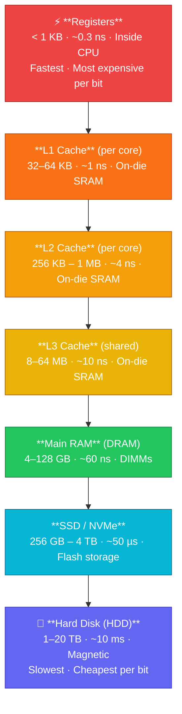

# Memory Hierarchy

## Kya Seekhoge Is Tutorial Mein

Socho ek second ke liye — tumhare paas Zomato ka ek delivery boy hai jo restaurant se ghar tak khana pahunchata hai. Agar restaurant tumhare ghar ke bilkul bagal mein ho, delivery 2 minute mein. Agar restaurant doosre shehar mein ho, delivery mein 2 din lag jayenge. Computer memory bhi exactly aisi hi hai — CPU ke jitna paas memory hogi, utni fast hogi, lekin utni hi mehngi aur chhoti bhi hogi. Isi trade-off ko samajhne ka naam hai **Memory Hierarchy**.

Is tutorial mein hum cover karenge:

- Memory hierarchy ke levels — registers se lekar disk tak
- Cache memory ka organization aur types (L1, L2, L3)
- Cache hits aur misses performance ko kaise affect karte hain
- Cache mapping techniques (direct, associative, set-associative)
- Locality ke principles (temporal aur spatial)
- Memory wall problem — CPU aur memory ki speed race mein memory kyun peeche reh gayi
- Cache performance kaise analyze karte hain
- Linux pe CPU cache examine karne ke tools

## Introduction

**Kya hota hai?** Modern computers ek hi type ki memory use nahi karte. Agar sirf ek hi type hoti — jo super fast ho — toh woh itni mehngi hoti ki tumhara laptop ek flat ke barabar padta. Aur agar sirf woh type hoti jo sasti ho, toh CPU itna slow ho jata ki ek WhatsApp message type karne mein bhi lag jaati.

Isliye engineers ne ek smart trick nikali: **multiple memory technologies ko layers mein arrange karo**, jahan har layer speed, size aur cost ka alag balance dete hai. Isse ek illusion create hota hai ki tumhare paas bahut badi, bahut fast, aur bahut sasti memory hai — jabki reality mein teeno cheezein ek saath kabhi possible nahi hoti.

Yeh bilkul CRED ya OYO jaisa hai — CRED ka premium credit card experience sabko nahi milta (expensive, limited), lekin unke basic app features sabko milte hain (cheap, widely available). Memory mein bhi registers "premium" hain (bohot fast, bohot kam) aur hard disk "basic" hai (bohot slow, bohot zyada).

### The Memory Hierarchy Pyramid



Upar se neeche jaate hue — speed kam hoti jaati hai, size badhti jaati hai, aur cost-per-byte ghatta jaata hai. Top pe registers hain jo CPU ke andar hi baithe hain (ekdum apne bedroom ki tarah — sabse paas, sabse fast access), aur sabse neeche hard disk hai (jaise ek warehouse dusre shehar mein — sasta storage, lekin retrieve karne mein time lagta hai).

## Memory Hierarchy Levels

### 1. Registers

**Kya hote hain?** Registers CPU ke andar hi banaye gaye tiny storage slots hain. Inhe samjho jaise tumhare hath mein pakdi hui cheez — jo abhi use karni hai woh hath mein rakho, baaki cheezein bag mein (RAM) ya ghar ke locker mein (disk).

**Characteristics**:
- CPU ke andar hi built-in hote hain
- Sabse fast memory available hai poore system mein
- Bohot limited capacity (typically sirf 16-32 registers)
- Access time: < 1 nanosecond — matlab bijli ki speed se bhi fast
- Cost: Per bit ke hisaab se extremely expensive

**Usage**: ALU operations ke operands store karna, instruction addresses rakhna, temporary values hold karna. Jab bhi CPU koi addition karta hai (jaise `a + b`), dono numbers pehle registers mein load hote hain, tabhi calculation ho paati hai.

> [!info]
> Registers itne kam kyun hote hain? Kyunki inhe banane ke liye sabse fast transistors use hote hain, jo bohot jagah aur power lete hain. Agar CPU mein 1000 registers daal do, toh chip ka size aur cost bohot badh jayega — bilkul waise jaise Mumbai mein sea-facing flats bohot kam hote hain kyunki har jagah sea-facing nahi ho sakti.

### 2. Cache Memory

**Kya hota hai?** Cache ek middle-man hai CPU aur RAM ke beech — jaise Swiggy ka "dark store" hota hai jo customer ke area ke paas hi common items stock karke rakhta hai, taaki har order pe far-away warehouse tak na jaana pade. Cache bhi CPU ke frequently-used data ko apne paas rakh leta hai taaki baar-baar RAM tak na jaana pade.

**Characteristics**:
- CPU chip ke upar ya bohot paas located
- Multiple levels hote hain (L1, L2, L3)
- SRAM (Static RAM) technology use hoti hai
- Access time: 1-20 nanoseconds
- Cost: Bohot expensive per bit

**Cache Levels**:

```
┌─────────────────────────────────────────────────┐
│              CPU Core                           │
│  ┌────────────┐  ┌────────────┐                │
│  │ L1 Data    │  │ L1 Instr   │  ← Per Core   │
│  │ 32-64 KB   │  │ 32-64 KB   │                │
│  └─────┬──────┘  └─────┬──────┘                │
│        │               │                        │
│        └───────┬───────┘                        │
│                │                                │
│        ┌───────▼────────┐                       │
│        │   L2 Cache     │       ← Per Core     │
│        │  256 KB-1 MB   │                       │
│        └───────┬────────┘                       │
└────────────────┼──────────────────────────────  ┘
                 │
         ┌───────▼────────┐
         │   L3 Cache     │       ← Shared
         │   8-64 MB      │
         └───────┬────────┘
                 │
         ┌───────▼────────┐
         │   Main Memory  │
         │   (DRAM)       │
         └────────────────┘
```

Socho L1 ko tumhari khud ki jeb ki tarah — sirf tumhare paas hai, sabse fast access, lekin bohot chhoti (data aur instructions ke liye alag-alag jeb hoti hai, isliye "L1 Data" aur "L1 Instruction" separate hote hain). L2 thoda bada hai — tumhare bag ki tarah, thoda slow but zyada saaman aata hai. L3 sabse bada hai lekin **shared** — jaise office ka common pantry, jise saare employees (CPU cores) use karte hain.

| Cache Level | Typical Size | Access Time | Scope |
|-------------|--------------|-------------|-------|
| L1 Data | 32-64 KB | 1-2 ns | Per core |
| L1 Instruction | 32-64 KB | 1-2 ns | Per core |
| L2 | 256 KB-1 MB | 3-10 ns | Per core |
| L3 | 8-64 MB | 10-20 ns | Shared across cores |

### 3. Main Memory (RAM)

**Kya hota hai?** RAM woh jagah hai jahan tumhare currently-running programs ka data rehta hai — jaise tumhare Chrome ke saare open tabs, VS Code ki files, sab kuch RAM mein load hota hai jab tak process chal rahi hai.

**Characteristics**:
- DRAM (Dynamic RAM) technology
- Volatile hoti hai — matlab power off hote hi data gayab (jaise WhatsApp ka "typing..." status jo message send hote hi gayab ho jaata hai)
- Access time: 50-100 nanoseconds
- Typical size: 4-128 GB
- Cost: Moderate per bit — cache se sasti, disk se mehngi

RAM ko socho jaise tumhare kitchen ka slab — jo saaman abhi cook kar rahe ho woh slab pe rakha hai (RAM), poora raashan store room mein (disk) hai. Cooking karte waqt baar-baar store room jaana slow hoga, isliye zaruri cheezein slab pe hi rakhi jaati hain.

### 4. Secondary Storage (SSD/HDD)

**Kya hota hai?** Yeh permanent storage hai — jaise Google Drive ya tumhare phone ki gallery. Power off ho jaaye toh bhi data safe rehta hai.

**Characteristics**:
- Non-volatile — power ke bina bhi data persist karta hai
- Bohot bada capacity
- Access time: 0.1-10 milliseconds — RAM se hazaaron guna slow
- Cost: Per bit ke hisaab se sasta

| Storage Type | Access Time | Typical Size | Cost/GB |
|--------------|-------------|--------------|---------|
| NVMe SSD | 0.1 ms | 256 GB-4 TB | $0.10-0.30 |
| SATA SSD | 0.5 ms | 256 GB-4 TB | $0.08-0.20 |
| HDD | 5-10 ms | 1-20 TB | $0.02-0.05 |

> [!tip]
> HDD mein ek physical needle (read/write head) ghoomti disk pe move karke data dhundhta hai — bilkul purane record player jaisa. Isi wajah se HDD SSD se itna slow hota hai. SSD mein koi moving part nahi hota, sab electronic hai — flash memory chips.

## Access Time Comparison

Yeh numbers dekhne mein chhote lagte hain, lekin real world mein inka scale samajhna zaruri hai. Neeche ek table hai jahan har memory access ko "human time scale" pe convert kiya gaya hai — matlab agar L1 cache access 1 second lagta, toh baaki access kitna time lete:

```
Operation                            Time (approx)    Human Scale
─────────────────────────────────────────────────────────────────
L1 cache reference                   1 ns             1 second
L2 cache reference                   4 ns             4 seconds
L3 cache reference                   12 ns            12 seconds
Main memory reference                100 ns           1.7 minutes
SSD random read                      100,000 ns       1.2 days
HDD seek + read                      10,000,000 ns    4 months
```

Zara socho — agar L1 cache access sirf 1 second lagta hai, toh HDD se data laane mein **4 mahine** lag jaate! Yeh bilkul aisa hai jaise tum Zomato pe order karo aur khana 4 mahine baad aaye — koi bhi customer aisa app use nahi karega. Isi liye CPU designers itni mehnat karte hain cache ko efficient banane mein, taaki hum baar-baar RAM ya disk tak jaane se bachein.

## Cache Memory in Detail

### Cache Line

**Kya hota hai?** Ek **cache line** (ya cache block) woh minimum unit hai jo cache aur main memory ke beech transfer hoti hai. Jab CPU ko sirf 1 byte chahiye, tab bhi poori cache line (usually 64 bytes) fetch hoti hai.

**Kyun aisa karte hain?** Kyunki agar tumne ek byte access kiya, chances hain ki tum uske aas-paas ke bytes bhi jaldi access karoge (spatial locality — isko aage detail mein samjhenge). Yeh bilkul BigBasket ki tarah hai — jab tumhare ghar delivery aati hai, woh sirf tumhara ek item nahi laate, poore area ke multiple orders ek saath deliver karte hain kyunki "batch mein laana" efficient hota hai.

- Typical size: 64 bytes
- Jab CPU 1 byte request karta hai, poori cache line fetch hoti hai
- Spatial locality ko exploit karta hai

```
Cache Line Structure (64 bytes):
┌───────────────────────────────────────────────────────────┐
│  Byte 0  │  Byte 1  │  ...  │  Byte 62  │  Byte 63  │
└───────────────────────────────────────────────────────────┘
```

### Cache Hit and Miss

Yeh concept samajhna bohot zaruri hai kyunki poori cache performance isi pe depend karti hai.

**Cache Hit**: Jo data CPU ko chahiye, woh already cache mein maujood hai
- Fast access
- CPU bina rukey execution continue karta hai

**Cache Miss**: Jo data chahiye, woh cache mein nahi hai
- Slower memory (RAM) se fetch karna padta hai
- Pipeline stall hota hai — matlab CPU ko wait karna padta hai
- Data future use ke liye cache mein laaya jaata hai

Isko IRCTC ki tarah socho — agar tumhara PNR status already tumhare recent searches mein cached hai (jaise app ne abhi-abhi dikhaya tha), toh turant dikh jaata hai (**hit**). Lekin agar naya PNR check karna hai jo pehle kabhi search nahi kiya, toh server se fresh query karni padegi (**miss**) — jo obviously slower hai.

```
Memory Access Flow:

CPU Request
    │
    ▼
┌─────────┐
│ Check   │───Yes─→ Cache Hit  ─→ Return Data (Fast)
│ Cache   │
└─────────┘
    │
    No (Cache Miss)
    │
    ▼
┌─────────┐
│ Fetch   │
│ from    │
│ RAM     │
└─────────┘
    │
    ▼
┌─────────┐
│ Update  │
│ Cache   │
└─────────┘
    │
    ▼
Return Data (Slow)
```

### Hit Ratio and Effective Access Time

**Hit Ratio (h)**: Kitne fraction accesses cache mein hi mil gaye

```
Hit Ratio = Cache Hits / Total Accesses
```

**Effective Access Time (EAT)**: Yeh formula batata hai ki average mein ek memory access karne mein kitna time lagta hai, hits aur misses dono ko consider karte hue.

```
EAT = h × Cache_Time + (1 - h) × (Cache_Time + Memory_Time)
```

**Example Calculation** (isko step-by-step samjhte hain):
- L1 cache time: 1 ns
- Memory time: 100 ns
- Hit ratio: 95% (matlab 100 mein se 95 baar data cache mein mil jaata hai)

```
EAT = 0.95 × 1 + 0.05 × (1 + 100)
    = 0.95 + 0.05 × 101
    = 0.95 + 5.05
    = 6.0 ns
```

Dekho kamaal — sirf 5% misses hone ke bawajood, average access time sirf 6 ns hai, jabki agar hamesha RAM tak jaana padta toh 100 ns lagta. Yeh bilkul Ola/Uber jaisa hai — agar 95% baar tumhe apne area mein hi driver mil jaaye (fast), aur sirf 5% baar dusre area se bulana pade (slow), toh overall average wait time kaafi kam ho jaata hai.

## Cache Mapping Techniques

**Kyun zaruri hai?** Cache chhoti hai aur RAM bohot badi. Toh jab RAM ka koi block cache mein laana ho, decide karna padta hai ki woh block cache ke *kaunse* slot mein jayega. Yeh decision teen tareekon se ho sakta hai.

### 1. Direct Mapped Cache

**Kaise kaam karta hai?** Har memory block ka ek fixed, predetermined cache line hota hai — koi choice nahi hai. Yeh bilkul railway reservation jaisa hai jahan tumhara seat number tumhare PNR se directly calculate ho jaata hai — koi flexibility nahi, jo number aaya wahi seat milegi.

```
Mapping: Cache Line = (Memory Block Address) % (Number of Cache Lines)

Memory Address Structure:
┌──────────┬──────────┬────────┐
│   Tag    │  Index   │ Offset │
└──────────┴──────────┴────────┘
```

**Example**: 8 cache lines, 64-byte lines, 32-bit addresses

```
Address bits: | Tag (22 bits) | Index (3 bits) | Offset (6 bits) |
```

**Advantage**: Simple, fast, sasta hardware
**Disadvantage**: High conflict misses — matlab do alag memory blocks same cache line maang sakte hain, aur ek ko baahar nikalna padta hai baar-baar

```
Memory Blocks:       Cache Lines:
   0  ───────┐          0
   1         │          1
   2         │          2
   3         │          3
   4         ├────→     4
   5         │          5
   6         │          6
   7         │          7
   8  ───────┘
   9  ───────────────→  1 (conflict!)
```

Yahan dekho — Block 0 aur Block 8 dono Line 0 maangte hain (kyunki 8 lines hain aur modulo operation se dono ka result same aata hai). Agar program pehle Block 0 access kare, phir Block 8, phir wapas Block 0 — toh har baar cache miss hoga, kyunki dono ek doosre ko baar-baar evict kar rahe hain. Isko "thrashing" bolte hain — bilkul traffic signal pe do gaadiyon ka ek hi lane mein baar-baar aana-jaana.

### 2. Fully Associative Cache

**Kaise kaam karta hai?** Yahan koi fixed rule nahi — koi bhi memory block, cache ki kisi bhi line mein ja sakta hai. Yeh flexible parking system jaisa hai — jahan bhi jagah khaali mile, gaadi wahan park kar do.

```
Memory Address Structure:
┌──────────────────┬────────┐
│      Tag         │ Offset │
└──────────────────┴────────┘
```

**Advantage**: Koi conflict misses nahi, sabse zyada hit rate
**Disadvantage**: Expensive aur slow (kyunki CPU ko hardware se saari lines check karni padti hain "kya yeh data yahan hai?")

```
Memory Block can go to ANY cache line:
Block 0 ──→  Line 0, 1, 2, 3, 4, 5, 6, or 7
```

Isme problem yeh hai ki jab CPU data dhundhta hai, use har single cache line check karni padti hai parallel mein — jo bohot zyada circuitry maangta hai. Bilkul aisa jaise tum apna khoya hua phone dhundhne ke liye poore ghar ke har kamre, har almirah mein ek saath dekhna chaho — possible hai but resources bohot lagenge.

### 3. Set-Associative Cache

**Kya hai yeh?** Yeh direct-mapped aur fully-associative ke beech ka smart compromise hai — best of both worlds. Real world mein zyadatar CPUs isi ko use karte hain.

**N-way set-associative**: Memory block ek fixed "set" mein jaata hai (jaise direct mapping), lekin us set ke andar kisi bhi line mein ja sakta hai (jaise fully associative, lekin choices limited).

Isko socho jaise ek building mein tumhara flat number fixed hai (Set), lekin us floor pe 4 flats mein se kisi bhi ek mein tum reh sakte ho (4-way associative).

```
Memory Address Structure (4-way set-associative):
┌──────────┬──────────┬────────┐
│   Tag    │  Set     │ Offset │
└──────────┴──────────┴────────┘

Cache Organization:
Set 0: [ Line 0 ][ Line 1 ][ Line 2 ][ Line 3 ]
Set 1: [ Line 4 ][ Line 5 ][ Line 6 ][ Line 7 ]
Set 2: [ Line 8 ][ Line 9 ][ Line 10][ Line 11]
```

**Common**: 4-way, 8-way, 16-way set-associative — real CPUs mein yeh sabse zyada dikhte hain

| Type | Flexibility | Cost | Speed |
|------|-------------|------|-------|
| Direct Mapped | Low | Low | Fast |
| 4-way Set-Associative | Medium | Medium | Medium |
| Fully Associative | High | High | Slow |

> [!tip]
> Modern CPUs (Intel, AMD, ARM) mostly 8-way ya 16-way set-associative L1/L2 cache use karte hain — yeh sweet spot hai jahan conflict misses bhi kam hain aur hardware complexity bhi manageable hai.

## Principles of Locality

**Kyun zaruri hai?** Cache tabhi useful hai jab hum predict kar sakein ki CPU aage kya access karega. Yeh prediction do "locality" principles pe based hoti hai, jo har real-world program mein naturally dikhti hai.

### Temporal Locality

**Principle**: Jo data abhi access hua, woh jaldi phir se access hoga.

Socho tum Swiggy app baar-baar open karte ho apna current order track karne ke liye — same order status baar-baar check ho raha hai. Yeh temporal locality hai.

**Examples**:
- Loop counter variables (jaise `i` ek loop mein baar-baar check hota hai)
- Frequently called functions
- Stack frame variables

```c
// Temporal locality example
for (int i = 0; i < 1000; i++) {  // 'i' accessed repeatedly
    sum += array[i];               // 'sum' accessed repeatedly
}
```

Yahan `i` aur `sum` dono variables loop ke har iteration mein access ho rahe hain — same memory location baar-baar. Cache inhe ek baar laake rakh leta hai, aur baaki accesses fast hit ban jaate hain.

### Spatial Locality

**Principle**: Jo data recently accessed data ke "paas" hai, woh bhi jaldi access hoga.

Isko socho jaise tum kisi mall mein ek shop pe gaye, toh chances hain tum uske bagal ki shops bhi dekhoge — na ki poore mall mein random jump karoge.

**Examples**:
- Array elements sequentially access karna
- Sequential instruction execution
- Struct member access

```c
// Spatial locality example
int array[1000];
for (int i = 0; i < 1000; i++) {
    sum += array[i];  // Accessing consecutive array elements
}
```

Jab tum `array[0]` access karte ho, uski poori cache line (jisme `array[0]` se `array[15]` tak, agar int 4 bytes ka hai aur line 64 bytes ki) already fetch ho jaati hai. Toh `array[1]`, `array[2]`... yeh sab already cache mein maujood honge — free mein hits milte hain!

### Locality Visualization

```
Memory Access Pattern (good spatial locality):
Address: 1000  1004  1008  1012  1016  1020  1024 ...
Access:   ▓     ▓     ▓     ▓     ▓     ▓     ▓
         [────────────Cache Line────────────]

Memory Access Pattern (poor spatial locality):
Address: 1000        5000        9000        13000
Access:   ▓                      ▓           ▓
         [───Line1──]  [───Line2──]  [───Line3──]
         Each access loads a new cache line!
```

Pehle pattern mein, ek hi cache line fetch hone se kaafi saare accesses cover ho jaate hain — matlab kam misses. Doosre pattern mein har access alag cache line maangta hai — matlab har access ek potential cache miss hai. Yeh farak hi decide karta hai ki tumhara code fast chalega ya slow, chahe algorithm same ho.

> [!warning]
> Yehi wajah hai ki linked lists (jahan nodes memory mein bikhre hote hain) arrays se slower hote hain traversal ke liye — linked list mein poor spatial locality hoti hai, jabki array mein excellent.

## The Memory Wall Problem

**Kya hai yeh problem?** Pichle kuch dashकon mein CPU ki speed bohot fast badhi hai, lekin memory (RAM) ki speed utni fast nahi badhi. Is gap ko **Memory Wall** kehte hain.

Isko socho Flipkart ki delivery ki tarah — order karne ka speed (CPU) toh bohot fast ho gaya hai (1-click order), lekin actual delivery infrastructure (roads, trucks — yeh RAM hai) utni fast nahi badhi. Toh order fast place ho jaata hai, lekin delivery abhi bhi bottleneck hai.

```
Performance Growth Over Time:

CPU Speed
    │     ▲
    │    ╱ │ 60% per year
    │   ╱  │
    │  ╱   │
    │ ╱    │
    │╱     │
    ├──────┼──────────→ Time
    │      │ ▲
    │      │╱  9% per year
    │      ╱
Memory Speed
```

**Consequences**:
- CPU aksar memory ke liye wait karta hai (jise "stall" bolte hain)
- Memory latency hi performance ka bottleneck ban jaati hai
- Zyada cores add karne se bhi fayda nahi agar program memory-bound hai (kyunki sab cores wahi ek slow memory share kar rahe hain)

**Solutions** (jo industry ne nikale):
- Bigger caches (L3 ab 64+ MB tak hoti hai modern CPUs mein)
- Better cache algorithms (smarter prefetching, replacement policies)
- Prefetching techniques — CPU predict karke pehle hi data cache mein le aata hai
- Memory-level parallelism — multiple memory requests parallel mein bhejna
- High Bandwidth Memory (HBM) — naya memory type jo bohot zyada bandwidth deta hai

## Examining Cache on Linux

Ab thoda hands-on karte hain — dekhte hain apne actual system pe cache kaisi dikhti hai.

### View CPU Cache Information

```bash
# View cache hierarchy
lscpu | grep -i cache

# Example output:
# L1d cache:           32K
# L1i cache:           32K
# L2 cache:            256K
# L3 cache:            8192K
```

### Detailed Cache Information

```bash
# View detailed cache info
cat /sys/devices/system/cpu/cpu0/cache/index0/size
cat /sys/devices/system/cpu/cpu0/cache/index0/type
cat /sys/devices/system/cpu/cpu0/cache/index0/level

# Cache levels:
# index0 = L1d (data)
# index1 = L1i (instruction)
# index2 = L2
# index3 = L3
```

### Reading /proc/cpuinfo

```bash
# View cache line size
cat /proc/cpuinfo | grep cache

# Example output:
# cache size : 8192 KB
# cache_alignment : 64
```

### C Program to Examine Cache

Chalo ek chhota experiment karte hain — hum different sizes ke arrays access karke dekhenge ki kab performance drop hota hai (jab array cache size se bada ho jaata hai):

```c
#include <stdio.h>
#include <stdlib.h>
#include <time.h>

#define KB 1024
#define MB (1024 * KB)

void measure_access_time(size_t size) {
    int *array = malloc(size);
    if (!array) {
        perror("malloc");
        return;
    }
    
    // Initialize array
    for (size_t i = 0; i < size / sizeof(int); i++) {
        array[i] = i;
    }
    
    // Measure access time
    clock_t start = clock();
    long long sum = 0;
    
    for (int iter = 0; iter < 1000; iter++) {
        for (size_t i = 0; i < size / sizeof(int); i += 16) {
            sum += array[i];  // Access every 64 bytes (cache line)
        }
    }
    
    clock_t end = clock();
    double time_taken = ((double)(end - start)) / CLOCKS_PER_SEC;
    
    printf("Size: %6zu KB, Time: %.6f s, Sum: %lld\n", 
           size / KB, time_taken, sum);
    
    free(array);
}

int main() {
    printf("Measuring memory access times:\n");
    printf("(Expect slowdown when exceeding cache sizes)\n\n");
    
    // Test different sizes
    measure_access_time(16 * KB);   // Fits in L1
    measure_access_time(64 * KB);   // Fits in L1
    measure_access_time(256 * KB);  // Fits in L2
    measure_access_time(1 * MB);    // Fits in L2/L3
    measure_access_time(8 * MB);    // Fits in L3
    measure_access_time(32 * MB);   // Exceeds L3
    measure_access_time(128 * MB);  // Main memory
    
    return 0;
}
```

**Compile and run**:
```bash
gcc -O2 -o cache_test cache_test.c
./cache_test
```

Jab tum yeh chalaoge, dekhoge ki jaise-jaise array size L1 → L2 → L3 → main memory ki boundaries cross karta hai, waise-waise time badhta jayega — bilkul staircase pattern mein. Yeh practically dikhata hai ki cache hierarchy real hai aur performance pe seedha asar dalti hai.

## Cache Performance Example

### Comparing Array Traversal

Yeh ek classic example hai jo har developer ko pata hona chahiye — same data, same operations, bas access **order** alag hai, aur performance mein zameen-aasman ka farak aata hai.

```c
#include <stdio.h>
#include <stdlib.h>
#include <time.h>

#define SIZE 8192

// Row-major order (good spatial locality)
void traverse_row_major(int array[SIZE][SIZE]) {
    long sum = 0;
    for (int i = 0; i < SIZE; i++) {
        for (int j = 0; j < SIZE; j++) {
            sum += array[i][j];
        }
    }
    printf("Row-major sum: %ld\n", sum);
}

// Column-major order (poor spatial locality)
void traverse_column_major(int array[SIZE][SIZE]) {
    long sum = 0;
    for (int j = 0; j < SIZE; j++) {
        for (int i = 0; i < SIZE; i++) {
            sum += array[i][j];
        }
    }
    printf("Column-major sum: %ld\n", sum);
}

int main() {
    int (*array)[SIZE] = malloc(SIZE * SIZE * sizeof(int));
    
    if (!array) {
        perror("malloc");
        return 1;
    }
    
    // Initialize
    for (int i = 0; i < SIZE; i++) {
        for (int j = 0; j < SIZE; j++) {
            array[i][j] = i + j;
        }
    }
    
    clock_t start, end;
    
    // Test row-major
    start = clock();
    traverse_row_major(array);
    end = clock();
    printf("Row-major time: %.3f s\n", 
           ((double)(end - start)) / CLOCKS_PER_SEC);
    
    // Test column-major
    start = clock();
    traverse_column_major(array);
    end = clock();
    printf("Column-major time: %.3f s\n", 
           ((double)(end - start)) / CLOCKS_PER_SEC);
    
    free(array);
    return 0;
}
```

**Expected result**: Row-major traversal significantly fast hoga, kyunki C mein 2D arrays row-major order mein memory mein store hote hain — matlab `array[i][j]` aur `array[i][j+1]` memory mein bilkul saath-saath hote hain. Row-major traversal mein tum consecutive memory access kar rahe ho (spatial locality ka full fayda), jabki column-major mein har access ek naya "jump" hai — jaise tum ek hi building ke alag-alag floors pe bar-bar jaana chaho instead of ek floor pe saare kaam nipta ke agle floor jaana.

> [!warning]
> Yeh galti bohot common hai — beginners aksar nested loops likhte waqt yeh nahi sochte ki memory access pattern kya hai. Same "correct" logic, lekin loop order galat hone se program 5-10x slow chal sakta hai matrix operations mein. Jab bhi 2D arrays/matrices pe kaam karo, hamesha row-major order mein traverse karne ki koshish karo (C/C++ mein).

## Key Takeaways

- **Memory hierarchy** speed, size aur cost ke basis pe storage ko layers mein organize karta hai — registers sabse fast/mehenga/chhota, hard disk sabse slow/sasta/bada
- **Cache memory** CPU aur RAM ke beech ka bridge hai jo speed gap ko manage karta hai
- **Cache hits** performance ke liye crucial hain; **misses** kaafi expensive padte hain (RAM tak jaana padta hai)
- Cache **teen mapping techniques** use kar sakti hai: direct mapped (simple, fast, but conflict misses), fully associative (flexible, but expensive/slow), set-associative (best trade-off, real CPUs mein common)
- **Temporal locality**: recently accessed data ko dobara use karna
- **Spatial locality**: recently accessed data ke aas-paas ka data use karna
- **Memory wall** ek badhta hua challenge hai kyunki CPU speed memory speed se kahin zyada tezi se badh rahi hai
- **Cache-aware programming** (jaise sahi loop order, data structures) performance mein dramatic improvement de sakta hai — bina algorithm badle bhi

## Exercises

### Beginner

1. Calculate the effective access time for a system with:
   - L1 cache: 2 ns, 90% hit rate
   - L2 cache: 10 ns, 95% hit rate
   - RAM: 100 ns

2. If a cache has 16 lines and uses direct mapping, which cache line will memory block 45 map to?

3. Explain why accessing array elements sequentially is faster than random access.

### Intermediate

4. A system has a 4-way set-associative cache with 64 cache lines (16 sets). Memory addresses are 32 bits, cache line size is 64 bytes. How many bits for tag, set index, and offset?

5. Write a C program that demonstrates the performance difference between L1, L2, and L3 cache by accessing arrays of different sizes.

6. Given memory accesses: 0, 4, 8, 12, 16, 20, 0, 4, 8, 12
   Calculate hit ratio for a direct-mapped cache with 4 lines (16 bytes per line).

### Advanced

7. Implement a cache simulator in C that supports:
   - Configurable cache size and line size
   - Direct, fully associative, or N-way set-associative mapping
   - LRU replacement policy
   - Statistics on hits, misses, and hit ratio

8. Analyze the cache behavior of matrix multiplication. Why is blocking (tiling) more cache-friendly?

9. Design an experiment to measure the actual size of L1, L2, and L3 caches on your system by observing access time changes.

## Navigation

- **Previous**: [← README](./README.md)
- **Next**: [Address Spaces →](./02_address_spaces.md)
- **Up**: [Memory Management](./README.md)

---

*Memory hierarchy samajhna high-performance code likhne ke liye essential hai. Jab bhi program optimize karo, hamesha cache behavior ka dhyan rakho!*
