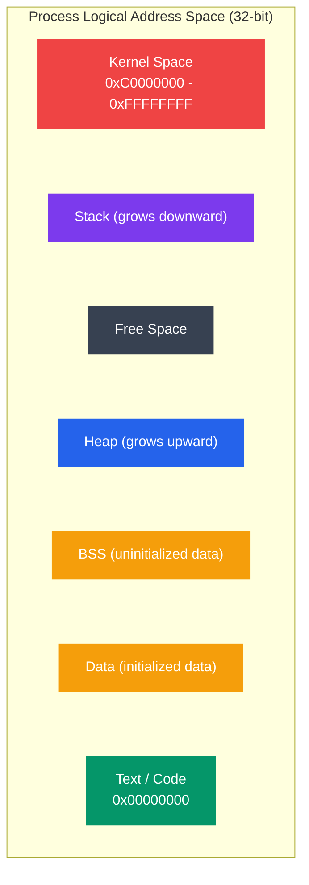
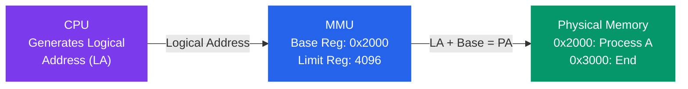

# Logical vs Physical Addresses

## Kya Seekhoge Is Tutorial Mein?

Socho tumhare paas ek app hai jo memory address `0x1234` pe kisi variable ko access karta hai. Ab sawaal ye hai — ye address *actual* RAM mein kahan hai? Kya har process ka apna alag `0x1234` ho sakta hai bina clash kiye? Yehi confusion clear karne ke liye ye tutorial hai.

Is note mein cover karenge:
- Logical (virtual) aur physical address space mein kya fark hai
- Address binding ke teen types — compile time, load time, execution time
- MMU (Memory Management Unit) kaise address translate karta hai
- Base aur limit registers — memory protection ka sabse basic tareeka
- Dynamic relocation — process ko memory mein move kaise karte hain bina usko pata chale
- Ek C program ka memory layout — text, data, bss, heap, stack
- `/proc` ka use karke Linux pe process memory map dekhna
- Real address translation calculations, step by step

## Introduction

OS ka sabse fundamental abstraction yahi hai — **logical address** (jo program use karta hai) ko **physical address** (jo actual hardware RAM location hai) se alag rakhna. Ye separation na hoti toh kya hota? Har process ko pata hona padta ki RAM mein exactly kahan store hoga, aur do processes kabhi bhi ek dusre ka data corrupt kar dete.

Zomato ki analogy leते hain: jab tum app pe order karte ho, tumhe pata nahi hota ki tumhara order kis restaurant ki kitchen mein, kis chef ke paas ja raha hai — tumhare liye bas ek "order ID" hai (logical address). Backend pe Zomato ka system decide karta hai ki actually kaunsi kitchen (physical location) mein order route karna hai. Isi tarah CPU ek "logical address" generate karta hai, aur MMU (hardware) decide karta hai ki actual RAM mein kahan jaana hai.

Ye separation teen badi cheezein deta hai:
1. **Multiple processes ek saath chal sakte hain** bina ek dusre ki memory access kiye
2. **Memory protection** — koi process galti se (ya jaan-bujh kar) doosre process ka data nahi chhed sakta
3. **Efficient memory use** — physical RAM se zyada bhi "virtually" allocate kar sakte hain

## Address Spaces

### Logical Address Space

**Kya hota hai Logical Address?** (isko **Virtual Address** bhi bolte hain)

Ye woh address hai jo CPU generate karta hai jab program run ho raha hota hai. Program ke perspective se yehi "sach" hai — usse pata hi nahi hota ki asli RAM mein cheezein kahan padi hain.

- CPU generate karta hai
- Program jo address "dekhta" aur use karta hai
- Physical memory se completely independent
- Har process ka apna alag logical address space hota hai (isliye do processes dono ke paas "address 0x1000" ho sakta hai, bina conflict ke!)
- Generally address 0 se start hota hai

Socho har process ko OS ek apna "personal universe" de deta hai — jaise har Swiggy restaurant partner ko apna alag dashboard milta hai, dusre restaurant ka data unhe dikhta hi nahi. Process A ko lagta hai poori 4GB (32-bit system pe) memory sirf uski hai, chahe physical RAM sirf 2GB hi kyun na ho.



```
Process Logical Address Space:
┌─────────────────────┐  0xFFFFFFFF (4GB for 32-bit)
│      Kernel         │
│      Space          │
├─────────────────────┤  0xC0000000
│                     │
│       Stack         │  ← High addresses
│         ↓           │
│                     │
│    (Free space)     │
│                     │
│         ↑           │
│       Heap          │
│                     │
├─────────────────────┤
│     BSS (uninit)    │
│     Data (init)     │
│     Text (code)     │
└─────────────────────┘  0x00000000
```

**Characteristics** (ye khaas baatein yaad rakho):
- Size CPU architecture pe depend karta hai (32-bit ke liye 2^32 bytes, 64-bit ke liye 2^64 bytes — matlab practically unlimited feel hota hai)
- Process isolation deta hai — ek process doosre ka logical address space touch nahi kar sakta
- Physical memory se bada address space allow karta hai (yehi virtual memory ka base idea hai)

### Physical Address Space

**Kya hota hai Physical Address?**

Ye woh actual address hai jo hardware RAM mein exist karta hai — jise memory controller directly dekhta hai. Isko "asli zameen" samjho, jabki logical address ek "naksha" (map) hai jo program ko dikhaya jata hai.

- Actual address hardware RAM mein
- Jo memory controller "dekhta" hai
- Installed RAM tak hi limited (jitni RAM lagi hai, utna hi space)
- Sabhi processes ke beech shared hota hai
- OS aur hardware (MMU) dono milke manage karte hain

Socho ek building mein saare tenants (processes) rehte hain, aur physical address building ke actual flats hain — Flat 101, Flat 102, etc. Sab tenants share karte hain same building (RAM), lekin har tenant ko apna "virtual" naam diya jata hai jisse woh doosre ke flat mein accidentally na ghus jaye.

```
Physical Memory:
┌─────────────────────┐  Physical address 0x100000000 (4GB)
│   Process C data    │
│   Process B stack   │
│   Process A heap    │
│   OS Kernel         │
│   Process B code    │
│   Process A code    │
└─────────────────────┘  Physical address 0x00000000
```

### Comparison — Dono Mein Fark Kya Hai?

| Aspect | Logical Address | Physical Address |
|--------|-----------------|------------------|
| **Generated by** | CPU | Memory Controller |
| **Visible to** | User programs | Hardware only |
| **Space per process** | Full address space | Shared physical RAM |
| **Range** | 0 to MAX (architecture limit) | 0 to RAM size |
| **Translation** | Required | None (actual location) |
| **Protection** | By isolation | By OS management |

> [!tip]
> Yaad rakhne ka simple tarika: **Logical = "program ki nazar se"**, **Physical = "hardware ki nazar se"**. Beech mein MMU translator ka kaam karta hai, jaise Google Translate do bandon ke beech baat karwata hai jo alag-alag language bolte hain.

## Address Binding

**Kya hota hai Address Binding?** Simple bhasha mein — instructions aur data ko actual memory addresses ke saath map karne ka process. Sawaal ye hai: ye mapping *kab* hoti hai — compile time pe, load time pe, ya run time pe? Yehi teen options hain, aur inka trade-off samajhna zaruri hai.

### Address Binding Ke Teen Types

#### 1. Compile Time Binding

**Kab hota hai**: Addresses compile time pe hi fix ho jaate hain
**Chahiye**: Compile time pe hi memory location pata honi chahiye
**Kahan use hota hai**: Embedded systems, simple environments (jahan hardware fixed hota hai, jaise ek microwave ka controller chip)

Socho tum IRCTC ka ek purana legacy system bana rahe ho jo sirf ek hi fixed server pe chalega, hamesha. Toh tum compile time pe hi decide kar sakte ho ki variable `x` exactly kis memory address pe baithega.

```
Source Code:
    int x = 10;
    
Compile Time Binding:
    x is at absolute address 0x1000
    
Generated Code:
    LOAD R1, [0x1000]    ← Absolute address hardcoded
```

**Problems (isme dikkat kya hai?)**:
- Agar starting address change ho jaye, poora program recompile karna padega
- Program ko relocate (kahin aur move) nahi kar sakte
- Programs ke beech koi protection nahi hai — sab hardcoded addresses use kar rahe hain

#### 2. Load Time Binding

**Kab hota hai**: Addresses tab decide hote hain jab program memory mein load hota hai
**Chahiye**: Compiler ko relocatable code generate karna padega (matlab offsets ke roop mein, absolute address nahi)
**Kahan use hota hai**: Simple operating systems

Ye thoda flexible hai compile-time se. Compiler bolta hai "x mera offset +0x100 hai", aur jab loader program ko RAM mein daalta hai tab wo base address decide karke final address calculate karta hai.

```
Source Code:
    int x = 10;
    
Load Time Binding:
    Compiler: x is at offset +0x100
    Loader: Base address is 0x2000
    Final: x is at 0x2000 + 0x100 = 0x2100
    
Generated Code:
    LOAD R1, [0x2100]    ← Address fixed at load time
```

**Advantages**:
- Code relocatable hai — different base addresses pe load ho sakta hai
- Load hone ke baad address fixed ho jaata hai

**Problems**:
- Ek baar load hone ke baad process move nahi kar sakte
- Flexibility limited hai — agar OS ko memory manage karne ke liye process ko hilana pade toh nahi kar sakta

#### 3. Execution Time Binding

**Kab hota hai**: Addresses execution ke during, runtime pe decide hote hain
**Chahiye**: Hardware support (MMU) — software akela ye kaam efficiently nahi kar sakta
**Kahan use hota hai**: Modern operating systems (Linux, Windows, macOS — sab yehi use karte hain)

Ye sabse flexible approach hai, aur isi wajah se aaj ke modern OS mein hi possible hai swapping aur virtual memory jaisi cheezein. Program hamesha ek fixed "logical" address use karta hai, aur *har memory access pe* MMU real-time mein usse physical address mein convert karta hai.

```
Source Code:
    int x = 10;
    
Execution Time Binding:
    Program uses: offset +0x100
    MMU translates: base + 0x100 → physical address
    Translation happens on every memory access
    
Program Code:
    LOAD R1, [0x100]     ← Logical address
    MMU: 0x100 → 0x2100  ← Physical address
```

**Advantages**:
- Process execution ke dauraan bhi memory mein move ho sakta hai
- Poori flexibility milti hai
- Swapping aur virtual memory jaise powerful features enable hote hain

> [!info]
> Ye teeno binding types ek spectrum hain — jitni der tak binding "postpone" karoge, utni zyada flexibility milegi, lekin utna hi zyada hardware support chahiye hoga. Compile time = zero flexibility, zero hardware need. Execution time = full flexibility, lekin MMU chahiye hi chahiye.

## Memory Management Unit (MMU)

**MMU** ek hardware component hai jo logical addresses ko physical addresses mein translate karta hai — real time mein, har single memory access ke liye. Isse Swiggy ke dispatch system ki tarah socho jo har order (logical address) ko sahi delivery partner (physical memory location) tak route karta hai, instantly, bina delivery boy ko exact GPS coordinates yaad rakhne ki zarurat ke.

### Basic MMU with Base and Limit Registers

Sabse simple MMU design mein bas do registers hote hain — **Base** aur **Limit**. Base register batata hai process kahan se start hota hai physical memory mein, aur Limit register batata hai process kitni memory use kar sakta hai (uski boundary).



```
┌─────────────────────────────────────────────────────────┐
│                      CPU                                │
│  ┌──────────────────────────────────────┐              │
│  │  Generate Logical Address (LA)       │              │
│  └──────────────────┬───────────────────┘              │
└─────────────────────┼──────────────────────────────────┘
                      │
                      ▼
          ┌───────────────────────┐
          │         MMU           │
          │  ┌──────────────┐     │
          │  │ Base Reg     │     │
          │  │  (0x2000)    │───┐ │
          │  └──────────────┘   │ │
          │                     │ │
          │  ┌──────────────┐   │ │
          │  │ Limit Reg    │   │ │
          │  │  (4096)      │   │ │
          │  └──────────────┘   │ │
          └─────────────────────┼─┘
                                │
                  LA + Base → PA│
                                ▼
                ┌───────────────────────────┐
                │   Physical Memory         │
                │                           │
                │  0x2000 ┌──────────────┐  │
                │         │  Process A   │  │
                │         │   Memory     │  │
                │  0x3000 └──────────────┘  │
                │                           │
                └───────────────────────────┘
```

### Base and Limit Registers — Ye Kaam Kaise Karte Hain?

**Base Register**: Process ka physical memory mein starting address store karta hai
**Limit Register**: Process ke logical address space ka size store karta hai (kitni memory allowed hai)

Har process context switch pe OS ye dono registers reload karta hai — process A chal raha ho toh Base/Limit process A ke, process B ka turn aaye toh Base/Limit process B ke. Isi trick se ek hi hardware saare processes ko isolate kar leta hai.

```c
// MMU address translation (conceptual)
Physical_Address = Logical_Address + Base_Register;

// Protection check
if (Logical_Address >= Limit_Register) {
    // Generate trap (segmentation fault)
    raise_exception(SEGMENTATION_FAULT);
}
```

### Address Translation Example — Ek Real Calculation

**Scenario**:
- Base Register: 0x10000
- Limit Register: 8192 (8 KB)
- Logical Address: 0x0100

**Translation**:
1. Check karo: 0x0100 < 8192 ✓ (bounds ke andar hai, sahi hai)
2. Physical Address = 0x0100 + 0x10000 = 0x10100

**Invalid Access ka case**:
- Logical Address: 0x3000 (12288)
- Check: 12288 >= 8192 ✗ (out of bounds, limit se bahar)
- Result: Trap to OS (segmentation fault) — CPU turant OS ko bolta hai "isko rok, ye galat jagah access kar raha hai"

> [!warning]
> Yehi mechanism hai jo "Segmentation Fault (core dumped)" error ke peeche hai jo tumne C programming karte waqt zaroor dekha hoga. Jab bhi tum ek array ko uske bounds se bahar access karte ho (buffer overflow), asal mein CPU limit register check fail kar raha hota hai aur OS process ko kill kar deta hai.

## Dynamic Relocation

**Kya hota hai Dynamic Relocation?** Process ko execution ke dauraan memory mein move karne ki capability — aur process ko pata bhi nahi chalta ki usse move kar diya gaya!

Socho tum Ola/Uber mein baithe ho aur driver traffic ki wajah se route change kar deta hai — tumhe destination pahunchne se koi farak nahi padta, bas raasta different hai. Waise hi OS process ko RAM ke ek jagah se doosri jagah shift kar sakta hai (jaise memory ko defragment karne ke liye), aur process ko sirf itna pata chalta hai ki uska Base register update ho gaya — uska apna logical address wahi ka wahi rehta hai.

```
Initial State:
┌────────────────────┐
│  Process A         │  Base: 0x10000
│  (8 KB)            │
└────────────────────┘
│  Free Space        │
│                    │
│  Process B         │  Base: 0x30000
│  (16 KB)           │
└────────────────────┘

After Moving Process A:
┌────────────────────┐
│  Free Space        │
│                    │
│  Process B         │  Base: 0x30000 (unchanged)
│  (16 KB)           │
└────────────────────┘
│  Process A         │  Base: 0x50000 (updated!)
│  (8 KB)            │
└────────────────────┘
```

**Relocation Ke Steps**:
1. Process ka state save karo (registers, program counter, etc.)
2. Memory contents ko naye location pe copy karo
3. Base register ko update karo
4. Execution resume karo

Process ko is pure operation ke baare mein zero idea hota hai — usko apna wahi purana logical address dikhta rehta hai, sirf peeche se MMU ka Base register badal diya gaya hota hai. Ye trick OS ko memory fragmentation solve karne, ya kisi process ko compact karne mein madad karti hai.

## Memory Layout of a C Program

### Segments — Ek Process Ki Memory Kaise Baati Hai?

Jab bhi tum koi C program compile karke chalate ho, uski memory ko OS alag-alag "segments" mein divide karta hai — har segment ka apna purpose hai:

```
High Memory (0xFFFFFFFF)
┌─────────────────────┐
│   Kernel Space      │  ← OS kernel (inaccessible to user)
├─────────────────────┤  0xC0000000 (typical boundary)
│                     │
│   Stack             │  ← Local variables, function calls
│     |               │     Grows downward
│     ↓               │
│                     │
│   (Unmapped)        │
│                     │
│     ↑               │
│     |               │
│   Heap              │  ← malloc(), dynamic allocation
│                     │     Grows upward
├─────────────────────┤
│   BSS               │  ← Uninitialized global/static vars
├─────────────────────┤
│   Data              │  ← Initialized global/static vars
├─────────────────────┤
│   Text (Code)       │  ← Program instructions (read-only)
└─────────────────────┘  0x00400000 (typical start)
Low Memory (0x00000000)
```

Har segment ka role samjhte hain:

- **Text (Code)**: Tumhara compiled program instructions yahan padi hoti hain. Ye read-only hota hai — isliye agar code segment mein galti se likhne ki koshish karo, crash ho jayega.
- **Data**: Initialized global/static variables yahan hote hain (jaise `int global_init = 42;`)
- **BSS** (Block Started by Symbol): Uninitialized global/static variables — inke liye disk pe space nahi lagti, sirf zero-filled memory allocate hoti hai runtime pe
- **Heap**: `malloc()`, `new` (C++), ya dynamic allocation yahan hoti hai. Ye upar ki taraf grow karta hai
- **Stack**: Function calls, local variables, return addresses yahan store hote hain. Neeche ki taraf grow karta hai

**Stack neeche kyun grow karta hai aur Heap upar kyun?** Ye design decision hai taaki dono ek doosre ki jagah "chheen" na le jab tak zaruri na ho — Stack aur Heap ke beech ka "Free Space" ek buffer zone ki tarah kaam karta hai. Jaise ek railway platform pe do trains opposite directions se aati hain lekin beech mein kaafi track hota hai taaki collision na ho — agar kabhi Stack aur Heap ek dusre se takra jayein, tabhi "stack overflow" ya "out of memory" jaisa error milta hai.

### Example C Program

Ye program dikhata hai ki alag-alag variables actually kis segment mein rehte hain:

```c
#include <stdio.h>
#include <stdlib.h>

int global_init = 42;        // Data segment
int global_uninit;           // BSS segment
const int constant = 100;    // Text segment (read-only data)

void function() {            // Text segment
    static int static_var;   // BSS segment
}

int main() {
    int local = 10;          // Stack
    int *heap_var = malloc(sizeof(int));  // Heap
    
    printf("Addresses:\n");
    printf("Text (code):       %p\n", (void*)main);
    printf("Text (constant):   %p\n", (void*)&constant);
    printf("Data (init):       %p\n", (void*)&global_init);
    printf("BSS (uninit):      %p\n", (void*)&global_uninit);
    printf("Heap:              %p\n", (void*)heap_var);
    printf("Stack:             %p\n", (void*)&local);
    
    free(heap_var);
    return 0;
}
```

**Sample output**:
```
Addresses:
Text (code):       0x400546
Text (constant):   0x400650
Data (init):       0x601040
BSS (uninit):      0x601044
Heap:              0x1a4b010
Stack:             0x7ffd8e5c1a2c
```

Notice karo:
- Code aur constants sabse low addresses pe
- Data aur BSS code ke turant baad
- Heap medium addresses pe (upar grow karta hai)
- Stack sabse high addresses pe (neeche grow karta hai)

Ye pattern har C program mein consistent milega — isliye interview mein agar koi puche "heap aur stack mein kya fark hai memory layout ke perspective se", ye diagram yaad rakho.

## Viewing Process Memory Maps

### Using /proc/[pid]/maps on Linux

Linux mein har running process ka memory layout `/proc/[pid]/maps` file mein directly dekha ja sakta hai. Ye kaafi useful hai debugging ke liye — jaise "memory leak kahan ho raha hai" ya "kya ye shared library load hui hai".

```bash
# View memory map of current shell
cat /proc/$$/maps

# View memory map of a specific process
cat /proc/1234/maps

# More readable format
pmap $$
```

### Example Output

```
address           perms offset  dev   inode       pathname
00400000-00452000 r-xp  00000000 08:01 12345678    /bin/bash
00651000-00652000 r--p  00051000 08:01 12345678    /bin/bash
00652000-0065b000 rw-p  00052000 08:01 12345678    /bin/bash
0065b000-00660000 rw-p  00000000 00:00 0           [heap]
7f1234567000-7f1234789000 r-xp 00000000 08:01 87654321 /lib/libc.so.6
7ffdc0000000-7ffdc0021000 rw-p 00000000 00:00 0    [stack]
```

**Har column ka matlab**:
- **address**: Virtual address range
- **perms**: Permissions (r=read, w=write, x=execute, p=private, s=shared)
- **offset**: File ke andar offset
- **dev**: Device (major:minor)
- **inode**: File ka inode
- **pathname**: Ye region kis file se backed hai

### Permission Flags

| Flag | Matlab | Example |
|------|---------|---------|
| r-xp | Read + Execute, Private | Code segment |
| r--p | Read-only, Private | Read-only data |
| rw-p | Read + Write, Private | Data, BSS, heap |
| rw-p | Read + Write, Private | Stack |

### Finding Specific Segments

```bash
# Find heap
cat /proc/$$/maps | grep heap

# Find stack
cat /proc/$$/maps | grep stack

# Find shared libraries
cat /proc/$$/maps | grep '\.so'

# Find executable code
cat /proc/$$/maps | grep 'r-xp'
```

> [!tip]
> Agla baar jab koi Node.js process bahut zyada memory kha raha ho aur samajh na aaye kyun, `/proc/<pid>/maps` aur `/proc/<pid>/smaps` check karo — dikh jayega ki heap grow ho raha hai ya kya koi memory-mapped file bahut jagah le rahi hai.

## Examining Memory Layout with Code

### C Program to Print Memory Regions

```c
#include <stdio.h>
#include <stdlib.h>
#include <unistd.h>

int global_var = 42;
int uninit_global;

void print_memory_info() {
    int local;
    int *heap = malloc(sizeof(int));
    
    printf("Process ID: %d\n", getpid());
    printf("\nMemory addresses:\n");
    printf("Text segment (code): %p\n", (void*)print_memory_info);
    printf("Data segment:        %p\n", (void*)&global_var);
    printf("BSS segment:         %p\n", (void*)&uninit_global);
    printf("Heap:                %p\n", (void*)heap);
    printf("Stack:               %p\n", (void*)&local);
    
    printf("\nView detailed map: cat /proc/%d/maps\n", getpid());
    
    // Keep program running to examine /proc
    printf("\nPress Enter to exit...");
    getchar();
    
    free(heap);
}

int main() {
    print_memory_info();
    return 0;
}
```

**Usage**:
```bash
gcc -o memmap memmap.c
./memmap &
# In another terminal:
cat /proc/$(pgrep memmap)/maps
```

### Script to Visualize Memory Layout

```bash
#!/bin/bash
# visualize_memory.sh - Visualize process memory layout

if [ -z "$1" ]; then
    echo "Usage: $0 <pid>"
    exit 1
fi

PID=$1

echo "Memory Layout for Process $PID"
echo "================================"
echo

# Stack
echo "STACK:"
cat /proc/$PID/maps | grep "\[stack\]"
echo

# Heap
echo "HEAP:"
cat /proc/$PID/maps | grep "\[heap\]"
echo

# Shared libraries
echo "SHARED LIBRARIES:"
cat /proc/$PID/maps | grep "\.so" | head -5
echo "..."
echo

# Executable segments
echo "EXECUTABLE (Text):"
cat /proc/$PID/maps | grep "r-xp" | head -3
echo

# Data segments
echo "DATA (Read-Write):"
cat /proc/$PID/maps | grep "rw-p" | grep -v "\[" | head -3
```

## Address Translation in Practice

### Example Calculation

**System Configuration**:
- Logical address space: 64 KB (16-bit addresses)
- Physical memory: 256 KB
- Process loaded at physical address 0x10000

**Translation**:
```
Logical Address: 0x1234
Base Register:   0x10000

Physical Address = 0x1234 + 0x10000 = 0x11234
```

Bas itna hi karna hai — MMU ke andar ye ek simple addition hai, lekin ye har single memory access pe hota hai, isliye hardware mein implement karna padta hai (software mein karoge toh CPU ka har instruction slow ho jayega).

### Multiple Processes Example

Ab dekho jab multiple processes ek saath RAM mein baithe hote hain — har ek ka apna Base aur Limit register:

```
Physical Memory (256 KB):
┌──────────────────────┐ 0x00000
│  OS Kernel           │
├──────────────────────┤ 0x10000
│  Process A           │  Base A: 0x10000, Limit: 16 KB
│  (16 KB)             │
├──────────────────────┤ 0x14000
│  Free                │
├──────────────────────┤ 0x20000
│  Process B           │  Base B: 0x20000, Limit: 32 KB
│  (32 KB)             │
├──────────────────────┤ 0x28000
│  Process C           │  Base C: 0x28000, Limit: 8 KB
│  (8 KB)              │
└──────────────────────┘ 0x40000

Process A accesses logical address 0x100:
  Physical = 0x100 + 0x10000 = 0x10100 ✓

Process B accesses logical address 0x100:
  Physical = 0x100 + 0x20000 = 0x20100 ✓

Both processes use same logical address but access different physical memory!
```

Dekha kitna elegant idea hai? Process A aur Process B dono ko lagta hai unka apna "0x100" address hai, lekin actually woh dono completely alag physical locations pe point kar rahe hain. Yehi wajah hai ki tum apne Node.js server ko aur browser ko ek saath chala sakte ho bina inko ek doosre ki memory dikhe — jaise do alag Swiggy customers apne apne app mein "Order #1" dekh sakte hain without knowing about each other's actual order.

## Protection with Base and Limit

### Hardware Protection Mechanism

```c
// MMU protection logic
void mmu_translate(uint32_t logical_addr, 
                   uint32_t base_reg, 
                   uint32_t limit_reg,
                   uint32_t *physical_addr) {
    
    // Check bounds
    if (logical_addr >= limit_reg) {
        // Segmentation fault!
        trap_to_os(SEGMENTATION_FAULT, logical_addr);
        return;
    }
    
    // Translate
    *physical_addr = logical_addr + base_reg;
}
```

### Protection Violations — Jab Cheezein Galat Ho Jaati Hain

```
Process tries to access logical address 0x5000
Limit register contains 0x4000 (16 KB)

Check: 0x5000 >= 0x4000 → TRUE
Result: SEGMENTATION FAULT

OS handles trap:
1. Print error message
2. Terminate process
3. Clean up resources
```

Jab bhi ye trap trigger hota hai, CPU turant control OS ko de deta hai (interrupt/trap mechanism ke through). OS phir decide karta hai process ko turant marna hai ya koi aur handling karni hai. Ye exact wahi mechanism hai jo tumhare Node.js process ko "Segmentation fault (core dumped)" dikhata hai jab koi native addon buffer overrun karta hai.

## Advantages of Logical Address Spaces

1. **Process Isolation**: Ek process doosre process ki memory access nahi kar sakta — security aur stability dono ke liye critical
2. **Relocation**: Processes physical memory mein kahin bhi run ho sakte hain, bina recompile kiye
3. **Memory Overcommitment**: Physical memory se zyada logical memory allocate kar sakte hain (yehi virtual memory ka core idea hai)
4. **Simplified Programming**: Programmer ko consistent address space milta hai — usse ye sochne ki zarurat nahi ki actual RAM mein kahan cheezein padi hain
5. **Memory Protection**: Hardware khud boundaries enforce karta hai — software ko manually check nahi karna padta
6. **Flexibility**: Swapping aur virtual memory jaise powerful features enable hote hain

## Key Takeaways

1. **Logical addresses** program use karta hai; **physical addresses** actual RAM locations hain
2. **Address binding** compile time, load time, ya execution time pe ho sakta hai — modern OS execution time binding use karte hain kyunki wahi sabse zyada flexible hai
3. **MMU** hardware support ke saath logical addresses ko physical addresses mein translate karta hai, har single memory access pe
4. **Base aur limit registers** simple relocation aur protection dono provide karte hain
5. **Dynamic relocation** process ko execution ke dauraan move karne deta hai, bina process ko pata chale
6. **Memory layout** mein text, data, BSS, heap, aur stack segments hote hain — har ek ka apna purpose hai
7. **/proc/[pid]/maps** Linux processes ka detailed memory layout dikhata hai — debugging ke liye bahut kaam ka tool hai
8. Address translation hi **process isolation** aur **efficient memory use** dono ko possible banata hai

## Exercises

### Beginner

1. Agar ek process ka base register = 0x2000 hai aur woh logical address 0x300 access karta hai, physical address kya hoga?

2. Explain karo — stack neeche kyun grow karta hai aur heap upar kyun, process ke address space mein?

3. Jab koi process apne limit register se bahar ka logical address access karne ki koshish karta hai, tab kya hota hai?

### Intermediate

4. Ek C program likho jo different memory segments ke variables ke addresses print kare. Apna output /proc/self/maps ke saath verify karo.

5. Diya gaya hai:
   - Physical memory: 512 KB
   - Process A: base = 0x10000, size = 64 KB
   - Process B: base = 0x30000, size = 128 KB
   
   Kya dono processes logical address 0x8000 access kar sakte hain? Unke physical addresses kya honge?

6. Ek bash script banao jo /proc/[pid]/maps parse kare aur har segment type (text, data, heap, stack, libraries) ki total memory usage calculate kare.

### Advanced

7. C mein ek simple MMU simulator implement karo jo:
   - Multiple processes ke liye base aur limit registers maintain kare
   - Logical se physical address translate kare
   - Protection violations detect aur report kare
   - Process context switching support kare

8. Explain karo — execution-time binding ko hardware support kyun chahiye. Agar ye purely software mein implement karne ki koshish karein toh kya hoga?

9. Kisi bade program (jaise web browser) ka memory layout analyze karo. Pata karo kaunsi shared libraries load hui hain aur kahan. Libraries high addresses pe kyun load hoti hain?

## Navigation

- **Previous**: [← Memory Hierarchy](./01_memory_hierarchy.md)
- **Next**: [Paging and Segmentation →](./03_paging_segmentation.md)
- **Up**: [Memory Management](./README.md)

---

*Address spaces samajhna fundamental hai ye samajhne ke liye ki modern operating systems processes ke beech isolation aur protection kaise provide karte hain!*
