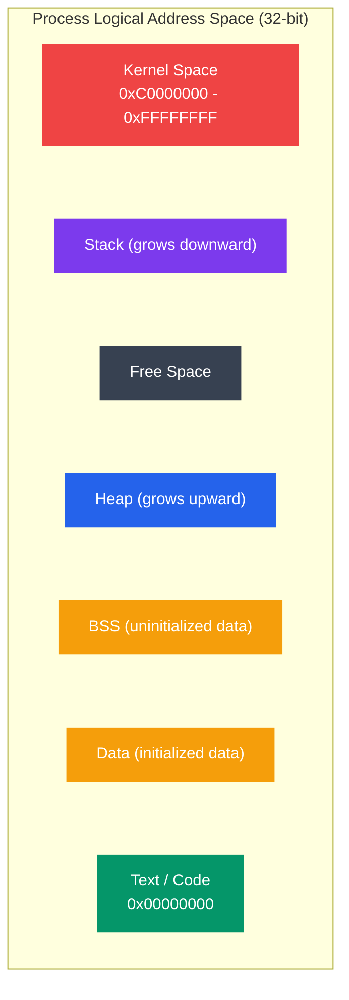

# Logical vs Physical Addresses

## What You'll Learn

In this tutorial, you'll explore the distinction between logical (virtual) and physical addresses, and understand how operating systems translate between them. You'll learn:

- The difference between logical and physical address spaces
- Three types of address binding (compile time, load time, execution time)
- How the Memory Management Unit (MMU) translates addresses
- Base and limit registers for memory protection
- Dynamic relocation mechanisms
- The memory layout of a process
- How to examine process memory maps using `/proc` on Linux
- Address translation examples and calculations

## Introduction

One of the fundamental abstractions provided by operating systems is the separation of **logical addresses** (used by programs) from **physical addresses** (actual hardware memory locations). This separation enables multiple processes to run concurrently, provides memory protection, and allows for efficient memory utilization.

## Address Spaces

### Logical Address Space

**Logical Address** (also called **Virtual Address**):
- Address generated by the CPU
- The address a program "sees" and uses
- Independent of physical memory
- Each process has its own logical address space
- Typically starts at address 0



```
Process Logical Address Space:
┌─────────────────────┐  0xFFFFFFFF (4GB for 32-bit)
│      Kernel         │
│      Space          │
├─────────────────────┤  0xC0000000
│                     │
│       Stack         │  ← High addresses
│         ↓           │
│                     │
│    (Free space)     │
│                     │
│         ↑           │
│       Heap          │
│                     │
├─────────────────────┤
│     BSS (uninit)    │
│     Data (init)     │
│     Text (code)     │
└─────────────────────┘  0x00000000
```

**Characteristics**:
- Size determined by CPU architecture (2^32 for 32-bit, 2^64 for 64-bit)
- Provides process isolation
- Allows address space larger than physical memory

### Physical Address Space

**Physical Address**:
- Actual address in hardware RAM
- What the memory controller sees
- Limited by installed RAM
- Shared among all processes
- Managed by OS and hardware (MMU)

```
Physical Memory:
┌─────────────────────┐  Physical address 0x100000000 (4GB)
│   Process C data    │
│   Process B stack   │
│   Process A heap    │
│   OS Kernel         │
│   Process B code    │
│   Process A code    │
└─────────────────────┘  Physical address 0x00000000
```

### Comparison

| Aspect | Logical Address | Physical Address |
|--------|-----------------|------------------|
| **Generated by** | CPU | Memory Controller |
| **Visible to** | User programs | Hardware only |
| **Space per process** | Full address space | Shared physical RAM |
| **Range** | 0 to MAX (architecture limit) | 0 to RAM size |
| **Translation** | Required | None (actual location) |
| **Protection** | By isolation | By OS management |

## Address Binding

**Address Binding**: Mapping of instructions and data to memory addresses.

### Three Types of Address Binding

#### 1. Compile Time Binding

**When**: Addresses determined at compile time
**Requires**: Known memory location at compile time
**Used for**: Embedded systems, simple environments

```
Source Code:
    int x = 10;
    
Compile Time Binding:
    x is at absolute address 0x1000
    
Generated Code:
    LOAD R1, [0x1000]    ← Absolute address hardcoded
```

**Problems**:
- Must recompile if starting address changes
- Cannot relocate program
- No protection between programs

#### 2. Load Time Binding

**When**: Addresses determined when program loaded into memory
**Requires**: Compiler generates relocatable code
**Used for**: Simple operating systems

```
Source Code:
    int x = 10;
    
Load Time Binding:
    Compiler: x is at offset +0x100
    Loader: Base address is 0x2000
    Final: x is at 0x2000 + 0x100 = 0x2100
    
Generated Code:
    LOAD R1, [0x2100]    ← Address fixed at load time
```

**Advantages**:
- Code is relocatable
- Fixed after loading

**Problems**:
- Cannot move process once loaded
- Limits flexibility

#### 3. Execution Time Binding

**When**: Addresses determined during execution
**Requires**: Hardware support (MMU)
**Used for**: Modern operating systems

```
Source Code:
    int x = 10;
    
Execution Time Binding:
    Program uses: offset +0x100
    MMU translates: base + 0x100 → physical address
    Translation happens on every memory access
    
Program Code:
    LOAD R1, [0x100]     ← Logical address
    MMU: 0x100 → 0x2100  ← Physical address
```

**Advantages**:
- Process can be moved during execution
- Full flexibility
- Enables swapping and virtual memory

## Memory Management Unit (MMU)

The **MMU** is hardware that translates logical addresses to physical addresses.

### Basic MMU with Base and Limit Registers


```
┌─────────────────────────────────────────────────────────┐
│                      CPU                                │
│  ┌──────────────────────────────────────┐              │
│  │  Generate Logical Address (LA)       │              │
│  └──────────────────┬───────────────────┘              │
└─────────────────────┼──────────────────────────────────┘
                      │
                      ▼
          ┌───────────────────────┐
          │         MMU           │
          │  ┌──────────────┐     │
          │  │ Base Reg     │     │
          │  │  (0x2000)    │───┐ │
          │  └──────────────┘   │ │
          │                     │ │
          │  ┌──────────────┐   │ │
          │  │ Limit Reg    │   │ │
          │  │  (4096)      │   │ │
          │  └──────────────┘   │ │
          └─────────────────────┼─┘
                                │
                  LA + Base → PA│
                                ▼
                ┌───────────────────────────┐
                │   Physical Memory         │
                │                           │
                │  0x2000 ┌──────────────┐  │
                │         │  Process A   │  │
                │         │   Memory     │  │
                │  0x3000 └──────────────┘  │
                │                           │
                └───────────────────────────┘
```

### Base and Limit Registers

**Base Register**: Contains starting physical address of the process
**Limit Register**: Contains size of the logical address space

```c
// MMU address translation (conceptual)
Physical_Address = Logical_Address + Base_Register;

// Protection check
if (Logical_Address >= Limit_Register) {
    // Generate trap (segmentation fault)
    raise_exception(SEGMENTATION_FAULT);
}
```

### Address Translation Example

**Scenario**:
- Base Register: 0x10000
- Limit Register: 8192 (8 KB)
- Logical Address: 0x0100

**Translation**:
1. Check: 0x0100 < 8192 ✓ (within bounds)
2. Physical Address = 0x0100 + 0x10000 = 0x10100

**Invalid Access**:
- Logical Address: 0x3000 (12288)
- Check: 12288 >= 8192 ✗ (out of bounds)
- Result: Trap to OS (segmentation fault)

## Dynamic Relocation

**Dynamic Relocation**: Ability to move process in memory during execution.

```
Initial State:
┌────────────────────┐
│  Process A         │  Base: 0x10000
│  (8 KB)            │
└────────────────────┘
│  Free Space        │
│                    │
│  Process B         │  Base: 0x30000
│  (16 KB)           │
└────────────────────┘

After Moving Process A:
┌────────────────────┐
│  Free Space        │
│                    │
│  Process B         │  Base: 0x30000 (unchanged)
│  (16 KB)           │
└────────────────────┘
│  Process A         │  Base: 0x50000 (updated!)
│  (8 KB)            │
└────────────────────┘
```

**Steps for Relocation**:
1. Save process state
2. Copy memory contents to new location
3. Update base register
4. Resume execution

Process continues without knowing it moved!

## Memory Layout of a C Program

### Segments

```
High Memory (0xFFFFFFFF)
┌─────────────────────┐
│   Kernel Space      │  ← OS kernel (inaccessible to user)
├─────────────────────┤  0xC0000000 (typical boundary)
│                     │
│   Stack             │  ← Local variables, function calls
│     |               │     Grows downward
│     ↓               │
│                     │
│   (Unmapped)        │
│                     │
│     ↑               │
│     |               │
│   Heap              │  ← malloc(), dynamic allocation
│                     │     Grows upward
├─────────────────────┤
│   BSS               │  ← Uninitialized global/static vars
├─────────────────────┤
│   Data              │  ← Initialized global/static vars
├─────────────────────┤
│   Text (Code)       │  ← Program instructions (read-only)
└─────────────────────┘  0x00400000 (typical start)
Low Memory (0x00000000)
```

### Example C Program

```c
#include <stdio.h>
#include <stdlib.h>

int global_init = 42;        // Data segment
int global_uninit;           // BSS segment
const int constant = 100;    // Text segment (read-only data)

void function() {            // Text segment
    static int static_var;   // BSS segment
}

int main() {
    int local = 10;          // Stack
    int *heap_var = malloc(sizeof(int));  // Heap
    
    printf("Addresses:\n");
    printf("Text (code):       %p\n", (void*)main);
    printf("Text (constant):   %p\n", (void*)&constant);
    printf("Data (init):       %p\n", (void*)&global_init);
    printf("BSS (uninit):      %p\n", (void*)&global_uninit);
    printf("Heap:              %p\n", (void*)heap_var);
    printf("Stack:             %p\n", (void*)&local);
    
    free(heap_var);
    return 0;
}
```

**Sample output**:
```
Addresses:
Text (code):       0x400546
Text (constant):   0x400650
Data (init):       0x601040
BSS (uninit):      0x601044
Heap:              0x1a4b010
Stack:             0x7ffd8e5c1a2c
```

Notice:
- Code and constants at low addresses
- Data and BSS after code
- Heap at medium addresses (grows up)
- Stack at high addresses (grows down)

## Viewing Process Memory Maps

### Using /proc/[pid]/maps on Linux

```bash
# View memory map of current shell
cat /proc/$$/maps

# View memory map of a specific process
cat /proc/1234/maps

# More readable format
pmap $$
```

### Example Output

```
address           perms offset  dev   inode       pathname
00400000-00452000 r-xp  00000000 08:01 12345678    /bin/bash
00651000-00652000 r--p  00051000 08:01 12345678    /bin/bash
00652000-0065b000 rw-p  00052000 08:01 12345678    /bin/bash
0065b000-00660000 rw-p  00000000 00:00 0           [heap]
7f1234567000-7f1234789000 r-xp 00000000 08:01 87654321 /lib/libc.so.6
7ffdc0000000-7ffdc0021000 rw-p 00000000 00:00 0    [stack]
```

**Column meanings**:
- **address**: Virtual address range
- **perms**: Permissions (r=read, w=write, x=execute, p=private, s=shared)
- **offset**: Offset into file
- **dev**: Device (major:minor)
- **inode**: File inode
- **pathname**: File backing this region

### Permission Flags

| Flag | Meaning | Example |
|------|---------|---------|
| r-xp | Read + Execute, Private | Code segment |
| r--p | Read-only, Private | Read-only data |
| rw-p | Read + Write, Private | Data, BSS, heap |
| rw-p | Read + Write, Private | Stack |

### Finding Specific Segments

```bash
# Find heap
cat /proc/$$/maps | grep heap

# Find stack
cat /proc/$$/maps | grep stack

# Find shared libraries
cat /proc/$$/maps | grep '\.so'

# Find executable code
cat /proc/$$/maps | grep 'r-xp'
```

## Examining Memory Layout with Code

### C Program to Print Memory Regions

```c
#include <stdio.h>
#include <stdlib.h>
#include <unistd.h>

int global_var = 42;
int uninit_global;

void print_memory_info() {
    int local;
    int *heap = malloc(sizeof(int));
    
    printf("Process ID: %d\n", getpid());
    printf("\nMemory addresses:\n");
    printf("Text segment (code): %p\n", (void*)print_memory_info);
    printf("Data segment:        %p\n", (void*)&global_var);
    printf("BSS segment:         %p\n", (void*)&uninit_global);
    printf("Heap:                %p\n", (void*)heap);
    printf("Stack:               %p\n", (void*)&local);
    
    printf("\nView detailed map: cat /proc/%d/maps\n", getpid());
    
    // Keep program running to examine /proc
    printf("\nPress Enter to exit...");
    getchar();
    
    free(heap);
}

int main() {
    print_memory_info();
    return 0;
}
```

**Usage**:
```bash
gcc -o memmap memmap.c
./memmap &
# In another terminal:
cat /proc/$(pgrep memmap)/maps
```

### Script to Visualize Memory Layout

```bash
#!/bin/bash
# visualize_memory.sh - Visualize process memory layout

if [ -z "$1" ]; then
    echo "Usage: $0 <pid>"
    exit 1
fi

PID=$1

echo "Memory Layout for Process $PID"
echo "================================"
echo

# Stack
echo "STACK:"
cat /proc/$PID/maps | grep "\[stack\]"
echo

# Heap
echo "HEAP:"
cat /proc/$PID/maps | grep "\[heap\]"
echo

# Shared libraries
echo "SHARED LIBRARIES:"
cat /proc/$PID/maps | grep "\.so" | head -5
echo "..."
echo

# Executable segments
echo "EXECUTABLE (Text):"
cat /proc/$PID/maps | grep "r-xp" | head -3
echo

# Data segments
echo "DATA (Read-Write):"
cat /proc/$PID/maps | grep "rw-p" | grep -v "\[" | head -3
```

## Address Translation in Practice

### Example Calculation

**System Configuration**:
- Logical address space: 64 KB (16-bit addresses)
- Physical memory: 256 KB
- Process loaded at physical address 0x10000

**Translation**:
```
Logical Address: 0x1234
Base Register:   0x10000

Physical Address = 0x1234 + 0x10000 = 0x11234
```

### Multiple Processes Example

```
Physical Memory (256 KB):
┌──────────────────────┐ 0x00000
│  OS Kernel           │
├──────────────────────┤ 0x10000
│  Process A           │  Base A: 0x10000, Limit: 16 KB
│  (16 KB)             │
├──────────────────────┤ 0x14000
│  Free                │
├──────────────────────┤ 0x20000
│  Process B           │  Base B: 0x20000, Limit: 32 KB
│  (32 KB)             │
├──────────────────────┤ 0x28000
│  Process C           │  Base C: 0x28000, Limit: 8 KB
│  (8 KB)              │
└──────────────────────┘ 0x40000

Process A accesses logical address 0x100:
  Physical = 0x100 + 0x10000 = 0x10100 ✓

Process B accesses logical address 0x100:
  Physical = 0x100 + 0x20000 = 0x20100 ✓

Both processes use same logical address but access different physical memory!
```

## Protection with Base and Limit

### Hardware Protection Mechanism

```c
// MMU protection logic
void mmu_translate(uint32_t logical_addr, 
                   uint32_t base_reg, 
                   uint32_t limit_reg,
                   uint32_t *physical_addr) {
    
    // Check bounds
    if (logical_addr >= limit_reg) {
        // Segmentation fault!
        trap_to_os(SEGMENTATION_FAULT, logical_addr);
        return;
    }
    
    // Translate
    *physical_addr = logical_addr + base_reg;
}
```

### Protection Violations

```
Process tries to access logical address 0x5000
Limit register contains 0x4000 (16 KB)

Check: 0x5000 >= 0x4000 → TRUE
Result: SEGMENTATION FAULT

OS handles trap:
1. Print error message
2. Terminate process
3. Clean up resources
```

## Advantages of Logical Address Spaces

1. **Process Isolation**: Processes cannot access each other's memory
2. **Relocation**: Processes can run anywhere in physical memory
3. **Memory Overcommitment**: Can allocate more logical memory than physical
4. **Simplified Programming**: Programmers use consistent address space
5. **Memory Protection**: Hardware enforces boundaries
6. **Flexibility**: Enables swapping and virtual memory

## Key Takeaways

1. **Logical addresses** are used by programs; **physical addresses** are actual RAM locations
2. **Address binding** can occur at compile time, load time, or execution time
3. **MMU** translates logical addresses to physical addresses with hardware support
4. **Base and limit registers** provide simple relocation and protection
5. **Dynamic relocation** allows moving processes during execution
6. **Memory layout** includes text, data, BSS, heap, and stack segments
7. **/proc/[pid]/maps** shows detailed memory layout of Linux processes
8. Address translation enables **process isolation** and **efficient memory use**

## Exercises

### Beginner

1. If a process has base register = 0x2000 and accesses logical address 0x300, what is the physical address?

2. Explain why the stack grows downward and the heap grows upward in a process's address space.

3. What happens when a process tries to access a logical address beyond its limit register?

### Intermediate

4. Write a C program that prints the addresses of variables in different memory segments. Verify your output by checking /proc/self/maps.

5. Given:
   - Physical memory: 512 KB
   - Process A: base = 0x10000, size = 64 KB
   - Process B: base = 0x30000, size = 128 KB
   
   Can both processes access logical address 0x8000? What physical addresses do they map to?

6. Create a bash script that parses /proc/[pid]/maps and calculates the total memory used by each segment type (text, data, heap, stack, libraries).

### Advanced

7. Implement a simple MMU simulator in C that:
   - Maintains base and limit registers for multiple processes
   - Translates logical to physical addresses
   - Detects and reports protection violations
   - Supports process context switching

8. Explain why execution-time binding requires hardware support. What would happen if we tried to implement it purely in software?

9. Analyze the memory layout of a large program (e.g., web browser). Identify which shared libraries are loaded and where. Why are libraries loaded at high addresses?

## Navigation

- **Previous**: [← Memory Hierarchy](./01_memory_hierarchy.md)
- **Next**: [Paging and Segmentation →](./03_paging_segmentation.md)
- **Up**: [Memory Management](./README.md)

---

*Understanding address spaces is fundamental to comprehending how modern operating systems provide isolation and protection between processes!*
