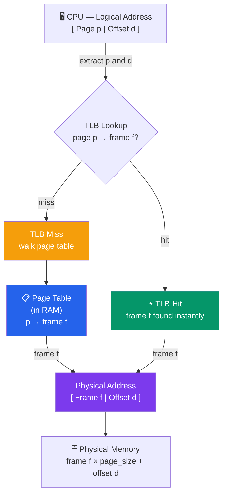

# Paging and Segmentation

## What You'll Learn

In this tutorial, you'll explore the two fundamental memory management schemes used by modern operating systems. You'll understand:

- Problems with contiguous memory allocation
- Paging: dividing memory into fixed-size blocks
- Page tables and page table entries
- Translation Lookaside Buffer (TLB) for fast translation
- Multi-level paging schemes
- Segmentation: logical division of memory
- Comparison between paging and segmentation
- Internal vs external fragmentation
- How x86 architecture combines both techniques
- Address translation examples with detailed calculations

## Introduction

Earlier memory management schemes like base and limit registers require processes to occupy contiguous physical memory. This leads to **external fragmentation** - unusable gaps between allocated regions. **Paging** and **segmentation** solve this problem using different approaches.

## Problems with Contiguous Allocation

### External Fragmentation

```
Initial State:
┌────────────┐ 0K
│  OS        │
├────────────┤ 100K
│  Process A │ (50K)
├────────────┤ 150K
│  Process B │ (100K)
├────────────┤ 250K
│  Process C │ (30K)
└────────────┘ 280K

After B terminates:
┌────────────┐ 0K
│  OS        │
├────────────┤ 100K
│  Process A │ (50K)
├────────────┤ 150K
│  FREE      │ (100K) ← Hole
├────────────┤ 250K
│  Process C │ (30K)
└────────────┘ 280K

Cannot fit 120K process even though 100K free!
Total free: 100K + free at end
But no contiguous 120K block available
```

**External Fragmentation**: Free memory exists but is scattered in small, unusable chunks.

### Compaction

```
Before Compaction:
┌────────────┐
│  OS        │
├────────────┤
│  Process A │ 50K
├────────────┤
│  FREE      │ 30K
├────────────┤
│  Process C │ 40K
├────────────┤
│  FREE      │ 20K
├────────────┤
│  Process D │ 60K
└────────────┘

After Compaction:
┌────────────┐
│  OS        │
├────────────┤
│  Process A │ 50K
├────────────┤
│  Process C │ 40K
├────────────┤
│  Process D │ 60K
├────────────┤
│  FREE      │ 50K ← All free space together
└────────────┘
```

**Problems with compaction**:
- Very expensive (copying memory)
- Must update all address references
- Requires execution-time address binding

## Paging

**Paging** eliminates external fragmentation by dividing memory into fixed-size blocks.

### Key Concepts

**Page**: Fixed-size block in logical address space
**Frame**: Fixed-size block in physical memory
**Page Size**: Typical values: 4 KB, 8 KB, 16 KB, 2 MB, 1 GB

```
Logical Memory (Pages):         Physical Memory (Frames):
┌──────────┐                    ┌──────────┐
│  Page 0  │  ──────┐           │  Frame 0 │
├──────────┤        │     ┌────→├──────────┤
│  Page 1  │  ────┐ │     │     │  Frame 1 │
├──────────┤      │ └─────┼────→├──────────┤
│  Page 2  │  ──┐ └───────┼────→│  Frame 2 │
├──────────┤    └─────────┼────→├──────────┤
│  Page 3  │              │     │  Frame 3 │
└──────────┘              └────→└──────────┘

Pages map to any available frame
No need for contiguous allocation!
```

### Address Structure in Paging

Logical address divided into two parts:

```
┌─────────────────────┬──────────────────┐
│   Page Number (p)   │  Page Offset (d) │
└─────────────────────┴──────────────────┘
     m bits                  n bits

Page Number: Identifies which page
Page Offset: Position within the page

Total logical address space: 2^(m+n) bytes
Page size: 2^n bytes
Number of pages: 2^m
```

**Example**: 32-bit address, 4 KB pages

```
┌──────────────────────┬─────────────┐
│   20 bits (p)        │  12 bits (d)│
└──────────────────────┴─────────────┘

Page size = 2^12 = 4096 bytes = 4 KB
Number of pages = 2^20 = 1,048,576 pages
Address space = 4 GB
```

### Page Table

**Page Table**: Maps page numbers to frame numbers (one per process)

```
Page Table Structure:

Page Number    Frame Number
─────────────────────────────
     0     →        5
     1     →        2
     2     →        7
     3     →        1
     4     →        9
     ...
```

### Address Translation with Paging


```

### Address Translation Example

**System Configuration**:
- Logical address space: 64 bytes
- Physical memory: 128 bytes
- Page size: 16 bytes

**Derived values**:
- Number of pages: 64/16 = 4 (pages 0-3)
- Number of frames: 128/16 = 8 (frames 0-7)
- Offset bits: log₂(16) = 4 bits
- Page number bits: log₂(4) = 2 bits

**Page Table**:
```
Page    Frame
────────────
 0        1
 1        3
 2        7
 3        2
```

**Translation Example 1**:
```
Logical Address: 13 (decimal) = 0000 1101 (binary)

Split:
  Page number (2 bits):  00 = 0
  Offset (4 bits):       1101 = 13

Lookup: Page 0 → Frame 1

Physical Address:
  Frame number: 1 (binary: 0001)
  Offset: 13 (binary: 1101)
  Combined: 0001 1101 = 29 (decimal)
```

**Translation Example 2**:
```
Logical Address: 37 (decimal) = 0010 0101 (binary)

Split:
  Page number: 10 (binary) = 2
  Offset: 0101 (binary) = 5

Lookup: Page 2 → Frame 7

Physical Address:
  Frame: 0111 (7)
  Offset: 0101 (5)
  Combined: 0111 0101 = 117 (decimal)
```

## Page Table Structure

### Page Table Entry (PTE)

```
┌─────┬─────┬─────┬─────┬─────┬──────────────┐
│  V  │  R  │  W  │  X  │  D  │ Frame Number │
└─────┴─────┴─────┴─────┴─────┴──────────────┘
  1bit  1bit  1bit  1bit  1bit    remaining bits

V (Valid): Page is in memory
R (Read): Read permission
W (Write): Write permission
X (Execute): Execute permission
D (Dirty): Page has been modified
```

**Additional bits**:
- **Reference/Access bit**: Page has been accessed
- **Caching disabled**: For memory-mapped I/O
- **Present bit**: Same as valid bit

### Page Table Size Problem

**Example**: 32-bit address space, 4 KB pages

```
Page table entries: 2^20 = 1,048,576 entries
Entry size: 4 bytes
Page table size: 4 MB per process!

With 100 processes: 400 MB just for page tables!
```

**Solution**: Multi-level paging

## Translation Lookaside Buffer (TLB)

**Problem**: Every memory access requires two memory accesses:
1. Access page table
2. Access actual data

**Solution**: TLB - a cache for page table entries

```
┌──────────────────────────────────────────┐
│              CPU                         │
│  Generates Logical Address               │
└────────────────┬─────────────────────────┘
                 │
                 ▼
        ┌────────────────┐
        │   Check TLB    │
        └────┬───────┬───┘
             │       │
         Hit │       │ Miss
             │       │
             ▼       ▼
    ┌────────────┐ ┌──────────────┐
    │   Frame    │ │  Page Table  │
    │   Number   │ │   (Memory)   │
    └──────┬─────┘ └──────┬───────┘
           │              │
           │              ├→ Update TLB
           │              │
           └──────┬───────┘
                  │
                  ▼
          ┌──────────────┐
          │   Physical   │
          │   Address    │
          └──────┬───────┘
                 │
                 ▼
          ┌──────────────┐
          │    Memory    │
          └──────────────┘
```

### TLB Structure

```
TLB (Translation Lookaside Buffer):

Page Number │ Frame Number │ Valid │ Dirty │ Ref
────────────┼──────────────┼───────┼───────┼────
    42      │      17      │   1   │   0   │  1
   108      │      93      │   1   │   1   │  1
    15      │       4      │   1   │   0   │  0
   ...
```

**TLB Characteristics**:
- Small (64-256 entries)
- Fully associative or set-associative
- Very fast (< 1 ns access)
- High hit rate (98-99%)

### Effective Access Time with TLB

```
TLB hit time: 1 ns
Memory access time: 100 ns
TLB hit ratio: 98%

Case 1: TLB Hit (98% of time)
  Time = 1 ns (TLB) + 100 ns (memory) = 101 ns

Case 2: TLB Miss (2% of time)
  Time = 1 ns (TLB) + 100 ns (page table) + 100 ns (memory) = 201 ns

Effective Access Time:
  EAT = 0.98 × 101 + 0.02 × 201
      = 98.98 + 4.02
      = 103 ns

Without TLB: 200 ns (always two memory accesses)
Speedup: 200/103 ≈ 1.94x
```

## Multi-Level Paging

Reduces memory needed for page tables by breaking them into multiple levels.

### Two-Level Paging

```
Logical Address Structure (32-bit, 4KB pages):
┌────────────┬────────────┬──────────────┐
│   P1       │     P2     │   Offset     │
│  10 bits   │  10 bits   │   12 bits    │
└────────────┴────────────┴──────────────┘

P1: Index into outer page table
P2: Index into inner page table
Offset: Position within page
```

**Two-Level Translation**:

```
                Logical Address
                       │
        ┌──────────────┼──────────────┐
        │              │              │
        P1             P2           Offset
        │              │              │
        ▼              │              │
┌─────────────┐        │              │
│  Outer Page │        │              │
│   Table     │        │              │
│             │        │              │
│  P1 → Addr │        │              │
└──────┬──────┘        │              │
       │               │              │
       ▼               ▼              │
    ┌─────────────────────┐           │
    │   Inner Page Table  │           │
    │                     │           │
    │   P2 → Frame        │           │
    └──────┬──────────────┘           │
           │                          │
           ▼                          ▼
    ┌──────────────────────────────────┐
    │      Physical Address            │
    └──────────────────────────────────┘
```

**Advantages**:
- Inner page tables created only when needed
- Reduces memory for sparse address spaces

**Example Memory Savings**:
```
Single-level: 4 MB page table (always allocated)
Two-level: 4 KB outer table + only needed inner tables
  - If only 10% of address space used
  - Memory: 4 KB + 0.10 × 4 MB ≈ 400 KB
  - Savings: 90%!
```

### Three-Level Paging (x86-64)

```
Logical Address (48 bits used of 64):
┌────────┬────────┬────────┬────────┬──────────┐
│   P1   │   P2   │   P3   │   P4   │  Offset  │
│  9 bits│  9 bits│  9 bits│  9 bits│  12 bits │
└────────┴────────┴────────┴────────┴──────────┘

Four levels:
  PML4 (Page Map Level 4)
    ↓
  PDPT (Page Directory Pointer Table)
    ↓
  PD (Page Directory)
    ↓
  PT (Page Table)
    ↓
  Physical Frame
```

## Segmentation

**Segmentation**: Divide memory into variable-sized logical units (segments).

### Segment Types

```
Logical Address Space:

┌─────────────────────┐ Segment 0
│   Code Segment      │ (Instructions)
│   (Text)            │
├─────────────────────┤ Segment 1
│   Data Segment      │ (Global variables)
│                     │
├─────────────────────┤ Segment 2
│   Stack Segment     │ (Function calls)
│                     │
├─────────────────────┤ Segment 3
│   Heap Segment      │ (Dynamic allocation)
│                     │
└─────────────────────┘
```

**Key difference from paging**: Segments are **logical units** with semantic meaning.

### Segment Table

```
Segment Table:

Segment │ Base Address │ Limit │ Permissions
────────┼──────────────┼───────┼─────────────
  0     │   0x10000    │ 8192  │ R-X (code)
  1     │   0x20000    │ 4096  │ RW- (data)
  2     │   0xF0000    │ 2048  │ RW- (stack)
  3     │   0x30000    │ 16384 │ RW- (heap)
```

### Address Structure in Segmentation

```
Logical Address:
┌────────────────┬──────────────────┐
│ Segment Number │     Offset       │
└────────────────┴──────────────────┘
```

### Segmentation Address Translation

```
Logical Address
       │
       ▼
┌──────────────┬───────────┐
│ Segment (s)  │ Offset (d)│
└──────┬───────┴─────┬─────┘
       │             │
       ▼             │
┌────────────────┐   │
│ Segment Table  │   │
│                │   │
│ s → Base, Limit│   │
└────┬───────────┘   │
     │               │
     │  Check: d < Limit?
     │  Yes: Continue
     │  No:  Trap (Segmentation Fault)
     │               │
     ▼               ▼
  Base + Offset = Physical Address
```

**Example**:
```
Logical Address: Segment 1, Offset 500

Segment Table Lookup:
  Segment 1: Base = 0x20000, Limit = 4096

Check: 500 < 4096 ✓

Physical Address = 0x20000 + 500 = 0x20500
```

## Paging vs Segmentation

| Aspect | Paging | Segmentation |
|--------|--------|--------------|
| **Division basis** | Physical (fixed size) | Logical (variable size) |
| **Size** | Fixed (4 KB typical) | Variable (segment size) |
| **User visible** | No (transparent) | Yes (programmer aware) |
| **Fragmentation** | Internal only | External possible |
| **Address space** | Linear | Multiple address spaces |
| **Protection** | Page-level | Segment-level (easier) |
| **Sharing** | Page-level | Segment-level (natural) |
| **Table size** | Can be large | Usually smaller |

### Internal vs External Fragmentation

**Internal Fragmentation** (Paging):
```
Page size: 4096 bytes
Process needs: 13,000 bytes

Pages allocated: ⌈13000/4096⌉ = 4 pages = 16,384 bytes
Wasted: 16,384 - 13,000 = 3,384 bytes (21%)

┌──────────────┐
│ Page 0 (4KB) │ Fully used
├──────────────┤
│ Page 1 (4KB) │ Fully used
├──────────────┤
│ Page 2 (4KB) │ Fully used
├──────────────┤
│ Page 3       │ Only 904 bytes used
│ [████░░░░]   │ 3,192 bytes wasted (internal frag)
└──────────────┘
```

**External Fragmentation** (Segmentation):
```
Memory with variable-sized segments:

┌────────────┐ 0K
│ Segment A  │ 10K
├────────────┤
│ FREE       │ 5K  ← Too small for 8K segment
├────────────┤
│ Segment B  │ 20K
├────────────┤
│ FREE       │ 3K  ← Too small
├────────────┤
│ Segment C  │ 15K
└────────────┘

Total free: 8K, but cannot allocate 8K segment!
```

## Segmentation with Paging

**Modern approach**: Combine both techniques

- **Segmentation**: Logical organization
- **Paging**: Physical allocation

```
Logical Address
       │
       ▼
┌─────────────┬───────────┐
│ Segment (s) │ Offset (d)│
└──────┬──────┴─────┬─────┘
       │            │
       ▼            │
  Segment Table     │
  (points to page   │
   table for segment)
       │            │
       ▼            ▼
    Page Table  ┌───────────┐
                │ Page │ Off│
                └───┬──┴──┬─┘
                    │     │
                    ▼     ▼
              Physical Address
```

### x86 Architecture Example

Intel x86 historically used segmentation with paging:

```
Logical Address (48 bits in 64-bit mode):
    ↓
Segment Selector + Offset
    ↓
Linear Address (after segmentation)
    ↓
Page Table Translation
    ↓
Physical Address
```

**Modern x86-64**: Segmentation mostly legacy, primarily uses paging.

## Page Table Walk Example

**System**: 32-bit, 4KB pages, two-level paging

```
Configuration:
  - Outer table: 1024 entries (10 bits)
  - Inner table: 1024 entries (10 bits)
  - Offset: 4096 bytes (12 bits)

Logical Address: 0x00403ABC
Binary: 0000 0000 01│00 0000 0011│1010 1011 1100
           P1 (1)        P2 (3)       Offset (2748)

Step 1: Outer page table
  - Base of outer table: 0x20000
  - Entry size: 4 bytes
  - Index: P1 = 1
  - Address: 0x20000 + (1 × 4) = 0x20004
  - Read entry: 0x30000 (address of inner table)

Step 2: Inner page table
  - Base: 0x30000
  - Index: P2 = 3
  - Address: 0x30000 + (3 × 4) = 0x3000C
  - Read entry: 0x50000 (frame number 5, shifted)
  - Frame: 5

Step 3: Physical address
  - Frame 5 starts at: 5 × 4096 = 0x5000
  - Add offset: 0x5000 + 0xABC = 0x5ABC

Final: Logical 0x00403ABC → Physical 0x5ABC
```

## Practical Examples

### Viewing Page Size on Linux

```bash
# Check page size
getconf PAGE_SIZE

# Typical output: 4096 (4 KB)

# Check huge page sizes
cat /proc/meminfo | grep -i hugepage

# Example output:
# HugePages_Total:       0
# HugePages_Free:        0
# Hugepagesize:       2048 kB
```

### C Program to Access Page Table Info

```c
#include <stdio.h>
#include <unistd.h>
#include <sys/mman.h>

int main() {
    long page_size = sysconf(_SC_PAGESIZE);
    long num_pages = sysconf(_SC_PHYS_PAGES);
    long avail_pages = sysconf(_SC_AVPHYS_PAGES);
    
    printf("System Page Information:\n");
    printf("========================\n");
    printf("Page size:           %ld bytes (%ld KB)\n", 
           page_size, page_size / 1024);
    printf("Total pages:         %ld\n", num_pages);
    printf("Available pages:     %ld\n", avail_pages);
    printf("Total memory:        %ld MB\n", 
           (num_pages * page_size) / (1024 * 1024));
    printf("Available memory:    %ld MB\n", 
           (avail_pages * page_size) / (1024 * 1024));
    
    // Allocate memory
    size_t size = 10 * page_size;  // 10 pages
    void *addr = mmap(NULL, size, PROT_READ | PROT_WRITE,
                      MAP_PRIVATE | MAP_ANONYMOUS, -1, 0);
    
    if (addr == MAP_FAILED) {
        perror("mmap");
        return 1;
    }
    
    printf("\nAllocated %ld pages at address: %p\n", 
           size / page_size, addr);
    
    munmap(addr, size);
    return 0;
}
```

## Key Takeaways

1. **Paging** eliminates external fragmentation by using fixed-size blocks
2. **Page tables** map logical pages to physical frames
3. **TLB** caches page table entries for fast translation
4. **Multi-level paging** reduces memory overhead for page tables
5. **Segmentation** provides logical organization but can cause external fragmentation
6. **Internal fragmentation** occurs with paging (wasted space within pages)
7. **External fragmentation** occurs with segmentation (scattered free space)
8. Modern systems often combine **segmentation with paging**

## Exercises

### Beginner

1. Given a logical address space of 256 bytes and page size of 32 bytes, how many pages are there? How many bits for page number and offset?

2. Calculate internal fragmentation for a process needing 7,300 bytes with 4 KB pages.

3. Why does paging eliminate external fragmentation?

### Intermediate

4. A system has:
   - 32-bit logical addresses
   - 4 KB pages
   - 4-byte page table entries
   
   Calculate the size of the page table for a single process.

5. Given TLB hit rate of 95%, TLB access time 1 ns, memory access time 100 ns, calculate the effective access time.

6. Design a two-level page table for a 32-bit system with 8 KB pages. How many bits for each level?

### Advanced

7. Implement a paging simulator in C that:
   - Maintains a page table
   - Translates logical to physical addresses
   - Simulates TLB hits and misses
   - Reports statistics

8. Compare memory waste due to internal fragmentation for different page sizes (1 KB, 4 KB, 16 KB) given processes of various sizes.

9. Explain why modern 64-bit systems don't use all 64 bits for addressing. What would be the size of a single-level page table if they did?

## Navigation

- **Previous**: [← Address Spaces](./02_address_spaces.md)
- **Next**: [Virtual Memory →](./04_virtual_memory.md)
- **Up**: [Memory Management](./README.md)

---

*Paging and segmentation are the foundation of modern memory management - understanding them is crucial for grasping virtual memory!*
