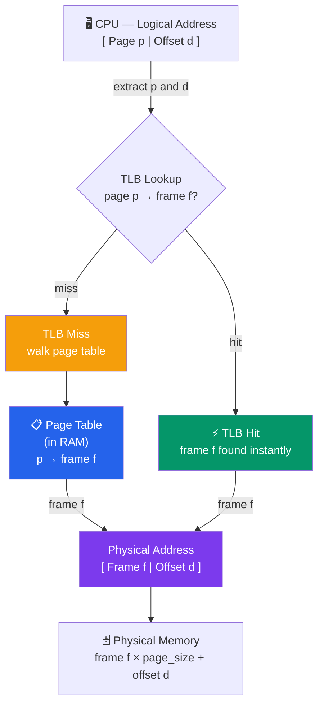

# Paging and Segmentation

## Is Tutorial Mein Kya Seekhoge

Chalo aaj OS ke sabse important topics mein se ek explore karte hain — memory management ke do fundamental schemes jo har modern OS use karta hai. Isme cover karenge:

- Contiguous memory allocation mein kya dikkat hai
- Paging: memory ko fixed-size blocks mein todna
- Page tables aur page table entries
- Translation Lookaside Buffer (TLB) — fast translation ka jugaad
- Multi-level paging schemes
- Segmentation: logical division of memory
- Paging vs segmentation ka comparison
- Internal vs external fragmentation
- x86 architecture dono techniques ko kaise combine karta hai
- Address translation examples with detailed calculations

## Introduction

Socho tum ek naya restaurant khol rahe ho aur tumhare paas ek hi lambi parking lane hai jisme gaadiyan ek ke baad ek continuously park honi chahiye — beech mein koi gap nahi. Ab agar beech ki koi gaadi nikal jaye, toh wahan ek gap ban jata hai jo chhota hai aur usme koi bhi badi gaadi fit nahi hoti, chahe total free space kitna bhi ho.

Yahi problem purane memory management schemes (base aur limit registers) ke saath thi — unme process ko **contiguous physical memory** chahiye hoti thi, matlab ek hi continuous block. Isse **external fragmentation** hoti hai — allocated regions ke beech mein aise gaps ban jaate hain jo kisi kaam ke nahi rehte.

**Paging** aur **Segmentation** — dono is problem ko solve karte hain, lekin do alag-alag approaches se. Paging kehta hai "memory ko fixed chhote-chhote tukdo mein baant do", aur segmentation kehta hai "memory ko logical, meaningful hisso mein baato — jaise code, data, stack". Dono ka apna trade-off hai, aur aage chalke dekhoge ki modern systems dono ko combine bhi karte hain.

## Contiguous Allocation Mein Dikkat

### External Fragmentation

Kya hota hai? Jab processes memory mein continuous blocks mein allocate hote hain, aur beech mein se koi process terminate ho jaata hai, toh uski jagah ek "hole" ban jaata hai. Ye hole tab tak bekaar hai jab tak koi naya process bilkul usi size (ya chhote) ka na aaye.

```
Initial State:
┌────────────┐ 0K
│  OS        │
├────────────┤ 100K
│  Process A │ (50K)
├────────────┤ 150K
│  Process B │ (100K)
├────────────┤ 250K
│  Process C │ (30K)
└────────────┘ 280K

After B terminates:
┌────────────┐ 0K
│  OS        │
├────────────┤ 100K
│  Process A │ (50K)
├────────────┤ 150K
│  FREE      │ (100K) ← Hole
├────────────┤ 250K
│  Process C │ (30K)
└────────────┘ 280K

Cannot fit 120K process even though 100K free!
Total free: 100K + free at end
But no contiguous 120K block available
```

Socho Swiggy delivery ke bike parking ki tarah — agar 5 bikes continuous line mein khadi hain aur beech wali nikal jaaye, toh wahan jo gap bana hai, uspe agar koi car parking chahe toh nahi ho payegi, chahe gap "kaafi bada" kyun na lage. Yehi hai:

> [!info]
> **External Fragmentation**: Free memory exist karti hai, lekin scattered chhote-chhote unusable chunks mein bati hoti hai.

### Compaction

Ek fix ye hai ki saare processes ko "khiska do" ek taraf, taaki saara free space ek jagah ikattha ho jaaye — bilkul jaise IRCTC waiting list mein confirm hone par saare passengers ko ek row mein shift kar diya jaaye.

```
Before Compaction:
┌────────────┐
│  OS        │
├────────────┤
│  Process A │ 50K
├────────────┤
│  FREE      │ 30K
├────────────┤
│  Process C │ 40K
├────────────┤
│  FREE      │ 20K
├────────────┤
│  Process D │ 60K
└────────────┘

After Compaction:
┌────────────┐
│  OS        │
├────────────┤
│  Process A │ 50K
├────────────┤
│  Process C │ 40K
├────────────┤
│  Process D │ 60K
├────────────┤
│  FREE      │ 50K ← All free space together
└────────────┘
```

Lekin ye compaction free mein nahi milta:

**Compaction ke problems**:
- Bahut expensive hai (memory ko copy karna padta hai — jaise poore ghar ka saaman shift karna)
- Har process ke saare address references update karne padte hain
- Isko karne ke liye **execution-time address binding** chahiye (matlab addresses runtime pe hi fix ho sakte hain, load-time pe nahi)

Isi wajah se OS designers ne socha — "compaction karne ke bajaye, aisa design kyun na banaye jisme fragmentation ho hi na?" Aur wahi se paging ka concept aata hai.

## Paging

**Paging** external fragmentation ko khatam kar deta hai — kaise? Memory ko **fixed-size blocks** mein divide karke. Idea simple hai: agar sab blocks same size ke hain, toh koi bhi free block kisi bhi process ke kisi bhi part ko fit ho sakta hai. Na koi "sahi size dhundo" wala jhanjhat, na koi awkward gap.

Zomato ke tiffin box system se socho — agar restaurant sirf ek hi standard size ka tiffin box use kare (chhota ho ya bada order, sab isi box mein fit karo, zaroorat pade toh multiple boxes), toh kabhi bhi "ye box zyada bada hai" ya "chhota hai" wali dikkat nahi aayegi. Bas box thoda under-filled reh sakta hai — waste hoga, lekin allocation problem nahi hoga.

### Key Concepts

**Page**: Logical address space mein ek fixed-size block (jo process "sochta" hai use kar raha hai)
**Frame**: Physical memory mein ek fixed-size block (jahan actual data store hota hai)
**Page Size**: Common values: 4 KB, 8 KB, 16 KB, 2 MB, 1 GB

Yaad rakho — **page** aur **frame** same size ke hote hain, bas ek logical world mein hai aur doosra physical world mein.

```
Logical Memory (Pages):         Physical Memory (Frames):
┌──────────┐                    ┌──────────┐
│  Page 0  │  ──────┐           │  Frame 0 │
├──────────┤        │     ┌────→├──────────┤
│  Page 1  │  ────┐ │     │     │  Frame 1 │
├──────────┤      │ └─────┼────→├──────────┤
│  Page 2  │  ──┐ └───────┼────→│  Frame 2 │
├──────────┤    └─────────┼────→├──────────┤
│  Page 3  │              │     │  Frame 3 │
└──────────┘              └────→└──────────┘

Pages map to any available frame
No need for contiguous allocation!
```

Dekho yahan Page 0, Page 1, Page 2 kisi bhi order mein kisi bhi frame mein ja sakte hain — bilkul random. Ye jo flexibility hai, yehi external fragmentation ko khatam karti hai. Process ko lagta hai uski memory continuous hai (logical view), lekin physically wo bikhri hui ho sakti hai — frame 5, frame 2, frame 9, kahin bhi.

### Paging Mein Address Structure

Logical address do parts mein divide hota hai:

```
┌─────────────────────┬──────────────────┐
│   Page Number (p)   │  Page Offset (d) │
└─────────────────────┴──────────────────┘
     m bits                  n bits

Page Number: Identifies which page
Page Offset: Position within the page

Total logical address space: 2^(m+n) bytes
Page size: 2^n bytes
Number of pages: 2^m
```

Simple tareeke se socho — jaise koi address "Building 5, Room 12" hota hai. Building number (page number) batata hai kaunsi building, aur room number (offset) batata hai us building ke andar exact kaunsa room. CPU generate karta hai "logical address", jisme se **page number** nikalte hain (kaunsa page) aur **offset** nikalte hain (us page ke andar exact position).

**Example**: 32-bit address, 4 KB pages

```
┌──────────────────────┬─────────────┐
│   20 bits (p)        │  12 bits (d)│
└──────────────────────┴─────────────┘

Page size = 2^12 = 4096 bytes = 4 KB
Number of pages = 2^20 = 1,048,576 pages
Address space = 4 GB
```

Yahan offset ke liye 12 bits chahiye kyunki 2^12 = 4096 = 4KB (page ka size). Baaki bache hue bits (20) page number ke liye use hote hain.

### Page Table

Ab sawaal ye hai — CPU ko kaise pata chalega ki "Page 3" actually kaunse physical frame mein hai? Iska jawab hai **Page Table**.

**Page Table**: Page numbers ko frame numbers se map karta hai (har process ka apna alag page table hota hai)

Socho ye ek "phone directory" ki tarah hai — tumhe naam pata hai (page number), directory tumhe address deti hai (frame number).

```
Page Table Structure:

Page Number    Frame Number
─────────────────────────────
     0     →        5
     1     →        2
     2     →        7
     3     →        1
     4     →        9
     ...
```

Har process ka apna alag page table hota hai — kyunki har process apne khud ke logical address space mein sochta hai (jaise sab processes "main page 0 se start hota hoon" sochte hain), lekin actual mein sabka data alag-alag physical frames mein hota hai.

### Paging Ke Saath Address Translation

Jab CPU koi memory access karta hai, ye poora process hota hai:



TLB kya hota hai iska detail thodi der mein aayega — abhi bas itna samajh lo ki ye ek "shortcut cache" hai jo page table lookup ko fast bana deta hai. Agar TLB mein answer mil jaaye (hit) toh seedha frame mil jaata hai, warna page table mein jaake dhundna padta hai (miss).

### Address Translation Example — Step By Step

Ab ek chhota sa system lekar poora calculation khud karke dikhate hain, taaki concept crystal clear ho jaaye.

**System Configuration**:
- Logical address space: 64 bytes
- Physical memory: 128 bytes
- Page size: 16 bytes

**Derived values**:
- Number of pages: 64/16 = 4 (pages 0-3)
- Number of frames: 128/16 = 8 (frames 0-7)
- Offset bits: log₂(16) = 4 bits
- Page number bits: log₂(4) = 2 bits

**Page Table**:
```
Page    Frame
────────────
 0        1
 1        3
 2        7
 3        2
```

**Translation Example 1**:
```
Logical Address: 13 (decimal) = 0000 1101 (binary)

Split:
  Page number (2 bits):  00 = 0
  Offset (4 bits):       1101 = 13

Lookup: Page 0 → Frame 1

Physical Address:
  Frame number: 1 (binary: 0001)
  Offset: 13 (binary: 1101)
  Combined: 0001 1101 = 29 (decimal)
```

Yahan kya hua? CPU ne kaha "mujhe logical address 13 chahiye". Isko binary mein likha (0000 1101), pehle 2 bits (00) page number bata rahe hain — page 0. Baaki 4 bits (1101) offset hai — 13. Page table dekha, page 0 → frame 1. Ab physical address bana — frame number (0001) + offset (1101) combine karke = 29.

**Translation Example 2**:
```
Logical Address: 37 (decimal) = 0010 0101 (binary)

Split:
  Page number: 10 (binary) = 2
  Offset: 0101 (binary) = 5

Lookup: Page 2 → Frame 7

Physical Address:
  Frame: 0111 (7)
  Offset: 0101 (5)
  Combined: 0111 0101 = 117 (decimal)
```

Same logic — page 2 ka lookup kiya, frame 7 mila, offset same rehta hai (5), aur final physical address 117 ban gaya.

> [!tip]
> Offset kabhi change nahi hota translation mein — sirf page number, frame number mein badalta hai. Ye samajhna zaroori hai: offset ye batata hai ki page/frame ke **andar** kitni door jaana hai, aur ye distance same rehta hai chahe wo page kisi bhi frame mein ho.

## Page Table Structure

### Page Table Entry (PTE)

Har page table entry sirf frame number nahi rakhta — usme kuch extra "metadata" bits bhi hote hain jo OS ko decide karne mein madad karte hain ki page ke saath kya karna allowed hai.

```
┌─────┬─────┬─────┬─────┬─────┬──────────────┐
│  V  │  R  │  W  │  X  │  D  │ Frame Number │
└─────┴─────┴─────┴─────┴─────┴──────────────┘
  1bit  1bit  1bit  1bit  1bit    remaining bits

V (Valid): Page is in memory
R (Read): Read permission
W (Write): Write permission
X (Execute): Execute permission
D (Dirty): Page has been modified
```

Socho ye ek "CRED card ka permission set" jaisa hai — kya tum is card se sirf dekh sakte ho (Read), transaction kar sakte ho (Write), ya kisi merchant se scan karke pay kar sakte ho (Execute). Agar Valid bit off hai, matlab ye page abhi physical memory mein hai hi nahi (disk pe hai) — usko access karne ki koshish karoge toh **page fault** trigger hoga.

**Additional bits**:
- **Reference/Access bit**: Page kabhi access hui thi ya nahi (page replacement algorithms ke liye useful — LRU jaise)
- **Caching disabled**: Memory-mapped I/O ke liye (jahan CPU cache nahi karna chahiye kyunki hardware device ki value change hoti rehti hai)
- **Present bit**: Basically Valid bit jaisa hi hai, naam alag ho sakta hai architecture ke hisaab se

### Page Table Ka Size Problem

Ab yahan ek real dikkat samne aati hai. Agar address space bada hai, toh page table bhi bada ho jaata hai.

**Example**: 32-bit address space, 4 KB pages

```
Page table entries: 2^20 = 1,048,576 entries
Entry size: 4 bytes
Page table size: 4 MB per process!

With 100 processes: 400 MB just for page tables!
```

Socho — sirf **bookkeeping** ke liye (actual data nahi, sirf "kahan hai" record karne ke liye) 400 MB memory chali gayi agar 100 processes chal rahe hain! Ye toh IRCTC ke waiting list register ki tarah hai jo khud hi itna bada ho jaaye ki asli ticket rakhne ki jagah na bache.

**Solution**: Multi-level paging — isko thodi der mein detail se dekhte hain.

## Translation Lookaside Buffer (TLB)

**Problem kya hai?** Normal paging mein, har memory access ke liye **do** memory accesses lagte hain:
1. Page table access karo (frame number pata karne ke liye)
2. Fir actual data access karo us frame se

Ye toh double kaam ho gaya — har cheez ke liye 2x time lag raha hai! Jaise Swiggy order karte waqt pehle restaurant ka address dhundo (ek trip), fir wahan jaake khaana lo (doosri trip) — agar tumhe har order ke liye ye poora process karna pade, bahut slow ho jaayega.

**Solution**: TLB — ek chhota, super-fast **cache** jo recently-used page table entries yaad rakhta hai.

```
┌──────────────────────────────────────────┐
│              CPU                         │
│  Generates Logical Address               │
└────────────────┬─────────────────────────┘
                 │
                 ▼
        ┌────────────────┐
        │   Check TLB    │
        └────┬───────┬───┘
             │       │
         Hit │       │ Miss
             │       │
             ▼       ▼
    ┌────────────┐ ┌──────────────┐
    │   Frame    │ │  Page Table  │
    │   Number   │ │   (Memory)   │
    └──────┬─────┘ └──────┬───────┘
           │              │
           │              ├→ Update TLB
           │              │
           └──────┬───────┘
                  │
                  ▼
          ┌──────────────┐
          │   Physical   │
          │   Address    │
          └──────┬───────┘
                 │
                 ▼
          ┌──────────────┐
          │    Memory    │
          └──────────────┘
```

Ye bilkul waise hai jaise tumhare phone mein recent contacts ki list hoti hai — agar wahi number baar-baar call karna hai, poori contact list scroll karne ke bajaye "recents" mein seedha mil jaata hai. TLB bhi wahi karta hai — recently accessed pages ka translation cache karke rakhta hai.

### TLB Structure

```
TLB (Translation Lookaside Buffer):

Page Number │ Frame Number │ Valid │ Dirty │ Ref
────────────┼──────────────┼───────┼───────┼────
    42      │      17      │   1   │   0   │  1
   108      │      93      │   1   │   1   │  1
    15      │       4      │   1   │   0   │  0
   ...
```

**TLB Characteristics**:
- Chhota hota hai (64-256 entries) — poora page table cache nahi kar sakte
- Fully associative ya set-associative hota hai (matlab hardware parallel mein saari entries check kar sakta hai — bahut fast)
- Bohot fast (< 1 ns access) — kyunki ye CPU ke andar hi hota hai, RAM se bhi paas
- High hit rate (98-99%) — kyunki programs generally "locality of reference" follow karte hain, matlab jo page abhi use kiya, thodi der mein wapas use hone ka chance zyada hai

### TLB Ke Saath Effective Access Time

Ab dekhte hain ki TLB actually kitna fayda deta hai — numbers ke saath.

```
TLB hit time: 1 ns
Memory access time: 100 ns
TLB hit ratio: 98%

Case 1: TLB Hit (98% of time)
  Time = 1 ns (TLB) + 100 ns (memory) = 101 ns

Case 2: TLB Miss (2% of time)
  Time = 1 ns (TLB) + 100 ns (page table) + 100 ns (memory) = 201 ns

Effective Access Time:
  EAT = 0.98 × 101 + 0.02 × 201
      = 98.98 + 4.02
      = 103 ns

Without TLB: 200 ns (always two memory accesses)
Speedup: 200/103 ≈ 1.94x
```

Matlab TLB hone se hume roughly **2x speedup** mil raha hai! Ye chhota sa cache dikhne mein simple lagta hai lekin real-world CPUs ki performance mein zabardast impact daalta hai. Isiliye modern CPUs mein TLB bahut carefully design kiya jaata hai (kabhi-kabhi to alag TLB hota hai instructions ke liye aur alag data ke liye).

> [!warning]
> Jab process **context switch** hota hai (ek process se doosre process mein switch), TLB entries purani ho jaati hain kyunki naye process ka page table alag hai. Isliye TLB ko flush (clear) karna padta hai, ya phir **ASID (Address Space Identifier)** jaisa mechanism use karke entries ko tag kiya jaata hai taaki flush na karna pade. Ye ek common gotcha hai jo context switching ko expensive bana deta hai.

## Multi-Level Paging

Yaad hai upar humne dekha tha ki single-level page table 4 MB tak ho sakta hai per process? Multi-level paging isi problem ka solution hai — page table ko khud bhi multiple levels mein todke, sirf jitni zaroorat ho utna hi allocate karo.

### Two-Level Paging

Idea ye hai: page table ko bhi "pages" mein todo, aur ek "outer" table rakho jo batata hai kaunsa inner table kahan hai. Agar koi part of the address space use hi nahi ho raha, uska inner table banao hi mat!

```
Logical Address Structure (32-bit, 4KB pages):
┌────────────┬────────────┬──────────────┐
│   P1       │     P2     │   Offset     │
│  10 bits   │  10 bits   │   12 bits    │
└────────────┴────────────┴──────────────┘

P1: Index into outer page table
P2: Index into inner page table
Offset: Position within page
```

**Two-Level Translation**:

```
                Logical Address
                       │
        ┌──────────────┼──────────────┐
        │              │              │
        P1             P2           Offset
        │              │              │
        ▼              │              │
┌─────────────┐        │              │
│  Outer Page │        │              │
│   Table     │        │              │
│             │        │              │
│  P1 → Addr │        │              │
└──────┬──────┘        │              │
       │               │              │
       ▼               ▼              │
    ┌─────────────────────┐           │
    │   Inner Page Table  │           │
    │                     │           │
    │   P2 → Frame        │           │
    └──────┬──────────────┘           │
           │                          │
           ▼                          ▼
    ┌──────────────────────────────────┐
    │      Physical Address            │
    └──────────────────────────────────┘
```

Socho ye Flipkart ke warehouse index system jaisa hai — pehle "kaunsi building" (outer table/P1) pata karo, fir us building ke andar "kaunsa shelf" (inner table/P2) pata karo, tab jaake actual product (frame) milta hai. Agar koi building use hi nahi ho rahi, uska shelf-index banane ki zaroorat nahi.

**Advantages**:
- Inner page tables sirf tab banti hain jab zaroorat ho (lazy allocation)
- Sparse address spaces ke liye memory bachta hai — matlab agar process apna poora 4GB address space use nahi kar raha (jo ki normally hota hai — beech mein bade gaps hote hain unused address space ke), toh un unused parts ke liye inner table banane ki zaroorat hi nahi

**Example Memory Savings**:
```
Single-level: 4 MB page table (always allocated)
Two-level: 4 KB outer table + only needed inner tables
  - If only 10% of address space used
  - Memory: 4 KB + 0.10 × 4 MB ≈ 400 KB
  - Savings: 90%!
```

Dekho — sirf structure change karke, 90% memory bacha li! Ye engineering ka kamaal hai — same information, but smarter organization.

### Three-Level Paging (x86-64)

64-bit systems mein toh address space itna bada hai (2^64) ki agar sab bits use karo, page table astronomically bada ho jaayega. Isliye actual mein sirf 48 bits use hote hain (jo bhi kaafi hai — 256 TB address space!), aur wo bhi **four levels** mein todke rakha jaata hai.

```
Logical Address (48 bits used of 64):
┌────────┬────────┬────────┬────────┬──────────┐
│   P1   │   P2   │   P3   │   P4   │  Offset  │
│  9 bits│  9 bits│  9 bits│  9 bits│  12 bits │
└────────┴────────┴────────┴────────┴──────────┘

Four levels:
  PML4 (Page Map Level 4)
    ↓
  PDPT (Page Directory Pointer Table)
    ↓
  PD (Page Directory)
    ↓
  PT (Page Table)
    ↓
  Physical Frame
```

Har level ek "funnel" ki tarah kaam karta hai — jaise ek courier company ka hierarchy: national hub → regional hub → local branch → tumhara ghar. Har step pe sirf ek chhota index chahiye hota hai, aur sirf jo path actually use ho raha hai wahi tables exist karti hain.

> [!info]
> Ye 4-level lookup ka downside ye hai ki page table walk mein 4 extra memory accesses lag sakte hain (worst case, TLB miss ho jaye toh). Isiliye TLB hit rate high rakhna bahut zaroori hai — warna ye multi-level structure performance ko bura impact de sakta hai.

## Segmentation

Ab dusra approach dekhte hain — **Segmentation**. Paging jahan memory ko purely size ke basis pe (fixed blocks) todta hai, segmentation memory ko **meaning** ke basis pe todta hai.

**Segmentation**: Memory ko variable-sized logical units (segments) mein divide karna.

Socho jaise tumhare ghar mein alag-alag rooms hain — bedroom, kitchen, living room — har room ka apna specific purpose hai aur size bhi alag-alag hai (kitchen chhota, living room bada). Ye "logical division" hai — size fixed nahi, purpose ke hisaab se banta hai.

### Segment Types

```
Logical Address Space:

┌─────────────────────┐ Segment 0
│   Code Segment      │ (Instructions)
│   (Text)            │
├─────────────────────┤ Segment 1
│   Data Segment      │ (Global variables)
│                     │
├─────────────────────┤ Segment 2
│   Stack Segment     │ (Function calls)
│                     │
├─────────────────────┤ Segment 3
│   Heap Segment      │ (Dynamic allocation)
│                     │
└─────────────────────┘
```

Ye tumhe familiar lagega agar tumne kabhi C ya C++ program ka memory layout dekha hai — Code (jo instructions hain), Data (global variables), Stack (function calls ka trail), Heap (malloc/new se dynamically allocated memory). Har ek ka role clearly defined hai, aur har ek ka size bhi program ke hisaab se alag-alag hota hai.

**Paging se key difference**: Segments **logical units** hain jinka semantic meaning hai — matlab programmer/compiler ko pata hota hai "ye code hai", "ye stack hai". Paging mein page sirf ek "fixed size block" hai, usko koi meaning nahi pata.

### Segment Table

```
Segment Table:

Segment │ Base Address │ Limit │ Permissions
────────┼──────────────┼───────┼─────────────
  0     │   0x10000    │ 8192  │ R-X (code)
  1     │   0x20000    │ 4096  │ RW- (data)
  2     │   0xF0000    │ 2048  │ RW- (stack)
  3     │   0x30000    │ 16384 │ RW- (heap)
```

Yahan dekho — code segment permission hai **R-X** (Read + Execute, lekin Write nahi) kyunki instructions ko accidentally modify nahi hona chahiye. Ye ek natural security boundary de deta hai jo page-level permission se zyada intuitive hai.

### Segmentation Mein Address Structure

```
Logical Address:
┌────────────────┬──────────────────┐
│ Segment Number │     Offset       │
└────────────────┴──────────────────┘
```

### Segmentation Address Translation

```
Logical Address
       │
       ▼
┌──────────────┬───────────┐
│ Segment (s)  │ Offset (d)│
└──────┬───────┴─────┬─────┘
       │             │
       ▼             │
┌────────────────┐   │
│ Segment Table  │   │
│                │   │
│ s → Base, Limit│   │
└────┬───────────┘   │
     │               │
     │  Check: d < Limit?
     │  Yes: Continue
     │  No:  Trap (Segmentation Fault)
     │               │
     ▼               ▼
  Base + Offset = Physical Address
```

Yahan ek zaroori check hai — **`d < Limit`**. Ye check kya karta hai? Ye confirm karta hai ki offset segment ke actual size ke andar hi hai. Agar koi program apni segment boundary se bahar access karne ki koshish kare (jaise array ke bounds se bahar), OS ek **trap** raise karta hai jo tumhe "Segmentation Fault" ke naam se familiar hai — haan, wahi wala "Segfault" jo C programmers ki nightmare hota hai!

**Example**:
```
Logical Address: Segment 1, Offset 500

Segment Table Lookup:
  Segment 1: Base = 0x20000, Limit = 4096

Check: 500 < 4096 ✓

Physical Address = 0x20000 + 500 = 0x20500
```

Simple hai — segment ka base address le lo, offset add kar do, physical address mil gaya. Bas beech mein ek bounds-check hai jo safety provide karta hai.

## Paging vs Segmentation

Ab dono ko side-by-side compare karte hain:

| Aspect | Paging | Segmentation |
|--------|--------|--------------|
| **Division basis** | Physical (fixed size) | Logical (variable size) |
| **Size** | Fixed (4 KB typical) | Variable (segment size) |
| **User visible** | No (transparent) | Yes (programmer aware) |
| **Fragmentation** | Internal only | External possible |
| **Address space** | Linear | Multiple address spaces |
| **Protection** | Page-level | Segment-level (easier) |
| **Sharing** | Page-level | Segment-level (natural) |
| **Table size** | Can be large | Usually smaller |

Simple tareeke se yaad rakhne ka trick: **Paging = "size-based, transparent, machine ke liye convenient"**. **Segmentation = "meaning-based, programmer ke liye intuitive"**.

### Internal vs External Fragmentation

Ab wapas fragmentation pe aate hain — kyunki dono schemes fragmentation ka alag-alag type introduce karte hain.

**Internal Fragmentation** (Paging mein hoti hai):

Kya hota hai? Jab process ki actual requirement, allocated pages ke exact multiple mein fit nahi hoti — toh last page mein kuch space **waste** ho jaata hai jo kisi kaam ka nahi.

```
Page size: 4096 bytes
Process needs: 13,000 bytes

Pages allocated: ⌈13000/4096⌉ = 4 pages = 16,384 bytes
Wasted: 16,384 - 13,000 = 3,384 bytes (21%)

┌──────────────┐
│ Page 0 (4KB) │ Fully used
├──────────────┤
│ Page 1 (4KB) │ Fully used
├──────────────┤
│ Page 2 (4KB) │ Fully used
├──────────────┤
│ Page 3       │ Only 904 bytes used
│ [████░░░░]   │ 3,192 bytes wasted (internal frag)
└──────────────┘
```

Socho ye Zomato ke tiffin box jaisa hai — agar tumhara khana ek box mein poora nahi aata aur thoda sa doosre box mein jaata hai, toh doosra box zyadatar **khaali** rahega. Wo khaali jagah "internal fragmentation" hai — allocated block ke **andar** ka wasted space.

**External Fragmentation** (Segmentation mein hoti hai):

```
Memory with variable-sized segments:

┌────────────┐ 0K
│ Segment A  │ 10K
├────────────┤
│ FREE       │ 5K  ← Too small for 8K segment
├────────────┤
│ Segment B  │ 20K
├────────────┤
│ FREE       │ 3K  ← Too small
├────────────┤
│ Segment C  │ 15K
└────────────┘

Total free: 8K, but cannot allocate 8K segment!
```

Ye wahi problem hai jo humne shuru mein dekhi thi — free space total mein toh available hai, lekin scattered hai chhote-chhote pieces mein. Kyunki segments variable size ke hote hain, koi guarantee nahi ki jo hole bana hai wo naye segment ke liye kaafi hoga.

> [!tip]
> Yaad rakhne ka easy tarika: **"Internal" fragmentation ka matlab hai waste allocated block ke ANDAR hai** (paging), aur **"External" fragmentation ka matlab hai waste allocated blocks ke BAHAR, beech mein scattered hai** (segmentation).

## Segmentation With Paging

Ab yahan interesting part aata hai — kyun na dono ke best of both worlds le lein? Ye **modern approach** hai jo real systems use karte hain.

- **Segmentation**: Logical organization ke liye (code/data/stack/heap jaisi meaningful divisions)
- **Paging**: Physical allocation ke liye (fixed blocks, koi external fragmentation nahi)

```
Logical Address
       │
       ▼
┌─────────────┬───────────┐
│ Segment (s) │ Offset (d)│
└──────┬──────┴─────┬─────┘
       │            │
       ▼            │
  Segment Table     │
  (points to page   │
   table for segment)
       │            │
       ▼            ▼
    Page Table  ┌───────────┐
                │ Page │ Off│
                └───┬──┴──┬─┘
                    │     │
                    ▼     ▼
              Physical Address
```

Idea ye hai: pehle segment number se pata karo "ye kaunsa logical unit hai" (code, data, stack, etc), fir us segment ke andar ka offset khud paging system se guzarta hai (page number + page offset) taaki physical allocation flexible rahe, fragmentation-free rahe.

### x86 Architecture Ka Example

Intel x86 historically segmentation + paging dono use karta tha:

```
Logical Address (48 bits in 64-bit mode):
    ↓
Segment Selector + Offset
    ↓
Linear Address (after segmentation)
    ↓
Page Table Translation
    ↓
Physical Address
```

**Modern x86-64**: Segmentation ab mostly **legacy** ban chuki hai, primarily paging hi use hota hai. x86-64 mode mein zyadatar segment registers ka base 0 fix kar diya jaata hai (matlab segmentation effectively "off" ho jaati hai), aur saara translation kaam paging se hota hai. Segmentation aaj kal mostly kuch specific use cases mein bachi hai (jaise thread-local storage ke liye FS/GS registers).

## Page Table Walk Example — Full Walkthrough

Chalo ek complete example step-by-step solve karte hain, taaki tumhe pura confidence aa jaaye ki actual hardware kaise ye translation karta hai.

**System**: 32-bit, 4KB pages, two-level paging

```
Configuration:
  - Outer table: 1024 entries (10 bits)
  - Inner table: 1024 entries (10 bits)
  - Offset: 4096 bytes (12 bits)

Logical Address: 0x00403ABC
Binary: 0000 0000 01│00 0000 0011│1010 1011 1100
           P1 (1)        P2 (3)       Offset (2748)

Step 1: Outer page table
  - Base of outer table: 0x20000
  - Entry size: 4 bytes
  - Index: P1 = 1
  - Address: 0x20000 + (1 × 4) = 0x20004
  - Read entry: 0x30000 (address of inner table)

Step 2: Inner page table
  - Base: 0x30000
  - Index: P2 = 3
  - Address: 0x30000 + (3 × 4) = 0x3000C
  - Read entry: 0x50000 (frame number 5, shifted)
  - Frame: 5

Step 3: Physical address
  - Frame 5 starts at: 5 × 4096 = 0x5000
  - Add offset: 0x5000 + 0xABC = 0x5ABC

Final: Logical 0x00403ABC → Physical 0x5ABC
```

Dhyan se dekho — is poore walk mein **teen memory accesses** lage: ek outer table ke liye, ek inner table ke liye, ek actual data ke liye. Ye exactly wo cheez hai jo TLB avoid karta hai — agar ye translation TLB mein cached hoti, seedha ek hi step mein frame mil jaata!

## Practical Examples

### Linux Pe Page Size Dekhna

```bash
# Check page size
getconf PAGE_SIZE

# Typical output: 4096 (4 KB)

# Check huge page sizes
cat /proc/meminfo | grep -i hugepage

# Example output:
# HugePages_Total:       0
# HugePages_Free:        0
# Hugepagesize:       2048 kB
```

Waise, agar tum Node.js ya backend systems pe kaam karte ho, ye **hugepages** wala concept interesting hai — normal page size 4KB hoti hai, lekin agar tumhara process bahut zyada memory use karta hai (jaise ek in-memory database ya large cache), toh 4KB pages use karne mein TLB entries jaldi khatam ho jaati hain (kyunki TLB mein limited entries hoti hain). Isliye "huge pages" (2MB ya 1GB) use karke, ek TLB entry se hi bahut zyada memory cover ho jaati hai, aur TLB miss rate kam ho jaata hai.

### C Program — Page Table Info Access Karna

```c
#include <stdio.h>
#include <unistd.h>
#include <sys/mman.h>

int main() {
    long page_size = sysconf(_SC_PAGESIZE);
    long num_pages = sysconf(_SC_PHYS_PAGES);
    long avail_pages = sysconf(_SC_AVPHYS_PAGES);
    
    printf("System Page Information:\n");
    printf("========================\n");
    printf("Page size:           %ld bytes (%ld KB)\n", 
           page_size, page_size / 1024);
    printf("Total pages:         %ld\n", num_pages);
    printf("Available pages:     %ld\n", avail_pages);
    printf("Total memory:        %ld MB\n", 
           (num_pages * page_size) / (1024 * 1024));
    printf("Available memory:    %ld MB\n", 
           (avail_pages * page_size) / (1024 * 1024));
    
    // Allocate memory
    size_t size = 10 * page_size;  // 10 pages
    void *addr = mmap(NULL, size, PROT_READ | PROT_WRITE,
                      MAP_PRIVATE | MAP_ANONYMOUS, -1, 0);
    
    if (addr == MAP_FAILED) {
        perror("mmap");
        return 1;
    }
    
    printf("\nAllocated %ld pages at address: %p\n", 
           size / page_size, addr);
    
    munmap(addr, size);
    return 0;
}
```

Ye program `mmap()` use karke directly OS se pages request karta hai — bilkul wahi mechanism jo internally `malloc()` bhi use karta hai jab bade allocations ki baat aati hai. `sysconf()` calls tumhe system ki actual page size aur memory stats deti hain — try karke dekho apne machine pe kya output aata hai.

## Key Takeaways

- **Paging** external fragmentation ko khatam karta hai fixed-size blocks use karke — koi bhi free frame kisi bhi page ko fit ho sakta hai
- **Page tables** logical pages ko physical frames se map karte hain, har process ka apna alag table hota hai
- **TLB** page table entries ko cache karta hai fast translation ke liye — bina TLB ke har memory access do baar memory access maangta (page table + actual data), TLB isse roughly 2x fast bana deta hai
- **Multi-level paging** bade page tables ka memory overhead kam karta hai — sirf jo actually use ho raha hai uska hi table banao (sparse address spaces ke liye bahut fayda)
- **Segmentation** logical organization deta hai (code/data/stack/heap) jo programmer ke liye intuitive hai, lekin external fragmentation la sakta hai
- **Internal fragmentation** paging mein hoti hai — last allocated page ke andar wasted space
- **External fragmentation** segmentation mein hoti hai — free memory scattered chhote-chhote unusable chunks mein
- Modern systems (jaise x86-64) mostly **segmentation ko chhod chuke hain** aur primarily paging use karte hain, kyunki paging simpler aur fragmentation-free hai

## Exercises

### Beginner

1. Given a logical address space of 256 bytes and page size of 32 bytes, how many pages are there? How many bits for page number and offset?

2. Calculate internal fragmentation for a process needing 7,300 bytes with 4 KB pages.

3. Why does paging eliminate external fragmentation?

### Intermediate

4. A system has:
   - 32-bit logical addresses
   - 4 KB pages
   - 4-byte page table entries
   
   Calculate the size of the page table for a single process.

5. Given TLB hit rate of 95%, TLB access time 1 ns, memory access time 100 ns, calculate the effective access time.

6. Design a two-level page table for a 32-bit system with 8 KB pages. How many bits for each level?

### Advanced

7. Implement a paging simulator in C that:
   - Maintains a page table
   - Translates logical to physical addresses
   - Simulates TLB hits and misses
   - Reports statistics

8. Compare memory waste due to internal fragmentation for different page sizes (1 KB, 4 KB, 16 KB) given processes of various sizes.

9. Explain why modern 64-bit systems don't use all 64 bits for addressing. What would be the size of a single-level page table if they did?

## Navigation

- **Previous**: [← Address Spaces](./02_address_spaces.md)
- **Next**: [Virtual Memory →](./04_virtual_memory.md)
- **Up**: [Memory Management](./README.md)

---

*Paging aur segmentation modern memory management ki foundation hain — inko samajhna virtual memory samajhne ke liye bahut zaroori hai!*
