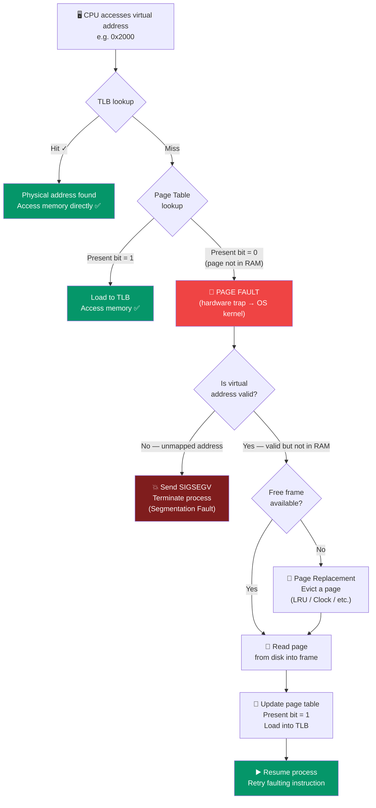

# Virtual Memory

## What You'll Learn

In this tutorial, you'll explore one of the most important abstractions in modern operating systems - virtual memory. You'll understand:

- What virtual memory is and why it's essential
- Demand paging: loading pages only when needed
- Page fault handling mechanism
- Page replacement necessity
- Thrashing: causes and prevention strategies
- Working set model
- Memory overcommitment
- Swap space and swapping
- Copy-on-Write (COW) optimization
- Benefits and costs of virtual memory
- Tools to monitor virtual memory on Linux

## Introduction

**Virtual Memory** is a memory management technique that provides an abstraction where each process has its own large, contiguous address space, independent of the actual physical memory available. It's one of the most important innovations in operating system design.

## What is Virtual Memory?

Virtual memory separates logical memory (what processes see) from physical memory (actual RAM).

```
Program's View (Virtual):          Physical Reality:
┌─────────────────────┐            ┌─────────────────────┐
│                     │            │  Page from Proc A   │
│   4 GB Address      │            │  Page from Proc C   │
│   Space             │            │  Page from Proc A   │
│                     │   ◄────►   │  Page from Proc B   │
│   (Appears          │            │  Free Frame         │
│    contiguous       │            │  Page from Proc A   │
│    and fully        │            │  OS Kernel          │
│    available)       │            └─────────────────────┘
│                     │            Only pages currently
└─────────────────────┘            needed are in RAM!
```

### Key Principle

**Only keep actively used pages in physical memory**
- Rest stays on disk
- Loaded on demand when needed
- Creates illusion of unlimited memory

## Why Virtual Memory?

### 1. Run Programs Larger Than Physical Memory

```
Physical RAM: 8 GB
Program size: 12 GB

Without Virtual Memory: Cannot run ✗
With Virtual Memory: Can run ✓

Only the working set (actively used pages) needs to be in RAM
```

### 2. More Efficient Memory Use

```
Traditional:
  10 processes × 500 MB each = 5 GB (all in RAM)
  8 GB RAM → can run only ~16 processes

Virtual Memory:
  Each process uses ~200 MB actively
  10 processes × 200 MB = 2 GB in RAM
  8 GB RAM → can run ~40 processes!
```

### 3. Process Isolation

Each process has its own virtual address space:
```
Process A:                Process B:
Virtual 0x1000 → Physical 0x5000
                         Virtual 0x1000 → Physical 0x8000

Same virtual address, different physical locations!
```

### 4. Memory Protection

- Pages can be marked read-only, read-write, execute
- Invalid page access causes page fault
- OS handles and can terminate misbehaving process

### 5. Simplified Memory Allocation

- Programmers don't worry about physical memory location
- malloc() can return any virtual address
- OS handles physical memory management

## Demand Paging

**Demand Paging**: Pages loaded into memory only when accessed (demanded).

### Initial State

```
Process starts:
┌─────────────────────┐
│  Virtual Address    │       Physical Memory:
│  Space              │       ┌──────────────┐
│                     │       │              │
│  Code pages         │ ?     │  (Empty)     │
│  Data pages         │ ?     │              │
│  Stack pages        │ ?     └──────────────┘
└─────────────────────┘

All pages marked "not present" (invalid bit set)
```

### First Access

```
CPU tries to access virtual address 0x1000:

1. MMU checks page table
2. Page marked "not present"
3. MMU raises page fault (trap to OS)
4. OS page fault handler:
   - Finds page on disk
   - Loads into free frame
   - Updates page table
   - Returns from trap
5. CPU retries instruction (now succeeds)
```

### Lazy Loading

```
Program executable: 10 MB
Actually executes: Only 2 MB of code

Traditional loading: Load all 10 MB
Demand paging: Load only 2 MB accessed
Savings: 8 MB of memory and load time!
```

## Page Fault Handling

**Page Fault**: Exception raised when accessing a page not in memory.

### Page Fault Types

| Type | Cause | Handler Action |
|------|-------|----------------|
| **Invalid** | Access to unmapped address | Terminate process (segfault) |
| **Protection** | Permission violation (e.g., write to read-only) | Terminate process |
| **Not Present** | Valid page not in memory | Load from disk, update page table |

### Page Fault Handling Steps



### Detailed Steps

**Step 1: Trap to OS**
```c
// Hardware automatically:
- Saves current instruction address
- Switches to kernel mode
- Jumps to page fault handler
```

**Step 2: Validate Address**
```c
if (!is_valid_address(address)) {
    send_signal(SIGSEGV);
    terminate_process();
    return;
}

if (!has_permission(address, operation)) {
    send_signal(SIGSEGV);
    terminate_process();
    return;
}
```

**Step 3: Find Free Frame**
```c
frame = find_free_frame();
if (frame == NULL) {
    frame = page_replacement_algorithm();
    if (frame_is_dirty(frame)) {
        write_to_disk(frame);
    }
}
```

**Step 4: Load Page**
```c
page_number = get_page_number(address);
disk_address = page_to_disk_map[page_number];
read_from_disk(disk_address, frame);
```

**Step 5: Update Page Table**
```c
page_table[page_number].frame = frame;
page_table[page_number].present = 1;
page_table[page_number].valid = 1;
tlb_flush(page_number);  // Invalidate TLB entry
```

**Step 6: Resume**
```c
return_from_trap();
// CPU retries the faulting instruction
```

## Performance of Demand Paging

### Effective Access Time

```
p = probability of page fault (0 ≤ p ≤ 1)
Memory access time = 100 ns
Page fault service time = 8 ms (8,000,000 ns)

EAT = (1 - p) × 100 + p × 8,000,000

Example 1: p = 0.001 (1 page fault per 1000 accesses)
  EAT = 0.999 × 100 + 0.001 × 8,000,000
      = 99.9 + 8,000
      = 8,099.9 ns
  Slowdown: 81x !

Example 2: p = 0.0001 (1 per 10,000 accesses)
  EAT = 0.9999 × 100 + 0.0001 × 8,000,000
      = 99.99 + 800
      = 899.99 ns
  Slowdown: 9x

Example 3: p = 0.00001 (1 per 100,000 accesses)
  EAT = 179.99 ns
  Slowdown: 1.8x (acceptable)
```

**Key insight**: Page fault rate must be very low for good performance!

## Swap Space

**Swap Space**: Disk area used for paging out memory.

```
Disk Layout:
┌─────────────────────┐
│  File System        │
│  (mounted)          │
├─────────────────────┤
│                     │
│  Swap Partition     │  ← Pages written here
│  or                 │
│  Swap File          │
│                     │
└─────────────────────┘
```

### Swap on Linux

```bash
# View swap usage
swapon --show

# Example output:
# NAME      TYPE SIZE USED PRIO
# /dev/sda3 partition 8G  1.2G -2

# View swap usage with free
free -h
#               total   used   free   shared  buff/cache  available
# Mem:          16Gi    8.0Gi  2.0Gi  500Mi   6.0Gi       7.0Gi
# Swap:         8.0Gi   1.2Gi  6.8Gi
```

### Creating Swap Space

```bash
# Create swap file (2 GB)
sudo dd if=/dev/zero of=/swapfile bs=1M count=2048
sudo chmod 600 /swapfile
sudo mkswap /swapfile
sudo swapon /swapfile

# Make permanent (add to /etc/fstab)
echo '/swapfile none swap sw 0 0' | sudo tee -a /etc/fstab

# Remove swap
sudo swapoff /swapfile
sudo rm /swapfile
```

## Copy-on-Write (COW)

**COW**: Optimization for process creation (fork()).

### Without COW

```
Parent Process:              After fork():
┌─────────────┐             ┌─────────────┐  ┌─────────────┐
│  Code       │             │  Code       │  │  Code       │
│  Data       │    fork()   │  Data       │  │  Data (copy)│
│  Stack      │   ──────►   │  Stack      │  │  Stack (copy)│
└─────────────┘             └─────────────┘  └─────────────┘
                            Parent            Child
                            
Entire address space duplicated immediately (expensive!)
```

### With COW

```
Parent Process:              After fork():
┌─────────────┐             ┌─────────────┐  ┌─────────────┐
│  Code       │             │  Code       │  │  Code       │
│  Data       │    fork()   │  Data       │  │  Data       │
│  Stack      │   ──────►   │  Stack      │  │  Stack      │
└─────────────┘             └──────┬──────┘  └──────┬──────┘
                                   │                │
                                   └────► Shared ◄──┘
                                        (read-only)
                            
When either writes:          After write by child:
                            ┌─────────────┐  ┌─────────────┐
Page fault!                 │  Data       │  │  Data (copy)│
Copy page                   └─────────────┘  └─────────────┘
Update page table           Parent            Child
```

**Advantages**:
- Fast fork() - only copy page tables
- Save memory - only duplicate modified pages
- Common case: child calls exec() immediately (no duplication needed)

### COW Implementation

```c
// Simplified COW fork implementation
pid_t fork_with_cow() {
    pid_t child_pid = create_new_process();
    
    if (child_pid == 0) {
        // Child process
        return 0;
    }
    
    // Parent process
    // Copy page table entries
    for (each page in parent's address space) {
        child_page_table[page] = parent_page_table[page];
        
        // Mark pages read-only in both parent and child
        parent_page_table[page].writable = 0;
        child_page_table[page].writable = 0;
        
        // Increment reference count
        frame_ref_count[page.frame]++;
    }
    
    return child_pid;
}

// Page fault handler for COW
void cow_page_fault_handler(address) {
    page = address / PAGE_SIZE;
    frame = page_table[page].frame;
    
    if (frame_ref_count[frame] == 1) {
        // Only this process references it
        page_table[page].writable = 1;
    } else {
        // Multiple processes reference it
        new_frame = allocate_frame();
        copy_frame(frame, new_frame);
        page_table[page].frame = new_frame;
        page_table[page].writable = 1;
        frame_ref_count[frame]--;
        frame_ref_count[new_frame] = 1;
    }
}
```

## Thrashing

**Thrashing**: When a system spends more time paging than executing.

### Cause

```
Too many processes, not enough memory:

Process A: Needs 10 pages
Process B: Needs 10 pages
Process C: Needs 10 pages
Total needed: 30 pages

Available frames: 20 pages

System behavior:
1. Load pages for A
2. A causes page fault → load page, evict B's page
3. B runs → page fault → load page, evict C's page
4. C runs → page fault → load page, evict A's page
5. A runs → page fault → ...

Endless cycle of page faults!
```

### Thrashing Diagram

```
CPU
Utilization
    │     ┌──────┐
100%│     │      │
    │     │      │
    │    ╱        ╲
    │   ╱          ╲╲
    │  ╱            ╲╲╲╲╲╲╲╲
    │ ╱               ╲╲╲╲╲╲╲╲  ← Thrashing!
    │╱                  ╲╲╲╲╲╲╲
  0%└──────────────────────────────►
    1  2  3  4  5  6  7  8  9  10   Degree of Multiprogramming

Initially: More processes → more CPU utilization
Thrashing point: Adding processes decreases performance
```

### Detecting Thrashing

```bash
# Monitor page faults
vmstat 1

# Output:
# procs ------memory------ ---swap-- -----io---- -system- ----cpu----
# r  b   swpd   free   buff  cache   si   so    bi    bo   in   cs us sy id wa
# 5  2  500000  50000  10000 200000  5000 5000  100   200  500  300 10 20 50 20
#                                     ^^   ^^
#                                     High swap in/out indicates thrashing

# Check page fault statistics
ps -eo min_flt,maj_flt,cmd | head -10
# min_flt: Minor page faults (page in memory, not in TLB)
# maj_flt: Major page faults (page not in memory)
```

### Preventing Thrashing

**1. Working Set Model**
```
Only run processes if their working set fits in memory
Working set: Set of pages actively used
```

**2. Page Fault Frequency (PFF)**
```
Monitor page fault rate per process
If rate too high: Give more frames
If rate too low: Take away frames
```

**3. Reduce Multiprogramming**
```
Suspend some processes temporarily
Better to run fewer processes well than all poorly
```

**4. Increase Physical Memory**
```
Most direct solution (but costs money)
```

## Working Set Model

**Working Set**: Set of pages used by a process in recent time window.

```
Time Window (Δ):
Page References: 1 2 3 4 1 2 5 1 2 3 4 5

At time t=12, Δ=10:
Working Set = {1, 2, 3, 4, 5}

At time t=12, Δ=5:
Working Set = {1, 2, 3, 4, 5}

At time t=12, Δ=3:
Working Set = {3, 4, 5}
```

**Working Set Size (WSS)**: Number of pages in working set

**Working Set Strategy**:
```
For each process i:
  WSS_i = working set size for process i

Total demand D = Σ WSS_i

If D > Total frames:
  Thrashing likely
  Suspend some processes
Else:
  Can run all processes
```

## Memory Overcommitment

**Overcommitment**: Allocating more virtual memory than physical memory + swap.

```
Physical RAM: 8 GB
Swap: 4 GB
Total: 12 GB

Virtual memory allocated: 20 GB

Overcommitment ratio: 20/12 = 1.67
```

### Linux Overcommit Modes

```bash
# View current overcommit setting
cat /proc/sys/vm/overcommit_memory

# 0: Heuristic (default) - reasonable overcommit
# 1: Always allow overcommit
# 2: Don't overcommit (strict)

# View overcommit ratio
cat /proc/sys/vm/overcommit_ratio
# 50 = Allow commit of 50% of RAM + all of swap

# Set overcommit mode
echo 2 | sudo tee /proc/sys/vm/overcommit_memory
```

### Why Overcommit?

```c
// Many programs allocate but don't use all memory
char *buffer = malloc(1000000);  // Allocate 1 MB
strcpy(buffer, "hello");         // Use only 6 bytes

// Fork with COW
fork();  // Child gets copy of address space
         // But most pages never modified → shared

Without overcommit: Many allocations would fail unnecessarily
With overcommit: System runs more processes efficiently
```

## Monitoring Virtual Memory

### vmstat Command

```bash
# Monitor VM statistics every 2 seconds
vmstat 2

# Output columns:
# procs: r (running), b (blocked)
# memory: swpd (swap used), free, buff, cache
# swap: si (swap in), so (swap out) - KB/s
# io: bi (blocks in), bo (blocks out)
# system: in (interrupts), cs (context switches)
# cpu: us, sy, id (idle), wa (wait for I/O)

# Extended memory info
vmstat -s
```

### free Command

```bash
# Memory usage
free -h

# Output:
#              total    used    free    shared  buff/cache  available
# Mem:          15Gi    5.0Gi   8.0Gi   500Mi   2.0Gi       9.5Gi
# Swap:         8.0Gi   1.0Gi   7.0Gi

# Explanation:
# total: Total physical RAM
# used: Used by processes
# free: Completely unused
# shared: tmpfs, shared memory
# buff/cache: Disk cache (can be freed if needed)
# available: Memory available for new processes
```

### /proc/meminfo

```bash
# Detailed memory information
cat /proc/meminfo

# Key fields:
# MemTotal: Total usable RAM
# MemFree: Free memory
# MemAvailable: Available memory (including cache)
# Buffers: Temporary buffer cache
# Cached: Page cache
# SwapTotal: Total swap space
# SwapFree: Free swap space
# Dirty: Memory waiting to be written to disk
# Active: Recently used memory
# Inactive: Not recently used (candidate for eviction)
```

### Per-Process Memory Info

```bash
# Memory usage by process
ps aux --sort=-%mem | head -10

# Detailed memory map
cat /proc/$$/smaps

# Summary
cat /proc/$$/status | grep -i vm
```

## Benefits and Costs

### Benefits

| Benefit | Description |
|---------|-------------|
| **Large address space** | Programs can be larger than physical RAM |
| **More processes** | Run more concurrent processes |
| **Protection** | Process isolation, permission enforcement |
| **Sharing** | Efficient sharing of memory (libraries) |
| **Flexibility** | Dynamic memory allocation |
| **Simplified programming** | Programmers don't manage physical memory |

### Costs

| Cost | Description |
|------|-------------|
| **Complexity** | Hardware (MMU, TLB) and OS complexity |
| **Memory overhead** | Page tables consume memory |
| **Performance penalty** | Page faults are expensive |
| **Thrashing risk** | System can become unresponsive |
| **Disk I/O** | Paging increases disk activity |

## Key Takeaways

1. **Virtual memory** allows running programs larger than physical RAM
2. **Demand paging** loads pages only when needed
3. **Page faults** occur when accessing pages not in memory
4. **Copy-on-Write** optimizes process creation
5. **Thrashing** happens when too much time spent paging
6. **Working set** is the set of actively used pages
7. **Swap space** provides backing store for paged-out memory
8. **Memory overcommitment** allows allocating more virtual than physical memory

## Exercises

### Beginner

1. Calculate effective access time if memory access = 100 ns, page fault service = 10 ms, and page fault rate = 0.0001.

2. Explain why demand paging is more efficient than loading the entire program into memory.

3. What is the difference between a minor page fault and a major page fault?

### Intermediate

4. A system has 4 GB RAM and 8 GB swap. If 10 processes each need 1 GB of memory but only actively use 300 MB, can the system run all processes? Explain.

5. Write a C program that demonstrates Copy-on-Write behavior by forking and measuring memory usage before and after modifying data.

6. Design an experiment to deliberately cause thrashing on your system. Monitor with vmstat and describe your observations.

### Advanced

7. Implement a simple page fault simulator that:
   - Simulates a page table
   - Generates random memory accesses
   - Tracks page faults
   - Implements a basic page replacement algorithm
   - Reports statistics

8. Analyze /proc/meminfo over time while running a memory-intensive application. Identify when pages are swapped out and swapped back in.

9. Compare the performance of a program with good locality versus poor locality. Measure page faults and execution time.

## Navigation

- **Previous**: [← Paging and Segmentation](./03_paging_segmentation.md)
- **Next**: [Page Replacement Algorithms →](./05_page_replacement.md)
- **Up**: [Memory Management](./README.md)

---

*Virtual memory is one of the most elegant abstractions in computer science - it enables the illusion of unlimited memory!*
