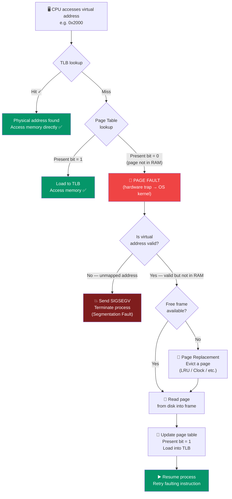

# Virtual Memory

## Is Tutorial Mein Kya Seekhoge

Chalo aaj OS ke sabse mast aur sabse important abstraction ko samajhte hain — **Virtual Memory**. Ye woh cheez hai jo modern computing ko possible banati hai. Bina isske tumhara laptop 5 apps bhi ek saath smoothly nahi chala paata. Is file mein cover karenge:

- Virtual memory hai kya aur ye zaruri kyun hai
- Demand paging: pages sirf tabhi load karo jab zaruri ho
- Page fault handling ka pura mechanism
- Page replacement kyun zaruri hai
- Thrashing: kaise hoti hai aur kaise roken
- Working set model
- Memory overcommitment
- Swap space aur swapping
- Copy-on-Write (COW) optimization
- Virtual memory ke fayde aur nuksaan
- Linux pe virtual memory monitor karne ke tools

## Introduction

Socho tumhare paas 8 GB RAM wala laptop hai, lekin tum Chrome ke 50 tabs, VS Code, Docker, Postman, aur Slack — sab kuch ek saath khola hua hai. Agar in sabki total memory demand add karo toh easily 20-30 GB ban jaayegi. Phir bhi system chal raha hai, hang nahi ho raha (zyada tar time). Ye jaadu hai **Virtual Memory** ka.

**Virtual Memory** ek memory management technique hai jo har process ko ek illusion deti hai — ki uske paas apna khud ka bada, contiguous (lagataar) address space hai, jaise poora RAM sirf usी ke liye hai. Reality mein physical RAM limited hoti hai aur usko sab processes share karte hain, lekin har process ko lagta hai "mera apna alag ghar hai."

Ye OS design ki sabse elegant innovations mein se ek hai — bina isske aaj ka multitasking OS possible hi nahi hota.

## Virtual Memory Hai Kya?

Simple baat: Virtual memory, **logical memory** (jo process ko dikhta hai) ko **physical memory** (actual RAM chips) se alag kar deti hai.

Socho Zomato ki tarah — jab tum app khol ke menu dekhte ho, tumhe lagta hai poora restaurant ka menu tumhare saamne hai. Lekin backend mein sirf woh data load hota hai jo abhi zaruri hai (jo dish tum dekh rahe ho), baaki cache ya server pe pada rehta hai. Process ko bhi aisa hi lagta hai — "mere paas 4GB ka pura address space hai," lekin actual mein sirf zaruri pages hi RAM mein hote hain.

```
Program's View (Virtual):          Physical Reality:
┌─────────────────────┐            ┌─────────────────────┐
│                     │            │  Page from Proc A   │
│   4 GB Address      │            │  Page from Proc C   │
│   Space             │            │  Page from Proc A   │
│                     │   ◄────►   │  Page from Proc B   │
│   (Appears          │            │  Free Frame         │
│    contiguous       │            │  Page from Proc A   │
│    and fully        │            │  OS Kernel          │
│    available)       │            └─────────────────────┘
│                     │            Only pages currently
└─────────────────────┘            needed are in RAM!
```

### Key Principle

> [!tip]
> **Sirf actively use ho rahe pages ko hi physical memory mein rakho.**
> - Baaki sab disk pe padi rehti hai
> - Jab zarurat ho tabhi load hoti hai (on demand)
> - Isse "unlimited memory" ka illusion create hota hai

Ye bilkul waisa hi hai jaise Netflix pura movie tumhare phone pe download nahi karta — woh sirf jo part tum abhi dekh rahe ho, woh stream (buffer) karta hai. Poori movie "available" lagti hai, lekin actual mein chunks by chunks aati hai.

## Virtual Memory Kyun Zaruri Hai?

### 1. Physical Memory Se Bade Programs Chalana

Kya hota hai agar tumhara program RAM se bhi bada ho? Bina virtual memory ke, jawab hoga: "Sorry, nahi chal sakta." Lekin virtual memory ke saath:

```
Physical RAM: 8 GB
Program size: 12 GB

Without Virtual Memory: Cannot run ✗
With Virtual Memory: Can run ✓

Only the working set (actively used pages) needs to be in RAM
```

Socho ek 12 GB ki video editing software hai, lekin tum sirf ek chhota sa clip edit kar rahe ho. Us waqt sirf woh relevant code aur data pages RAM mein chahiye, poora 12 GB nahi. Baaki disk pe pada rehta hai, zarurat padne pe load ho jaata hai.

### 2. Zyada Efficient Memory Use

```
Traditional:
  10 processes × 500 MB each = 5 GB (all in RAM)
  8 GB RAM → can run only ~16 processes

Virtual Memory:
  Each process uses ~200 MB actively
  10 processes × 200 MB = 2 GB in RAM
  8 GB RAM → can run ~40 processes!
```

Yaani agar har process apna poora allocated memory use nahi kar raha (jo aksar hota hai), toh virtual memory tumhe zyada processes ek saath chalane deti hai — jaise Swiggy ek hi delivery fleet se zyada orders handle kar leta hai kyunki har delivery boy hamesha busy nahi hota.

### 3. Process Isolation

Har process ka apna alag virtual address space hota hai — matlab ek process doosre process ki memory ko accidentally (ya jaan-boojh ke) touch nahi kar sakta.

```
Process A:                Process B:
Virtual 0x1000 → Physical 0x5000
                         Virtual 0x1000 → Physical 0x8000

Same virtual address, different physical locations!
```

Ye bilkul CRED aur Paytm ki tarah hai — dono apps ke paas "account balance" naam ka apna variable ho sakta hai, lekin dono ka actual data bilkul alag jagah store hota hai. Ek app doosri app ke data ko directly access nahi kar sakti.

### 4. Memory Protection

- Pages ko read-only, read-write, ya execute mark kiya ja sakta hai
- Invalid page access karne se page fault hota hai
- OS is fault ko handle karta hai, aur zarurat pade toh misbehaving process ko terminate kar deta hai

Isliye jab koi buggy program kisi random memory address pe likhne ki koshish karta hai jiska usko access nahi, tumhe "Segmentation Fault" milta hai — OS ne bola "bhai ye tera ghar nahi hai, bahar nikal."

### 5. Simplified Memory Allocation

- Programmers ko physical memory ki location ki fikar nahi karni padti
- `malloc()` koi bhi virtual address return kar sakta hai
- Physical memory manage karne ka kaam OS uthata hai

## Demand Paging

**Kya hota hai?** Demand Paging matlab pages tabhi memory mein load hote hain jab unka access "demand" kiya jaata hai — pehle se sab kuch load nahi karte.

Socho IRCTC website — jab tum train search karte ho, sirf relevant trains ka data load hota hai, poora India ka train database nahi. Waise hi demand paging kaam karti hai.

### Initial State

Jab process start hota hai, uske saare pages "not present" mark hote hain — matlab OS ne bola "abhi kuch bhi load nahi kiya, jab zarurat padegi tab dekhenge."

```
Process starts:
┌─────────────────────┐
│  Virtual Address    │       Physical Memory:
│  Space              │       ┌──────────────┐
│                     │       │              │
│  Code pages         │ ?     │  (Empty)     │
│  Data pages         │ ?     │              │
│  Stack pages        │ ?     └──────────────┘
└─────────────────────┘

All pages marked "not present" (invalid bit set)
```

### First Access

```
CPU tries to access virtual address 0x1000:

1. MMU checks page table
2. Page marked "not present"
3. MMU raises page fault (trap to OS)
4. OS page fault handler:
   - Finds page on disk
   - Loads into free frame
   - Updates page table
   - Returns from trap
5. CPU retries instruction (now succeeds)
```

Yaani jaise koi Swiggy pe order karta hai, delivery boy turant nahi pahunchta — pehle restaurant order accept karta hai, khana banta hai, phir deliver hota hai. Isi tarah page fault ke baad bhi ek "processing delay" hoti hai jab tak page RAM mein load nahi ho jaata.

### Lazy Loading

```
Program executable: 10 MB
Actually executes: Only 2 MB of code

Traditional loading: Load all 10 MB
Demand paging: Load only 2 MB accessed
Savings: 8 MB of memory and load time!
```

> [!tip]
> Zyadatar programs apne total code ka sirf ek chhota fraction hi actually run karte hain (jaise error-handling code, rarely-used features). Demand paging is fact ka fayda uthaake sirf zaruri parts load karti hai — memory aur load time dono bachta hai.

## Page Fault Handling

**Kya hota hai?** Page Fault ek exception hai jo tab raise hoti hai jab process kisi aise page ko access karta hai jo abhi RAM mein present nahi hai.

Confusion mat karo — "fault" naam ka matlab error nahi hai! Zyadatar page faults **normal aur expected** hote hain, ye demand paging ka core mechanism hi hai.

### Page Fault Ke Types

| Type | Cause | Handler Action |
|------|-------|----------------|
| **Invalid** | Aisa address access kiya jo kabhi map hi nahi hua | Process terminate (segfault) |
| **Protection** | Permission violation (jaise read-only page pe likhna) | Process terminate |
| **Not Present** | Valid page hai lekin RAM mein nahi hai | Disk se load karo, page table update karo |

### Page Fault Handling Ke Steps



Socho ye flow ek railway reservation counter jaisa hai — tum seat book karne aate ho (CPU memory access karta hai), pehle clerk apne quick-reference chart (TLB) mein dekhta hai. Agar wahan mil gaya, turant book ho gaya (TLB hit). Nahi mila toh poora register (page table) check karta hai. Agar wahan bhi entry nahi hai ki tumhara ticket valid hai, toh ya toh reject kar dega (invalid address → segfault) ya phir naya record banayega (page fault handle → load from disk).

### Detailed Steps — Ek Ek Karke Samjho

**Step 1: OS Ko Trap**

Jab CPU ko page fault milta hai, hardware automatically ye kaam karta hai:

```c
// Hardware automatically:
- Saves current instruction address
- Switches to kernel mode
- Jumps to page fault handler
```

Yaani CPU khud apna current kaam pause karke, "current instruction address" note karke, seedha kernel mode mein jump kar jaata hai — jaise koi customer support call escalate karke senior manager ko transfer ki jaati hai.

**Step 2: Address Validate Karo**

```c
if (!is_valid_address(address)) {
    send_signal(SIGSEGV);
    terminate_process();
    return;
}

if (!has_permission(address, operation)) {
    send_signal(SIGSEGV);
    terminate_process();
    return;
}
```

OS sabse pehle check karta hai — "ye address bhi valid hai kya? Aur is process ko yahan access karne ki permission bhi hai kya?" Agar dono mein se koi fail ho jaaye, process ko turant terminate kar diya jaata hai. Ye bilkul security guard ki tarah hai jo ID card check karta hai — na ID valid, na entry.

**Step 3: Free Frame Dhoondo**

```c
frame = find_free_frame();
if (frame == NULL) {
    frame = page_replacement_algorithm();
    if (frame_is_dirty(frame)) {
        write_to_disk(frame);
    }
}
```

Agar RAM mein khali jagah (frame) hai toh use le lo. Agar nahi hai — jaise ek fully-booked OYO hotel — toh kisi existing guest (page) ko checkout karana padega (page replacement algorithm chalega). Agar us guest ne kamre mein kuch modify kiya tha (dirty page), toh pehle woh changes disk pe save karne padenge, tabhi room khali hoga.

**Step 4: Page Load Karo**

```c
page_number = get_page_number(address);
disk_address = page_to_disk_map[page_number];
read_from_disk(disk_address, frame);
```

Ab OS ko pata chal gaya kaunsa page chahiye aur woh disk pe kahan hai — bas usko copy karke free frame mein le aao.

**Step 5: Page Table Update Karo**

```c
page_table[page_number].frame = frame;
page_table[page_number].present = 1;
page_table[page_number].valid = 1;
tlb_flush(page_number);  // Invalidate TLB entry
```

Ab page table ko batana padega ki "ye page ab is frame mein present hai." TLB (jo ek fast cache hai page table entries ka) ko bhi update karna zaruri hai, warna purani (stale) entry use ho jaayegi.

**Step 6: Resume Karo**

```c
return_from_trap();
// CPU retries the faulting instruction
```

Ab CPU wapas usi instruction pe jaata hai jahan fault hua tha aur usko phir se try karta hai — is baar page present hai, toh successfully chal jaata hai. User ko iska pata bhi nahi chalta, sab kuch milliseconds mein ho jaata hai (zyadatar).

## Demand Paging Ki Performance

### Effective Access Time (EAT)

Ye formula batata hai ki average mein memory access karne mein kitna time lagta hai, page faults ko account karte hue.

```
p = probability of page fault (0 ≤ p ≤ 1)
Memory access time = 100 ns
Page fault service time = 8 ms (8,000,000 ns)

EAT = (1 - p) × 100 + p × 8,000,000

Example 1: p = 0.001 (1 page fault per 1000 accesses)
  EAT = 0.999 × 100 + 0.001 × 8,000,000
      = 99.9 + 8,000
      = 8,099.9 ns
  Slowdown: 81x !

Example 2: p = 0.0001 (1 per 10,000 accesses)
  EAT = 0.9999 × 100 + 0.0001 × 8,000,000
      = 99.99 + 800
      = 899.99 ns
  Slowdown: 9x

Example 3: p = 0.00001 (1 per 100,000 accesses)
  EAT = 179.99 ns
  Slowdown: 1.8x (acceptable)
```

> [!warning]
> **Key insight**: Page fault rate agar thoda bhi zyada ho jaaye, performance bahut zyada gir jaati hai! Page fault service time (disk access) normal memory access se **80,000 guna** zyada slow hota hai. Isliye page fault rate ko super low rakhna critical hai.

Socho ye aisa hai jaise tumhari Zomato app har order pe 99% time instant response de, lekin 1% orders mein restaurant se manually call karke confirm karna pade — woh 1% hi tumhara poora average response time barbaad kar dega, kyunki call karna instant response se hazaaron guna slow hai.

## Swap Space

**Kya hota hai?** Swap Space disk ka woh area hai jo memory pages ko "paged out" karne (temporarily nikaal ke rakhne) ke liye use hota hai jab RAM full ho jaaye.

```
Disk Layout:
┌─────────────────────┐
│  File System        │
│  (mounted)          │
├─────────────────────┤
│                     │
│  Swap Partition     │  ← Pages written here
│  or                 │
│  Swap File          │
│                     │
└─────────────────────┘
```

Socho swap space ek godown ki tarah hai — jab tumhari dukaan (RAM) mein jagah kam pad jaaye, tum kam-use hone waala saaman godown (disk) mein bhej dete ho. Zarurat padne pe wapas mangwa lete ho. Slow process hai (disk RAM se hazaaron guna slow hai), lekin better hai crash hone se.

### Swap Linux Pe

```bash
# View swap usage
swapon --show

# Example output:
# NAME      TYPE SIZE USED PRIO
# /dev/sda3 partition 8G  1.2G -2

# View swap usage with free
free -h
#               total   used   free   shared  buff/cache  available
# Mem:          16Gi    8.0Gi  2.0Gi  500Mi   6.0Gi       7.0Gi
# Swap:         8.0Gi   1.2Gi  6.8Gi
```

### Swap Space Banana

```bash
# Create swap file (2 GB)
sudo dd if=/dev/zero of=/swapfile bs=1M count=2048
sudo chmod 600 /swapfile
sudo mkswap /swapfile
sudo swapon /swapfile

# Make permanent (add to /etc/fstab)
echo '/swapfile none swap sw 0 0' | sudo tee -a /etc/fstab

# Remove swap
sudo swapoff /swapfile
sudo rm /swapfile
```

> [!info]
> Cloud servers (jaise AWS EC2 ke chhote instances) mein bahut kam RAM hoti hai, isliye production mein swap file banana bahut common practice hai — taaki koi memory-heavy build process ya spike aane pe server crash na ho jaaye.

## Copy-on-Write (COW)

**Kya hota hai?** COW ek optimization technique hai jo process creation (`fork()`) ko fast banati hai.

Socho tumhe apni poori Google Drive ki file structure ko duplicate karna hai kisi doosre user ke liye. Agar tum har file ko turant physically copy karo, bahut time aur storage lagega. Lekin agar tum sirf "shortcut/reference" bana do jo original file ko point kare, aur sirf tabhi asli copy banao jab koi actually us file mein change kare — ye hai COW ka core idea.

### Bina COW Ke

```
Parent Process:              After fork():
┌─────────────┐             ┌─────────────┐  ┌─────────────┐
│  Code       │             │  Code       │  │  Code       │
│  Data       │    fork()   │  Data       │  │  Data (copy)│
│  Stack      │   ──────►   │  Stack      │  │  Stack (copy)│
└─────────────┘             └─────────────┘  └─────────────┘
                            Parent            Child
                            
Entire address space duplicated immediately (expensive!)
```

Ye slow aur wasteful hai, khaaske jab (jaise aksar hota hai) child process turant `exec()` call karke ek naya program load kar leta hai — tab poora copy kiya hua data bekaar chala jaata hai.

### COW Ke Saath

```
Parent Process:              After fork():
┌─────────────┐             ┌─────────────┐  ┌─────────────┐
│  Code       │             │  Code       │  │  Code       │
│  Data       │    fork()   │  Data       │  │  Data       │
│  Stack      │   ──────►   │  Stack      │  │  Stack      │
└─────────────┘             └──────┬──────┘  └──────┬──────┘
                                   │                │
                                   └────► Shared ◄──┘
                                        (read-only)
                            
When either writes:          After write by child:
                            ┌─────────────┐  ┌─────────────┐
Page fault!                 │  Data       │  │  Data (copy)│
Copy page                   └─────────────┘  └─────────────┘
Update page table           Parent            Child
```

Yaani parent aur child pehle same physical pages ko share karte hain (read-only mark karke). Jaise hi koi ek unmein se write karne ki koshish karta hai, tabhi page fault trigger hota hai aur **sirf usi page** ka copy banaya jaata hai — poore address space ka nahi.

**Fayde**:
- `fork()` fast hota hai — sirf page tables copy hote hain, actual data nahi
- Memory bachti hai — sirf modify hue pages hi duplicate hote hain
- Common case: child turant `exec()` call kar leta hai (koi duplication ki zarurat hi nahi padti)

### COW Implementation

```c
// Simplified COW fork implementation
pid_t fork_with_cow() {
    pid_t child_pid = create_new_process();
    
    if (child_pid == 0) {
        // Child process
        return 0;
    }
    
    // Parent process
    // Copy page table entries
    for (each page in parent's address space) {
        child_page_table[page] = parent_page_table[page];
        
        // Mark pages read-only in both parent and child
        parent_page_table[page].writable = 0;
        child_page_table[page].writable = 0;
        
        // Increment reference count
        frame_ref_count[page.frame]++;
    }
    
    return child_pid;
}

// Page fault handler for COW
void cow_page_fault_handler(address) {
    page = address / PAGE_SIZE;
    frame = page_table[page].frame;
    
    if (frame_ref_count[frame] == 1) {
        // Only this process references it
        page_table[page].writable = 1;
    } else {
        // Multiple processes reference it
        new_frame = allocate_frame();
        copy_frame(frame, new_frame);
        page_table[page].frame = new_frame;
        page_table[page].writable = 1;
        frame_ref_count[frame]--;
        frame_ref_count[new_frame] = 1;
    }
}
```

Note karo: `frame_ref_count` yahan key hai — ye track karta hai kitne processes ek hi physical frame ko share kar rahe hain. Jab ye count 1 pe aa jaata hai (matlab ab sirf ek hi process use kar raha hai), copy karne ki zarurat hi nahi — bas usko directly writable bana do.

## Thrashing

**Kya hota hai?** Thrashing woh situation hai jab system apna zyadatar time pages ko load/unload karne mein bitaata hai, actual kaam (execution) karne mein nahi.

Socho Swiggy delivery boy ka example — agar usko ek saath 10 alag-alag restaurants se orders pick karne bola jaaye jo ek dusre se bahut door hain, woh apna poora time bas aana-jaana (travel) karne mein bitaayega, actual delivery karne mein nahi. Yahi thrashing hai — system "paging" mein busy hai, "productive work" mein nahi.

### Kaise Hoti Hai

```
Too many processes, not enough memory:

Process A: Needs 10 pages
Process B: Needs 10 pages
Process C: Needs 10 pages
Total needed: 30 pages

Available frames: 20 pages

System behavior:
1. Load pages for A
2. A causes page fault → load page, evict B's page
3. B runs → page fault → load page, evict C's page
4. C runs → page fault → load page, evict A's page
5. A runs → page fault → ...

Endless cycle of page faults!
```

Ye ek vicious cycle ban jaata hai — jitna zyada processes chalane ki koshish karo, utna hi zyada pages evict hote hain, jinki phir se zarurat padti hai, phir load karna padta hai, phir evict... system busy dikhta hai (CPU 100% "kaam" kar raha hoga) lekin actual progress zero ke barabar.

### Thrashing Ka Diagram

```
CPU
Utilization
    │     ┌──────┐
100%│     │      │
    │     │      │
    │    ╱        ╲
    │   ╱          ╲╲
    │  ╱            ╲╲╲╲╲╲╲╲
    │ ╱               ╲╲╲╲╲╲╲╲  ← Thrashing!
    │╱                  ╲╲╲╲╲╲╲
  0%└──────────────────────────────►
    1  2  3  4  5  6  7  8  9  10   Degree of Multiprogramming

Initially: More processes → more CPU utilization
Thrashing point: Adding processes decreases performance
```

> [!warning]
> Shuruaat mein zyada processes chalane se CPU utilization badhti hai (achha hai). Lekin ek point ke baad, aur processes add karne se performance **girni** shuru ho jaati hai — kyunki ab available frames kam pad rahe hain aur system constant page-fault-and-evict cycle mein phans jaata hai.

### Thrashing Detect Karna

```bash
# Monitor page faults
vmstat 1

# Output:
# procs ------memory------ ---swap-- -----io---- -system- ----cpu----
# r  b   swpd   free   buff  cache   si   so    bi    bo   in   cs us sy id wa
# 5  2  500000  50000  10000 200000  5000 5000  100   200  500  300 10 20 50 20
#                                     ^^   ^^
#                                     High swap in/out indicates thrashing

# Check page fault statistics
ps -eo min_flt,maj_flt,cmd | head -10
# min_flt: Minor page faults (page in memory, not in TLB)
# maj_flt: Major page faults (page not in memory)
```

Agar `vmstat` mein `si` (swap in) aur `so` (swap out) columns mein consistently high numbers dikh rahe hain, samajh jao system thrashing kar raha hai — jaise laptop achanak bahut slow ho jaata hai aur hard disk light continuously blink karti rehti hai.

### Thrashing Rokna

**1. Working Set Model**
```
Only run processes if their working set fits in memory
Working set: Set of pages actively used
```

**2. Page Fault Frequency (PFF)**
```
Monitor page fault rate per process
If rate too high: Give more frames
If rate too low: Take away frames
```

**3. Multiprogramming Kam Karo**
```
Suspend some processes temporarily
Better to run fewer processes well than all poorly
```

Jaise Zomato peak lunch hour mein agar zyada orders handle nahi kar sakta, better hai kuch orders ko "restaurant busy" bol ke reject kar de, bajaye sab orders accept karke sabko slow deliver kare aur sab customers unhappy ho jaayein.

**4. Physical Memory Badhao**
```
Most direct solution (but costs money)
```

Sabse simple solution — bas RAM upgrade kar do. Lekin obviously cost involved hai.

## Working Set Model

**Kya hota hai?** Working Set ek process dwara recent time window mein use kiye gaye pages ka set hai.

```
Time Window (Δ):
Page References: 1 2 3 4 1 2 5 1 2 3 4 5

At time t=12, Δ=10:
Working Set = {1, 2, 3, 4, 5}

At time t=12, Δ=5:
Working Set = {1, 2, 3, 4, 5}

At time t=12, Δ=3:
Working Set = {3, 4, 5}
```

Socho tumhare Instagram feed jaisa — "recently viewed" posts ka set continuously change hota rehta hai based on tumne kitne "recent" time window mein kya dekha. Δ (delta) jitna chhota, working set utna hi zyada "abhi ke abhi" active pages ko represent karega.

**Working Set Size (WSS)**: Working set mein kitne pages hain, uska count.

**Working Set Strategy**:
```
For each process i:
  WSS_i = working set size for process i

Total demand D = Σ WSS_i

If D > Total frames:
  Thrashing likely
  Suspend some processes
Else:
  Can run all processes
```

Yaani OS har process ka working set track karta hai, sabko add karke dekhta hai ki total demand available frames se zyada toh nahi ho raha. Agar ho raha hai, kuch processes ko temporarily suspend kar do — thrashing se pehle hi problem pakad lo.

## Memory Overcommitment

**Kya hota hai?** Overcommitment matlab physical memory + swap se bhi zyada virtual memory allocate kar dena.

```
Physical RAM: 8 GB
Swap: 4 GB
Total: 12 GB

Virtual memory allocated: 20 GB

Overcommitment ratio: 20/12 = 1.67
```

Ye bilkul airline ki overbooking policy jaisa hai — airlines jaante hain ki kuch passengers no-show honge, isliye woh seats se zyada tickets bech dete hain. OS bhi jaanta hai ki processes jo memory allocate karte hain, uska poora use nahi karte — isliye zyada virtual memory "promise" kar deta hai, is assumption pe ki sab ek saath fully use nahi karenge.

### Linux Overcommit Modes

```bash
# View current overcommit setting
cat /proc/sys/vm/overcommit_memory

# 0: Heuristic (default) - reasonable overcommit
# 1: Always allow overcommit
# 2: Don't overcommit (strict)

# View overcommit ratio
cat /proc/sys/vm/overcommit_ratio
# 50 = Allow commit of 50% of RAM + all of swap

# Set overcommit mode
echo 2 | sudo tee /proc/sys/vm/overcommit_memory
```

### Overcommit Kyun Karte Hain?

```c
// Many programs allocate but don't use all memory
char *buffer = malloc(1000000);  // Allocate 1 MB
strcpy(buffer, "hello");         // Use only 6 bytes

// Fork with COW
fork();  // Child gets copy of address space
         // But most pages never modified → shared

Without overcommit: Many allocations would fail unnecessarily
With overcommit: System runs more processes efficiently
```

Socho ek app `malloc(1 GB)` call karta hai "just in case" ki bade data ki zarurat pad jaaye, lekin actual mein sirf kuch KB use karta hai. Bina overcommit ke, OS us poore 1 GB ko turant reserve kar dega — bhale hi actual RAM mein utni jagah na ho. Overcommit ke saath, OS smartly bolta hai "chalo allocate kar deta hoon, jab actually use hoga tab dekh lenge" — aur zyadatar cases mein ye assumption sahi nikalti hai.

> [!warning]
> Agar overcommit zyada aggressive ho aur processes actually us memory ko use karna shuru kar dein jitni unhone allocate ki thi, toh system RAM khatam kar sakta hai. Us case mein Linux ka **OOM Killer** (Out-Of-Memory Killer) activate ho jaata hai aur kisi process ko forcefully kill kar deta hai memory free karne ke liye.

## Virtual Memory Monitor Karna

### vmstat Command

```bash
# Monitor VM statistics every 2 seconds
vmstat 2

# Output columns:
# procs: r (running), b (blocked)
# memory: swpd (swap used), free, buff, cache
# swap: si (swap in), so (swap out) - KB/s
# io: bi (blocks in), bo (blocks out)
# system: in (interrupts), cs (context switches)
# cpu: us, sy, id (idle), wa (wait for I/O)

# Extended memory info
vmstat -s
```

### free Command

```bash
# Memory usage
free -h

# Output:
#              total    used    free    shared  buff/cache  available
# Mem:          15Gi    5.0Gi   8.0Gi   500Mi   2.0Gi       9.5Gi
# Swap:         8.0Gi   1.0Gi   7.0Gi

# Explanation:
# total: Total physical RAM
# used: Used by processes
# free: Completely unused
# shared: tmpfs, shared memory
# buff/cache: Disk cache (can be freed if needed)
# available: Memory available for new processes
```

> [!tip]
> Beginners aksar confuse ho jaate hain "free" column dekh ke — kam "free" memory dekh ke ghabra jaate hain. Lekin actually dekhna chahiye "available" column, kyunki Linux disk cache ke liye extra RAM use karta hai (jo zarurat padne pe instantly free ho sakta hai). Kam "free" hona normal hai, iska matlab ye nahi ki system ko memory ki kami hai.

### /proc/meminfo

```bash
# Detailed memory information
cat /proc/meminfo

# Key fields:
# MemTotal: Total usable RAM
# MemFree: Free memory
# MemAvailable: Available memory (including cache)
# Buffers: Temporary buffer cache
# Cached: Page cache
# SwapTotal: Total swap space
# SwapFree: Free swap space
# Dirty: Memory waiting to be written to disk
# Active: Recently used memory
# Inactive: Not recently used (candidate for eviction)
```

### Per-Process Memory Info

```bash
# Memory usage by process
ps aux --sort=-%mem | head -10

# Detailed memory map
cat /proc/$$/smaps

# Summary
cat /proc/$$/status | grep -i vm
```

## Fayde Aur Nuksaan

### Fayde (Benefits)

| Benefit | Description |
|---------|-------------|
| **Large address space** | Programs physical RAM se bade ho sakte hain |
| **More processes** | Zyada concurrent processes chala sakte hain |
| **Protection** | Process isolation, permission enforcement |
| **Sharing** | Memory ka efficient sharing (libraries) |
| **Flexibility** | Dynamic memory allocation |
| **Simplified programming** | Programmers ko physical memory manage nahi karni padti |

### Nuksaan (Costs)

| Cost | Description |
|------|-------------|
| **Complexity** | Hardware (MMU, TLB) aur OS complexity badhti hai |
| **Memory overhead** | Page tables khud memory consume karte hain |
| **Performance penalty** | Page faults expensive hote hain |
| **Thrashing risk** | System unresponsive ho sakta hai |
| **Disk I/O** | Paging se disk activity badhti hai |

> [!info]
> Virtual memory "free lunch" nahi hai — ye trade-off hai. Complexity aur kabhi-kabhi performance penalty ke badle mein hume flexibility, isolation, aur "bade programs chalane ki ability" milti hai. Zyadatar cases mein ye trade-off worth it hota hai, isliye har modern OS (Linux, Windows, macOS) isko use karta hai.

## Key Takeaways

1. **Virtual memory** physical RAM se bade programs chalane deti hai
2. **Demand paging** sirf zarurat padne pe pages load karti hai
3. **Page faults** tab hote hain jab kisi aise page ko access kiya jaaye jo RAM mein nahi hai
4. **Copy-on-Write** process creation (`fork()`) ko optimize karti hai
5. **Thrashing** tab hoti hai jab zyada time paging mein jaaye, actual execution mein nahi
6. **Working set** actively use ho rahe pages ka set hai
7. **Swap space** paged-out memory ke liye backing store provide karta hai
8. **Memory overcommitment** physical se zyada virtual memory allocate karne deta hai

## Exercises

### Beginner

1. Effective access time calculate karo agar memory access = 100 ns, page fault service = 10 ms, aur page fault rate = 0.0001 ho.

2. Explain karo demand paging poora program load karne se zyada efficient kyun hai.

3. Minor page fault aur major page fault mein kya difference hai?

### Intermediate

4. Ek system ke paas 4 GB RAM aur 8 GB swap hai. Agar 10 processes har ek ko 1 GB memory chahiye lekin actively sirf 300 MB use karte hain, kya system sab processes chala sakta hai? Explain karo.

5. Ek C program likho jo Copy-on-Write behavior demonstrate kare — fork karke aur data modify karne se pehle/baad memory usage measure karke.

6. Ek experiment design karo jisse tumhare system pe deliberately thrashing ho. `vmstat` se monitor karo aur apne observations describe karo.

### Advanced

7. Ek simple page fault simulator implement karo jo:
   - Page table simulate kare
   - Random memory accesses generate kare
   - Page faults track kare
   - Ek basic page replacement algorithm implement kare
   - Statistics report kare

8. `/proc/meminfo` ko time ke saath analyze karo jab koi memory-intensive application chal rahi ho. Identify karo kab pages swap out hoti hain aur kab wapas swap in hoti hain.

9. Achhi locality wale program aur kharab locality wale program ki performance compare karo. Page faults aur execution time measure karo.

## Navigation

- **Previous**: [← Paging and Segmentation](./03_paging_segmentation.md)
- **Next**: [Page Replacement Algorithms →](./05_page_replacement.md)
- **Up**: [Memory Management](./README.md)

---

*Virtual memory computer science ke sabse elegant abstractions mein se ek hai — ye unlimited memory ka illusion possible banaati hai!*
