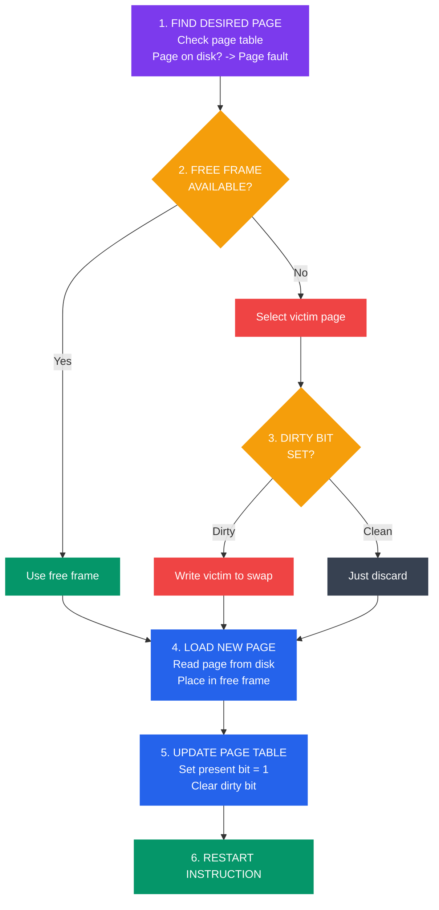
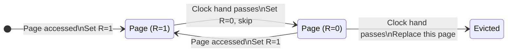

# Page Replacement Algorithms

## What You'll Learn

- Why page replacement is necessary
- Page replacement algorithms: FIFO, Optimal, LRU, LFU, Clock, Second Chance
- Belady's Anomaly
- Frame allocation strategies (equal, proportional, priority)
- Global vs local page replacement
- Thrashing and working set model
- Algorithm comparison and performance metrics
- Implementation techniques and optimizations
- Linux page replacement strategy

## Introduction to Page Replacement

When a **page fault** occurs and physical memory is full, the OS must **replace** an existing page to make room for the new one.

### The Page Replacement Problem

```
Scenario: Page Fault with Full Memory

Physical Memory (3 frames):
┌─────┬─────┬─────┐
│ P1  │ P2  │ P3  │  ← All frames occupied
└─────┴─────┴─────┘

Process requests Page P4 → PAGE FAULT!

Need to:
1. Select victim page (which to remove?)
2. Write victim to disk (if modified)
3. Load new page P4 from disk
4. Update page table

Goal: Minimize page faults
```

### Page Replacement Steps



```
Page Replacement Algorithm Steps:

1. FIND LOCATION OF DESIRED PAGE
   ┌─────────────────────────────┐
   │ Check page table            │
   │ Page on disk? → Page fault  │
   └─────────────────────────────┘
            ↓
2. FIND FREE FRAME
   ┌─────────────────────────────┐
   │ Free frame available?       │
   │ Yes → Use it                │
   │ No → Select victim page     │
   └─────────────────────────────┘
            ↓
3. WRITE VICTIM PAGE TO DISK (if dirty)
   ┌─────────────────────────────┐
   │ Check dirty bit             │
   │ Dirty? → Write to swap      │
   │ Clean? → Just discard       │
   └─────────────────────────────┘
            ↓
4. LOAD NEW PAGE
   ┌─────────────────────────────┐
   │ Read page from disk         │
   │ Place in free frame         │
   └─────────────────────────────┘
            ↓
5. UPDATE PAGE TABLE
   ┌─────────────────────────────┐
   │ Update frame number         │
   │ Set present bit = 1         │
   │ Clear dirty bit             │
   └─────────────────────────────┘
            ↓
6. RESTART INSTRUCTION
```

## Performance Metrics

```
Page Fault Rate = (Number of Page Faults) / (Number of Page References)

Example:
Reference string: 1, 2, 3, 4, 1, 2, 5, 1, 2, 3, 4, 5
Frames: 3
Page Faults: 9

Page Fault Rate = 9/12 = 0.75 = 75%

Hit Rate = 1 - Page Fault Rate = 25%

Goal: Minimize page fault rate
```

## Page Replacement Algorithms

### 1. FIFO (First-In-First-Out)

**Algorithm**: Replace the oldest page in memory.

```
Reference String: 7, 0, 1, 2, 0, 3, 0, 4, 2, 3, 0, 3, 2
Frames: 3

Time:  1  2  3  4  5  6  7  8  9 10 11 12 13
Ref:   7  0  1  2  0  3  0  4  2  3  0  3  2
       ─  ─  ─  ─     ─  ─  ─  ─  ─  ─     ─
Frame1 7  7  7  2  2  2  2  2  2  2  2  2  2
Frame2    0  0  0  0  3  3  3  3  3  0  0  0
Frame3       1  1  1  1  0  4  4  4  4  3  3

Faults: *  *  *  *     *  *  *  *  *  *     *  = 12 faults

Queue order: [7,0,1] → [2,0,1] → [2,3,1] → ...
             (oldest)              (oldest)
```

**FIFO Implementation**:

```c
// fifo_page_replacement.c
#include <stdio.h>
#include <stdbool.h>

#define MAX_FRAMES 10
#define MAX_REFS 100

int frames[MAX_FRAMES];
int frame_count;
int front = 0;  // Points to oldest page

bool is_page_in_memory(int page) {
    for (int i = 0; i < frame_count; i++) {
        if (frames[i] == page) {
            return true;
        }
    }
    return false;
}

int fifo(int pages[], int n, int capacity) {
    int page_faults = 0;
    int count = 0;  // Number of pages in memory
    
    for (int i = 0; i < capacity; i++) {
        frames[i] = -1;
    }
    
    for (int i = 0; i < n; i++) {
        printf("Reference: %d\n", pages[i]);
        
        if (!is_page_in_memory(pages[i])) {
            if (count < capacity) {
                // Free frame available
                frames[count++] = pages[i];
            } else {
                // Replace oldest (FIFO)
                frames[front] = pages[i];
                front = (front + 1) % capacity;
            }
            page_faults++;
            printf("  PAGE FAULT! ");
        } else {
            printf("  Hit! ");
        }
        
        // Display current frames
        printf("Frames: [");
        for (int j = 0; j < capacity; j++) {
            if (frames[j] != -1) {
                printf("%d ", frames[j]);
            }
        }
        printf("]\n");
    }
    
    return page_faults;
}

int main() {
    int pages[] = {7, 0, 1, 2, 0, 3, 0, 4, 2, 3, 0, 3, 2};
    int n = sizeof(pages) / sizeof(pages[0]);
    int capacity = 3;
    
    printf("FIFO Page Replacement\n");
    printf("=====================\n");
    
    int faults = fifo(pages, n, capacity);
    
    printf("\nTotal Page Faults: %d\n", faults);
    printf("Page Fault Rate: %.2f%%\n", (faults * 100.0) / n);
    
    return 0;
}
```

**FIFO Advantages**:
- Simple to implement
- Low overhead
- Fair (oldest replaced)

**FIFO Disadvantages**:
- Poor performance
- **Belady's Anomaly**: More frames can cause MORE page faults
- Doesn't consider page usage pattern

### Belady's Anomaly

```
FIFO with 3 frames:
Reference: 1, 2, 3, 4, 1, 2, 5, 1, 2, 3, 4, 5
Faults: 9

FIFO with 4 frames:
Reference: 1, 2, 3, 4, 1, 2, 5, 1, 2, 3, 4, 5
Faults: 10  ← MORE faults with MORE frames!

This is Belady's Anomaly.
Only occurs with FIFO and some other algorithms.
```

### 2. Optimal Page Replacement

**Algorithm**: Replace page that won't be used for longest time in future.

```
Reference String: 7, 0, 1, 2, 0, 3, 0, 4, 2, 3, 0, 3, 2
Frames: 3

Time:  1  2  3  4  5  6  7  8  9 10 11 12 13
Ref:   7  0  1  2  0  3  0  4  2  3  0  3  2
       ─  ─  ─  ─     ─     ─        ─
Frame1 7  7  7  2  2  2  2  2  2  2  2  2  2
Frame2    0  0  0  0  0  0  4  4  4  0  0  0
Frame3       1  1  1  3  3  3  3  3  3  3  3

Faults: *  *  *  *     *     *        *  = 7 faults

At time 8 (need page 4):
  Current: [2, 0, 3]
  Future refs: 2@9, 3@10, 0@11
  Replace 7? Not in memory
  Replace 0? Used at position 11
  Replace 3? Used at position 10
  Replace 2? Used at position 9
  → Replace page used farthest in future (none in this case)
```

**Optimal Implementation**:

```c
// optimal_page_replacement.c
#include <stdio.h>
#include <stdbool.h>
#include <limits.h>

#define MAX_FRAMES 10

int frames[MAX_FRAMES];

bool is_in_memory(int page, int capacity) {
    for (int i = 0; i < capacity; i++) {
        if (frames[i] == page) {
            return true;
        }
    }
    return false;
}

int predict_future(int pages[], int n, int current_index, int page) {
    // Find when this page will be used next
    for (int i = current_index + 1; i < n; i++) {
        if (pages[i] == page) {
            return i;
        }
    }
    return INT_MAX;  // Never used again
}

int find_victim(int pages[], int n, int current_index, int capacity) {
    int victim = 0;
    int farthest = predict_future(pages, n, current_index, frames[0]);
    
    for (int i = 1; i < capacity; i++) {
        int next_use = predict_future(pages, n, current_index, frames[i]);
        if (next_use > farthest) {
            farthest = next_use;
            victim = i;
        }
    }
    
    return victim;
}

int optimal(int pages[], int n, int capacity) {
    int page_faults = 0;
    int count = 0;
    
    for (int i = 0; i < capacity; i++) {
        frames[i] = -1;
    }
    
    for (int i = 0; i < n; i++) {
        printf("Reference: %d ", pages[i]);
        
        if (!is_in_memory(pages[i], capacity)) {
            if (count < capacity) {
                frames[count++] = pages[i];
            } else {
                int victim = find_victim(pages, n, i, capacity);
                frames[victim] = pages[i];
            }
            page_faults++;
            printf("FAULT ");
        } else {
            printf("HIT   ");
        }
        
        printf("Frames: [");
        for (int j = 0; j < capacity; j++) {
            if (frames[j] != -1) printf("%d ", frames[j]);
        }
        printf("]\n");
    }
    
    return page_faults;
}

int main() {
    int pages[] = {7, 0, 1, 2, 0, 3, 0, 4, 2, 3, 0, 3, 2};
    int n = sizeof(pages) / sizeof(pages[0]);
    int capacity = 3;
    
    printf("Optimal Page Replacement\n");
    printf("========================\n");
    
    int faults = optimal(pages, n, capacity);
    
    printf("\nTotal Page Faults: %d\n", faults);
    printf("This is the theoretical minimum!\n");
    
    return 0;
}
```

**Optimal Properties**:
- ✓ Minimum page faults (theoretical best)
- ✓ No Belady's Anomaly
- ✗ Impossible to implement (requires future knowledge)
- Used as benchmark to compare other algorithms

### 3. LRU (Least Recently Used)

**Algorithm**: Replace page that hasn't been used for longest time.

```
Reference String: 7, 0, 1, 2, 0, 3, 0, 4, 2, 3, 0, 3, 2
Frames: 3

Time:  1  2  3  4  5  6  7  8  9 10 11 12 13
Ref:   7  0  1  2  0  3  0  4  2  3  0  3  2
       ─  ─  ─  ─     ─     ─  ─     ─
Frame1 7  7  7  2  2  2  2  4  4  4  0  0  0
Frame2    0  0  0  0  0  0  0  2  2  2  2  2
Frame3       1  1  1  3  3  3  3  3  3  3  3

Faults: *  *  *  *     *     *  *     *  = 9 faults

LRU Stack at each step:
Time 1: [7]
Time 2: [0, 7]
Time 3: [1, 0, 7]
Time 4: [2, 1, 0] (7 removed - LRU)
Time 5: [0, 2, 1] (0 moved to top)
...
```

**LRU Implementation (Using Counter)**:

```c
// lru_page_replacement.c
#include <stdio.h>
#include <stdbool.h>

#define MAX_FRAMES 10

typedef struct {
    int page;
    int timestamp;
} Frame;

Frame frames[MAX_FRAMES];
int current_time = 0;

bool is_in_memory(int page, int capacity, int *index) {
    for (int i = 0; i < capacity; i++) {
        if (frames[i].page == page) {
            *index = i;
            return true;
        }
    }
    return false;
}

int find_lru(int capacity) {
    int min_time = frames[0].timestamp;
    int lru_index = 0;
    
    for (int i = 1; i < capacity; i++) {
        if (frames[i].timestamp < min_time) {
            min_time = frames[i].timestamp;
            lru_index = i;
        }
    }
    
    return lru_index;
}

int lru(int pages[], int n, int capacity) {
    int page_faults = 0;
    int count = 0;
    
    for (int i = 0; i < capacity; i++) {
        frames[i].page = -1;
        frames[i].timestamp = 0;
    }
    
    for (int i = 0; i < n; i++) {
        current_time++;
        printf("Reference: %d ", pages[i]);
        
        int index;
        if (is_in_memory(pages[i], capacity, &index)) {
            // Hit - update timestamp
            frames[index].timestamp = current_time;
            printf("HIT   ");
        } else {
            // Miss
            if (count < capacity) {
                // Free frame available
                frames[count].page = pages[i];
                frames[count].timestamp = current_time;
                count++;
            } else {
                // Replace LRU
                int lru_index = find_lru(capacity);
                frames[lru_index].page = pages[i];
                frames[lru_index].timestamp = current_time;
            }
            page_faults++;
            printf("FAULT ");
        }
        
        printf("Frames: [");
        for (int j = 0; j < capacity; j++) {
            if (frames[j].page != -1) {
                printf("%d(%d) ", frames[j].page, frames[j].timestamp);
            }
        }
        printf("]\n");
    }
    
    return page_faults;
}

int main() {
    int pages[] = {7, 0, 1, 2, 0, 3, 0, 4, 2, 3, 0, 3, 2};
    int n = sizeof(pages) / sizeof(pages[0]);
    int capacity = 3;
    
    printf("LRU Page Replacement\n");
    printf("====================\n");
    
    int faults = lru(pages, n, capacity);
    
    printf("\nTotal Page Faults: %d\n", faults);
    
    return 0;
}
```

**LRU Advantages**:
- Good approximation of Optimal
- No Belady's Anomaly
- Exploits temporal locality

**LRU Disadvantages**:
- Expensive to implement exactly
- Requires hardware support or significant overhead
- Updating on every memory access is costly

### LRU Approximations

#### Clock Algorithm (Second Chance)



```
Clock Algorithm:
- Circular list of pages
- Use reference bit (set by hardware on access)
- Hand (pointer) sweeps through pages

┌──────┐
│  R=1 │ ←─── If R=1: Set R=0, move to next
└──────┘      If R=0: Replace this page
┌──────┐
│  R=0 │ ←─── Hand (victim pointer)
└──────┘
┌──────┐
│  R=1 │
└──────┘
```

```c
// clock_algorithm.c
#include <stdio.h>
#include <stdbool.h>

#define MAX_FRAMES 10

typedef struct {
    int page;
    bool reference_bit;
} ClockFrame;

ClockFrame frames[MAX_FRAMES];
int hand = 0;  // Clock hand position

bool is_in_memory(int page, int capacity) {
    for (int i = 0; i < capacity; i++) {
        if (frames[i].page == page) {
            frames[i].reference_bit = true;  // Set reference bit
            return true;
        }
    }
    return false;
}

int find_victim(int capacity) {
    while (true) {
        if (!frames[hand].reference_bit) {
            // Found victim
            int victim = hand;
            hand = (hand + 1) % capacity;
            return victim;
        }
        // Give second chance
        frames[hand].reference_bit = false;
        hand = (hand + 1) % capacity;
    }
}

int clock_algorithm(int pages[], int n, int capacity) {
    int page_faults = 0;
    int count = 0;
    
    for (int i = 0; i < capacity; i++) {
        frames[i].page = -1;
        frames[i].reference_bit = false;
    }
    
    for (int i = 0; i < n; i++) {
        printf("Reference: %d ", pages[i]);
        
        if (!is_in_memory(pages[i], capacity)) {
            if (count < capacity) {
                frames[count].page = pages[i];
                frames[count].reference_bit = false;
                count++;
            } else {
                int victim = find_victim(capacity);
                frames[victim].page = pages[i];
                frames[victim].reference_bit = false;
            }
            page_faults++;
            printf("FAULT ");
        } else {
            printf("HIT   ");
        }
        
        printf("Frames: [");
        for (int j = 0; j < capacity; j++) {
            if (frames[j].page != -1) {
                printf("%d(%d) ", frames[j].page, frames[j].reference_bit);
            }
        }
        printf("] Hand=%d\n", hand);
    }
    
    return page_faults;
}

int main() {
    int pages[] = {7, 0, 1, 2, 0, 3, 0, 4, 2, 3, 0, 3, 2};
    int n = sizeof(pages) / sizeof(pages[0]);
    int capacity = 3;
    
    printf("Clock (Second Chance) Algorithm\n");
    printf("================================\n");
    
    int faults = clock_algorithm(pages, n, capacity);
    
    printf("\nTotal Page Faults: %d\n", faults);
    
    return 0;
}
```

### 4. LFU (Least Frequently Used)

**Algorithm**: Replace page with smallest access count.

```c
// lfu_page_replacement.c (simplified)
#include <stdio.h>
#include <stdbool.h>

typedef struct {
    int page;
    int frequency;
} LFUFrame;

LFUFrame frames[10];

int find_lfu(int capacity) {
    int min_freq = frames[0].frequency;
    int lfu_index = 0;
    
    for (int i = 1; i < capacity; i++) {
        if (frames[i].frequency < min_freq) {
            min_freq = frames[i].frequency;
            lfu_index = i;
        }
    }
    
    return lfu_index;
}

// Similar implementation to LRU but tracking frequency instead of time
```

**LFU Issues**:
- Recently loaded pages disadvantaged (low count)
- Old pages with high count may stay forever
- Solution: Age counts (decay over time)

## Algorithm Comparison

```
Performance Comparison (typical):

Reference String: 1,2,3,4,1,2,5,1,2,3,4,5 (12 refs, 4 frames)

Algorithm    | Page Faults | Fault Rate | Notes
─────────────┼─────────────┼────────────┼──────────────────
FIFO         |     10      |   83.3%    | Simple, Belady's anomaly
Optimal      |      6      |   50.0%    | Best possible, impractical
LRU          |      8      |   66.7%    | Good, expensive
Clock        |      9      |   75.0%    | Good approximation of LRU
LFU          |      9      |   75.0%    | Can have stale pages
```

### When to Use Each

| Algorithm | Use When | Implementation |
|-----------|----------|----------------|
| **FIFO** | Simple systems, low overhead critical | Queue |
| **Optimal** | Benchmarking only | N/A (needs future) |
| **LRU** | Performance critical, hardware support | Stack/Counter |
| **Clock** | General purpose, balanced performance | Circular buffer + bit |
| **LFU** | Long-running processes, stable access patterns | Counter per page |

## Frame Allocation

How many frames to allocate to each process?

### Allocation Strategies

```
1. EQUAL ALLOCATION
   All processes get same number of frames
   
   n processes, m frames
   Each process: m/n frames
   
   Example: 100 frames, 5 processes
   Each gets 20 frames

2. PROPORTIONAL ALLOCATION
   Allocate based on process size
   
   Process size: s_i
   Total size: S = Σ s_i
   Frames for process i: (s_i / S) × m
   
   Example:
   P1: 10 KB → 10 frames
   P2: 127 KB → 127 frames

3. PRIORITY ALLOCATION
   Higher priority → more frames
   
   Based on process importance or payment
```

### Global vs Local Replacement

```
LOCAL REPLACEMENT:
  Process can only replace its own pages
  ┌─────────────┐
  │  Process A  │ ← Can only replace A's pages
  │  Frames     │
  └─────────────┘
  
  + Fair allocation maintained
  - May thrash even if system has free frames

GLOBAL REPLACEMENT:
  Process can replace any process's page
  ┌─────────────┐
  │  All Pages  │ ← Any can be replaced
  │  (Mixed)    │
  └─────────────┘
  
  + Better overall utilization
  - Process performance unpredictable
  - Popular in modern systems
```

## Thrashing

**Thrashing**: System spends more time paging than executing.

```
Thrashing Scenario:

CPU Utilization
  │
  │     ╱│
  │    ╱ │
  │   ╱  │ ← Optimal
  │  ╱   │
  │ ╱    │╲
  │╱     │ ╲
  │      │  ╲___  ← Thrashing!
  └──────────────── Degree of Multiprogramming
  
When too many processes, each gets too few frames
→ Constant page faults → Disk I/O → Low CPU usage
```

### Working Set Model

```
Working Set: Set of pages process actively uses

Working Set Window (Δ):
  Look at last Δ page references
  Pages referenced in this window = working set

Example (Δ = 10):
  References: ...5,2,7,3,5,2,5,7,3,5,2...
              └─────────┬─────────┘
                Working set = {2,3,5,7}

If Σ (working sets) > available frames → Thrashing!

Solution: Suspend processes until enough frames
```

## Linux Page Replacement

Linux uses a modified Clock algorithm with two lists:

```
Linux Page Replacement Strategy:

1. ACTIVE LIST
   Recently and frequently accessed pages
   
2. INACTIVE LIST
   Candidates for eviction

Algorithm:
├─ Page accessed → Move to active list
├─ Active list full → Move LRU to inactive
├─ Page on inactive accessed → Move back to active
└─ Need frame → Evict from inactive list

Two-handed clock:
  Hand 1: Clears reference bits (active → inactive)
  Hand 2: Evicts pages (inactive → disk)
```

```bash
# Monitor page replacement on Linux
vmstat 1

# Output:
#  si    so    (swap in/out - paging activity)
#  1000  2000  ← High values indicate thrashing

# Check per-process page faults
ps -eo pid,min_flt,maj_flt,cmd

# min_flt: Minor faults (page in memory but not in TLB)
# maj_flt: Major faults (page on disk - expensive!)
```

## Exercises

### Beginner

1. Calculate page faults for FIFO with frames=3:
   Reference: 1,2,3,4,1,2,5,1,2,3,4,5

2. Explain why Optimal algorithm is impractical to implement.

3. What is the difference between LRU and LFU?

### Intermediate

4. Implement LRU using a stack (doubly-linked list) where most recent is at top.

5. Compare FIFO, LRU, and Optimal for the reference string:
   7,0,1,2,0,3,0,4,2,3,0,3,2,1,2,0,1,7,0,1
   With 3 frames. Which performs best?

6. Explain how the Clock algorithm approximates LRU. Why is it more practical?

### Advanced

7. Implement a working set algorithm that tracks the working set size for a process.

8. Write a simulator that demonstrates thrashing: gradually increase the number of processes and plot CPU utilization vs. degree of multiprogramming.

9. Research and explain Linux's page cache and how it affects page replacement decisions.

## Key Takeaways

- Page replacement selects victim page when memory is full
- **FIFO**: Simple but suffers from Belady's Anomaly
- **Optimal**: Minimum faults but impractical (needs future knowledge)
- **LRU**: Excellent performance, expensive to implement exactly
- **Clock/Second Chance**: Practical LRU approximation
- **LFU**: Good for stable access patterns, can have stale pages
- Frame allocation: equal, proportional, or priority-based
- Global replacement more efficient than local
- **Thrashing**: Too little memory per process causes constant paging
- Working set model predicts memory needs
- Linux uses modified Clock with active/inactive lists

## Next Steps

Continue to [Memory Allocation Strategies](./06_memory_allocation.md) to learn about dynamic memory allocation algorithms.

---

[← Previous: Virtual Memory](./04_virtual_memory.md) | [Next: Memory Allocation →](./06_memory_allocation.md)
