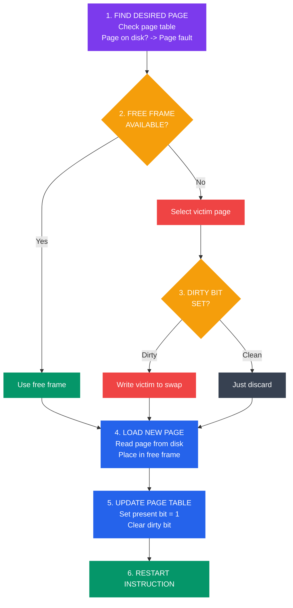
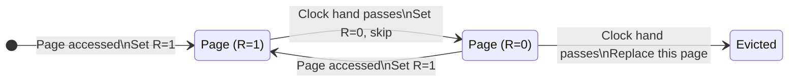

# Page Replacement Algorithms

## What You'll Learn

- Page replacement kyun zaruri hai
- Page replacement algorithms: FIFO, Optimal, LRU, LFU, Clock, Second Chance
- Belady's Anomaly
- Frame allocation strategies (equal, proportional, priority)
- Global vs local page replacement
- Thrashing aur working set model
- Algorithm comparison aur performance metrics
- Implementation techniques aur optimizations
- Linux page replacement strategy

## Introduction to Page Replacement

Socho tum Swiggy ke ek delivery hub mein baithe ho jahan sirf **3 parking slots** hain bikes ke liye. Saare slots full hain, aur ek naya delivery boy apni bike lagane aaya hai. Ab kya hoga? Kisi ek purani bike ko hatana padega taaki nayi bike aa sake. Yehi exact problem hai OS ke andar jab **page fault** hota hai aur physical memory (RAM) already full hoti hai — OS ko decide karna padta hai ki kaunsa page "nikala" jaaye taaki naya page andar aa sake. Isko hi **page replacement** kehte hain.

### The Page Replacement Problem

**Kya hota hai?** Jab process ko koi page chahiye hota hai jo RAM mein nahi hai (page fault), aur RAM mein already koi free frame nahi bacha, toh OS ko ek "victim" page choose karna padta hai — usko RAM se nikaal ke disk pe bhejna padta hai (agar modify hua ho), phir uski jagah pe naya page load karna padta hai.

```
Scenario: Page Fault with Full Memory

Physical Memory (3 frames):
┌─────┬─────┬─────┐
│ P1  │ P2  │ P3  │  ← All frames occupied
└─────┴─────┴─────┘

Process requests Page P4 → PAGE FAULT!

Need to:
1. Select victim page (which to remove?)
2. Write victim to disk (if modified)
3. Load new page P4 from disk
4. Update page table

Goal: Minimize page faults
```

Ye bilkul waise hi hai jaise CRED app pe agar tumhare phone ka storage full hai aur naya update install karna hai — phone khud decide karega kaunsi purani unused file/cache delete karni hai. Fark sirf itna hai ki OS ye decision **algorithm** se leta hai, random se nahi — kyunki galat choice karne pe baar baar wahi page fault aayega (jise hum "thrashing" bolte hain, neeche discuss karenge).

### Page Replacement Steps

**Kyun zaruri hai step by step samajhna?** Kyunki interview mein ya real debugging mein tumse pucha ja sakta hai — "page fault hone pe exactly kya sequence of events hota hai?" Ye pura flow hardware aur OS dono involve karta hai.



```
Page Replacement Algorithm Steps:

1. FIND LOCATION OF DESIRED PAGE
   ┌─────────────────────────────┐
   │ Check page table            │
   │ Page on disk? → Page fault  │
   └─────────────────────────────┘
            ↓
2. FIND FREE FRAME
   ┌─────────────────────────────┐
   │ Free frame available?       │
   │ Yes → Use it                │
   │ No → Select victim page     │
   └─────────────────────────────┘
            ↓
3. WRITE VICTIM PAGE TO DISK (if dirty)
   ┌─────────────────────────────┐
   │ Check dirty bit             │
   │ Dirty? → Write to swap      │
   │ Clean? → Just discard       │
   └─────────────────────────────┘
            ↓
4. LOAD NEW PAGE
   ┌─────────────────────────────┐
   │ Read page from disk         │
   │ Place in free frame         │
   └─────────────────────────────┘
            ↓
5. UPDATE PAGE TABLE
   ┌─────────────────────────────┐
   │ Update frame number         │
   │ Set present bit = 1         │
   │ Clear dirty bit             │
   └─────────────────────────────┘
            ↓
6. RESTART INSTRUCTION
```

> [!info]
> **Dirty bit** ka matlab hai us page ko load hone ke baad modify kiya gaya hai. Agar dirty hai toh disk pe wapas likhna padega (write-back), warna sirf discard kar sakte ho kyunki original copy already disk pe safe hai. Ye Zomato ke draft order jaisa hai — agar tumne cart edit kiya (dirty) toh save karna padega, warna bas cart clear kar do.

## Performance Metrics

**Kaise measure karein ki algorithm accha hai ya bura?** Simple — **Page Fault Rate** dekho. Jitna kam fault, utna accha algorithm.

```
Page Fault Rate = (Number of Page Faults) / (Number of Page References)

Example:
Reference string: 1, 2, 3, 4, 1, 2, 5, 1, 2, 3, 4, 5
Frames: 3
Page Faults: 9

Page Fault Rate = 9/12 = 0.75 = 75%

Hit Rate = 1 - Page Fault Rate = 25%

Goal: Minimize page fault rate
```

Isko IRCTC ke tatkal booking se compare karo — agar 100 requests mein se 75 baar server ko fresh data fetch karna pada (cache miss) aur sirf 25 baar cache se serve ho gaya, toh tumhara "fault rate" 75% hai — bahut bura! Ideal system mein hit rate jyada honi chahiye.

## Page Replacement Algorithms

Ab asli mudda — jab victim page choose karna ho, kis algorithm se choose karein? Har algorithm ka apna trade-off hai — simplicity vs accuracy vs cost.

### 1. FIFO (First-In-First-Out)

**Algorithm**: Sabse purani page ko replace karo — jo sabse pehle memory mein aayi thi, wahi sabse pehle nikaalo.

**Kya hota hai?** Ye bilkul ek railway platform ki queue jaisa hai — jo sabse pehle line mein khada hua, use hi pehle train mein chadhne ka wait khatam hota hai (yahan ulta — jo pehle aaya, wahi pehle nikaala jaata hai memory se). Iska matlab FIFO ye bilkul nahi dekhta ki page **kitni baar use ho rahi hai** ya **abhi zaruri hai ya nahi** — bas arrival order dekhta hai. Isliye ye kaafi "dumb" approach hai lekin implement karna sabse aasan hai.

```
Reference String: 7, 0, 1, 2, 0, 3, 0, 4, 2, 3, 0, 3, 2
Frames: 3

Time:  1  2  3  4  5  6  7  8  9 10 11 12 13
Ref:   7  0  1  2  0  3  0  4  2  3  0  3  2
       ─  ─  ─  ─     ─  ─  ─  ─  ─  ─     ─
Frame1 7  7  7  2  2  2  2  2  2  2  2  2  2
Frame2    0  0  0  0  3  3  3  3  3  0  0  0
Frame3       1  1  1  1  0  4  4  4  4  3  3

Faults: *  *  *  *     *  *  *  *  *  *     *  = 12 faults

Queue order: [7,0,1] → [2,0,1] → [2,3,1] → ...
             (oldest)              (oldest)
```

**FIFO Implementation**:

```c
// fifo_page_replacement.c
#include <stdio.h>
#include <stdbool.h>

#define MAX_FRAMES 10
#define MAX_REFS 100

int frames[MAX_FRAMES];
int frame_count;
int front = 0;  // Points to oldest page

bool is_page_in_memory(int page) {
    for (int i = 0; i < frame_count; i++) {
        if (frames[i] == page) {
            return true;
        }
    }
    return false;
}

int fifo(int pages[], int n, int capacity) {
    int page_faults = 0;
    int count = 0;  // Number of pages in memory
    
    for (int i = 0; i < capacity; i++) {
        frames[i] = -1;
    }
    
    for (int i = 0; i < n; i++) {
        printf("Reference: %d\n", pages[i]);
        
        if (!is_page_in_memory(pages[i])) {
            if (count < capacity) {
                // Free frame available
                frames[count++] = pages[i];
            } else {
                // Replace oldest (FIFO)
                frames[front] = pages[i];
                front = (front + 1) % capacity;
            }
            page_faults++;
            printf("  PAGE FAULT! ");
        } else {
            printf("  Hit! ");
        }
        
        // Display current frames
        printf("Frames: [");
        for (int j = 0; j < capacity; j++) {
            if (frames[j] != -1) {
                printf("%d ", frames[j]);
            }
        }
        printf("]\n");
    }
    
    return page_faults;
}

int main() {
    int pages[] = {7, 0, 1, 2, 0, 3, 0, 4, 2, 3, 0, 3, 2};
    int n = sizeof(pages) / sizeof(pages[0]);
    int capacity = 3;
    
    printf("FIFO Page Replacement\n");
    printf("=====================\n");
    
    int faults = fifo(pages, n, capacity);
    
    printf("\nTotal Page Faults: %d\n", faults);
    printf("Page Fault Rate: %.2f%%\n", (faults * 100.0) / n);
    
    return 0;
}
```

**FIFO Advantages**:
- Implement karna bahut simple hai — bas ek queue chahiye
- Low overhead — koi complex tracking nahi
- "Fair" hai in the sense ki jo sabse purani hai wahi jaati hai

**FIFO Disadvantages**:
- Performance overall kaafi kharab hoti hai
- **Belady's Anomaly**: Zyada frames dene pe bhi ULTA zyada page faults aa sakte hain (neeche dekho)
- Page kitni frequently use ho rahi hai, iska koi idea nahi rakhta

### Belady's Anomaly

**Kya hota hai ye weird cheez?** Normally tum sochoge — "zyada RAM/frames doge toh page faults kam honge na?" Lekin FIFO ke saath aisa **hamesha** nahi hota — kabhi kabhi zyada frames dene pe bhi faults **badh** jaate hain! Ye counter-intuitive behavior hi Belady's Anomaly kehlata hai, aur ye isliye important hai kyunki isse pata chalta hai FIFO fundamentally "broken" logic follow karta hai — sirf arrival time dekhna kaafi nahi hai.

```
FIFO with 3 frames:
Reference: 1, 2, 3, 4, 1, 2, 5, 1, 2, 3, 4, 5
Faults: 9

FIFO with 4 frames:
Reference: 1, 2, 3, 4, 1, 2, 5, 1, 2, 3, 4, 5
Faults: 10  ← MORE faults with MORE frames!

This is Belady's Anomaly.
Only occurs with FIFO and some other algorithms.
```

> [!warning]
> Ye sirf FIFO jaisa algorithm hai jismein aisa hota hai. LRU aur Optimal jaise **stack-based algorithms** mein Belady's Anomaly kabhi nahi hota — matlab agar unko zyada frames doge, faults kabhi badhenge nahi, ya toh same rahenge ya kam honge. Interview mein ye ek classic gotcha question hai.

### 2. Optimal Page Replacement

**Algorithm**: Us page ko replace karo jo **future mein sabse der baad** use hogi (ya kabhi nahi hogi).

**Kya hota hai?** Socho tumhe pata hai future dekh sakte ho (jaise koi crystal ball ho) — toh tum wahi page nikaaloge jiski zaroorat sabse door future mein padegi, kyunki wo abhi ke liye "sabse kam useful" hai. Ye theoretically best possible algorithm hai — kisi bhi algorithm se kam ya barabar faults hi denga, kabhi zyada nahi. Problem ye hai ki **future dekhna practically possible nahi hai** — OS ko nahi pata process aage kya reference karega. Isliye Optimal sirf ek **benchmark** ke roop mein use hota hai, taaki hum baaki algorithms ko compare kar sakein "ideal se kitna door hain".

```
Reference String: 7, 0, 1, 2, 0, 3, 0, 4, 2, 3, 0, 3, 2
Frames: 3

Time:  1  2  3  4  5  6  7  8  9 10 11 12 13
Ref:   7  0  1  2  0  3  0  4  2  3  0  3  2
       ─  ─  ─  ─     ─     ─        ─
Frame1 7  7  7  2  2  2  2  2  2  2  2  2  2
Frame2    0  0  0  0  0  0  4  4  4  0  0  0
Frame3       1  1  1  3  3  3  3  3  3  3  3

Faults: *  *  *  *     *     *        *  = 7 faults

At time 8 (need page 4):
  Current: [2, 0, 3]
  Future refs: 2@9, 3@10, 0@11
  Replace 7? Not in memory
  Replace 0? Used at position 11
  Replace 3? Used at position 10
  Replace 2? Used at position 9
  → Replace page used farthest in future (none in this case)
```

**Optimal Implementation**:

```c
// optimal_page_replacement.c
#include <stdio.h>
#include <stdbool.h>
#include <limits.h>

#define MAX_FRAMES 10

int frames[MAX_FRAMES];

bool is_in_memory(int page, int capacity) {
    for (int i = 0; i < capacity; i++) {
        if (frames[i] == page) {
            return true;
        }
    }
    return false;
}

int predict_future(int pages[], int n, int current_index, int page) {
    // Find when this page will be used next
    for (int i = current_index + 1; i < n; i++) {
        if (pages[i] == page) {
            return i;
        }
    }
    return INT_MAX;  // Never used again
}

int find_victim(int pages[], int n, int current_index, int capacity) {
    int victim = 0;
    int farthest = predict_future(pages, n, current_index, frames[0]);
    
    for (int i = 1; i < capacity; i++) {
        int next_use = predict_future(pages, n, current_index, frames[i]);
        if (next_use > farthest) {
            farthest = next_use;
            victim = i;
        }
    }
    
    return victim;
}

int optimal(int pages[], int n, int capacity) {
    int page_faults = 0;
    int count = 0;
    
    for (int i = 0; i < capacity; i++) {
        frames[i] = -1;
    }
    
    for (int i = 0; i < n; i++) {
        printf("Reference: %d ", pages[i]);
        
        if (!is_in_memory(pages[i], capacity)) {
            if (count < capacity) {
                frames[count++] = pages[i];
            } else {
                int victim = find_victim(pages, n, i, capacity);
                frames[victim] = pages[i];
            }
            page_faults++;
            printf("FAULT ");
        } else {
            printf("HIT   ");
        }
        
        printf("Frames: [");
        for (int j = 0; j < capacity; j++) {
            if (frames[j] != -1) printf("%d ", frames[j]);
        }
        printf("]\n");
    }
    
    return page_faults;
}

int main() {
    int pages[] = {7, 0, 1, 2, 0, 3, 0, 4, 2, 3, 0, 3, 2};
    int n = sizeof(pages) / sizeof(pages[0]);
    int capacity = 3;
    
    printf("Optimal Page Replacement\n");
    printf("========================\n");
    
    int faults = optimal(pages, n, capacity);
    
    printf("\nTotal Page Faults: %d\n", faults);
    printf("This is the theoretical minimum!\n");
    
    return 0;
}
```

**Optimal Properties**:
- Minimum page faults deta hai (theoretical best)
- Belady's Anomaly kabhi nahi hota
- Real system mein implement karna **impossible** hai (future ka pata chahiye)
- Sirf benchmark ke roop mein use hota hai baaki algorithms compare karne ke liye

### 3. LRU (Least Recently Used)

**Algorithm**: Jo page sabse lambe time se use nahi hui, use replace karo.

**Kya hota hai?** Optimal ki tarah future dekhna toh possible nahi, lekin LRU ek smart assumption karta hai — **temporal locality**: jo page abhi tak use nahi hui, wo aage bhi jaldi use hone ki possibility kam hai. Socho tumhare phone mein 20 apps khule hain background mein — Android/iOS bhi yahi karte hain, jo app sabse lambe time se touch nahi hui, use pehle background se kill karte hain memory free karne ke liye. Yahi LRU ka core idea hai.

```
Reference String: 7, 0, 1, 2, 0, 3, 0, 4, 2, 3, 0, 3, 2
Frames: 3

Time:  1  2  3  4  5  6  7  8  9 10 11 12 13
Ref:   7  0  1  2  0  3  0  4  2  3  0  3  2
       ─  ─  ─  ─     ─     ─  ─     ─
Frame1 7  7  7  2  2  2  2  4  4  4  0  0  0
Frame2    0  0  0  0  0  0  0  2  2  2  2  2
Frame3       1  1  1  3  3  3  3  3  3  3  3

Faults: *  *  *  *     *     *  *     *  = 9 faults

LRU Stack at each step:
Time 1: [7]
Time 2: [0, 7]
Time 3: [1, 0, 7]
Time 4: [2, 1, 0] (7 removed - LRU)
Time 5: [0, 2, 1] (0 moved to top)
...
```

**LRU Implementation (Using Counter)**:

```c
// lru_page_replacement.c
#include <stdio.h>
#include <stdbool.h>

#define MAX_FRAMES 10

typedef struct {
    int page;
    int timestamp;
} Frame;

Frame frames[MAX_FRAMES];
int current_time = 0;

bool is_in_memory(int page, int capacity, int *index) {
    for (int i = 0; i < capacity; i++) {
        if (frames[i].page == page) {
            *index = i;
            return true;
        }
    }
    return false;
}

int find_lru(int capacity) {
    int min_time = frames[0].timestamp;
    int lru_index = 0;
    
    for (int i = 1; i < capacity; i++) {
        if (frames[i].timestamp < min_time) {
            min_time = frames[i].timestamp;
            lru_index = i;
        }
    }
    
    return lru_index;
}

int lru(int pages[], int n, int capacity) {
    int page_faults = 0;
    int count = 0;
    
    for (int i = 0; i < capacity; i++) {
        frames[i].page = -1;
        frames[i].timestamp = 0;
    }
    
    for (int i = 0; i < n; i++) {
        current_time++;
        printf("Reference: %d ", pages[i]);
        
        int index;
        if (is_in_memory(pages[i], capacity, &index)) {
            // Hit - update timestamp
            frames[index].timestamp = current_time;
            printf("HIT   ");
        } else {
            // Miss
            if (count < capacity) {
                // Free frame available
                frames[count].page = pages[i];
                frames[count].timestamp = current_time;
                count++;
            } else {
                // Replace LRU
                int lru_index = find_lru(capacity);
                frames[lru_index].page = pages[i];
                frames[lru_index].timestamp = current_time;
            }
            page_faults++;
            printf("FAULT ");
        }
        
        printf("Frames: [");
        for (int j = 0; j < capacity; j++) {
            if (frames[j].page != -1) {
                printf("%d(%d) ", frames[j].page, frames[j].timestamp);
            }
        }
        printf("]\n");
    }
    
    return page_faults;
}

int main() {
    int pages[] = {7, 0, 1, 2, 0, 3, 0, 4, 2, 3, 0, 3, 2};
    int n = sizeof(pages) / sizeof(pages[0]);
    int capacity = 3;
    
    printf("LRU Page Replacement\n");
    printf("====================\n");
    
    int faults = lru(pages, n, capacity);
    
    printf("\nTotal Page Faults: %d\n", faults);
    
    return 0;
}
```

**LRU Advantages**:
- Optimal ka bahut accha approximation deta hai
- Belady's Anomaly nahi hota
- Temporal locality ka fayda uthata hai (jo abhi use hua, wo phir use hoga)

**LRU Disadvantages**:
- Exactly implement karna mehenga hai
- Hardware support chahiye, warna bahut overhead
- Har memory access pe timestamp update karna costly hai — CPU ke liye bhi burden hai

> [!tip]
> Yehi wajah hai real systems (Linux, Windows) **exact LRU** kabhi use nahi karte — instead uska approximation use karte hain jaise Clock Algorithm, jo neeche discuss kar rahe hain. Perfect LRU sunne mein accha lagta hai lekin practically bahut expensive hai.

### LRU Approximations

#### Clock Algorithm (Second Chance)

**Kya hota hai?** Ye ek smart shortcut hai jo LRU jaisa result deta hai bina har access ka timestamp track kiye. Idea simple hai — har page ke saath ek single bit hota hai jise **reference bit (R)** kehte hain. Jab page access hoti hai, hardware automatically R=1 kar deta hai. Ek "clock hand" (pointer) circular tarike se sabhi pages ke through ghoomta rehta hai jab victim dhundhna ho:
- Agar R=1 hai → iska matlab page recently use hui hai, toh isko "second chance" do — R ko 0 kar do aur agle page pe move ho jao
- Agar R=0 hai → ye page kaafi time se use nahi hui, isko replace kar do

Isko socho jaise ek ticket checker train mein ghoom raha hai (clock hand) — agar tumhara ticket "valid" (R=1) hai toh wo tumhe chhod deta hai lekin tumhara stamp clear kar deta hai (agli baar phir check karega), aur agar "invalid" (R=0) mila toh turant utaar deta hai train se (evict).



```
Clock Algorithm:
- Circular list of pages
- Use reference bit (set by hardware on access)
- Hand (pointer) sweeps through pages

┌──────┐
│  R=1 │ ←─── If R=1: Set R=0, move to next
└──────┘      If R=0: Replace this page
┌──────┐
│  R=0 │ ←─── Hand (victim pointer)
└──────┘
┌──────┐
│  R=1 │
└──────┘
```

```c
// clock_algorithm.c
#include <stdio.h>
#include <stdbool.h>

#define MAX_FRAMES 10

typedef struct {
    int page;
    bool reference_bit;
} ClockFrame;

ClockFrame frames[MAX_FRAMES];
int hand = 0;  // Clock hand position

bool is_in_memory(int page, int capacity) {
    for (int i = 0; i < capacity; i++) {
        if (frames[i].page == page) {
            frames[i].reference_bit = true;  // Set reference bit
            return true;
        }
    }
    return false;
}

int find_victim(int capacity) {
    while (true) {
        if (!frames[hand].reference_bit) {
            // Found victim
            int victim = hand;
            hand = (hand + 1) % capacity;
            return victim;
        }
        // Give second chance
        frames[hand].reference_bit = false;
        hand = (hand + 1) % capacity;
    }
}

int clock_algorithm(int pages[], int n, int capacity) {
    int page_faults = 0;
    int count = 0;
    
    for (int i = 0; i < capacity; i++) {
        frames[i].page = -1;
        frames[i].reference_bit = false;
    }
    
    for (int i = 0; i < n; i++) {
        printf("Reference: %d ", pages[i]);
        
        if (!is_in_memory(pages[i], capacity)) {
            if (count < capacity) {
                frames[count].page = pages[i];
                frames[count].reference_bit = false;
                count++;
            } else {
                int victim = find_victim(capacity);
                frames[victim].page = pages[i];
                frames[victim].reference_bit = false;
            }
            page_faults++;
            printf("FAULT ");
        } else {
            printf("HIT   ");
        }
        
        printf("Frames: [");
        for (int j = 0; j < capacity; j++) {
            if (frames[j].page != -1) {
                printf("%d(%d) ", frames[j].page, frames[j].reference_bit);
            }
        }
        printf("] Hand=%d\n", hand);
    }
    
    return page_faults;
}

int main() {
    int pages[] = {7, 0, 1, 2, 0, 3, 0, 4, 2, 3, 0, 3, 2};
    int n = sizeof(pages) / sizeof(pages[0]);
    int capacity = 3;
    
    printf("Clock (Second Chance) Algorithm\n");
    printf("================================\n");
    
    int faults = clock_algorithm(pages, n, capacity);
    
    printf("\nTotal Page Faults: %d\n", faults);
    
    return 0;
}
```

### 4. LFU (Least Frequently Used)

**Algorithm**: Jis page ka access count sabse kam hai, use replace karo.

**Kya hota hai?** Recency ke bajaye ye **frequency** dekhta hai — jitni kam baar page use hui hai, utni jaldi uski chhutti. Socho BigBasket ka inventory management — jo product sabse kam baar order hua hai warehouse se, use hi remove karke naye product ke liye jagah banayenge, chahe wo product kal hi warehouse mein aaya ho ya saal bhar se pada ho.

```c
// lfu_page_replacement.c (simplified)
#include <stdio.h>
#include <stdbool.h>

typedef struct {
    int page;
    int frequency;
} LFUFrame;

LFUFrame frames[10];

int find_lfu(int capacity) {
    int min_freq = frames[0].frequency;
    int lfu_index = 0;
    
    for (int i = 1; i < capacity; i++) {
        if (frames[i].frequency < min_freq) {
            min_freq = frames[i].frequency;
            lfu_index = i;
        }
    }
    
    return lfu_index;
}

// Similar implementation to LRU but tracking frequency instead of time
```

**LFU Issues**:
- Jo page abhi-abhi load hui hai, uska count naturally kam hoga — isliye use "unfairly" jaldi nikaal diya jaata hai (nayi joining wale employee ko pehle nikalna jaisa unfair lagta hai)
- Purani pages jinka count kabhi high tha but ab use nahi ho rahi, unka high count hone ki wajah se wo forever memory mein padi reh sakti hain (ye bhi ek tarah ka "stale data" problem hai)
- **Solution**: Aging — time ke saath count ko decay (kam) karte raho, taaki purana high count hamesha relevant na rahe

> [!warning]
> LFU ka ye "stale page" problem interview mein poocha jaata hai — agar koi page bahut popular thi ek waqt pe (jaise ek viral IRCTC tatkal slot) lekin ab kabhi access nahi hoti, LFU use nikaalne mein slow hoga kyunki uska frequency count high reh gaya hai.

## Algorithm Comparison

**Sab algorithms ko ek saath dekhein toh kya pattern nazar aata hai?**

```
Performance Comparison (typical):

Reference String: 1,2,3,4,1,2,5,1,2,3,4,5 (12 refs, 4 frames)

Algorithm    | Page Faults | Fault Rate | Notes
─────────────┼─────────────┼────────────┼──────────────────
FIFO         |     10      |   83.3%    | Simple, Belady's anomaly
Optimal      |      6      |   50.0%    | Best possible, impractical
LRU          |      8      |   66.7%    | Good, expensive
Clock        |      9      |   75.0%    | Good approximation of LRU
LFU          |      9      |   75.0%    | Can have stale pages
```

Pattern clear hai — Optimal hamesha best hoga (theoretical benchmark), LRU usse kaafi close hota hai, aur Clock/LFU LRU ke practical approximations hain jo thoda compromise karte hain performance pe taaki implementation simple rahe. FIFO sabse simple hai lekin sabse bekaar performance deta hai.

### When to Use Each

| Algorithm | Use When | Implementation |
|-----------|----------|----------------|
| **FIFO** | Simple systems, low overhead critical | Queue |
| **Optimal** | Benchmarking only | N/A (needs future) |
| **LRU** | Performance critical, hardware support | Stack/Counter |
| **Clock** | General purpose, balanced performance | Circular buffer + bit |
| **LFU** | Long-running processes, stable access patterns | Counter per page |

## Frame Allocation

**Sawal ye hai** — jab multiple processes chal rahe hon system mein, kis process ko kitne frames milne chahiye?

### Allocation Strategies

Socho ek office building hai (physical memory) aur alag alag teams (processes) ko desks (frames) allot karni hain. Ye teen tarike se ho sakta hai:

```
1. EQUAL ALLOCATION
   All processes get same number of frames
   
   n processes, m frames
   Each process: m/n frames
   
   Example: 100 frames, 5 processes
   Each gets 20 frames

2. PROPORTIONAL ALLOCATION
   Allocate based on process size
   
   Process size: s_i
   Total size: S = Σ s_i
   Frames for process i: (s_i / S) × m
   
   Example:
   P1: 10 KB → 10 frames
   P2: 127 KB → 127 frames

3. PRIORITY ALLOCATION
   Higher priority → more frames
   
   Based on process importance or payment
```

1. **Equal allocation** — sabko barabar desk milti hai, chahe team badi ho ya chhoti. Simple hai lekin fair nahi — ek 2-member team aur 50-member team ko same desks milna weird hai.
2. **Proportional allocation** — team ke size ke hisab se desks milti hain. Zyada size wale process ko zyada frames — jaise Ola mein bade fleet wale drivers ko zyada bookings allocate hone jaisa.
3. **Priority allocation** — VIP/high-priority process ko zyada frames milte hain, chahe uska size chhota ho. Ye bilkul CRED ke premium members jaisa hai — jo zyada "priority" pay karta hai, use better resources milte hain pehle.

### Global vs Local Replacement

**Kya farak hai?** Jab ek process ko page fault hota hai aur nayi page ke liye jagah chahiye, toh victim kahan se chuna jaaye?

```
LOCAL REPLACEMENT:
  Process can only replace its own pages
  ┌─────────────┐
  │  Process A  │ ← Can only replace A's pages
  │  Frames     │
  └─────────────┘
  
  + Fair allocation maintained
  - May thrash even if system has free frames

GLOBAL REPLACEMENT:
  Process can replace any process's page
  ┌─────────────┐
  │  All Pages  │ ← Any can be replaced
  │  (Mixed)    │
  └─────────────┘
  
  + Better overall utilization
  - Process performance unpredictable
  - Popular in modern systems
```

- **Local replacement**: Process A sirf apne khud ke frames se hi victim choose kar sakta hai, doosre process B ke frames ko touch nahi kar sakta. Ye fair hai (koi process doosre ki memory nahi chhinega) lekin agar A ko sach mein zyada memory chahiye aur B ke paas unused frames pade hain, toh A thrash karega even though system mein overall free space hai. Ye waise hi hai jaise ek office mein har team ko fixed desks di gayi hain — chahe next team ki desk khali pade ho, tum use nahi baith sakte.
- **Global replacement**: Koi bhi process kisi bhi process ki page replace kar sakta hai. Isse overall system utilization better hoti hai (resources waste nahi hote) lekin ek process ki performance doosre process ke behavior pe depend kar sakti hai — unpredictable ho jaata hai. Modern OS (Linux, Windows) mostly global replacement use karte hain kyunki overall throughput better milta hai.

## Thrashing

**Thrashing kya hai?** Jab system apna zyada time **paging** (pages ko disk aur RAM ke beech move karne) mein spend karta hai, actual kaam (execution) karne mein nahi. Isse CPU utilization girta jaata hai jabki degree of multiprogramming (kitne processes chal rahe hain) badhta jaata hai.

```
Thrashing Scenario:

CPU Utilization
  │
  │     ╱│
  │    ╱ │
  │   ╱  │ ← Optimal
  │  ╱   │
  │ ╱    │╲
  │╱     │ ╲
  │      │  ╲___  ← Thrashing!
  └──────────────── Degree of Multiprogramming
  
When too many processes, each gets too few frames
→ Constant page faults → Disk I/O → Low CPU usage
```

Socho Swiggy ke server pe ek saath 10 lakh orders aa jaayein jab server sirf 1 lakh handle karne ke liye configure hai. Har request ko process karne ke liye resources chahiye, lekin resources itne kam pad jaayenge ki server apna zyada time "resource juggling" mein hi laga dega — actual order process karne mein bahut kam. Result: sab kuch slow ho jaata hai, response time badh jaata hai, aur CPU/server "busy" toh dikhta hai lekin useful kaam kuch nahi ho raha — bas paging (ya yahan, queueing/swapping) ho raha hai.

> [!warning]
> Thrashing ka sabse bada gotcha ye hai ki agar tum situation ko fix karne ke liye **aur processes add kar do** (soch ke ki load balance ho jaayega), toh problem aur bhi bigad jaati hai — kyunki har naya process bhi apne liye frames maangega, jo already kam pade hain. Solution hai processes ki number **kam** karna, na ki badhana.

### Working Set Model

**Working set kya hai?** Ye un pages ka set hai jo process **abhi actively** use kar raha hai — ek chhota time window (Δ) mein last kitni pages access hui, unka unique set.

```
Working Set: Set of pages process actively uses

Working Set Window (Δ):
  Look at last Δ page references
  Pages referenced in this window = working set

Example (Δ = 10):
  References: ...5,2,7,3,5,2,5,7,3,5,2...
              └─────────┬─────────┘
                Working set = {2,3,5,7}

If Σ (working sets) > available frames → Thrashing!

Solution: Suspend processes until enough frames
```

Working Set Model ka idea simple hai — OS har process ka "current active zone" track karta hai, aur agar sabhi processes ke working sets ka total sum available frames se zyada ho jaaye, toh matlab system thrash karega. Solution ye hai ki kuch processes ko temporarily **suspend** kar do (jaise queue mein daal do — "abhi wait karo") jab tak enough frames free na ho jaayein baaki processes ke liye. Ye bilkul restaurant ke waiting list jaisa hai — agar kitchen (memory) overload ho rahi hai, naye customers (processes) ko thoda wait karwa do bahar, taaki andar wale properly serve ho sakein.

## Linux Page Replacement

Linux exact LRU nahi use karta (kyunki mehenga hai), balki ek **modified Clock algorithm** use karta hai jo do lists maintain karta hai:

```
Linux Page Replacement Strategy:

1. ACTIVE LIST
   Recently and frequently accessed pages
   
2. INACTIVE LIST
   Candidates for eviction

Algorithm:
├─ Page accessed → Move to active list
├─ Active list full → Move LRU to inactive
├─ Page on inactive accessed → Move back to active
└─ Need frame → Evict from inactive list

Two-handed clock:
  Hand 1: Clears reference bits (active → inactive)
  Hand 2: Evicts pages (inactive → disk)
```

Socho Zomato ka "recently ordered" aur "old orders" jaisa do-list system:
- **Active list**: Wo pages jo recently ya frequently use ho rahi hain — jaise tumhare "favorite restaurants" jo baar baar order hote hain
- **Inactive list**: Eviction ke candidates — jo pages kaafi time se touch nahi hui

Jab page access hoti hai toh active list mein promote ho jaati hai. Agar active list bahut bhar jaaye toh usme se LRU pages inactive list mein demote hoti hain. Jab actually frame chahiye hota hai, toh sirf **inactive list** se evict kiya jaata hai — active list ko touch nahi kiya jaata. Ye "two-handed clock" approach — ek hand reference bits clear karta hai (active se inactive move karne ke liye), doosra hand actual eviction karta hai (inactive se disk pe).

```bash
# Monitor page replacement on Linux
vmstat 1

# Output:
#  si    so    (swap in/out - paging activity)
#  1000  2000  ← High values indicate thrashing

# Check per-process page faults
ps -eo pid,min_flt,maj_flt,cmd

# min_flt: Minor faults (page in memory but not in TLB)
# maj_flt: Major faults (page on disk - expensive!)
```

> [!tip]
> Production mein agar server slow lag raha hai, `vmstat 1` chalao aur `si`/`so` columns dekho. High values ka matlab hai system swap kar raha hai bahut jyada — matlab RAM kam pad rahi hai aur thrashing ho sakti hai. Ye pehla debugging step hona chahiye jab "server slow hai lekin CPU % normal dikh raha hai" jaisi complaint aaye.

## Exercises

### Beginner

1. Calculate page faults for FIFO with frames=3:
   Reference: 1,2,3,4,1,2,5,1,2,3,4,5

2. Explain why Optimal algorithm is impractical to implement.

3. What is the difference between LRU and LFU?

### Intermediate

4. Implement LRU using a stack (doubly-linked list) where most recent is at top.

5. Compare FIFO, LRU, and Optimal for the reference string:
   7,0,1,2,0,3,0,4,2,3,0,3,2,1,2,0,1,7,0,1
   With 3 frames. Which performs best?

6. Explain how the Clock algorithm approximates LRU. Why is it more practical?

### Advanced

7. Implement a working set algorithm that tracks the working set size for a process.

8. Write a simulator that demonstrates thrashing: gradually increase the number of processes and plot CPU utilization vs. degree of multiprogramming.

9. Research and explain Linux's page cache and how it affects page replacement decisions.

## Key Takeaways

- Page replacement memory full hone pe victim page select karta hai
- **FIFO**: Simple hai lekin Belady's Anomaly ka shikaar hota hai
- **Optimal**: Minimum faults deta hai lekin impractical hai (future knowledge chahiye)
- **LRU**: Excellent performance deta hai, lekin exactly implement karna expensive hai
- **Clock/Second Chance**: LRU ka practical, real-world-usable approximation
- **LFU**: Stable access patterns ke liye accha, lekin stale pages ka risk rehta hai
- Frame allocation: equal, proportional, ya priority-based ho sakti hai
- Global replacement generally local se zyada efficient hoti hai
- **Thrashing**: Per-process bahut kam memory milne se continuous paging hoti hai, aur CPU utilization gir jaata hai
- Working set model process ki actual memory needs predict karta hai
- Linux modified Clock algorithm use karta hai active/inactive lists ke saath

## Next Steps

Continue to [Memory Allocation Strategies](./06_memory_allocation.md) to learn about dynamic memory allocation algorithms.

---

[← Previous: Virtual Memory](./04_virtual_memory.md) | [Next: Memory Allocation →](./06_memory_allocation.md)
