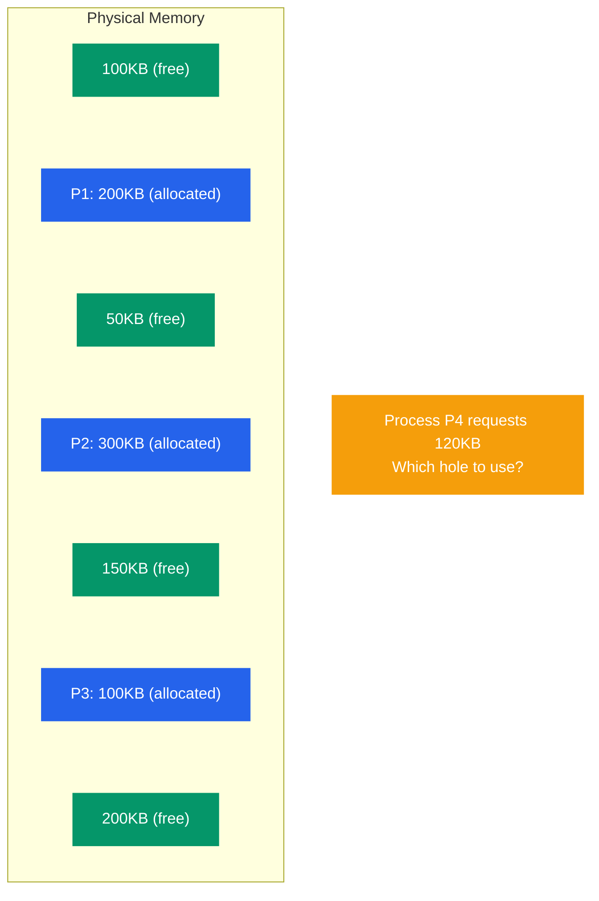
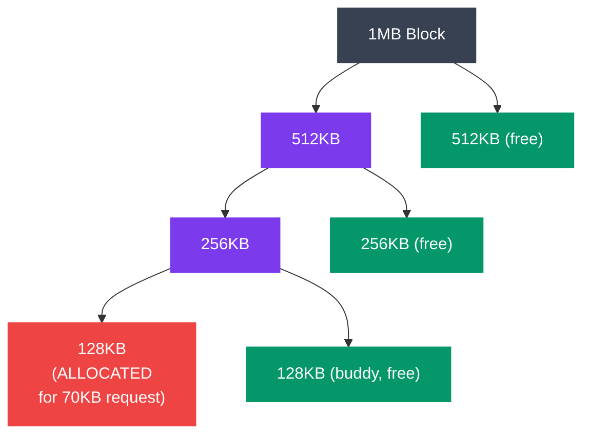

# Memory Allocation Strategies

## What You'll Learn

- Dynamic memory allocation fundamentals
- Allocation strategies: First-Fit, Best-Fit, Worst-Fit, Next-Fit
- Fragmentation: internal vs external
- Memory compaction and defragmentation
- Buddy system allocation
- Slab allocation
- malloc/free implementation
- Memory pools and custom allocators
- Linux memory allocation (kmalloc, vmalloc)

## Introduction to Memory Allocation

Socho tum Zomato ke liye ek naya warehouse/dark-store manage kar rahe ho. Har order aata hai, usko shelf space chahiye — kabhi chhota (ek samosa packet), kabhi bada (10 log ka bulk order). Tumhara kaam hai: har order ko efficiently jagah dena, aur jab order deliver ho jaye toh woh space wapas free karna, taaki agla order use kar sake.

**Memory allocation** bilkul yehi kaam karta hai, bas warehouse ki jagah RAM hoti hai aur "orders" hote hain processes jo memory maangte hain (`malloc()`, `new`, heap allocation). OS (ya runtime library) ka allocator decide karta hai:

1. Kis free block mein naya request fit karna hai
2. Free hone ke baad us memory ko wapas kaise track karna hai
3. Time ke saath memory "chhed-chhed" (holes) mein na badal jaye, taaki bade requests fail na ho jayein

Yeh sunne mein simple lagta hai, lekin real duniya mein yeh ek continuous balancing act hai — **speed** (jaldi allocate karo), **space efficiency** (waste kam karo), aur **fragmentation control** (memory ko chhote-chhote bekaar tukdo mein mat todo) — teeno cheezein ek saath optimize karni padti hain.

> [!info]
> Yeh concept sirf OS-level nahi hai — Node.js ka V8 engine, Java ka JVM heap, aur C ka `malloc` — sab ke andar koi na koi allocation algorithm chal raha hota hai. Jab tum samajhte ho ki OS level pe yeh kaise hota hai, toh tumhe apni language ke garbage collector aur memory leaks samajhne mein bhi help milti hai.

### The Memory Allocation Problem

Socho tumhare paas ek 1000KB ki RAM hai, jisme kuch processes already chal rahe hain aur beech-beech mein free "holes" pade hain — bilkul jaise ek parking lot mein kuch gaadiyan already parked hain aur beech mein khaali slots hain. Ab agar ek naya process P4 aakar 120KB maange, toh allocator ko decide karna hai — **kaunsa khaali hole use karu?**



```
Free Memory (Holes):

┌──────┐ 100KB
├──────┤
│ P1   │ 200KB  (allocated)
├──────┤
┌──────┐ 50KB   (free)
├──────┤
│ P2   │ 300KB  (allocated)
├──────┤
┌──────┐ 150KB  (free)
├──────┤
│ P3   │ 100KB  (allocated)
├──────┤
┌──────┐ 200KB  (free)
└──────┘

Process P4 requests 120KB
Which hole to use?
```

Yahan 4 options hain — 100KB (fit nahi hoga, chhota hai), 50KB (chhota hai), 150KB (fit hoga, 30KB bachega), 200KB (fit hoga, 80KB bachega). Kaunsa best hai? Isi decision ko lekar hi First-Fit, Best-Fit, Worst-Fit aur Next-Fit jaise algorithms bane hain — aage discuss karenge.

## Fragmentation

**Kyun zaruri hai?** Fragmentation woh silent killer hai jo dheere-dheere tumhare system ko slow kar deta hai, bina koi error diye. Ek din sab sahi chal raha hota hai, aur agle din bade allocation requests fail hone lagte hain — jabki "total free memory" kaafi zyada dikh rahi hoti hai. Yeh classic fragmentation ka symptom hai.

### External Fragmentation

Socho IRCTC ki train mein alag-alag coaches mein 1-1, 2-2 seats khaali hain, lekin koi bhi group of 4 ek saath baithne ki jagah nahi hai — kyunki khaali seats scattered hain, contiguous nahi. Yehi **external fragmentation** hai: total free memory bahut hai, lekin woh chhote-chhote non-contiguous tukdo mein bikhri hui hai, isliye ek bada continuous request fail ho jata hai.

```
External Fragmentation:
  Free memory exists but is scattered

Example:
┌─────┐ 50KB  free   ┐
├─────┤              │
│ P1  │ 100KB        │ Total free: 250KB
├─────┤              │
┌─────┐ 100KB free   │ But largest block: 100KB
├─────┤              │
│ P2  │ 150KB        │ Cannot allocate 200KB request!
├─────┤              │
┌─────┐ 100KB free   ┘
└─────┘
```

Yahan total free memory 250KB hai, lekin sabse bada contiguous block sirf 100KB ka hai. Isliye 200KB ka request fail ho jayega — bhale hi "on paper" enough memory available ho.

### Internal Fragmentation

Ab doosri taraf — socho ek courier company sirf fixed-size boxes deti hai: Small, Medium, Large (koi custom size nahi). Tumhe ek chhota sa 18KB ka parcel bhejna hai, lekin sabse chhota available box 32KB ka hai. Toh box ke andar 14KB jagah **khaali** rahegi, waste ho jayegi. Yehi **internal fragmentation** hai — allocator ne zaroorat se zyada allocate kar diya, kyunki woh fixed-size blocks mein deta hai.

```
Internal Fragmentation:
  Allocated more than needed

Example:
Process needs 18KB
System allocates in 32KB blocks
→ 14KB wasted (internal fragmentation)

┌──────────────┐
│ Used: 18KB   │
├──────────────┤
│ Wasted: 14KB │ ← Internal fragmentation
└──────────────┘
```

> [!tip]
> Yaad rakhne ka easy tarika: **External** fragmentation matlab memory blocks *ke beech* mein waste ho raha hai (scattered holes). **Internal** fragmentation matlab ek allocated block *ke andar* waste ho raha hai (over-allocation). External fragmentation memory ke "bahar" ka problem hai, internal "andar" ka.

### Memory Compaction (Defragmentation)

External fragmentation ka ek jaana-maana ilaaj hai — **compaction**. Isme OS saare allocated blocks ko ek taraf shift kar deta hai (jaise Tetris mein blocks ko ek side compress karna), taaki saara free memory ek hi bade contiguous chunk mein aa jaye.

```
Before Compaction:
┌─────┐ 50KB  free
├─────┤
│ P1  │ 100KB
├─────┤
┌─────┐ 100KB free
├─────┤
│ P2  │ 150KB
├─────┤
┌─────┐ 100KB free
└─────┘
Largest free block: 100KB

              ↓ COMPACT ↓

After Compaction:
├─────┤
│ P1  │ 100KB
├─────┤
│ P2  │ 150KB
├─────┤
┌─────┐ 250KB free   ← ab ek bada contiguous block!
└─────┘
```

Yeh sunne mein simple lagta hai, lekin practically expensive hai kyunki:

- Har allocated process ko memory mein **move** karna padta hai (CPU cycles kharch honge, jitna bada process utna zyada time)
- Agar processes ke paas pointers hain jo purani physical addresses ko point karte hain, toh un sabko **update** karna padta hai
- Compaction ke time system ko roughly **pause** karna padta hai (ya kam se kam us region ko lock karna padta hai)

Isi wajah se, modern OS ka approach compaction se zyada **paging** hai (jahan process ko contiguous physical memory ki zaroorat hi nahi padti — dekh chuke ho `03_paging_segmentation.md` mein). Lekin kuch systems (jaise garbage-collected runtimes — JVM, V8) apne heap ke andar compaction use karte hain, jisko "moving GC" bolte hain.

> [!warning]
> Compaction sirf tabhi possible hai jab memory **relocatable** ho — matlab addresses dynamically translate ho sakte hon (base register ya paging ke through). Agar process directly physical addresses use kar raha hai (jaise purane embedded systems), toh compaction possible hi nahi hai.

## Allocation Algorithms

Jab bhi ek naya memory request aata hai aur multiple free holes available hote hain jo request ko satisfy kar sakte hain, allocator ko ek decision lena padta hai — **kaunsa hole choose karu?** Chaar classic strategies hain, har ek ka apna trade-off hai.

### 1. First-Fit

**Kya karta hai?** Sabse pehla hola jo request ke liye kaafi bada ho, wahi use kar lo — aur aage socho mat. Bilkul jaise Ola/Uber book karte waqt agar tumhe "sabse pehli available cab" chahiye, na ki "sabse best" cab.

```c
// first_fit.c
#include <stdio.h>
#include <stdbool.h>

#define MAX_HOLES 100

typedef struct {
    int start;
    int size;
    bool allocated;
} MemoryBlock;

MemoryBlock memory[MAX_HOLES];
int block_count = 0;

void init_memory(int sizes[], int n) {
    int start = 0;
    for (int i = 0; i < n; i++) {
        memory[i].start = start;
        memory[i].size = sizes[i];
        memory[i].allocated = false;
        start += sizes[i];
        block_count++;
    }
}

int first_fit(int size) {
    for (int i = 0; i < block_count; i++) {
        if (!memory[i].allocated && memory[i].size >= size) {
            memory[i].allocated = true;
            printf("First-Fit: Allocated %dKB at block %d (size %dKB)\n", 
                   size, i, memory[i].size);
            return i;
        }
    }
    printf("First-Fit: FAILED to allocate %dKB\n", size);
    return -1;
}

void display_memory() {
    printf("\nMemory Map:\n");
    for (int i = 0; i < block_count; i++) {
        printf("Block %d: Start=%d Size=%dKB %s\n",
               i, memory[i].start, memory[i].size,
               memory[i].allocated ? "[ALLOCATED]" : "[FREE]");
    }
    printf("\n");
}

int main() {
    int holes[] = {100, 50, 200, 150, 75};
    init_memory(holes, 5);
    
    printf("Initial Memory:\n");
    display_memory();
    
    first_fit(120);  // Should use block 2 (200KB)
    first_fit(60);   // Should use block 0 (100KB)
    first_fit(40);   // Should use block 3 (150KB)
    
    display_memory();
    
    return 0;
}
```

**First-Fit Analysis**:
- Fast hai (pehla fit milte hi ruk jata hai)
- Implement karna simple hai
- Problem: memory ki **shuruaat** mein chhote-chhote, unusable holes ban jaate hain (kyunki allocator har baar shuru se search karta hai aur pehle blocks baar-baar split hote hain)
- Time complexity: O(n), jahan n = number of holes

### 2. Best-Fit

**Kya karta hai?** Poori list search karo aur woh hola choose karo jo request ke liye **sabse tight fit** ho — jitna kam waste ho utna better. Jaise Flipkart pe exact size ka box dhundna taaki packaging mein zyada khaali jagah na bache.

```c
// best_fit.c
int best_fit(int size) {
    int best_index = -1;
    int min_size = INT_MAX;
    
    for (int i = 0; i < block_count; i++) {
        if (!memory[i].allocated && memory[i].size >= size) {
            if (memory[i].size < min_size) {
                min_size = memory[i].size;
                best_index = i;
            }
        }
    }
    
    if (best_index != -1) {
        memory[best_index].allocated = true;
        printf("Best-Fit: Allocated %dKB at block %d (size %dKB)\n",
               size, best_index, memory[best_index].size);
    } else {
        printf("Best-Fit: FAILED to allocate %dKB\n", size);
    }
    
    return best_index;
}
```

**Best-Fit Analysis**:
- Har allocation mein waste kam se kam hota hai (per-allocation efficient)
- Slow hai — har baar **poori list** search karni padti hai
- Ironically, sabse zyada choti-choti "unusable" holes yehi banata hai — kyunki yeh jaan-boojh kar tight-fitting holes chunta hai, aur bacha hua tukda itna chhota reh jata hai ki kisi kaam ka nahi rehta
- Time complexity: O(n)

### 3. Worst-Fit

**Kya karta hai?** Isse ulta — sabse **bada** hola choose karo, taaki jo bachega woh bhi ek reasonable size ka ho aur future requests ke kaam aa sake. Jaise BigBasket ka warehouse manager sabse bade empty rack mein saman rakh de, taaki chhote racks doosre chhote orders ke liye bache rahein.

```c
// worst_fit.c
int worst_fit(int size) {
    int worst_index = -1;
    int max_size = -1;
    
    for (int i = 0; i < block_count; i++) {
        if (!memory[i].allocated && memory[i].size >= size) {
            if (memory[i].size > max_size) {
                max_size = memory[i].size;
                worst_index = i;
            }
        }
    }
    
    if (worst_index != -1) {
        memory[worst_index].allocated = true;
        printf("Worst-Fit: Allocated %dKB at block %d (size %dKB)\n",
               size, worst_index, memory[worst_index].size);
    } else {
        printf("Worst-Fit: FAILED to allocate %dKB\n", size);
    }
    
    return worst_index;
}
```

**Worst-Fit Analysis**:
- Bacha hua remainder generally usable size ka hota hai (chhote-chhote fragments nahi bante)
- Slow hai — poori list search karni padti hai
- Practically achha perform nahi karta, kyunki har baar bade blocks use karne se bade holes bahut jaldi khatam ho jaate hain, aur phir bade future requests ke liye kuch nahi bachta
- Time complexity: O(n)

### 4. Next-Fit

**Kya karta hai?** First-Fit jaisa hi hai, bas har baar shuru se search nahi karta — **jahan pichli baar allocation ki thi, wahin se** search continue karta hai (aur end pe pahunch kar wrap-around karke shuru se). Jaise ek library mein kitaab rakhne wala staff har baar shuru ke shelf se check karne ke bajaye, jahan last time rakha tha wahin se aage dekhta hai.

```c
// next_fit.c
int last_allocated = 0;

int next_fit(int size) {
    int start = last_allocated;
    
    // Search from last position to end
    for (int i = start; i < block_count; i++) {
        if (!memory[i].allocated && memory[i].size >= size) {
            memory[i].allocated = true;
            last_allocated = i;
            printf("Next-Fit: Allocated %dKB at block %d\n", size, i);
            return i;
        }
    }
    
    // Wrap around: search from beginning to start
    for (int i = 0; i < start; i++) {
        if (!memory[i].allocated && memory[i].size >= size) {
            memory[i].allocated = true;
            last_allocated = i;
            printf("Next-Fit: Allocated %dKB at block %d\n", size, i);
            return i;
        }
    }
    
    printf("Next-Fit: FAILED to allocate %dKB\n", size);
    return -1;
}
```

**Next-Fit fayda**: yeh First-Fit se fast hai (kyunki baar-baar shuru ke chhote holes ko re-check nahi karta) aur allocations ko poori memory mein zyada evenly distribute karta hai. Lekin studies show karti hain ki practically iski performance First-Fit ke lagbhag barabar hi hoti hai.

### Algorithm Comparison

```
Example: Holes: [100KB, 50KB, 200KB, 150KB]
         Request: 80KB

First-Fit:  Uses 100KB hole (first sufficient)
            Remaining: [20KB, 50KB, 200KB, 150KB]

Best-Fit:   Uses 100KB hole (smallest sufficient)
            Remaining: [20KB, 50KB, 200KB, 150KB]

Worst-Fit:  Uses 200KB hole (largest)
            Remaining: [100KB, 50KB, 120KB, 150KB]

Performance (typical):
First-Fit:  Fast, moderate fragmentation
Best-Fit:   Slow, small fragments
Worst-Fit:  Slow, moderate fragmentation
Next-Fit:   Fast, better distribution
```

> [!tip]
> Interview mein aksar yeh pucha jata hai: "In practice, kaunsa best hai?" Answer: simulations mein **First-Fit aur Best-Fit** generally Worst-Fit se better perform karte hain, both space utilization aur speed mein. Yehi wajah hai ki real allocators (jaise `glibc` ka malloc) in dono ideas ko combine karte hain, extra optimizations ke saath.

## Buddy System

Ab tak jo algorithms dekhe, unme fragmentation ek problem rehti hai. **Buddy System** ek clever binary approach hai jo isse kam karne ki koshish karta hai — saare blocks hamesha **powers of 2** ke size ke hote hain (1KB, 2KB, 4KB, 8KB...). Jab merge/split hota hai, toh yeh perfectly predictable tarike se hota hai.

Socho ek pizza ko bar-bar aadha-aadha (half-half) kaatna — agar tumhe chhota slice chahiye, poora pizza aadha karo, phir uska aadha karo, jab tak tumhare zaroorat jitna size na mil jaye. Aur jab dono halves wapas free ho jaayein, unhe wapas jod kar poora pizza bana sakte ho — bas sharat itni hai ki dono halves ek hi "original cut" se aaye hon (yehi unka "buddy" hota hai).



```
Buddy System:

Initial: 1MB block
Request 70KB → Round up to 128KB (2^7)

Split process:
1MB
 ├─ 512KB
 │   ├─ 256KB
 │   │   ├─ 128KB ← Allocate here
 │   │   └─ 128KB (buddy, free)
 │   └─ 256KB (free)
 └─ 512KB (free)

Buddies can merge when both free
```

**Kaise kaam karta hai, step-by-step:**

1. Request aata hai (jaise 70KB), allocator usko round-up karta hai next power of 2 tak (128KB, kyunki 64KB kaafi nahi hai)
2. Agar exact size ka free block available hai, seedha allocate kar do
3. Agar nahi hai, toh sabse chhota available bada block dhundo aur usse repeatedly aadha (split) karte jao jab tak required size na aa jaaye
4. Har split se do "buddies" (twins) banti hain — yeh ek-doosre ko track karti hain
5. Jab dono buddies free ho jaayein (koi bhi allocated na ho), OS unhe automatically **merge** karke wapas bada block bana deta hai — isko coalescing kehte hain

```c
// buddy_system.c (simplified but complete)
#include <stdio.h>
#include <stdlib.h>
#include <stdbool.h>

#define MAX_ORDER 10  // 2^10 = 1024 units → sabse bada block size

typedef struct Block {
    int order;              // block ka size = 2^order units
    int start;               // memory offset (address) is block ka
    bool allocated;
    struct Block* next;      // free-list mein agla block
} Block;

Block* free_lists[MAX_ORDER + 1];  // har order ke liye ek free-list

// Naya block object banata hai
Block* make_block(int order, int start) {
    Block* b = malloc(sizeof(Block));
    b->order = order;
    b->start = start;
    b->allocated = false;
    b->next = NULL;
    return b;
}

// Size ko round-up karke sabse chhota order dhundta hai jo usme fit ho
int get_order(int size) {
    int order = 0;
    int block_size = 1;
    while (block_size < size) {
        block_size *= 2;
        order++;
    }
    return order;
}

// order 'i' ke free-list mein block push karna
void push_free(int order, Block* b) {
    b->next = free_lists[order];
    free_lists[order] = b;
}

Block* allocate_buddy(int size) {
    int order = get_order(size);

    // Order 'order' se shuru karke upar tak dhundo, jahan free block mile
    int i = order;
    while (i <= MAX_ORDER && free_lists[i] == NULL) {
        i++;
    }
    if (i > MAX_ORDER) {
        printf("Buddy: FAILED to allocate %dKB\n", size);
        return NULL;
    }

    // Free list se block nikal lo
    Block* block = free_lists[i];
    free_lists[i] = block->next;

    // Jab tak requested order tak nahi pahunche, split karte jao
    while (i > order) {
        i--;
        int buddy_start = block->start + (1 << i);   // buddy right half mein hoga
        Block* buddy = make_block(i, buddy_start);
        push_free(i, buddy);                          // buddy ko free list mein daal do
        block->order = i;                              // block ka size aadha ho gaya
    }

    block->allocated = true;
    printf("Buddy: Allocated %dKB (order %d, block of %dKB) at offset %d\n",
           size, order, 1 << order, block->start);
    return block;
}

void free_buddy(Block* block) {
    block->allocated = false;
    // Real implementation mein yahan buddy ka address calculate karke
    // (XOR trick: buddy_start = start ^ (1 << order)) check karte hain ki
    // buddy bhi free hai kya — agar haan, toh dono ko merge karke
    // order+1 ka ek bada block bana dete hain, aur yeh recursively upar tak chalta hai.
    push_free(block->order, block);
    printf("Buddy: Freed block of order %d at offset %d\n", block->order, block->start);
}
```

**Buddy System ke fayde aur nuksan:**

- Allocate aur free **fast** hote hain — O(log n), kyunki sirf ek chain of splits/merges follow karni padti hai
- Merging (coalescing) simple aur predictable hai — buddy ka address ek simple XOR se nikal jata hai (`buddy_address = block_address XOR block_size`)
- External fragmentation kam hoti hai (merging ki wajah se)
- Lekin **internal fragmentation** rehti hai — 70KB request ke liye 128KB allocate hota hai, matlab 58KB waste! Kyunki sab kuch power-of-2 sizes mein hi milta hai.

> [!info]
> Linux kernel ka physical page allocator (**Page Allocator / Buddy Allocator**) exactly isi technique pe based hai — yeh pages ko groups of `2^order` pages mein manage karta hai (order 0 se order 10 tak, `/proc/buddyinfo` mein dekh sakte ho).

## Slab Allocation

Buddy system bada helpful hai jab tum "kitne bhi size" ke blocks maang rahe ho. Lekin ek bahut common OS-kernel pattern hai: **same-size, same-type objects ka baar-baar allocate/free hona** — jaise `task_struct` (process control block), file descriptors, network buffers, inode objects. In cheezon ke liye har baar buddy system se fresh memory maangna, use karna, phir free karna — bahut zyada overhead create karta hai (splitting, merging, initialization).

**Kya hota hai?** Socho ek Swiggy dabba/tiffin service jo roz-roz naye steel dabbe kharidne ke bajaye, ek **fixed pool of dabbe** rakhti hai — jaise hi ek customer khaana khatam karke dabba wapas karta hai, usko dhoke seedha next customer ko de dete hain, bina naya dabba banaye. **Slab allocator** yehi karta hai kernel objects ke liye — pre-initialized, fixed-size objects ka pool bana ke rakhta hai.

```
Slab Allocation:

Cache for "task_struct" objects (size = 1.7KB each)

Slab 1 (one or more contiguous pages):
┌────────┬────────┬────────┬────────┬────────┐
│ Object │ Object │ Object │ Object │ Object │
│ (used) │ (free) │ (used) │ (free) │ (free) │
└────────┴────────┴────────┴────────┴────────┘

Slab 2:
┌────────┬────────┬────────┬────────┐
│ Object │ Object │ Object │ Object │
│ (free) │ (free) │ (used) │ (free) │
└────────┴────────┴────────┴────────┘

Har "cache" ek particular object type ke liye dedicated hai.
Objects allocate hote hi already-initialized (constructor already chal chuka)!
```

**Kaam kaise karta hai:**

1. Kernel bootup pe (ya first use pe) har frequently-used object type ke liye ek **cache** bana leta hai (jaise `kmem_cache_create("task_struct", ...)`)
2. Cache ke andar ek ya zyada **slabs** hote hain — har slab kuch contiguous physical pages ka bana hota hai, jisme fixed-size objects pehle se hi slot bana ke rakhe hote hain
3. Jab object allocate karna ho, allocator seedha ek free slot de deta hai — koi memory-size calculation nahi, koi splitting nahi. Bas ek free-list se pop kar diya (O(1))!
4. Jab object free hota hai, woh wapas usi slab ke free-list mein chala jata hai — **memory OS ko wapas nahi ki jaati**, taaki agli baar phir se fast allocate ho sake
5. Objects "partially initialized" state mein rehte hain — jaise ek `task_struct` ka structure layout already set hota hai, sirf fields update karni padti hain. Isse constructor/destructor overhead bhi bachta hai.

**Slab allocator ke fayde:**

- Same-type, fixed-size, frequently allocated objects ke liye bahut fast (O(1) allocate/free)
- Cache-friendly — objects aligned hote hain CPU cache lines ke hisaab se, achha performance
- Internal fragmentation control mein — kyunki object exact size ka slot milta hai, buddy system jaisa "round up to power of 2" waste nahi hota
- Kernel mein widely used hai — Linux ke `SLAB`, `SLUB` (default modern allocator), aur `SLOB` (embedded systems ke liye) sab isi idea ke variants hain

> [!tip]
> **Buddy vs Slab** — interview mein confuse mat hona: Buddy system **variable-size** physical memory allocation ke liye hai (pages allocate karne ke liye). Slab allocator uske **upar** baitha hota hai aur **fixed-size kernel objects** (jaise struct instances) ke liye fast allocation deta hai. Slab internally buddy system se hi bade chunks (pages) maangta hai, phir unhe chhote fixed slots mein baant deta hai.

## malloc/free Implementation

Ab tak humne dekha ki OS/kernel level pe memory kaise manage hoti hai. Lekin jab tum C mein `malloc(size)` call karte ho, woh seedha kernel se baat nahi karta har baar — kyunki system calls **expensive** hote hain (context switch involved hota hai). Iski jagah, C runtime library (`glibc` jaisi) **user-space mein apna khud ka allocator** maintain karti hai, jo heap memory ko manage karta hai.

**Basic flow:**

1. Program start hote hi, heap chhota hota hai
2. Jab `malloc()` call hoti hai aur heap mein enough free space nahi hoti, library kernel se **ek badi chunk** memory maangti hai (`brk()`/`sbrk()` system call se, ya bade allocations ke liye `mmap()`)
3. Us badi chunk ko phir library khud apne internal free-list mein manage karti hai, aur chhote-chhote `malloc` calls ko usi mein se serve karti hai — bina baar-baar kernel ko call kiye
4. `free()` call hone pe memory turant OS ko wapas nahi hoti — woh library ke internal free-list mein wapas chali jaati hai, taaki agli `malloc` call fast ho

```c
// simple_malloc.c — ek basic free-list based allocator (educational, thread-unsafe)
#include <unistd.h>
#include <stddef.h>

typedef struct BlockHeader {
    size_t size;                 // is block ka usable size
    int free;                    // 1 = free, 0 = allocated
    struct BlockHeader* next;    // next block heap mein (linked list)
} BlockHeader;

#define HEADER_SIZE sizeof(BlockHeader)

BlockHeader* heap_start = NULL;

// Free-list traverse karke koi free block dhoondo jo fit ho jaaye (first-fit)
BlockHeader* find_free_block(BlockHeader** last, size_t size) {
    BlockHeader* current = heap_start;
    while (current && !(current->free && current->size >= size)) {
        *last = current;
        current = current->next;
    }
    return current;
}

// Naya block OS se maangna (sbrk se heap ko aage badhana)
BlockHeader* request_space(BlockHeader* last, size_t size) {
    BlockHeader* block = sbrk(0);                 // current heap-end ka pointer
    void* request = sbrk(size + HEADER_SIZE);      // heap ko badhao
    if (request == (void*) -1) {
        return NULL;                               // sbrk fail (out of memory)
    }
    if (last) {
        last->next = block;
    }
    block->size = size;
    block->next = NULL;
    block->free = 0;
    return block;
}

void* my_malloc(size_t size) {
    if (size <= 0) return NULL;

    BlockHeader* block;

    if (!heap_start) {
        // Pehli call — koi block hai hi nahi, seedha OS se maango
        block = request_space(NULL, size);
        if (!block) return NULL;
        heap_start = block;
    } else {
        BlockHeader* last = heap_start;
        block = find_free_block(&last, size);
        if (!block) {
            // Koi free block fit nahi hua, OS se aur maango
            block = request_space(last, size);
            if (!block) return NULL;
        } else {
            // Existing free block reuse kar liya
            block->free = 0;
        }
    }

    return (block + 1);   // header ke turant baad ka pointer return karo (usable memory)
}

void my_free(void* ptr) {
    if (!ptr) return;
    BlockHeader* block = (BlockHeader*)ptr - 1;   // header wapas nikaalo
    block->free = 1;
    // Real allocators (glibc) yahan aage-peeche ke free blocks ko
    // "coalesce" (merge) bhi karte hain, taaki external fragmentation kam ho.
}
```

Yeh implementation deliberately simple rakha gaya hai taaki concept clear ho — real `glibc malloc` (jo `ptmalloc2` pe based hai) mein bahut zyada optimizations hain: **multiple free-lists size ke hisaab se (bins)**, **thread-local arenas** (multi-threaded programs mein lock-contention kam karne ke liye), aur **coalescing on free** (adjacent free blocks ko turant merge karna).

> [!warning]
> Common gotcha: `free()` ke baad bhi pointer ko use karna (**use-after-free**) ya same pointer ko do baar `free()` karna (**double-free**) — dono undefined behavior hain aur security vulnerabilities ka common source hain. Memory ki "ownership" clearly track karo — Rust jaisi languages isi problem ko compile-time pe solve karti hain.

## Memory Pools and Custom Allocators

General-purpose `malloc`/`free` har situation ke liye kaafi hai, lekin **performance-critical applications** (game engines, high-frequency trading systems, real-time systems, ya Node.js ke andar V8's internal object allocation) mein log apna **custom allocator** banate hain — jinme sabse common pattern hai **Memory Pool**.

**Kya hota hai Memory Pool?** Socho CRED ka customer support — agar har naye customer call ke liye naya agent hire karna pade aur call khatam hote hi fire karna pade, bahut slow aur expensive hoga. Iski jagah, CRED ke paas fixed pool of agents hote hain — call aata hai, ek free agent assign hota hai, call khatam hote hi agent wapas pool mein "available" ho jata hai, agli call ke liye ready.

**Memory pool** isi tarah kaam karta hai:

1. Startup pe hi ek bada chunk memory allocate kar liya jata hai (ek hi baar, upfront)
2. Us chunk ko fixed-size "slots" mein pre-divide kar diya jata hai
3. Jab bhi object chahiye, pool se ek free slot le liya — koi `malloc` call nahi, bas ek pointer arithmetic / linked-list pop
4. Object use ho jaane ke baad, wapas pool mein daal diya — koi `free` call nahi karni padi kernel/libc ko

```c
// memory_pool.c — fixed-size object pool (jaise game engine ke "bullet" objects)
#include <stdio.h>
#include <stdlib.h>

#define POOL_SIZE 1000

typedef struct Bullet {
    float x, y;
    int active;
} Bullet;

typedef struct PoolNode {
    Bullet data;
    struct PoolNode* next_free;
} PoolNode;

PoolNode pool[POOL_SIZE];
PoolNode* free_list = NULL;

void pool_init() {
    // Saare nodes ko ek free-linked-list mein jod do, ek hi baar
    for (int i = 0; i < POOL_SIZE - 1; i++) {
        pool[i].next_free = &pool[i + 1];
    }
    pool[POOL_SIZE - 1].next_free = NULL;
    free_list = &pool[0];
}

Bullet* pool_alloc() {
    if (!free_list) {
        printf("Pool exhausted!\n");
        return NULL;
    }
    PoolNode* node = free_list;
    free_list = free_list->next_free;   // O(1) — bas pointer move kiya
    node->data.active = 1;
    return &node->data;
}

void pool_free(Bullet* b) {
    PoolNode* node = (PoolNode*)b;
    node->data.active = 0;
    node->next_free = free_list;        // O(1) — wapas free-list mein daal diya
    free_list = node;
}
```

**Memory pool kyun fast hota hai:**

- Allocation aur deallocation dono **O(1)** hain — sirf ek pointer swap, koi search nahi
- Koi fragmentation nahi — kyunki saare objects same fixed size ke hain
- Kernel ko baar-baar call nahi karna padta (`malloc`/`free`/`sbrk` overhead zero ho jata hai after init)
- Cache locality achhi hoti hai — objects contiguous memory mein hote hain

**Trade-off**: memory pool sirf tab kaam karta hai jab objects **fixed-size aur ek hi type** ke hon, aur tumhe **upar se hi andaza ho ki max kitne objects chahiye honge** (pool size decide karna padta hai). Agar variable-size allocations chahiye, toh general-purpose allocator (ya buddy+slab jaisi hybrid strategy) hi better rahegi.

## Linux Memory Allocation (kmalloc, vmalloc)

Linux kernel ke andar bhi memory allocate karne ke multiple tareeke hain, har ek apne use-case ke liye optimize kiya gaya hai — bilkul jaise Amazon apne warehouse ke different sections mein different types ke saman ke liye alag storage strategy use karta hai.

### `kmalloc()` — Physically Contiguous Memory

`kmalloc()` kernel ka sabse common allocator hai — yeh **slab allocator ke upar** based hai (jo humne upar dekha). Yeh **physically contiguous** memory deta hai — matlab jo bhi bytes tumhe mile hain, woh RAM mein ek continuous stretch mein hongi.

```c
#include <linux/slab.h>

// Kernel module ke andar 1024 bytes allocate karna
void *buffer = kmalloc(1024, GFP_KERNEL);
if (!buffer) {
    // allocation fail ho gaya
}

// ... use buffer ...

kfree(buffer);
```

- **Use case**: DMA (Direct Memory Access) operations ke liye zaroori hai — hardware devices (network cards, disk controllers) ko physically contiguous memory chahiye hoti hai, kyunki unke paas virtual memory translate karne ki capability nahi hoti
- **Speed**: bahut fast hai (slab allocator ki wajah se), lekin size mein limited hai (typically kuch MB tak, kyunki bade contiguous physical chunks dhundna mushkil hota hai jaise system chalta rehta hai)
- **Flags**: `GFP_KERNEL` (normal, sleep allowed), `GFP_ATOMIC` (interrupt context mein, sleep allowed nahi), etc.

### `vmalloc()` — Virtually Contiguous Memory

`vmalloc()` bade allocations ke liye use hota hai, jahan **physical contiguity zaroori nahi** hai — sirf virtual address space mein contiguous dikhna chahiye. Kernel ke page tables internally alag-alag physical pages ko ek virtually-contiguous range mein map kar dete hain.

```c
#include <linux/vmalloc.h>

// Bada buffer allocate karna, jise physically contiguous hone ki zaroorat nahi
void *big_buffer = vmalloc(10 * 1024 * 1024);  // 10 MB
if (!big_buffer) {
    // allocation fail
}

// ... use big_buffer ...

vfree(big_buffer);
```

- **Use case**: Bade data structures (jaise kernel module ka bada buffer, filesystem caches) jahan device ko directly access nahi karna
- **Speed**: `kmalloc` se **slower** hai — kyunki page-table entries banani padti hain har physical page ke liye alag se
- **Size**: bade allocations ke liye theek hai (physical contiguity dhundhne ka jhanjhat nahi)

### Quick Comparison

```
                kmalloc()                    vmalloc()
Contiguity:     Physical + Virtual           Virtual only
Speed:          Fast (slab-based)            Slower (page-table setup)
Max Size:       Limited (few MB)             Large (limited by virtual space)
DMA-safe:       Yes                          No
Use case:       Drivers, small structures    Big buffers, module data
```

> [!tip]
> Quick mental model jo interview mein kaam aata hai: **"DMA ya hardware involved hai? kmalloc(). Sirf bada software buffer chahiye? vmalloc()."** Aur agar tumhe bahut chhote, fixed-size, frequently-used kernel objects allocate karne hain (jaise `task_struct`), toh `kmalloc` ke bhi neeche slab allocator ka apna dedicated cache use hota hai (`kmem_cache_alloc`).

---

## Key Takeaways

- **Memory allocation** ka core problem hai: free holes mein se sahi hole choose karna, taaki fragmentation kam ho aur speed bani rahe
- **External fragmentation**: free memory total mein bahut hai lekin scattered hai (contiguous nahi). **Internal fragmentation**: ek allocated block ke andar hi jagah waste ho rahi hai (over-allocation)
- **First-Fit** fast hai aur simple hai; **Best-Fit** waste kam karta hai per-allocation but slow aur tiny-fragment-prone hai; **Worst-Fit** practically kam hi use hota hai; **Next-Fit** better distribution deta hai First-Fit jaisi speed ke saath
- **Compaction** external fragmentation fix karta hai memory ko shift karke, lekin expensive hai — isliye modern OS zyada paging pe rely karte hain
- **Buddy System** power-of-2 sized blocks use karta hai, fast split/merge deta hai (O(log n)), lekin internal fragmentation la sakta hai
- **Slab Allocator** fixed-size, frequently-used kernel objects ke liye O(1) allocation deta hai, buddy system ke upar baith kar
- **malloc/free** user-space mein apna free-list maintain karte hain, kernel se badi chunks mangwa kar (`sbrk`/`mmap`), taaki har allocation ke liye system call na karna pade
- **Memory Pools** performance-critical code mein fixed-size objects ke liye custom, super-fast (O(1)) allocation dete hain — game engines, real-time systems mein common
- Linux mein **`kmalloc`** physically-contiguous, fast, DMA-safe small allocations ke liye hai; **`vmalloc`** virtually-contiguous bade allocations ke liye hai jahan physical contiguity zaroori nahi
