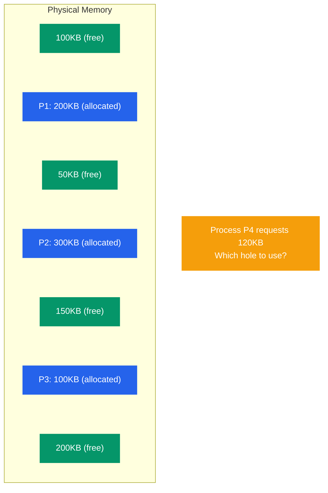
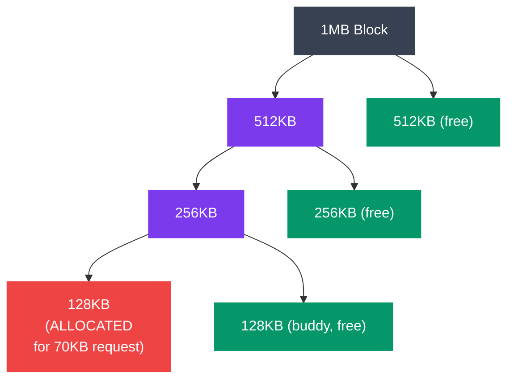

# Memory Allocation Strategies

## What You'll Learn

- Dynamic memory allocation fundamentals
- Allocation strategies: First-Fit, Best-Fit, Worst-Fit, Next-Fit
- Fragmentation: internal vs external
- Memory compaction and defragmentation
- Buddy system allocation
- Slab allocation
- malloc/free implementation
- Memory pools and custom allocators
- Linux memory allocation (kmalloc, vmalloc)

## Introduction to Memory Allocation

**Memory allocation** assigns memory blocks to processes and manages free memory. Efficient allocation minimizes fragmentation and allocation time.

### The Memory Allocation Problem



```
Free Memory (Holes):

┌──────┐ 100KB
├──────┤
│ P1   │ 200KB  (allocated)
├──────┤
┌──────┐ 50KB   (free)
├──────┤
│ P2   │ 300KB  (allocated)
├──────┤
┌──────┐ 150KB  (free)
├──────┤
│ P3   │ 100KB  (allocated)
├──────┤
┌──────┐ 200KB  (free)
└──────┘

Process P4 requests 120KB
Which hole to use?
```

## Fragmentation

### External Fragmentation

```
External Fragmentation:
  Free memory exists but is scattered

Example:
┌─────┐ 50KB  free   ┐
├─────┤              │
│ P1  │ 100KB        │ Total free: 250KB
├─────┤              │
┌─────┐ 100KB free   │ But largest block: 100KB
├─────┤              │
│ P2  │ 150KB        │ Cannot allocate 200KB request!
├─────┤              │
┌─────┐ 100KB free   ┘
└─────┘
```

### Internal Fragmentation

```
Internal Fragmentation:
  Allocated more than needed

Example:
Process needs 18KB
System allocates in 32KB blocks
→ 14KB wasted (internal fragmentation)

┌──────────────┐
│ Used: 18KB   │
├──────────────┤
│ Wasted: 14KB │ ← Internal fragmentation
└──────────────┘
```

## Allocation Algorithms

### 1. First-Fit

**Algorithm**: Allocate first hole large enough.

```c
// first_fit.c
#include <stdio.h>
#include <stdbool.h>

#define MAX_HOLES 100

typedef struct {
    int start;
    int size;
    bool allocated;
} MemoryBlock;

MemoryBlock memory[MAX_HOLES];
int block_count = 0;

void init_memory(int sizes[], int n) {
    int start = 0;
    for (int i = 0; i < n; i++) {
        memory[i].start = start;
        memory[i].size = sizes[i];
        memory[i].allocated = false;
        start += sizes[i];
        block_count++;
    }
}

int first_fit(int size) {
    for (int i = 0; i < block_count; i++) {
        if (!memory[i].allocated && memory[i].size >= size) {
            memory[i].allocated = true;
            printf("First-Fit: Allocated %dKB at block %d (size %dKB)\n", 
                   size, i, memory[i].size);
            return i;
        }
    }
    printf("First-Fit: FAILED to allocate %dKB\n", size);
    return -1;
}

void display_memory() {
    printf("\nMemory Map:\n");
    for (int i = 0; i < block_count; i++) {
        printf("Block %d: Start=%d Size=%dKB %s\n",
               i, memory[i].start, memory[i].size,
               memory[i].allocated ? "[ALLOCATED]" : "[FREE]");
    }
    printf("\n");
}

int main() {
    int holes[] = {100, 50, 200, 150, 75};
    init_memory(holes, 5);
    
    printf("Initial Memory:\n");
    display_memory();
    
    first_fit(120);  // Should use block 2 (200KB)
    first_fit(60);   // Should use block 0 (100KB)
    first_fit(40);   // Should use block 3 (150KB)
    
    display_memory();
    
    return 0;
}
```

**First-Fit Analysis**:
- ✓ Fast (stops at first fit)
- ✓ Simple to implement
- ✗ Creates small unusable holes at beginning
- Time: O(n) where n = number of holes

### 2. Best-Fit

**Algorithm**: Allocate smallest hole that fits.

```c
// best_fit.c
int best_fit(int size) {
    int best_index = -1;
    int min_size = INT_MAX;
    
    for (int i = 0; i < block_count; i++) {
        if (!memory[i].allocated && memory[i].size >= size) {
            if (memory[i].size < min_size) {
                min_size = memory[i].size;
                best_index = i;
            }
        }
    }
    
    if (best_index != -1) {
        memory[best_index].allocated = true;
        printf("Best-Fit: Allocated %dKB at block %d (size %dKB)\n",
               size, best_index, memory[best_index].size);
    } else {
        printf("Best-Fit: FAILED to allocate %dKB\n", size);
    }
    
    return best_index;
}
```

**Best-Fit Analysis**:
- ✓ Minimizes wasted space per allocation
- ✗ Slow (must search all holes)
- ✗ Creates many tiny unusable holes
- Time: O(n)

### 3. Worst-Fit

**Algorithm**: Allocate largest hole.

```c
// worst_fit.c
int worst_fit(int size) {
    int worst_index = -1;
    int max_size = -1;
    
    for (int i = 0; i < block_count; i++) {
        if (!memory[i].allocated && memory[i].size >= size) {
            if (memory[i].size > max_size) {
                max_size = memory[i].size;
                worst_index = i;
            }
        }
    }
    
    if (worst_index != -1) {
        memory[worst_index].allocated = true;
        printf("Worst-Fit: Allocated %dKB at block %d (size %dKB)\n",
               size, worst_index, memory[worst_index].size);
    } else {
        printf("Worst-Fit: FAILED to allocate %dKB\n", size);
    }
    
    return worst_index;
}
```

**Worst-Fit Analysis**:
- ✓ Leaves larger remaining holes
- ✗ Slow (must search all holes)
- ✗ Doesn't perform well in practice
- Time: O(n)

### 4. Next-Fit

**Algorithm**: Like First-Fit but start search from last allocation.

```c
// next_fit.c
int last_allocated = 0;

int next_fit(int size) {
    int start = last_allocated;
    
    // Search from last position to end
    for (int i = start; i < block_count; i++) {
        if (!memory[i].allocated && memory[i].size >= size) {
            memory[i].allocated = true;
            last_allocated = i;
            printf("Next-Fit: Allocated %dKB at block %d\n", size, i);
            return i;
        }
    }
    
    // Wrap around: search from beginning to start
    for (int i = 0; i < start; i++) {
        if (!memory[i].allocated && memory[i].size >= size) {
            memory[i].allocated = true;
            last_allocated = i;
            printf("Next-Fit: Allocated %dKB at block %d\n", size, i);
            return i;
        }
    }
    
    printf("Next-Fit: FAILED to allocate %dKB\n", size);
    return -1;
}
```

### Algorithm Comparison

```
Example: Holes: [100KB, 50KB, 200KB, 150KB]
         Request: 80KB

First-Fit:  Uses 100KB hole (first sufficient)
            Remaining: [20KB, 50KB, 200KB, 150KB]

Best-Fit:   Uses 100KB hole (smallest sufficient)
            Remaining: [20KB, 50KB, 200KB, 150KB]

Worst-Fit:  Uses 200KB hole (largest)
            Remaining: [100KB, 50KB, 120KB, 150KB]

Performance (typical):
First-Fit:  Fast, moderate fragmentation
Best-Fit:   Slow, small fragments
Worst-Fit:  Slow, moderate fragmentation
Next-Fit:   Fast, better distribution
```

## Buddy System

Binary allocation system where blocks are powers of 2.



```
Buddy System:

Initial: 1MB block
Request 70KB → Round up to 128KB (2^7)

Split process:
1MB
 ├─ 512KB
 │   ├─ 256KB
 │   │   ├─ 128KB ← Allocate here
 │   │   └─ 128KB (buddy, free)
 │   └─ 256KB (free)
 └─ 512KB (free)

Buddies can merge when both free
```

```c
// buddy_system.c (simplified)
#include <stdio.h>
#include <stdlib.h>
#include <stdbool.h>
#include <math.h>

#define MAX_ORDER 10  // 2^10 = 1024 units
#define MIN_SIZE 1

typedef struct Block {
    int order;
    bool allocated;
    struct Block* buddy;
    struct Block* next;
} Block;

Block* free_lists[MAX_ORDER + 1];

int get_order(int size) {
    int order = 0;
    int block_size = MIN_SIZE;
    while (block_size < size) {
        block_size *= 2;
        order++;
    }
    return order;
}

Block* allocate_buddy(int size) {
    int order = get_order(size);
    
    // Find suitable block
    for (int i = order; i <= MAX_ORDER; i++) {
        if (free_lists[i] != NULL) {
            // Found block, remove from free list
            Block* block = free_lists[i];
            free_lists[i] = block->next;
            
            // Split if necessary
            while (i > order) {
                i--;
                Block* buddy = malloc(sizeof(Block));
                buddy->order = i;
            
