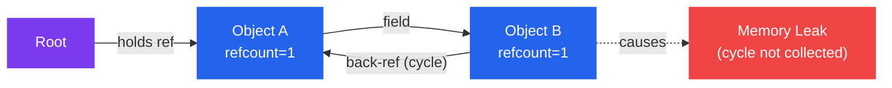
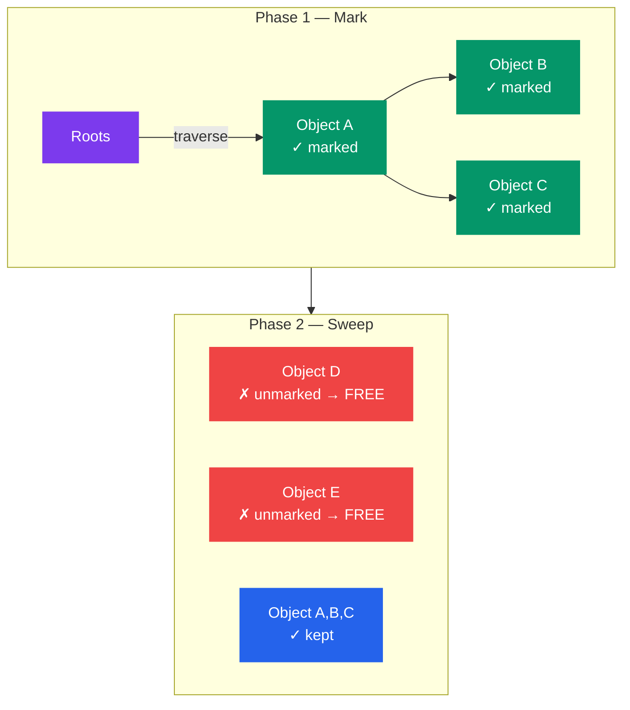
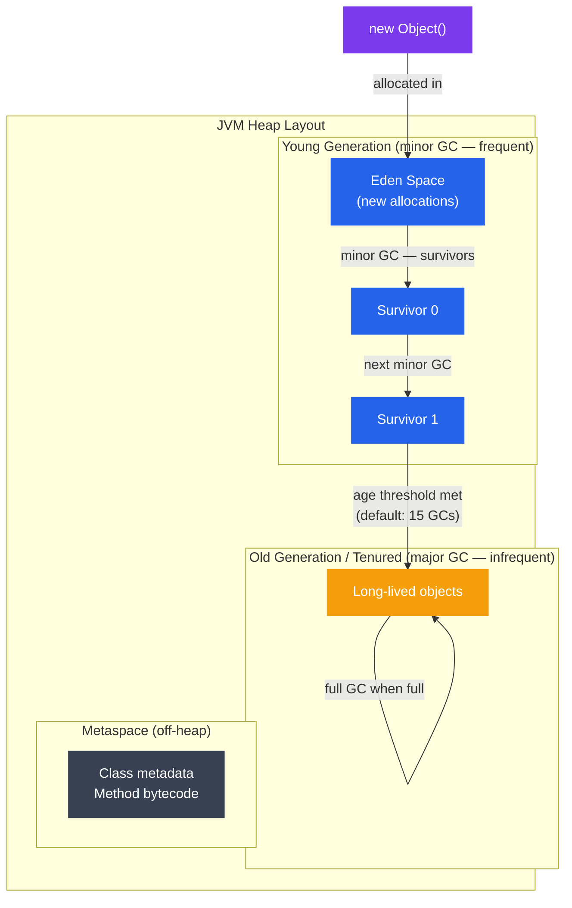

# Garbage Collection

## What You'll Learn

- Garbage collection kya hota hai aur manual memory management se better/worse kyun hai
- Core GC algorithms: Reference Counting, Mark-and-Sweep, Copying, Generational
- GC in major runtimes: JVM (G1, ZGC), V8 (JavaScript), CPython
- Stop-the-world pauses vs concurrent aur incremental GC
- GC tuning basics aur observable metrics
- Managed-memory languages mein memory leaks kaise diagnose karein

---

## Introduction to Garbage Collection

Socho tum ek bade joint family mein raho, aur ghar mein jo bhi purana saaman — tootी kursi, khaali dabbe, expired coupons — pada hai, usko clean karne ke liye ek dedicated banda hai jiska kaam hi yehi hai ki ghoom ghoom ke dekhe "yeh cheez kisi ke kaam ki hai kya?" Agar nahi, toh utha ke phek de. Tumhe khud yaad nahi rakhna padta ki kaunsi cheez kab phenkni hai.

**Garbage collection (GC)** exactly yehi karta hai code ke liye — automatic memory management. Runtime khud track karta hai ki kaunse objects abhi bhi "reachable" hain (matlab kaam ke hain) aur jo reachable nahi hain, unki memory wapas le leta hai.

### Kyun zaruri hai GC?

C jaise language mein tumhe khud `malloc` karke memory maangni padti hai aur khud hi `free` karke wapas karni padti hai. Ab socho ek Zomato jaisa bada backend system hai jisme lakhon requests aa rahi hain, har request pe naye objects ban rahe hain — order object, cart object, user session object. Agar developer kahin ek jagah `free` karna bhool gaya, memory leak ho jayega aur server crash ho jayega 3 baje raat ko jab sabse zyada orders aa rahe hote hain (Murphy's law, hamesha).

GC is problem ko solve karta hai automatically. Tumhara focus business logic pe rehta hai, "yeh memory kab free karni hai" ka tension runtime le leta hai.

### Manual vs Automatic Memory Management

| Aspect | Manual (C/C++) | Automatic (GC) |
|---|---|---|
| Kaun free karta hai memory | Programmer khud | Runtime |
| Speed | Potentially fast | GC pauses ka overhead |
| Safety | Dangling pointers, double-free ka risk | By default memory-safe |
| Leaks | Aasani se ho jaate hain | Fir bhi possible hain (logical leaks) |
| Complexity | High — lifetime khud track karo | Kam — sirf logic pe focus |

**GC ka core problem yeh solve karta hai:** ek long-running process mein (jaise tumhara Node.js server jo 24x7 chal raha hai), har allocation ka manually track rakhna ki kab uski zaroorat khatam hui — yeh error-prone hai. GC iska automation karta hai *liveness* determine karke — koi object "live" hai agar wo kisi root (stack variable, global, register) se reachable hai.

```
Roots (stack, globals)
       │
       ▼
  [Object A] ──► [Object B] ──► [Object C]
       │
       └──────► [Object D]

  [Object E]  ← unreachable — garbage
```

Yahan `Object E` ka koi bhi root se raasta nahi hai — matlab koi variable, koi field usko point nahi kar raha. Yeh exactly waisa hi hai jaise koi purana Paytm wallet transaction object hai jiska koi reference kahin nahi bacha — usko safely delete kiya ja sakta hai.

---

## Theory

### Algorithm 1: Reference Counting

**Kya hota hai?** Har object ke saath ek counter attach hota hai jo batata hai ki kitne references us object ko point kar rahe hain. Jaise hi yeh count zero ho jata hai, object turant free ho jata hai.

Socho ek shared Ola cab hai — jab tak usme koi bhi passenger baitha hai (reference count > 0), cab "in use" hai. Jaise hi last passenger utar jaata hai (count = 0), cab immediately free ho jaati hai next ride ke liye — koi wait nahi karna padta.

```python
# Python-style pseudocode illustrating reference counting
x = MyObject()   # refcount = 1
y = x            # refcount = 2
del x            # refcount = 1
del y            # refcount = 0 → freed immediately
```

**Pros:**
- Deterministic destruction — object jaise hi unreachable hota hai, waise hi free ho jaata hai (koi wait nahi)
- Low pause times — reclamation mutations ke saath spread hota hai, ek saath bada pause nahi aata

**Cons:**
- **Cycles** collect nahi kar sakta — do objects agar ek dusre ko reference kar rahe hain, toh unka count kabhi zero nahi hoga

Socho do dost hain jo ek dusre ko "tum meri responsibility ho" bol rahe hain forever — dono ek dusre ko hold kiye baithe hain, koi bhi free nahi ho sakta, chahe bahar duniya se unka koi lena-dena na ho.

```
[A] ──► [B]
 ▲       │
 └───────┘
Both have refcount ≥ 1 forever. Neither is collected.
```



CPython apna primary mechanism reference counting hi rakhta hai, aur is cycle wale problem ko handle karne ke liye extra ek **cyclic garbage collector** bhi rakhta hai. Matlab CPython "both worlds best" try karta hai.

> [!info]
> Reference counting deterministic hai isliye C++ ke `shared_ptr` aur Swift/Objective-C (ARC) jaise systems isko pasand karte hain — pause-free feel hota hai. Lekin cycles ka problem hamesha rehta hai, isliye ek backup mechanism chahiye hi hota hai.

---

### Algorithm 2: Mark-and-Sweep

**Kya hota hai?** Yeh do phases mein chalta hai:

1. **Mark** — roots se start karke, jitne bhi reachable objects hain sabko traverse karo aur mark kar do
2. **Sweep** — poore heap ko scan karo; jo bhi object unmarked hai, wo garbage hai, usko reclaim kar do

Socho ek IRCTC ticket checking drive hai train mein — TTE (mark phase) har seat pe jaake check karta hai "yeh seat kisi valid ticket wale ne book ki hai kya" aur jo valid hain unko mark kar deta hai. Uske baad sweep phase mein jo bhi unmarked (bina ticket, fraudulent) seats hain unhe clear kar diya jata hai.



**Pros:**
- Cycles ko correctly handle karta hai (reference counting ke opposite) — kyunki yahan sirf "reachability from root" check hota hai, mutual references matter nahi karte
- Implement karna simple hai

**Cons:**
- Classic implementation mein marking aur sweeping ke dauraan poori application ko **stop-the-world** karna padta hai — jaise poore train ko rok ke checking karna
- Memory compact nahi karta — fragmentation ho sakta hai (chhote-chhote free holes ban jaate hain heap mein, jinme bade objects fit nahi hote)

---

### Algorithm 3: Copying GC (Semi-Space)

**Kya hota hai?** Heap ko do equal halves mein divide kiya jaata hai — **from-space** aur **to-space**. Live objects ko from-space se to-space mein copy kiya jaata hai (isi process mein compaction bhi ho jaata hai), phir from-space ko poora discard kar diya jaata hai.

Socho Swiggy ka delivery hub shift ho raha hai — purane warehouse (from-space) se sirf woh saaman uthake naye warehouse (to-space) mein daala jaata hai jo actually use ho raha hai (live items). Jo expired/unused stock hai, use wahin chhod diya jaata hai aur purana warehouse hi band kar diya jaata hai. Naya warehouse automatically neat-clean hai — koi gaps nahi, sab kuch ek line mein packed.

```
Before:        From-Space                   To-Space (empty)
               [A][dead][B][dead][C][dead]   [          ]

After copy:    From-Space (discarded)        To-Space (compacted)
               [         ]                   [A][B][C]
```

**Pros:**
- Allocation sirf ek simple pointer-bump hai (bahut fast) — naya object banane ke liye bas pointer ko aage badhao
- Automatic compaction — fragmentation ka koi issue hi nahi, kyunki har baar fresh compacted copy milta hai

**Cons:**
- Heap ka sirf half hissa hi kabhi bhi usable hota hai (doosra half reserve rehta hai)
- Bade objects ko copy karna expensive hai

Yehi algorithm modern runtimes ke **Young Generation** ke peeche ka core idea hai.

---

### Algorithm 4: Generational GC

**Kya hota hai?** **Generational hypothesis** kehta hai ki zyadatar objects "young" mar jaate hain — matlab bahut jaldi unreachable ho jaate hain. Generational GC isi observation ko exploit karta hai — heap ko generations mein divide karke, young generation ko bahut frequently collect karta hai (kyunki wahan garbage zyada milega) aur old generation ko rarely.

**Kyun zaruri hai?** Socho tum ek API request handle kar rahe ho — us request ke andar bane temporary objects (parsed JSON, intermediate calculation variables) ka lifetime sirf us request jitna hai, milliseconds mein khatam. Lekin tumhara database connection pool object poori application ke life tak zinda rehta hai. Agar GC har baar poore heap ko scan kare — chhote temporary objects ke liye bhi — toh bahut waste hoga. Isliye young generation ko baar-baar aur jaldi check karo, old generation ko kam baar.



**Minor GC** (sirf Young Gen):
- Fast — ek chhota sa region hi scan hota hai
- Eden aur Survivor spaces ke beech copying GC use hota hai
- Short pause (milliseconds mein)

**Major / Full GC** (Old Gen + Young Gen):
- Slow — poora heap scan hota hai
- Trigger hota hai jab Old Gen bhar jaata hai
- Naive collectors mein multi-second pauses de sakta hai — production mein yeh sabse bada dukh hai

> [!warning]
> Agar tumhara production server frequent "Full GC" pauses de raha hai, iska matlab tumhare bahut saare objects Old Generation tak survive kar rahe hain jo nahi karne chahiye — yeh usually ek memory leak ya bahut zyada long-lived objects banane ka signal hota hai.

---

### Stop-the-World vs Concurrent GC

**Stop-the-world (STW):** GC chalne ke dauraan application ke saare threads pause ho jaate hain. Socho jaise pura railway station shut kar diya gaya cleaning ke liye — koi train move nahi karegi jab tak safai poori na ho.

```
App threads:  ████████│░░░░░░░░│████████████│░░░░│████
                      │← GC →│              │GC│
                      STW pause             STW pause
```

**Concurrent GC:** GC application threads ke saath-saath chalta hai, pause duration kam karta hai. Yeh aisa hai jaise station pe safai crew live traffic ke beech mein hi kaam kar rahi hai — bina poora station band kiye.

```
App threads:  ████████████████████████████████████████
GC thread:        ░░░░░░░░░░░░    ░░░░░░
                  concurrent mark concurrent sweep
```

**Trade-off:** concurrent GC ko extra bookkeeping chahiye hoti hai (write barriers, card tables) taaki collection ke dauraan hone wale mutations track ho sakein — kyunki application aur GC dono ek saath heap ko touch kar rahe hain. Yeh throughput ka thoda sacrifice karke latency kam karta hai.

| Collector | Strategy | Target |
|---|---|---|
| Serial GC | Stop-the-world | Single-core, chhote heaps |
| Parallel GC | STW, multi-threaded | Throughput |
| CMS (deprecated) | Concurrent sweep | Low pause |
| G1 GC | Region-based, concurrent | Balanced pause/throughput |
| ZGC | Fully concurrent | Sub-millisecond pauses |
| Shenandoah | Concurrent compaction | Low pause |

---

## GC in Major Runtimes

### JVM — G1 Garbage Collector

**Kya hota hai?** G1 (Garbage-First) heap ko equal-sized **regions** (~1–32 MB each) mein divide karta hai. Har region ko dynamically role assign hota hai (Eden, Survivor, Old, Humongous). G1 sabse pehle un regions ko collect karta hai jinme sabse zyada garbage hai — isiliye naam hai "Garbage-First". Matlab jahan sabse zyada kachra hai wahan pehle jhaadu lagao, time waste mat karo saaf jagah pe.

```bash
# Enable G1 (default since Java 9)
java -XX:+UseG1GC \
     -Xms512m \
     -Xmx4g \
     -XX:MaxGCPauseMillis=200 \
     -XX:G1HeapRegionSize=16m \
     MyApp
```

**Key G1 phases:**
1. **Young-only phase** — concurrent marking + minor GCs
2. **Space reclamation phase** — mixed GCs jo old regions bhi collect karte hain
3. **Full GC** (fallback) — stop-the-world, isko rare hi hona chahiye

### JVM — ZGC

**Kya hota hai?** ZGC (Z Garbage Collector) sub-millisecond pause times deta hai kyunki yeh almost saara kaam concurrently karta hai — compaction bhi. Yeh **load barriers** use karta hai — har object reference read pe ek chhota sa code inject hota hai — taaki jab objects move ho rahe hon toh pointers ko remap kiya ja sake, application ko rukna na pade.

```bash
# Enable ZGC (production-ready since Java 15)
java -XX:+UseZGC \
     -Xms1g \
     -Xmx8g \
     -XX:ConcGCThreads=4 \
     MyApp
```

ZGC ke pause times typically 1ms se kam hote hain, chahe heap size kitna bhi bada ho (multi-terabyte heaps tak test kiya gaya hai). Yeh basically "bina traffic roke poora shehar clean karne" jaisa hai.

### V8 — JavaScript Engine (Node.js / Chrome)

Tum Node.js developer ho, toh yeh section tumhare liye sabse relevant hai. V8 generational GC use karta hai do spaces ke saath:

- **Young generation (Scavenger):** semi-space copying GC, frequently chalta hai
- **Old generation (Major GC):** Mark-Sweep-Compact ya Mark-Compact, incremental aur concurrent

```
V8 Heap:
┌─────────────────────────────────────────┐
│  New Space (Young Gen)                  │
│  ┌────────────┐  ┌────────────┐         │
│  │  From-Space│  │  To-Space  │         │
│  │  (active)  │  │  (reserve) │         │
│  └────────────┘  └────────────┘         │
│  Old Space (Old Gen, Promoted objects)  │
│  Code Space  (compiled JIT code)        │
│  Large Object Space                     │
└─────────────────────────────────────────┘
```

Jab tum `const obj = {}` likhte ho apne Express route handler ke andar, wo New Space (Young Gen) mein allocate hota hai. Agar request khatam hone ke baad bhi wo object kisi closure ya global variable se referenced reh gaya (common mistake!), toh wo Old Space mein promote ho jaata hai aur waha se hatana mehenga padta hai.

```javascript
// Node.js: inspect heap usage
const v8 = require('v8');
const stats = v8.getHeapStatistics();
console.log(`Heap used: ${(stats.used_heap_size / 1024 / 1024).toFixed(1)} MB`);
console.log(`Heap total: ${(stats.total_heap_size / 1024 / 1024).toFixed(1)} MB`);
console.log(`Heap limit: ${(stats.heap_size_limit / 1024 / 1024).toFixed(1)} MB`);
```

```bash
# Run Node.js with GC logging
node --trace-gc app.js

# Expose GC controls (for profiling only — not production)
node --expose-gc -e "global.gc(); console.log('GC triggered');"

# Adjust young/old gen sizes
node --max-old-space-size=4096 app.js   # 4 GB old gen limit
```

> [!tip]
> Agar tumhara Node.js server production mein OOM (out of memory) crash de raha hai, sabse pehla step yehi hai — `--max-old-space-size` badhao (temporary fix) aur phir heap snapshot lekar actual leak dhoondo (neeche "Practice" section mein dekho).

### CPython — Reference Counting + Cyclic GC

CPython (standard Python interpreter) primary mechanism ke taur pe reference counting use karta hai, aur container objects (list, dict, class instances) ke liye ek supplemental **cyclic garbage collector** rakhta hai.

```python
import gc
import sys

# Check reference count
x = []
print(sys.getrefcount(x))   # 2 (x + getrefcount's argument)

y = x
print(sys.getrefcount(x))   # 3

del y
print(sys.getrefcount(x))   # 2

# The cyclic GC operates on three generations
print(gc.get_threshold())   # (700, 10, 10) — collection thresholds
print(gc.get_count())       # current object counts per generation

# Force collection
collected = gc.collect()    # collect all generations
print(f'Collected {collected} objects')

# Find unreachable objects (debugging)
gc.set_debug(gc.DEBUG_LEAK)
gc.collect()
```

CPython ka cyclic GC ek **tricolor mark** variant use karta hai:
1. Saare tracked container objects ko ek candidate list mein daalo
2. Internal references ko subtract karke dekho konse objects externally-referenced hain
3. Jinka external refcount > 0 hai wo reachable hain; unse transitively reachable objects ko bhi mark karo
4. Bache hue candidates cyclic garbage hain — unko free kar do

---

## Practice

### Observing GC Pauses — JVM

```bash
# Print GC log with timestamps and pause durations
java -Xms512m -Xmx2g \
     -Xlog:gc*:file=gc.log:time,uptime,level,tags \
     MyApp

# Sample gc.log output:
# [2.345s][info][gc] GC(42) Pause Young (Normal) 256M->128M(512M) 12.345ms
# [8.901s][info][gc] GC(43) Pause Young (Concurrent Start) 512M->256M(1024M) 18.2ms
# [8.910s][info][gc] GC(43) Concurrent Mark Cycle

# Analyze GC logs with GCEasy (web tool) or:
java -jar gceasy-api.jar gc.log
```

### Observing GC — Python

```python
import gc
import tracemalloc

# Track memory allocations
tracemalloc.start()

# --- your code here ---
data = [list(range(1000)) for _ in range(1000)]
# ----------------------

snapshot = tracemalloc.take_snapshot()
top_stats = snapshot.statistics('lineno')

print("Top 5 memory consumers:")
for stat in top_stats[:5]:
    print(stat)

tracemalloc.stop()
```

```python
# Detect reference cycles
import gc
import objgraph   # pip install objgraph

class Node:
    def __init__(self, name):
        self.name = name
        self.child = None

a = Node('a')
b = Node('b')
a.child = b
b.child = a   # cycle

# objgraph shows what's holding references
objgraph.show_backrefs([a], max_depth=3, filename='refs.png')
objgraph.show_most_common_types(limit=10)
```

### Diagnosing Memory Leaks — Node.js

**Kaise karein?** Idea simple hai — do heap snapshots lo (before aur after suspicious code), aur compare karo ki kya cheez grow hui. Bilkul waise jaise CRED app mein tum "before" aur "after" bank balance compare karke pata lagate ho ki paisa kaha gaya.

```javascript
// Heap snapshot comparison (built-in v8 profiler)
const v8 = require('v8');
const fs = require('fs');

// Take snapshot before
const snap1 = v8.writeHeapSnapshot('/tmp/heap1.heapsnapshot');

// ... run suspicious code ...

// Take snapshot after
const snap2 = v8.writeHeapSnapshot('/tmp/heap2.heapsnapshot');

// Open both files in Chrome DevTools → Memory tab → Load snapshots
// Use "Comparison" view to see what grew between snapshots
```

```bash
# Node.js heap profiling via --inspect
node --inspect app.js
# Open chrome://inspect in Chrome → Memory → Take heap snapshot
```

### GC Tuning Cheat Sheet

```bash
# JVM G1 — tune pause target
-XX:MaxGCPauseMillis=100        # aim for 100ms max pause (not guaranteed)
-XX:GCPauseIntervalMillis=1000  # GC interval hint

# JVM — heap sizing rules of thumb
-Xms<n>g   # initial heap = final heap to avoid resize overhead
-Xmx<n>g   # max heap — leave 20% for OS and off-heap

# JVM — GC thread count
-XX:ParallelGCThreads=8         # STW GC threads (default: CPU count)
-XX:ConcGCThreads=2             # concurrent threads (default: ~1/4 of parallel)

# Python — tune cyclic GC thresholds
import gc
# gc.set_threshold(threshold0, threshold1, threshold2)
# threshold0: number of allocations before gen0 collection
gc.set_threshold(1000, 15, 15)

# Disable GC for throughput-sensitive code (re-enable after)
gc.disable()
process_large_batch()
gc.enable()
gc.collect()
```

### Common Memory Anti-Patterns

Yeh woh mistakes hain jo har developer kabhi na kabhi karta hai — aur "managed memory hai toh leak nahi hoga" wala myth yahin tootta hai. GC sirf **unreachable** objects ko free kar sakta hai — agar tumne khud kisi object ko galti se "reachable" bana ke rakha hai (jaise ek global list mein daal diya aur nikalna bhool gaye), GC uska kuch nahi kar sakta. Isko **logical leak** kehte hain.

```python
# ANTI-PATTERN: accumulating in a global list (logical leak)
_cache = []

def process(item):
    result = compute(item)
    _cache.append(result)   # grows forever
    return result

# FIX: use a bounded cache
from functools import lru_cache

@lru_cache(maxsize=1000)
def process(item):
    return compute(item)
```

```javascript
// ANTI-PATTERN: event listeners never removed (Node.js / browser)
function setup() {
    const handler = (data) => { /* ... */ };
    emitter.on('data', handler);
    // handler is never removed — closure keeps growing
}

// FIX: remove listener when done
function setup() {
    const handler = (data) => { /* ... */ };
    emitter.on('data', handler);
    return () => emitter.off('data', handler);   // return cleanup fn
}
```

```java
// ANTI-PATTERN: static collection holds objects indefinitely
public class Registry {
    private static final List<Object> instances = new ArrayList<>();

    public static void register(Object o) {
        instances.add(o);   // never removed — old gen fills up
    }
}

// FIX: use WeakReference so GC can collect when no other ref exists
import java.lang.ref.WeakReference;
private static final List<WeakReference<Object>> instances = new ArrayList<>();
```

> [!warning]
> Node.js mein sabse common leak pattern yehi hai — `EventEmitter` pe listener register karke usko kabhi `.off()` ya `.removeListener()` na karna. Agar tumhara app har request pe naya listener register kar raha hai (jaise WebSocket connections ke andar), toh yeh silently heap ko phulaata rehta hai jab tak process crash na ho jaaye.

### GC Metrics to Monitor in Production

Production mein GC ko blindly chhod dena theek nahi — yeh table batata hai ki kaunse numbers "sab theek hai" wale hain aur kaunse "abhi dekho warna raat ko PagerDuty alert aayega" wale hain.

| Metric | Healthy | Warning | Critical |
|---|---|---|---|
| Minor GC frequency | < 1/sec | 1–10/sec | > 10/sec |
| Minor GC pause | < 50ms | 50–200ms | > 200ms |
| Major/Full GC frequency | < 1/hour | 1/hour–1/min | > 1/min |
| Major GC pause | < 1s | 1–5s | > 5s |
| Heap used after Full GC | < 50% | 50–80% | > 80% (leak suspected) |

**Note:** Agar Full GC ke baad bhi heap usage high reh raha hai (>80%), matlab wo memory genuinely "reachable" hai — yeh sabse strong signal hai ek memory leak ka, kyunki Full GC ne apna best kiya aur phir bhi memory free nahi hui.

```bash
# JVM — expose GC metrics via JMX for Prometheus
java -Dcom.sun.management.jmxremote \
     -Dcom.sun.management.jmxremote.port=9090 \
     -Dcom.sun.management.jmxremote.authenticate=false \
     MyApp
# Scrape with jmx_exporter sidecar → Grafana dashboard
```

---

## Key Takeaways

- **Reference counting** simple aur deterministic hai (object turant free hota hai jab reference khatam) lekin cycles collect nahi kar sakta — do objects ek dusre ko hold kiye baithe rehte hain forever. CPython isko cyclic collector ke saath combine karta hai.
- **Mark-and-sweep** cycles ko correctly handle karta hai (traverse-from-root approach) lekin traditionally stop-the-world pause chahiye hota hai aur fragmentation chhod jaata hai.
- **Copying GC** fast bump-pointer allocation aur automatic compaction deta hai — heap ka half hissa reserve rakh ke; young generations mein use hota hai.
- **Generational GC** is observation pe based hai ki zyadatar objects jaldi mar jaate hain — young generation ko frequently aur cheaply collect karta hai, old generation ko rarely.
- **Concurrent GC** (G1, ZGC, V8 ka incremental approach) application ko rukaye bina background mein collection chalata hai — throughput ka thoda trade karke latency kam karta hai.
- GC tuning ka matlab hai throughput, latency, aur memory footprint — teeno ko balance karna; teeno ko ek saath maximize nahi kiya ja sakta.
- Managed languages mein memory leaks *logical* leaks hote hain — objects technically reachable hain lekin actually zaroorat nahi (static collections, na-hataye gaye event listeners, unbounded caches). GC in leaks ko nahi rok sakta — yeh discipline developer ki hai.
