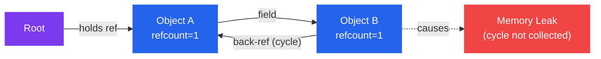
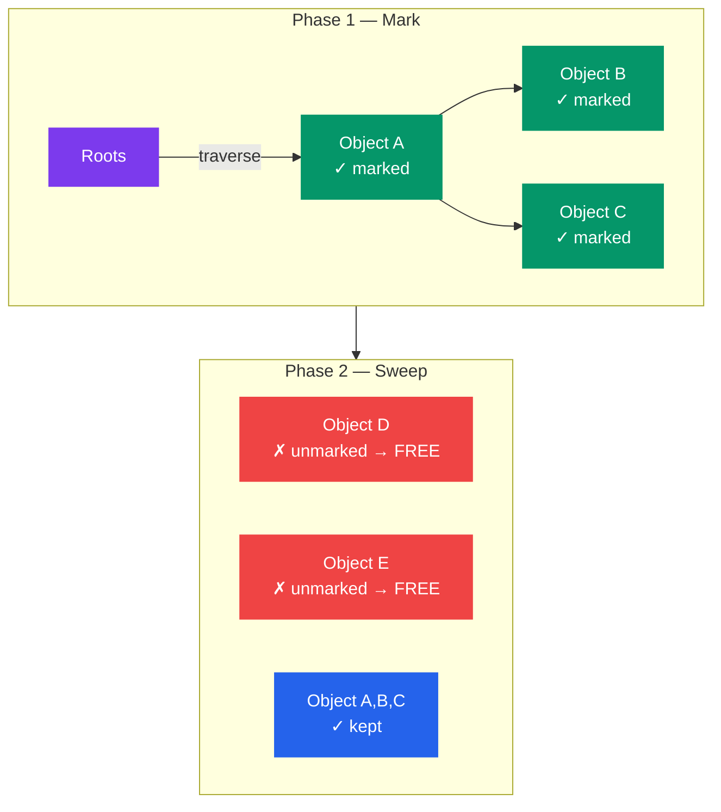
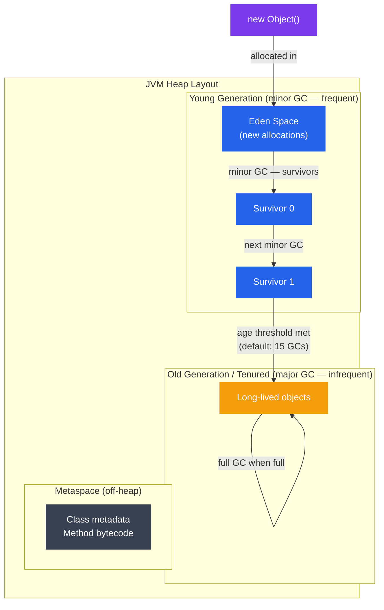

# Garbage Collection

## What You'll Learn

- What garbage collection is and why it matters vs manual memory management
- Core GC algorithms: Reference Counting, Mark-and-Sweep, Copying, Generational
- GC in major runtimes: JVM (G1, ZGC), V8 (JavaScript), CPython
- Stop-the-world pauses vs concurrent and incremental GC
- GC tuning basics and observable metrics
- How to diagnose memory leaks in managed-memory languages

---

## Introduction to Garbage Collection

**Garbage collection (GC)** is automatic memory management — the runtime tracks which objects are still reachable and reclaims memory from those that are not.

### Manual vs Automatic Memory Management

| Aspect | Manual (C/C++) | Automatic (GC) |
|---|---|---|
| Who frees memory | The programmer | The runtime |
| Speed | Potentially faster | Overhead from GC pauses |
| Safety | Dangling pointers, double-free | Memory-safe by default |
| Leaks | Easy to introduce | Still possible (logical leaks) |
| Complexity | High — must track lifetimes | Lower — focus on logic |

**The core problem GC solves:** in a long-running process, manually tracking when every allocation is no longer needed is error-prone. GC automates this by determining *liveness* — an object is live if it is reachable from a root (stack variable, global, register).

```
Roots (stack, globals)
       │
       ▼
  [Object A] ──► [Object B] ──► [Object C]
       │
       └──────► [Object D]

  [Object E]  ← unreachable — garbage
```

---

## Theory

### Algorithm 1: Reference Counting

Each object carries a counter tracking how many references point to it. When the count drops to zero, the object is immediately freed.

```python
# Python-style pseudocode illustrating reference counting
x = MyObject()   # refcount = 1
y = x            # refcount = 2
del x            # refcount = 1
del y            # refcount = 0 → freed immediately
```

**Pros:**
- Deterministic destruction — objects freed the moment they become unreachable
- Low pause times — reclamation is spread across mutations

**Cons:**
- Cannot collect **cycles** — two objects referencing each other never reach zero

```
[A] ──► [B]
 ▲       │
 └───────┘
Both have refcount ≥ 1 forever. Neither is collected.
```



CPython uses reference counting as its primary mechanism and supplements it with a **cyclic garbage collector** to handle the cycle problem.

---

### Algorithm 2: Mark-and-Sweep

Runs in two phases:

1. **Mark** — starting from roots, traverse all reachable objects and mark them
2. **Sweep** — scan the entire heap; any unmarked object is garbage and is reclaimed



**Pros:**
- Handles cycles correctly
- Simple to implement

**Cons:**
- Classic implementation requires a **stop-the-world** pause while marking and sweeping
- Does not compact memory — can lead to fragmentation

---

### Algorithm 3: Copying GC (Semi-Space)

The heap is divided into two equal halves: **from-space** and **to-space**. Live objects are copied from from-space into to-space (compacting them in the process), then from-space is discarded entirely.

```
Before:        From-Space                   To-Space (empty)
               [A][dead][B][dead][C][dead]   [          ]

After copy:    From-Space (discarded)        To-Space (compacted)
               [         ]                   [A][B][C]
```

**Pros:**
- Allocation is a simple pointer bump (very fast)
- Automatic compaction eliminates fragmentation

**Cons:**
- Only half the heap is usable at any time
- Copying large objects is expensive

This algorithm underlies the **Young Generation** in most modern runtimes.

---

### Algorithm 4: Generational GC

The **generational hypothesis** observes that most objects die young. Generational GC exploits this by dividing the heap into generations and collecting the young generation much more frequently.



**Minor GC** (Young Gen only):
- Fast — only a small region is scanned
- Uses copying GC between Eden and Survivor spaces
- Short pause (milliseconds)

**Major / Full GC** (Old Gen + Young Gen):
- Slow — scans the entire heap
- Triggered when Old Gen fills up
- Can cause multi-second pauses in naive collectors

---

### Stop-the-World vs Concurrent GC

**Stop-the-world (STW):** all application threads are paused while GC runs.

```
App threads:  ████████│░░░░░░░░│████████████│░░░░│████
                      │← GC →│              │GC│
                      STW pause             STW pause
```

**Concurrent GC:** GC runs alongside application threads, reducing pause duration.

```
App threads:  ████████████████████████████████████████
GC thread:        ░░░░░░░░░░░░    ░░░░░░
                  concurrent mark concurrent sweep
```

**Trade-off:** concurrent GC requires extra bookkeeping (write barriers, card tables) to track mutations during collection. It trades throughput for lower latency.

| Collector | Strategy | Target |
|---|---|---|
| Serial GC | Stop-the-world | Single-core, small heaps |
| Parallel GC | STW, multi-threaded | Throughput |
| CMS (deprecated) | Concurrent sweep | Low pause |
| G1 GC | Region-based, concurrent | Balanced pause/throughput |
| ZGC | Fully concurrent | Sub-millisecond pauses |
| Shenandoah | Concurrent compaction | Low pause |

---

## GC in Major Runtimes

### JVM — G1 Garbage Collector

G1 (Garbage-First) divides the heap into equal-sized **regions** (~1–32 MB each). Regions are dynamically assigned roles (Eden, Survivor, Old, Humongous). G1 collects the regions with the most garbage first — hence "Garbage-First".

```bash
# Enable G1 (default since Java 9)
java -XX:+UseG1GC \
     -Xms512m \
     -Xmx4g \
     -XX:MaxGCPauseMillis=200 \
     -XX:G1HeapRegionSize=16m \
     MyApp
```

**Key G1 phases:**
1. **Young-only phase** — concurrent marking + minor GCs
2. **Space reclamation phase** — mixed GCs collecting old regions too
3. **Full GC** (fallback) — stop-the-world, should be rare

### JVM — ZGC

ZGC (Z Garbage Collector) achieves sub-millisecond pause times by doing almost all work concurrently, including compaction. It uses **load barriers** — code injected at every object reference read — to remap pointers as objects move.

```bash
# Enable ZGC (production-ready since Java 15)
java -XX:+UseZGC \
     -Xms1g \
     -Xmx8g \
     -XX:ConcGCThreads=4 \
     MyApp
```

ZGC pause times are typically under 1ms regardless of heap size (tested up to multi-terabyte heaps).

### V8 — JavaScript Engine (Node.js / Chrome)

V8 uses a generational GC with two spaces:

- **Young generation (Scavenger):** semi-space copying GC, runs frequently
- **Old generation (Major GC):** Mark-Sweep-Compact or Mark-Compact, incremental and concurrent

```
V8 Heap:
┌─────────────────────────────────────────┐
│  New Space (Young Gen)                  │
│  ┌────────────┐  ┌────────────┐         │
│  │  From-Space│  │  To-Space  │         │
│  │  (active)  │  │  (reserve) │         │
│  └────────────┘  └────────────┘         │
│  Old Space (Old Gen, Promoted objects)  │
│  Code Space  (compiled JIT code)        │
│  Large Object Space                     │
└─────────────────────────────────────────┘
```

```javascript
// Node.js: inspect heap usage
const v8 = require('v8');
const stats = v8.getHeapStatistics();
console.log(`Heap used: ${(stats.used_heap_size / 1024 / 1024).toFixed(1)} MB`);
console.log(`Heap total: ${(stats.total_heap_size / 1024 / 1024).toFixed(1)} MB`);
console.log(`Heap limit: ${(stats.heap_size_limit / 1024 / 1024).toFixed(1)} MB`);
```

```bash
# Run Node.js with GC logging
node --trace-gc app.js

# Expose GC controls (for profiling only — not production)
node --expose-gc -e "global.gc(); console.log('GC triggered');"

# Adjust young/old gen sizes
node --max-old-space-size=4096 app.js   # 4 GB old gen limit
```

### CPython — Reference Counting + Cyclic GC

CPython (the standard Python interpreter) uses reference counting as the primary mechanism with a supplemental **cyclic garbage collector** for container objects.

```python
import gc
import sys

# Check reference count
x = []
print(sys.getrefcount(x))   # 2 (x + getrefcount's argument)

y = x
print(sys.getrefcount(x))   # 3

del y
print(sys.getrefcount(x))   # 2

# The cyclic GC operates on three generations
print(gc.get_threshold())   # (700, 10, 10) — collection thresholds
print(gc.get_count())       # current object counts per generation

# Force collection
collected = gc.collect()    # collect all generations
print(f'Collected {collected} objects')

# Find unreachable objects (debugging)
gc.set_debug(gc.DEBUG_LEAK)
gc.collect()
```

CPython's cyclic GC uses a **tricolor mark** variant:
1. Move all tracked container objects to a candidate list
2. Subtract internal references to find externally-referenced objects
3. Anything with external refcount > 0 is reachable; mark transitively reachable objects
4. Remaining candidates are cyclic garbage — free them

---

## Practice

### Observing GC Pauses — JVM

```bash
# Print GC log with timestamps and pause durations
java -Xms512m -Xmx2g \
     -Xlog:gc*:file=gc.log:time,uptime,level,tags \
     MyApp

# Sample gc.log output:
# [2.345s][info][gc] GC(42) Pause Young (Normal) 256M->128M(512M) 12.345ms
# [8.901s][info][gc] GC(43) Pause Young (Concurrent Start) 512M->256M(1024M) 18.2ms
# [8.910s][info][gc] GC(43) Concurrent Mark Cycle

# Analyze GC logs with GCEasy (web tool) or:
java -jar gceasy-api.jar gc.log
```

### Observing GC — Python

```python
import gc
import tracemalloc

# Track memory allocations
tracemalloc.start()

# --- your code here ---
data = [list(range(1000)) for _ in range(1000)]
# ----------------------

snapshot = tracemalloc.take_snapshot()
top_stats = snapshot.statistics('lineno')

print("Top 5 memory consumers:")
for stat in top_stats[:5]:
    print(stat)

tracemalloc.stop()
```

```python
# Detect reference cycles
import gc
import objgraph   # pip install objgraph

class Node:
    def __init__(self, name):
        self.name = name
        self.child = None

a = Node('a')
b = Node('b')
a.child = b
b.child = a   # cycle

# objgraph shows what's holding references
objgraph.show_backrefs([a], max_depth=3, filename='refs.png')
objgraph.show_most_common_types(limit=10)
```

### Diagnosing Memory Leaks — Node.js

```javascript
// Heap snapshot comparison (built-in v8 profiler)
const v8 = require('v8');
const fs = require('fs');

// Take snapshot before
const snap1 = v8.writeHeapSnapshot('/tmp/heap1.heapsnapshot');

// ... run suspicious code ...

// Take snapshot after
const snap2 = v8.writeHeapSnapshot('/tmp/heap2.heapsnapshot');

// Open both files in Chrome DevTools → Memory tab → Load snapshots
// Use "Comparison" view to see what grew between snapshots
```

```bash
# Node.js heap profiling via --inspect
node --inspect app.js
# Open chrome://inspect in Chrome → Memory → Take heap snapshot
```

### GC Tuning Cheat Sheet

```bash
# JVM G1 — tune pause target
-XX:MaxGCPauseMillis=100        # aim for 100ms max pause (not guaranteed)
-XX:GCPauseIntervalMillis=1000  # GC interval hint

# JVM — heap sizing rules of thumb
-Xms<n>g   # initial heap = final heap to avoid resize overhead
-Xmx<n>g   # max heap — leave 20% for OS and off-heap

# JVM — GC thread count
-XX:ParallelGCThreads=8         # STW GC threads (default: CPU count)
-XX:ConcGCThreads=2             # concurrent threads (default: ~1/4 of parallel)

# Python — tune cyclic GC thresholds
import gc
# gc.set_threshold(threshold0, threshold1, threshold2)
# threshold0: number of allocations before gen0 collection
gc.set_threshold(1000, 15, 15)

# Disable GC for throughput-sensitive code (re-enable after)
gc.disable()
process_large_batch()
gc.enable()
gc.collect()
```

### Common Memory Anti-Patterns

```python
# ANTI-PATTERN: accumulating in a global list (logical leak)
_cache = []

def process(item):
    result = compute(item)
    _cache.append(result)   # grows forever
    return result

# FIX: use a bounded cache
from functools import lru_cache

@lru_cache(maxsize=1000)
def process(item):
    return compute(item)
```

```javascript
// ANTI-PATTERN: event listeners never removed (Node.js / browser)
function setup() {
    const handler = (data) => { /* ... */ };
    emitter.on('data', handler);
    // handler is never removed — closure keeps growing
}

// FIX: remove listener when done
function setup() {
    const handler = (data) => { /* ... */ };
    emitter.on('data', handler);
    return () => emitter.off('data', handler);   // return cleanup fn
}
```

```java
// ANTI-PATTERN: static collection holds objects indefinitely
public class Registry {
    private static final List<Object> instances = new ArrayList<>();

    public static void register(Object o) {
        instances.add(o);   // never removed — old gen fills up
    }
}

// FIX: use WeakReference so GC can collect when no other ref exists
import java.lang.ref.WeakReference;
private static final List<WeakReference<Object>> instances = new ArrayList<>();
```

### GC Metrics to Monitor in Production

| Metric | Healthy | Warning | Critical |
|---|---|---|---|
| Minor GC frequency | < 1/sec | 1–10/sec | > 10/sec |
| Minor GC pause | < 50ms | 50–200ms | > 200ms |
| Major/Full GC frequency | < 1/hour | 1/hour–1/min | > 1/min |
| Major GC pause | < 1s | 1–5s | > 5s |
| Heap used after Full GC | < 50% | 50–80% | > 80% (leak suspected) |

```bash
# JVM — expose GC metrics via JMX for Prometheus
java -Dcom.sun.management.jmxremote \
     -Dcom.sun.management.jmxremote.port=9090 \
     -Dcom.sun.management.jmxremote.authenticate=false \
     MyApp
# Scrape with jmx_exporter sidecar → Grafana dashboard
```

---

## Summary

- **Reference counting** is simple and deterministic but cannot collect cycles; CPython combines it with a cyclic collector.
- **Mark-and-sweep** correctly handles cycles but traditionally requires stop-the-world pauses.
- **Copying GC** enables fast bump-pointer allocation and automatic compaction; used in young generations.
- **Generational GC** exploits the observation that most objects are short-lived, collecting young generations frequently and cheaply.
- **Concurrent GC** (G1, ZGC, V8 incremental) reduces pause times by running collection phases alongside application threads.
- Tuning GC is about balancing throughput, latency, and footprint — the three cannot all be maximized simultaneously.
- Memory leaks in managed languages are *logical* leaks: objects that are technically reachable but no longer needed (static collections, lingering event listeners, unbounded caches).
