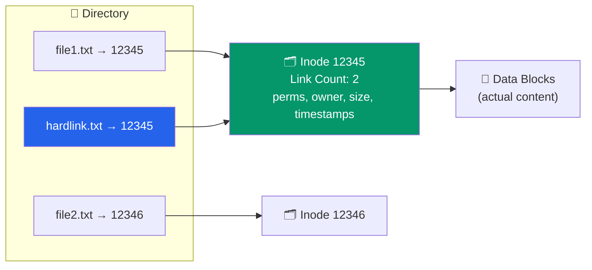
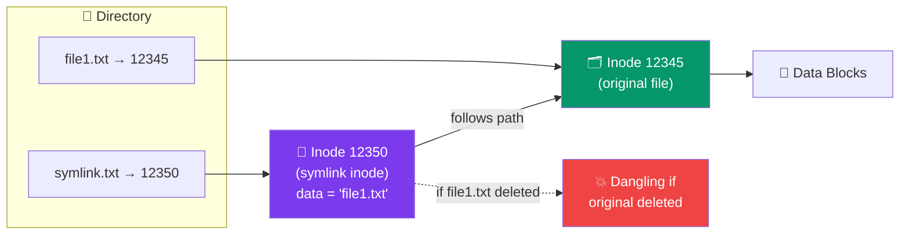

# File Systems Fundamentals

## What You'll Learn

In this tutorial, you'll master the fundamental concepts of file systems:

- Understand what file systems are and why they're essential
- Learn file concepts: data and metadata
- Explore file attributes (name, type, size, permissions, timestamps)
- Identify different file types (regular, directory, symbolic link, device, socket, pipe)
- Master file operations (create, open, read, write, seek, close, delete)
- Understand directory structures (single-level, two-level, tree, acyclic graph)
- Differentiate between absolute and relative paths
- Work with file descriptors
- Explore inode structures in Unix/Linux
- Use the `stat` command and system call
- Understand hard links vs symbolic links

---

## What is a File System?

A **file system** is the method and data structure that an operating system uses to organize, store, and retrieve files on storage devices (hard drives, SSDs, USB drives, etc.).

```
┌─────────────────────────────────────────────────┐
│           Operating System                      │
│  ┌──────────────────────────────────────────┐  │
│  │         File System Layer                │  │
│  │  (Organization & Management)             │  │
│  └──────────────────────────────────────────┘  │
│                    ↕                            │
│  ┌──────────────────────────────────────────┐  │
│  │       Physical Storage Layer             │  │
│  │  (Disk Blocks, Sectors, Tracks)          │  │
│  └──────────────────────────────────────────┘  │
└─────────────────────────────────────────────────┘
```

### Functions of a File System

1. **Organization**: Structure data into files and directories
2. **Naming**: Provide human-readable names for files
3. **Access Control**: Manage permissions and security
4. **Reliability**: Ensure data integrity and recovery
5. **Performance**: Optimize read/write operations

---

## File Concept

A file consists of two components:

### 1. Data (Content)
The actual information stored in the file (text, binary, executable code, etc.)

### 2. Metadata (Attributes)
Information *about* the file

```
┌───────────────────────────────────────┐
│              FILE                     │
├───────────────────────────────────────┤
│  METADATA (Attributes)                │
│  - Name: document.txt                 │
│  - Type: Regular file                 │
│  - Size: 4096 bytes                   │
│  - Permissions: rw-r--r--             │
│  - Owner: user1                       │
│  - Timestamps: created, modified      │
│  - Location: inode pointer            │
├───────────────────────────────────────┤
│  DATA (Content)                       │
│  "This is the content of the file..." │
│  [Binary or text data]                │
└───────────────────────────────────────┘
```

---

## File Attributes

File attributes are metadata that describe the file:

| Attribute | Description | Example |
|-----------|-------------|---------|
| **Name** | Human-readable identifier | `report.pdf` |
| **Type** | File type/extension | `.txt`, `.exe`, `.jpg` |
| **Size** | File size in bytes | `4096 bytes` |
| **Location** | Physical location on disk | `inode 12345` |
| **Permissions** | Access rights | `rwxr-xr--` |
| **Owner** | User who owns the file | `user1` |
| **Group** | Group ownership | `staff` |
| **Timestamps** | Creation, modification, access | `2024-01-15 10:30:22` |
| **Link Count** | Number of hard links | `2` |

### Viewing File Attributes with `stat`

```bash
# Linux/Unix: View detailed file attributes
stat document.txt
```

Output:
```
  File: document.txt
  Size: 4096        Blocks: 8          IO Block: 4096   regular file
Device: 802h/2050d  Inode: 1234567     Links: 1
Access: (0644/-rw-r--r--)  Uid: (1000/   user1)   Gid: (1000/   user1)
Access: 2024-01-15 10:30:22.123456789 +0000
Modify: 2024-01-15 10:25:15.987654321 +0000
Change: 2024-01-15 10:25:15.987654321 +0000
 Birth: 2024-01-10 08:15:30.555555555 +0000
```

### Timestamps

- **Access Time (atime)**: Last time file was read
- **Modification Time (mtime)**: Last time file content was modified
- **Change Time (ctime)**: Last time metadata was changed
- **Birth Time (btime)**: File creation time (not all systems)

---

## File Types

Unix/Linux systems support several file types:

### 1. Regular File (-)
Normal files containing data (text, binary, executables)

```bash
-rw-r--r-- 1 user1 staff 4096 Jan 15 10:30 document.txt
```

### 2. Directory (d)
Special file containing entries for other files

```bash
drwxr-xr-x 5 user1 staff 4096 Jan 15 10:30 mydir
```

### 3. Symbolic Link (l)
Pointer to another file (shortcut)

```bash
lrwxrwxrwx 1 user1 staff   12 Jan 15 10:30 link -> document.txt
```

### 4. Block Device (b)
Device file for block-oriented devices (hard drives)

```bash
brw-rw---- 1 root disk 8, 0 Jan 15 10:30 /dev/sda
```

### 5. Character Device (c)
Device file for character-oriented devices (terminals, keyboards)

```bash
crw--w---- 1 root tty 4, 0 Jan 15 10:30 /dev/tty0
```

### 6. Named Pipe/FIFO (p)
Inter-process communication mechanism

```bash
prw-r--r-- 1 user1 staff 0 Jan 15 10:30 mypipe
```

### 7. Socket (s)
Inter-process network communication

```bash
srwxrwxrwx 1 user1 staff 0 Jan 15 10:30 mysocket
```

### Identifying File Types

```bash
# Using ls -l (first character indicates type)
ls -l

# Using file command
file document.txt
# Output: document.txt: ASCII text

file /dev/sda
# Output: /dev/sda: block special (8/0)

file myprogram
# Output: myprogram: ELF 64-bit LSB executable
```

---

## File Operations

Operating systems provide system calls for file operations:

### Basic Operations

```
┌────────────┐
│   CREATE   │ → Create new file
└────────────┘
       ↓
┌────────────┐
│    OPEN    │ → Open file for access
└────────────┘
       ↓
┌────────────┐
│    READ    │ → Read data from file
│   WRITE    │ → Write data to file
│    SEEK    │ → Move file pointer
└────────────┘
       ↓
┌────────────┐
│   CLOSE    │ → Close file handle
└────────────┘
       ↓
┌────────────┐
│   DELETE   │ → Remove file
└────────────┘
```

### C Programming Example

```c
#include <stdio.h>
#include <stdlib.h>
#include <fcntl.h>
#include <unistd.h>
#include <sys/stat.h>

int main() {
    int fd;
    char buffer[100];
    ssize_t bytes_read, bytes_written;
    
    // CREATE: Create a new file
    fd = open("example.txt", O_CREAT | O_WRONLY | O_TRUNC, 0644);
    if (fd == -1) {
        perror("Error creating file");
        return 1;
    }
    
    // WRITE: Write data to file
    const char *data = "Hello, File System!\n";
    bytes_written = write(fd, data, strlen(data));
    printf("Wrote %zd bytes\n", bytes_written);
    
    // CLOSE: Close the file
    close(fd);
    
    // OPEN: Open file for reading
    fd = open("example.txt", O_RDONLY);
    if (fd == -1) {
        perror("Error opening file");
        return 1;
    }
    
    // READ: Read data from file
    bytes_read = read(fd, buffer, sizeof(buffer) - 1);
    if (bytes_read > 0) {
        buffer[bytes_read] = '\0';
        printf("Read: %s", buffer);
    }
    
    // SEEK: Move to beginning of file
    lseek(fd, 0, SEEK_SET);
    
    // CLOSE: Close the file
    close(fd);
    
    // DELETE: Remove the file
    if (unlink("example.txt") == 0) {
        printf("File deleted successfully\n");
    }
    
    return 0;
}
```

### System Call Reference

| Operation | System Call (Unix/Linux) | Description |
|-----------|--------------------------|-------------|
| Create | `open()` with `O_CREAT` | Create new file |
| Open | `open()` | Open existing file |
| Read | `read()` | Read data from file |
| Write | `write()` | Write data to file |
| Seek | `lseek()` | Change file position |
| Close | `close()` | Release file descriptor |
| Delete | `unlink()` | Remove file |
| Rename | `rename()` | Change file name |
| Get Attributes | `stat()`, `fstat()` | Retrieve file metadata |
| Set Permissions | `chmod()` | Change file permissions |

---

## Directory Structures

### 1. Single-Level Directory

All files in one directory (flat structure):

```
┌──────────────────────────────────┐
│       Root Directory             │
├──────────────────────────────────┤
│ file1.txt                        │
│ file2.txt                        │
│ program.exe                      │
│ document.pdf                     │
│ ...                              │
└──────────────────────────────────┘
```

**Limitations**: Name conflicts, difficult to organize, no user separation

### 2. Two-Level Directory

Separate directory for each user:

```
┌──────────────────────────────────┐
│       Root Directory             │
└──────────────────────────────────┘
          ↓         ↓         ↓
    ┌─────────┐ ┌─────────┐ ┌─────────┐
    │  user1  │ │  user2  │ │  user3  │
    ├─────────┤ ├─────────┤ ├─────────┤
    │ file1   │ │ file1   │ │ file1   │
    │ file2   │ │ file2   │ │ file2   │
    └─────────┘ └─────────┘ └─────────┘
```

**Advantage**: User isolation, same names in different directories

### 3. Tree-Structured Directory (Hierarchical)

Most common structure - arbitrary depth nesting:

```
                    / (root)
                    │
        ┌───────────┼───────────┐
        │           │           │
      home        usr          etc
        │           │           │
    ┌───┴───┐   ┌───┴───┐   passwd
    │       │   │       │   fstab
  user1   user2 bin    lib
    │               │
 ┌──┴──┐         gcc
 │     │       python
docs  pics
 │
report.txt
```

**Advantages**: Flexible organization, logical grouping, efficient searching

### 4. Acyclic Graph Directory

Allows sharing through links:

```
        home
         │
    ┌────┴────┐
  user1     user2
    │         │
  ┌─┴─┐       │
docs pics     │
  │     └─────┤
shared.txt ←──┘
(both users have links to shared.txt)
```

**Allows**: Shared files, multiple paths to same file

---

## Path Names

### Absolute Path

Full path from root directory:

```
Linux/Unix:  /home/user1/documents/report.txt
Windows:     C:\Users\user1\Documents\report.txt
```

### Relative Path

Path relative to current directory:

```
Current directory: /home/user1

Relative path:     documents/report.txt
                   ./documents/report.txt
                   ../user2/files/data.txt  (go up one level, then down)
```

### Special Directory Symbols

```bash
.   # Current directory
..  # Parent directory
~   # Home directory (user's home)
/   # Root directory (absolute path start)
```

### Path Examples

```bash
# Absolute paths
cd /home/user1/documents
cat /etc/passwd

# Relative paths
cd documents          # From /home/user1 to /home/user1/documents
cd ../user2           # From /home/user1 to /home/user2
cd ../../etc          # Up two levels, then to /etc

# Special symbols
cd ~                  # Go to home directory
cd ~/documents        # Go to documents in home
ls .                  # List current directory
ls ..                 # List parent directory
```

---

## File Descriptors

A **file descriptor** is a non-negative integer that uniquely identifies an open file within a process.

### Standard File Descriptors

```
┌─────────────────────────────────────┐
│         Process                     │
├─────────────────────────────────────┤
│ File Descriptor Table               │
│                                     │
│ fd 0 → stdin  (standard input)      │
│ fd 1 → stdout (standard output)     │
│ fd 2 → stderr (standard error)      │
│ fd 3 → opened_file1.txt             │
│ fd 4 → opened_file2.txt             │
│ ...                                 │
└─────────────────────────────────────┘
```

### Working with File Descriptors

```c
#include <fcntl.h>
#include <unistd.h>
#include <stdio.h>

int main() {
    int fd;
    
    // Open returns a file descriptor
    fd = open("myfile.txt", O_RDONLY);
    if (fd == -1) {
        perror("open failed");
        return 1;
    }
    
    printf("File descriptor: %d\n", fd);
    
    // Use file descriptor for operations
    char buffer[100];
    ssize_t n = read(fd, buffer, sizeof(buffer));
    
    // Always close file descriptors
    close(fd);
    
    return 0;
}
```

---

## Inode Structure (Unix/Linux)

An **inode** (index node) is a data structure that stores file metadata (but not the filename or data).

### Inode Contents

```
┌─────────────────────────────────────┐
│         INODE (e.g., #12345)        │
├─────────────────────────────────────┤
│ File Type:        Regular file      │
│ Permissions:      rw-r--r-- (0644)  │
│ Link Count:       2                 │
│ Owner UID:        1000               │
│ Group GID:        1000               │
│ File Size:        4096 bytes         │
│ Timestamps:                          │
│   - Access time:  2024-01-15 10:30  │
│   - Modify time:  2024-01-15 10:25  │
│   - Change time:  2024-01-15 10:25  │
│                                      │
│ Data Block Pointers:                 │
│   Direct[0]:      Block 5000         │
│   Direct[1]:      Block 5001         │
│   Direct[2]:      Block 5002         │
│   ...                                │
│   Direct[11]:     Block 5011         │
│   Indirect:       Block 6000         │
│   Double Ind:     Block 7000         │
│   Triple Ind:     Block 8000         │
└─────────────────────────────────────┘
```

### Directory Entry → Inode Mapping

```
┌──────────────────────────┐
│   Directory Block        │
├──────────────────────────┤
│ Filename    | Inode #    │
├──────────────────────────┤
│ .           | 12344      │
│ ..          | 12000      │
│ file1.txt   | 12345  ────┼───→ Inode 12345 (metadata)
│ file2.txt   | 12346      │                 ↓
│ mydir       | 12347      │              Data Blocks
└──────────────────────────┘
```

### Using `stat` System Call

```c
#include <sys/stat.h>
#include <stdio.h>
#include <time.h>

int main() {
    struct stat file_stat;
    
    // Get file information
    if (stat("example.txt", &file_stat) == -1) {
        perror("stat failed");
        return 1;
    }
    
    // Print file information
    printf("Inode number:    %lu\n", file_stat.st_ino);
    printf("File size:       %ld bytes\n", file_stat.st_size);
    printf("Number of links: %lu\n", file_stat.st_nlink);
    printf("File permissions: %o\n", file_stat.st_mode & 0777);
    printf("Owner UID:       %u\n", file_stat.st_uid);
    printf("Group GID:       %u\n", file_stat.st_gid);
    
    printf("Last access:     %s", ctime(&file_stat.st_atime));
    printf("Last modified:   %s", ctime(&file_stat.st_mtime));
    printf("Last status chg: %s", ctime(&file_stat.st_ctime));
    
    return 0;
}
```

---

## Hard Links vs Symbolic Links

### Hard Link

Multiple directory entries pointing to the **same inode**:



**Properties**:
- Cannot span file systems (must be on same partition)
- Cannot link to directories (prevents cycles)
- Deleting one link doesn't delete the file (until link count = 0)
- Same inode, same data

```bash
# Create hard link
ln file1.txt hardlink.txt

# Verify same inode
ls -li file1.txt hardlink.txt
# 12345 -rw-r--r-- 2 user1 staff 4096 Jan 15 10:30 file1.txt
# 12345 -rw-r--r-- 2 user1 staff 4096 Jan 15 10:30 hardlink.txt
```

### Symbolic Link (Soft Link)

A special file containing a **path to another file**:



**Properties**:
- Can span file systems
- Can link to directories
- Can link to non-existent files (dangling link)
- Separate inode, stores path as data

```bash
# Create symbolic link
ln -s file1.txt symlink.txt

# Verify different inodes
ls -li file1.txt symlink.txt
# 12345 -rw-r--r-- 1 user1 staff 4096 Jan 15 10:30 file1.txt
# 12350 lrwxrwxrwx 1 user1 staff   10 Jan 15 10:31 symlink.txt -> file1.txt
```

### Comparison Table

| Feature | Hard Link | Symbolic Link |
|---------|-----------|---------------|
| **Inode** | Same as original | Different |
| **Across File Systems** | No | Yes |
| **Link to Directories** | No | Yes |
| **Link to Non-existent** | No | Yes (dangling) |
| **Original Deleted** | Link still works | Link breaks |
| **Overhead** | None | Small (path storage) |
| **Command** | `ln original link` | `ln -s original link` |

---

## Practical Examples

### Example 1: Creating and Inspecting Files

```bash
# Create a file
echo "Hello, World!" > test.txt

# View attributes
stat test.txt
ls -l test.txt

# View inode number
ls -i test.txt

# Create hard link
ln test.txt hardlink.txt

# Create symbolic link
ln -s test.txt symlink.txt

# Compare
ls -li test.txt hardlink.txt symlink.txt
```

### Example 2: File Operations in C

```c
#include <fcntl.h>
#include <unistd.h>
#include <stdio.h>
#include <string.h>

int main() {
    int fd;
    char write_buf[] = "Operating Systems\n";
    char read_buf[100];
    
    // Create and write
    fd = open("os_file.txt", O_CREAT | O_WRONLY, 0644);
    write(fd, write_buf, strlen(write_buf));
    close(fd);
    
    // Open and read
    fd = open("os_file.txt", O_RDONLY);
    ssize_t n = read(fd, read_buf, sizeof(read_buf) - 1);
    read_buf[n] = '\0';
    printf("Read: %s", read_buf);
    close(fd);
    
    return 0;
}
```

---

## Exercises

### Beginner

1. **File Attributes**: Use the `stat` command to inspect a file on your system. Identify its size, permissions, and inode number.

2. **File Types**: Create examples of different file types:
   ```bash
   touch regular.txt          # Regular file
   mkdir mydir                # Directory
   ln -s regular.txt link.txt # Symbolic link
   mkfifo mypipe              # Named pipe
   ```

3. **Path Navigation**: Starting from `/home/user`, write the relative path to `/home/other/docs/file.txt`.

### Intermediate

4. **Hard vs Soft Links**: Create a file, create both a hard link and symbolic link to it. Delete the original file. What happens to each link? Why?

5. **File Operations Program**: Write a C program that:
   - Creates a file
   - Writes your name to it
   - Reads it back
   - Displays the file size using `fstat()`

6. **Directory Traversal**: Write a bash script that recursively lists all files in a directory tree, showing their inodes.

### Advanced

7. **Inode Analysis**: Write a C program that uses `stat()` to compare two files and determine if they are hard links to the same file.

8. **Link Counter**: Write a program that finds all hard links to a given file by searching the file system for matching inode numbers.

9. **File System Explorer**: Create a C program that:
   - Takes a directory path as input
   - Lists all files with their types and sizes
   - Displays symbolic links and their targets
   - Shows total disk usage

---

## Key Takeaways

1. **File = Data + Metadata**: Files consist of actual content and attributes (metadata)

2. **Inodes Store Metadata**: In Unix/Linux, inodes store all file attributes except the filename

3. **File Descriptors**: Integer identifiers for open files within a process

4. **Multiple File Types**: Regular files, directories, symbolic links, device files, pipes, sockets

5. **Directory Structures**: Tree structure is most common, allows flexible organization

6. **Two Types of Links**:
   - Hard links: Multiple directory entries → same inode
   - Symbolic links: Special file containing path to target file

7. **Paths**: Absolute (from root) vs relative (from current directory)

8. **System Calls**: `open()`, `read()`, `write()`, `close()`, `stat()`, `unlink()`

---

## Navigation

- **Previous**: [03. Process Synchronization](../03_process_synchronization/README.md)
- **Next**: [02. File System Implementation](./02_fs_implementation.md)
- **Section Index**: [Storage Management](./README.md)

---

## Further Reading

- `man 2 open` - open() system call
- `man 2 stat` - stat() system call
- `man 1 ln` - ln command (creating links)
- "Advanced Programming in the UNIX Environment" by Stevens & Rago
- [Linux File System Documentation](https://www.kernel.org/doc/html/latest/filesystems/)
