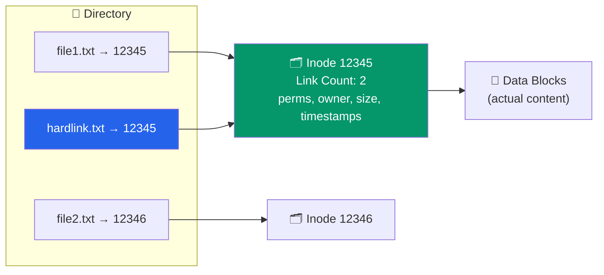
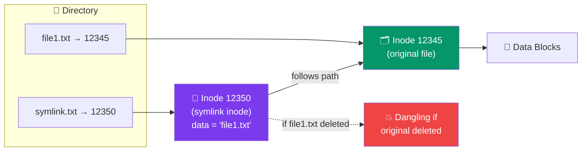

# File Systems Fundamentals

## Is Tutorial Mein Kya Seekhoge

Socho tumhare phone mein 500 photos, 200 songs, aur 50 apps pade hain. Tumne kabhi socha hai ki phone ko pata kaise chalta hai ki konsi photo kahan padi hai, kitni badi hai, kisne last time open ki thi? Yeh sab magic file system ki wajah se hota hai. Is tutorial mein hum file systems ko depth mein samjhenge:

- File system kya hota hai aur yeh itna zaruri kyun hai
- File ke do parts: data aur metadata
- File attributes (naam, type, size, permissions, timestamps)
- Different file types (regular, directory, symbolic link, device, socket, pipe)
- File operations (create, open, read, write, seek, close, delete)
- Directory structures (single-level, two-level, tree, acyclic graph)
- Absolute path vs relative path
- File descriptors
- Unix/Linux ke inode structures
- `stat` command aur system call
- Hard links vs symbolic links

---

## File System Kya Hota Hai?

Zara socho — Zomato ke warehouse mein lakhon ingredients pade hain, alag-alag racks mein, labeled aur organized. Agar koi system na ho ki "tomato kis rack mein hai, kitna stock hai, kab expire hoga" — toh pura warehouse chaos ban jayega. **File system** bilkul yehi kaam karta hai tumhare disk (hard drive, SSD, USB) ke liye. Yeh ek method aur data structure hai jo operating system use karta hai taaki files ko organize kar sake, store kar sake, aur jab zarurat ho tab retrieve kar sake.

Bina file system ke, tumhara disk sirf raw bytes ka ek dher hoga — na koi naam, na koi structure, kuch bhi dhoondna impossible ho jayega.

```
┌─────────────────────────────────────────────────┐
│           Operating System                      │
│  ┌──────────────────────────────────────────┐  │
│  │         File System Layer                │  │
│  │  (Organization & Management)             │  │
│  └──────────────────────────────────────────┘  │
│                    ↕                            │
│  ┌──────────────────────────────────────────┐  │
│  │       Physical Storage Layer             │  │
│  │  (Disk Blocks, Sectors, Tracks)          │  │
│  └──────────────────────────────────────────┘  │
└─────────────────────────────────────────────────┘
```

### File System Ke Kaam (Functions)

1. **Organization**: Data ko files aur directories mein structure karna — jaise Swiggy apne menu items ko categories (starters, mains, desserts) mein rakhta hai
2. **Naming**: Files ko human-readable naam dena — `report.pdf` samajhna easy hai, `0x7f3a` nahi
3. **Access Control**: Permissions aur security manage karna — jaise tumhare CRED app mein sirf tum apna transaction data dekh sakte ho, doosra koi nahi
4. **Reliability**: Data integrity aur recovery ensure karna — power cut ho jaye toh bhi data corrupt na ho
5. **Performance**: Read/write operations ko optimize karna — taaki bade file bhi fast open ho

> [!info]
> File system OS aur physical disk ke beech ek translator ki tarah kaam karta hai. Jab tum `open("photo.jpg")` bolte ho, file system hi decide karta hai ki disk ke kaunse exact blocks se data uthana hai.

---

## File Concept — Data vs Metadata

Har file do cheezon se milkar bani hoti hai. Isse aise socho: jab tum Flipkart pe order karte ho, tumhara package (**data** — actual product) aur uske saath ek shipping label (**metadata** — sender, receiver, weight, tracking ID) dono aate hain.

### 1. Data (Content)
Yeh actual information hai jo file mein store hai — text, binary, executable code, image bytes, kuch bhi.

### 2. Metadata (Attributes)
Yeh information hai file *ke baare mein* — naam kya hai, size kitna hai, kisne banaya, kab modify hua, permissions kya hain.

```
┌───────────────────────────────────────┐
│              FILE                     │
├───────────────────────────────────────┤
│  METADATA (Attributes)                │
│  - Name: document.txt                 │
│  - Type: Regular file                 │
│  - Size: 4096 bytes                   │
│  - Permissions: rw-r--r--             │
│  - Owner: user1                       │
│  - Timestamps: created, modified      │
│  - Location: inode pointer            │
├───────────────────────────────────────┤
│  DATA (Content)                       │
│  "This is the content of the file..." │
│  [Binary or text data]                │
└───────────────────────────────────────┘
```

> [!tip]
> Yeh distinction remember rakhna zaruri hai — jab tum file ka naam change karte ho, tum sirf **metadata** change kar rahe ho, actual **data** waisa hi rehta hai disk pe.

---

## File Attributes

File attributes woh metadata hai jo file ko describe karta hai — bilkul jaise IRCTC ticket pe PNR, seat number, coach, date sab likha hota hai:

| Attribute | Description | Example |
|-----------|-------------|---------|
| **Name** | Human-readable identifier | `report.pdf` |
| **Type** | File type/extension | `.txt`, `.exe`, `.jpg` |
| **Size** | File size in bytes | `4096 bytes` |
| **Location** | Physical location on disk | `inode 12345` |
| **Permissions** | Access rights | `rwxr-xr--` |
| **Owner** | User who owns the file | `user1` |
| **Group** | Group ownership | `staff` |
| **Timestamps** | Creation, modification, access | `2024-01-15 10:30:22` |
| **Link Count** | Number of hard links | `2` |

### `stat` Se File Attributes Dekhna

Kabhi socha hai ki ek file ke baare mein "poori kundli" kaise nikale? `stat` command yehi karta hai:

```bash
# Linux/Unix: View detailed file attributes
stat document.txt
```

Output:
```
  File: document.txt
  Size: 4096        Blocks: 8          IO Block: 4096   regular file
Device: 802h/2050d  Inode: 1234567     Links: 1
Access: (0644/-rw-r--r--)  Uid: (1000/   user1)   Gid: (1000/   user1)
Access: 2024-01-15 10:30:22.123456789 +0000
Modify: 2024-01-15 10:25:15.987654321 +0000
Change: 2024-01-15 10:25:15.987654321 +0000
 Birth: 2024-01-10 08:15:30.555555555 +0000
```

### Timestamps — Kaunsa Time Kya Batata Hai?

Yeh confusion har naye developer ko hota hai, toh clear kar dete hain:

- **Access Time (atime)**: File ko aakhri baar kab **read** kiya gaya (jaise WhatsApp mein "last seen")
- **Modification Time (mtime)**: File ka **content** aakhri baar kab change hua
- **Change Time (ctime)**: File ka **metadata** (permissions, owner, etc.) aakhri baar kab change hua — content nahi
- **Birth Time (btime)**: File kab create hui thi (sab systems support nahi karte)

> [!warning]
> `mtime` aur `ctime` mein confuse mat ho jaana. Agar tum sirf file ka naam rename karte ho ya permission change karte ho (content touch nahi karte), toh `ctime` update hoga par `mtime` nahi.

---

## File Types

Unix/Linux systems mein files sirf "document" ya "folder" tak limited nahi hain — kai types hote hain. Socho jaise Ola mein alag-alag vehicle categories hoti hain (Mini, Prime, Auto, Bike) — har ek ka apna purpose hai. Waise hi files ke bhi alag types hain, aur `ls -l` output ka pehla character batata hai konsa type hai.

### 1. Regular File (-)
Normal files jisme data hota hai (text, binary, executables)

```bash
-rw-r--r-- 1 user1 staff 4096 Jan 15 10:30 document.txt
```

### 2. Directory (d)
Special file jisme doosri files ki entries hoti hain — ek directory khud bhi ek file hai, bas uska content dusri files ke naam+inode ka table hota hai

```bash
drwxr-xr-x 5 user1 staff 4096 Jan 15 10:30 mydir
```

### 3. Symbolic Link (l)
Ek pointer jo doosri file ki taraf ishara karta hai (shortcut jaisa)

```bash
lrwxrwxrwx 1 user1 staff   12 Jan 15 10:30 link -> document.txt
```

### 4. Block Device (b)
Device file jo block-oriented devices ke liye hota hai (hard drives) — data fixed-size blocks mein transfer hota hai

```bash
brw-rw---- 1 root disk 8, 0 Jan 15 10:30 /dev/sda
```

### 5. Character Device (c)
Device file jo character-oriented devices ke liye hota hai (terminals, keyboards) — data character-by-character stream hota hai

```bash
crw--w---- 1 root tty 4, 0 Jan 15 10:30 /dev/tty0
```

### 6. Named Pipe/FIFO (p)
Inter-process communication ka mechanism — ek process data likhta hai, doosra read karta hai, first-in-first-out order mein

```bash
prw-r--r-- 1 user1 staff 0 Jan 15 10:30 mypipe
```

### 7. Socket (s)
Inter-process network communication ke liye — jaise do processes ke beech network jaisa connection

```bash
srwxrwxrwx 1 user1 staff 0 Jan 15 10:30 mysocket
```

### File Type Identify Kaise Karein

```bash
# Using ls -l (first character indicates type)
ls -l

# Using file command
file document.txt
# Output: document.txt: ASCII text

file /dev/sda
# Output: /dev/sda: block special (8/0)

file myprogram
# Output: myprogram: ELF 64-bit LSB executable
```

---

## File Operations

Operating system file operations ke liye system calls provide karta hai. Isse aise socho jaise Zomato order ka lifecycle hota hai — order place karo, restaurant accept kare, food prepare ho, deliver ho, aur phir order close ho jaye. File operations ka bhi ek similar lifecycle hai:

### Basic Operations

```
┌────────────┐
│   CREATE   │ → Create new file
└────────────┘
       ↓
┌────────────┐
│    OPEN    │ → Open file for access
└────────────┘
       ↓
┌────────────┐
│    READ    │ → Read data from file
│   WRITE    │ → Write data to file
│    SEEK    │ → Move file pointer
└────────────┘
       ↓
┌────────────┐
│   CLOSE    │ → Close file handle
└────────────┘
       ↓
┌────────────┐
│   DELETE   │ → Remove file
└────────────┘
```

- **CREATE**: Naya file banate ho, disk pe uske liye space allocate hota hai
- **OPEN**: File ko access ke liye taiyar karte ho, OS ek file descriptor deta hai
- **READ/WRITE**: Data lete ho ya likhte ho — file ke andar ek "pointer" hota hai jo track karta hai ki abhi kahan tak read/write hua
- **SEEK**: Us pointer ko manually kisi position pe move karna (jaise video mein seek bar drag karna)
- **CLOSE**: File handle release karna — bahut zaruri, warna resource leak ho sakta hai
- **DELETE**: File ko hata dena (Unix mein isse `unlink` bolte hain — naam bhi interesting hai, aage samjhenge)

### C Programming Example

Neeche ek real example hai jisme create, write, read, seek, close, aur delete — sab operations dikhaye gaye hain:

```c
#include <stdio.h>
#include <stdlib.h>
#include <fcntl.h>
#include <unistd.h>
#include <sys/stat.h>

int main() {
    int fd;
    char buffer[100];
    ssize_t bytes_read, bytes_written;
    
    // CREATE: Create a new file
    fd = open("example.txt", O_CREAT | O_WRONLY | O_TRUNC, 0644);
    if (fd == -1) {
        perror("Error creating file");
        return 1;
    }
    
    // WRITE: Write data to file
    const char *data = "Hello, File System!\n";
    bytes_written = write(fd, data, strlen(data));
    printf("Wrote %zd bytes\n", bytes_written);
    
    // CLOSE: Close the file
    close(fd);
    
    // OPEN: Open file for reading
    fd = open("example.txt", O_RDONLY);
    if (fd == -1) {
        perror("Error opening file");
        return 1;
    }
    
    // READ: Read data from file
    bytes_read = read(fd, buffer, sizeof(buffer) - 1);
    if (bytes_read > 0) {
        buffer[bytes_read] = '\0';
        printf("Read: %s", buffer);
    }
    
    // SEEK: Move to beginning of file
    lseek(fd, 0, SEEK_SET);
    
    // CLOSE: Close the file
    close(fd);
    
    // DELETE: Remove the file
    if (unlink("example.txt") == 0) {
        printf("File deleted successfully\n");
    }
    
    return 0;
}
```

> [!tip]
> Node.js background wale devs ke liye: yeh `fs.open()`, `fs.readSync()`, `fs.writeSync()`, `fs.closeSync()` jaise hi hai — Node internally yehi C system calls libuv ke through call karta hai!

### System Call Reference

| Operation | System Call (Unix/Linux) | Description |
|-----------|--------------------------|-------------|
| Create | `open()` with `O_CREAT` | Create new file |
| Open | `open()` | Open existing file |
| Read | `read()` | Read data from file |
| Write | `write()` | Write data to file |
| Seek | `lseek()` | Change file position |
| Close | `close()` | Release file descriptor |
| Delete | `unlink()` | Remove file |
| Rename | `rename()` | Change file name |
| Get Attributes | `stat()`, `fstat()` | Retrieve file metadata |
| Set Permissions | `chmod()` | Change file permissions |

---

## Directory Structures

Kya hota hai jab tumhare paas lakhon files ho jayein aur sabko sirf ek jagah rakhna pade? Chaos! Isliye OS ne alag-alag directory organization strategies banayi hain — waqt ke saath evolve hui hain.

### 1. Single-Level Directory

Sab files ek hi directory mein (flat structure) — jaise ek chhota sa kirana store jisme sab saman ek hi counter pe rakha ho.

```
┌──────────────────────────────────┐
│       Root Directory             │
├──────────────────────────────────┤
│ file1.txt                        │
│ file2.txt                        │
│ program.exe                      │
│ document.pdf                     │
│ ...                              │
└──────────────────────────────────┘
```

**Limitations**: Naam clash hote hain (do log same naam ki file nahi rakh sakte), organize karna mushkil, users ke beech koi separation nahi.

### 2. Two-Level Directory

Har user ke liye alag directory — jaise ek building mein har flat ka apna letterbox hota hai, sabko ek hi common box mein letters nahi milte.

```
┌──────────────────────────────────┐
│       Root Directory             │
└──────────────────────────────────┘
          ↓         ↓         ↓
    ┌─────────┐ ┌─────────┐ ┌─────────┐
    │  user1  │ │  user2  │ │  user3  │
    ├─────────┤ ├─────────┤ ├─────────┤
    │ file1   │ │ file1   │ │ file1   │
    │ file2   │ │ file2   │ │ file2   │
    └─────────┘ └─────────┘ └─────────┘
```

**Advantage**: User isolation milta hai, alag directories mein same naam use kar sakte ho (user1 aur user2 dono ki "file1" ho sakti hai, koi conflict nahi).

### 3. Tree-Structured Directory (Hierarchical)

Yeh sabse common structure hai — jaise ek company ka org chart, jisme arbitrary depth tak nesting ho sakti hai (department → team → sub-team → employee). Tumhara Windows ka `C:\Users\...` ya Linux ka `/home/...` bilkul isi tarah organize hota hai.

```
                    / (root)
                    │
        ┌───────────┼───────────┐
        │           │           │
      home        usr          etc
        │           │           │
    ┌───┴───┐   ┌───┴───┐   passwd
    │       │   │       │   fstab
  user1   user2 bin    lib
    │               │
 ┌──┴──┐         gcc
 │     │       python
docs  pics
 │
report.txt
```

**Advantages**: Flexible organization, logical grouping (jaise `docs`, `pics` alag folders), efficient searching.

### 4. Acyclic Graph Directory

Yahan links ke through sharing allowed hoti hai — socho jaise ek Google Drive file jise tum multiple folders mein "shortcut" ke through share kar sakte ho, bina actual copy banaye. Isko "acyclic" isliye kehte hain kyunki cycles (loop) create karna allowed nahi — warna infinite loop ban jayega directory traverse karte waqt.

```
        home
         │
    ┌────┴────┐
  user1     user2
    │         │
  ┌─┴─┐       │
docs pics     │
  │     └─────┤
shared.txt ←──┘
(both users have links to shared.txt)
```

**Allows**: Shared files, ek hi file ke multiple paths se access.

---

## Path Names

Ek file dhoondhne ke do tarike hote hain — bilkul jaise koi tumhe address bata sakta hai "Mumbai, Andheri West, XYZ building" (poora address, kahin se bhi kaam karega) ya "yahan se seedha jao, phir left" (relative directions, sirf current location se valid).

### Absolute Path

Root directory se poora path — jaise poora courier address:

```
Linux/Unix:  /home/user1/documents/report.txt
Windows:     C:\Users\user1\Documents\report.txt
```

### Relative Path

Current directory ke relative path:

```
Current directory: /home/user1

Relative path:     documents/report.txt
                   ./documents/report.txt
                   ../user2/files/data.txt  (go up one level, then down)
```

### Special Directory Symbols

```bash
.   # Current directory
..  # Parent directory
~   # Home directory (user's home)
/   # Root directory (absolute path start)
```

### Path Examples

```bash
# Absolute paths
cd /home/user1/documents
cat /etc/passwd

# Relative paths
cd documents          # From /home/user1 to /home/user1/documents
cd ../user2           # From /home/user1 to /home/user2
cd ../../etc          # Up two levels, then to /etc

# Special symbols
cd ~                  # Go to home directory
cd ~/documents        # Go to documents in home
ls .                  # List current directory
ls ..                 # List parent directory
```

> [!tip]
> Jab tum Node.js mein `require('./config')` likhte ho, woh relative path hota hai — current file ke location se resolve hota hai. Yeh exactly wahi concept hai jo OS level pe `cd documents` mein use hota hai.

---

## File Descriptors

Ek **file descriptor** ek non-negative integer hota hai jo ek process ke andar open file ko uniquely identify karta hai. Isse aise socho jaise IRCTC ka PNR number — jab tak train travel chal rahi hai, PNR se hi tumhara booking track hota hai, actual ticket details ka pura record backend mein hai par tum sirf PNR handle karte ho.

### Standard File Descriptors

Har process start hote hi automatically 3 file descriptors ke saath aata hai:

```
┌─────────────────────────────────────┐
│         Process                     │
├─────────────────────────────────────┤
│ File Descriptor Table               │
│                                     │
│ fd 0 → stdin  (standard input)      │
│ fd 1 → stdout (standard output)     │
│ fd 2 → stderr (standard error)      │
│ fd 3 → opened_file1.txt             │
│ fd 4 → opened_file2.txt             │
│ ...                                 │
└─────────────────────────────────────┘
```

Jab bhi tum koi naya file `open()` karte ho, OS agla available integer (3, 4, 5...) assign kar deta hai.

### File Descriptors Ke Saath Kaam Karna

```c
#include <fcntl.h>
#include <unistd.h>
#include <stdio.h>

int main() {
    int fd;
    
    // Open returns a file descriptor
    fd = open("myfile.txt", O_RDONLY);
    if (fd == -1) {
        perror("open failed");
        return 1;
    }
    
    printf("File descriptor: %d\n", fd);
    
    // Use file descriptor for operations
    char buffer[100];
    ssize_t n = read(fd, buffer, sizeof(buffer));
    
    // Always close file descriptors
    close(fd);
    
    return 0;
}
```

> [!warning]
> File descriptors limited resource hain — har process ke paas ek max limit hoti hai (`ulimit -n` se check kar sakte ho). Agar tum `close()` bhoolte rehte ho, toh "too many open files" error aa jayegi. Yeh bilkul waisa hi bug hai jaise Node.js mein DB connections close na karna — connection pool khali ho jata hai.

---

## Inode Structure (Unix/Linux)

Yeh concept thoda deep hai but bahut important hai samajhna. Ek **inode** (index node) ek data structure hai jo file ka **metadata** store karta hai — lekin filename aur actual data nahi store karta.

Confuse mat ho — filename inode mein nahi hota, woh directory entry mein hota hai. Socho jaise Swiggy order ka ek internal "order ID" (inode) hota hai jisme restaurant, price, delivery address sab details hoti hain, lekin tumhare app screen pe jo "order name" dikhta hai (jaise "Order #45 - Biryani") woh sirf ek label hai jo us order ID ko point karta hai.

### Inode Ke Contents

```
┌─────────────────────────────────────┐
│         INODE (e.g., #12345)        │
├─────────────────────────────────────┤
│ File Type:        Regular file      │
│ Permissions:      rw-r--r-- (0644)  │
│ Link Count:       2                 │
│ Owner UID:        1000               │
│ Group GID:        1000               │
│ File Size:        4096 bytes         │
│ Timestamps:                          │
│   - Access time:  2024-01-15 10:30  │
│   - Modify time:  2024-01-15 10:25  │
│   - Change time:  2024-01-15 10:25  │
│                                      │
│ Data Block Pointers:                 │
│   Direct[0]:      Block 5000         │
│   Direct[1]:      Block 5001         │
│   Direct[2]:      Block 5002         │
│   ...                                │
│   Direct[11]:     Block 5011         │
│   Indirect:       Block 6000         │
│   Double Ind:     Block 7000         │
│   Triple Ind:     Block 8000         │
└─────────────────────────────────────┘
```

Notice karo — inode direct data block pointers (chhoti files ke liye fast) aur indirect/double-indirect/triple-indirect pointers (badi files ke liye, jisse ek chhota inode bhi bahut bade file ko address kar sake) rakhta hai. Yeh design isliye hai taaki chhoti files ke liye lookup fast rahe, aur badi files bhi support ho sakein bina inode ka size explode kiye.

### Directory Entry → Inode Mapping

Directory khud ek file hai jisme sirf ek table hota hai: filename aur uska corresponding inode number.

```
┌──────────────────────────┐
│   Directory Block        │
├──────────────────────────┤
│ Filename    | Inode #    │
├──────────────────────────┤
│ .           | 12344      │
│ ..          | 12000      │
│ file1.txt   | 12345  ────┼───→ Inode 12345 (metadata)
│ file2.txt   | 12346      │                 ↓
│ mydir       | 12347      │              Data Blocks
└──────────────────────────┘
```

### `stat` System Call Use Karna

Program se bhi hum yeh sab metadata nikaal sakte hain:

```c
#include <sys/stat.h>
#include <stdio.h>
#include <time.h>

int main() {
    struct stat file_stat;
    
    // Get file information
    if (stat("example.txt", &file_stat) == -1) {
        perror("stat failed");
        return 1;
    }
    
    // Print file information
    printf("Inode number:    %lu\n", file_stat.st_ino);
    printf("File size:       %ld bytes\n", file_stat.st_size);
    printf("Number of links: %lu\n", file_stat.st_nlink);
    printf("File permissions: %o\n", file_stat.st_mode & 0777);
    printf("Owner UID:       %u\n", file_stat.st_uid);
    printf("Group GID:       %u\n", file_stat.st_gid);
    
    printf("Last access:     %s", ctime(&file_stat.st_atime));
    printf("Last modified:   %s", ctime(&file_stat.st_mtime));
    printf("Last status chg: %s", ctime(&file_stat.st_ctime));
    
    return 0;
}
```

---

## Hard Links vs Symbolic Links

Yeh topic bahut log confuse karte hain, toh chalo isse ek dum clear kar dete hain — Zomato analogy se: socho ek restaurant (actual data/inode) hai jiska naam "Punjabi Dhaba" hai. Ab agar Zomato app mein woh restaurant do alag categories mein listed hai — "North Indian" aur "Popular Near You" — dono listings **same restaurant** ko point karti hain (yeh **hard link** jaisa hai). Lekin agar koi apne dost ko sirf ek link bhejta hai jo restaurant page pe redirect karta hai (jaise short URL), toh woh **symbolic link** jaisa hai — agar restaurant band ho gaya, link broken ho jayega.

### Hard Link

Multiple directory entries jo **same inode** ko point karti hain:



**Properties**:
- File systems ke across nahi ban sakta (same partition pe hona chahiye)
- Directories ko link nahi kar sakte (cycles avoid karne ke liye)
- Ek link delete karne se file delete nahi hoti (jab tak link count 0 na ho jaye)
- Same inode, same data — dono "names" equally valid hain, koi "original" nahi hota

```bash
# Create hard link
ln file1.txt hardlink.txt

# Verify same inode
ls -li file1.txt hardlink.txt
# 12345 -rw-r--r-- 2 user1 staff 4096 Jan 15 10:30 file1.txt
# 12345 -rw-r--r-- 2 user1 staff 4096 Jan 15 10:30 hardlink.txt
```

> [!tip]
> Notice karo — link count `2` ho gaya. Jab tak koi bhi ek entry active hai, actual data disk pe rehta hai. Jaise hi last link bhi delete hoga, tabhi data actually free hoga.

### Symbolic Link (Soft Link)

Ek special file jisme doosri file ka **path store** hota hai — bilkul ek shortcut ki tarah:



**Properties**:
- File systems ke across bhi bann sakta hai (jaise ek partition se doosre partition ki file ko point karna)
- Directories ko bhi link kar sakte hain
- Non-existent files ko bhi link kar sakte ho (dangling link — target exist nahi karta)
- Alag inode hota hai, jisme data ke roop mein path store hota hai

```bash
# Create symbolic link
ln -s file1.txt symlink.txt

# Verify different inodes
ls -li file1.txt symlink.txt
# 12345 -rw-r--r-- 1 user1 staff 4096 Jan 15 10:30 file1.txt
# 12350 lrwxrwxrwx 1 user1 staff   10 Jan 15 10:31 symlink.txt -> file1.txt
```

> [!warning]
> Agar original file (`file1.txt`) delete kar di jaye, symlink "dangling" ho jata hai — link toh rehta hai par usse access karne pe "No such file or directory" error milegi. Yeh bilkul waisa hai jaise koi WhatsApp forward link kisi deleted post ki taraf point kare.

### Comparison Table

| Feature | Hard Link | Symbolic Link |
|---------|-----------|---------------|
| **Inode** | Same as original | Different |
| **Across File Systems** | No | Yes |
| **Link to Directories** | No | Yes |
| **Link to Non-existent** | No | Yes (dangling) |
| **Original Deleted** | Link still works | Link breaks |
| **Overhead** | None | Small (path storage) |
| **Command** | `ln original link` | `ln -s original link` |

---

## Practical Examples

### Example 1: Files Create Aur Inspect Karna

```bash
# Create a file
echo "Hello, World!" > test.txt

# View attributes
stat test.txt
ls -l test.txt

# View inode number
ls -i test.txt

# Create hard link
ln test.txt hardlink.txt

# Create symbolic link
ln -s test.txt symlink.txt

# Compare
ls -li test.txt hardlink.txt symlink.txt
```

### Example 2: File Operations in C

```c
#include <fcntl.h>
#include <unistd.h>
#include <stdio.h>
#include <string.h>

int main() {
    int fd;
    char write_buf[] = "Operating Systems\n";
    char read_buf[100];
    
    // Create and write
    fd = open("os_file.txt", O_CREAT | O_WRONLY, 0644);
    write(fd, write_buf, strlen(write_buf));
    close(fd);
    
    // Open and read
    fd = open("os_file.txt", O_RDONLY);
    ssize_t n = read(fd, read_buf, sizeof(read_buf) - 1);
    read_buf[n] = '\0';
    printf("Read: %s", read_buf);
    close(fd);
    
    return 0;
}
```

---

## Exercises

### Beginner

1. **File Attributes**: `stat` command use karke apne system pe ek file inspect karo. Uska size, permissions, aur inode number identify karo.

2. **File Types**: Different file types ke examples create karo:
   ```bash
   touch regular.txt          # Regular file
   mkdir mydir                # Directory
   ln -s regular.txt link.txt # Symbolic link
   mkfifo mypipe              # Named pipe
   ```

3. **Path Navigation**: `/home/user` se start karke, `/home/other/docs/file.txt` tak ka relative path likho.

### Intermediate

4. **Hard vs Soft Links**: Ek file banao, uske liye ek hard link aur ek symbolic link banao. Original file delete kar do. Dono links ka kya hota hai? Kyun?

5. **File Operations Program**: Ek C program likho jo:
   - Ek file create kare
   - Usme apna naam likhe
   - Usse wapas read kare
   - `fstat()` use karke file size display kare

6. **Directory Traversal**: Ek bash script likho jo kisi directory tree ki saari files recursively list kare, unke inodes ke saath.

### Advanced

7. **Inode Analysis**: Ek C program likho jo `stat()` use karke do files compare kare aur determine kare ki woh same file ke hard links hain ya nahi.

8. **Link Counter**: Ek program likho jo file system mein matching inode numbers dhoondh kar kisi diye gaye file ke saare hard links find kare.

9. **File System Explorer**: Ek C program banao jo:
   - Input mein ek directory path le
   - Saari files unke types aur sizes ke saath list kare
   - Symbolic links aur unke targets display kare
   - Total disk usage dikhaye

---

## Key Takeaways

1. **File = Data + Metadata**: Har file mein actual content aur uske attributes (metadata) dono hote hain

2. **Inodes Metadata Store Karte Hain**: Unix/Linux mein, inode file ke saare attributes store karta hai — sirf filename ke alawa

3. **File Descriptors**: Process ke andar open files ke integer identifiers — jaise ek temporary reference number

4. **Multiple File Types**: Regular files, directories, symbolic links, device files, pipes, sockets — sab ka apna role hai

5. **Directory Structures**: Tree structure sabse common hai, flexible organization allow karta hai

6. **Do Tarah Ke Links**:
   - Hard links: Multiple directory entries → same inode
   - Symbolic links: Ek special file jisme target file ka path stored hota hai

7. **Paths**: Absolute (root se) vs relative (current directory se) — dono ka apna use case hai

8. **System Calls**: `open()`, `read()`, `write()`, `close()`, `stat()`, `unlink()` — file operations ki backbone

---

## Navigation

- **Previous**: [03. Process Synchronization](../03_process_synchronization/README.md)
- **Next**: [02. File System Implementation](./02_fs_implementation.md)
- **Section Index**: [Storage Management](./README.md)

---

## Further Reading

- `man 2 open` - open() system call
- `man 2 stat` - stat() system call
- `man 1 ln` - ln command (creating links)
- "Advanced Programming in the UNIX Environment" by Stevens & Rago
- [Linux File System Documentation](https://www.kernel.org/doc/html/latest/filesystems/)
