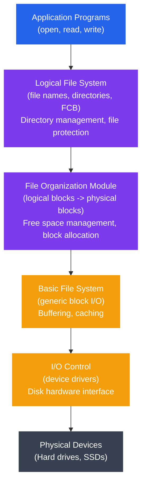
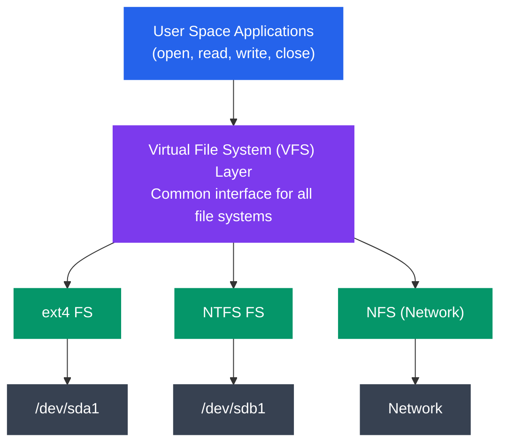

# File System Implementation

## What You'll Learn

In this tutorial, you'll explore how file systems are implemented at the physical level:

- Understand disk structure (platter, track, sector, cylinder)
- Master file allocation methods (contiguous, linked, indexed)
- Learn free space management techniques (bitmap, linked list)
- Explore directory implementation strategies
- Understand file system layers (logical, virtual, physical)
- Learn about Virtual File System (VFS) in Linux
- Work with superblocks, inode tables, and data blocks
- Mount and unmount file systems
- Use `df`, `du`, and `mount` commands
- Configure `/etc/fstab` for automatic mounting

---

## Disk Structure

### Physical Organization

```
┌─────────────────────────────────────────────────┐
│              Hard Disk Drive (HDD)              │
└─────────────────────────────────────────────────┘
                       │
        ┌──────────────┼──────────────┐
        │              │              │
    Platter 0      Platter 1      Platter 2
        │              │              │
    ┌───┴───┐      ┌───┴───┐      ┌───┴───┐
    │ Track │      │ Track │      │ Track │
    │   0   │      │   0   │      │   0   │
    │ Track │      │ Track │      │ Track │
    │   1   │      │   1   │      │   1   │
    │  ...  │      │  ...  │      │  ...  │
    └───────┘      └───────┘      └───────┘

┌──────────────────────────────────────────┐
│         Single Track (Top View)          │
│                                          │
│        ╔════════════════════╗           │
│     ╔══╝                    ╚══╗        │
│   ╔═╝    Sector Sector Sector  ╚═╗     │
│  ╔╝      [1]    [2]    [3] ...    ╚╗    │
│ ║                                   ║    │
│  ╚╗      Track divided into       ╔╝    │
│   ╚═╗    sectors (512B-4KB)    ╔═╝     │
│     ╚══╗                    ╔══╝        │
│        ╚════════════════════╝           │
└──────────────────────────────────────────┘
```

### Key Components

| Component | Description | Typical Size |
|-----------|-------------|--------------|
| **Platter** | Circular disk coated with magnetic material | 2.5" or 3.5" diameter |
| **Track** | Concentric circle on a platter | Thousands per platter |
| **Sector** | Smallest addressable unit on disk | 512 bytes or 4 KB |
| **Cylinder** | Same track across all platters | Varies by disk |
| **Cluster/Block** | Group of sectors (file system unit) | 4 KB typical |
| **Read/Write Head** | Reads/writes data magnetically | One per platter surface |

### Cylinder Concept

```
        Cylinder N (all Track N across platters)
              ┌─────────────┐
              │             │
    Platter 0 ├─── Track N ─┤
              │             │
    Platter 1 ├─── Track N ─┤
              │             │
    Platter 2 ├─── Track N ─┤
              │             │
              └─────────────┘
```

Cylinders are important for optimization - accessing all tracks in a cylinder requires no head movement.

---

## File Allocation Methods

How does the file system allocate disk blocks to files?

### 1. Contiguous Allocation

Each file occupies a **contiguous set of blocks** on disk.

```
┌─────────────────────────────────────────┐
│         Disk Blocks (0-19)              │
├──┬──┬──┬──┬──┬──┬──┬──┬──┬──┬──┬──┬──┬──┤
│  │■■│■■│■■│  │▓▓│▓▓│  │◆◆│◆◆│◆◆│◆◆│  │  │
└──┴──┴──┴──┴──┴──┴──┴──┴──┴──┴──┴──┴──┴──┘
   0  1  2  3  4  5  6  7  8  9 10 11 12 13

   ■■ = File A (blocks 1-3)
   ▓▓ = File B (blocks 5-6)
   ◆◆ = File C (blocks 8-11)
```

**Directory Entry**:
```
┌─────────┬────────────┬────────┐
│ Name    │ Start Block│ Length │
├─────────┼────────────┼────────┤
│ File A  │     1      │   3    │
│ File B  │     5      │   2    │
│ File C  │     8      │   4    │
└─────────┴────────────┴────────┘
```

**Advantages**:
- Simple to implement
- Excellent read performance (sequential access)
- Minimal seek time

**Disadvantages**:
- **External fragmentation**: Free space scattered in small holes
- Difficult to grow files
- Need to know file size at creation

**Example Usage**: CD-ROMs, DVDs (write-once media)

### 2. Linked Allocation

Each block contains a **pointer to the next block**.

```
┌─────────────────────────────────────────┐
│         Disk Blocks                     │
├──────────────────────────────────────────┤
│                                          │
│  Block 1         Block 5         Block 9 │
│  ┌──────────┐   ┌──────────┐   ┌──────┐ │
│  │ Data (A) │   │ Data (A) │   │Data(A)││
│  │ Next: 5  │──→│ Next: 9  │──→│Next:-1││ (File A)
│  └──────────┘   └──────────┘   └──────┘ │
│                                          │
│  Block 2         Block 7                 │
│  ┌──────────┐   ┌──────────┐            │
│  │ Data (B) │   │ Data (B) │            │
│  │ Next: 7  │──→│ Next:-1  │            │ (File B)
│  └──────────┘   └──────────┘            │
└──────────────────────────────────────────┘
```

**Directory Entry**:
```
┌─────────┬────────────┬────────────┐
│ Name    │ Start Block│ End Block  │
├─────────┼────────────┼────────────┤
│ File A  │     1      │     9      │
│ File B  │     2      │     7      │
└─────────┴────────────┴────────────┘
```

**Advantages**:
- No external fragmentation
- Easy to grow files (just allocate new block)
- No need to know file size in advance

**Disadvantages**:
- Poor random access performance (must traverse chain)
- Overhead of storing pointers
- Reliability issues (if one pointer corrupted, lose rest of file)

**Optimization - FAT (File Allocation Table)**:

Instead of storing pointers in blocks, store them in a table:

```
┌──────────────────────────────┐
│   File Allocation Table      │
├────────┬─────────────────────┤
│ Block  │ Next Block          │
├────────┼─────────────────────┤
│   0    │  -1 (unused)        │
│   1    │   5 (File A)        │
│   2    │   7 (File B)        │
│   3    │  -1 (unused)        │
│   4    │  -1 (unused)        │
│   5    │   9 (File A)        │
│   6    │  -1 (unused)        │
│   7    │  -1 (File B end)    │
│   8    │  -1 (unused)        │
│   9    │  -1 (File A end)    │
└────────┴─────────────────────┘
```

FAT can be cached in memory for faster access. Used by FAT16, FAT32 file systems.

### 3. Indexed Allocation

Each file has an **index block** containing pointers to data blocks.

```
┌──────────────────────────────────────────┐
│         File A - Index Block (Block 4)   │
│  ┌────────────────────────────────────┐  │
│  │ Index Block Pointers:              │  │
│  │  [0] → Block 1                     │  │
│  │  [1] → Block 5                     │  │
│  │  [2] → Block 9                     │  │
│  │  [3] → Block 12                    │  │
│  │  [4] → null                        │  │
│  │  ...                               │  │
│  └────────────────────────────────────┘  │
│           ↓      ↓      ↓      ↓         │
│        Block1  Block5  Block9  Block12   │
│        [Data]  [Data]  [Data]  [Data]    │
└──────────────────────────────────────────┘
```

**Directory Entry**:
```
┌─────────┬──────────────┐
│ Name    │ Index Block  │
├─────────┼──────────────┤
│ File A  │      4       │
│ File B  │      8       │
└─────────┴──────────────┘
```

**Advantages**:
- Fast random access (direct access to any block)
- No external fragmentation
- Easy to grow files (until index block full)

**Disadvantages**:
- Overhead of index block (even for small files)
- Limited file size (based on index block size)

**Multi-Level Indexing (Unix/Linux Inodes)**:

```
┌──────────────────────────────────────────┐
│              INODE                       │
├──────────────────────────────────────────┤
│ Direct Pointers (12):                    │
│  [0]  → Block 100  ──→ [Data]           │
│  [1]  → Block 101  ──→ [Data]           │
│  [2]  → Block 102  ──→ [Data]           │
│  ...                                     │
│  [11] → Block 111  ──→ [Data]           │
│                                          │
│ Single Indirect:                         │
│  [12] → Block 200  ──→ [Block pointers] │
│                         ↓   ↓   ↓       │
│                       [Data blocks]      │
│                                          │
│ Double Indirect:                         │
│  [13] → Block 300  ──→ [Indirect blocks]│
│                         ↓               │
│                    [Block pointers]     │
│                         ↓               │
│                    [Data blocks]        │
│                                          │
│ Triple Indirect:                         │
│  [14] → Block 400  ──→ [Double indirect]│
│                         ↓               │
│                    [Indirect blocks]    │
│                         ↓               │
│                    [Block pointers]     │
│                         ↓               │
│                    [Data blocks]        │
└──────────────────────────────────────────┘
```

**Maximum File Size Calculation** (assuming 4KB blocks, 4-byte pointers):

```
Pointers per block = 4096 / 4 = 1024

Direct blocks:        12 × 4KB        = 48 KB
Single indirect:    1024 × 4KB        = 4 MB
Double indirect: 1024² × 4KB          = 4 GB
Triple indirect: 1024³ × 4KB          = 4 TB

Total maximum: ~4 TB (for this configuration)
```

### Allocation Method Comparison

| Feature | Contiguous | Linked | Indexed |
|---------|------------|--------|---------|
| **Allocation** | Hard (fragmentation) | Easy | Easy |
| **Sequential Access** | Excellent | Good | Good |
| **Random Access** | Excellent | Poor | Excellent |
| **External Fragmentation** | Yes | No | No |
| **File Growth** | Difficult | Easy | Easy |
| **Overhead** | Low | Medium | Medium/High |
| **Reliability** | Good | Poor (chain) | Good |

---

## Free Space Management

How does the file system track which blocks are free?

### 1. Bitmap (Bit Vector)

One bit per block: `0` = free, `1` = allocated

```
Blocks:  0  1  2  3  4  5  6  7  8  9 10 11 12 13 14 15
Bitmap:  1  1  1  1  0  1  1  0  1  1  1  1  0  0  0  1
         └─ Used ─┘ Free └Used┘ Free └─ Used ─┘ Free  Used
```

**Advantages**:
- Simple and efficient
- Easy to find contiguous free blocks
- Fast to check if block is free

**Disadvantages**:
- Overhead: 1 bit per block
  - 1 TB disk, 4KB blocks = 256 million blocks = 32 MB bitmap

**Implementation Example**:

```c
#define BLOCK_SIZE 4096
#define TOTAL_BLOCKS 1000000
#define BITMAP_SIZE (TOTAL_BLOCKS / 8)  // 8 bits per byte

unsigned char bitmap[BITMAP_SIZE];

// Check if block is free
int is_block_free(int block_num) {
    int byte_index = block_num / 8;
    int bit_index = block_num % 8;
    return !(bitmap[byte_index] & (1 << bit_index));
}

// Allocate a block
void allocate_block(int block_num) {
    int byte_index = block_num / 8;
    int bit_index = block_num % 8;
    bitmap[byte_index] |= (1 << bit_index);
}

// Free a block
void free_block(int block_num) {
    int byte_index = block_num / 8;
    int bit_index = block_num % 8;
    bitmap[byte_index] &= ~(1 << bit_index);
}

// Find first free block
int find_free_block() {
    for (int i = 0; i < TOTAL_BLOCKS; i++) {
        if (is_block_free(i)) {
            return i;
        }
    }
    return -1;  // No free blocks
}
```

### 2. Linked List

Free blocks are linked together:

```
┌─────────────────────────────────────────┐
│   Free Block List                       │
│                                         │
│  Head → Block 4 → Block 7 → Block 12   │
│         ┌─────┐   ┌─────┐   ┌─────┐    │
│         │Next:│   │Next:│   │Next:│    │
│         │  7  │   │ 12  │   │ -1  │    │
│         └─────┘   └─────┘   └─────┘    │
└─────────────────────────────────────────┘
```

**Advantages**:
- No waste of space (uses free blocks themselves)
- Simple allocation (take from head of list)

**Disadvantages**:
- Difficult to find contiguous blocks
- Traversal needed (slow)
- Can't take advantage of multi-block I/O

### 3. Grouping

Store addresses of free blocks in first free block:

```
┌──────────────────────────────────────┐
│  Block 4 (Free Block Group)         │
│  ┌────────────────────────────────┐ │
│  │ Next Group: Block 50           │ │
│  │ Free Blocks:                   │ │
│  │   Block 7                      │ │
│  │   Block 12                     │ │
│  │   Block 15                     │ │
│  │   Block 18                     │ │
│  │   ...                          │ │
│  └────────────────────────────────┘ │
└──────────────────────────────────────┘
```

Combines advantages of linked list and array-based approaches.

---

## Directory Implementation

### 1. Linear List

Simple list of (filename, metadata) pairs:

```
┌────────────────────────────────────┐
│        Directory Block             │
├────────────────┬───────────────────┤
│ Filename       │ Metadata/Inode    │
├────────────────┼───────────────────┤
│ file1.txt      │ Inode 12345       │
│ file2.txt      │ Inode 12346       │
│ document.pdf   │ Inode 12347       │
│ program.exe    │ Inode 12348       │
│ ...            │ ...               │
└────────────────┴───────────────────┘
```

**Search**: Linear O(n)
**Insert**: O(1) at end, O(n) if sorted
**Delete**: O(n) (find + shift elements)

### 2. Hash Table

Use hash function on filename:

```
Hash(filename) → Bucket

┌─────────────────────────────────────┐
│        Hash Table                   │
├───────┬─────────────────────────────┤
│ Bucket│ Entries                     │
├───────┼─────────────────────────────┤
│   0   │ → file3.txt (Inode 12347)   │
│   1   │ → file1.txt (Inode 12345)   │
│       │ → file7.txt (Inode 12351)   │ (collision chain)
│   2   │ (empty)                     │
│   3   │ → file2.txt (Inode 12346)   │
│  ...  │ ...                         │
└───────┴─────────────────────────────┘
```

**Search**: O(1) average
**Insert**: O(1) average
**Delete**: O(1) average

**Challenge**: Fixed size - resizing is expensive

---

## File System Layers

Modern file systems are organized in layers:



```
┌────────────────────────────────────────┐
│   Application Programs                 │
│   (file operations: open, read, write) │
└────────────────────────────────────────┘
                 ↓
┌────────────────────────────────────────┐
│   Logical File System                  │
│   (file names, directories, FCB)       │
│   - Directory management               │
│   - File protection                    │
└────────────────────────────────────────┘
                 ↓
┌────────────────────────────────────────┐
│   File Organization Module             │
│   (logical blocks → physical blocks)   │
│   - Free space management              │
│   - Block allocation                   │
└────────────────────────────────────────┘
                 ↓
┌────────────────────────────────────────┐
│   Basic File System                    │
│   (generic block I/O)                  │
│   - Buffering, caching                 │
└────────────────────────────────────────┘
                 ↓
┌────────────────────────────────────────┐
│   I/O Control                          │
│   (device drivers)                     │
│   - Disk hardware interface            │
└────────────────────────────────────────┘
                 ↓
┌────────────────────────────────────────┐
│   Physical Devices                     │
│   (Hard drives, SSDs)                  │
└────────────────────────────────────────┘
```

---

## Virtual File System (VFS)

VFS provides an **abstraction layer** allowing different file systems to coexist:



```
┌────────────────────────────────────────────────┐
│         User Space Applications                │
│    (open, read, write, close system calls)     │
└────────────────────────────────────────────────┘
                      ↓
┌────────────────────────────────────────────────┐
│      Virtual File System (VFS) Layer           │
│   - Common interface for all file systems      │
│   - File objects, inode objects, dentry cache  │
└────────────────────────────────────────────────┘
         ↓               ↓               ↓
┌──────────────┐  ┌──────────────┐  ┌──────────────┐
│   ext4 FS    │  │   NTFS FS    │  │   NFS        │
└──────────────┘  └──────────────┘  └──────────────┘
         ↓               ↓               ↓
┌──────────────┐  ┌──────────────┐  ┌──────────────┐
│  /dev/sda1   │  │  /dev/sdb1   │  │   Network    │
└──────────────┘  └──────────────┘  └──────────────┘
```

### VFS Objects

```c
// VFS inode structure (simplified)
struct inode {
    unsigned long i_ino;           // Inode number
    unsigned int i_nlink;           // Hard link count
    uid_t i_uid;                    // Owner
    gid_t i_gid;                    // Group
    loff_t i_size;                  // File size
    struct timespec i_atime;        // Access time
    struct timespec i_mtime;        // Modification time
    struct timespec i_ctime;        // Change time
    
    struct inode_operations *i_op;  // Inode operations
    struct file_operations *i_fop;  // File operations
    struct super_block *i_sb;       // Superblock pointer
};

// File operations (function pointers)
struct file_operations {
    ssize_t (*read)(struct file *, char __user *, size_t, loff_t *);
    ssize_t (*write)(struct file *, const char __user *, size_t, loff_t *);
    int (*open)(struct inode *, struct file *);
    int (*release)(struct inode *, struct file *);
    // ... more operations
};
```

---

## Superblock, Inode Table, Data Blocks

### Typical File System Layout

```
┌──────────────────────────────────────────────────────┐
│                Disk/Partition                        │
├──────┬──────┬─────────┬──────────────┬──────────────┤
│ Boot │Super │  Inode  │ Data Bitmap  │ Data Blocks  │
│Block │Block │  Table  │  (optional)  │              │
└──────┴──────┴─────────┴──────────────┴──────────────┘
  1 blk  1 blk  Many blks  Few blocks   Most of disk
```

### 1. Superblock

Contains metadata about the file system:

```
┌─────────────────────────────────────┐
│          SUPERBLOCK                 │
├─────────────────────────────────────┤
│ Magic Number:        0xEF53 (ext4)  │
│ Block Size:          4096 bytes     │
│ Total Blocks:        10,000,000     │
│ Free Blocks:         5,234,567      │
│ Total Inodes:        2,500,000      │
│ Free Inodes:         1,800,234      │
│ First Data Block:    Block 100      │
│ Blocks Per Group:    32,768         │
│ Inodes Per Group:    8,192          │
│ Mount Count:         23             │
│ Max Mount Count:     30             │
│ Last Checked:        2024-01-15     │
│ File System State:   Clean          │
└─────────────────────────────────────┘
```

**Critical**: Often replicated across disk for reliability

### 2. Inode Table

Array of inodes (one per file):

```
┌─────────────────────────────────────┐
│        INODE TABLE                  │
├───────┬─────────────────────────────┤
│ Inode │ Contents                    │
├───────┼─────────────────────────────┤
│   1   │ [Root directory inode]      │
│   2   │ [Lost+found inode]          │
│  ...  │ ...                         │
│ 12345 │ [file1.txt inode]           │
│ 12346 │ [file2.txt inode]           │
│  ...  │ ...                         │
└───────┴─────────────────────────────┘
```

### 3. Data Blocks

Actual file content and directory entries:

```
┌─────────────────────────────────────┐
│        DATA BLOCKS                  │
├───────┬─────────────────────────────┤
│ Block │ Contents                    │
├───────┼─────────────────────────────┤
│  100  │ [Directory entries]         │
│  101  │ [File data]                 │
│  102  │ [File data]                 │
│  ...  │ ...                         │
└───────┴─────────────────────────────┘
```

---

## Mounting File Systems

**Mounting** attaches a file system to a directory (mount point) in the existing directory tree.

```
Before Mounting:
/
├── home
├── etc
└── mnt      ← Mount point (empty directory)

After Mounting /dev/sdb1 to /mnt:
/
├── home
├── etc
└── mnt      ← Now contains files from /dev/sdb1
    ├── photos
    ├── documents
    └── music
```

### Mount Command

```bash
# View currently mounted file systems
mount

# Mount a file system
sudo mount /dev/sdb1 /mnt

# Mount with specific type
sudo mount -t ext4 /dev/sdb1 /mnt

# Mount read-only
sudo mount -o ro /dev/sdb1 /mnt

# Unmount
sudo umount /mnt
```

### Mount Options

```bash
# Common mount options
sudo mount -o rw,noatime,errors=remount-ro /dev/sdb1 /mnt
#             │   │       └─ Remount read-only on errors
#             │   └─ Don't update access times (performance)
#             └─ Read-write mode
```

---

## /etc/fstab - File System Table

`/etc/fstab` configures automatic mounting at boot:

```bash
# /etc/fstab: static file system information
#
# <device>      <mount>   <type>  <options>         <dump> <pass>
UUID=abc-123    /         ext4    errors=remount-ro 0      1
UUID=def-456    /home     ext4    defaults          0      2
/dev/sdb1       /mnt/data ext4    defaults,noatime  0      2
/dev/sdc1       /backup   ext4    defaults,noauto   0      0
tmpfs           /tmp      tmpfs   defaults,size=2G  0      0
```

### Field Explanations

| Field | Description | Example |
|-------|-------------|---------|
| **Device** | Partition or UUID | `/dev/sda1` or `UUID=...` |
| **Mount Point** | Where to mount | `/home` |
| **Type** | File system type | `ext4`, `ntfs`, `tmpfs` |
| **Options** | Mount options | `defaults`, `noatime`, `ro` |
| **Dump** | Backup utility flag | `0` (no backup), `1` (backup) |
| **Pass** | fsck order | `0` (no check), `1` (first), `2` (after root) |

### Testing fstab

```bash
# Test mounting all entries in fstab
sudo mount -a

# Remount all file systems
sudo mount -a -o remount
```

---

## Disk Usage Commands

### df - Disk Free

Shows disk space usage for mounted file systems:

```bash
# Show disk usage
df -h

# Output:
# Filesystem      Size  Used Avail Use% Mounted on
# /dev/sda1       100G   45G   50G  48% /
# /dev/sdb1       500G  230G  245G  49% /home
# tmpfs           8.0G  1.2G  6.8G  15% /tmp
```

### du - Disk Usage

Shows disk space used by files and directories:

```bash
# Show size of current directory
du -sh .

# Show sizes of all subdirectories
du -h --max-depth=1

# Find largest directories
du -h | sort -h | tail -10

# Output:
# 4.0K    ./small_dir
# 120M    ./medium_dir
# 2.3G    ./large_dir
```

### Practical Examples

```bash
# Check disk space before and after operation
df -h /home
cp large_file.iso /home/user/
df -h /home

# Find which directory is using most space
du -h /var | sort -h | tail -5

# Check inode usage
df -i
```

---

## Practical Examples

### Example 1: Creating and Mounting a File System

```bash
# Create a 1GB file to use as a disk
dd if=/dev/zero of=disk.img bs=1M count=1024

# Create ext4 file system on it
mkfs.ext4 disk.img

# Create mount point
mkdir /tmp/mymount

# Mount the file system
sudo mount -o loop disk.img /tmp/mymount

# Use it
cd /tmp/mymount
echo "Hello" > test.txt

# Check disk usage
df -h /tmp/mymount

# Unmount
sudo umount /tmp/mymount
```

### Example 2: File Allocation Simulation (C)

```c
#include <stdio.h>
#include <stdlib.h>
#include <string.h>

#define BLOCK_SIZE 4096
#define TOTAL_BLOCKS 100

// Bitmap for free space management
unsigned char bitmap[TOTAL_BLOCKS / 8 + 1];

// Indexed allocation structure
typedef struct {
    char filename[64];
    int blocks[10];  // Index block (max 10 data blocks)
    int num_blocks;
} FileEntry;

FileEntry directory[10];
int num_files = 0;

// Check if block is free
int is_free(int block) {
    int byte = block / 8;
    int bit = block % 8;
    return !(bitmap[byte] & (1 << bit));
}

// Allocate a block
void allocate(int block) {
    int byte = block / 8;
    int bit = block % 8;
    bitmap[byte] |= (1 << bit);
}

// Free a block
void free_block(int block) {
    int byte = block / 8;
    int bit = block % 8;
    bitmap[byte] &= ~(1 << bit);
}

// Create file with indexed allocation
int create_file(const char *filename, int num_blocks_needed) {
    if (num_files >= 10 || num_blocks_needed > 10) {
        printf("Error: Cannot create file\n");
        return -1;
    }
    
    FileEntry *file = &directory[num_files];
    strcpy(file->filename, filename);
    file->num_blocks = 0;
    
    // Allocate blocks
    for (int i = 0; i < TOTAL_BLOCKS && file->num_blocks < num_blocks_needed; i++) {
        if (is_free(i)) {
            file->blocks[file->num_blocks++] = i;
            allocate(i);
        }
    }
    
    if (file->num_blocks < num_blocks_needed) {
        printf("Error: Not enough free blocks\n");
        return -1;
    }
    
    num_files++;
    printf("Created file '%s' with %d blocks\n", filename, num_blocks_needed);
    return 0;
}

// List files
void list_files() {
    printf("\n--- Directory Listing ---\n");
    for (int i = 0; i < num_files; i++) {
        FileEntry *file = &directory[i];
        printf("File: %s\n", file->filename);
        printf("  Blocks: ");
        for (int j = 0; j < file->num_blocks; j++) {
            printf("%d ", file->blocks[j]);
        }
        printf("\n");
    }
    printf("------------------------\n");
}

int main() {
    // Initialize bitmap (all blocks free)
    memset(bitmap, 0, sizeof(bitmap));
    
    // Create some files
    create_file("file1.txt", 3);
    create_file("file2.txt", 5);
    create_file("file3.txt", 2);
    
    // List files
    list_files();
    
    // Show free blocks
    int free_count = 0;
    for (int i = 0; i < TOTAL_BLOCKS; i++) {
        if (is_free(i)) free_count++;
    }
    printf("Free blocks: %d/%d\n", free_count, TOTAL_BLOCKS);
    
    return 0;
}
```

---

## Exercises

### Beginner

1. **Disk Structure**: Calculate how many bytes are in a track if it has 64 sectors of 512 bytes each.

2. **Mount Practice**: Mount a USB drive to `/mnt/usb`, create a file on it, then safely unmount it.

3. **Disk Usage**: Use `df` and `du` to find the largest directory in your home folder.

### Intermediate

4. **File Allocation**: Given a file of 50 KB and a block size of 4 KB, how many blocks are needed? How would this be allocated using:
   - Contiguous allocation?
   - Linked allocation?
   - Indexed allocation (with direct pointers only)?

5. **Bitmap Implementation**: Implement a bitmap free space manager in C that supports allocate, free, and find_contiguous (find N contiguous free blocks).

6. **fstab Configuration**: Create an `/etc/fstab` entry for automatically mounting a partition at boot with the `noatime` option.

### Advanced

7. **VFS Simulation**: Write a C program that simulates a VFS layer supporting two "file systems" (simple data structures) with a common interface.

8. **Multi-Level Indexing**: Calculate the maximum file size for a file system with:
   - Block size: 8 KB
   - Pointer size: 8 bytes
   - 10 direct pointers, 1 single indirect, 1 double indirect, 1 triple indirect

9. **File System Creation**: Create a custom file system image file (using `dd` and `mkfs`), mount it, create files, unmount, then write a C program that reads the superblock and inode table directly from the image file.

---

## Key Takeaways

1. **Disk Structure**: Platters → Tracks → Sectors → Blocks (file system unit)

2. **Three Allocation Methods**:
   - **Contiguous**: Fast, fragmentation issues
   - **Linked**: No fragmentation, poor random access
   - **Indexed**: Best of both, used by modern systems (with multi-level)

3. **Free Space**: Bitmap is most efficient for modern systems

4. **File System Layers**: Abstract from logical operations to physical I/O

5. **VFS**: Allows multiple file system types to coexist with common interface

6. **Superblock**: Critical metadata about file system (size, state, etc.)

7. **Mounting**: Attaches file system to directory tree

8. **fstab**: Automates mounting at boot time

---

## Navigation

- **Previous**: [01. File Systems Fundamentals](./01_file_systems.md)
- **Next**: [03. Directory Structure](./03_directory_structure.md)
- **Section Index**: [Storage Management](./README.md)

---

## Further Reading

- `man mount` - mount command
- `man fstab` - file system table format
- [Linux VFS Documentation](https://www.kernel.org/doc/html/latest/filesystems/vfs.html)
- "Operating System Concepts" - Chapter 14: File System Implementation
