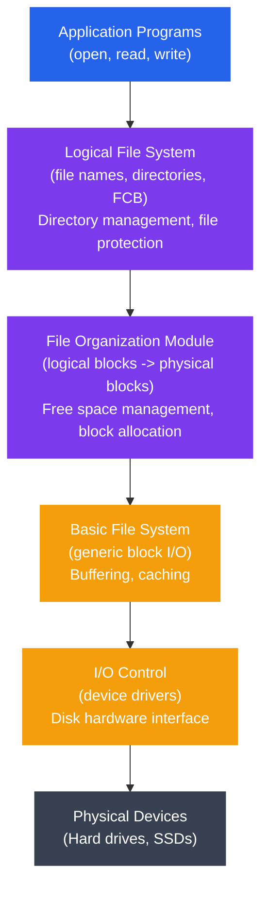
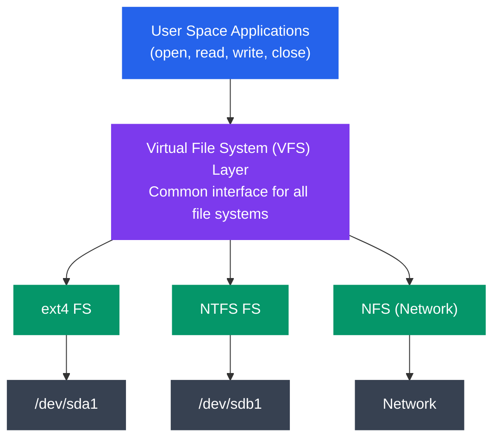

# File System Implementation

## Is Tutorial Mein Kya Seekhoge

Pichhle file mein humne dekha file systems kya hote hain aur kyun zaruri hain. Ab thoda deep dive karte hain — jab tum `file.txt` create karte ho aur usme kuch likhte ho, actually disk ke andar hota kya hai? Data kaha jaata hai, kaise track hota hai, aur OS ko kaise pata chalta hai ki konsa block free hai aur konsa kisi file ka hai?

Is file mein cover karenge:

- Disk ka physical structure (platter, track, sector, cylinder) — jaise ek CD ya hard disk ke andar actually kya ghoomta hai
- File allocation methods (contiguous, linked, indexed) — file ko disk pe blocks kaise assign karte hain
- Free space management (bitmap, linked list) — OS ko kaise pata free space kaha hai
- Directory implementation — folder ke andar file names kaise store hote hain
- File system layers (logical, virtual, physical) — Zomato app se lekar kitchen tak ka pura pipeline
- Linux ka Virtual File System (VFS) — ek common interface jo alag-alag file systems ko ek jaisa dikhata hai
- Superblock, inode table, data blocks — file system ka "database schema"
- Mount/unmount kaise hota hai
- `df`, `du`, `mount` commands practically use karna
- `/etc/fstab` — boot ke time automatic mounting ka setup

Socho ye poora chapter ek building ke construction jaisa hai — pehle foundation (disk structure) samjhenge, phir rooms allocate karna (allocation methods), phir har room ka address book (directory), aur last mein pura building management system (VFS, mounting).

---

## Disk Structure

### Kya Hota Hai Physically?

Jab tum "disk" bolte ho, actual hardware level pe ek Hard Disk Drive (HDD) mein spinning **platters** hote hain — bilkul CD/DVD jaise circular disks, bas magnetic coating ke saath. Ek arm (read/write head) in platters ke upar ghoomta hai aur data read/write karta hai. SSD mein ye mechanical parts nahi hote (wo pure electronic hai), lekin concepts samajhne ke liye HDD ka model sabse clear hai — isliye OS books usi se explain karte hain.

```
┌─────────────────────────────────────────────────┐
│              Hard Disk Drive (HDD)              │
└─────────────────────────────────────────────────┘
                       │
        ┌──────────────┼──────────────┐
        │              │              │
    Platter 0      Platter 1      Platter 2
        │              │              │
    ┌───┴───┐      ┌───┴───┐      ┌───┴───┐
    │ Track │      │ Track │      │ Track │
    │   0   │      │   0   │      │   0   │
    │ Track │      │ Track │      │ Track │
    │   1   │      │   1   │      │   1   │
    │  ...  │      │  ...  │      │  ...  │
    └───────┘      └───────┘      └───────┘

┌──────────────────────────────────────────┐
│         Single Track (Top View)          │
│                                          │
│        ╔════════════════════╗           │
│     ╔══╝                    ╚══╗        │
│   ╔═╝    Sector Sector Sector  ╚═╗     │
│  ╔╝      [1]    [2]    [3] ...    ╚╗    │
│ ║                                   ║    │
│  ╚╗      Track divided into       ╔╝    │
│   ╚═╗    sectors (512B-4KB)    ╔═╝     │
│     ╚══╗                    ╔══╝        │
│        ╚════════════════════╝           │
└──────────────────────────────────────────┘
```

Socho ek CD ki tarah — usme concentric circles hote hain (jaise pani mein pattharfekne se ripples banti hain). Har circle ek **track** hai. Har track ko chhote-chhote pieces mein divide kiya jata hai — wo **sectors** hain. Ek sector disk ka sabse chhota addressable unit hota hai — matlab OS kabhi bhi half-sector read/write nahi kar sakta, poora sector hi lena padega.

### Key Components — Ek Line Mein Yaad Rakho

| Component | Description | Typical Size |
|-----------|-------------|--------------|
| **Platter** | Magnetic coating wala circular disk | 2.5" ya 3.5" diameter |
| **Track** | Platter pe concentric circle | Har platter pe hazaaron |
| **Sector** | Disk ka smallest addressable unit | 512 bytes ya 4 KB |
| **Cylinder** | Sab platters ka same-number track | Disk pe depend karta hai |
| **Cluster/Block** | Sectors ka group (file system ki unit) | Typically 4 KB |
| **Read/Write Head** | Magnetically data read/write karta hai | Har platter surface pe ek |

> [!info]
> Sector hardware ki unit hai, block/cluster file system ki unit hai. File system kabhi ek sector allocate nahi karta — hamesha ek "block" allocate karta hai jo usually multiple sectors ka group hota hai (jaise 8 sectors x 512B = 4KB block). Isse management simple ho jata hai.

### Cylinder Concept — Bina Head Move Kiye Access

```
        Cylinder N (all Track N across platters)
              ┌─────────────┐
              │             │
    Platter 0 ├─── Track N ─┤
              │             │
    Platter 1 ├─── Track N ─┤
              │             │
    Platter 2 ├─── Track N ─┤
              │             │
              └─────────────┘
```

Ye important concept hai. Har platter pe same track number ko mila do (jaise sab platters ka Track 5) — ye ban jata hai ek **cylinder**. Kyun zaruri hai? Kyunki sab platters ke read/write heads ek hi mechanical arm pe lage hote hain — sab ek saath move karte hain. Matlab agar Track 5 pe head hai, toh sab platters ka Track 5 bina arm move kiye access ho sakta hai (bas different head activate karna padta hai, jo instant hai).

Isliye OS jab possible ho, related data ko same cylinder mein rakhne ki koshish karta hai — jaise Swiggy delivery boy same building ke multiple floors pe order deliver kare bina bike start kiye, sirf lift use karke. Cylinder ke andar movement "free" hai, lekin cylinder-to-cylinder movement mein seek time lagta hai (arm physically move karna padta hai) — aur seek time hi disk ka sabse slow operation hota hai.

---

## File Allocation Methods

Ab asli sawaal — jab tum ek 20KB file save karte ho, OS ko decide karna hai ki disk pe kaunse blocks is file ko denge. Isko file allocation kehte hain, aur teen major strategies hain.

### 1. Contiguous Allocation

Idea simple hai: file ke sare blocks ek row mein, ek dusre se **sath-sath (contiguous)** rakho.

```
┌─────────────────────────────────────────┐
│         Disk Blocks (0-19)              │
├──┬──┬──┬──┬──┬──┬──┬──┬──┬──┬──┬──┬──┬──┤
│  │■■│■■│■■│  │▓▓│▓▓│  │◆◆│◆◆│◆◆│◆◆│  │  │
└──┴──┴──┴──┴──┴──┴──┴──┴──┴──┴──┴──┴──┴──┘
   0  1  2  3  4  5  6  7  8  9 10 11 12 13

   ■■ = File A (blocks 1-3)
   ▓▓ = File B (blocks 5-6)
   ◆◆ = File C (blocks 8-11)
```

**Directory Entry**:
```
┌─────────┬────────────┬────────┐
│ Name    │ Start Block│ Length │
├─────────┼────────────┼────────┤
│ File A  │     1      │   3    │
│ File B  │     5      │   2    │
│ File C  │     8      │   4    │
└─────────┴────────────┴────────┘
```

Socho ek movie theater mein group booking — tumhe 4 continuous seats chahiye taaki sab saath baith sako. Yahi contiguous allocation hai — file ko ek continuous chunk mil jata hai.

**Advantages**:
- Implement karna bahut simple hai
- Sequential read bahut fast hai (head ko jump nahi karna padta)
- Seek time minimum

**Disadvantages**:
- **External fragmentation**: Jaise movie theater mein bahut sari chhoti-chhoti gaps ban jaati hain jahan koi bhi bada group nahi baith sakta — free space bikhar jata hai chhote-chhote holes mein
- File ko grow karna mushkil — agar File A ko 2 blocks aur chahiye, lekin peeche File B baitha hai, toh space hi nahi hai
- File create karte waqt hi uska final size pata hona chahiye — practically bahut restrictive hai

**Example Usage**: CD-ROMs, DVDs (write-once media) — kyunki wahan file kabhi grow nahi hoti, ye perfect fit hai.

### 2. Linked Allocation

Ab dusra approach — har block mein file ka data hoga, saath mein ek **pointer** jo agle block ka address batata hai. Bilkul ek linked list jaisa (agar tumne DSA padha hai toh yaad hoga).

```
┌─────────────────────────────────────────┐
│         Disk Blocks                     │
├──────────────────────────────────────────┤
│                                          │
│  Block 1         Block 5         Block 9 │
│  ┌──────────┐   ┌──────────┐   ┌──────┐ │
│  │ Data (A) │   │ Data (A) │   │Data(A)││
│  │ Next: 5  │──→│ Next: 9  │──→│Next:-1││ (File A)
│  └──────────┘   └──────────┘   └──────┘ │
│                                          │
│  Block 2         Block 7                 │
│  ┌──────────┐   ┌──────────┐            │
│  │ Data (B) │   │ Data (B) │            │
│  │ Next: 7  │──→│ Next:-1  │            │ (File B)
│  └──────────┘   └──────────┘            │
└──────────────────────────────────────────┘
```

**Directory Entry**:
```
┌─────────┬────────────┬────────────┐
│ Name    │ Start Block│ End Block  │
├─────────┼────────────┼────────────┤
│ File A  │     1      │     9      │
│ File B  │     2      │     7      │
└─────────┴────────────┴────────────┘
```

Yahan directory ko sirf start block yaad rakhna hai — baaki chain follow karke pata chal jayega. Bilkul WhatsApp forwarded message chain ki tarah — har message next wale ka reference rakhta hai.

**Advantages**:
- External fragmentation bilkul nahi — koi bhi free block use ho sakta hai, contiguous hona zaruri nahi
- File grow karna easy — bas ek naya free block dhoondo aur chain mein jod do
- File size pehle se pata hona zaruri nahi

**Disadvantages**:
- Random access bahut slow hai — agar tumhe file ke 100th block ka data chahiye, toh chain ke 99 blocks traverse karne padenge (koi shortcut nahi)
- Har block mein kuch space pointer store karne mein waste hota hai
- Reliability ka bada issue — agar beech ka ek pointer corrupt ho gaya (disk bad sector), toh uske aage ki poori file gayi. Jaise ek train ki bogi disconnect ho jaye, peeche ki sab bogiyan chhoot jaati hain

> [!warning]
> Linked allocation ka sabse bada risk yehi hai — single point of failure. Isi wajah se practical file systems isko raw form mein use nahi karte, balki iska ek smarter version use karte hain — FAT.

**Optimization - FAT (File Allocation Table)**:

Idea ye hai ki pointers ko data blocks ke andar mat rakho — unko ek separate table mein le aao jo memory mein cache ho sake:

```
┌──────────────────────────────┐
│   File Allocation Table      │
├────────┬─────────────────────┤
│ Block  │ Next Block          │
├────────┼─────────────────────┤
│   0    │  -1 (unused)        │
│   1    │   5 (File A)        │
│   2    │   7 (File B)        │
│   3    │  -1 (unused)        │
│   4    │  -1 (unused)        │
│   5    │   9 (File A)        │
│   6    │  -1 (unused)        │
│   7    │  -1 (File B end)    │
│   8    │  -1 (unused)        │
│   9    │  -1 (File A end)    │
└────────┴─────────────────────┘
```

Ye poora FAT table RAM mein cache ho sakta hai, isliye chain traverse karne ke liye baar-baar disk read nahi karna padta — sirf memory mein table dekh lo. Yahi FAT16 aur FAT32 file systems (purane Windows/USB drives) ka core idea hai. Aaj bhi tumhare USB pendrive/SD card mein FAT32 format mil jayega kyunki simple aur cross-platform compatible hai.

### 3. Indexed Allocation

Third approach, aur ye industry standard bana — sabse zyada smart. Har file ka ek dedicated **index block** hota hai jisme sirf uske data blocks ke pointers stored hote hain — koi chain nahi, direct lookup table.

```
┌──────────────────────────────────────────┐
│         File A - Index Block (Block 4)   │
│  ┌────────────────────────────────────┐  │
│  │ Index Block Pointers:              │  │
│  │  [0] → Block 1                     │  │
│  │  [1] → Block 5                     │  │
│  │  [2] → Block 9                     │  │
│  │  [3] → Block 12                    │  │
│  │  [4] → null                        │  │
│  │  ...                               │  │
│  └────────────────────────────────────┘  │
│           ↓      ↓      ↓      ↓         │
│        Block1  Block5  Block9  Block12   │
│        [Data]  [Data]  [Data]  [Data]    │
└──────────────────────────────────────────┘
```

**Directory Entry**:
```
┌─────────┬──────────────┐
│ Name    │ Index Block  │
├─────────┼──────────────┤
│ File A  │      4       │
│ File B  │      8       │
└─────────┴──────────────┘
```

Socho tumhare IRCTC ka PNR — usme ek index number hota hai jo directly tumhe coach, seat number sab bata deta hai, bina kisi chain follow kiye. Yahi indexed allocation ka fayda hai — file ke kisi bhi block ko direct access kar sakte ho, index block se seedha uska address mil jata hai.

**Advantages**:
- Random access bahut fast — kisi bhi block ka pointer index se turant mil jata hai
- External fragmentation nahi
- File grow karna easy (jab tak index block mein jagah hai)

**Disadvantages**:
- Chhoti files ke liye bhi ek pura index block chahiye — overhead
- File size limited hai index block ki capacity se (kitne pointers fit ho sakte hain)

**Multi-Level Indexing (Unix/Linux Inodes)**:

Ab yahan asli magic hai. Real file systems (ext4, jaise Linux use karta hai) is problem ko solve karte hain — chhoti file ke liye chhota overhead, badi file ke liye bhi support — **multi-level indexing** se. Iska structure hai **inode**:

```
┌──────────────────────────────────────────┐
│              INODE                       │
├──────────────────────────────────────────┤
│ Direct Pointers (12):                    │
│  [0]  → Block 100  ──→ [Data]           │
│  [1]  → Block 101  ──→ [Data]           │
│  [2]  → Block 102  ──→ [Data]           │
│  ...                                     │
│  [11] → Block 111  ──→ [Data]           │
│                                          │
│ Single Indirect:                         │
│  [12] → Block 200  ──→ [Block pointers] │
│                         ↓   ↓   ↓       │
│                       [Data blocks]      │
│                                          │
│ Double Indirect:                         │
│  [13] → Block 300  ──→ [Indirect blocks]│
│                         ↓               │
│                    [Block pointers]     │
│                         ↓               │
│                    [Data blocks]        │
│                                          │
│ Triple Indirect:                         │
│  [14] → Block 400  ──→ [Double indirect]│
│                         ↓               │
│                    [Indirect blocks]    │
│                         ↓               │
│                    [Block pointers]     │
│                         ↓               │
│                    [Data blocks]        │
└──────────────────────────────────────────┘
```

Iska idea samajhna easy hai agar ek analogy le lo — socho tumhara ghar ka address book:
- Pehle **12 direct pointers** — jaise tumhare "favorite contacts" jinhe tum seedha call kar sakte ho. Chhoti files (48KB tak) sirf inhi se serve ho jaati hain — koi extra lookup nahi, bahut fast.
- Fir agar file badi hai, ek **single indirect** pointer hai — jaise ek "contact list ka page" jisme aur 1024 numbers likhe hain. Ek extra hop lagta hai lekin bahut zyada data cover ho jata hai.
- Uske baad **double indirect** — ek page jo aur pages ki list deta hai, jo phir numbers deti hai. Do hops.
- Aur bahut hi rare, extreme large files ke liye **triple indirect** — teen hops deep.

Chhoti files (jo 99% hoti hain — configs, scripts, chhoti documents) ke liye sirf direct pointers use hote hain, matlab bahut fast access. Sirf badi files (jaise videos, database dumps) ke liye indirect blocks ka use hota hai — jinke liye thoda extra lookup time acceptable hai.

**Maximum File Size Calculation** (assuming 4KB blocks, 4-byte pointers):

```
Pointers per block = 4096 / 4 = 1024

Direct blocks:        12 × 4KB        = 48 KB
Single indirect:    1024 × 4KB        = 4 MB
Double indirect: 1024² × 4KB          = 4 GB
Triple indirect: 1024³ × 4KB          = 4 TB

Total maximum: ~4 TB (for this configuration)
```

> [!tip]
> Interview mein aksar puchte hain "ext2/ext3 mein max file size kyun limited hai?" — jawab yehi hai: inode ke andar fixed number of direct/indirect pointers hote hain, isliye ek mathematical upper bound ban jata hai. Newer file systems (ext4, XFS, Btrfs) extents use karte hain jo is limit ko aur bada bana dete hain.

### Allocation Method Comparison

| Feature | Contiguous | Linked | Indexed |
|---------|------------|--------|---------|
| **Allocation** | Hard (fragmentation) | Easy | Easy |
| **Sequential Access** | Excellent | Good | Good |
| **Random Access** | Excellent | Poor | Excellent |
| **External Fragmentation** | Yes | No | No |
| **File Growth** | Difficult | Easy | Easy |
| **Overhead** | Low | Medium | Medium/High |
| **Reliability** | Good | Poor (chain) | Good |

Simple mental model: Contiguous = fast but rigid, Linked = flexible but fragile, Indexed = best balance — isliye modern OS mostly indexed (multi-level) use karte hain.

---

## Free Space Management

Ab dusra bada sawaal — OS ko kaise pata chalta hai konsa block free hai aur konsa allocated? Isi ke liye free space management techniques hain.

### 1. Bitmap (Bit Vector)

Sabse popular aur intuitive approach — har block ke liye ek single **bit**: `0` matlab free, `1` matlab allocated.

```
Blocks:  0  1  2  3  4  5  6  7  8  9 10 11 12 13 14 15
Bitmap:  1  1  1  1  0  1  1  0  1  1  1  1  0  0  0  1
         └─ Used ─┘ Free └Used┘ Free └─ Used ─┘ Free  Used
```

Socho ek movie theater ki seating chart app — jaise BookMyShow mein har seat green (available) ya red (booked) dikhti hai. Bitmap bilkul yehi hai — poore disk ka ek "occupancy map".

**Advantages**:
- Simple aur efficient
- Contiguous free blocks dhoondna easy — bas consecutive 0s dekho
- Kisi bhi block ka status check karna O(1)

**Disadvantages**:
- Overhead hota hai — 1 bit per block
  - Example: 1 TB disk, 4KB blocks = 25.6 crore (256 million) blocks = 32 MB ka bitmap. Chhota lagta hai lekin scale pe matter karta hai.

**Implementation Example**:

```c
#define BLOCK_SIZE 4096
#define TOTAL_BLOCKS 1000000
#define BITMAP_SIZE (TOTAL_BLOCKS / 8)  // 8 bits per byte

unsigned char bitmap[BITMAP_SIZE];

// Check if block is free
int is_block_free(int block_num) {
    int byte_index = block_num / 8;
    int bit_index = block_num % 8;
    return !(bitmap[byte_index] & (1 << bit_index));
}

// Allocate a block
void allocate_block(int block_num) {
    int byte_index = block_num / 8;
    int bit_index = block_num % 8;
    bitmap[byte_index] |= (1 << bit_index);
}

// Free a block
void free_block(int block_num) {
    int byte_index = block_num / 8;
    int bit_index = block_num % 8;
    bitmap[byte_index] &= ~(1 << bit_index);
}

// Find first free block
int find_free_block() {
    for (int i = 0; i < TOTAL_BLOCKS; i++) {
        if (is_block_free(i)) {
            return i;
        }
    }
    return -1;  // No free blocks
}
```

Yahan bit manipulation (`&`, `|`, `~`, shift operators) use ho raha hai — agar tum Node.js/TS background se ho toh ye kaafi low-level lagega, lekin isi wajah se ye itna fast aur memory-efficient hai. Ek byte mein 8 blocks ka status fit ho jata hai.

### 2. Linked List

Ek alternate approach — sare free blocks ko aapas mein ek linked list jaisa jod do:

```
┌─────────────────────────────────────────┐
│   Free Block List                       │
│                                         │
│  Head → Block 4 → Block 7 → Block 12   │
│         ┌─────┐   ┌─────┐   ┌─────┐    │
│         │Next:│   │Next:│   │Next:│    │
│         │  7  │   │ 12  │   │ -1  │    │
│         └─────┘   └─────┘   └─────┘    │
└─────────────────────────────────────────┘
```

**Advantages**:
- Koi extra space waste nahi hoti — free blocks khud pointers store karte hain (jab block free hai toh uska data toh use ho hi nahi raha)
- Allocation simple — bas list ke head se ek block utha lo

**Disadvantages**:
- Contiguous free blocks dhoondna mushkil hai (traverse karna padega, guarantee nahi ki continuous milenge)
- Traversal slow hai (linked list ki classic weakness)
- Multi-block I/O ka fayda nahi utha sakte (kyunki blocks scattered ho sakte hain)

### 3. Grouping

Ek smart hybrid trick — pehle free block ke andar hi bahut sare doosre free blocks ke addresses store kar do:

```
┌──────────────────────────────────────┐
│  Block 4 (Free Block Group)         │
│  ┌────────────────────────────────┐ │
│  │ Next Group: Block 50           │ │
│  │ Free Blocks:                   │ │
│  │   Block 7                      │ │
│  │   Block 12                     │ │
│  │   Block 15                     │ │
│  │   Block 18                     │ │
│  │   ...                          │ │
│  └────────────────────────────────┘ │
└──────────────────────────────────────┘
```

Isse linked list aur array-based approach dono ke fayde mil jaate hain — ek hi disk access mein bahut saare free blocks ke addresses mil jaate hain (array jaisi speed), lekin space bhi waste nahi hoti (linked list jaisi efficiency, kyunki khud free blocks hi ye info store kar rahe hain).

---

## Directory Implementation

Ab folder ke andar filenames kaise organize/store hote hain, wo dekhte hain.

### 1. Linear List

Sabse simple approach — filename aur uska metadata/inode number ek list mein daal do:

```
┌────────────────────────────────────┐
│        Directory Block             │
├────────────────┬───────────────────┤
│ Filename       │ Metadata/Inode    │
├────────────────┼───────────────────┤
│ file1.txt      │ Inode 12345       │
│ file2.txt      │ Inode 12346       │
│ document.pdf   │ Inode 12347       │
│ program.exe    │ Inode 12348       │
│ ...            │ ...               │
└────────────────┴───────────────────┘
```

**Search**: Linear O(n)
**Insert**: O(1) end mein, O(n) agar sorted rakhna hai
**Delete**: O(n) (dhoondo + baaki elements shift karo)

Ye ek excel sheet mein manually filenames dhoondne jaisa hai — kaam ho jata hai lekin bade folder mein slow ho jayega (imagine karo Downloads folder mein 10,000 files ho aur linear search ho raha ho).

### 2. Hash Table

Better approach — filename pe ek hash function chala do jo directly uska bucket/location bata de:

```
Hash(filename) → Bucket

┌─────────────────────────────────────┐
│        Hash Table                   │
├───────┬─────────────────────────────┤
│ Bucket│ Entries                     │
├───────┼─────────────────────────────┤
│   0   │ → file3.txt (Inode 12347)   │
│   1   │ → file1.txt (Inode 12345)   │
│       │ → file7.txt (Inode 12351)   │ (collision chain)
│   2   │ (empty)                     │
│   3   │ → file2.txt (Inode 12346)   │
│  ...  │ ...                         │
└───────┴─────────────────────────────┘
```

**Search**: O(1) average
**Insert**: O(1) average
**Delete**: O(1) average

**Challenge**: Fixed size — resize karna expensive hai (jaise agar table ne 1000 buckets ke liye design kiya lekin file ho gaayi 50,000, toh collisions bahut badh jayenge aur rehash karna padega — ek costly operation).

Ye bilkul JavaScript ka `Object`/`Map` implementation jaisa concept hai, jo tumhe already familiar hoga — bas yahan filenames ke liye use ho raha hai instead of arbitrary keys.

---

## File System Layers

Modern file systems ek single blob nahi hote — ye layers mein organize hote hain, har layer apna specific kaam karti hai aur neeche wali layer pe depend karti hai.



```
┌────────────────────────────────────────┐
│   Application Programs                 │
│   (file operations: open, read, write) │
└────────────────────────────────────────┘
                 ↓
┌────────────────────────────────────────┐
│   Logical File System                  │
│   (file names, directories, FCB)       │
│   - Directory management               │
│   - File protection                    │
└────────────────────────────────────────┘
                 ↓
┌────────────────────────────────────────┐
│   File Organization Module             │
│   (logical blocks → physical blocks)   │
│   - Free space management              │
│   - Block allocation                   │
└────────────────────────────────────────┘
                 ↓
┌────────────────────────────────────────┐
│   Basic File System                    │
│   (generic block I/O)                  │
│   - Buffering, caching                 │
└────────────────────────────────────────┘
                 ↓
┌────────────────────────────────────────┐
│   I/O Control                          │
│   (device drivers)                     │
│   - Disk hardware interface            │
└────────────────────────────────────────┘
                 ↓
┌────────────────────────────────────────┐
│   Physical Devices                     │
│   (Hard drives, SSDs)                  │
└────────────────────────────────────────┘
```

Iska analogy Zomato order flow se samjho:
- **Application Programs**: Tum app pe "Order Now" click karte ho (ye tumhara `open()`, `read()`, `write()` call hai)
- **Logical File System**: Zomato ka backend jo dekhta hai "kaunsa restaurant, kaunsa user, permission hai ke nahi" — filename ko translate karta hai ek File Control Block (FCB)/inode mein
- **File Organization Module**: Ye decide karta hai actual kitchen (physical blocks) mein order kaise route hoga — kaunse free slots available hain
- **Basic File System**: Generic buffering/caching layer — jaise order queue jo requests ko efficiently batch karti hai
- **I/O Control**: Actual delivery boy/driver jo hardware (bike) chalata hai
- **Physical Devices**: Restaurant kitchen jaha khana actually banta hai (yahan disk/SSD)

Har layer apni responsibility tak simit hai — upar wali layer ko neeche ka implementation detail pata hone ki zaroorat nahi. Isi wajah se tum ext4, NTFS, ya kuch bhi file system use karo, `fopen()` ka syntax same rehta hai.

---

## Virtual File System (VFS)

### Kya Hota Hai VFS?

Ab yahan ek interesting problem hai — tumhare system mein ek saath `/` pe ext4 mil sakta hai, ek USB drive NTFS format mein, aur kabhi network drive NFS se mounted ho sakta hai. Application ko in sab ke liye alag-alag code likhna pade toh nightmare ho jayega. Isi problem ko solve karta hai **VFS** — ek **abstraction layer** jo saare file systems ko ek common interface ke peeche chhupa deta hai.



```
┌────────────────────────────────────────────────┐
│         User Space Applications                │
│    (open, read, write, close system calls)     │
└────────────────────────────────────────────────┘
                      ↓
┌────────────────────────────────────────────────┐
│      Virtual File System (VFS) Layer           │
│   - Common interface for all file systems      │
│   - File objects, inode objects, dentry cache  │
└────────────────────────────────────────────────┘
         ↓               ↓               ↓
┌──────────────┐  ┌──────────────┐  ┌──────────────┐
│   ext4 FS    │  │   NTFS FS    │  │   NFS        │
└──────────────┘  └──────────────┘  └──────────────┘
         ↓               ↓               ↓
┌──────────────┐  ┌──────────────┐  ┌──────────────┐
│  /dev/sda1   │  │  /dev/sdb1   │  │   Network    │
└──────────────┘  └──────────────┘  └──────────────┘
```

Ye bilkul UPI jaisa concept hai — tumhare paas PhonePe ho, Google Pay ho, ya Paytm, sabka backend alag bank se connect hota hai (SBI, HDFC, ICICI), lekin UPI ek **common protocol/interface** provide karta hai jisse tum kisi ko bhi paisa bhej sakte ho bina ye jaane ki uska bank kaunsa hai. VFS bhi yahi karta hai — application ko sirf `open()`, `read()`, `write()` pata hona chahiye; VFS internally decide karta hai actual filesystem (ext4/NTFS/NFS) ko kaunsa call route karna hai.

### VFS Objects

VFS internally kuch key data structures maintain karta hai:

```c
// VFS inode structure (simplified)
struct inode {
    unsigned long i_ino;           // Inode number
    unsigned int i_nlink;           // Hard link count
    uid_t i_uid;                    // Owner
    gid_t i_gid;                    // Group
    loff_t i_size;                  // File size
    struct timespec i_atime;        // Access time
    struct timespec i_mtime;        // Modification time
    struct timespec i_ctime;        // Change time
    
    struct inode_operations *i_op;  // Inode operations
    struct file_operations *i_fop;  // File operations
    struct super_block *i_sb;       // Superblock pointer
};

// File operations (function pointers)
struct file_operations {
    ssize_t (*read)(struct file *, char __user *, size_t, loff_t *);
    ssize_t (*write)(struct file *, const char __user *, size_t, loff_t *);
    int (*open)(struct inode *, struct file *);
    int (*release)(struct inode *, struct file *);
    // ... more operations
};
```

Agar tum Node.js background se ho, `file_operations` struct ko ek **interface** ki tarah socho, jaise TypeScript mein tum ek interface define karte ho aur alag-alag classes usko implement karti hain. ext4, NTFS, NFS — sab apna khud ka `read`, `write`, `open` function likhte hain, lekin VFS layer ko sirf ye interface pata hona chahiye. Isko **polymorphism** bol sakte ho, bas C mein function pointers ke through implement kiya gaya hai (kyunki C mein classes nahi hoti).

---

## Superblock, Inode Table, Data Blocks

### Typical File System Layout

Ek disk partition ko file system format karne ke baad, uska internal layout kuch aisa dikhta hai:

```
┌──────────────────────────────────────────────────────┐
│                Disk/Partition                        │
├──────┬──────┬─────────┬──────────────┬──────────────┤
│ Boot │Super │  Inode  │ Data Bitmap  │ Data Blocks  │
│Block │Block │  Table  │  (optional)  │              │
└──────┴──────┴─────────┴──────────────┴──────────────┘
  1 blk  1 blk  Many blks  Few blocks   Most of disk
```

### 1. Superblock

Superblock file system ka "master record" hai — poore file system ke baare mein metadata:

```
┌─────────────────────────────────────┐
│          SUPERBLOCK                 │
├─────────────────────────────────────┤
│ Magic Number:        0xEF53 (ext4)  │
│ Block Size:          4096 bytes     │
│ Total Blocks:        10,000,000     │
│ Free Blocks:         5,234,567      │
│ Total Inodes:        2,500,000      │
│ Free Inodes:         1,800,234      │
│ First Data Block:    Block 100      │
│ Blocks Per Group:    32,768         │
│ Inodes Per Group:    8,192          │
│ Mount Count:         23             │
│ Max Mount Count:     30             │
│ Last Checked:        2024-01-15     │
│ File System State:   Clean          │
└─────────────────────────────────────┘
```

Socho ye ek company ka HR database jaisa hai jo bataata hai total employees kitne hain, kitni seats khali hain, last audit kab hua tha. OS boot hote hi sabse pehle superblock read karta hai taaki poore file system ki "state" pata chal jaye — kitna free space hai, koi corruption toh nahi (agar "State: Clean" nahi hai toh `fsck` chalega).

**Critical**: Superblock itna important hai ki isko poore disk pe kai jagah **replicate** kiya jata hai — agar primary copy corrupt ho jaye, toh backup se recover kiya ja sakta hai. Ye bilkul UPI transaction ke liye multiple bank servers pe record rakhne jaisa hai — single point of failure avoid karna hai.

### 2. Inode Table

Ek array jisme har file/directory ka apna inode hai:

```
┌─────────────────────────────────────┐
│        INODE TABLE                  │
├───────┬─────────────────────────────┤
│ Inode │ Contents                    │
├───────┼─────────────────────────────┤
│   1   │ [Root directory inode]      │
│   2   │ [Lost+found inode]          │
│  ...  │ ...                         │
│ 12345 │ [file1.txt inode]           │
│ 12346 │ [file2.txt inode]           │
│  ...  │ ...                         │
└───────┴─────────────────────────────┘
```

Yaad rakho — Linux mein filename khud file ka data structure nahi hai. Actual metadata (size, permissions, timestamps, block pointers) inode mein store hota hai, aur directory sirf "filename → inode number" ka mapping rakhti hai. Isi wajah se Linux mein ek file ke multiple names ("hard links") ho sakte hain — sab same inode point karte hain.

### 3. Data Blocks

Yahan actual content store hota hai — chahe wo file ka data ho ya directory ke entries:

```
┌─────────────────────────────────────┐
│        DATA BLOCKS                  │
├───────┬─────────────────────────────┤
│ Block │ Contents                    │
├───────┼─────────────────────────────┤
│  100  │ [Directory entries]         │
│  101  │ [File data]                 │
│  102  │ [File data]                 │
│  ...  │ ...                         │
└───────┴─────────────────────────────┘
```

Simple analogy: Superblock = building ka master register, Inode Table = har flat ka registry entry (owner, size, kab bana), Data Blocks = actual flat ke andar ka saaman.

---

## Mounting File Systems

### Kya Hota Hai Mounting?

**Mounting** ek file system ko existing directory tree ke ek folder (mount point) se attach karna hai. Jab tak mount nahi hoga, wo file system accessible nahi hoga — chahe wo physically connect ho (jaise USB plug-in karna).

```
Before Mounting:
/
├── home
├── etc
└── mnt      ← Mount point (empty directory)

After Mounting /dev/sdb1 to /mnt:
/
├── home
├── etc
└── mnt      ← Now contains files from /dev/sdb1
    ├── photos
    ├── documents
    └── music
```

Socho ek naye branch office ko company ke org chart mein add karna — jab tak wo officially "attach" nahi hota company structure mein, employees usko access nahi kar sakte, chahe wo building physically ban chuki ho. Mount karna wahi "attach" karne wala step hai.

### Mount Command

```bash
# View currently mounted file systems
mount

# Mount a file system
sudo mount /dev/sdb1 /mnt

# Mount with specific type
sudo mount -t ext4 /dev/sdb1 /mnt

# Mount read-only
sudo mount -o ro /dev/sdb1 /mnt

# Unmount
sudo umount /mnt
```

> [!warning]
> Unmount karne se pehle ye zaroor check karo ki koi process us directory ko use toh nahi kar raha (`lsof +D /mnt` se check kar sakte ho). Warna "device is busy" error milega, ya worse — force unmount karne pe data corrupt ho sakta hai.

### Mount Options

```bash
# Common mount options
sudo mount -o rw,noatime,errors=remount-ro /dev/sdb1 /mnt
#             │   │       └─ Remount read-only on errors
#             │   └─ Don't update access times (performance)
#             └─ Read-write mode
```

`noatime` ek common performance optimization hai — normally, file **read** karne pe bhi OS uska "last accessed" timestamp update karta hai (disk write trigger hoti hai). High-traffic servers pe (jaise ek busy database server) ye lakhon extra writes create kar sakta hai jinki kabhi zaroorat hi nahi padti — isliye `noatime` laga ke ye disabled kar dete hain.

---

## /etc/fstab - File System Table

### Kyun Zaruri Hai?

Har baar reboot pe manually `mount` command chalana impractical hai. `/etc/fstab` file OS ko batati hai boot ke time kaunsa file system, kahan automatically mount karna hai — bilkul startup apps ki list jaisa jo tumhara laptop boot hote hi automatically launch kar deta hai.

```bash
# /etc/fstab: static file system information
#
# <device>      <mount>   <type>  <options>         <dump> <pass>
UUID=abc-123    /         ext4    errors=remount-ro 0      1
UUID=def-456    /home     ext4    defaults          0      2
/dev/sdb1       /mnt/data ext4    defaults,noatime  0      2
/dev/sdc1       /backup   ext4    defaults,noauto   0      0
tmpfs           /tmp      tmpfs   defaults,size=2G  0      0
```

### Field Explanations

| Field | Description | Example |
|-------|-------------|---------|
| **Device** | Partition ya UUID | `/dev/sda1` ya `UUID=...` |
| **Mount Point** | Kahan mount karna hai | `/home` |
| **Type** | File system ka type | `ext4`, `ntfs`, `tmpfs` |
| **Options** | Mount options | `defaults`, `noatime`, `ro` |
| **Dump** | Backup utility flag | `0` (backup nahi), `1` (backup) |
| **Pass** | fsck check ka order | `0` (check nahi), `1` (pehla), `2` (root ke baad) |

> [!tip]
> Device ko `/dev/sdb1` jaisa hardcode karne ke bajaye **UUID** use karo. Kyun? Kyunki `/dev/sdX` naming kabhi bhi change ho sakti hai (ek naya USB plug karne se bhi order badal sakta hai), lekin UUID har partition ke liye permanently fixed rehta hai. Real production servers mein ye galti karna boot failure tak le ja sakta hai.

### Testing fstab

```bash
# Test mounting all entries in fstab
sudo mount -a

# Remount all file systems
sudo mount -a -o remount
```

> [!warning]
> `/etc/fstab` mein galat entry likhne se system boot hi nahi hoga (agar wo required mount point hai, jaise `/` ya `/home`)! Isliye reboot karne se pehle hamesha `sudo mount -a` se test kar lo. Agar galti se system boot na ho, toh recovery mode se fstab edit karke fix karna padega.

---

## Disk Usage Commands

### df - Disk Free

Poore mounted file systems ka overall space usage dikhata hai:

```bash
# Show disk usage
df -h

# Output:
# Filesystem      Size  Used Avail Use% Mounted on
# /dev/sda1       100G   45G   50G  48% /
# /dev/sdb1       500G  230G  245G  49% /home
# tmpfs           8.0G  1.2G  6.8G  15% /tmp
```

`-h` flag "human-readable" ke liye hai (GB, MB mein dikhayega, raw bytes mein nahi) — hamesha ye use karo, warna numbers padhna mushkil ho jayega.

### du - Disk Usage

Ye specific files/directories ka space usage dikhata hai — jab pata karna ho konsa folder space kha raha hai:

```bash
# Show size of current directory
du -sh .

# Show sizes of all subdirectories
du -h --max-depth=1

# Find largest directories
du -h | sort -h | tail -10

# Output:
# 4.0K    ./small_dir
# 120M    ./medium_dir
# 2.3G    ./large_dir
```

`df` vs `du` ka farak samajhna zaruri hai — `df` poore file system ka summary deta hai (jaise bank statement ka total balance), jabki `du` specific files/folders ka breakdown deta hai (jaise har transaction ki detail). Jab tumhe pata karna ho "disk full kyun ho gayi", `df` se pata chalega KI full hai, `du` se pata chalega KAHAN space use ho raha hai.

### Practical Examples

```bash
# Check disk space before and after operation
df -h /home
cp large_file.iso /home/user/
df -h /home

# Find which directory is using most space
du -h /var | sort -h | tail -5

# Check inode usage
df -i
```

> [!info]
> `df -i` bhi utna hi important hai jitna `df -h`. Kabhi-kabhi disk mein bahut space free hota hai lekin phir bhi "No space left on device" error aata hai — wo tab hota hai jab **inodes** khatam ho jaate hain (jaise lakhon chhoti-chhoti files ban gayi ho). Space aur inode dono alag limited resources hain.

---

## Practical Examples

### Example 1: Creating and Mounting a File System

Chalo hands-on karke dekhte hain — apna khud ka virtual disk banake usko mount karte hain:

```bash
# Create a 1GB file to use as a disk
dd if=/dev/zero of=disk.img bs=1M count=1024

# Create ext4 file system on it
mkfs.ext4 disk.img

# Create mount point
mkdir /tmp/mymount

# Mount the file system
sudo mount -o loop disk.img /tmp/mymount

# Use it
cd /tmp/mymount
echo "Hello" > test.txt

# Check disk usage
df -h /tmp/mymount

# Unmount
sudo umount /tmp/mymount
```

Ye `disk.img` file actually ek "virtual disk" ban jaati hai — `loop` device ke through OS isko real physical disk ki tarah treat karta hai. Ye technique bahut useful hai testing ke liye, jaise Docker images ya VM disks isi concept pe based hain.

### Example 2: File Allocation Simulation (C)

Ye ek chhota simulation hai jo bitmap-based free space management aur indexed allocation dono ko dikhata hai — samajhne ke liye best tareeka hai khud code chala ke dekhna:

```c
#include <stdio.h>
#include <stdlib.h>
#include <string.h>

#define BLOCK_SIZE 4096
#define TOTAL_BLOCKS 100

// Bitmap for free space management
unsigned char bitmap[TOTAL_BLOCKS / 8 + 1];

// Indexed allocation structure
typedef struct {
    char filename[64];
    int blocks[10];  // Index block (max 10 data blocks)
    int num_blocks;
} FileEntry;

FileEntry directory[10];
int num_files = 0;

// Check if block is free
int is_free(int block) {
    int byte = block / 8;
    int bit = block % 8;
    return !(bitmap[byte] & (1 << bit));
}

// Allocate a block
void allocate(int block) {
    int byte = block / 8;
    int bit = block % 8;
    bitmap[byte] |= (1 << bit);
}

// Free a block
void free_block(int block) {
    int byte = block / 8;
    int bit = block % 8;
    bitmap[byte] &= ~(1 << bit);
}

// Create file with indexed allocation
int create_file(const char *filename, int num_blocks_needed) {
    if (num_files >= 10 || num_blocks_needed > 10) {
        printf("Error: Cannot create file\n");
        return -1;
    }
    
    FileEntry *file = &directory[num_files];
    strcpy(file->filename, filename);
    file->num_blocks = 0;
    
    // Allocate blocks
    for (int i = 0; i < TOTAL_BLOCKS && file->num_blocks < num_blocks_needed; i++) {
        if (is_free(i)) {
            file->blocks[file->num_blocks++] = i;
            allocate(i);
        }
    }
    
    if (file->num_blocks < num_blocks_needed) {
        printf("Error: Not enough free blocks\n");
        return -1;
    }
    
    num_files++;
    printf("Created file '%s' with %d blocks\n", filename, num_blocks_needed);
    return 0;
}

// List files
void list_files() {
    printf("\n--- Directory Listing ---\n");
    for (int i = 0; i < num_files; i++) {
        FileEntry *file = &directory[i];
        printf("File: %s\n", file->filename);
        printf("  Blocks: ");
        for (int j = 0; j < file->num_blocks; j++) {
            printf("%d ", file->blocks[j]);
        }
        printf("\n");
    }
    printf("------------------------\n");
}

int main() {
    // Initialize bitmap (all blocks free)
    memset(bitmap, 0, sizeof(bitmap));
    
    // Create some files
    create_file("file1.txt", 3);
    create_file("file2.txt", 5);
    create_file("file3.txt", 2);
    
    // List files
    list_files();
    
    // Show free blocks
    int free_count = 0;
    for (int i = 0; i < TOTAL_BLOCKS; i++) {
        if (is_free(i)) free_count++;
    }
    printf("Free blocks: %d/%d\n", free_count, TOTAL_BLOCKS);
    
    return 0;
}
```

Isko compile karke run karoge (`gcc filesystem.c -o filesystem && ./filesystem`) toh dekhoge ki bitmap aur indexed allocation dono concepts saath mein kaise kaam karte hain — real file systems isi idea ko bahut bade scale pe implement karte hain.

---

## Exercises

### Beginner

1. **Disk Structure**: Calculate karo ek track mein kitne bytes hote hain agar usme 64 sectors hain aur har sector 512 bytes ka hai.

2. **Mount Practice**: Ek USB drive ko `/mnt/usb` pe mount karo, usme ek file create karo, phir safely unmount karo.

3. **Disk Usage**: `df` aur `du` use karke apne home folder mein sabse bada directory dhoondo.

### Intermediate

4. **File Allocation**: Ek 50 KB file hai aur block size 4 KB hai — kitne blocks chahiye honge? Ye kaise allocate hoga:
   - Contiguous allocation se?
   - Linked allocation se?
   - Indexed allocation se (sirf direct pointers ke saath)?

5. **Bitmap Implementation**: C mein ek bitmap free space manager implement karo jo allocate, free, aur find_contiguous (N contiguous free blocks dhoondna) support kare.

6. **fstab Configuration**: `/etc/fstab` mein ek entry banao jo boot ke time automatically ek partition ko `noatime` option ke saath mount kare.

### Advanced

7. **VFS Simulation**: Ek C program likho jo VFS layer simulate kare — do "file systems" (simple data structures) ko ek common interface ke through support kare.

8. **Multi-Level Indexing**: Iske liye maximum file size calculate karo:
   - Block size: 8 KB
   - Pointer size: 8 bytes
   - 10 direct pointers, 1 single indirect, 1 double indirect, 1 triple indirect

9. **File System Creation**: `dd` aur `mkfs` use karke ek custom file system image file banao, mount karo, files create karo, unmount karo, phir ek C program likho jo image file se directly superblock aur inode table read kare.

---

## Key Takeaways

- **Disk Structure**: Platters → Tracks → Sectors → Blocks (file system ki unit) — cylinder concept se related tracks ko bina head-movement ke access kiya jata hai
- **Teen Allocation Methods**:
  - **Contiguous**: Fast sequential access, lekin fragmentation ka issue aur file grow karna mushkil
  - **Linked**: Fragmentation nahi, lekin random access slow aur ek corrupt pointer se poori file chain toot sakti hai
  - **Indexed**: Dono ka best combination — multi-level indexing (inodes) modern systems mein use hota hai, chhoti files ke liye fast direct pointers aur badi files ke liye indirect blocks
- **Free Space Management**: Bitmap sabse efficient approach hai modern systems ke liye — simple, fast, aur contiguous free blocks dhoondna easy
- **Directory Implementation**: Linear list simple hai lekin O(n), hash table O(1) average deta hai lekin resizing costly hai
- **File System Layers**: Logical operations se leke physical I/O tak — har layer apni responsibility tak simit rehti hai (Application → Logical FS → File Organization → Basic FS → I/O Control → Physical Device)
- **VFS**: Ek common interface jo multiple file system types (ext4, NTFS, NFS) ko ek saath coexist karne deta hai — bilkul UPI ki tarah jo alag-alag banks ko ek protocol ke peeche unify karta hai
- **Superblock**: File system ka critical metadata store karta hai (size, state, free space) — corruption se bachne ke liye replicate kiya jata hai
- **Mounting**: File system ko directory tree se attach karta hai — jab tak mount nahi hoga, access nahi hoga
- **fstab**: Boot time automatic mounting configure karta hai — galat entry se boot fail ho sakta hai, isliye `mount -a` se pehle test karo

---

## Navigation

- **Previous**: [01. File Systems Fundamentals](./01_file_systems.md)
- **Next**: [03. Directory Structure](./03_directory_structure.md)
- **Section Index**: [Storage Management](./README.md)

---

## Further Reading

- `man mount` - mount command
- `man fstab` - file system table format
- [Linux VFS Documentation](https://www.kernel.org/doc/html/latest/filesystems/vfs.html)
- "Operating System Concepts" - Chapter 14: File System Implementation
