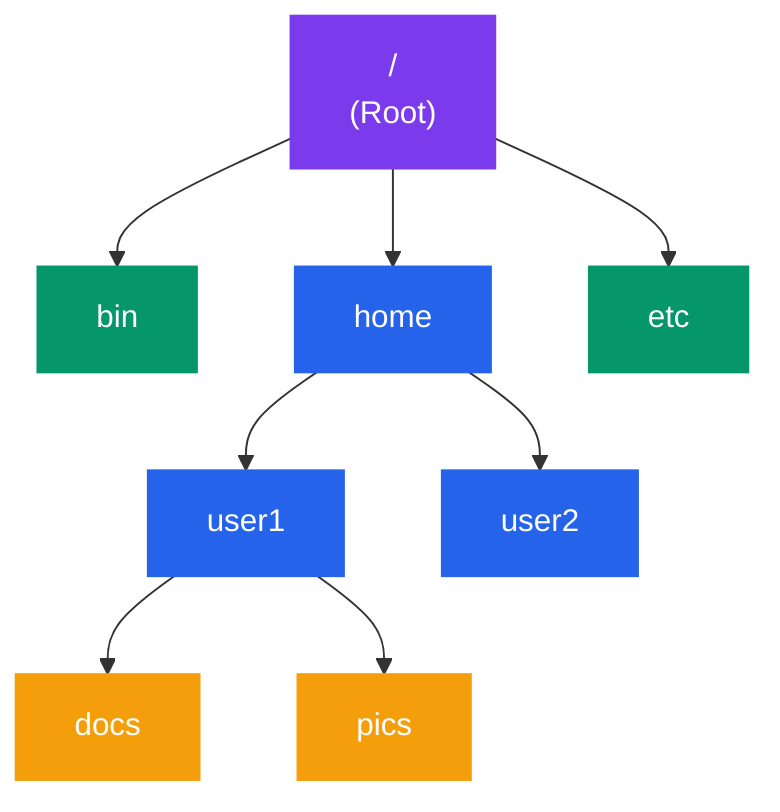
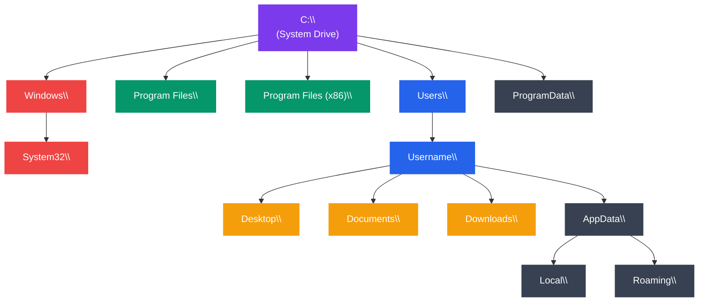

# Directory Structure

## Kya Padhoge Is Tutorial Mein

Socho tumhare laptop mein files kaise organize hoti hain — Documents folder mein docs, Downloads mein downloads, Desktop pe wo random screenshots jo kabhi delete nahi hote. Yehi organization ka concept OS level pe bhi hota hai, bas thoda zyada structured aur strict. Is tutorial mein hum cover karenge:

- Linux/Unix ka Filesystem Hierarchy Standard (FHS) — matlab Linux ka "har cheez ki apni jagah" wala rulebook
- Windows ka directory structure aur woh Linux se kaise alag hai
- Special directories — `/proc`, `/sys`, `/dev` — jo asli files nahi hain, kernel ka jaadu hai
- Block vs character device files — pen drive vs keyboard ka difference
- `/proc/[pid]/` — har process ka apna "Aadhar card" jisme uski poori details hoti hain
- File naming conventions — kya allowed hai, kya nahi
- Directory traversal aur `find`, `tree` commands — jaise Google Maps use karke files dhoondhna

---

## Directory Structure Ka Introduction

**Directory** (ya folder) ek special type ki file hoti hai jisme sirf ek kaam hota hai — dusri files aur directories ke references (pointers) store karna. Khud directory ke andar actual data nahi hota, bas ek "index card" hota hai jo batata hai "yahan pe yeh files hain, unke inodes yeh hain."

Socho ek almirah — almirah khud kapde nahi hai, par usme sections banaye hote hain (shirts, pants, ties) taaki dhoondhna easy ho. Filesystem mein directories exactly yehi role play karte hain.



```
             Root (/)
              │
    ┌─────────┼─────────┐
    │         │         │
   bin       home      etc
              │
         ┌────┴────┐
         │         │
       user1     user2
         │
     ┌───┴───┐
     │       │
   docs    pics
```

Directories ka business kya hai?

- **Organization**: Related files ek jagah, jaise Zomato app mein "Restaurants near you", "Orders", "Favourites" alag-alag sections hain
- **Naming**: Same naam ki file alag directories mein ho sakti hai — `docs/report.txt` aur `pics/report.txt` dono independent hain, koi conflict nahi. Bilkul waise hi jaise "Raj" naam ka banda Mumbai mein bhi hai aur Delhi mein bhi, dono alag insaan hain
- **Navigation**: Path ke through kisi bhi file tak pahuncho — `/home/user1/docs/notes.txt` ek pura address hai, GPS coordinates jaisa
- **Security**: Har directory pe permissions laga sakte ho — kaun read/write/execute kar sakta hai. Jaise society ke gate pe security guard decide karta hai kaun andar aa sakta hai

> [!info]
> Technically, ek directory internally bhi ek file hoti hai — bas uska content special format mein hota hai: **filename → inode number** ka mapping table. Jab tum `ls` chalate ho, OS is table ko padhta hai aur har inode se metadata (size, permissions, timestamps) nikalta hai.

---

## Linux/Unix Filesystem Hierarchy Standard (FHS)

Ab yeh samjho ki agar tumhe Zomato jaisi company mein har city ka apna alag folder structure hota (Mumbai ka menu kahin, Delhi ka kahin) toh chaos ho jaata. Isliye Linux world mein ek **standard** hai jise sab distros (Ubuntu, CentOS, Debian) follow karte hain — iska naam hai **FHS (Filesystem Hierarchy Standard)**. Iska matlab: chahe tum Ubuntu use karo ya Fedora, `/etc` mein config files hi milengi, `/home` mein user data hi milega. Yeh consistency devs aur sysadmins ki zindagi easy banati hai.

### Complete Directory Tree

```
/                           Root directory
├── bin/                    Essential user binaries
├── boot/                   Boot loader files (kernel, initrd)
├── dev/                    Device files
├── etc/                    System configuration files
├── home/                   User home directories
│   ├── user1/
│   └── user2/
├── lib/                    Shared libraries
├── media/                  Removable media mount points
│   ├── cdrom/
│   └── usb/
├── mnt/                    Temporary mount points
├── opt/                    Optional software packages
├── proc/                   Process and kernel information (virtual)
├── root/                   Root user's home directory
├── run/                    Runtime data
├── sbin/                   System binaries
├── srv/                    Service data
├── sys/                    System devices and drivers (virtual)
├── tmp/                    Temporary files
├── usr/                    User programs and data
│   ├── bin/                User binaries
│   ├── lib/                User libraries
│   ├── local/              Locally installed software
│   ├── share/              Shared data
│   └── src/                Source code
└── var/                    Variable data
    ├── log/                Log files
    ├── mail/               Mail spools
    ├── spool/              Print queues, cron jobs
    └── tmp/                Temporary files preserved across reboots
```

### Detailed Directory Descriptions

#### / (Root)
```
The top-level directory. All other directories descend from here.
```

Yeh sabka baap hai. Windows mein `C:\` jaisa concept, bas Linux mein sirf ek hi root hota hai — usb drive, hard disk, network share, sab isi `/` ke neeche kahin na kahin mount hote hain. Windows mein har drive ka apna letter hota hai (C:, D:, E:), Linux mein sab ek hi tree mein fit ho jaata hai.

#### /bin - Essential User Binaries
```
Critical commands needed for single-user mode and system recovery:
- ls, cp, mv, rm (file operations)
- cat, grep, sed (text processing)
- bash, sh (shells)
- ps, kill (process management)
```

Socho system crash ho gaya aur GUI bhi nahi chal raha — recovery mode mein bhi tumhe basic commands chahiye hi honge taaki file move/delete kar sako. Yeh wahi "emergency toolkit" hai. `/bin` mein wahi commands hote hain jo system boot ke bilkul early stage mein bhi available hone chahiye, chahe baaki kuch mount na hua ho.

```bash
$ ls /bin
bash  cat  chmod  cp  date  echo  grep  ls  mkdir  mv  ps  pwd  rm  sh  ...
```

> [!info]
> Modern distros (Ubuntu 20+, Fedora, Arch) mein `/bin` ab `/usr/bin` ka symlink hota hai — yeh "usrmerge" ka result hai jo pehle alag rakhe gaye binaries ko simplify karne ke liye kiya gaya. Interview mein pooch sakte hain isliye yaad rakhna.

#### /boot - Boot Loader Files
```
Files needed for system boot:
- vmlinuz-*        : Linux kernel
- initrd.img-*     : Initial RAM disk
- grub/            : GRUB bootloader configuration
- config-*         : Kernel configuration
```

Jab tum laptop ka power button dabate ho, sabse pehle yehi folder kaam mein aata hai. `vmlinuz` actual Linux kernel hai (compressed), `initrd.img` ek temporary mini filesystem hai jo kernel ko boot karte waqt drivers load karne mein help karta hai (jaise cricket match shuru hone se pehle warm-up drill). GRUB bootloader yeh decide karta hai kaunsa OS load karna hai agar dual-boot setup hai.

```bash
$ ls /boot
config-5.15.0-56-generic
grub/
initrd.img-5.15.0-56-generic
vmlinuz-5.15.0-56-generic
```

#### /dev - Device Files
```
Special files representing hardware devices:
- /dev/sda, /dev/sdb     : Hard disks (SATA/SCSI)
- /dev/nvme0n1           : NVMe SSD
- /dev/tty               : Terminals
- /dev/null              : Null device (discards all data)
- /dev/zero              : Provides zeros
- /dev/random            : Random number generator
```

Yeh Linux ka famous philosophy hai — **"Everything is a file"**. Tumhara hard disk, tumhara keyboard, tumhara mouse — sab ke sab `/dev` mein ek "file" ki tarah represent hote hain. Iska fayda kya hai? Tum ek hard disk se data padhne ke liye wahi commands use kar sakte ho jo normal file padhne ke liye use karte ho (`cat`, `dd`, etc.) — koi special API seekhne ki zaroorat nahi.

**Block vs Character Devices** (neeche detail mein cover karenge)

#### /etc - Configuration Files
```
System-wide configuration files:
- /etc/passwd          : User account information
- /etc/shadow          : Encrypted passwords
- /etc/group           : Group definitions
- /etc/fstab           : File system mount configuration
- /etc/hostname        : System hostname
- /etc/hosts           : IP address to hostname mapping
- /etc/resolv.conf     : DNS resolver configuration
- /etc/ssh/            : SSH server configuration
- /etc/apt/            : APT package manager configuration
```

`/etc` ka naam "et cetera" se aaya hai (jo bhi fit nahi hota, yahan daal do — purane Unix devs ka mazaak). Aaj yeh basically system-wide **settings** ka ghar hai. Socho jaise CRED app mein ek "Settings" screen hoti hai jahan tumhare saare preferences store hain — `/etc` bhi system ke liye wahi role play karta hai. Yahan koi executable programs nahi hote, sirf configuration text files.

```bash
$ cat /etc/hostname
myserver

$ cat /etc/hosts
127.0.0.1       localhost
192.168.1.100   myserver
```

> [!warning]
> `/etc/shadow` file mein encrypted passwords hote hain aur yeh sirf root read kar sakta hai. Agar interview mein pooche "passwords kahan store hote hain" — jawab hai `/etc/shadow`, `/etc/passwd` mein nahi (wahan sirf username, UID, GID, home directory jaisi metadata hoti hai, actual password hash nahi — purane zamane mein hota tha, security ke liye move kar diya gaya).

#### /home - User Home Directories
```
Personal directories for users:
/home/user1/
├── Documents/
├── Downloads/
├── Pictures/
├── .bashrc              : Bash configuration
├── .bash_history        : Command history
└── .ssh/                : SSH keys
```

Yeh tumhara personal "flat" hai system ke andar. Jaise ek PG (paying guest) mein har student ka apna kamra hota hai — kapde, kitabein sab uske kamre mein hi rehte hain, dusre ke kamre mein interfere nahi karte. `/home/user1` sirf `user1` ka hai, `/home/user2` sirf `user2` ka. Har user ka apne home directory pe full control hota hai.

#### /lib - Shared Libraries
```
Essential shared libraries and kernel modules:
- /lib/modules/          : Kernel modules
- /lib/x86_64-linux-gnu/ : 64-bit libraries
- libc.so.6              : C standard library
```

Yeh Windows ke DLL files jaisa hai — code jo multiple programs share karte hain taaki har program apna khud ka copy na rakhe. Jaise ek building mein common lift hoti hai jo sab flats use karte hain, waise hi `libc.so.6` (C standard library) ko har program apna khud ka copy nahi rakhta, sab shared version use karte hain — RAM aur disk space dono bachta hai.

#### /proc - Process Information (Virtual)
```
Virtual file system providing process and kernel information:
- /proc/cpuinfo          : CPU information
- /proc/meminfo          : Memory usage
- /proc/[PID]/           : Process-specific information
- /proc/[PID]/status     : Process status
- /proc/[PID]/cmdline    : Command line
- /proc/[PID]/fd/        : Open file descriptors
```

**Not real files on disk** — dynamically generated by kernel. Iska deep dive neeche "Special Directories" section mein hai.

#### /sys - System Devices (Virtual)
```
Virtual file system exposing kernel's device tree:
- /sys/block/            : Block devices
- /sys/class/            : Device classes
- /sys/devices/          : Physical device hierarchy
- /sys/fs/               : File system parameters
```

#### /tmp - Temporary Files
```
Temporary files, cleared on reboot.
World-writable but with sticky bit (users can only delete own files).
```

Socho ek shared office ka whiteboard — koi bhi likh sakta hai, koi bhi mita sakta hai, but reboot pe poora clean ho jaata hai. `/tmp` mein har koi read/write kar sakta hai (world-writable — permission `777`), lekin **sticky bit** ki wajah se koi user dusre ke banaye hue file ko delete nahi kar sakta, sirf apna khud ka.

```bash
$ ls -ld /tmp
drwxrwxrwt 10 root root 4096 Jan 15 10:30 /tmp
#       └─ t = sticky bit
```

> [!tip]
> `t` (sticky bit) dekhoge to yaad rakho — yeh security feature hai. Bina isके, koi bhi user `/tmp` mein kisi aur ki file delete kar sakta tha jo shared temp space mein bahut bada security risk hota.

#### /usr - User Programs and Data
```
Secondary hierarchy for user programs:
/usr/
├── bin/         : Non-essential user binaries (gcc, python, vim)
├── lib/         : Libraries for /usr/bin programs
├── local/       : Locally compiled software
│   ├── bin/
│   ├── lib/
│   └── share/
├── share/       : Architecture-independent data
│   ├── doc/     : Documentation
│   ├── man/     : Manual pages
│   └── icons/   : Icons
└── src/         : Source code
```

`/usr` ka naam "Unix System Resources" se aaya hai (naa ki "user", yeh common confusion hai). Yahan tumhare wo saare tools hote hain jo boot ke liye zaroori nahi hain but daily use ke liye important hain — `python`, `gcc`, `vim`, `git`. Socho `/bin` jaise emergency kit ki tarah hai (basic survival tools), `/usr/bin` jaise puri toolbox hai jisme har cheez hai jo tumhe kaam karne ke liye chahiye.

#### /var - Variable Data
```
Files that grow or change during operation:
/var/
├── log/         : Log files
│   ├── syslog
│   ├── auth.log
│   └── apache2/
├── mail/        : User mailboxes
├── spool/       : Queued data (print jobs, cron)
├── tmp/         : Temporary files (preserved across reboots)
└── www/         : Web server files
```

`/var` ("variable") mein woh data hota hai jo continuously badalta rehta hai — logs, mail, print queue. Jaise Swiggy ka order-tracking system continuously update hota rehta hai (order placed → preparing → out for delivery), `/var/log` continuously naye entries se bharta rehta hai.

```bash
# View system logs
sudo tail -f /var/log/syslog

# Check web server logs
sudo tail -f /var/log/apache2/access.log
```

> [!tip]
> Production servers pe `/var/log` disk space khatam karne ka number one culprit hota hai. Agar server ka disk full ho jaaye, sabse pehle `/var/log` check karo — kahin koi runaway log file toh nahi bani.

### FHS Summary Table

| Directory | Type | Purpose | Examples |
|-----------|------|---------|----------|
| `/bin` | Static | Essential commands | `ls`, `cp`, `bash` |
| `/boot` | Static | Boot files | Kernel, initrd |
| `/dev` | Dynamic | Device files | `/dev/sda`, `/dev/tty` |
| `/etc` | Static | Configuration | `/etc/passwd`, `/etc/fstab` |
| `/home` | Dynamic | User files | `/home/user1/` |
| `/lib` | Static | Libraries | `libc.so` |
| `/proc` | Virtual | Process info | `/proc/cpuinfo` |
| `/sys` | Virtual | Kernel info | `/sys/class/` |
| `/tmp` | Dynamic | Temp files | Cleared on reboot |
| `/usr` | Static | User programs | `/usr/bin/vim` |
| `/var` | Dynamic | Variable data | Logs, mail, spool |

---

## Windows Directory Structure

Ab Windows side dekhte hain, jo tumhare daily driver OS ka structure hai. Windows ka approach thoda different hai — har drive ka apna letter (`C:`, `D:`), aur folder naming mein backslash `\` use hota hai instead of forward slash `/`.



```
C:\                          System drive
├── Windows\                 Windows OS files
│   ├── System32\           System DLLs and executables
│   ├── SysWOW64\           32-bit binaries (on 64-bit systems)
│   ├── Temp\               System temporary files
│   └── Fonts\              System fonts
├── Program Files\           64-bit applications
│   ├── Mozilla Firefox\
│   └── Microsoft Office\
├── Program Files (x86)\     32-bit applications
├── Users\                   User profiles
│   ├── Public\
│   └── Username\
│       ├── Desktop\
│       ├── Documents\
│       ├── Downloads\
│       ├── Pictures\
│       └── AppData\        Application data
│           ├── Local\      Machine-specific data
│           ├── Roaming\    Roaming profile data
│           └── LocalLow\   Low-integrity data
├── ProgramData\             Shared application data
└── Temp\                    Temporary files
```

Kuch interesting quirks jo tumhe as a Node/TS dev pata hone chahiye:

- **`AppData\Roaming`**: Yeh data domain-joined enterprise networks mein user ke saath "roam" karta hai — agar tum office mein alag-alag machine pe login karo, tumhari settings follow karengi. Home use mein iska matlab utna nahi hota.
- **`AppData\Local`**: Machine-specific hota hai, roam nahi karta. VSCode extensions, npm cache jaisi cheezein yahan store hoti hain — `%LOCALAPPDATA%\npm-cache` dekha hoga tumne kabhi.
- **`Program Files (x86)`**: Legacy 32-bit apps ke liye — naam thoda misleading hai kyunki modern 64-bit systems pe bhi kuch apps yahan install hoti hain agar unka installer 32-bit hai.

### Key Windows Directories

| Directory | Linux Equivalent | Purpose |
|-----------|------------------|---------|
| `C:\Windows` | `/boot`, `/lib` | OS system files |
| `C:\Windows\System32` | `/bin`, `/sbin` | System binaries |
| `C:\Program Files` | `/usr/bin`, `/opt` | Applications |
| `C:\Users\Username` | `/home/user` | User files |
| `C:\Users\Username\AppData` | `~/.config`, `~/.local` | App settings |
| `C:\ProgramData` | `/var/lib` | Shared app data |
| `C:\Temp` | `/tmp` | Temporary files |

---

## Special Directories in Linux

### /proc - Process File System

**/proc** ek **virtual filesystem** hai — matlab yeh disk pe kahin physically exist nahi karta. Jab bhi tum `cat /proc/cpuinfo` chalate ho, kernel real-time mein CPU se data khींch ke ek "fake file" bana deta hai just for that moment. Socho jaise ek live dashboard jo har baar refresh karne pe fresh data dikhata hai — koi bhi data pehle se disk pe stored nahi hai.

Yeh design decision genius hai kyunki isse tum system information ko bilkul normal file-reading commands (`cat`, `grep`) se access kar sakte ho, koi special monitoring tool ki zaroorat nahi.

#### System Information

```bash
# CPU information
cat /proc/cpuinfo

# Memory information
cat /proc/meminfo

# Output:
# MemTotal:       16384000 kB
# MemFree:         8192000 kB
# MemAvailable:   10240000 kB
# Buffers:          512000 kB
# Cached:          2048000 kB
# ...

# Uptime
cat /proc/uptime
# 123456.78 987654.32
# (uptime in seconds, idle time in seconds)

# Load average
cat /proc/loadavg
# 0.50 0.60 0.70 1/200 12345
# (1min, 5min, 15min averages, running/total processes, last PID)

# Mounted file systems
cat /proc/mounts
```

#### Per-Process Information (/proc/[PID]/)

Har running process ka **apna Aadhar card** hota hai `/proc/` ke andar — uska naam hota hai uska PID (Process ID). Jaise UPI transaction ka apna unique reference number hota hai jisse tum poori details track kar sakte ho, waise hi `/proc/[PID]/` ke andar us process ki har cheez trace ho sakti hai.

```bash
# Example: Process 1234
/proc/1234/
├── cmdline          : Command line arguments (null-separated)
├── cwd              : Symbolic link to current working directory
├── environ          : Environment variables
├── exe              : Symbolic link to executable file
├── fd/              : Directory of file descriptor links
│   ├── 0 -> /dev/pts/0    (stdin)
│   ├── 1 -> /dev/pts/0    (stdout)
│   ├── 2 -> /dev/pts/0    (stderr)
│   └── 3 -> /home/user/file.txt
├── maps             : Memory mappings
├── stat             : Process status (machine-readable)
├── status           : Process status (human-readable)
├── task/            : Threads (one directory per thread)
└── mem              : Process memory
```

**Practical Examples**:

```bash
# Find process ID
pidof firefox
# 1234

# View command line
cat /proc/1234/cmdline | tr '\0' ' '
# /usr/bin/firefox --profile /home/user/.mozilla

# View current working directory
ls -l /proc/1234/cwd
# lrwxrwxrwx 1 user user 0 Jan 15 10:30 /proc/1234/cwd -> /home/user/Downloads

# List open files
ls -l /proc/1234/fd/

# View process status
cat /proc/1234/status
# Name:   firefox
# State:  S (sleeping)
# Pid:    1234
# PPid:   1000
# Threads:    42
# VmSize: 2048000 kB
# VmRSS:  512000 kB
# ...

# View environment variables
cat /proc/1234/environ | tr '\0' '\n'
```

Node.js background se ho toh yeh soch ke dekho: jab tumhara Node process `EMFILE: too many open files` error deta hai production mein, sabse pehle `/proc/[PID]/fd/` check karke count karte hain kitne file descriptors khule hain — ek chhoti si command debugging session bacha deti hai:

```bash
ls /proc/$(pidof node)/fd/ | wc -l
```

**Use Cases**:
- Monitoring tools (top, htop) — yeh sab internally `/proc` hi padhte hain
- Debugging (gdb, strace)
- System administration
- Process forensics — koi crash ho gaya toh uski last state samajhne ke liye

### /sys - System Device Hierarchy

`/proc` jaisa hi ek aur virtual filesystem, but iska focus hai kernel ka **device model** — hardware devices ka hierarchy expose karna userspace ko.

```bash
# Block devices
ls /sys/block/
# sda sdb nvme0n1 ...

# View disk information
cat /sys/block/sda/size
# 976773168 (sectors)

cat /sys/block/sda/queue/scheduler
# noop deadline [cfq]  (cfq is active)

# Network devices
ls /sys/class/net/
# eth0 wlan0 lo

# Network interface information
cat /sys/class/net/eth0/address
# 00:11:22:33:44:55

cat /sys/class/net/eth0/speed
# 1000 (Mbps)

# Power management
cat /sys/class/power_supply/BAT0/capacity
# 85 (percent)

# Thermal information
cat /sys/class/thermal/thermal_zone0/temp
# 45000 (45°C in millidegrees)
```

> [!info]
> `/proc` vs `/sys` ka farak yaad rakhne ka trick: `/proc` **processes** ke baare mein hai (aur legacy system info bhi), `/sys` cleaner tarike se **hardware devices** ke baare mein hai. Modern Linux kernel `/sys` ko zyada structured aur "proper" tareeke se maintain karta hai — `/proc` purana aur thoda messy hai, backward compatibility ke liye rakha gaya hai.

---

## Device Files (/dev)

Yeh special files hain jo hardware devices ke saath interface provide karte hain. Chalo isko Zomato delivery analogy se samjhte hain.

### Types of Device Files

#### 1. Block Devices (b)

**Block devices** data ko **blocks (chunks)** mein handle karte hain aur **random access** support karte hain — matlab tum kisi bhi block ko directly jump karke padh sakte ho, sequence follow karne ki zaroorat nahi. Socho jaise ek kitab ka index dekh ke seedha chapter 7 pe pahunch jaana, poori kitab pehle se padhne ki zaroorat nahi.

```bash
$ ls -l /dev/sda
brw-rw---- 1 root disk 8, 0 Jan 15 10:30 /dev/sda
│
└─ b = block device

# Examples:
# /dev/sda, /dev/sdb       : SATA/SCSI hard drives
# /dev/nvme0n1             : NVMe SSD
# /dev/mmcblk0             : SD card
# /dev/loop0               : Loop device (file as block device)
```

**Characteristics**:
- Random access (seek to any block)
- Buffered I/O
- Used for storage devices

#### 2. Character Devices (c)

**Character devices** data ko **stream of characters** ki tarah handle karte hain — **sequential access**, ek ke baad ek, koi jump nahi. Socho jaise WhatsApp voice message sunna — tum bina sunhe beech mein jump nahi kar sakte, order mein hi aayega (technically seek possible hai kuch devices mein, but conceptually stream-based hai).

```bash
$ ls -l /dev/tty0
crw--w---- 1 root tty 4, 0 Jan 15 10:30 /dev/tty0
│
└─ c = character device

# Examples:
# /dev/tty*, /dev/pts/*    : Terminals
# /dev/null                : Null device (bit bucket)
# /dev/zero                : Provides infinite zeros
# /dev/random, /dev/urandom: Random number generators
# /dev/input/mouse0        : Mouse
# /dev/snd/*               : Sound devices
```

**Characteristics**:
- Sequential access
- Unbuffered (direct) I/O
- Used for terminals, serial ports, input devices

> [!tip]
> Quick memory trick: **B**lock devices = **B**ig chunks, random access, storage (hard disk). **C**haracter devices = **C**ontinuous stream, sequential, I/O devices (keyboard, mouse, terminal). `ls -l` output ke pehle character (`b` ya `c`) se pehchano.

### Special Device Files

Yeh kuch "magic" device files hain jo Linux mein bahut kaam aate hain:

```bash
# /dev/null - Discards all data written to it
echo "This disappears" > /dev/null
command_with_error 2> /dev/null  # Discard errors

# /dev/zero - Produces infinite stream of zeros
dd if=/dev/zero of=10mb_file bs=1M count=10  # Create 10MB file of zeros

# /dev/random - Cryptographically secure random
dd if=/dev/random of=random_data bs=1K count=1

# /dev/urandom - Faster pseudo-random (non-blocking)
dd if=/dev/urandom of=random_data bs=1K count=1

# /dev/full - Always "full" (write fails with ENOSPC)
echo "test" > /dev/full
# bash: echo: write error: No space left on device
```

`/dev/null` ko socho ek **kachra dabba jisme kabhi kachra bharta hi nahi** — jitna daalo utna gayab. Har Node dev ne kabhi na kabhi `2> /dev/null` use kiya hi hoga taaki error output terminal pe dikhna band ho jaaye.

### Device Numbers

Har device ke do numbers hote hain — **major** aur **minor**. Yeh bilkul customer support ke ticket system jaisa hai — major number decide karta hai "kaunsa department/driver handle karega" (jaise SCSI disk driver = 8), minor number decide karta hai "specific device/partition kaunsa hai" (jaise sda1 vs sda2).

```bash
$ ls -l /dev/sda*
brw-rw---- 1 root disk 8, 0 Jan 15 10:30 /dev/sda
brw-rw---- 1 root disk 8, 1 Jan 15 10:30 /dev/sda1
brw-rw---- 1 root disk 8, 2 Jan 15 10:30 /dev/sda2
                      │  │
                      │  └─ Minor number (partition)
                      └─ Major number (device driver)
```

- **Major number**: Identifies device driver (8 = SCSI disk driver)
- **Minor number**: Identifies specific device/partition

---

## File Naming Conventions

### Linux/Unix

- **Case-sensitive**: `File.txt` ≠ `file.txt` — dono alag files hain! Bahut logon ko yeh migrate karte waqt bite karta hai jab woh Windows se Linux pe move karte hain
- **Length**: Up to 255 characters
- **Special characters**: Allowed but discouraged: spaces, !, @, #, etc.
- **Hidden files**: Start with `.` (e.g., `.bashrc`, `.gitignore`) — yeh "hidden" isliye kehlaate hain kyunki `ls` normally inhe nahi dikhata (`ls -a` chahiye dekhne ke liye)
- **No extension requirement**: Extensions are convention only — `.txt`, `.js` sirf humans aur programs ke liye hint hain, kernel ko koi farak nahi padta

```bash
# Valid filenames (but some are poor choices)
my_file.txt          # Good
my file.txt          # Spaces require quoting
file!@#$.txt         # Special chars allowed
.hidden_file         # Hidden file
noextension          # Valid without extension
```

**Best Practices**:
```bash
# Good
user_report_2024.txt
data-processing.py
server_config.json

# Avoid
my file.txt          # Spaces (use _ or -)
file!@#$.txt         # Special characters
```

> [!warning]
> Bash scripting mein spaces waali filenames sabse zyada bugs cause karti hain — `for file in $files` jaise loops break ho jaate hain agar filename mein space ho. Isliye production scripts mein `_` ya `-` use karo, kabhi space nahi.

### Windows

- **Case-insensitive**: `File.txt` = `file.txt` (but preserves case) — yeh Node devs ke liye bahut common gotcha hai! Ek `import './Utils'` Windows pe chal jaayega but Linux (production server, CI) pe fail ho jaayega agar actual file `utils.js` hai (lowercase). Isliye local pe Windows use karte ho toh case-sensitivity ka dhyaan rakho, warna deploy karte waqt surprise milega.
- **Length**: Up to 260 characters (full path)
- **Forbidden characters**: `< > : " / \ | ? *`
- **Reserved names**: `CON`, `PRN`, `AUX`, `NUL`, `COM1-COM9`, `LPT1-LPT9` — yeh purane DOS-era device names hain, aaj bhi file ka naam nahi ban sakte
- **Extension determines file type**: Important for opening files — Windows extension dekh ke decide karta hai kaunsa program file kholega (double-click behavior)

---

## Directory Traversal

### Basic Navigation

Yeh basic commands hain jo tum daily terminal mein use karte ho — but chalo revise kar lete hain kyunki OS concepts ki base yehi hai.

```bash
# Print working directory
pwd
# /home/user

# Change directory
cd /etc
cd ..                # Parent directory
cd ~                 # Home directory
cd -                 # Previous directory

# List directory contents
ls
ls -l                # Long format
ls -a                # Show hidden files
ls -lh               # Human-readable sizes
ls -R                # Recursive

# Create directory
mkdir mydir
mkdir -p path/to/nested/dir    # Create parent directories

# Remove directory
rmdir emptydir               # Only works on empty directories
rm -r dirname                # Remove directory and contents
rm -rf dirname               # Force remove (dangerous!)
```

> [!warning]
> `rm -rf` ke saath careful raho — especially agar tum root user ho ya sudo use kar rahe ho. `rm -rf /` (ya galti se `rm -rf /` jaisa kuch typo ho jaana) poora system delete kar sakta hai. Hamesha path double-check karo before Enter dabao.

---

## Finding Files with `find`

`find` command bahut powerful hai files search karne ke liye — socho jaise Flipkart ka advanced filter system (price range, brand, rating) but files ke liye.

### Basic Syntax

```bash
find [path] [options] [tests] [actions]
```

### By Name

```bash
# Find files by name
find /home -name "*.txt"

# Case-insensitive
find /home -iname "readme.md"

# Find directories
find /home -name "Documents" -type d

# Multiple patterns
find . -name "*.c" -o -name "*.h"
```

### By Type

```bash
# Find only files
find /var/log -type f

# Find only directories
find /home -type d

# Find symbolic links
find /usr/bin -type l
```

### By Size

```bash
# Files larger than 100MB
find /home -size +100M

# Files smaller than 1KB
find /tmp -size -1k

# Files exactly 512 bytes
find . -size 512c
```

### By Time

```bash
# Modified in last 7 days
find /home -mtime -7

# Modified more than 30 days ago
find /var/log -mtime +30

# Accessed in last 24 hours
find /tmp -atime -1

# Changed in last hour
find /etc -cmin -60
```

### By Permissions

```bash
# Files with 777 permissions
find /var/www -perm 0777

# Files readable by everyone
find /home -perm -444

# SUID files (security audit)
find / -perm -4000 -type f 2>/dev/null
```

### By Owner

```bash
# Files owned by user
find /home -user john

# Files owned by group
find /var -group www-data
```

### Actions

```bash
# Execute command on found files
find /tmp -name "*.log" -exec rm {} \;

# Prompt before executing
find /tmp -name "*.log" -ok rm {} \;

# Delete found files
find /tmp -name "core" -delete

# Print with details
find /etc -name "*.conf" -ls

# Count found files
find /home -name "*.jpg" | wc -l
```

### Complex Examples

```bash
# Find large files in home directory
find ~ -type f -size +100M -exec ls -lh {} \;

# Find and archive old log files
find /var/log -name "*.log" -mtime +30 -exec gzip {} \;

# Find empty directories
find /tmp -type d -empty

# Find files modified in last 7 days, exclude certain directories
find /home -name "*.txt" -mtime -7 -not -path "*/.*" -not -path "*/cache/*"

# Find world-writable files (security check)
find / -xdev -type f -perm -0002 2>/dev/null

# Find files by inode number
find /home -inum 12345
```

> [!tip]
> `find / ... 2>/dev/null` pattern bahut common hai — `find` jab permission-denied directories mein jaata hai (jaise dusre user ke home folder), woh stderr pe errors print karta hai. `2>/dev/null` un errors ko discard kar deta hai taaki output clean rahe.

---

## Visualizing with `tree`

`tree` command directory structure ko visually dikhata hai — bahut helpful jab tum kisi naye project ki codebase samajhne ki koshish kar rahe ho.

```bash
# Install tree (if not available)
sudo apt install tree        # Debian/Ubuntu
sudo yum install tree        # RHEL/CentOS

# Basic usage
tree

# Limit depth
tree -L 2

# Show hidden files
tree -a

# Show only directories
tree -d

# Show file sizes
tree -h

# Output to file
tree -o directory_structure.txt

# Colorful output
tree -C
```

**Example Output**:

```bash
$ tree -L 2 -h
.
├── [4.0K]  Documents
│   ├── [2.0M]  report.pdf
│   └── [1.5K]  notes.txt
├── [4.0K]  Pictures
│   ├── [4.0K]  vacation
│   └── [3.2M]  photo.jpg
└── [4.0K]  scripts
    ├── [ 512]  backup.sh
    └── [1.2K]  deploy.py

5 directories, 5 files
```

---

## Practical Examples

### Example 1: System Exploration

```bash
# Explore FHS directories
ls -l /
ls -l /etc
ls -l /var/log

# Check process information
ps aux | grep firefox
pidof firefox
ls -l /proc/$(pidof firefox)
cat /proc/$(pidof firefox)/cmdline | tr '\0' ' '

# Check device files
ls -l /dev/sd*
ls -l /dev/tty*
```

### Example 2: Finding Large Files

```bash
#!/bin/bash
# find_large_files.sh - Find files larger than 100MB

echo "Finding large files (>100MB)..."
find / -type f -size +100M 2>/dev/null | while read file; do
    size=$(du -h "$file" | cut -f1)
    echo "$size    $file"
done | sort -h
```

### Example 3: Directory Statistics

```bash
#!/bin/bash
# dir_stats.sh - Display directory statistics

DIR=${1:-.}

echo "Directory Statistics for: $DIR"
echo "========================================"
echo "Total files:       $(find "$DIR" -type f | wc -l)"
echo "Total directories: $(find "$DIR" -type d | wc -l)"
echo "Total size:        $(du -sh "$DIR" | cut -f1)"
echo "Hidden files:      $(find "$DIR" -name ".*" -type f | wc -l)"
echo "Largest files:"
find "$DIR" -type f -exec ls -lh {} \; | sort -k5 -h | tail -5
```

---

## Exercises

### Beginner

1. **FHS Exploration**: List the contents of `/etc`, `/var`, and `/usr`. Identify 5 configuration files in `/etc`.

2. **Device Files**: List all block devices in `/dev`. Identify which ones are hard drives vs partitions.

3. **Hidden Files**: Find all hidden files (starting with `.`) in your home directory.

### Intermediate

4. **Process Investigation**: Pick a running process. Using `/proc/[PID]/`, find:
   - Its command line
   - Current working directory
   - Open file descriptors
   - Memory usage

5. **Find Practice**: Write a `find` command to:
   - Find all `.log` files modified in the last 7 days
   - Find all files larger than 50MB in `/var`
   - Find all files owned by `root` with world-write permission

6. **Directory Tree**: Create a directory structure for a web project (public, src, tests, docs). Use `tree` to visualize it.

### Advanced

7. **System Audit Script**: Write a bash script that:
   - Finds all SUID files on the system
   - Lists processes with most open file descriptors
   - Identifies large files in `/var/log`
   - Reports disk usage by directory in `/home`

8. **Device Monitoring**: Write a script that monitors `/sys/class/net/` to detect when network interfaces go up or down.

9. **File System Walker**: Write a C program that recursively walks a directory tree and prints:
   - File path
   - Type (regular, directory, symlink)
   - Size
   - Permissions

---

## Key Takeaways

1. **FHS Structure**: Linux/Unix ek standard hierarchy follow karta hai (`/`, `/bin`, `/etc`, `/home`, `/usr`, `/var`) — har distro isse follow karta hai isliye consistency milti hai

2. **Special Directories**:
   - `/proc`: Virtual filesystem jisme process aur kernel info hai — kernel real-time mein generate karta hai, disk pe store nahi
   - `/sys`: Kernel ka device tree, hardware information ke liye
   - `/dev`: Device files — "Everything is a file" philosophy ka best example

3. **Device Files**: Do types — block (random access, storage devices) aur character (sequential access, terminals/input devices)

4. **Case Sensitivity**: Linux case-sensitive hai, Windows case-insensitive — yeh cross-platform Node.js projects mein import paths break karne ka bada reason hai

5. **Hidden Files**: Linux/Unix mein `.` se start hote hain (`.bashrc`, `.gitignore`)

6. **Process Info**: Har process ka `/proc/[PID]/` directory hota hai jisme uski complete details hoti hain — cmdline, cwd, fd, memory maps sab

7. **find Command**: Bahut powerful tool hai — name, size, time, owner, permissions ke basis pe files search karne ke liye

8. **tree Command**: Directory structure ko hierarchically visualize karta hai, naye codebase samajhne ke liye kaam aata hai

---

## Navigation

- **Previous**: [02. File System Implementation](./02_fs_implementation.md)
- **Next**: [04. Disk Scheduling Algorithms](./04_disk_scheduling.md)
- **Section Index**: [Storage Management](./README.md)

---

## Further Reading

- `man hier` - Description of file system hierarchy
- `man find` - find command
- `man proc` - /proc file system
- [Filesystem Hierarchy Standard](https://refspecs.linuxfoundation.org/FHS_3.0/fhs/index.html)
- [Linux Device Drivers (Chapter 3)](https://lwn.net/Kernel/LDD3/)
