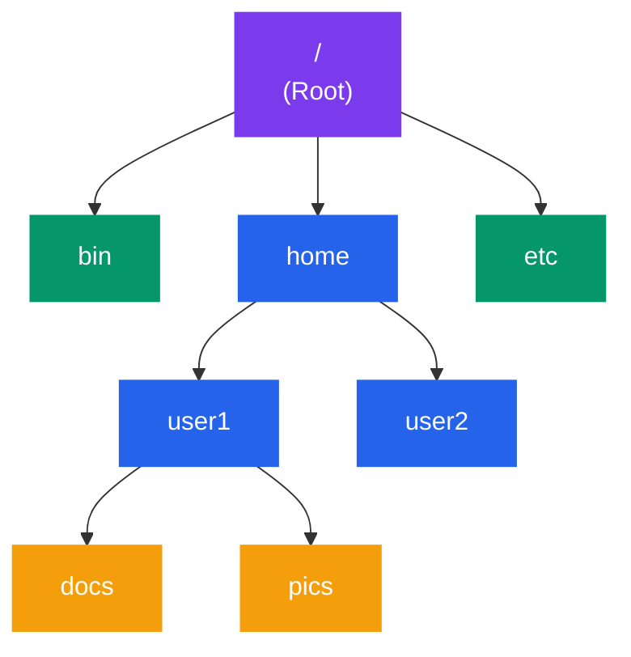
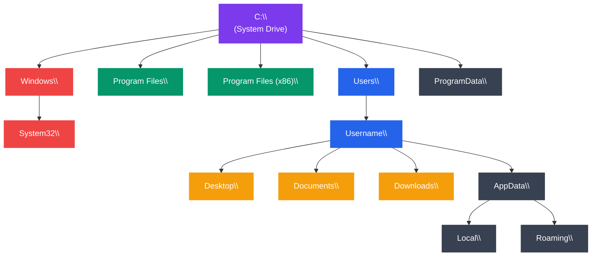

# Directory Structure

## What You'll Learn

In this tutorial, you'll explore directory hierarchies and special files in operating systems:

- Master the Linux/Unix Filesystem Hierarchy Standard (FHS)
- Understand Windows directory structure
- Explore special directories (/proc, /sys, /dev)
- Differentiate between block and character device files
- Learn about /proc/[pid]/ files for process information
- Understand file naming conventions
- Master directory traversal techniques
- Use the `find` command effectively
- Visualize directory structures with `tree`

---

## Introduction to Directory Structures

A **directory** (or folder) is a special file that contains references to other files and directories, creating a hierarchical organization.



```
             Root (/)
              │
    ┌─────────┼─────────┐
    │         │         │
   bin       home      etc
              │
         ┌────┴────┐
         │         │
       user1     user2
         │
     ┌───┴───┐
     │       │
   docs    pics
```

Directories provide:
- **Organization**: Logical grouping of files
- **Naming**: Context for filenames (same name in different directories)
- **Navigation**: Path-based access to files
- **Security**: Permission boundaries

---

## Linux/Unix Filesystem Hierarchy Standard (FHS)

The FHS defines the directory structure and content for Unix-like systems.

### Complete Directory Tree

```
/                           Root directory
├── bin/                    Essential user binaries
├── boot/                   Boot loader files (kernel, initrd)
├── dev/                    Device files
├── etc/                    System configuration files
├── home/                   User home directories
│   ├── user1/
│   └── user2/
├── lib/                    Shared libraries
├── media/                  Removable media mount points
│   ├── cdrom/
│   └── usb/
├── mnt/                    Temporary mount points
├── opt/                    Optional software packages
├── proc/                   Process and kernel information (virtual)
├── root/                   Root user's home directory
├── run/                    Runtime data
├── sbin/                   System binaries
├── srv/                    Service data
├── sys/                    System devices and drivers (virtual)
├── tmp/                    Temporary files
├── usr/                    User programs and data
│   ├── bin/                User binaries
│   ├── lib/                User libraries
│   ├── local/              Locally installed software
│   ├── share/              Shared data
│   └── src/                Source code
└── var/                    Variable data
    ├── log/                Log files
    ├── mail/               Mail spools
    ├── spool/              Print queues, cron jobs
    └── tmp/                Temporary files preserved across reboots
```

### Detailed Directory Descriptions

#### / (Root)
```
The top-level directory. All other directories descend from here.
```

#### /bin - Essential User Binaries
```
Critical commands needed for single-user mode and system recovery:
- ls, cp, mv, rm (file operations)
- cat, grep, sed (text processing)
- bash, sh (shells)
- ps, kill (process management)
```

```bash
$ ls /bin
bash  cat  chmod  cp  date  echo  grep  ls  mkdir  mv  ps  pwd  rm  sh  ...
```

#### /boot - Boot Loader Files
```
Files needed for system boot:
- vmlinuz-*        : Linux kernel
- initrd.img-*     : Initial RAM disk
- grub/            : GRUB bootloader configuration
- config-*         : Kernel configuration
```

```bash
$ ls /boot
config-5.15.0-56-generic
grub/
initrd.img-5.15.0-56-generic
vmlinuz-5.15.0-56-generic
```

#### /dev - Device Files
```
Special files representing hardware devices:
- /dev/sda, /dev/sdb     : Hard disks (SATA/SCSI)
- /dev/nvme0n1           : NVMe SSD
- /dev/tty               : Terminals
- /dev/null              : Null device (discards all data)
- /dev/zero              : Provides zeros
- /dev/random            : Random number generator
```

**Block vs Character Devices** (covered in detail later)

#### /etc - Configuration Files
```
System-wide configuration files:
- /etc/passwd          : User account information
- /etc/shadow          : Encrypted passwords
- /etc/group           : Group definitions
- /etc/fstab           : File system mount configuration
- /etc/hostname        : System hostname
- /etc/hosts           : IP address to hostname mapping
- /etc/resolv.conf     : DNS resolver configuration
- /etc/ssh/            : SSH server configuration
- /etc/apt/            : APT package manager configuration
```

```bash
$ cat /etc/hostname
myserver

$ cat /etc/hosts
127.0.0.1       localhost
192.168.1.100   myserver
```

#### /home - User Home Directories
```
Personal directories for users:
/home/user1/
├── Documents/
├── Downloads/
├── Pictures/
├── .bashrc              : Bash configuration
├── .bash_history        : Command history
└── .ssh/                : SSH keys
```

Each user has full control over their home directory.

#### /lib - Shared Libraries
```
Essential shared libraries and kernel modules:
- /lib/modules/          : Kernel modules
- /lib/x86_64-linux-gnu/ : 64-bit libraries
- libc.so.6              : C standard library
```

Similar to Windows DLL files - shared code used by multiple programs.

#### /proc - Process Information (Virtual)
```
Virtual file system providing process and kernel information:
- /proc/cpuinfo          : CPU information
- /proc/meminfo          : Memory usage
- /proc/[PID]/           : Process-specific information
- /proc/[PID]/status     : Process status
- /proc/[PID]/cmdline    : Command line
- /proc/[PID]/fd/        : Open file descriptors
```

**Not real files on disk** - dynamically generated by kernel.

#### /sys - System Devices (Virtual)
```
Virtual file system exposing kernel's device tree:
- /sys/block/            : Block devices
- /sys/class/            : Device classes
- /sys/devices/          : Physical device hierarchy
- /sys/fs/               : File system parameters
```

#### /tmp - Temporary Files
```
Temporary files, cleared on reboot.
World-writable but with sticky bit (users can only delete own files).
```

```bash
$ ls -ld /tmp
drwxrwxrwt 10 root root 4096 Jan 15 10:30 /tmp
#       └─ t = sticky bit
```

#### /usr - User Programs and Data
```
Secondary hierarchy for user programs:
/usr/
├── bin/         : Non-essential user binaries (gcc, python, vim)
├── lib/         : Libraries for /usr/bin programs
├── local/       : Locally compiled software
│   ├── bin/
│   ├── lib/
│   └── share/
├── share/       : Architecture-independent data
│   ├── doc/     : Documentation
│   ├── man/     : Manual pages
│   └── icons/   : Icons
└── src/         : Source code
```

#### /var - Variable Data
```
Files that grow or change during operation:
/var/
├── log/         : Log files
│   ├── syslog
│   ├── auth.log
│   └── apache2/
├── mail/        : User mailboxes
├── spool/       : Queued data (print jobs, cron)
├── tmp/         : Temporary files (preserved across reboots)
└── www/         : Web server files
```

```bash
# View system logs
sudo tail -f /var/log/syslog

# Check web server logs
sudo tail -f /var/log/apache2/access.log
```

### FHS Summary Table

| Directory | Type | Purpose | Examples |
|-----------|------|---------|----------|
| `/bin` | Static | Essential commands | `ls`, `cp`, `bash` |
| `/boot` | Static | Boot files | Kernel, initrd |
| `/dev` | Dynamic | Device files | `/dev/sda`, `/dev/tty` |
| `/etc` | Static | Configuration | `/etc/passwd`, `/etc/fstab` |
| `/home` | Dynamic | User files | `/home/user1/` |
| `/lib` | Static | Libraries | `libc.so` |
| `/proc` | Virtual | Process info | `/proc/cpuinfo` |
| `/sys` | Virtual | Kernel info | `/sys/class/` |
| `/tmp` | Dynamic | Temp files | Cleared on reboot |
| `/usr` | Static | User programs | `/usr/bin/vim` |
| `/var` | Dynamic | Variable data | Logs, mail, spool |

---

## Windows Directory Structure

Windows uses a different hierarchy:



```
C:\                          System drive
├── Windows\                 Windows OS files
│   ├── System32\           System DLLs and executables
│   ├── SysWOW64\           32-bit binaries (on 64-bit systems)
│   ├── Temp\               System temporary files
│   └── Fonts\              System fonts
├── Program Files\           64-bit applications
│   ├── Mozilla Firefox\
│   └── Microsoft Office\
├── Program Files (x86)\     32-bit applications
├── Users\                   User profiles
│   ├── Public\
│   └── Username\
│       ├── Desktop\
│       ├── Documents\
│       ├── Downloads\
│       ├── Pictures\
│       └── AppData\        Application data
│           ├── Local\      Machine-specific data
│           ├── Roaming\    Roaming profile data
│           └── LocalLow\   Low-integrity data
├── ProgramData\             Shared application data
└── Temp\                    Temporary files
```

### Key Windows Directories

| Directory | Linux Equivalent | Purpose |
|-----------|------------------|---------|
| `C:\Windows` | `/boot`, `/lib` | OS system files |
| `C:\Windows\System32` | `/bin`, `/sbin` | System binaries |
| `C:\Program Files` | `/usr/bin`, `/opt` | Applications |
| `C:\Users\Username` | `/home/user` | User files |
| `C:\Users\Username\AppData` | `~/.config`, `~/.local` | App settings |
| `C:\ProgramData` | `/var/lib` | Shared app data |
| `C:\Temp` | `/tmp` | Temporary files |

---

## Special Directories in Linux

### /proc - Process File System

A **virtual file system** that doesn't exist on disk - generated by the kernel.

#### System Information

```bash
# CPU information
cat /proc/cpuinfo

# Memory information
cat /proc/meminfo

# Output:
# MemTotal:       16384000 kB
# MemFree:         8192000 kB
# MemAvailable:   10240000 kB
# Buffers:          512000 kB
# Cached:          2048000 kB
# ...

# Uptime
cat /proc/uptime
# 123456.78 987654.32
# (uptime in seconds, idle time in seconds)

# Load average
cat /proc/loadavg
# 0.50 0.60 0.70 1/200 12345
# (1min, 5min, 15min averages, running/total processes, last PID)

# Mounted file systems
cat /proc/mounts
```

#### Per-Process Information (/proc/[PID]/)

Each running process has a directory under `/proc/`:

```bash
# Example: Process 1234
/proc/1234/
├── cmdline          : Command line arguments (null-separated)
├── cwd              : Symbolic link to current working directory
├── environ          : Environment variables
├── exe              : Symbolic link to executable file
├── fd/              : Directory of file descriptor links
│   ├── 0 -> /dev/pts/0    (stdin)
│   ├── 1 -> /dev/pts/0    (stdout)
│   ├── 2 -> /dev/pts/0    (stderr)
│   └── 3 -> /home/user/file.txt
├── maps             : Memory mappings
├── stat             : Process status (machine-readable)
├── status           : Process status (human-readable)
├── task/            : Threads (one directory per thread)
└── mem              : Process memory
```

**Practical Examples**:

```bash
# Find process ID
pidof firefox
# 1234

# View command line
cat /proc/1234/cmdline | tr '\0' ' '
# /usr/bin/firefox --profile /home/user/.mozilla

# View current working directory
ls -l /proc/1234/cwd
# lrwxrwxrwx 1 user user 0 Jan 15 10:30 /proc/1234/cwd -> /home/user/Downloads

# List open files
ls -l /proc/1234/fd/

# View process status
cat /proc/1234/status
# Name:   firefox
# State:  S (sleeping)
# Pid:    1234
# PPid:   1000
# Threads:    42
# VmSize: 2048000 kB
# VmRSS:  512000 kB
# ...

# View environment variables
cat /proc/1234/environ | tr '\0' '\n'
```

**Use Cases**:
- Monitoring tools (top, htop)
- Debugging (gdb, strace)
- System administration
- Process forensics

### /sys - System Device Hierarchy

Exposes kernel's device model to userspace:

```bash
# Block devices
ls /sys/block/
# sda sdb nvme0n1 ...

# View disk information
cat /sys/block/sda/size
# 976773168 (sectors)

cat /sys/block/sda/queue/scheduler
# noop deadline [cfq]  (cfq is active)

# Network devices
ls /sys/class/net/
# eth0 wlan0 lo

# Network interface information
cat /sys/class/net/eth0/address
# 00:11:22:33:44:55

cat /sys/class/net/eth0/speed
# 1000 (Mbps)

# Power management
cat /sys/class/power_supply/BAT0/capacity
# 85 (percent)

# Thermal information
cat /sys/class/thermal/thermal_zone0/temp
# 45000 (45°C in millidegrees)
```

---

## Device Files (/dev)

Special files that provide interface to hardware devices.

### Types of Device Files

#### 1. Block Devices (b)

Handle data in **blocks** (chunks), support random access:

```bash
$ ls -l /dev/sda
brw-rw---- 1 root disk 8, 0 Jan 15 10:30 /dev/sda
│
└─ b = block device

# Examples:
# /dev/sda, /dev/sdb       : SATA/SCSI hard drives
# /dev/nvme0n1             : NVMe SSD
# /dev/mmcblk0             : SD card
# /dev/loop0               : Loop device (file as block device)
```

**Characteristics**:
- Random access (seek to any block)
- Buffered I/O
- Used for storage devices

#### 2. Character Devices (c)

Handle data as **stream of characters**, sequential access:

```bash
$ ls -l /dev/tty0
crw--w---- 1 root tty 4, 0 Jan 15 10:30 /dev/tty0
│
└─ c = character device

# Examples:
# /dev/tty*, /dev/pts/*    : Terminals
# /dev/null                : Null device (bit bucket)
# /dev/zero                : Provides infinite zeros
# /dev/random, /dev/urandom: Random number generators
# /dev/input/mouse0        : Mouse
# /dev/snd/*               : Sound devices
```

**Characteristics**:
- Sequential access
- Unbuffered (direct) I/O
- Used for terminals, serial ports, input devices

### Special Device Files

```bash
# /dev/null - Discards all data written to it
echo "This disappears" > /dev/null
command_with_error 2> /dev/null  # Discard errors

# /dev/zero - Produces infinite stream of zeros
dd if=/dev/zero of=10mb_file bs=1M count=10  # Create 10MB file of zeros

# /dev/random - Cryptographically secure random
dd if=/dev/random of=random_data bs=1K count=1

# /dev/urandom - Faster pseudo-random (non-blocking)
dd if=/dev/urandom of=random_data bs=1K count=1

# /dev/full - Always "full" (write fails with ENOSPC)
echo "test" > /dev/full
# bash: echo: write error: No space left on device
```

### Device Numbers

Each device has **major** and **minor** numbers:

```bash
$ ls -l /dev/sda*
brw-rw---- 1 root disk 8, 0 Jan 15 10:30 /dev/sda
brw-rw---- 1 root disk 8, 1 Jan 15 10:30 /dev/sda1
brw-rw---- 1 root disk 8, 2 Jan 15 10:30 /dev/sda2
                      │  │
                      │  └─ Minor number (partition)
                      └─ Major number (device driver)
```

- **Major number**: Identifies device driver (8 = SCSI disk driver)
- **Minor number**: Identifies specific device/partition

---

## File Naming Conventions

### Linux/Unix

- **Case-sensitive**: `File.txt` ≠ `file.txt`
- **Length**: Up to 255 characters
- **Special characters**: Allowed but discouraged: spaces, !, @, #, etc.
- **Hidden files**: Start with `.` (e.g., `.bashrc`, `.gitignore`)
- **No extension requirement**: Extensions are convention only

```bash
# Valid filenames (but some are poor choices)
my_file.txt          # Good
my file.txt          # Spaces require quoting
file!@#$.txt         # Special chars allowed
.hidden_file         # Hidden file
noextension          # Valid without extension
```

**Best Practices**:
```bash
# Good
user_report_2024.txt
data-processing.py
server_config.json

# Avoid
my file.txt          # Spaces (use _ or -)
file!@#$.txt         # Special characters
```

### Windows

- **Case-insensitive**: `File.txt` = `file.txt` (but preserves case)
- **Length**: Up to 260 characters (full path)
- **Forbidden characters**: `< > : " / \ | ? *`
- **Reserved names**: `CON`, `PRN`, `AUX`, `NUL`, `COM1-COM9`, `LPT1-LPT9`
- **Extension determines file type**: Important for opening files

---

## Directory Traversal

### Basic Navigation

```bash
# Print working directory
pwd
# /home/user

# Change directory
cd /etc
cd ..                # Parent directory
cd ~                 # Home directory
cd -                 # Previous directory

# List directory contents
ls
ls -l                # Long format
ls -a                # Show hidden files
ls -lh               # Human-readable sizes
ls -R                # Recursive

# Create directory
mkdir mydir
mkdir -p path/to/nested/dir    # Create parent directories

# Remove directory
rmdir emptydir               # Only works on empty directories
rm -r dirname                # Remove directory and contents
rm -rf dirname               # Force remove (dangerous!)
```

---

## Finding Files with `find`

The `find` command is powerful for searching files:

### Basic Syntax

```bash
find [path] [options] [tests] [actions]
```

### By Name

```bash
# Find files by name
find /home -name "*.txt"

# Case-insensitive
find /home -iname "readme.md"

# Find directories
find /home -name "Documents" -type d

# Multiple patterns
find . -name "*.c" -o -name "*.h"
```

### By Type

```bash
# Find only files
find /var/log -type f

# Find only directories
find /home -type d

# Find symbolic links
find /usr/bin -type l
```

### By Size

```bash
# Files larger than 100MB
find /home -size +100M

# Files smaller than 1KB
find /tmp -size -1k

# Files exactly 512 bytes
find . -size 512c
```

### By Time

```bash
# Modified in last 7 days
find /home -mtime -7

# Modified more than 30 days ago
find /var/log -mtime +30

# Accessed in last 24 hours
find /tmp -atime -1

# Changed in last hour
find /etc -cmin -60
```

### By Permissions

```bash
# Files with 777 permissions
find /var/www -perm 0777

# Files readable by everyone
find /home -perm -444

# SUID files (security audit)
find / -perm -4000 -type f 2>/dev/null
```

### By Owner

```bash
# Files owned by user
find /home -user john

# Files owned by group
find /var -group www-data
```

### Actions

```bash
# Execute command on found files
find /tmp -name "*.log" -exec rm {} \;

# Prompt before executing
find /tmp -name "*.log" -ok rm {} \;

# Delete found files
find /tmp -name "core" -delete

# Print with details
find /etc -name "*.conf" -ls

# Count found files
find /home -name "*.jpg" | wc -l
```

### Complex Examples

```bash
# Find large files in home directory
find ~ -type f -size +100M -exec ls -lh {} \;

# Find and archive old log files
find /var/log -name "*.log" -mtime +30 -exec gzip {} \;

# Find empty directories
find /tmp -type d -empty

# Find files modified in last 7 days, exclude certain directories
find /home -name "*.txt" -mtime -7 -not -path "*/.*" -not -path "*/cache/*"

# Find world-writable files (security check)
find / -xdev -type f -perm -0002 2>/dev/null

# Find files by inode number
find /home -inum 12345
```

---

## Visualizing with `tree`

The `tree` command displays directory structure visually:

```bash
# Install tree (if not available)
sudo apt install tree        # Debian/Ubuntu
sudo yum install tree        # RHEL/CentOS

# Basic usage
tree

# Limit depth
tree -L 2

# Show hidden files
tree -a

# Show only directories
tree -d

# Show file sizes
tree -h

# Output to file
tree -o directory_structure.txt

# Colorful output
tree -C
```

**Example Output**:

```bash
$ tree -L 2 -h
.
├── [4.0K]  Documents
│   ├── [2.0M]  report.pdf
│   └── [1.5K]  notes.txt
├── [4.0K]  Pictures
│   ├── [4.0K]  vacation
│   └── [3.2M]  photo.jpg
└── [4.0K]  scripts
    ├── [ 512]  backup.sh
    └── [1.2K]  deploy.py

5 directories, 5 files
```

---

## Practical Examples

### Example 1: System Exploration

```bash
# Explore FHS directories
ls -l /
ls -l /etc
ls -l /var/log

# Check process information
ps aux | grep firefox
pidof firefox
ls -l /proc/$(pidof firefox)
cat /proc/$(pidof firefox)/cmdline | tr '\0' ' '

# Check device files
ls -l /dev/sd*
ls -l /dev/tty*
```

### Example 2: Finding Large Files

```bash
#!/bin/bash
# find_large_files.sh - Find files larger than 100MB

echo "Finding large files (>100MB)..."
find / -type f -size +100M 2>/dev/null | while read file; do
    size=$(du -h "$file" | cut -f1)
    echo "$size    $file"
done | sort -h
```

### Example 3: Directory Statistics

```bash
#!/bin/bash
# dir_stats.sh - Display directory statistics

DIR=${1:-.}

echo "Directory Statistics for: $DIR"
echo "========================================"
echo "Total files:       $(find "$DIR" -type f | wc -l)"
echo "Total directories: $(find "$DIR" -type d | wc -l)"
echo "Total size:        $(du -sh "$DIR" | cut -f1)"
echo "Hidden files:      $(find "$DIR" -name ".*" -type f | wc -l)"
echo "Largest files:"
find "$DIR" -type f -exec ls -lh {} \; | sort -k5 -h | tail -5
```

---

## Exercises

### Beginner

1. **FHS Exploration**: List the contents of `/etc`, `/var`, and `/usr`. Identify 5 configuration files in `/etc`.

2. **Device Files**: List all block devices in `/dev`. Identify which ones are hard drives vs partitions.

3. **Hidden Files**: Find all hidden files (starting with `.`) in your home directory.

### Intermediate

4. **Process Investigation**: Pick a running process. Using `/proc/[PID]/`, find:
   - Its command line
   - Current working directory
   - Open file descriptors
   - Memory usage

5. **Find Practice**: Write a `find` command to:
   - Find all `.log` files modified in the last 7 days
   - Find all files larger than 50MB in `/var`
   - Find all files owned by `root` with world-write permission

6. **Directory Tree**: Create a directory structure for a web project (public, src, tests, docs). Use `tree` to visualize it.

### Advanced

7. **System Audit Script**: Write a bash script that:
   - Finds all SUID files on the system
   - Lists processes with most open file descriptors
   - Identifies large files in `/var/log`
   - Reports disk usage by directory in `/home`

8. **Device Monitoring**: Write a script that monitors `/sys/class/net/` to detect when network interfaces go up or down.

9. **File System Walker**: Write a C program that recursively walks a directory tree and prints:
   - File path
   - Type (regular, directory, symlink)
   - Size
   - Permissions

---

## Key Takeaways

1. **FHS Structure**: Linux/Unix follows a standard hierarchy (/, /bin, /etc, /home, /usr, /var)

2. **Special Directories**:
   - `/proc`: Virtual filesystem with process and kernel info
   - `/sys`: Kernel's device tree
   - `/dev`: Device files

3. **Device Files**: Two types - block (random access) and character (sequential)

4. **Case Sensitivity**: Linux is case-sensitive, Windows is case-insensitive

5. **Hidden Files**: Start with `.` in Linux/Unix

6. **Process Info**: Each process has `/proc/[PID]/` directory with detailed information

7. **find Command**: Powerful tool for searching files by name, size, time, owner, permissions

8. **tree Command**: Visualizes directory structure hierarchically

---

## Navigation

- **Previous**: [02. File System Implementation](./02_fs_implementation.md)
- **Next**: [04. Disk Scheduling Algorithms](./04_disk_scheduling.md)
- **Section Index**: [Storage Management](./README.md)

---

## Further Reading

- `man hier` - Description of file system hierarchy
- `man find` - find command
- `man proc` - /proc file system
- [Filesystem Hierarchy Standard](https://refspecs.linuxfoundation.org/FHS_3.0/fhs/index.html)
- [Linux Device Drivers (Chapter 3)](https://lwn.net/Kernel/LDD3/)
