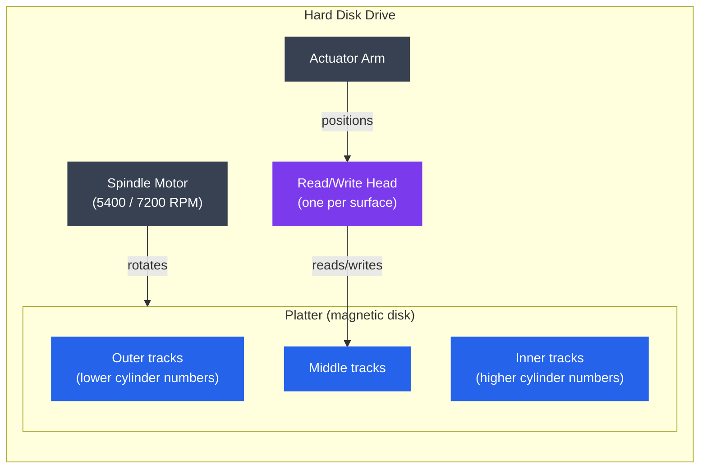
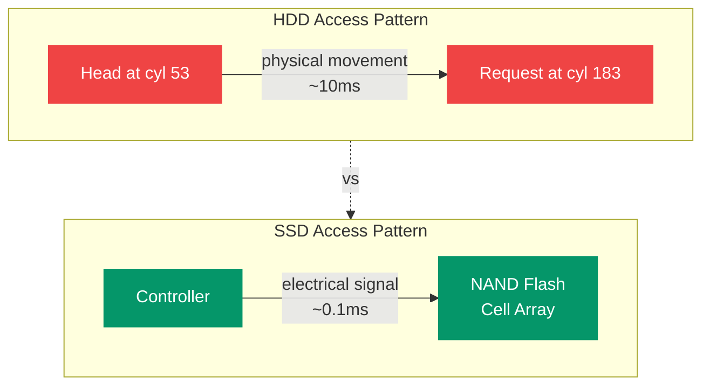

# Disk Scheduling

## Kya Padhoge Is File Mein

- HDD ka physical structure — platters, tracks, sectors, cylinders
- Seek time, rotational latency, aur transfer time — access time kahan jaata hai
- Disk scheduling algorithms: FCFS, SSTF, SCAN, C-SCAN, LOOK, C-LOOK
- Sabka comparison ek hi worked example pe
- SSD architecture kaise alag hai — no seek time, wear leveling, TRIM
- Practical tools: `iostat`, `iotop`, `hdparm`

---

## Disk Scheduling Hai Kya, Aur Zaruri Kyun Hai?

Socho tum Swiggy pe order kar rahe ho aur ek delivery boy ke paas ek saath 8 orders aa gaye — alag-alag society se. Ab agar wo orders ko **jis order mein aaye** usi order mein deliver karega (bina route dekhe), toh wo pura shehar cross karega baar baar. Petrol bhi zyada lagega, time bhi. Isse better hoga ki wo apna route smartly plan kare — jo pass mein hai pehle wahi dega, phir aage badhega.

Disk scheduling bilkul yehi problem solve karta hai, bas delivery boy ki jagah hai **disk ka read/write head**, aur society ki jagah hai **disk ke cylinders/tracks**.

Jab bhi multiple processes disk se data read/write karna chahte hain, OS ek **queue** banata hai un requests ki. Ab yeh requests kis order mein serve hongi — yeh matter karta hai kyunki disk access time bahut heavily depend karta hai head ki physical position pe. Head ko baar-baar disk ke ek end se dusre end tak bhagana — bahut costly hai.

**Total disk access time ka formula:**

```
Access Time = Seek Time + Rotational Latency + Transfer Time
```

| Component | Typical HDD value | Typical NVMe SSD |
|---|---|---|
| Seek time | 3–15 ms | ~0 (no head movement) |
| Rotational latency | 0–8 ms (avg ~4 ms @7200 RPM) | ~0 |
| Transfer time | ~1 ms for 4 KB | ~0.01 ms |

HDD mein **seek time hi sabse zyada khaata hai** — matlab head ko move karna hi sabse mehenga part hai (jaise Bangalore traffic mein ek jagah se dusri jagah pahunchna sabse zyada time leta hai, actual kaam toh 2 minute ka hota hai). Isliye request queue mein total head movement minimize karna throughput ke liye bahut critical hai.

> [!info]
> SSD mein head hi nahi hota (koi moving part nahi), isliye seek time ka concept hi apply nahi hota. Isi wajah se SSD pe disk scheduling algorithms ka utna fayda nahi hota — yeh hum aage detail mein dekhenge.

---

## Theory

### HDD Ka Physical Structure

Pehle samjho HDD banaa kaise hai — jaise ek old-school vinyl record player socho, jisme spinning disk hota hai aur ek needle (head) us pe ghoomti hai.



**Key terms samjho ek-ek karke:**

- **Platter** — yeh ek circular magnetic disk hota hai, jispe actual data store hota hai. Ek drive mein 1–5 platters ho sakte hain (jaise ek stack of CDs).
- **Track** — platter ki surface pe concentric circles hote hain, jaise pani mein pattharr girane se banne wale ripples. Inko outside se number kiya jaata hai — track 0 sabse bahar hota hai.
- **Cylinder** — agar tumhare paas multiple platters hain, toh sabhi platters ke same radial position wale tracks ko milaake ek "cylinder" banta hai. Socho ek building ke sab floors ka same-number ka flat — woh ek "vertical column" bana deta hai.
- **Sector** — track ka sabse chota addressable chunk (usually 512 B ya 4 KB). Jaise ek track ko slices mein kaata gaya ho, pizza ki tarah.
- **Seek time** — head ko target track tak move karne mein lagne wala time. Yeh sabse expensive operation hai kyunki mechanical movement involve hai.
- **Rotational latency** — head sahi track pe pahunch gaya, ab wait karna padega jab tak target sector spin karke head ke neeche na aa jaaye. Jaise merry-go-round mein apne favorite ghode ke aane ka wait karna.
- **Transfer time** — actual data read/write karne mein lagne wala time, ek baar sector head ke neeche aa jaaye.

```
Platter cross-section (top view):

        Track 0 (outermost)
    ╔═══════════════════════════╗
    ║  Track 1                  ║
    ║  ╔═════════════════════╗  ║
    ║  ║  Track 2            ║  ║
    ║  ║   ┌─────────────┐   ║  ║
    ║  ║   │  Track 3    │   ║  ║
    ║  ║   │   ┌─────┐   │   ║  ║
    ║  ║   │   │ hub │   │   ║  ║
    ║  ║   │   └─────┘   │   ║  ║
```

> [!tip]
> Yaad rakhne ka trick: **Track** = ek circle, **Cylinder** = sab platters ke same-number ke tracks ka "3D column", **Sector** = ek track ka ek slice.

### Worked Example — Request Queue

Chalo ab ek real scenario leke chalte hain, jispe sab algorithms ko test karenge. Yeh IRCTC ke tatkal booking server jaisa samjho — bahut saari requests aa rahi hain alag-alag "cylinders" (jaise alag-alag train PNR blocks) ke liye, aur humein decide karna hai kis order mein serve karna hai.

For all algorithm examples, assume:
- Current head position: **cylinder 53**
- Previous head position: **cylinder 40** (yeh initial direction decide karta hai)
- Request queue (in arrival order): **98, 183, 37, 122, 14, 124, 65, 67**
- Cylinders range: 0–199

---

### Algorithm 1: FCFS (First-Come, First-Served)

**Kya hota hai?** Sabse seedha-saadha approach — jo request pehle aayi usko pehle serve karo. Bilkul waise hi jaise bank mein token system hota hai, bina yeh dekhe ki counter kitna door hai.

Requests ko unke arrival order mein serve kiya jaata hai. Simple hai, lekin isme head ko bahut zyada zigzag karna padta hai kyunki koi bhi consideration nahi hai ki agla request kitna paas ya door hai.

```
Head path: 53 → 98 → 183 → 37 → 122 → 14 → 124 → 65 → 67

Movement: |98-53| + |183-98| + |37-183| + |122-37| + |14-122|
        + |124-14| + |65-124| + |67-65|
        = 45 + 85 + 146 + 85 + 108 + 110 + 59 + 2 = 640 cylinders
```

**Verdict:** Fair hai (koi bhi discrimination nahi karta, sab ka number aata hai order mein) — lekin bahut inefficient. Head disk ke ek end se dusre end tak baar baar bhaagta hai, jaise Mumbai local mein peak hour mein platform-1 se platform-8 baar baar daudna.

---

### Algorithm 2: SSTF (Shortest Seek Time First)

**Kya hota hai?** Greedy approach — jo bhi request abhi ke head position se sabse kareeb hai, usko pehle serve karo. Bilkul Zomato ke delivery-boy assignment jaisa — jo restaurant nearest hai wahan pehle jaao, chaahe order kab aaya ho.

```
Head path: 53 → 65 → 67 → 37 → 14 → 98 → 122 → 124 → 183

Movement: 12 + 2 + 30 + 23 + 84 + 24 + 2 + 59 = 236 cylinders
```

**Pros:** FCFS se kaafi kam movement — 640 se seedha 236 pe aa gaya!

**Cons:** **Starvation** ka bada risk hai — jaise agar city ke center mein hamesha naye orders aate rahein, toh jo customer city ke bahar (dur) baitha hai uska order kabhi assign hi nahi hoga. Disk ke far-end wale requests indefinitely wait kar sakte hain agar paas wale requests continuously aate rahein.

> [!warning]
> SSTF theoretically sabse efficient lagta hai per-request basis pe, lekin production systems mein rarely use hota hai bina fairness guarantee ke — kyunki ek "unlucky" request bahut lamba wait kar sakta hai.

---

### Algorithm 3: SCAN (Elevator Algorithm)

**Kya hota hai?** Iska naam hi "Elevator Algorithm" hai kyunki yeh bilkul lift ki tarah kaam karta hai. Socho tum apne office building ki lift mein ho — lift ek direction mein jaati hai (upar), raaste mein jo bhi floor button dabaya gaya hai wahan rukti hai, aur top floor tak pahunchne ke baad reverse hoke neeche aati hai. Beech mein direction change nahi karti bar-bar.

Head ek direction mein move karta hai, raaste mein jo bhi requests padti hain unko serve karta hai, jab tak disk ke end tak na pahunch jaaye. Phir direction reverse karke wapas sweep karta hai.


```
Movement: 12+2+31+24+2+59+16 + 162+23 = 331 cylinders
```

**Pros:** Koi starvation nahi hoti — kyunki har request eventually us "sweep" mein aa jaayegi. Wait times bhi predictable hote hain.

**Cons:** Notice karo — head 199 tak jaata hai jabki wahan koi request hi nahi thi (183 hi last request thi us direction mein)! Yeh **wasted movement** hai. Aur jo requests head ke thodi der pehle wali position ke "just peeche" hain unko poora round-trip wait karna padta hai — jaise lift 10th floor tak khaali jaake fir wapas 2nd floor aaye.

---

### Algorithm 4: C-SCAN (Circular SCAN)

**Kya hota hai?** SCAN jaisa hi hai, but ek twist ke saath — jab head end tak pahunchta hai, toh wapas cylinder 0 pe **seedha jump** kar jaata hai, bina return trip mein koi request serve kiye. Fir wahan se dubara upar ki taraf scan start karta hai.

Isko samjho ek **one-way circular conveyor belt** ki tarah — jaise Delhi Metro ki circular line, jo hamesha ek hi direction mein chalti hai, end se start pe seedhe wapas aa jaati hai bina beech mein passengers utaare.

Like SCAN, but after reaching the end, the head jumps back to cylinder 0 **without servicing requests on the return trip**. Isse wait times zyada uniform ho jaate hain — kyunki disk ko ek circular list ki tarah treat kiya jaata hai.

```
Head path: 53 → 65 → 67 → 98 → 122 → 124 → 183 → 199
           → jump to 0 (no service) → 14 → 37

Movement (servicing): 146 + jump(199) + 14 + 23 = 382 cylinders total
```

199→0 wala jump ek physical movement hai (head ko wahan jaana hi padega), lekin uss journey mein koi I/O perform nahi hoti — sirf traversal hai. C-SCAN disk ko circular list maanta hai — cylinders **strictly increasing order** mein serve hote hain, aur 199 ke baad wapas 0 se cycle start hoti hai.

**Kyun zaruri hai yeh approach?** SCAN mein jo requests disk ke "far end" pe hoti hain unko kabhi bhi lamba wait milta hai (ek baar head unse aage nikal jaaye toh wapas aane mein pura sweep lagta hai), jabki middle wale requests ko dono directions mein fayda milta hai. C-SCAN yeh **asymmetry fix** kar deta hai — sab requests ko roughly equal treatment milta hai.

---

### Algorithm 5: LOOK

**Kya hota hai?** SCAN ka smarter version — head disk ke bilkul end (199 ya 0) tak nahi jaata, balki sirf **last actual request** tak jaata hai us direction mein, phir wahi se reverse ho jaata hai. Jaise ek smart delivery boy jo pata hai ki last order kahan tak hai, toh wahan tak jaake wapas mud jaata hai — bina ghar ke aakhri gali tak khaali jaaye.

```
Head path (moving up): 53 → 65 → 67 → 98 → 122 → 124 → 183 (last request)
                       → reverse → 37 → 14

Movement: 130 + 169 = 299 cylinders
```

**Pros:** Disk ke edges tak unnecessary travel avoid karta hai — SCAN se better performance deta hai bina koi downside ke. Isliye practically LOOK, SCAN se hamesha better ya equal hota hai.

---

### Algorithm 6: C-LOOK

**Kya hota hai?** C-SCAN + LOOK ka combo — best of both worlds. Head sirf current direction ke last request tak jaata hai (LOOK ki tarah), phir seedha **sabse lowest-numbered pending request** pe jump karta hai (0 pe nahi, jaise C-SCAN karta tha), aur wahan se phir upar ki taraf move karta hai.

Combines C-SCAN and LOOK: head only goes to the last request in the current direction, then jumps back to the lowest-numbered pending request (not cylinder 0) and moves up again.

```
Head path: 53 → 65 → 67 → 98 → 122 → 124 → 183
           → jump to 14 → 37

Movement (servicing): 130 + jump + 23 = shorter total travel
```

> [!tip]
> **C-LOOK is the algorithm used by most real operating systems** (Linux I/O elevator, Windows disk scheduler) as a basis. Yeh isliye best hai kyunki na toh unnecessary edge tak jaata hai (LOOK ka fayda), na hi asymmetric wait times deta hai (C-SCAN ka fayda). Real-world production systems mein yehi sabse common base hai.

---

### Algorithm Comparison

| Algorithm | Total Movement | Starvation | Complexity | Notes |
|---|---|---|---|---|
| FCFS | 640 | No | Trivial | Fair but inefficient |
| SSTF | 236 | Yes | Low | Risk of starvation |
| SCAN | 331 | No | Low | Good for heavy loads |
| C-SCAN | ~382 | No | Low | Uniform wait times |
| LOOK | 299 | No | Low | Better than SCAN |
| C-LOOK | ~270 | No | Low | Best general-purpose |

Ek quick recap in Hinglish: agar tumse interview mein poochein "sabse best algorithm konsa hai?" — seedha jawab hai **C-LOOK**, kyunki woh na starvation deta hai, na unnecessary edge-travel karta hai, aur wait times bhi kaafi uniform rehte hain. FCFS aur SSTF dono extreme hain — ek bahut simple-fair-slow, dusra fast-but-unfair.

---

### SSD Differences

Ab tak humne jo bhi dekha, wo sab **HDD** ke liye tha, jahan physical head move karta hai. Lekin SSD ek totally different beast hai.

**Kyun alag hai SSD?** SSDs mein **koi moving parts hi nahi hote** — sara data access electrical signals ke through hota hai, NAND flash memory cells mein. Yeh IRCTC ke purane counter-based booking (jahan clerk ko physically file dhundhni padti thi) se online booking jaisa farak hai — ab sab kuch instant electrical/digital hai, koi physical movement nahi.



| Feature | HDD | SSD |
|---|---|---|
| Seek time | 3–15 ms | None |
| Random read latency | ~10 ms | ~0.1 ms |
| Sequential read | ~200 MB/s | 500–7000 MB/s |
| Scheduling benefit | High — minimizing seeks matters | Low — random I/O is fast |
| Write granularity | Sector (512 B) | Page (~4–16 KB) |
| Erase granularity | N/A | Block (128–512 pages) |

**SSD-specific concerns — yeh naye headaches SSD ke saath aate hain:**

**Wear leveling:** NAND cells ki ek finite write endurance hoti hai (~1000–100,000 program/erase cycles). Socho ek notebook jispe tum sirf pencil se likh sakte ho aur eraser se mita sakte ho — lekin kaagaz ek limited number of erase cycles hi jhel sakta hai, uske baad phat jaata hai. SSD firmware (jise **FTL — Flash Translation Layer** kehte hain) is problem ko solve karta hai writes ko **evenly distribute** karke saare cells pe, taaki koi ek cell jaldi na mar jaaye jabki baaki cells bilkul fresh rahein.

**Write amplification:** Kabhi kabhi ek chhota sa data likhna bhi bahut zyada kaam karwa deta hai — poora block read karna padta hai, ek page modify karna padta hai, aur poora block wapas likhna padta hai. Data jo actually flash pe likha gaya uska ratio, OS ne jo request kiya tha usse — yeh hai **Write Amplification Factor (WAF)**. WAF = 1.0 ideal hota hai (matlab jitna maanga utna hi likha), lekin real mein hamesha thoda zyada hota hai.

**TRIM:** Jab OS koi file delete karta hai, wo SSD ko ek `TRIM` command bhejta hai yeh batane ke liye ki "bhai, yeh pages ab use mein nahi hain, tu inhe free maan sakta hai." Bina TRIM ke, SSD ko pata hi nahi chalta ki kaunse pages "dead" hain — wo unhe still-live samajhkar unnecessary garbage-collection karta rehta hai, jisse performance degrade hoti hai. Yeh bilkul waise hai jaise koi restaurant table clear na kare jab tak customer khud bataye "bhai maine table chhod diya" — warna staff soch ta rahega table occupied hai.

```bash
# Verify TRIM is enabled (Linux)
sudo fstrim -v /
# Output: /: 12.3 GiB (13209833472 bytes) trimmed

# Check TRIM support
sudo hdparm -I /dev/sda | grep -i trim

# Enable periodic TRIM via systemd timer (usually pre-configured)
systemctl status fstrim.timer
```

**Scheduler recommendation for SSDs:** SSD pe complex elevator algorithms (jaise SCAN, LOOK) ka koi fayda nahi — ulta CPU overhead add hota hai bina benefit ke, kyunki wahan seek time hai hi nahi jise optimize karna ho. Isliye SSD ke liye `none` ya `mq-deadline` scheduler use karo.

```bash
# Check current I/O scheduler
cat /sys/block/sda/queue/scheduler

# Set none (pass-through) for NVMe SSD
echo none | sudo tee /sys/block/nvme0n1/queue/scheduler

# Set mq-deadline for SATA SSD
echo mq-deadline | sudo tee /sys/block/sda/queue/scheduler

# Make permanent (add to /etc/udev/rules.d/60-scheduler.rules)
ACTION=="add|change", KERNEL=="sd[a-z]", ATTR{queue/rotational}=="0", \
  ATTR{queue/scheduler}="mq-deadline"
ACTION=="add|change", KERNEL=="nvme[0-9]*", \
  ATTR{queue/scheduler}="none"
```

> [!warning]
> Agar galti se HDD ke liye SSD wala scheduler laga diya (ya vice versa), toh performance seriously degrade ho sakti hai. HDD ke liye elevator-style scheduler (`mq-deadline`, `bfq`) hi use karo — SSD ke liye `none` ya `mq-deadline` prefer karo.

---

## Practice

Ab thoda hands-on karte hain — kaise pata karein tumhare system ka disk kaisa perform kar raha hai.

### iostat — I/O Statistics

**Kyun zaruri hai?** Jaise Ola/Uber app tumhe batata hai driver kahan hai, ETA kya hai — waise hi `iostat` tumhe batata hai tumhare disk ki real-time health kya hai: kitni reads/writes ho rahi hain, kitna wait time hai, disk kitna busy hai.

```bash
# Install (part of sysstat)
sudo apt install sysstat        # Debian/Ubuntu
sudo dnf install sysstat        # RHEL/Fedora

# Basic disk statistics (1-second intervals, 5 reports)
iostat -x 1 5

# Sample output:
# Device   r/s    w/s  rkB/s  wkB/s  await  svctm  %util
# sda     10.00  25.00 160.0  400.0   2.50   0.80   2.80
# nvme0n1 500.0 1200.0 8000  19200   0.10   0.05   8.50

# Key columns:
#   r/s, w/s       — reads/writes per second
#   rkB/s, wkB/s   — KB read/written per second
#   await          — average I/O wait time (ms) — KEY metric
#   %util          — % time device was busy (100% = saturated)

# Per-device breakdown
iostat -xd 2

# Show extended stats including queue depth
iostat -xdz 2 /dev/sda
```

`await` column sabse important hai — agar yeh baahar spike kar raha hai matlab requests ko serve hone mein zyada time lag raha hai, disk bottleneck ban raha hai.

### iotop — Per-Process I/O

**Kyun zaruri hai?** `iostat` tumhe overall disk health batata hai, lekin agar yeh jaanna ho ki **kaunsa process** sabse zyada disk hog kar raha hai (jaise `top` command CPU ke liye batata hai), toh `iotop` use karo.

```bash
# Install
sudo apt install iotop

# Interactive mode (shows top I/O consumers, updates every 1s)
sudo iotop

# Batch mode — useful for scripting and logging
sudo iotop -b -n 5       # 5 iterations, batch output

# Show only processes actually doing I/O (less noise)
sudo iotop -o

# Sample output:
# Total DISK READ: 12.50 M/s | Total DISK WRITE: 4.20 M/s
# PID    PRIO  USER     DISK READ  DISK WRITE  SWAPIN  IO>  COMMAND
# 12345  be/4  mysql     8.50 M/s   2.10 M/s    0.00 % 35 % mysqld
# 6789   be/4  www-data  2.00 M/s   1.80 M/s    0.00 % 12 % nginx
```

Agar tumhara production server slow chal raha hai aur suspect hai ki koi process disk ko heavy use kar raha hai (jaise ek runaway MySQL query ya log-heavy service), `iotop -o` seedha culprit dikha dega.

### hdparm — Disk Parameter Tool

**Kya kaam aata hai?** `hdparm` tumhe disk ke low-level parameters check aur tweak karne deta hai — raw throughput measure karna ho, ya write caching enable karni ho.

```bash
# Measure raw read throughput
sudo hdparm -t /dev/sda         # buffered disk reads
sudo hdparm -T /dev/sda         # cached reads (RAM speed)

# Sample output:
# /dev/sda:
#  Timing buffered disk reads: 450 MB in 3.00 seconds = 150.0 MB/sec

# Check disk features and identity
sudo hdparm -I /dev/sda | head -40

# Enable write caching (improves write performance, risk on power loss)
sudo hdparm -W 1 /dev/sda

# Spin down HDD after N seconds of inactivity (S = 0 to disable)
sudo hdparm -S 120 /dev/sda     # spin down after 10 minutes
```

> [!warning]
> Write caching enable karna performance boost deta hai, lekin agar power achanak chali jaaye toh uncommitted writes lose ho sakte hain — laptop pe UPS/battery na ho toh sochke enable karo.

### Benchmarking with fio

**Kyun zaruri hai?** Real-world workload simulate karke test karna ho (jaise "agar mera app 4KB random reads kare toh IOPS kya milega?"), toh `fio` industry-standard tool hai.

```bash
# Install
sudo apt install fio

# Test random 4K read IOPS (SSD benchmark)
fio --name=rand-read \
    --ioengine=libaio \
    --iodepth=32 \
    --rw=randread \
    --bs=4k \
    --size=1G \
    --numjobs=4 \
    --time_based \
    --runtime=30 \
    --filename=/dev/nvme0n1 \
    --direct=1

# Test sequential write throughput (HDD benchmark)
fio --name=seq-write \
    --ioengine=libaio \
    --iodepth=1 \
    --rw=write \
    --bs=1M \
    --size=4G \
    --filename=/tmp/testfile \
    --direct=1
```

### Checking I/O Queue Depth and Scheduler

Yeh ek chota script hai jo sab block devices ka scheduler, queue depth, aur type (HDD ya SSD) ek saath dikha deta hai — bahut handy hai jab naya server setup kar rahe ho aur verify karna ho ki sahi scheduler laga hai.

```bash
# Current scheduler and queue depth for all block devices
for dev in /sys/block/*/; do
    name=$(basename "$dev")
    sched=$(cat "$dev/queue/scheduler" 2>/dev/null)
    qdepth=$(cat "$dev/queue/nr_requests" 2>/dev/null)
    rotational=$(cat "$dev/queue/rotational" 2>/dev/null)
    echo "$name: scheduler=[$sched] queue=$qdepth rotational=$rotational"
done

# Increase queue depth for high-throughput workloads
echo 256 | sudo tee /sys/block/sda/queue/nr_requests
```

`rotational=1` ka matlab HDD hai (ghoomta hai), `rotational=0` ka matlab SSD hai (koi movement nahi) — is trick se tum script mein automatically detect kar sakte ho konsa disk hai aur usko sahi scheduler assign kar sakte ho.

---

## Key Takeaways

- **HDD access time = seek time + rotational latency + transfer time** — aur seek time sabse zyada khaata hai, isliye scheduling algorithms ka pura focus head-movement minimize karne pe hota hai.
- **FCFS** simple aur fair hai, lekin head ko zigzag kara ke bahut inefficient bana deta hai.
- **SSTF** greedily nearest request pick karta hai — movement kam hota hai, lekin far-end requests **starve** ho sakte hain.
- **SCAN (elevator)** ek direction mein sweep karta hai disk ke end tak, phir reverse — no starvation, lekin edge tak unnecessary travel hota hai.
- **LOOK** SCAN ka improvement hai — sirf last request tak jaata hai, disk edge tak nahi — better performance, same fairness.
- **C-SCAN aur C-LOOK** disk ko circular treat karte hain, jisse wait times zyada **uniform** ho jaate hain — **C-LOOK real-world OS schedulers (Linux, Windows) ka base hai.**
- **SSDs** mein koi seek time hi nahi hota (no moving parts), isliye complex scheduling algorithms ka fayda nahi — `none` ya `mq-deadline` use karo, aur TRIM zaroor enable rakho taaki wear leveling aur performance maintained rahe.
- Monitoring ke liye: `iostat` (throughput + await time), `iotop` (per-process culprit dhundhne ke liye), aur `fio` (custom workload benchmarking ke liye).
