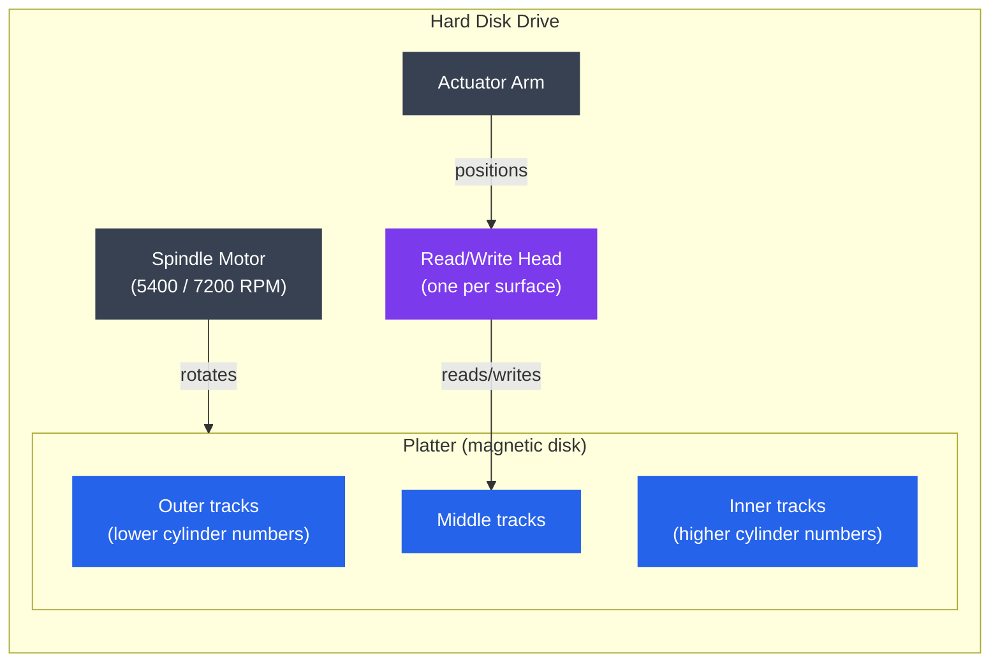
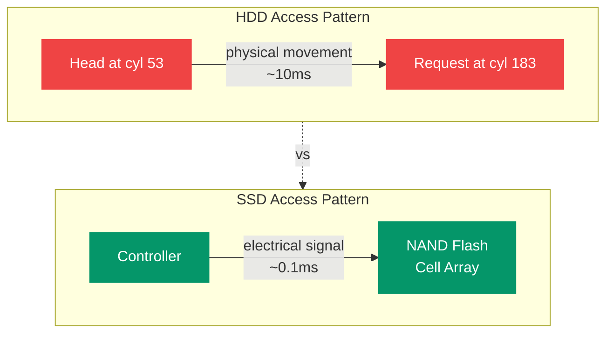

# Disk Scheduling

## What You'll Learn

- HDD physical structure: platters, tracks, sectors, cylinders
- Seek time, rotational latency, and transfer time
- Disk scheduling algorithms: FCFS, SSTF, SCAN, C-SCAN, LOOK, C-LOOK
- Comparison of algorithms with a worked example
- SSD architecture differences: no seek time, wear leveling, TRIM
- Practical tools: `iostat`, `iotop`, `hdparm`

---

## Introduction to Disk Scheduling

The OS manages a queue of I/O requests destined for a disk. The order in which those requests are served matters because disk access time depends heavily on the physical position of the read/write head.

**Total disk access time:**

```
Access Time = Seek Time + Rotational Latency + Transfer Time
```

| Component | Typical HDD value | Typical NVMe SSD |
|---|---|---|
| Seek time | 3–15 ms | ~0 (no head movement) |
| Rotational latency | 0–8 ms (avg ~4 ms @7200 RPM) | ~0 |
| Transfer time | ~1 ms for 4 KB | ~0.01 ms |

For HDDs, **seek time dominates** — minimizing total head movement across a request queue significantly improves throughput.

---

## Theory

### HDD Physical Structure



**Key terms:**

- **Platter** — circular magnetic disk; a drive has 1–5 platters
- **Track** — concentric circle on a platter surface; numbered from outside (0) inward
- **Cylinder** — all tracks at the same radial position across all platters
- **Sector** — smallest addressable unit on a track (512 B or 4 KB)
- **Seek time** — time to move the head to the target track
- **Rotational latency** — time waiting for the target sector to spin under the head
- **Transfer time** — time to read/write the actual data

```
Platter cross-section (top view):

        Track 0 (outermost)
    ╔═══════════════════════════╗
    ║  Track 1                  ║
    ║  ╔═════════════════════╗  ║
    ║  ║  Track 2            ║  ║
    ║  ║   ┌─────────────┐   ║  ║
    ║  ║   │  Track 3    │   ║  ║
    ║  ║   │   ┌─────┐   │   ║  ║
    ║  ║   │   │ hub │   │   ║  ║
    ║  ║   │   └─────┘   │   ║  ║
```

### Worked Example — Request Queue

For all algorithm examples, assume:
- Current head position: **cylinder 53**
- Previous head position: **cylinder 40** (determines initial direction)
- Request queue (in arrival order): **98, 183, 37, 122, 14, 124, 65, 67**
- Cylinders range: 0–199

---

### Algorithm 1: FCFS (First-Come, First-Served)

Requests are served in the order they arrive. Simple but can cause excessive head movement.

```
Head path: 53 → 98 → 183 → 37 → 122 → 14 → 124 → 65 → 67

Movement: |98-53| + |183-98| + |37-183| + |122-37| + |14-122|
        + |124-14| + |65-124| + |67-65|
        = 45 + 85 + 146 + 85 + 108 + 110 + 59 + 2 = 640 cylinders
```

**Verdict:** Fair but very inefficient — the head zigzags across the disk.

---

### Algorithm 2: SSTF (Shortest Seek Time First)

Always serves the request closest to the current head position.

```
Head path: 53 → 65 → 67 → 37 → 14 → 98 → 122 → 124 → 183

Movement: 12 + 2 + 30 + 23 + 84 + 24 + 2 + 59 = 236 cylinders
```

**Pros:** significantly less movement than FCFS

**Cons:** **starvation** — requests at the far end of the disk may wait indefinitely if new nearby requests keep arriving

---

### Algorithm 3: SCAN (Elevator Algorithm)

The head moves in one direction, servicing requests along the way, until it reaches the end of the disk. Then it reverses direction and sweeps back.


```
Movement: 12+2+31+24+2+59+16 + 162+23 = 331 cylinders
```

**Pros:** no starvation; predictable wait times

**Cons:** requests just behind the head's current position wait for the full round trip

---

### Algorithm 4: C-SCAN (Circular SCAN)

Like SCAN, but after reaching the end, the head jumps back to cylinder 0 **without servicing requests on the return trip**. Provides more uniform wait times.

```
Head path: 53 → 65 → 67 → 98 → 122 → 124 → 183 → 199
           → jump to 0 (no service) → 14 → 37

Movement (servicing): 146 + jump(199) + 14 + 23 = 382 cylinders total
```

The jump from 199→0 is a physical movement but no I/O is performed. C-SCAN treats the disk as a circular list — cylinders are served in a strictly increasing order, cycling back to 0 after 199.

---

### Algorithm 5: LOOK

Like SCAN but the head only travels as far as the **last request** in each direction — it does not go all the way to the disk edge.

```
Head path (moving up): 53 → 65 → 67 → 98 → 122 → 124 → 183 (last request)
                       → reverse → 37 → 14

Movement: 130 + 169 = 299 cylinders
```

**Pros:** avoids unnecessary travel to disk edges; better than SCAN

---

### Algorithm 6: C-LOOK

Combines C-SCAN and LOOK: head only goes to the last request in the current direction, then jumps back to the lowest-numbered pending request (not cylinder 0) and moves up again.

```
Head path: 53 → 65 → 67 → 98 → 122 → 124 → 183
           → jump to 14 → 37

Movement (servicing): 130 + jump + 23 = shorter total travel
```

**C-LOOK is the algorithm used by most real operating systems** (Linux I/O elevator, Windows disk scheduler) as a basis.

---

### Algorithm Comparison

| Algorithm | Total Movement | Starvation | Complexity | Notes |
|---|---|---|---|---|
| FCFS | 640 | No | Trivial | Fair but inefficient |
| SSTF | 236 | Yes | Low | Risk of starvation |
| SCAN | 331 | No | Low | Good for heavy loads |
| C-SCAN | ~382 | No | Low | Uniform wait times |
| LOOK | 299 | No | Low | Better than SCAN |
| C-LOOK | ~270 | No | Low | Best general-purpose |

---

### SSD Differences

SSDs have **no moving parts** — all data is accessed via electrical signals through flash memory cells. This fundamentally changes I/O characteristics.



| Feature | HDD | SSD |
|---|---|---|
| Seek time | 3–15 ms | None |
| Random read latency | ~10 ms | ~0.1 ms |
| Sequential read | ~200 MB/s | 500–7000 MB/s |
| Scheduling benefit | High — minimizing seeks matters | Low — random I/O is fast |
| Write granularity | Sector (512 B) | Page (~4–16 KB) |
| Erase granularity | N/A | Block (128–512 pages) |

**SSD-specific concerns:**

**Wear leveling:** NAND cells have a finite write endurance (~1000–100,000 program/erase cycles). The SSD firmware (FTL — Flash Translation Layer) distributes writes evenly across all cells to prevent early cell death.

**Write amplification:** Writing a small amount of data may require reading an entire block, modifying a page, and rewriting the whole block. The ratio of data actually written to flash vs data the OS requested is the Write Amplification Factor (WAF). A WAF of 1.0 is ideal.

**TRIM:** When the OS deletes a file, it sends a `TRIM` command to notify the SSD that those pages are no longer in use. Without TRIM, the SSD wastes time garbage-collecting pages it thinks are still live.

```bash
# Verify TRIM is enabled (Linux)
sudo fstrim -v /
# Output: /: 12.3 GiB (13209833472 bytes) trimmed

# Check TRIM support
sudo hdparm -I /dev/sda | grep -i trim

# Enable periodic TRIM via systemd timer (usually pre-configured)
systemctl status fstrim.timer
```

**Scheduler recommendation for SSDs:** use the `none` or `mq-deadline` scheduler — complex elevator algorithms add CPU overhead for no benefit on SSDs.

```bash
# Check current I/O scheduler
cat /sys/block/sda/queue/scheduler

# Set none (pass-through) for NVMe SSD
echo none | sudo tee /sys/block/nvme0n1/queue/scheduler

# Set mq-deadline for SATA SSD
echo mq-deadline | sudo tee /sys/block/sda/queue/scheduler

# Make permanent (add to /etc/udev/rules.d/60-scheduler.rules)
ACTION=="add|change", KERNEL=="sd[a-z]", ATTR{queue/rotational}=="0", \
  ATTR{queue/scheduler}="mq-deadline"
ACTION=="add|change", KERNEL=="nvme[0-9]*", \
  ATTR{queue/scheduler}="none"
```

---

## Practice

### iostat — I/O Statistics

```bash
# Install (part of sysstat)
sudo apt install sysstat        # Debian/Ubuntu
sudo dnf install sysstat        # RHEL/Fedora

# Basic disk statistics (1-second intervals, 5 reports)
iostat -x 1 5

# Sample output:
# Device   r/s    w/s  rkB/s  wkB/s  await  svctm  %util
# sda     10.00  25.00 160.0  400.0   2.50   0.80   2.80
# nvme0n1 500.0 1200.0 8000  19200   0.10   0.05   8.50

# Key columns:
#   r/s, w/s       — reads/writes per second
#   rkB/s, wkB/s   — KB read/written per second
#   await          — average I/O wait time (ms) — KEY metric
#   %util          — % time device was busy (100% = saturated)

# Per-device breakdown
iostat -xd 2

# Show extended stats including queue depth
iostat -xdz 2 /dev/sda
```

### iotop — Per-Process I/O

```bash
# Install
sudo apt install iotop

# Interactive mode (shows top I/O consumers, updates every 1s)
sudo iotop

# Batch mode — useful for scripting and logging
sudo iotop -b -n 5       # 5 iterations, batch output

# Show only processes actually doing I/O (less noise)
sudo iotop -o

# Sample output:
# Total DISK READ: 12.50 M/s | Total DISK WRITE: 4.20 M/s
# PID    PRIO  USER     DISK READ  DISK WRITE  SWAPIN  IO>  COMMAND
# 12345  be/4  mysql     8.50 M/s   2.10 M/s    0.00 % 35 % mysqld
# 6789   be/4  www-data  2.00 M/s   1.80 M/s    0.00 % 12 % nginx
```

### hdparm — Disk Parameter Tool

```bash
# Measure raw read throughput
sudo hdparm -t /dev/sda         # buffered disk reads
sudo hdparm -T /dev/sda         # cached reads (RAM speed)

# Sample output:
# /dev/sda:
#  Timing buffered disk reads: 450 MB in 3.00 seconds = 150.0 MB/sec

# Check disk features and identity
sudo hdparm -I /dev/sda | head -40

# Enable write caching (improves write performance, risk on power loss)
sudo hdparm -W 1 /dev/sda

# Spin down HDD after N seconds of inactivity (S = 0 to disable)
sudo hdparm -S 120 /dev/sda     # spin down after 10 minutes
```

### Benchmarking with fio

```bash
# Install
sudo apt install fio

# Test random 4K read IOPS (SSD benchmark)
fio --name=rand-read \
    --ioengine=libaio \
    --iodepth=32 \
    --rw=randread \
    --bs=4k \
    --size=1G \
    --numjobs=4 \
    --time_based \
    --runtime=30 \
    --filename=/dev/nvme0n1 \
    --direct=1

# Test sequential write throughput (HDD benchmark)
fio --name=seq-write \
    --ioengine=libaio \
    --iodepth=1 \
    --rw=write \
    --bs=1M \
    --size=4G \
    --filename=/tmp/testfile \
    --direct=1
```

### Checking I/O Queue Depth and Scheduler

```bash
# Current scheduler and queue depth for all block devices
for dev in /sys/block/*/; do
    name=$(basename "$dev")
    sched=$(cat "$dev/queue/scheduler" 2>/dev/null)
    qdepth=$(cat "$dev/queue/nr_requests" 2>/dev/null)
    rotational=$(cat "$dev/queue/rotational" 2>/dev/null)
    echo "$name: scheduler=[$sched] queue=$qdepth rotational=$rotational"
done

# Increase queue depth for high-throughput workloads
echo 256 | sudo tee /sys/block/sda/queue/nr_requests
```

---

## Summary

- **HDD access time = seek + rotational latency + transfer** — seek time dominates and motivates scheduling.
- **FCFS** is simple but causes excessive head movement.
- **SSTF** minimizes movement greedily but can starve far requests.
- **SCAN/LOOK** (elevator) sweep in one direction, providing bounded wait times without starvation; LOOK is preferred as it avoids unnecessary travel to disk edges.
- **C-SCAN/C-LOOK** add uniformity by treating the disk as circular, avoiding longer waits for requests at the "return" end.
- **SSDs** have no seek time, making scheduling largely irrelevant; use the `none` or `mq-deadline` scheduler and ensure TRIM is active.
- Monitor with `iostat` (throughput and await), `iotop` (per-process I/O), and `fio` (benchmarking).
