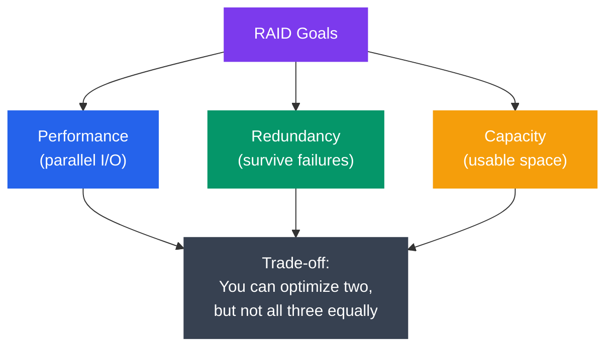
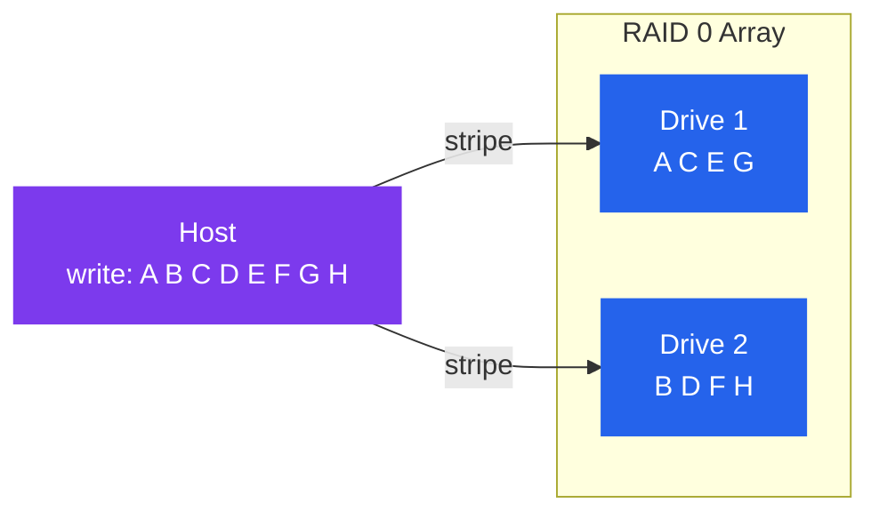
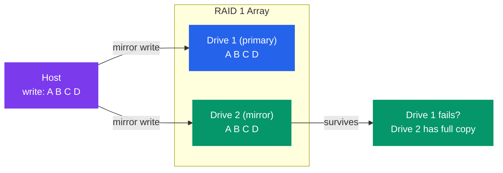
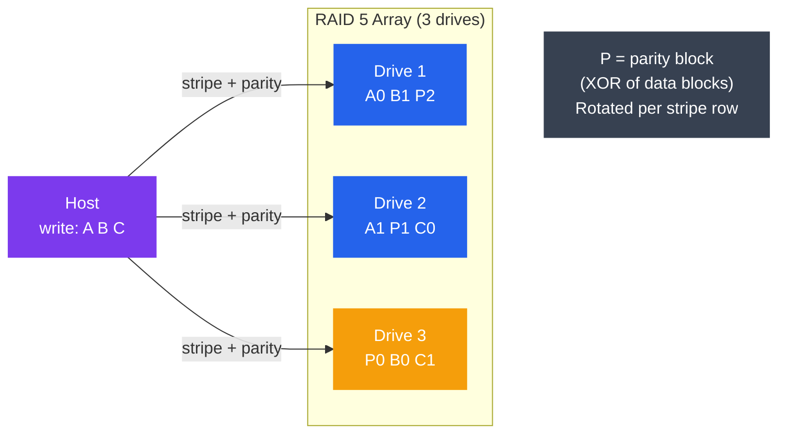
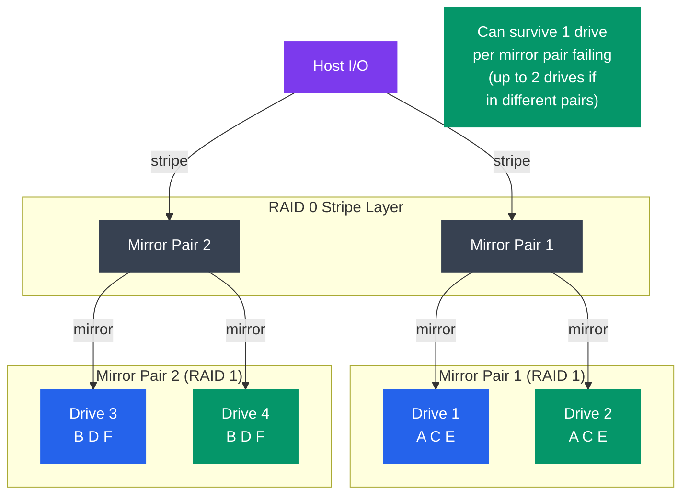
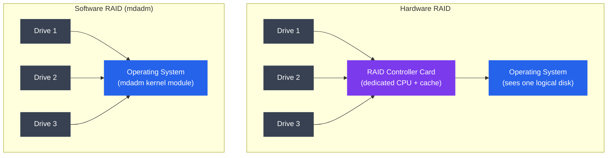

# RAID

## What You'll Learn

- What RAID is and the fundamental trade-off: redundancy vs performance vs capacity
- RAID 0, 1, 5, 6, and 10 — how each works, and when to use each
- Capacity, performance, and fault tolerance for every level
- Hardware RAID vs Software RAID (Linux `mdadm`)
- Mean Time Between Failures (MTBF) and reliability calculations
- Practical `mdadm` commands for managing software RAID arrays

---

## Introduction to RAID

**RAID (Redundant Array of Independent Disks)** combines multiple physical drives into a single logical unit to achieve one or more of:

- **Performance** — spread I/O across multiple drives in parallel
- **Redundancy** — survive one or more drive failures without data loss
- **Capacity** — combine drives into a single large volume

No single RAID level maximizes all three simultaneously. Choosing a RAID level means picking a trade-off.



---

## Theory

### RAID 0 — Striping (Performance, No Redundancy)

Data is split into chunks (stripes) and written across all drives simultaneously. No redundancy — if any drive fails, all data is lost.



- **Usable capacity:** N × drive size (100% efficient)
- **Read performance:** N × single drive (linear scaling)
- **Write performance:** N × single drive (linear scaling)
- **Fault tolerance:** None — 1 drive failure = total data loss
- **Minimum drives:** 2
- **Use case:** scratch disks, video editing, caches — where speed matters and data is reproducible

---

### RAID 1 — Mirroring (Redundancy, No Capacity Gain)

Every write is duplicated to all drives. Reads can be served from any drive (potentially doubled read speed).



- **Usable capacity:** 1 × drive size (50% efficient with 2 drives)
- **Read performance:** Up to N × (reads load-balanced across mirrors)
- **Write performance:** Same as single drive (all mirrors must be written)
- **Fault tolerance:** Survives N−1 drive failures (all but one can fail)
- **Minimum drives:** 2
- **Use case:** OS drives, databases with critical data, boot volumes

---

### RAID 5 — Striping with Distributed Parity

Data is striped across N−1 drives; one drive's worth of space holds **parity** (XOR of the data stripes). Parity is distributed — no single drive is the dedicated parity drive. Survives one drive failure.



**How parity recovery works:**

```
Drives: D1=A, D2=B, D3=P where P = A XOR B

D2 fails. Recover B:
  B = A XOR P = A XOR (A XOR B) = B  ✓
```

- **Usable capacity:** (N−1) × drive size
- **Read performance:** (N−1) × single drive (data on N−1 drives)
- **Write performance:** Slower than RAID 0 — each write requires read-modify-write parity update
- **Fault tolerance:** 1 drive failure
- **Minimum drives:** 3
- **Use case:** General-purpose NAS, file servers — good balance of capacity, performance, redundancy

**RAID 5 write penalty:** every small write requires 4 I/Os: read old data + read old parity + write new data + write new parity.

---

### RAID 6 — Striping with Dual Parity

Like RAID 5 but with two independent parity blocks per stripe (using different mathematical schemes — typically Reed-Solomon). Can survive **two simultaneous drive failures**.

```
Drive layout (4 drives):
  Stripe 0:  A0   A1   P0   Q0
  Stripe 1:  B0   P1   Q1   B1
  Stripe 2:  P2   Q2   C0   C1

P = XOR parity (like RAID 5)
Q = Galois Field parity (independent recovery path)
```

- **Usable capacity:** (N−2) × drive size
- **Read performance:** (N−2) × single drive
- **Write performance:** Higher write penalty than RAID 5 (6 I/Os per small write)
- **Fault tolerance:** 2 drive failures
- **Minimum drives:** 4
- **Use case:** Large arrays (12+ drives) where probability of second drive failing during rebuild is non-negligible; archival storage

---

### RAID 10 — Striped Mirrors (RAID 1+0)

Pairs of drives are mirrored (RAID 1), then the mirrors are striped together (RAID 0). Combines the performance of RAID 0 with the redundancy of RAID 1.



- **Usable capacity:** N/2 × drive size (50% efficient)
- **Read performance:** N × single drive (reads from any mirror)
- **Write performance:** N/2 × single drive (all mirrors must be written, but pairs are parallel)
- **Fault tolerance:** 1 drive per mirror pair; can lose up to N/2 drives in the best case
- **Minimum drives:** 4
- **Use case:** High-performance databases (MySQL, PostgreSQL), virtualization hosts — best combination of speed and safety but expensive

---

### RAID Level Summary Table

| Level | Aliases | Min Drives | Usable Capacity | Read Perf | Write Perf | Drive Failures Tolerated | Use Case |
|---|---|---|---|---|---|---|---|
| RAID 0 | Striping | 2 | N × disk | Excellent | Excellent | 0 | Scratch / cache |
| RAID 1 | Mirroring | 2 | 1 × disk | Good | Same as 1 disk | N−1 | OS, boot |
| RAID 5 | Stripe+parity | 3 | (N−1) × disk | Good | Moderate | 1 | NAS, fileserver |
| RAID 6 | Dual parity | 4 | (N−2) × disk | Good | Slow | 2 | Large arrays |
| RAID 10 | 1+0 | 4 | N/2 × disk | Excellent | Good | 1 per pair | Databases |

---

### Hardware RAID vs Software RAID



| Feature | Hardware RAID | Software RAID (mdadm) |
|---|---|---|
| CPU usage | Offloaded to controller | Uses host CPU |
| Performance | Very high (dedicated cache) | Good (especially on modern CPUs) |
| Cost | $200–$5000+ for controller | Free |
| Portability | Tied to controller vendor | Array metadata portable to any Linux |
| Boot support | Yes (BIOS/UEFI aware) | Yes (initramfs) |
| Monitoring | Vendor tools | Standard Linux tools |
| Failure risk | Controller failure = no access | No single point of failure |

**Recommendation:** for most Linux servers and NAS builds, software RAID via `mdadm` is preferred — it is free, flexible, well-supported, and eliminates the hardware controller as a single point of failure.

---

### MTBF and Reliability

**MTBF (Mean Time Between Failures)** of a single drive is typically 1–3 million hours (as rated by manufacturers — actual field MTBF is lower, ~500K–1M hours).

**Probability of a drive failing in time T:**

```
P(failure) = 1 - e^(-T / MTBF)  ≈  T / MTBF   (for T << MTBF)
```

**RAID array reliability (N independent drives, RAID 1):**

```
P(array survives) = 1 - P(both drives fail)
                  = 1 - P(drive1 fails) × P(drive2 fails | drive1 failed)
```

The key insight: **RAID does not eliminate the risk of data loss** — it reduces it. The critical window is the **rebuild time** (hours to days for large drives). During rebuild:

- The surviving drive is under heavy sustained load
- Annual failure rate of drives is ~1–4% (AFR)
- For a 4 TB drive rebuilding at 200 MB/s, rebuild takes ~6 hours

**RAID 5 with 3 × 4 TB drives (AFR = 2%/year):**

```
P(drive failure in 1 year) ≈ 2% per drive

P(second drive fails during rebuild)
  = AFR × (rebuild_hours / 8760 hours per year)
  = 0.02 × (6 / 8760)
  ≈ 0.014%  per RAID 5 rebuild event
```

For large arrays and large drives, RAID 6 (dual parity) provides meaningful additional protection.

---

## Practice

### mdadm — Creating RAID Arrays

```bash
# Install
sudo apt install mdadm             # Debian/Ubuntu
sudo dnf install mdadm             # RHEL/Fedora

# Zero superblocks on drives first (clean state)
sudo mdadm --zero-superblock /dev/sdb /dev/sdc /dev/sdd

# Create RAID 0 (2 drives, stripe)
sudo mdadm --create /dev/md0 \
           --level=0 \
           --raid-devices=2 \
           /dev/sdb /dev/sdc

# Create RAID 1 (2 drives, mirror)
sudo mdadm --create /dev/md1 \
           --level=1 \
           --raid-devices=2 \
           /dev/sdb /dev/sdc

# Create RAID 5 (3 drives, distributed parity)
sudo mdadm --create /dev/md5 \
           --level=5 \
           --raid-devices=3 \
           /dev/sdb /dev/sdc /dev/sdd

# Create RAID 6 (4 drives, dual parity)
sudo mdadm --create /dev/md6 \
           --level=6 \
           --raid-devices=4 \
           /dev/sdb /dev/sdc /dev/sdd /dev/sde

# Create RAID 10 (4 drives, striped mirrors)
sudo mdadm --create /dev/md10 \
           --level=10 \
           --raid-devices=4 \
           /dev/sdb /dev/sdc /dev/sdd /dev/sde

# Watch RAID build progress (sync starts automatically)
watch -n2 cat /proc/mdstat
```

### mdadm — Monitoring and Status

```bash
# Check array status
sudo mdadm --detail /dev/md5

# Sample output:
#           State : clean
#  Active Devices : 3
# Working Devices : 3
#  Failed Devices : 0
#   Spare Devices : 0
#
#          Layout : left-symmetric
#      Chunk Size : 512K
#
# Rebuild Status : 45% complete
#
#     Number   Major   Minor   RaidDevice State
#        0     8       16        0      active sync   /dev/sdb
#        1     8       32        1      active sync   /dev/sdc
#        2     8       48        2      active sync   /dev/sdd

# Scan and show all arrays
sudo mdadm --detail --scan

# /proc/mdstat — real-time view
cat /proc/mdstat

# Output during rebuild:
# md5 : active raid5 sdd[2] sdc[1] sdb[0]
#       7813771264 blocks super 1.2 level 5, 512k chunk, algorithm 2 [3/3] [UUU]
#       [=========>...........]  resync = 45.3% (...)
#       finish=12.3min speed=150000K/sec
```

### mdadm — Simulating and Recovering from Drive Failure

```bash
# Mark a drive as failed (simulate failure)
sudo mdadm --manage /dev/md5 --fail /dev/sdc

# Check degraded state
sudo mdadm --detail /dev/md5
# State: clean, degraded
# Failed Devices: 1

# Remove failed drive from array
sudo mdadm --manage /dev/md5 --remove /dev/sdc

# Hot-add replacement drive (rebuild starts automatically)
sudo mdadm --manage /dev/md5 --add /dev/sdc

# Watch rebuild
watch -n5 cat /proc/mdstat
```

### mdadm — Adding a Hot Spare

```bash
# Add a spare drive to RAID 5 array
# (used automatically if any active drive fails)
sudo mdadm --manage /dev/md5 --add-spare /dev/sde

# Verify spare is registered
sudo mdadm --detail /dev/md5 | grep spare
#    3     8       64      -      spare   /dev/sde
```

### Saving mdadm Configuration

```bash
# Save current array config to mdadm.conf
sudo mdadm --detail --scan | sudo tee -a /etc/mdadm/mdadm.conf

# Update initramfs so the array assembles at boot
sudo update-initramfs -u        # Debian/Ubuntu
sudo dracut --force             # RHEL/Fedora

# Verify arrays assemble on next boot (dry run)
sudo mdadm --assemble --scan --test
```

### Benchmarking RAID Array Throughput

```bash
# Sequential read throughput
sudo hdparm -t /dev/md5

# fio random read test across RAID array
sudo fio --name=raid-test \
         --ioengine=libaio \
         --iodepth=16 \
         --rw=randread \
         --bs=4k \
         --size=4G \
         --filename=/dev/md5 \
         --direct=1 \
         --numjobs=4 \
         --runtime=30 \
         --time_based
```

### Monitoring with Email Alerts

```bash
# Configure mdadm to send alerts on array events
# Edit /etc/mdadm/mdadm.conf:
MAILADDR admin@example.com

# Test alert
sudo mdadm --monitor --test --oneshot /dev/md5

# Enable mdadm monitor daemon
sudo systemctl enable mdmonitor
sudo systemctl start mdmonitor
```

### Capacity Planning Example

```bash
# Question: I have 4 × 4 TB drives. How much usable space per RAID level?

python3 - <<'EOF'
drive_tb = 4
n = 4

print(f"4 drives × {drive_tb} TB each")
print(f"RAID 0:  {n * drive_tb} TB usable (100% efficient)")
print(f"RAID 1:  {1 * drive_tb} TB usable ( 25% efficient)")
print(f"RAID 5:  {(n-1) * drive_tb} TB usable ( 75% efficient)")
print(f"RAID 6:  {(n-2) * drive_tb} TB usable ( 50% efficient)")
print(f"RAID 10: {n//2 * drive_tb} TB usable ( 50% efficient)")
EOF

# Output:
# 4 drives × 4 TB each
# RAID 0:  16 TB usable (100% efficient)
# RAID 1:   4 TB usable ( 25% efficient)
# RAID 5:  12 TB usable ( 75% efficient)
# RAID 6:   8 TB usable ( 50% efficient)
# RAID 10:  8 TB usable ( 50% efficient)
```

---

## Summary

- **RAID 0** — pure performance; no fault tolerance; use for temporary/reproducible data only.
- **RAID 1** — full redundancy via mirroring; expensive per usable GB; ideal for boot/OS volumes.
- **RAID 5** — best capacity efficiency with redundancy; limited to surviving one drive failure; watch write performance.
- **RAID 6** — dual parity adds protection for large arrays and during long rebuilds at the cost of write overhead and capacity.
- **RAID 10** — best performance + redundancy combination; most expensive; first choice for latency-sensitive databases.
- **Software RAID (mdadm)** is production-grade, free, and portable — preferred over hardware RAID for most Linux deployments.
- RAID is **not a backup** — it protects against drive hardware failure but not against accidental deletion, ransomware, or controller failure. Always maintain separate backups.
- Rebuild time risk is real: use RAID 6 or RAID 10 for arrays with large drives (4+ TB) where a second failure during rebuild is plausible.
