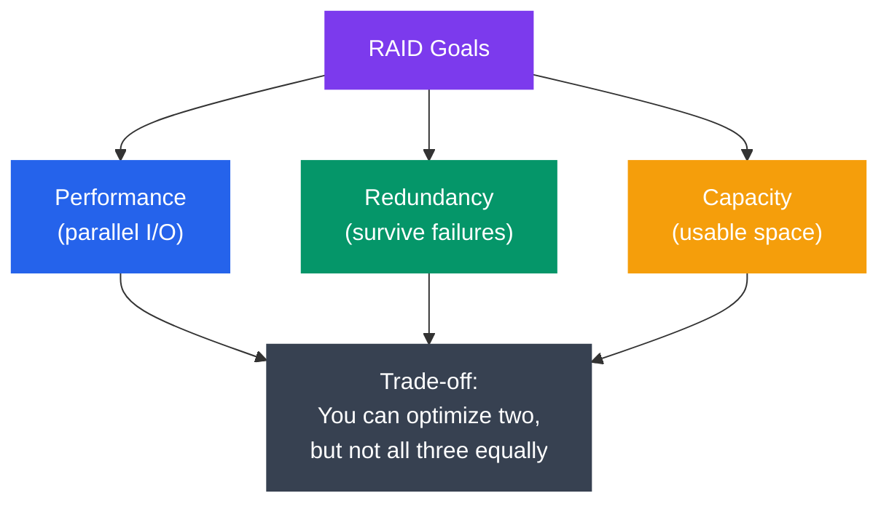
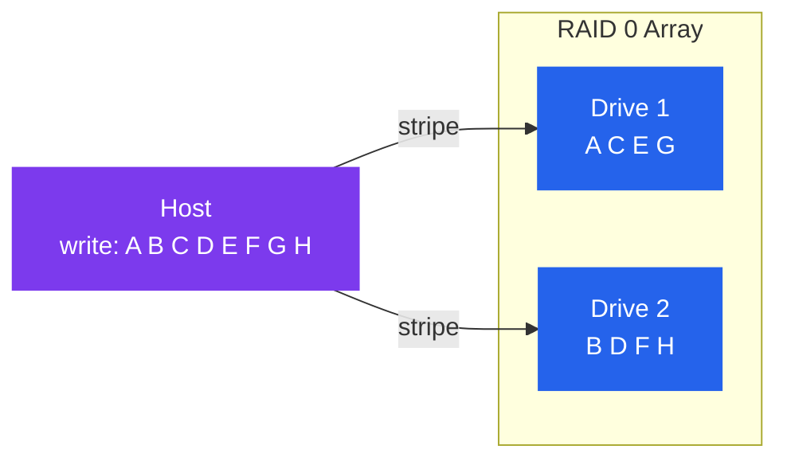
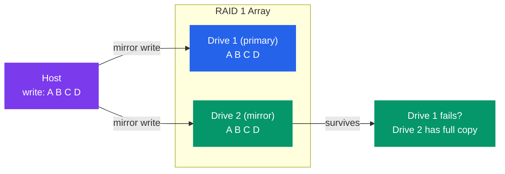
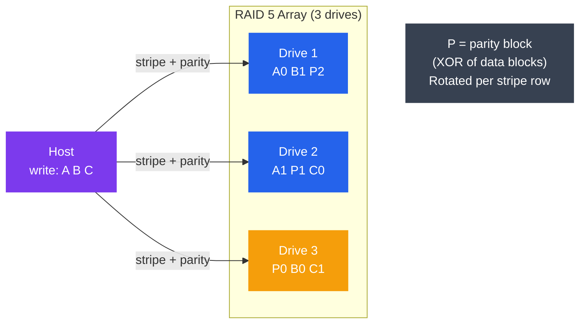
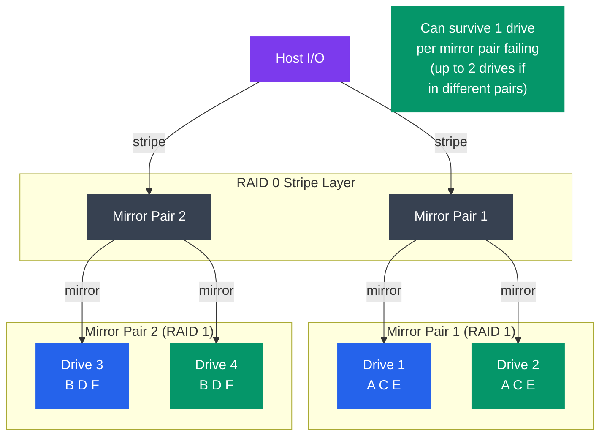
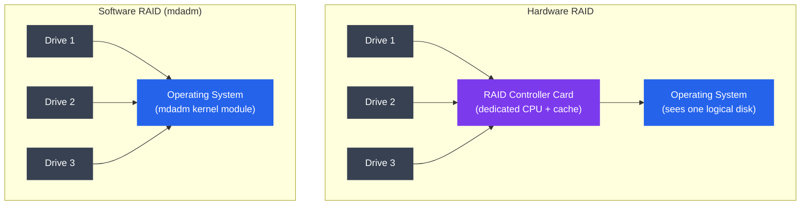

# RAID

## What You'll Learn

- RAID kya hota hai aur uska fundamental trade-off: redundancy vs performance vs capacity
- RAID 0, 1, 5, 6, aur 10 — har ek kaise kaam karta hai, aur kab use karna hai
- Har level ke liye capacity, performance, aur fault tolerance
- Hardware RAID vs Software RAID (Linux `mdadm`)
- Mean Time Between Failures (MTBF) aur reliability calculations
- Practical `mdadm` commands software RAID arrays manage karne ke liye

---

## Introduction to RAID

Socho tumhare paas ek hi hard disk hai aur woh crash ho gaya — poora data gone, no recovery. Ab socho Zomato ka order database agar sirf ek hi server pe hota aur woh server down ho jaata — sab orders, sab restaurant data, gayab. Yeh exact problem RAID solve karta hai.

**RAID (Redundant Array of Independent Disks)** multiple physical drives ko combine karke ek logical unit banata hai, taaki in teen cheezon mein se ek ya zyada achieve ho sakein:

- **Performance** — I/O ko multiple drives pe parallel mein spread karna (jaise ek order ko multiple delivery boys mein split karke jaldi deliver karwana)
- **Redundancy** — ek ya zyada drive fail hone pe bhi data na khoye (jaise Swiggy ka backup restaurant list agar primary down ho jaaye)
- **Capacity** — multiple chhoti drives ko milaakar ek badi volume banana

Yahan ek zaruri baat samajh lo: **koi bhi RAID level teeno cheezein ek saath maximum nahi de sakta.** RAID level choose karna matlab ek trade-off pick karna hai — kya tumhe speed chahiye, ya safety chahiye, ya storage space chahiye? Teeno full nahi mil sakte, kam se kam ek compromise karna hi padega.



> [!info]
> RAID ka naam sunke lagta hai yeh koi magic hardware hai, lekin actually yeh sirf ek **strategy** hai — data ko multiple disks pe kaise arrange karein taaki performance ya safety milein. Implementation hardware controller se bhi ho sakta hai ya sirf software (Linux kernel) se bhi.

---

## Theory

### RAID 0 — Striping (Performance, No Redundancy)

**Kya hota hai?** Data ko chhote-chhote chunks (stripes) mein todkar sabhi drives pe ek saath simultaneously likha jaata hai. Isse **koi redundancy nahi hoti** — agar ek bhi drive fail hui, poora data gaya.

Socho tumhe ek 800-page ka novel likhna hai aur tumhare paas 2 typists hain. Tum odd pages ek typist ko dete ho, even pages doosre ko — dono parallel mein type karte hain, kaam double speed se hota hai. Lekin agar ek typist beech mein gayab ho jaaye, toh aadha novel missing ho jaata hai — usable hi nahi. Yehi RAID 0 hai.



- **Usable capacity:** N × drive size (100% efficient — koi space waste nahi hota)
- **Read performance:** N × single drive (linear scaling — jitni zyada drives, utni zyada speed)
- **Write performance:** N × single drive (linear scaling)
- **Fault tolerance:** None — 1 drive fail = total data loss
- **Minimum drives:** 2
- **Use case:** scratch disks, video editing, caches — jahan speed matter karti hai aur data reproducible hai (yaani agar gaya bhi toh dobara bana sakte ho)

> [!warning]
> RAID 0 ko production database ya customer data ke liye kabhi mat use karna. Isme redundancy zero hai — matlab ek drive gayi toh poora system down, aur data recovery ka koi chance nahi. Isko sirf temporary/disposable data ke liye use karo, jaise video rendering cache.

---

### RAID 1 — Mirroring (Redundancy, No Capacity Gain)

**Kya hota hai?** Har write duplicate hoke saari drives pe jaati hai — matlab har drive pe exact same copy hoti hai. Reads kisi bhi drive se serve ho sakte hain, isliye read speed potentially double ho sakti hai.

Yeh bilkul waise hai jaise CRED ya koi bhi fintech app apna transaction data do alag-alag data centers mein simultaneously save karta hai. Agar Mumbai wala data center down ho jaaye, Bangalore wale mein poora copy available hai — koi transaction miss nahi hota.



- **Usable capacity:** 1 × drive size (2 drives ke saath sirf 50% efficient — aadha space "wasted" mirror copy ke liye)
- **Read performance:** Up to N × (reads sabhi mirrors mein load-balance ho sakte hain)
- **Write performance:** Ek hi drive jitni (kyunki har mirror pe write karna hi padega, parallel hone ke baad bhi slowest ke barabar)
- **Fault tolerance:** N−1 drive failures survive kar sakta hai (sirf ek drive bache toh bhi data safe)
- **Minimum drives:** 2
- **Use case:** OS drives, critical databases, boot volumes

> [!tip]
> RAID 1 mein capacity ka price chukana padta hai — 2 TB usable chahiye toh 4 TB kharidne padenge (2×2 TB drives). Lekin jahan data loss acceptable nahi hai (jaise banking system ka transaction log), yeh price justified hai.

---

### RAID 5 — Striping with Distributed Parity

**Kya hota hai?** Data N−1 drives pe stripe hota hai; ek drive ke barabar space **parity** (data stripes ka XOR) store karne ke liye use hota hai. Parity kisi ek fix drive pe nahi hoti — har drive pe thoda-thoda parity rotate hota rehta hai. Yeh ek drive ki failure survive kar sakta hai.

Iski sabse achhi analogy hai IRCTC ka waitlist system — agar ek confirmed passenger cancel kare, toh system ke paas already calculation hoti hai ki kaun sa waitlisted passenger uski jagah le sakta hai, bina poora chart dobara banaye. Parity bhi waise hi kaam karta hai — agar ek drive ka data khoya, baaki drives ke data aur parity se woh missing piece **calculate** ho jaata hai, bina usko kahin store kiye rakhne ke.



**Parity recovery kaise kaam karta hai?**

XOR ki ek magic property hai: agar tumhe A aur (A XOR B) pata hai, toh tum B nikaal sakte ho. Isi trick pe poora RAID 5 khada hai.

```
Drives: D1=A, D2=B, D3=P where P = A XOR B

D2 fails. Recover B:
  B = A XOR P = A XOR (A XOR B) = B  ✓
```

- **Usable capacity:** (N−1) × drive size
- **Read performance:** (N−1) × single drive (data N−1 drives pe hai)
- **Write performance:** RAID 0 se dheema — har write ke liye read-modify-write parity update karna padta hai
- **Fault tolerance:** 1 drive failure
- **Minimum drives:** 3
- **Use case:** General-purpose NAS, file servers — capacity, performance, aur redundancy ka achha balance

**RAID 5 write penalty:** har chhoti si write ke liye 4 I/Os lagte hain — purana data read karo + purana parity read karo + naya data write karo + naya parity write karo. Yeh "write penalty" hai jiski wajah se RAID 5 heavy-write workloads (jaise database transactions) ke liye ideal nahi hota.

---

### RAID 6 — Striping with Dual Parity

**Kya hota hai?** RAID 5 jaisa hi hai, bas har stripe mein do independent parity blocks hote hain (alag mathematical scheme use karke — typically Reed-Solomon). Isse **do drives ek saath fail** ho jaayein tab bhi data survive karta hai.

Socho ek bade railway station pe do alag control rooms ho, dono independently track kar rahe hon ki kaunsa platform khaali hai. Agar ek control room ka system crash ho jaaye, doosra bhi kaam kar raha hota hai. RAID 6 mein bhi do independent "safety nets" (P aur Q parity) hote hain, isliye ek nahi, do failures bhi jhel sakta hai.

```
Drive layout (4 drives):
  Stripe 0:  A0   A1   P0   Q0
  Stripe 1:  B0   P1   Q1   B1
  Stripe 2:  P2   Q2   C0   C1

P = XOR parity (like RAID 5)
Q = Galois Field parity (independent recovery path)
```

- **Usable capacity:** (N−2) × drive size
- **Read performance:** (N−2) × single drive
- **Write performance:** RAID 5 se bhi zyada write penalty (chhoti write ke liye 6 I/Os)
- **Fault tolerance:** 2 drive failures
- **Minimum drives:** 4
- **Use case:** Bade arrays (12+ drives) jahan rebuild ke dauraan doosri drive fail hone ka chance negligible nahi hai; archival storage

> [!tip]
> Jitni badi tumhari drives (4 TB, 8 TB, 16 TB), utna zyada rebuild time — aur rebuild ke dauraan doosri drive fail hone ka risk utna hi zyada. Isliye large-capacity arrays mein RAID 6 zyada safe choice hai RAID 5 ke comparison mein.

---

### RAID 10 — Striped Mirrors (RAID 1+0)

**Kya hota hai?** Pehle drives ke pairs mirror kiye jaate hain (RAID 1), phir un mirrors ko stripe kiya jaata hai (RAID 0). Matlab tumhe RAID 0 ki performance aur RAID 1 ki redundancy dono milte hain — best of both worlds, lekin cost bhi utni hi zyada.

Isko socho Swiggy ke do alag city clusters ki tarah — Mumbai cluster mein 2 servers hain jo ek doosre ko mirror karte hain (ek down ho toh doosra sambhal le), aur Bangalore cluster mein bhi waise hi 2 servers. Ab requests dono clusters ke beech load-balance (stripe) hoti hain. Speed bhi mili, aur agar ek cluster ka ek server gaya bhi, poora system chalta rahega.



- **Usable capacity:** N/2 × drive size (50% efficient)
- **Read performance:** N × single drive (kisi bhi mirror se read ho sakta hai)
- **Write performance:** N/2 × single drive (har mirror pe write karna padta hai, lekin pairs parallel mein chalte hain)
- **Fault tolerance:** har mirror pair mein 1 drive; best case mein N/2 drives tak lose kar sakte ho (agar har failed drive alag-alag pair mein ho)
- **Minimum drives:** 4
- **Use case:** High-performance databases (MySQL, PostgreSQL), virtualization hosts — speed aur safety ka best combination lekin mehenga

> [!info]
> Agar kabhi confuse ho jaao ki RAID 5 loon ya RAID 10 — yaad rakho: RAID 10 fast hai aur rebuild bhi jaldi hota hai (bas ek mirror copy karni hoti hai, parity calculate nahi karni), lekin usable capacity aadhi hi milti hai. Production databases jahan latency critical hai (jaise payment gateway ka DB), RAID 10 ka overhead worth it hai.

---

### RAID Level Summary Table

| Level | Aliases | Min Drives | Usable Capacity | Read Perf | Write Perf | Drive Failures Tolerated | Use Case |
|---|---|---|---|---|---|---|---|
| RAID 0 | Striping | 2 | N × disk | Excellent | Excellent | 0 | Scratch / cache |
| RAID 1 | Mirroring | 2 | 1 × disk | Good | Same as 1 disk | N−1 | OS, boot |
| RAID 5 | Stripe+parity | 3 | (N−1) × disk | Good | Moderate | 1 | NAS, fileserver |
| RAID 6 | Dual parity | 4 | (N−2) × disk | Good | Slow | 2 | Large arrays |
| RAID 10 | 1+0 | 4 | N/2 × disk | Excellent | Good | 1 per pair | Databases |

---

### Hardware RAID vs Software RAID

**Kya farak hai?** Hardware RAID mein ek dedicated controller card hoti hai jo apni khud ki CPU aur cache ke saath saara RAID logic sambhalti hai — OS ko sirf ek single logical disk dikhta hai. Software RAID (jaise Linux ka `mdadm`) mein yeh saara kaam kernel-level software karta hai, host ki CPU use karke, koi extra hardware nahi chahiye.



| Feature | Hardware RAID | Software RAID (mdadm) |
|---|---|---|
| CPU usage | Controller pe offload hota hai | Host ki CPU use hoti hai |
| Performance | Bahut high (dedicated cache) | Achhi (especially modern CPUs pe) |
| Cost | $200–$5000+ controller ke liye | Free |
| Portability | Controller vendor se bandha hua | Array metadata kisi bhi Linux pe portable |
| Boot support | Haan (BIOS/UEFI aware) | Haan (initramfs) |
| Monitoring | Vendor ke apne tools | Standard Linux tools |
| Failure risk | Controller fail = poori access gayi | Koi single point of failure nahi |

**Recommendation:** zyada tar Linux servers aur NAS builds ke liye, `mdadm` wala software RAID hi better choice hai — free hai, flexible hai, achhe se support hota hai, aur hardware controller ko single point of failure banne se bachaata hai. Socho, agar tumhari hardware RAID controller card hi kharab ho jaaye, tumhare saare drives healthy hone ke bawajood data access nahi hoga jab tak exact same model ka controller na mile. Software RAID mein yeh dependency hi nahi hai.

---

### MTBF and Reliability

**Kya hota hai?** **MTBF (Mean Time Between Failures)** ek single drive ka typically 1–3 million hours hota hai (manufacturer ki rating — but real-world/field MTBF usse kam hota hai, roughly 500K–1M hours).

Ab yeh samajhna zaruri hai: RAID lagane ka matlab yeh nahi ki data loss ka risk **zero** ho gaya — bas woh risk **kam** ho gaya hai. Jaise UPI transaction mein OTP lagana fraud ko zero nahi karta, bas usko kaafi hard bana deta hai.

**Time T mein ek drive ke fail hone ki probability:**

```
P(failure) = 1 - e^(-T / MTBF)  ≈  T / MTBF   (for T << MTBF)
```

**RAID array reliability (N independent drives, RAID 1):**

```
P(array survives) = 1 - P(both drives fail)
                  = 1 - P(drive1 fails) × P(drive2 fails | drive1 failed)
```

Yahan sabse important insight yeh hai: **RAID data loss ka risk khatam nahi karta — sirf kam karta hai.** Sabse critical moment hota hai **rebuild time** (bade drives ke liye ghanton se lekar din tak lag sakta hai). Rebuild ke dauraan:

- Bachi hui (surviving) drive pe bahut heavy sustained load padta hai — poora data usi se copy ho raha hota hai
- Drives ka annual failure rate roughly ~1–4% (AFR) hota hai
- Ek 4 TB drive ko 200 MB/s speed se rebuild karne mein ~6 ghante lagte hain

Iska matlab: rebuild ke un 6 ghanton mein, agar koi doosri drive bhi stressed hoke fail ho jaaye, poora array gaya. Isi wajah se log RAID 6 ya RAID 10 ki taraf jaate hain — extra parity ya extra mirror copy is risk ko kam karta hai.

**RAID 5 with 3 × 4 TB drives (AFR = 2%/year):**

```
P(drive failure in 1 year) ≈ 2% per drive

P(second drive fails during rebuild)
  = AFR × (rebuild_hours / 8760 hours per year)
  = 0.02 × (6 / 8760)
  ≈ 0.014%  per RAID 5 rebuild event
```

0.014% chhota lagta hai, lekin socho tumhare paas hundreds of arrays hain data center mein — tab yeh chhota number bhi kabhi na kabhi hit ho jaata hai. Bade arrays aur bade drives ke liye RAID 6 (dual parity) meaningful extra protection deta hai.

---

## Practice

### mdadm — Creating RAID Arrays

```bash
# Install
sudo apt install mdadm             # Debian/Ubuntu
sudo dnf install mdadm             # RHEL/Fedora

# Zero superblocks on drives first (clean state)
sudo mdadm --zero-superblock /dev/sdb /dev/sdc /dev/sdd

# Create RAID 0 (2 drives, stripe)
sudo mdadm --create /dev/md0 \
           --level=0 \
           --raid-devices=2 \
           /dev/sdb /dev/sdc

# Create RAID 1 (2 drives, mirror)
sudo mdadm --create /dev/md1 \
           --level=1 \
           --raid-devices=2 \
           /dev/sdb /dev/sdc

# Create RAID 5 (3 drives, distributed parity)
sudo mdadm --create /dev/md5 \
           --level=5 \
           --raid-devices=3 \
           /dev/sdb /dev/sdc /dev/sdd

# Create RAID 6 (4 drives, dual parity)
sudo mdadm --create /dev/md6 \
           --level=6 \
           --raid-devices=4 \
           /dev/sdb /dev/sdc /dev/sdd /dev/sde

# Create RAID 10 (4 drives, striped mirrors)
sudo mdadm --create /dev/md10 \
           --level=10 \
           --raid-devices=4 \
           /dev/sdb /dev/sdc /dev/sdd /dev/sde

# Watch RAID build progress (sync starts automatically)
watch -n2 cat /proc/mdstat
```

> [!warning]
> `mdadm --create` chalane se pehle confirm kar lo ki tumne sahi drives select ki hain — yeh command drives pe existing data ko overwrite kar deta hai. Production system pe galat drive letter daalna ek disaster bana sakta hai.

### mdadm — Monitoring and Status

```bash
# Check array status
sudo mdadm --detail /dev/md5

# Sample output:
#           State : clean
#  Active Devices : 3
# Working Devices : 3
#  Failed Devices : 0
#   Spare Devices : 0
#
#          Layout : left-symmetric
#      Chunk Size : 512K
#
# Rebuild Status : 45% complete
#
#     Number   Major   Minor   RaidDevice State
#        0     8       16        0      active sync   /dev/sdb
#        1     8       32        1      active sync   /dev/sdc
#        2     8       48        2      active sync   /dev/sdd

# Scan and show all arrays
sudo mdadm --detail --scan

# /proc/mdstat — real-time view
cat /proc/mdstat

# Output during rebuild:
# md5 : active raid5 sdd[2] sdc[1] sdb[0]
#       7813771264 blocks super 1.2 level 5, 512k chunk, algorithm 2 [3/3] [UUU]
#       [=========>...........]  resync = 45.3% (...)
#       finish=12.3min speed=150000K/sec
```

`/proc/mdstat` tumhara best dost hai jab bhi RAID health check karni ho — isko cron job mein bhi daal sakte ho taaki `[UUU]` (sab drives up) ki jagah kahin `[U_U]` (ek drive down) na dikh jaaye bina notice kiye.

### mdadm — Simulating and Recovering from Drive Failure

```bash
# Mark a drive as failed (simulate failure)
sudo mdadm --manage /dev/md5 --fail /dev/sdc

# Check degraded state
sudo mdadm --detail /dev/md5
# State: clean, degraded
# Failed Devices: 1

# Remove failed drive from array
sudo mdadm --manage /dev/md5 --remove /dev/sdc

# Hot-add replacement drive (rebuild starts automatically)
sudo mdadm --manage /dev/md5 --add /dev/sdc

# Watch rebuild
watch -n5 cat /proc/mdstat
```

Yeh sequence — fail karo, remove karo, naya drive add karo — bilkul waise hi hai jaise kisi delivery fleet mein ek bike kharab ho jaaye: usko fleet se hata do, naya bike laao, aur usko fleet mein jodkar wapas normal operations shuru karo. Is dauraan (rebuild ke time) baaki bikes (drives) pe extra load rehta hai.

### mdadm — Adding a Hot Spare

```bash
# Add a spare drive to RAID 5 array
# (used automatically if any active drive fails)
sudo mdadm --manage /dev/md5 --add-spare /dev/sde

# Verify spare is registered
sudo mdadm --detail /dev/md5 | grep spare
#    3     8       64      -      spare   /dev/sde
```

**Hot spare** ek standby drive hoti hai jo array mein already lagi rehti hai, lekin use nahi ho rahi hoti — bilkul waise jaise Ola/Uber ke paas ek extra driver "on standby" rehta hai peak hours mein, taaki koi driver cancel kare toh turant replace ho jaaye. Jaise hi koi active drive fail hoti hai, mdadm automatically hot spare ko use karke rebuild shuru kar deta hai — insaan ko manually intervene karne ki zarurat nahi padti, downtime kam hota hai.

### Saving mdadm Configuration

```bash
# Save current array config to mdadm.conf
sudo mdadm --detail --scan | sudo tee -a /etc/mdadm/mdadm.conf

# Update initramfs so the array assembles at boot
sudo update-initramfs -u        # Debian/Ubuntu
sudo dracut --force             # RHEL/Fedora

# Verify arrays assemble on next boot (dry run)
sudo mdadm --assemble --scan --test
```

> [!tip]
> Yeh config save karna mat bhoolna! Agar tumne RAID array banaya lekin `mdadm.conf` update nahi kiya aur initramfs regenerate nahi kiya, toh reboot ke baad tumhara array assemble hi nahi hoga — system boot hote hi confuse ho jaayega ki `/dev/md5` kahan gaya.

### Benchmarking RAID Array Throughput

```bash
# Sequential read throughput
sudo hdparm -t /dev/md5

# fio random read test across RAID array
sudo fio --name=raid-test \
         --ioengine=libaio \
         --iodepth=16 \
         --rw=randread \
         --bs=4k \
         --size=4G \
         --filename=/dev/md5 \
         --direct=1 \
         --numjobs=4 \
         --runtime=30 \
         --time_based
```

### Monitoring with Email Alerts

```bash
# Configure mdadm to send alerts on array events
# Edit /etc/mdadm/mdadm.conf:
MAILADDR admin@example.com

# Test alert
sudo mdadm --monitor --test --oneshot /dev/md5

# Enable mdadm monitor daemon
sudo systemctl enable mdmonitor
sudo systemctl start mdmonitor
```

Real production setups mein isko skip mat karna — bina alerts ke tumhe pata hi nahi chalega jab ek drive silently fail ho gayi ho aur array degraded state mein chal raha ho. Bahut baar log tabhi discover karte hain jab **doosri** drive bhi fail ho jaati hai aur poora data chala jaata hai.

### Capacity Planning Example

```bash
# Question: I have 4 × 4 TB drives. How much usable space per RAID level?

python3 - <<'EOF'
drive_tb = 4
n = 4

print(f"4 drives × {drive_tb} TB each")
print(f"RAID 0:  {n * drive_tb} TB usable (100% efficient)")
print(f"RAID 1:  {1 * drive_tb} TB usable ( 25% efficient)")
print(f"RAID 5:  {(n-1) * drive_tb} TB usable ( 75% efficient)")
print(f"RAID 6:  {(n-2) * drive_tb} TB usable ( 50% efficient)")
print(f"RAID 10: {n//2 * drive_tb} TB usable ( 50% efficient)")
EOF

# Output:
# 4 drives × 4 TB each
# RAID 0:  16 TB usable (100% efficient)
# RAID 1:   4 TB usable ( 25% efficient)
# RAID 5:  12 TB usable ( 75% efficient)
# RAID 6:   8 TB usable ( 50% efficient)
# RAID 10:  8 TB usable ( 50% efficient)
```

---

## Key Takeaways

- **RAID 0** — pure performance, zero fault tolerance; sirf temporary ya reproducible data ke liye use karo (jaise video render cache), production data ke liye kabhi nahi.
- **RAID 1** — mirroring se full redundancy milti hai; per-usable-GB cost mehenga hai; boot/OS volumes ke liye ideal.
- **RAID 5** — capacity efficiency aur redundancy ka achha balance; sirf ek drive failure survive karta hai; write performance pe nazar rakhna (write penalty ki wajah se).
- **RAID 6** — dual parity bade arrays aur lambe rebuilds ke liye extra protection deti hai, lekin write overhead aur capacity ka cost lagta hai.
- **RAID 10** — performance + redundancy ka best combination; sabse mehenga; latency-sensitive databases ke liye first choice.
- **Software RAID (mdadm)** production-grade, free, aur portable hai — zyada tar Linux deployments ke liye hardware RAID se better choice hai.
- RAID **backup nahi hai** — yeh sirf drive hardware failure se bachaata hai, accidental deletion, ransomware, ya controller failure se nahi. Hamesha alag se backups rakho.
- Rebuild time ka risk real hai: bade drives (4+ TB) wale arrays ke liye RAID 6 ya RAID 10 use karo jahan rebuild ke dauraan doosri drive fail hone ka chance plausible ho.
