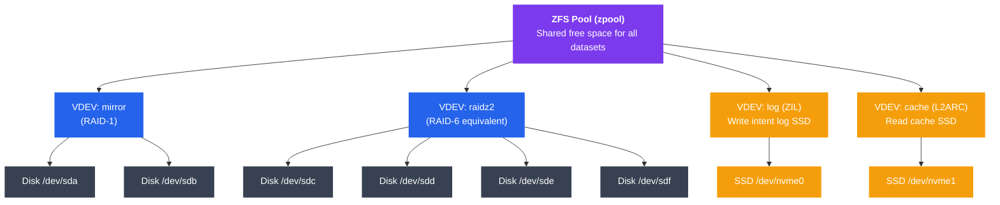

# Modern File Systems

## What You'll Learn

In this tutorial, you will:

- Understand ext4's extent-based allocation, journaling modes, and delayed allocation
- Explore NTFS's Master File Table, alternate data streams, and permissions model
- Learn how APFS uses copy-on-write, snapshots, and space sharing on Apple devices
- Discover Btrfs subvolumes, built-in RAID, checksums, and deduplication
- Master ZFS pooled storage, data integrity guarantees, the ARC cache, and send/receive
- Compare modern file systems across key features and use cases
- Use practical commands to manage each file system

---

## Introduction

A file system is the layer that organizes raw storage blocks into files and directories. Modern file systems go far beyond that basic role: they protect against corruption, enable instant snapshots, compress data transparently, and can span multiple physical devices. Choosing the right file system for a workload can dramatically affect reliability, performance, and operational flexibility.

---

## ext4 — The Linux Workhorse

ext4 (Fourth Extended File System) is the default file system for most Linux distributions. It evolved from ext2 → ext3 → ext4, adding reliability and performance at each step.

### Extents

Earlier ext2/3 used indirect block pointers to track file data. ext4 replaced them with **extents** — contiguous ranges of blocks described by a single (start, length) pair.

```
ext3 block mapping (indirect pointers):
  inode → [block 10] → [block 22] → [block 23] → [block 40]
  4 separate lookups for 4 blocks

ext4 extent tree:
  inode → extent: start=10, len=1
         → extent: start=22, len=2   (blocks 22-23 in one entry)
         → extent: start=40, len=1
  Fewer metadata reads; large files use far fewer entries
```

### Journaling Modes

ext4 records changes in a **journal** before committing them to the main file system, preventing corruption on crash.

| Mode | What is journaled | Speed | Safety |
|------|-------------------|-------|--------|
| `journal` | Data + metadata | Slowest | Highest |
| `ordered` (default) | Metadata only; data flushed first | Medium | Good |
| `writeback` | Metadata only; no ordering | Fastest | Weakest |

```bash
# Check current journal mode
tune2fs -l /dev/sda1 | grep "Default mount"

# Set journal mode at mount time
mount -o data=ordered /dev/sda1 /mnt

# Check journal size
tune2fs -l /dev/sda1 | grep "Journal size"
```

### Delayed Allocation

ext4 delays the assignment of physical blocks until data is actually written to disk. This allows the allocator to choose a better physical layout (larger extents, less fragmentation) and avoids allocating blocks for data that may be discarded.

```
Without delayed allocation:
  write(4KB) → allocate block NOW → write data later
  Small writes get scattered blocks

With delayed allocation:
  write(4KB) → buffer in page cache → allocate block AT FLUSH TIME
  Sequential writes get contiguous extents
```

### Key ext4 Commands

```bash
# Create an ext4 file system
mkfs.ext4 -L mydisk /dev/sdb1

# Show file system info
tune2fs -l /dev/sdb1

# Check and repair
e2fsck -f /dev/sdb1

# Enable features (large_file, dir_index, etc.)
tune2fs -O dir_index /dev/sdb1

# Show inode usage
df -i /dev/sdb1

# Check extent tree of a file
filefrag -v /path/to/file
```

### ext4 Limitations

- Maximum file size: 16 TiB (with 4 KB blocks)
- Maximum volume size: 1 EiB
- No built-in snapshots
- No built-in checksums on data blocks
- Journaling protects metadata but not silent data corruption

---

## NTFS — Windows Native File System

NTFS (New Technology File System) has been the default Windows file system since Windows NT 3.1. It provides journaling, access control, compression, and many advanced features.

### Master File Table (MFT)

The MFT is the heart of NTFS. Every file and directory is represented as a record in the MFT. Even file system metadata (like the MFT itself) is stored as files.

```
MFT Structure:
┌──────────────────────────────────────────────────┐
│                Master File Table                  │
├────────┬──────────────────────────────────────────┤
│ Record │  File Attributes                         │
│   0    │  $MFT (MFT itself)                       │
│   1    │  $MFTMirr (MFT backup)                   │
│   2    │  $LogFile (journal)                      │
│   3    │  $Volume (volume metadata)               │
│   4    │  $AttrDef (attribute definitions)        │
│   5    │  . (root directory)                      │
│   ...  │  User files start at record 24           │
├────────┴──────────────────────────────────────────┤
│  Each record = 1 KB                               │
│  Attributes stored inline until file grows large │
└──────────────────────────────────────────────────┘
```

Small files (< ~700 bytes) store their data directly inside the MFT record as a **resident attribute**, avoiding a separate disk read.

### Alternate Data Streams (ADS)

NTFS allows a single file to have multiple named data streams. The default stream is unnamed; additional streams are named with a colon separator.

```cmd
REM Create an alternate data stream
echo "secret data" > document.txt:hidden_stream

REM Read it back
more < document.txt:hidden_stream

REM List streams (requires Sysinternals streams.exe or PowerShell)
Get-Item document.txt -Stream *

REM Normal dir/copy commands only see the default stream
REM ADS persists through rename but lost when copying to FAT drives
```

ADS is used legitimately by Windows (e.g., the "Zone.Identifier" stream that marks downloaded files) and can be abused to hide data.

### NTFS Permissions

NTFS uses Access Control Lists (ACLs). Each file has a Security Descriptor containing:

- **Owner SID** — who owns the file
- **DACL** (Discretionary ACL) — who can access and how
- **SACL** (System ACL) — auditing rules

```cmd
REM View permissions
icacls C:\myfile.txt

REM Grant user read access
icacls C:\myfile.txt /grant Username:(R)

REM Deny write to a group
icacls C:\myfile.txt /deny "Domain\Group":(W)

REM Reset to inherited permissions
icacls C:\myfile.txt /reset
```

### NTFS Compression and Other Features

```cmd
REM Enable NTFS compression on a directory
compact /C /S:C:\mydir

REM Check compression status
compact C:\mydir\*

REM Enable EFS encryption
cipher /E /S:C:\sensitive
```

| Feature | Description |
|---------|-------------|
| Journaling | $LogFile records metadata changes |
| Compression | Transparent LZ77 compression per file/dir |
| EFS | Encrypting File System (per-file, per-user) |
| Sparse files | Holes in files mapped to zero blocks |
| Hard links | Multiple directory entries → same file |
| Reparse points | Symbolic links, junctions, mount points |
| Max file size | 16 EiB (theoretical) |
| Max volume size | 256 TiB (practical with 64 KB clusters) |

---

## APFS — Apple File System

APFS replaced HFS+ on Apple devices starting in 2017. It was designed for flash storage and handles SSDs, NVMe, and the unique needs of iOS/macOS/watchOS.

### Copy-on-Write (COW)

APFS never overwrites existing data. When a block is modified, it is written to a new location; metadata is updated atomically to point to the new block. The old location is freed only after the new write is confirmed.

```
Traditional overwrite:
  Block 42: [old data]  →  Block 42: [new data]
  Risk: crash mid-write → corrupted block

APFS COW:
  Block 42: [old data]  (untouched)
  Block 87: [new data]  (written first)
  Metadata updated: file now points to block 87
  Block 42 freed.  Crash-safe at every step.
```

### Snapshots

Because APFS never overwrites, creating a snapshot is nearly instantaneous — it just records a reference to the current metadata tree. Snapshots share all unchanged blocks with the live file system.

```bash
# macOS snapshot commands (Terminal)

# List snapshots on a volume
tmutil listlocalsnapshots /

# Create a snapshot
tmutil localsnapshot

# Mount a snapshot (read-only)
mount_apfs -s com.apple.TimeMachine.2024-01-15-120000 /dev/disk1s1 /mnt/snap

# Delete a snapshot
tmutil deletelocalsnapshots 2024-01-15-120000
```

### Space Sharing

In APFS, a single physical **Container** (analogous to a partition) can hold multiple **Volumes**. All volumes in a container share the same free space pool — there are no fixed partition sizes.

```
APFS Container (e.g., 500 GB NVMe)
├── Volume: Macintosh HD   (uses as much as needed)
├── Volume: Macintosh HD - Data
├── Volume: Preboot
├── Volume: Recovery
└── Volume: VM
    All share one free pool — no wasted reserved space
```

### Encryption

APFS supports full-volume encryption with hardware key management on devices with the Apple T2 chip or Apple Silicon. Each file can also have per-file keys.

```
Encryption tiers:
  Class A — Protected until first user unlock
  Class B — Protected after device lock (default for most user data)
  Class C — Protected while device is locked
  Class D — No protection (accessible always)
```

### APFS Key Features

| Feature | Detail |
|---------|--------|
| Allocation | Copy-on-write, no in-place updates |
| Snapshots | Instant, space-efficient |
| Space sharing | Multiple volumes in one container |
| Clones | Instant file/directory copies (copy-on-write) |
| Atomic safe-save | Rename-based atomic file replacement |
| Encryption | Per-file or full-volume, hardware-accelerated |
| Max file size | 8 EiB |
| Crash safety | COW eliminates need for traditional journal |

---

## Btrfs — B-Tree File System

Btrfs (pronounced "butter FS" or "better FS") is a Linux COW file system designed as a modern alternative to ext4, with built-in RAID, snapshots, and data integrity.

### Subvolumes

A Btrfs subvolume is an independently mountable namespace within a Btrfs file system. Subvolumes share space from the same pool but can have separate snapshot policies and mount options.

```bash
# Create a subvolume
btrfs subvolume create /mnt/data/@home

# List subvolumes
btrfs subvolume list /mnt/data

# Mount a specific subvolume
mount -o subvol=@home /dev/sdb /home

# Delete a subvolume
btrfs subvolume delete /mnt/data/@home
```

### Snapshots

Btrfs snapshots are writable or read-only subvolumes that share COW blocks with the source.

```bash
# Create read-only snapshot (great for backups)
btrfs subvolume snapshot -r /home /snapshots/home-$(date +%Y%m%d)

# Create writable snapshot
btrfs subvolume snapshot /home /home-backup

# List all snapshots
btrfs subvolume list -s /

# Delete snapshot
btrfs subvolume delete /snapshots/home-20240115
```

### Built-in RAID

Btrfs can span multiple devices with software RAID. Unlike mdraid, RAID is handled at the file system level, enabling per-file striping decisions.

```bash
# Create RAID1 across two devices
mkfs.btrfs -d raid1 -m raid1 /dev/sdb /dev/sdc

# Add a device to an existing Btrfs
btrfs device add /dev/sdd /mnt/data
btrfs balance start /mnt/data

# Check device stats (error counters)
btrfs device stats /mnt/data

# RAID levels supported: single, dup, raid0, raid1, raid10, raid5, raid6
```

### Checksums

Every data block and metadata block in Btrfs has a checksum (default CRC32c; SHA256, xxHash, BLAKE2 also supported). The kernel verifies checksums on every read.

```bash
# Scrub: read all data and verify checksums
btrfs scrub start /mnt/data
btrfs scrub status /mnt/data

# Show error statistics
btrfs device stats /mnt/data

# Change checksum algorithm at mkfs time
mkfs.btrfs --checksum sha256 /dev/sdb
```

### Deduplication

Btrfs supports out-of-band deduplication using the `duperemove` or `bees` tools, which find identical extents and replace them with shared COW references.

```bash
# Install duperemove
apt install duperemove

# Deduplicate files in a directory
duperemove -dhr /mnt/data/

# In-band dedup is experimental (avoid in production)
```

### Btrfs Compression

```bash
# Mount with transparent compression
mount -o compress=zstd /dev/sdb /mnt/data

# Enable compression on existing data
btrfs filesystem defragment -r -czstd /mnt/data

# Check compression ratios
compsize /mnt/data
```

---

## ZFS — Zettabyte File System

ZFS was created at Sun Microsystems in 2005. It is available on Linux via OpenZFS and is the default file system on FreeBSD, TrueNAS, and Solaris. ZFS takes a holistic approach: it combines volume management, RAID, and the file system into one integrated layer.

### Pooled Storage Architecture



### Copy-on-Write and Data Integrity

ZFS uses COW for all writes. Every block has a checksum, and the checksum of child blocks is stored in parent blocks (a Merkle tree). This means:

- Silent data corruption is detected on every read
- With mirroring/RAID, ZFS can **self-heal** by reading the good copy
- Crash consistency is guaranteed without a separate journal

```bash
# Create a pool with mirroring
zpool create mypool mirror /dev/sda /dev/sdb

# Create a raidz2 pool (tolerates 2 disk failures)
zpool create datapool raidz2 /dev/sdc /dev/sdd /dev/sde /dev/sdf

# Check pool health
zpool status mypool

# Scrub: verify all checksums
zpool scrub mypool

# Show scrub results
zpool status mypool | grep scan
```

### Datasets and Snapshots

```bash
# Create datasets (like directories with their own properties)
zfs create mypool/home
zfs create mypool/vm-images

# Set compression
zfs set compression=lz4 mypool/home

# Set quota
zfs set quota=100G mypool/home

# Create a snapshot
zfs snapshot mypool/home@2024-01-15

# List snapshots
zfs list -t snapshot

# Roll back to snapshot
zfs rollback mypool/home@2024-01-15

# Clone a snapshot (instant, space-efficient)
zfs clone mypool/home@2024-01-15 mypool/home-clone
```

### ARC Cache

The **ARC** (Adaptive Replacement Cache) is ZFS's in-memory read cache. Unlike Linux's page cache, ARC uses a sophisticated algorithm that balances recently-used and frequently-used data.

```
ARC Internals:
┌──────────────────────────────────────────────────────┐
│                       ARC                            │
│  ┌─────────────────┐    ┌──────────────────────────┐ │
│  │  MRU (recently  │    │  MFU (frequently         │ │
│  │  used cache)    │    │  used cache)             │ │
│  └─────────────────┘    └──────────────────────────┘ │
│  Ghost lists track recently evicted items            │
│  → ARC learns workload pattern and adapts            │
└──────────────────────────────────────────────────────┘

L2ARC: Spill-over read cache on an SSD (optional)
ZIL/SLOG: Write intent log, optionally on a fast SSD
```

```bash
# View ARC statistics (Linux)
arc_summary

# Or via /proc
cat /proc/spl/kstat/zfs/arcstats | grep -E "^(hits|misses|size)"

# Set ARC max size (in bytes)
echo "options zfs zfs_arc_max=4294967296" >> /etc/modprobe.d/zfs.conf
```

### Send/Receive — Replication

ZFS can stream an entire dataset (or incremental changes since a snapshot) over the network.

```bash
# Full send to another host
zfs send mypool/home@2024-01-15 | ssh backup-server zfs receive backuppool/home

# Incremental send (only changes since previous snapshot)
zfs send -i mypool/home@2024-01-14 mypool/home@2024-01-15 \
  | ssh backup-server zfs receive backuppool/home

# Local clone (pipe to zfs receive)
zfs send mypool/home@snap1 | zfs receive mypool/home-copy

# Compressed send
zfs send -c mypool/home@snap1 | ssh backup-server zfs receive backuppool/home
```

### Essential ZFS Commands

```bash
# Show all datasets with space usage
zfs list

# Show pool I/O statistics (1-second intervals)
zpool iostat 1

# Add a hot spare
zpool add mypool spare /dev/sdg

# Replace a failed disk
zpool replace mypool /dev/sdb /dev/sdh

# Destroy a pool (IRREVERSIBLE)
zpool destroy mypool

# Import a pool (after moving disks to new host)
zpool import
zpool import mypool
```

---

## File System Comparison

| Feature | ext4 | NTFS | APFS | Btrfs | ZFS |
|---------|------|------|------|-------|-----|
| **Journaling** | Yes (metadata) | Yes (metadata) | COW (no journal needed) | COW (no journal needed) | COW (no journal needed) |
| **Snapshots** | No | No (VSS at OS level) | Yes (instant) | Yes (instant, writable) | Yes (instant, read-only) |
| **Data checksums** | No | No | Yes | Yes | Yes (Merkle tree) |
| **Compression** | No | Yes (LZ77) | No | Yes (zstd, lzo, zlib) | Yes (lz4, gzip, zstd) |
| **Built-in RAID** | No | No | No | Yes (0/1/10/5/6) | Yes (mirror/raidz1/2/3) |
| **Deduplication** | No | No | No | Yes (out-of-band) | Yes (in-band, RAM-heavy) |
| **Encryption** | Via dm-crypt | Yes (EFS/BitLocker) | Yes (native, HW-accel) | Via dm-crypt | Yes (native) |
| **Max file size** | 16 TiB | 16 EiB | 8 EiB | 16 EiB | 16 EiB |
| **Max volume size** | 1 EiB | 256 TiB | 8 EiB | 16 EiB | 256 ZiB |
| **Primary OS** | Linux | Windows | macOS / iOS | Linux | Linux / FreeBSD / Solaris |
| **Space efficiency** | Good | Good | Excellent (sharing) | Good | Good |
| **Maturity** | Very stable | Very stable | Stable (since 2017) | Mostly stable | Very stable |

---

## Choosing a File System

```
Use ext4 when:
  - You need a reliable, battle-tested Linux file system
  - Simplicity and broad tool support matter more than advanced features
  - Boot partitions, traditional servers, containers

Use NTFS when:
  - Primary OS is Windows
  - Shared drives between Windows and Linux (read/write via ntfs-3g)

Use APFS when:
  - Running macOS / iOS — it's the only reasonable choice
  - You benefit from snapshots for Time Machine backups

Use Btrfs when:
  - You want snapshots + subvolumes on Linux without ZFS licensing concerns
  - Root filesystem on Fedora, openSUSE (default on those distros)
  - You need flexible RAID without mdraid complexity

Use ZFS when:
  - Data integrity is the top priority (NAS, storage servers)
  - You need robust RAID + snapshots + replication in one stack
  - TrueNAS, FreeBSD servers, high-value datasets
  - You can afford extra RAM for ARC (1 GB RAM per 1 TB storage: rule of thumb)
```

---

## Summary

Modern file systems differ dramatically in their design philosophy:

- **ext4** — pragmatic, stable, widely supported; lacks advanced features
- **NTFS** — feature-rich Windows standard; ADS and ACLs are powerful
- **APFS** — purpose-built for flash; COW + space sharing + encryption on Apple hardware
- **Btrfs** — Linux-native COW with snapshots and RAID; still maturing
- **ZFS** — the gold standard for data integrity; pools + Merkle-tree checksums + ARC make it uniquely robust

The trend across all modern file systems is away from traditional journaling toward **copy-on-write**, which provides stronger crash consistency guarantees and makes snapshots nearly free.
