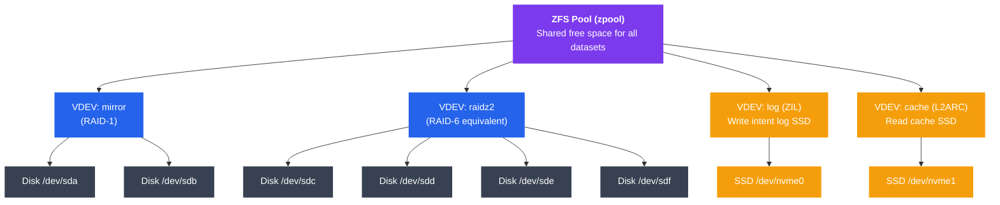

# Modern File Systems

## Kya Seekhoge Is Note Mein

Is tutorial mein tum ye samjhoge:

- ext4 ka extent-based allocation, journaling modes, aur delayed allocation kaise kaam karta hai
- NTFS ka Master File Table, alternate data streams, aur permissions model
- APFS kaise copy-on-write, snapshots, aur space sharing use karta hai Apple devices pe
- Btrfs ke subvolumes, built-in RAID, checksums, aur deduplication
- ZFS ka pooled storage, data integrity guarantees, ARC cache, aur send/receive
- Modern file systems ko key features aur use cases pe compare karna
- Har file system manage karne ke practical commands

---

## Introduction

File system wo layer hai jo raw storage blocks ko organized files aur directories mein convert karta hai. Socho, agar tumhara hard disk ek bada godown hai jisme bas khaali racks pade hain — file system wahi manager hai jo bataata hai "ye cheez rack number 42 pe rakhi hai, aur uska naam 'invoice.pdf' hai." Bina file system ke, disk sirf 0s aur 1s ka dhaancha hai — koi naam nahi, koi folder nahi, kuch samajh nahi aata.

Lekin modern file systems sirf itna hi nahi karte. Ye bahut aage nikal chuke hain:

- Corruption se protect karte hain (jaise UPI transaction fail hone pe bhi paisa double deduct na ho)
- Instant snapshots enable karte hain (jaise CRED app mein "undo" button)
- Transparently data compress karte hain
- Multiple physical devices ke across span kar sakte hain (jaise Flipkart ka data multiple warehouses mein spread hota hai but ek hi system se manage hota hai)

Sahi file system choose karna reliability, performance, aur operational flexibility pe bahut bada farak daalta hai. Jaise Zomato agar apna order database galat design kar de, toh peak lunch hour mein sab crash ho jayega — waise hi galat file system choose karne se production mein data loss ho sakta hai.

---

## ext4 — Linux Ka Workhorse

ext4 (Fourth Extended File System) most Linux distributions ka default file system hai. Ye ext2 → ext3 → ext4 se evolve hua — har step pe reliability aur performance improve hoti gayi. Isko samjho jaise Ola ka app — Ola Cabs se start hua, phir Ola Auto add hua, phir Ola Money — har version mein purane features ke upar naye features layer hote gaye.

### Extents

**Kya hota hai?** Purane ext2/ext3 mein file ka data track karne ke liye **indirect block pointers** use hote the — matlab har block ka address alag se store karna padta tha, ek-ek karke. Socho tum IRCTC pe 4 saath seats book karna chahte ho, but system tumhe har seat ka number alag se, individually likhna pad raha hai — 1 nahi, 4 baar lookup karna padega.

ext4 ne isse fix kiya **extents** se — ek continuous range of blocks ko sirf ek (start, length) pair se describe kar dete hain. Jaise IRCTC agar bole "seat 22 se 23 tak, dono tumhare" — ek hi entry mein kaam ho gaya.

```
ext3 block mapping (indirect pointers):
  inode → [block 10] → [block 22] → [block 23] → [block 40]
  4 separate lookups for 4 blocks

ext4 extent tree:
  inode → extent: start=10, len=1
         → extent: start=22, len=2   (blocks 22-23 in one entry)
         → extent: start=40, len=1
  Fewer metadata reads; large files use far fewer entries
```

**Kyun zaruri hai?** Bade files (jaise video files, database dumps) mein hazaaron blocks hote hain. Agar har block ka pointer alag se track karna pade, toh metadata hi bahut jagah le lega aur reads slow ho jayenge. Extents se contiguous blocks ek entry mein aa jaate hain — fewer metadata reads, better performance, kam fragmentation.

### Journaling Modes

**Kya hota hai?** ext4 changes ko pehle ek **journal** (ek tarah ki diary) mein likhta hai, phir main file system mein commit karta hai. Isse crash ke time corruption nahi hoti.

Socho ek bank transaction — jab tum UPI se paisa transfer karte ho, bank pehle apne internal log mein likhta hai "X account se Y account mein 500 rupaye ja rahe hain," phir actual balance update karta hai. Agar beech mein power gayi bhi, toh log dekh ke pata chal jaata hai transaction adhoora tha ya complete — recovery aasaan ho jaati hai.

| Mode | Kya journal hota hai | Speed | Safety |
|------|-------------------|-------|--------|
| `journal` | Data + metadata dono | Sabse slow | Highest |
| `ordered` (default) | Sirf metadata; data pehle flush hota hai | Medium | Good |
| `writeback` | Sirf metadata; no ordering | Sabse fast | Weakest |

> [!tip]
> `ordered` mode 99% use cases ke liye best balance hai — ye default bhi isi liye hai. `journal` mode use karo sirf tab jab data integrity sabse zaruri ho (jaise financial database), speed ki parwaah na ho.

```bash
# Check current journal mode
tune2fs -l /dev/sda1 | grep "Default mount"

# Set journal mode at mount time
mount -o data=ordered /dev/sda1 /mnt

# Check journal size
tune2fs -l /dev/sda1 | grep "Journal size"
```

### Delayed Allocation

**Kya hota hai?** ext4 physical blocks ka assignment tab tak delay karta hai jab tak data actually disk pe write nahi ho jaata. Isse allocator ko better decision lene ka mauka milta hai.

Socho Swiggy ka delivery boy assignment — agar Swiggy turant order aate hi ek delivery boy assign kar de, toh ho sakta hai woh order cancel ho jaaye ya address change ho jaaye, aur delivery boy ka time waste ho. Instead, Swiggy thoda wait karta hai (order confirm hone tak), phir best delivery boy assign karta hai jo nearby hai aur available hai. Yehi delayed allocation ka concept hai — write turant commit karne ke bajaye page cache mein buffer karo, phir flush time pe best possible contiguous blocks allocate karo.

```
Without delayed allocation:
  write(4KB) → allocate block NOW → write data later
  Small writes get scattered blocks

With delayed allocation:
  write(4KB) → buffer in page cache → allocate block AT FLUSH TIME
  Sequential writes get contiguous extents
```

**Fayda?** Better physical layout (bade extents, kam fragmentation) aur un blocks ke liye allocation avoid karna jo shayad discard ho jaayen (temp files jo turant delete ho jaate hain).

### Key ext4 Commands

```bash
# Create an ext4 file system
mkfs.ext4 -L mydisk /dev/sdb1

# Show file system info
tune2fs -l /dev/sdb1

# Check and repair
e2fsck -f /dev/sdb1

# Enable features (large_file, dir_index, etc.)
tune2fs -O dir_index /dev/sdb1

# Show inode usage
df -i /dev/sdb1

# Check extent tree of a file
filefrag -v /path/to/file
```

### ext4 Ki Limitations

- Maximum file size: 16 TiB (4 KB blocks ke saath)
- Maximum volume size: 1 EiB
- No built-in snapshots — koi native "undo" feature nahi
- No built-in checksums on data blocks — silent corruption catch nahi hoti
- Journaling metadata ko protect karti hai, lekin silent data corruption ko nahi

> [!warning]
> ext4 mein agar disk pe bit-rot ho jaaye (silent corruption, jaise koi bit accidentally flip ho jaaye), toh ext4 ko pata bhi nahi chalega. Ye baad mein ZFS/Btrfs discuss karenge unme checksums built-in hote hain isi problem ko solve karne ke liye.

---

## NTFS — Windows Ka Native File System

NTFS (New Technology File System) Windows NT 3.1 se hi default Windows file system hai. Ye journaling, access control, compression, aur bahut saare advanced features provide karta hai. Socho NTFS ko Windows ka "backend database" jaisa — har cheez structured records mein store hoti hai.

### Master File Table (MFT)

**Kya hota hai?** MFT NTFS ka dil hai. Har file aur directory MFT mein ek record ke roop mein represent hoti hai. Yahan tak ki file system ka apna metadata (jaise MFT khud) bhi files ke roop mein store hota hai — meta hi meta!

Socho ek railway reservation system ka master ledger — har passenger, har train, yahan tak ki ledger ka apna record bhi usi ledger mein maintain hota hai.

```
MFT Structure:
┌──────────────────────────────────────────────────┐
│                Master File Table                  │
├────────┬──────────────────────────────────────────┤
│ Record │  File Attributes                         │
│   0    │  $MFT (MFT itself)                       │
│   1    │  $MFTMirr (MFT backup)                   │
│   2    │  $LogFile (journal)                      │
│   3    │  $Volume (volume metadata)               │
│   4    │  $AttrDef (attribute definitions)        │
│   5    │  . (root directory)                      │
│   ...  │  User files start at record 24           │
├────────┴──────────────────────────────────────────┤
│  Each record = 1 KB                               │
│  Attributes stored inline until file grows large │
└──────────────────────────────────────────────────┘
```

Chhoti files (< ~700 bytes) apna data seedha MFT record ke andar store karti hain — isko **resident attribute** kehte hain. Isse ek alag disk read avoid ho jaati hai. Jaise agar tumhara message itna chhota hai ki wo WhatsApp ki preview mein hi poora dikh jaaye, toh full message kholne ki zarurat hi nahi.

### Alternate Data Streams (ADS)

**Kya hota hai?** NTFS ek single file ko multiple named data streams rakhne deta hai. Default stream unnamed hoti hai; additional streams colon separator se naam di jaati hain.

Socho ek Zomato restaurant listing — main listing (naam, menu, address) default stream hai, lekin restaurant ke "hidden" internal notes (jaise "yaha delivery delay hoti hai") ek alag hidden stream mein store ho sakte hain jo normal customer ko dikhte hi nahi.

```cmd
REM Create an alternate data stream
echo "secret data" > document.txt:hidden_stream

REM Read it back
more < document.txt:hidden_stream

REM List streams (requires Sysinternals streams.exe or PowerShell)
Get-Item document.txt -Stream *

REM Normal dir/copy commands only see the default stream
REM ADS persists through rename but lost when copying to FAT drives
```

ADS ka legitimate use Windows khud karta hai — jaise "Zone.Identifier" stream jo mark karta hai ki file internet se download hui thi (isi wajah se downloaded .exe files pe "This file came from another computer" warning aati hai). Lekin isko malware bhi abuse kar sakta hai data hide karne ke liye.

> [!warning]
> ADS security perspective se tricky hai — antivirus tools ko bhi kabhi-kabhi ADS mein chhupa data detect karne mein dikkat hoti hai. Isliye enterprise environments mein NTFS scanning tools explicitly ADS check karte hain.

### NTFS Permissions

**Kya hota hai?** NTFS Access Control Lists (ACLs) use karta hai. Har file ka ek Security Descriptor hota hai jisme:

- **Owner SID** — file ka owner kaun hai
- **DACL** (Discretionary ACL) — kaun access kar sakta hai aur kaise
- **SACL** (System ACL) — auditing rules

Isko socho corporate office ka access card system — har room (file) ka apna list hai ki kaunse employee ka card kaam karega (DACL), aur security ka log rakhta hai ki kaun kab andar gaya (SACL).

```cmd
REM View permissions
icacls C:\myfile.txt

REM Grant user read access
icacls C:\myfile.txt /grant Username:(R)

REM Deny write to a group
icacls C:\myfile.txt /deny "Domain\Group":(W)

REM Reset to inherited permissions
icacls C:\myfile.txt /reset
```

### NTFS Compression Aur Other Features

```cmd
REM Enable NTFS compression on a directory
compact /C /S:C:\mydir

REM Check compression status
compact C:\mydir\*

REM Enable EFS encryption
cipher /E /S:C:\sensitive
```

| Feature | Description |
|---------|-------------|
| Journaling | $LogFile metadata changes record karta hai |
| Compression | Transparent LZ77 compression per file/dir |
| EFS | Encrypting File System (per-file, per-user) |
| Sparse files | Files mein khaali "holes" jo zero blocks pe map hote hain |
| Hard links | Multiple directory entries → same file |
| Reparse points | Symbolic links, junctions, mount points |
| Max file size | 16 EiB (theoretical) |
| Max volume size | 256 TiB (practical, 64 KB clusters ke saath) |

---

## APFS — Apple File System

APFS ne HFS+ ko replace kiya Apple devices pe 2017 se. Ye specifically flash storage ke liye design kiya gaya hai aur SSDs, NVMe, aur iOS/macOS/watchOS ki unique needs handle karta hai.

### Copy-on-Write (COW)

**Kya hota hai?** APFS kabhi existing data ko overwrite nahi karta. Jab koi block modify hota hai, toh naya data ek **new location** pe likha jaata hai; metadata atomically update hoti hai naye block ko point karne ke liye. Purani location tabhi free hoti hai jab naya write confirm ho jaaye.

Socho CRED app pe payment update karna — agar tum apna bank balance directly "overwrite" karo aur beech mein app crash ho jaaye, toh balance corrupt ho sakta hai. Instead, CRED naya transaction record banata hai, confirm karta hai ki sab sahi hai, phir hi purane record ko "outdated" mark karta hai. Yehi COW ka essence hai — kabhi bhi ek half-written state exposed nahi hoti.

```
Traditional overwrite:
  Block 42: [old data]  →  Block 42: [new data]
  Risk: crash mid-write → corrupted block

APFS COW:
  Block 42: [old data]  (untouched)
  Block 87: [new data]  (written first)
  Metadata updated: file now points to block 87
  Block 42 freed.  Crash-safe at every step.
```

### Snapshots

**Kyun zaruri hai?** Kyunki APFS kabhi overwrite nahi karta, ek snapshot banana lagbhag instant hota hai — bas current metadata tree ka ek reference record kar diya jaata hai. Snapshots un unchanged blocks ko live file system ke saath share karte hain.

Ye bilkul CRED ya Paytm ke "transaction history" jaisa hai — har purana state preserve rehta hai bina extra space consume kiye, kyunki sirf jo change hua hai wahi naya store hota hai.

```bash
# macOS snapshot commands (Terminal)

# List snapshots on a volume
tmutil listlocalsnapshots /

# Create a snapshot
tmutil localsnapshot

# Mount a snapshot (read-only)
mount_apfs -s com.apple.TimeMachine.2024-01-15-120000 /dev/disk1s1 /mnt/snap

# Delete a snapshot
tmutil deletelocalsnapshots 2024-01-15-120000
```

### Space Sharing

**Kya hota hai?** APFS mein, ek physical **Container** (partition jaisa) multiple **Volumes** hold kar sakta hai. Container ke saare volumes same free space pool share karte hain — koi fixed partition sizes nahi hoti.

Socho ye Zomato aur Blinkit ka shared delivery fleet jaisa — agar dono companies ek hi group ki hon aur delivery riders ka pool share karein, toh jisko zyada zarurat ho wahan zyada riders chale jaate hain, bina fix quota ke.

```
APFS Container (e.g., 500 GB NVMe)
├── Volume: Macintosh HD   (uses as much as needed)
├── Volume: Macintosh HD - Data
├── Volume: Preboot
├── Volume: Recovery
└── Volume: VM
    All share one free pool — no wasted reserved space
```

### Encryption

APFS full-volume encryption support karta hai hardware key management ke saath — Apple T2 chip ya Apple Silicon devices pe. Har file ke apne per-file keys bhi ho sakte hain.

```
Encryption tiers:
  Class A — Protected until first user unlock
  Class B — Protected after device lock (default for most user data)
  Class C — Protected while device is locked
  Class D — No protection (accessible always)
```

### APFS Key Features

| Feature | Detail |
|---------|--------|
| Allocation | Copy-on-write, koi in-place updates nahi |
| Snapshots | Instant, space-efficient |
| Space sharing | Ek container mein multiple volumes |
| Clones | Instant file/directory copies (copy-on-write) |
| Atomic safe-save | Rename-based atomic file replacement |
| Encryption | Per-file ya full-volume, hardware-accelerated |
| Max file size | 8 EiB |
| Crash safety | COW ki wajah se traditional journal ki zarurat hi nahi |

---

## Btrfs — B-Tree File System

Btrfs (bola jaata hai "butter FS" ya "better FS") ek Linux COW file system hai jo ext4 ka modern alternative hai — built-in RAID, snapshots, aur data integrity ke saath.

### Subvolumes

**Kya hota hai?** Btrfs subvolume ek independently mountable namespace hai jo ek hi Btrfs file system ke andar rehta hai. Subvolumes same pool se space share karte hain lekin unke apne alag snapshot policies aur mount options ho sakte hain.

Socho ek badi housing society (Btrfs file system) jisme har flat (subvolume) apna alag lock system aur maintenance schedule rakh sakta hai, lekin sabka pani aur bijli ek hi common supply se aata hai.

```bash
# Create a subvolume
btrfs subvolume create /mnt/data/@home

# List subvolumes
btrfs subvolume list /mnt/data

# Mount a specific subvolume
mount -o subvol=@home /dev/sdb /home

# Delete a subvolume
btrfs subvolume delete /mnt/data/@home
```

### Snapshots

Btrfs snapshots writable ya read-only subvolumes hote hain jo source ke saath COW blocks share karte hain.

```bash
# Create read-only snapshot (great for backups)
btrfs subvolume snapshot -r /home /snapshots/home-$(date +%Y%m%d)

# Create writable snapshot
btrfs subvolume snapshot /home /home-backup

# List all snapshots
btrfs subvolume list -s /

# Delete snapshot
btrfs subvolume delete /snapshots/home-20240115
```

### Built-in RAID

**Kya hota hai?** Btrfs multiple devices ke across software RAID ke saath span kar sakta hai. mdraid ke opposite, RAID yahan file-system level pe handle hoti hai, jisse per-file striping decisions possible hote hain.

```bash
# Create RAID1 across two devices
mkfs.btrfs -d raid1 -m raid1 /dev/sdb /dev/sdc

# Add a device to an existing Btrfs
btrfs device add /dev/sdd /mnt/data
btrfs balance start /mnt/data

# Check device stats (error counters)
btrfs device stats /mnt/data

# RAID levels supported: single, dup, raid0, raid1, raid10, raid5, raid6
```

### Checksums

**Kyun zaruri hai?** Har data block aur metadata block ka Btrfs mein ek checksum hota hai (default CRC32c; SHA256, xxHash, BLAKE2 bhi supported hain). Kernel har read pe checksums verify karta hai.

Ye bilkul UPI transaction verification jaisa hai — har transaction ka ek hash generate hota hai, aur agar kahi bich mein tampering ho jaaye toh hash mismatch ho jaayega aur system turant flag kar dega.

```bash
# Scrub: read all data and verify checksums
btrfs scrub start /mnt/data
btrfs scrub status /mnt/data

# Show error statistics
btrfs device stats /mnt/data

# Change checksum algorithm at mkfs time
mkfs.btrfs --checksum sha256 /dev/sdb
```

### Deduplication

Btrfs out-of-band deduplication support karta hai `duperemove` ya `bees` tools se, jo identical extents dhundh ke unhe shared COW references se replace kar dete hain.

Socho Google Photos ka "similar photos" cleanup feature — agar teen log ne same photo WhatsApp pe forward kar diya aur teeno ke phone mein save hai, toh actual storage mein sirf ek copy rakho aur baaki sab usi ko point karein.

```bash
# Install duperemove
apt install duperemove

# Deduplicate files in a directory
duperemove -dhr /mnt/data/

# In-band dedup is experimental (avoid in production)
```

### Btrfs Compression

```bash
# Mount with transparent compression
mount -o compress=zstd /dev/sdb /mnt/data

# Enable compression on existing data
btrfs filesystem defragment -r -czstd /mnt/data

# Check compression ratios
compsize /mnt/data
```

---

## ZFS — Zettabyte File System

ZFS Sun Microsystems mein 2005 mein banaya gaya tha. Ye Linux pe OpenZFS ke through available hai, aur FreeBSD, TrueNAS, aur Solaris ka default file system hai. ZFS ek holistic approach leta hai: ye volume management, RAID, aur file system ko ek hi integrated layer mein combine kar deta hai.

Socho ZFS ko ek all-in-one super app jaisa — jaise Paytm ne payments, insurance, aur investments sab ek hi app mein combine kar diya, waise hi ZFS ne storage management ke saare parts (RAID, volume management, file system) ek jagah la diye.

### Pooled Storage Architecture

**Kya hota hai?** ZFS mein saari physical disks ek **pool (zpool)** mein daali jaati hain, aur pool ke andar **VDEVs** (virtual devices) hote hain jo mirroring, RAID-Z, log, aur cache ka kaam karte hain.



Isko samjho — pool ek badi common water tank hai, aur VDEVs alag alag pipelines hain jo alag purpose serve karte hain: kuch pipelines redundancy ke liye (mirror, raidz2), ek fast write-logging ke liye (ZIL), aur ek read caching ke liye (L2ARC).

### Copy-on-Write Aur Data Integrity

ZFS saare writes ke liye COW use karta hai. Har block ka checksum hota hai, aur child blocks ka checksum parent blocks mein store hota hai — ye ek **Merkle tree** banata hai. Iska matlab:

- Silent data corruption har read pe detect ho jaati hai
- Mirroring/RAID ke saath, ZFS **self-heal** kar sakta hai — good copy se data padh ke corrupt copy ko fix karna
- Crash consistency guaranteed hai, bina separate journal ke

Ye bilkul bank ke double-entry accounting jaisa hai — har transaction do jagah verify hoti hai, aur agar kahi mismatch mile toh galti turant pakdi jaati hai aur correct value se replace ho jaati hai.

```bash
# Create a pool with mirroring
zpool create mypool mirror /dev/sda /dev/sdb

# Create a raidz2 pool (tolerates 2 disk failures)
zpool create datapool raidz2 /dev/sdc /dev/sdd /dev/sde /dev/sdf

# Check pool health
zpool status mypool

# Scrub: verify all checksums
zpool scrub mypool

# Show scrub results
zpool status mypool | grep scan
```

> [!tip]
> `zpool scrub` ko regularly (jaise monthly) chalao production systems pe — ye silent bit-rot ko catch karta hai jo warna kabhi detect hi nahi hota, jab tak koi actual data access na kare.

### Datasets Aur Snapshots

```bash
# Create datasets (like directories with their own properties)
zfs create mypool/home
zfs create mypool/vm-images

# Set compression
zfs set compression=lz4 mypool/home

# Set quota
zfs set quota=100G mypool/home

# Create a snapshot
zfs snapshot mypool/home@2024-01-15

# List snapshots
zfs list -t snapshot

# Roll back to snapshot
zfs rollback mypool/home@2024-01-15

# Clone a snapshot (instant, space-efficient)
zfs clone mypool/home@2024-01-15 mypool/home-clone
```

### ARC Cache

**Kya hota hai?** **ARC** (Adaptive Replacement Cache) ZFS ka in-memory read cache hai. Linux ke page cache ke opposite, ARC ek sophisticated algorithm use karta hai jo recently-used aur frequently-used data ke beech balance banata hai.

Socho Swiggy ka "frequently ordered" aur "recently viewed" dono list ek saath maintain karna — agar tumne kal biryani order ki thi (recently used) aur pichhle 6 mahine se har hafte pizza order karte ho (frequently used), toh dono cheezein alag-alag priority se cache mein rakhi jaayengi. ARC exactly yehi karta hai data blocks ke saath.

```
ARC Internals:
┌──────────────────────────────────────────────────────┐
│                       ARC                            │
│  ┌─────────────────┐    ┌──────────────────────────┐ │
│  │  MRU (recently  │    │  MFU (frequently         │ │
│  │  used cache)    │    │  used cache)             │ │
│  └─────────────────┘    └──────────────────────────┘ │
│  Ghost lists track recently evicted items            │
│  → ARC learns workload pattern and adapts            │
└──────────────────────────────────────────────────────┘

L2ARC: Spill-over read cache on an SSD (optional)
ZIL/SLOG: Write intent log, optionally on a fast SSD
```

```bash
# View ARC statistics (Linux)
arc_summary

# Or via /proc
cat /proc/spl/kstat/zfs/arcstats | grep -E "^(hits|misses|size)"

# Set ARC max size (in bytes)
echo "options zfs zfs_arc_max=4294967296" >> /etc/modprobe.d/zfs.conf
```

### Send/Receive — Replication

**Kya hota hai?** ZFS ek poore dataset ko (ya kisi snapshot ke baad se sirf incremental changes ko) network ke through stream kar sakta hai.

Ye bilkul IRCTC ke database replication jaisa hai — agar Delhi ka main server down ho jaaye, toh Mumbai ka backup server usi state mein turant available ho jaana chahiye. `zfs send`/`zfs receive` yehi karte hain — full ya incremental data ko doosre machine pe efficiently bhejna.

```bash
# Full send to another host
zfs send mypool/home@2024-01-15 | ssh backup-server zfs receive backuppool/home

# Incremental send (only changes since previous snapshot)
zfs send -i mypool/home@2024-01-14 mypool/home@2024-01-15 \
  | ssh backup-server zfs receive backuppool/home

# Local clone (pipe to zfs receive)
zfs send mypool/home@snap1 | zfs receive mypool/home-copy

# Compressed send
zfs send -c mypool/home@snap1 | ssh backup-server zfs receive backuppool/home
```

### Essential ZFS Commands

```bash
# Show all datasets with space usage
zfs list

# Show pool I/O statistics (1-second intervals)
zpool iostat 1

# Add a hot spare
zpool add mypool spare /dev/sdg

# Replace a failed disk
zpool replace mypool /dev/sdb /dev/sdh

# Destroy a pool (IRREVERSIBLE)
zpool destroy mypool

# Import a pool (after moving disks to new host)
zpool import
zpool import mypool
```

---

## File System Comparison

| Feature | ext4 | NTFS | APFS | Btrfs | ZFS |
|---------|------|------|------|-------|-----|
| **Journaling** | Yes (metadata) | Yes (metadata) | COW (no journal needed) | COW (no journal needed) | COW (no journal needed) |
| **Snapshots** | No | No (VSS at OS level) | Yes (instant) | Yes (instant, writable) | Yes (instant, read-only) |
| **Data checksums** | No | No | Yes | Yes | Yes (Merkle tree) |
| **Compression** | No | Yes (LZ77) | No | Yes (zstd, lzo, zlib) | Yes (lz4, gzip, zstd) |
| **Built-in RAID** | No | No | No | Yes (0/1/10/5/6) | Yes (mirror/raidz1/2/3) |
| **Deduplication** | No | No | No | Yes (out-of-band) | Yes (in-band, RAM-heavy) |
| **Encryption** | Via dm-crypt | Yes (EFS/BitLocker) | Yes (native, HW-accel) | Via dm-crypt | Yes (native) |
| **Max file size** | 16 TiB | 16 EiB | 8 EiB | 16 EiB | 16 EiB |
| **Max volume size** | 1 EiB | 256 TiB | 8 EiB | 16 EiB | 256 ZiB |
| **Primary OS** | Linux | Windows | macOS / iOS | Linux | Linux / FreeBSD / Solaris |
| **Space efficiency** | Good | Good | Excellent (sharing) | Good | Good |
| **Maturity** | Very stable | Very stable | Stable (since 2017) | Mostly stable | Very stable |

---

## File System Kaise Choose Karein

```
Use ext4 when:
  - Tumhe ek reliable, battle-tested Linux file system chahiye
  - Simplicity aur broad tool support advanced features se zyada matter karte hain
  - Boot partitions, traditional servers, containers

Use NTFS when:
  - Primary OS Windows hai
  - Shared drives Windows aur Linux ke beech (read/write via ntfs-3g)

Use APFS when:
  - macOS / iOS chalate ho — yehi ek reasonable choice hai
  - Time Machine backups ke liye snapshots ka fayda chahiye

Use Btrfs when:
  - Tumhe Linux pe snapshots + subvolumes chahiye bina ZFS licensing concerns ke
  - Root filesystem Fedora, openSUSE pe (in distros ka default hai)
  - Flexible RAID chahiye bina mdraid complexity ke

Use ZFS when:
  - Data integrity top priority hai (NAS, storage servers)
  - Tumhe robust RAID + snapshots + replication ek hi stack mein chahiye
  - TrueNAS, FreeBSD servers, high-value datasets
  - Extra RAM afford kar sakte ho ARC ke liye (1 GB RAM per 1 TB storage: rule of thumb)
```

> [!info]
> Ek practical tip: agar tum production mein NAS/backup server bana rahe ho aur data corruption ka risk zero karna hai, toh ZFS ya Btrfs use karo — inke checksums silent bit-rot pakad lete hain jo ext4/NTFS bilkul miss kar denge.

---

## Key Takeaways

- **ext4** extents use karta hai (contiguous block ranges) indirect pointers ki jagah — kam metadata reads, better performance for large files. Journaling metadata ko protect karti hai (`ordered` mode default aur balanced hai), lekin silent data corruption catch nahi hoti.
- **Delayed allocation** ext4 ko physical blocks ko flush-time tak defer karne deta hai, jisse contiguous extents milte hain aur fragmentation kam hoti hai.
- **NTFS** ka MFT har file/directory ko ek record ke roop mein track karta hai; chhoti files MFT ke andar hi resident attribute ke roop mein store ho jaati hain. ADS (Alternate Data Streams) ek file ko multiple named streams rakhne deta hai — legitimate use bhi hai, misuse ka risk bhi.
- **APFS** copy-on-write use karta hai — kabhi in-place overwrite nahi karta, isliye crash-safe hai bina traditional journal ke. Snapshots aur clones instant hote hain kyunki COW ki wajah se unchanged blocks share ho jaate hain. Space sharing multiple volumes ko ek hi container ke andar flexible free space dene deta hai.
- **Btrfs** subvolumes, built-in RAID, checksums (default CRC32c), aur deduplication support karta hai — sab kuch file-system level pe, Linux-native tareeke se.
- **ZFS** ek holistic approach leta hai — pooled storage (zpool + VDEVs), Merkle-tree checksums for full data integrity, self-healing RAID, ARC/L2ARC caching, aur `send`/`receive` se efficient replication.
- Overall trend: modern file systems traditional journaling se hat ke **copy-on-write** ki taraf move ho rahe hain — ye stronger crash consistency deta hai aur snapshots ko lagbhag free bana deta hai.
- Sahi file system choose karna workload pe depend karta hai — reliability chahiye ya feature-richness, single OS hai ya cross-platform, aur data integrity kitni critical hai — sab factors decide karte hain.
