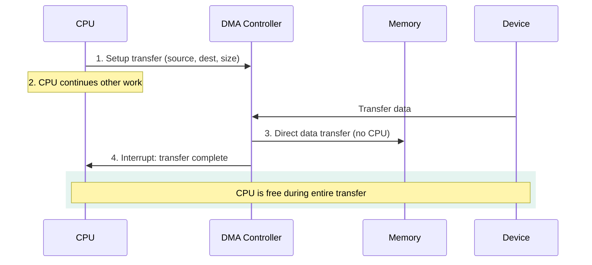
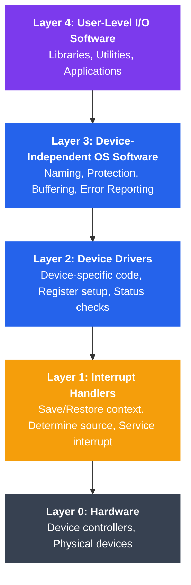

# I/O Hardware and Software

## What You'll Learn

In this tutorial, you will:

- Understand different categories of I/O devices (block, character, network)
- Learn three I/O communication methods: programmed I/O, interrupt-driven I/O, and DMA
- Explore I/O ports and memory-mapped I/O addressing
- Understand device controllers and their role in I/O operations
- Learn the layered software architecture for I/O systems
- Distinguish between blocking/non-blocking and synchronous/asynchronous I/O
- Work with Linux device files and inspection commands

---

## Introduction

Input/Output (I/O) systems connect computers to the external world. From keyboards and mice to network cards and storage devices, I/O hardware enables interaction with users and other systems. The operating system must manage this diverse hardware efficiently while providing a consistent interface to applications.

---

## I/O Device Categories

I/O devices are classified by how they transfer data:

### 1. Block Devices

**Characteristics**:
- Transfer data in fixed-size blocks (typically 512 bytes or 4KB)
- Support random access (can seek to any block)
- Bufferable and cacheable
- Examples: Hard drives, SSDs, USB drives, CD-ROMs

```
Block Device Structure:
┌─────────────────────────────────────────────┐
│           BLOCK DEVICE (e.g., SSD)          │
├─────────────────────────────────────────────┤
│  Block 0  │  Block 1  │  Block 2  │  ...   │
│  (4KB)    │  (4KB)    │  (4KB)    │        │
└─────────────────────────────────────────────┘
     ↕           ↕           ↕
  Random Access - Can read any block in any order
```

**Linux Examples**:
```bash
# List block devices
lsblk

# Output:
# NAME   MAJ:MIN RM   SIZE RO TYPE MOUNTPOINT
# sda      8:0    0 238.5G  0 disk
# ├─sda1   8:1    0   512M  0 part /boot
# └─sda2   8:2    0   238G  0 part /
```

### 2. Character Devices

**Characteristics**:
- Transfer data as stream of characters (bytes)
- Sequential access (no seeking, or limited seeking)
- Not bufferable in the same way as block devices
- Examples: Keyboards, mice, serial ports, printers, terminals

```
Character Device Stream:
┌─────────────────────────────────────────────┐
│     CHARACTER DEVICE (e.g., Keyboard)       │
├─────────────────────────────────────────────┤
│  'H' → 'e' → 'l' → 'l' → 'o' → '\n' → ...  │
└─────────────────────────────────────────────┘
         Sequential byte stream
```

**Linux Examples**:
```bash
# Character devices in /dev
ls -l /dev/tty* /dev/null /dev/random

# Output examples:
# crw-rw-rw- 1 root tty  5, 0 Jan 15 10:00 /dev/tty
# crw-rw-rw- 1 root root 1, 3 Jan 15 10:00 /dev/null
# crw-rw-rw- 1 root root 1, 8 Jan 15 10:00 /dev/random
```

### 3. Network Devices

**Characteristics**:
- Transfer data as packets
- Asynchronous arrival of data
- Not represented as files in `/dev` (use sockets instead)
- Examples: Ethernet cards, WiFi adapters, Bluetooth devices

```
Network Device Packet Flow:
┌────────────────────────────────────────────┐
│         NETWORK INTERFACE (eth0)           │
├────────────────────────────────────────────┤
│  Packet 1  │  Packet 2  │  Packet 3  │... │
│  [Headers] │  [Headers] │  [Headers] │    │
│  [Payload] │  [Payload] │  [Payload] │    │
└────────────────────────────────────────────┘
        ↓          ↓          ↓
   Socket Interface (not /dev files)
```

### Device Category Comparison

| Feature | Block Devices | Character Devices | Network Devices |
|---------|--------------|-------------------|-----------------|
| Data Unit | Fixed-size blocks | Byte stream | Packets |
| Access Pattern | Random access | Sequential | Asynchronous |
| Buffering | Extensive buffering | Minimal buffering | Packet queues |
| Caching | Yes | No | Protocol-specific |
| Examples | HDD, SSD | Keyboard, serial port | Ethernet, WiFi |
| Linux Location | `/dev/sda`, `/dev/nvme0n1` | `/dev/tty`, `/dev/null` | `eth0`, `wlan0` (ifconfig) |

---

## I/O Communication Methods

### 1. Programmed I/O (Polling)

The CPU continuously checks if the device is ready for I/O.

```
Programmed I/O Flow:
┌──────────────────────────────────────────────────────────┐
│                         CPU                              │
│  ┌────────────────────────────────────────────┐         │
│  │  while (!device_ready()) {                 │         │
│  │      // Busy wait (polling)                │         │
│  │  }                                         │         │
│  │  transfer_data();                          │         │
│  └────────────────────────────────────────────┘         │
└─────────────────┬────────────────────────────────────────┘
                  │ Polls status repeatedly
                  ↓
         ┌────────────────┐
         │  Device        │
         │  Controller    │
         └────────────────┘
```

**Example (Pseudocode)**:
```c
// Programmed I/O - CPU polls device
void programmed_io_read(char *buffer, int size) {
    for (int i = 0; i < size; i++) {
        // Busy-wait until device is ready
        while ((inb(DEVICE_STATUS_PORT) & READY_BIT) == 0) {
            // Wasting CPU cycles!
        }
        // Read one byte
        buffer[i] = inb(DEVICE_DATA_PORT);
    }
}
```

**Advantages**:
- Simple to implement
- No special hardware needed
- Good for very fast devices

**Disadvantages**:
- Wastes CPU time in busy-waiting
- Inefficient for slow devices
- CPU cannot do other work while polling

### 2. Interrupt-Driven I/O

The device sends an interrupt signal when ready, allowing the CPU to do other work.

```
Interrupt-Driven I/O Flow:
┌──────────────────────────────────────────────────────────┐
│                         CPU                              │
│  1. Initiate I/O                                         │
│  2. Continue other work ────────┐                        │
│  3. Interrupt received ←────────┼────────┐               │
│  4. Handle interrupt            │        │               │
│  5. Resume work                 │        │               │
└─────────────────────────────────┼────────┼───────────────┘
                                  │        │
                                  │        │ Sends interrupt
                                  ↓        │
                         ┌────────────────┴┐
                         │  Device         │
                         │  Controller     │
                         │  (Ready!)       │
                         └─────────────────┘
```

**Example (Pseudocode)**:
```c
// Interrupt-driven I/O
volatile int data_ready = 0;
volatile char received_byte;

// Interrupt Service Routine (ISR)
void device_interrupt_handler(void) {
    // Read data from device
    received_byte = inb(DEVICE_DATA_PORT);
    data_ready = 1;
    
    // Acknowledge interrupt
    outb(DEVICE_CONTROL_PORT, ACK_INTERRUPT);
}

// Main code
void interrupt_driven_read(char *buffer, int size) {
    for (int i = 0; i < size; i++) {
        // Initiate read operation
        outb(DEVICE_CONTROL_PORT, START_READ);
        
        // CPU can do other work here!
        data_ready = 0;
        while (!data_ready) {
            // Could schedule other processes here
            schedule();
        }
        
        buffer[i] = received_byte;
    }
}
```

**Advantages**:
- CPU can perform other tasks while waiting
- More efficient than polling for slow devices
- Responsive to device events

**Disadvantages**:
- Overhead of interrupt handling
- Complex to implement correctly
- Still requires CPU intervention for each byte/block

### 3. Direct Memory Access (DMA)

A specialized DMA controller transfers data directly between device and memory without CPU involvement.



```
DMA Transfer Flow:
┌──────────────────────────────────────────────────────────┐
│                         CPU                              │
│  1. Setup DMA transfer (source, dest, size)              │
│  2. Continue other work entirely ─────────┐              │
│  3. DMA complete interrupt ←──────────────┼──────┐       │
└───────────────────────────────────────────┼──────┼───────┘
                                            │      │
                                            │      │
    ┌───────────────────┐                  │      │
    │     Memory        │                  │      │
    │   (Destination)   │                  │      │
    └────────↑──────────┘                  │      │
             │                             │      │
             │ Direct transfer             │      │
             │ (no CPU involvement)        │      │
             │                             │      │
    ┌────────┴──────────┐                  │      │
    │  DMA Controller   │                  │      │
    │  - Transfer data  │                  │      │
    │  - Count bytes    │                  │      │
    │  - Send interrupt │                  │      │
    └────────↑──────────┘                  │      │
             │                             │      │
    ┌────────┴──────────┐                  │      │
    │     Device        │──────────────────┴──────┘
    │   (Source)        │    Interrupt when done
    └───────────────────┘
```

**Example (Pseudocode)**:
```c
// DMA transfer setup
typedef struct {
    void *source_addr;      // Device buffer address
    void *dest_addr;        // Memory buffer address
    size_t transfer_size;   // Number of bytes
    int device_id;          // Which device
} dma_config_t;

void dma_transfer(char *buffer, int size) {
    dma_config_t config;
    
    // Setup DMA controller
    config.source_addr = (void *)DEVICE_BUFFER_ADDR;
    config.dest_addr = buffer;
    config.transfer_size = size;
    config.device_id = DISK_DEVICE_ID;
    
    // Initiate DMA transfer
    dma_setup_transfer(&config);
    dma_start();
    
    // CPU is now free for other work!
    // DMA controller handles the entire transfer
    
    // Wait for DMA completion interrupt
    wait_for_dma_interrupt();
}

// DMA interrupt handler
void dma_interrupt_handler(void) {
    // Transfer complete!
    // Notify waiting process
    dma_complete = 1;
    wakeup_waiting_process();
}
```

**Advantages**:
- Minimal CPU involvement
- Efficient for large data transfers
- CPU can perform useful work during transfer

**Disadvantages**:
- Requires special DMA controller hardware
- More complex setup
- May have bus contention issues

### Communication Method Comparison

| Aspect | Programmed I/O | Interrupt-Driven | DMA |
|--------|---------------|------------------|-----|
| CPU Involvement | Continuous polling | Per byte/block | Setup only |
| Efficiency | Low | Medium | High |
| Best For | Very fast devices | Medium-speed devices | Bulk data transfer |
| Hardware Required | Minimal | Interrupt controller | DMA controller |
| Latency | Low | Medium | Low (after setup) |
| Throughput | Low | Medium | High |

---

## I/O Addressing: Ports vs Memory-Mapped I/O

### Port-Mapped I/O (Isolated I/O)

Separate address space for I/O devices, accessed via special CPU instructions.

```
Port-Mapped I/O:
┌─────────────────────────────────────────────────────────┐
│                    CPU                                  │
│  Special I/O Instructions: IN, OUT                      │
└────────────┬──────────────────────┬─────────────────────┘
             │                      │
             │ I/O Address Space    │ Memory Address Space
             │ (0x0000 - 0xFFFF)   │ (0x00000000 - 0xFFFFFFFF)
             ↓                      ↓
    ┌────────────────┐     ┌────────────────┐
    │  I/O Devices   │     │  RAM Memory    │
    │  Port 0x3F8    │     │  0x00001000    │
    │  (Serial)      │     │  ...           │
    └────────────────┘     └────────────────┘
```

**Example (x86 Assembly)**:
```c
// Reading from I/O port
unsigned char inb(unsigned short port) {
    unsigned char value;
    __asm__ volatile ("inb %1, %0" : "=a"(value) : "Nd"(port));
    return value;
}

// Writing to I/O port
void outb(unsigned short port, unsigned char value) {
    __asm__ volatile ("outb %0, %1" : : "a"(value), "Nd"(port));
}

// Example usage - serial port
#define SERIAL_PORT 0x3F8

void send_byte_serial(char byte) {
    outb(SERIAL_PORT, byte);  // Write to serial port
}

char read_byte_serial(void) {
    return inb(SERIAL_PORT);  // Read from serial port
}
```

### Memory-Mapped I/O

Device registers are mapped into the memory address space.

```
Memory-Mapped I/O:
┌─────────────────────────────────────────────────────────┐
│                    CPU                                  │
│  Standard Memory Instructions: MOV, LOAD, STORE         │
└────────────┬────────────────────────────────────────────┘
             │
             │ Unified Address Space
             ↓
    ┌────────────────────────────────┐
    │  0x00000000 - 0x7FFFFFFF       │
    │  Regular RAM                   │
    ├────────────────────────────────┤
    │  0x80000000 - 0x8000FFFF       │
    │  Device 1 Registers            │ ← I/O devices
    ├────────────────────────────────┤
    │  0x80010000 - 0x8001FFFF       │
    │  Device 2 Registers            │ ← I/O devices
    ├────────────────────────────────┤
    │  0x80020000 - 0xFFFFFFFF       │
    │  More RAM / Other Devices      │
    └────────────────────────────────┘
```

**Example (C)**:
```c
// Memory-mapped I/O example (ARM/embedded systems)
#define DEVICE_BASE_ADDR  0x80000000
#define DEVICE_STATUS     (*(volatile uint32_t *)(DEVICE_BASE_ADDR + 0x00))
#define DEVICE_DATA       (*(volatile uint32_t *)(DEVICE_BASE_ADDR + 0x04))
#define DEVICE_CONTROL    (*(volatile uint32_t *)(DEVICE_BASE_ADDR + 0x08))

#define STATUS_READY  0x01
#define CTRL_START    0x01

// Read from memory-mapped device
uint32_t read_device_data(void) {
    // Wait until device is ready
    while (!(DEVICE_STATUS & STATUS_READY)) {
        // Busy wait
    }
    
    // Read data using standard memory access
    return DEVICE_DATA;
}

// Write to memory-mapped device
void write_device_data(uint32_t data) {
    // Write data
    DEVICE_DATA = data;
    
    // Start operation
    DEVICE_CONTROL = CTRL_START;
}
```

### Port-Mapped vs Memory-Mapped I/O

| Aspect | Port-Mapped I/O | Memory-Mapped I/O |
|--------|-----------------|-------------------|
| Address Space | Separate I/O space | Unified with memory |
| CPU Instructions | Special (IN, OUT) | Standard (MOV, LOAD, STORE) |
| Address Width | Limited (16-bit) | Full address range |
| Caching | Not cached | Can be cached (with care) |
| Memory Protection | Separate permissions | Same as memory |
| Architecture | x86, x86-64 | ARM, MIPS, RISC-V, modern systems |

---

## Device Controllers

A device controller is hardware that acts as an intermediary between the device and the system bus.

```
Device Controller Architecture:
┌─────────────────────────────────────────────────────────┐
│                    System Bus                           │
└────────────────┬────────────────────────────────────────┘
                 │
                 ↓
        ┌─────────────────────┐
        │ Device Controller   │
        ├─────────────────────┤
        │  • Control Logic    │ ← Interprets commands
        │  • Status Register  │ ← Reports device state
        │  • Data Register    │ ← Buffers data
        │  • Command Register │ ← Receives commands
        │  • Error Register   │ ← Reports errors
        │  • DMA Logic        │ ← Handles DMA transfers
        └──────────┬──────────┘
                   │
                   ↓
          ┌────────────────┐
          │  Physical      │
          │  Device        │
          │  (e.g., Disk)  │
          └────────────────┘
```

**Controller Responsibilities**:

1. **Command Interpretation**: Translate OS commands to device-specific operations
2. **Status Reporting**: Inform OS about device state (ready, busy, error)
3. **Data Buffering**: Temporarily store data being transferred
4. **Error Detection**: Identify and report transmission errors
5. **Signal Conversion**: Convert between electrical signals and data
6. **Timing Control**: Manage device-specific timing requirements

---

## I/O Software Layers

Operating systems organize I/O software into layers:



```
I/O Software Stack (Top to Bottom):
┌───────────────────────────────────────────────────────────┐
│  Layer 4: User-Level I/O Software                         │
│  • Libraries (stdio, fstream)                             │
│  • Utilities (ls, cp, cat)                                │
│  • Applications                                           │
├───────────────────────────────────────────────────────────┤
│  Layer 3: Device-Independent OS Software                  │
│  • Uniform naming (/dev/sda)                              │
│  • Protection (permissions)                               │
│  • Buffering                                              │
│  • Error reporting                                        │
│  • Allocation (device assignment)                         │
├───────────────────────────────────────────────────────────┤
│  Layer 2: Device Drivers                                  │
│  • Device-specific code                                   │
│  • Setup device registers                                 │
│  • Check status                                           │
│  • Handle device quirks                                   │
├───────────────────────────────────────────────────────────┤
│  Layer 1: Interrupt Handlers                              │
│  • Save context                                           │
│  • Determine interrupt source                             │
│  • Service the interrupt                                  │
│  • Restore context                                        │
├───────────────────────────────────────────────────────────┤
│  Layer 0: Hardware                                        │
│  • Device controllers                                     │
│  • Physical devices                                       │
└───────────────────────────────────────────────────────────┘
```

### Layer Details

**Layer 1: Interrupt Handlers**
- Runs at highest priority
- Minimal processing (save context, unblock driver, schedule deferred work)
- Must be fast and non-blocking

**Layer 2: Device Drivers**
- Device-specific implementation
- Translates generic I/O requests to device commands
- Manages device state
- Loaded as kernel modules

**Layer 3: Device-Independent Software**
- Provides uniform interface
- Implements buffering and caching
- Manages device allocation and protection
- Error handling and reporting

**Layer 4: User-Level Software**
- Standard library functions (printf, fread)
- System utilities
- Applications

---

## Blocking vs Non-Blocking I/O

### Blocking I/O

Process waits (blocks) until I/O operation completes.

```
Blocking I/O Timeline:
Process A:  ──[read()]──────────────────────────[resume]──
                │                               │
                │ (blocked, waiting)            │
                │                               │
                ↓                               ↓
Kernel:     [initiate I/O]──[wait]──[I/O complete]
                                    [copy data to process]
Time ───────────────────────────────────────────────────→
```

**Example (C)**:
```c
#include <stdio.h>
#include <fcntl.h>
#include <unistd.h>

int main() {
    int fd = open("/dev/sda", O_RDONLY);  // Open device
    char buffer[512];
    
    // Blocking read - process waits here until data is ready
    ssize_t bytes = read(fd, buffer, 512);
    
    if (bytes > 0) {
        printf("Read %zd bytes\n", bytes);
    }
    
    close(fd);
    return 0;
}
```

### Non-Blocking I/O

Process continues execution; I/O operation returns immediately (may not be complete).

```
Non-Blocking I/O Timeline:
Process A:  ──[read()]─[do work]─[check]─[check]─[check]──
                │                   │       │       │
                │ returns          EAGAIN  EAGAIN  data ready
                │ immediately       │       │       │
                ↓                   ↓       ↓       ↓
Kernel:     [initiate I/O]───[in progress]───[complete]
                                
Time ───────────────────────────────────────────────────→
```

**Example (C)**:
```c
#include <stdio.h>
#include <fcntl.h>
#include <unistd.h>
#include <errno.h>

int main() {
    // Open with O_NONBLOCK flag
    int fd = open("/dev/sda", O_RDONLY | O_NONBLOCK);
    char buffer[512];
    
    // Non-blocking read - returns immediately
    ssize_t bytes = read(fd, buffer, 512);
    
    if (bytes < 0 && errno == EAGAIN) {
        printf("Data not ready yet, would block\n");
        // Can do other work here
        // Later try again or use select/poll/epoll
    } else if (bytes > 0) {
        printf("Read %zd bytes\n", bytes);
    }
    
    close(fd);
    return 0;
}
```

---

## Synchronous vs Asynchronous I/O

### Synchronous I/O

Process waits for I/O to complete before continuing (even if non-blocking).

### Asynchronous I/O

Process initiates I/O and continues immediately. OS notifies when complete.

```
Asynchronous I/O Timeline:
Process A:  ──[aio_read()]──[do other work]──────[signal]──[handle result]──
                │                                    ↑
                │                                    │
                │                               [notification]
                ↓                                    │
Kernel:     [initiate I/O]────[in progress]────[complete]
                                
Time ──────────────────────────────────────────────────────────────────────→
```

**Example (C with POSIX AIO)**:
```c
#include <aio.h>
#include <stdio.h>
#include <fcntl.h>
#include <string.h>
#include <errno.h>
#include <unistd.h>

int main() {
    int fd = open("/tmp/testfile", O_RDONLY);
    char buffer[512];
    
    // Setup asynchronous I/O control block
    struct aiocb cb;
    memset(&cb, 0, sizeof(struct aiocb));
    cb.aio_fildes = fd;
    cb.aio_buf = buffer;
    cb.aio_nbytes = 512;
    cb.aio_offset = 0;
    
    // Initiate asynchronous read
    if (aio_read(&cb) == -1) {
        perror("aio_read");
        return 1;
    }
    
    printf("Async I/O initiated, doing other work...\n");
    
    // Do other work while I/O is in progress
    for (int i = 0; i < 1000000; i++) {
        // Simulate work
    }
    
    // Check if I/O is complete
    while (aio_error(&cb) == EINPROGRESS) {
        printf("Still in progress...\n");
        sleep(1);
    }
    
    // Get result
    ssize_t bytes = aio_return(&cb);
    printf("Async read completed: %zd bytes\n", bytes);
    
    close(fd);
    return 0;
}
```

### I/O Operation Comparison

| Type | Blocking | Non-Blocking | Asynchronous |
|------|----------|--------------|--------------|
| Process State | Blocked until complete | Can check status | Continues, notified later |
| Returns When | Data available | Immediately | Immediately |
| Multiple I/O | Sequential | Must poll/check | Parallel operations |
| Complexity | Simple | Medium | Complex |
| Best For | Simple apps | Event-driven apps | High-performance I/O |

---

## Linux Device Files (/dev)

Linux represents devices as files in the `/dev` directory.

```bash
# List devices with details
ls -l /dev/ | head -20

# Block devices start with 'b'
# Character devices start with 'c'

# Example output:
# brw-rw---- 1 root disk    8,  0 Jan 15 10:00 sda
# brw-rw---- 1 root disk    8,  1 Jan 15 10:00 sda1
# crw-rw-rw- 1 root tty     5,  0 Jan 15 10:00 tty
# crw------- 1 root root   10, 61 Jan 15 10:00 userio
```

### Device File Structure

```
Device File Components:
┌───────────────────────────────────────────────────────┐
│  brw-rw---- 1 root disk  8, 0  Jan 15 10:00  sda     │
│  │          │ │    │     │  │                 │      │
│  │          │ │    │     │  │                 └─ Name
│  │          │ │    │     │  └─ Minor number
│  │          │ │    │     └─ Major number
│  │          │ │    └─ Group
│  │          │ └─ Owner
│  │          └─ Link count
│  └─ Type & Permissions (b=block, c=character)
└───────────────────────────────────────────────────────┘
```

**Major and Minor Numbers**:
- **Major number**: Identifies the device driver
- **Minor number**: Identifies specific device instance

### Common Device Files

```bash
# Null device (discards all data)
/dev/null

# Zero device (provides infinite zeros)
/dev/zero

# Random number generators
/dev/random    # Blocks when entropy pool empty
/dev/urandom   # Never blocks

# Terminal devices
/dev/tty       # Current terminal
/dev/pts/0     # Pseudo-terminal

# Block devices
/dev/sda       # First SATA disk
/dev/nvme0n1   # First NVMe disk
```

---

## Linux Device Inspection Commands

### lsblk - List Block Devices

```bash
# Basic listing
lsblk

# Output with filesystem info
lsblk -f

# Show all columns
lsblk -o NAME,SIZE,TYPE,MOUNTPOINT,FSTYPE,MODEL

# Example output:
# NAME   SIZE TYPE MOUNTPOINT FSTYPE MODEL
# sda    238G disk                   Samsung SSD 860
# ├─sda1 512M part /boot      ext4
# └─sda2 237G part /          ext4
# sr0   1024M rom                    DVD-RW
```

### lsusb - List USB Devices

```bash
# List all USB devices
lsusb

# Verbose output for specific device
lsusb -v -d 046d:c52b  # Logitech device

# Tree view showing USB topology
lsusb -t

# Example output:
# Bus 002 Device 003: ID 046d:c52b Logitech, Inc. USB Keyboard
# Bus 002 Device 002: ID 8087:0024 Intel Corp. Hub
# Bus 001 Device 001: ID 1d6b:0002 Linux Foundation 2.0 root hub
```

### lspci - List PCI Devices

```bash
# List all PCI devices
lspci

# Verbose output
lspci -v

# Very verbose with kernel drivers
lspci -vv

# Show device tree
lspci -t

# Example output:
# 00:00.0 Host bridge: Intel Corporation Device 9b33
# 00:02.0 VGA compatible controller: Intel Corporation Device 9bc8
# 00:14.0 USB controller: Intel Corporation Device 06ed
# 01:00.0 Network controller: Intel Corporation Wi-Fi 6 AX201
```

### Example: Complete Device Inspection Script

```bash
#!/bin/bash
# device_info.sh - Comprehensive device information

echo "=== BLOCK DEVICES ==="
lsblk -o NAME,SIZE,TYPE,MOUNTPOINT,FSTYPE

echo -e "\n=== USB DEVICES ==="
lsusb

echo -e "\n=== PCI DEVICES ==="
lspci | grep -E '(VGA|Network|USB|SATA|NVMe)'

echo -e "\n=== DEVICE STATISTICS ==="
echo "Character devices: $(ls -l /dev | grep ^c | wc -l)"
echo "Block devices: $(ls -l /dev | grep ^b | wc -l)"

echo -e "\n=== DISK I/O STATISTICS ==="
iostat -x 1 2  # Requires sysstat package
```

---

## Practical Examples

### Example 1: Reading from Character Device

```c
// read_keyboard.c - Read from keyboard device
#include <stdio.h>
#include <fcntl.h>
#include <unistd.h>
#include <linux/input.h>

int main() {
    // Open keyboard event device (may need sudo)
    int fd = open("/dev/input/event0", O_RDONLY);
    if (fd < 0) {
        perror("Cannot open keyboard device");
        return 1;
    }
    
    struct input_event ev;
    printf("Reading keyboard events (Ctrl+C to stop)...\n");
    
    while (1) {
        // Blocking read
        if (read(fd, &ev, sizeof(struct input_event)) > 0) {
            if (ev.type == EV_KEY && ev.value == 1) {  // Key press
                printf("Key pressed: code=%d\n", ev.code);
            }
        }
    }
    
    close(fd);
    return 0;
}
```

### Example 2: Memory-Mapped I/O Simulation

```c
// mmio_example.c - Simulated memory-mapped I/O
#include <stdio.h>
#include <stdint.h>
#include <sys/mman.h>
#include <fcntl.h>
#include <unistd.h>

#define DEVICE_SIZE 4096

// Simulated device registers
typedef struct {
    volatile uint32_t status;
    volatile uint32_t control;
    volatile uint32_t data;
    volatile uint32_t error;
} device_regs_t;

int main() {
    // Open /dev/mem (requires root privileges)
    int fd = open("/dev/mem", O_RDWR | O_SYNC);
    if (fd < 0) {
        perror("Cannot open /dev/mem");
        printf("Note: This example requires root privileges\n");
        return 1;
    }
    
    // Map physical address to virtual address
    // (In real scenario, use actual device address from datasheet)
    void *mapped = mmap(NULL, DEVICE_SIZE, 
                       PROT_READ | PROT_WRITE, 
                       MAP_SHARED, fd, 0x80000000);
    
    if (mapped == MAP_FAILED) {
        perror("mmap failed");
        close(fd);
        return 1;
    }
    
    device_regs_t *device = (device_regs_t *)mapped;
    
    // Read status register
    uint32_t status = device->status;
    printf("Device status: 0x%08x\n", status);
    
    // Write to control register
    device->control = 0x01;  // Start operation
    
    // Cleanup
    munmap(mapped, DEVICE_SIZE);
    close(fd);
    
    return 0;
}
```

---

## Exercises

### Beginner

1. **Device Exploration**: Use `lsblk`, `lsusb`, and `lspci` to list all devices on your system. Identify the major and minor numbers for your primary disk.

2. **Character Device**: Write a program that reads 10 bytes from `/dev/urandom` and prints them in hexadecimal format.

3. **Device Files**: Create a shell script that counts the number of block devices, character devices, and symbolic links in `/dev`.

### Intermediate

4. **Non-Blocking I/O**: Modify the character device reading example to use non-blocking I/O with the `O_NONBLOCK` flag. Handle `EAGAIN` errors appropriately.

5. **Device Information**: Write a C program that opens a block device and uses `ioctl()` with `BLKGETSIZE64` to determine the device size in bytes.

6. **I/O Methods Comparison**: Write a benchmark program that compares the performance of reading a large file using:
   - Standard blocking read()
   - Non-blocking read() with polling
   - POSIX AIO asynchronous I/O

### Advanced

7. **DMA Simulation**: Create a simulation program that demonstrates how DMA transfers work. Use threads to represent the CPU, DMA controller, and device. Show how the CPU can do other work during DMA transfer.

8. **Device Monitor**: Write a program using `select()` or `epoll()` to monitor multiple device files simultaneously (e.g., keyboard, mouse events from `/dev/input/`).

9. **Memory-Mapped File**: Implement a program that creates a large file and uses `mmap()` to map it into memory. Compare performance with traditional `read()`/`write()` operations for random access patterns.

---

## Key Takeaways

1. **Device Categories**: Block devices (random access), character devices (sequential), and network devices (packet-based) require different management strategies.

2. **I/O Communication**: Programmed I/O wastes CPU cycles, interrupt-driven I/O is more efficient, and DMA provides the best performance for bulk transfers.

3. **I/O Addressing**: Port-mapped I/O uses separate address space with special instructions, while memory-mapped I/O unifies device registers with memory space.

4. **Software Layers**: I/O systems use layered architecture from hardware through interrupt handlers, device drivers, OS abstraction, to user applications.

5. **I/O Modes**: Understand the differences between blocking/non-blocking and synchronous/asynchronous I/O for different application needs.

6. **Linux Device Model**: Devices appear as files in `/dev`, with major numbers identifying drivers and minor numbers identifying device instances.

7. **Inspection Tools**: `lsblk`, `lsusb`, and `lspci` provide essential device information for system administration and troubleshooting.

---

## Navigation

- [← Back to I/O Systems](./README.md)
- [Next: I/O Scheduling →](./02_io_scheduling.md)

---

## Further Reading

- Linux kernel documentation on I/O subsystems
- "Linux Device Drivers" by Corbet, Rubini, and Kroah-Hartman
- Intel and ARM architecture manuals for I/O specifications
- POSIX AIO documentation and examples
