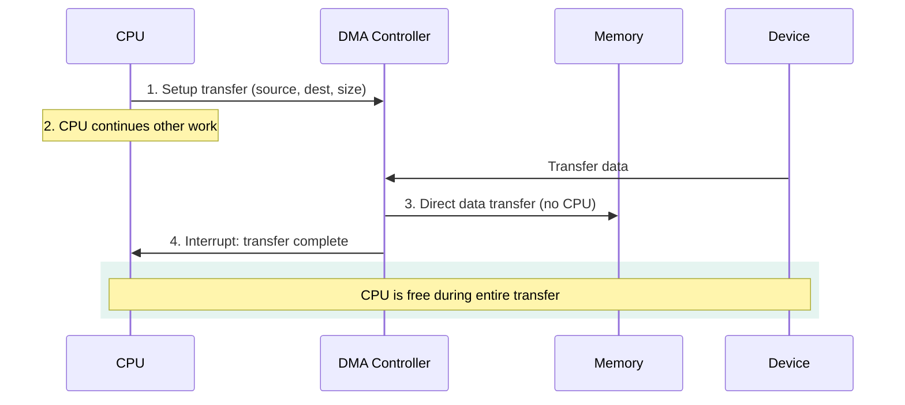
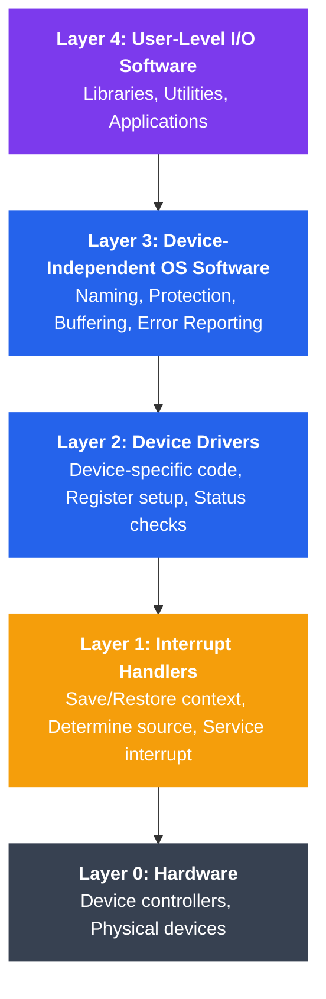

# I/O Hardware and Software

## Is Tutorial Mein Kya Seekhoge

Is tutorial mein tum ye samjhoge:

- I/O devices ki alag-alag categories (block, character, network)
- Teen I/O communication methods: programmed I/O, interrupt-driven I/O, aur DMA
- I/O ports aur memory-mapped I/O addressing
- Device controllers kya hote hain aur I/O operations mein unka role
- I/O systems ka layered software architecture
- Blocking/non-blocking aur synchronous/asynchronous I/O mein farak
- Linux device files aur inspection commands ke saath kaam karna

---

## Introduction

Socho ek second — jab bhi tum keyboard pe kuch type karte ho, mouse move karte ho, ya apna Node.js app kisi database se data fetch karta hai, background mein ek poori machinery chal rahi hoti hai jo CPU aur outside world ke beech data la-le jaa rahi hoti hai. Yahi kaam I/O (Input/Output) systems ka hai.

I/O systems computer ko bahar ki duniya se connect karte hain — keyboard, mouse se lekar network cards aur storage devices tak. Ye hardware users aur dusre systems ke saath interaction possible banata hai. Ab problem ye hai ki har device alag tarike se kaam karta hai — ek hard disk aur ek keyboard ka behaviour bilkul alag hota hai. Operating System ka kaam hai is saare alag-alag, chaotic hardware ko efficiently manage karna, aur applications ko ek consistent, simple interface dena — jaise Zomato app tumhe ye nahi dikhata ki restaurant ka kitchen kaise chal raha hai, bas tumhe ek clean order-placing interface deta hai.

Isi wajah se Node.js developer ke liye bhi ye samajhna zaruri hai — jab tum `fs.readFile()` ya `net.createServer()` call karte ho, neeche yehi saara I/O hardware/software layering kaam kar rahi hoti hai.

---

## I/O Device Categories

**Kya hota hai?** Har I/O device data transfer karne ka apna tarika rakhta hai. OS ko ye pata hona chahiye ki kaunsa device kaise behave karta hai, taaki sahi strategy use kar sake.

I/O devices ko classify kiya jata hai is basis pe ki wo data kaise transfer karte hain:

### 1. Block Devices

Socho ek almirah hai jisme numbered drawers hain — tumhe kisi bhi drawer ko directly khol sakte ho, sequence mein khaanay ki zarurat nahi. Block devices bhi aise hi kaam karte hain.

**Characteristics**:
- Data ko fixed-size blocks mein transfer karte hain (typically 512 bytes ya 4KB)
- Random access support karte hain (kisi bhi block pe seek kar sakte ho)
- Bufferable aur cacheable hote hain
- Examples: Hard drives, SSDs, USB drives, CD-ROMs

```
Block Device Structure:
┌─────────────────────────────────────────────┐
│           BLOCK DEVICE (e.g., SSD)          │
├─────────────────────────────────────────────┤
│  Block 0  │  Block 1  │  Block 2  │  ...   │
│  (4KB)    │  (4KB)    │  (4KB)    │        │
└─────────────────────────────────────────────┘
     ↕           ↕           ↕
  Random Access - Can read any block in any order
```

Ye bilkul IRCTC ke seat chart jaisa hai — tumhe seat number 45 chahiye toh directly wahan jaake dekh sakte ho, 1 se 44 tak scan karne ki zarurat nahi. Yehi "random access" ka fayda hai jo SSD/HDD deta hai — chahe file kahin bhi ho disk pe, seedha usi block pe jump ho jaata hai.

**Linux Examples**:
```bash
# List block devices
lsblk

# Output:
# NAME   MAJ:MIN RM   SIZE RO TYPE MOUNTPOINT
# sda      8:0    0 238.5G  0 disk
# ├─sda1   8:1    0   512M  0 part /boot
# └─sda2   8:2    0   238G  0 part /
```

### 2. Character Devices

**Kya hota hai?** Ye ek continuous stream ki tarah hai — jaise WhatsApp pe koi voice note bhej raha ho, tumhe usko shuru se end tak sequentially sunna padta hai, beech mein jump nahi kar sakte (zyaadatar).

**Characteristics**:
- Data ko characters (bytes) ki stream ki tarah transfer karte hain
- Sequential access (seeking nahi hoti, ya limited seeking)
- Block devices jaisi buffering nahi hoti
- Examples: Keyboards, mice, serial ports, printers, terminals

```
Character Device Stream:
┌─────────────────────────────────────────────┐
│     CHARACTER DEVICE (e.g., Keyboard)       │
├─────────────────────────────────────────────┤
│  'H' → 'e' → 'l' → 'l' → 'o' → '\n' → ...  │
└─────────────────────────────────────────────┘
         Sequential byte stream
```

Jab tum keyboard pe type karte ho, ek-ek character CPU tak sequentially pahunchta hai — waise hi jaise UPI transaction ka OTP ek-ek digit type karke enter karte ho, koi "random access" nahi hota, order matter karta hai.

**Linux Examples**:
```bash
# Character devices in /dev
ls -l /dev/tty* /dev/null /dev/random

# Output examples:
# crw-rw-rw- 1 root tty  5, 0 Jan 15 10:00 /dev/tty
# crw-rw-rw- 1 root root 1, 3 Jan 15 10:00 /dev/null
# crw-rw-rw- 1 root root 1, 8 Jan 15 10:00 /dev/random
```

### 3. Network Devices

**Kya hota hai?** Network devices data ko packets ki form mein bhejte hain — bilkul Zomato delivery ki tarah jahan ek order alag-alag parts mein (packaging, delivery boy pickup, route) chalta hai, aur ye predict nahi kar sakte ki kab exactly deliver hoga.

**Characteristics**:
- Data ko packets ki form mein transfer karte hain
- Data ka arrival asynchronous hota hai (kab aayega pata nahi)
- `/dev` mein files ki tarah represent nahi hote (sockets use hote hain)
- Examples: Ethernet cards, WiFi adapters, Bluetooth devices

```
Network Device Packet Flow:
┌────────────────────────────────────────────┐
│         NETWORK INTERFACE (eth0)           │
├────────────────────────────────────────────┤
│  Packet 1  │  Packet 2  │  Packet 3  │... │
│  [Headers] │  [Headers] │  [Headers] │    │
│  [Payload] │  [Payload] │  [Payload] │    │
└────────────────────────────────────────────┘
        ↓          ↓          ↓
   Socket Interface (not /dev files)
```

> [!info]
> Network devices `/dev` mein file ki tarah nahi dikhte kyunki packets ka aana bilkul unpredictable hota hai — koi bhi time koi bhi packet aa sakta hai. Isliye OS inhe **sockets** ke through expose karta hai, jo ki Node.js mein `net` module use karke tum directly access karte ho.

### Device Category Comparison

| Feature | Block Devices | Character Devices | Network Devices |
|---------|--------------|-------------------|-----------------|
| Data Unit | Fixed-size blocks | Byte stream | Packets |
| Access Pattern | Random access | Sequential | Asynchronous |
| Buffering | Extensive buffering | Minimal buffering | Packet queues |
| Caching | Yes | No | Protocol-specific |
| Examples | HDD, SSD | Keyboard, serial port | Ethernet, WiFi |
| Linux Location | `/dev/sda`, `/dev/nvme0n1` | `/dev/tty`, `/dev/null` | `eth0`, `wlan0` (ifconfig) |

---

## I/O Communication Methods

**Kyun zaruri hai?** Ab sawaal ye hai — jab CPU ko kisi device se data chahiye, wo device se "baat" kaise kare? Teen tarike hain, aur inka evolution samajhna important hai kyunki ye batata hai ki CPU efficiency ke liye OS design kaisi shape leta hai.

### 1. Programmed I/O (Polling)

**Kya hota hai?** CPU baar-baar check karta rehta hai ki device ready hai ya nahi — jaise koi banda Swiggy app pe har 2 second mein refresh karke check kare "order aaya kya, order aaya kya" — bina kuch aur kaam kiye.

```
Programmed I/O Flow:
┌──────────────────────────────────────────────────────────┐
│                         CPU                              │
│  ┌────────────────────────────────────────────┐         │
│  │  while (!device_ready()) {                 │         │
│  │      // Busy wait (polling)                │         │
│  │  }                                         │         │
│  │  transfer_data();                          │         │
│  └────────────────────────────────────────────┘         │
└─────────────────┬────────────────────────────────────────┘
                  │ Polls status repeatedly
                  ↓
         ┌────────────────┐
         │  Device        │
         │  Controller    │
         └────────────────┘
```

**Example (Pseudocode)**:
```c
// Programmed I/O - CPU polls device
void programmed_io_read(char *buffer, int size) {
    for (int i = 0; i < size; i++) {
        // Busy-wait until device is ready
        while ((inb(DEVICE_STATUS_PORT) & READY_BIT) == 0) {
            // Wasting CPU cycles!
        }
        // Read one byte
        buffer[i] = inb(DEVICE_DATA_PORT);
    }
}
```

**Advantages**:
- Implement karna simple hai
- Koi special hardware nahi chahiye
- Bahut fast devices ke liye achha

**Disadvantages**:
- Busy-waiting mein CPU time waste hota hai
- Slow devices ke liye inefficient
- Polling ke time CPU koi aur kaam nahi kar sakta

Ye waise hi hai jaise tum apna pura din bas isi mein nikaal do ki "Swiggy delivery boy aaya kya" dekhte raho — koi productive kaam nahi kar paoge. Yehi CPU ke saath hota hai polling mein.

### 2. Interrupt-Driven I/O

**Kya hota hai?** Ab thoda smart approach — device khud CPU ko batayega jab ready ho jaaye (interrupt bhejkar), tab tak CPU free hoke apna doosra kaam karta rahega. Bilkul Zomato delivery boy ki tarah — tum order karke apna doosra kaam karte raho, jab khana ready hoga delivery boy tumhe call/notification bhej dega, tab jaake tum door pe jaoge.

```
Interrupt-Driven I/O Flow:
┌──────────────────────────────────────────────────────────┐
│                         CPU                              │
│  1. Initiate I/O                                         │
│  2. Continue other work ────────┐                        │
│  3. Interrupt received ←────────┼────────┐               │
│  4. Handle interrupt            │        │               │
│  5. Resume work                 │        │               │
└─────────────────────────────────┼────────┼───────────────┘
                                  │        │
                                  │        │ Sends interrupt
                                  ↓        │
                         ┌────────────────┴┐
                         │  Device         │
                         │  Controller     │
                         │  (Ready!)       │
                         └─────────────────┘
```

**Example (Pseudocode)**:
```c
// Interrupt-driven I/O
volatile int data_ready = 0;
volatile char received_byte;

// Interrupt Service Routine (ISR)
void device_interrupt_handler(void) {
    // Read data from device
    received_byte = inb(DEVICE_DATA_PORT);
    data_ready = 1;
    
    // Acknowledge interrupt
    outb(DEVICE_CONTROL_PORT, ACK_INTERRUPT);
}

// Main code
void interrupt_driven_read(char *buffer, int size) {
    for (int i = 0; i < size; i++) {
        // Initiate read operation
        outb(DEVICE_CONTROL_PORT, START_READ);
        
        // CPU can do other work here!
        data_ready = 0;
        while (!data_ready) {
            // Could schedule other processes here
            schedule();
        }
        
        buffer[i] = received_byte;
    }
}
```

**Advantages**:
- CPU wait karte hue bhi doosre tasks perform kar sakta hai
- Slow devices ke liye polling se zyada efficient
- Device events ke prati responsive

**Disadvantages**:
- Interrupt handle karne ka overhead hota hai
- Sahi tarike se implement karna complex hai
- Phir bhi har byte/block ke liye CPU ki involvement chahiye

### 3. Direct Memory Access (DMA)

**Kya hota hai?** Ye sabse smart level hai. Ek specialized DMA controller device aur memory ke beech direct data transfer karta hai — CPU ko beech mein aana hi nahi padta. Ye bilkul aisa hai jaise tum ek trusted delivery partner (DMA controller) ko poora kaam de do — "bhai ye poora saaman warehouse se ghar tak pahucha do", aur tum (CPU) apna doosra important kaam karte raho. Jab poora kaam ho jaaye, tumhe sirf ek notification (interrupt) milega "delivery complete".



```
DMA Transfer Flow:
┌──────────────────────────────────────────────────────────┐
│                         CPU                              │
│  1. Setup DMA transfer (source, dest, size)              │
│  2. Continue other work entirely ─────────┐              │
│  3. DMA complete interrupt ←──────────────┼──────┐       │
└───────────────────────────────────────────┼──────┼───────┘
                                            │      │
                                            │      │
    ┌───────────────────┐                  │      │
    │     Memory        │                  │      │
    │   (Destination)   │                  │      │
    └────────↑──────────┘                  │      │
             │                             │      │
             │ Direct transfer             │      │
             │ (no CPU involvement)        │      │
             │                             │      │
    ┌────────┴──────────┐                  │      │
    │  DMA Controller   │                  │      │
    │  - Transfer data  │                  │      │
    │  - Count bytes    │                  │      │
    │  - Send interrupt │                  │      │
    └────────↑──────────┘                  │      │
             │                             │      │
    ┌────────┴──────────┐                  │      │
    │     Device        │──────────────────┴──────┘
    │   (Source)        │    Interrupt when done
    └───────────────────┘
```

**Example (Pseudocode)**:
```c
// DMA transfer setup
typedef struct {
    void *source_addr;      // Device buffer address
    void *dest_addr;        // Memory buffer address
    size_t transfer_size;   // Number of bytes
    int device_id;          // Which device
} dma_config_t;

void dma_transfer(char *buffer, int size) {
    dma_config_t config;
    
    // Setup DMA controller
    config.source_addr = (void *)DEVICE_BUFFER_ADDR;
    config.dest_addr = buffer;
    config.transfer_size = size;
    config.device_id = DISK_DEVICE_ID;
    
    // Initiate DMA transfer
    dma_setup_transfer(&config);
    dma_start();
    
    // CPU is now free for other work!
    // DMA controller handles the entire transfer
    
    // Wait for DMA completion interrupt
    wait_for_dma_interrupt();
}

// DMA interrupt handler
void dma_interrupt_handler(void) {
    // Transfer complete!
    // Notify waiting process
    dma_complete = 1;
    wakeup_waiting_process();
}
```

**Advantages**:
- CPU ki involvement minimal hoti hai
- Large data transfers ke liye efficient
- Transfer ke dauraan CPU useful kaam kar sakta hai

**Disadvantages**:
- Special DMA controller hardware chahiye
- Setup zyada complex hota hai
- Bus contention issues ho sakte hain

> [!tip]
> Jab bhi tumhara Node.js app large file read/write karta hai (jaise `fs.createReadStream`), background mein OS level pe DMA hi actual kaam kar raha hota hai — CPU sirf setup karke free ho jaata hai, actual bytes disk se RAM mein DMA controller khud copy karta hai.

### Communication Method Comparison

| Aspect | Programmed I/O | Interrupt-Driven | DMA |
|--------|---------------|------------------|-----|
| CPU Involvement | Continuous polling | Per byte/block | Setup only |
| Efficiency | Low | Medium | High |
| Best For | Very fast devices | Medium-speed devices | Bulk data transfer |
| Hardware Required | Minimal | Interrupt controller | DMA controller |
| Latency | Low | Medium | Low (after setup) |
| Throughput | Low | Medium | High |

---

## I/O Addressing: Ports vs Memory-Mapped I/O

**Kya hota hai?** Ab sawaal ye hai — CPU device ke registers ko "address" kaise kare, taaki unse data read/write kar sake? Do approaches hain.

### Port-Mapped I/O (Isolated I/O)

I/O devices ke liye ek separate address space hota hai, jise special CPU instructions se access kiya jaata hai.

```
Port-Mapped I/O:
┌─────────────────────────────────────────────────────────┐
│                    CPU                                  │
│  Special I/O Instructions: IN, OUT                      │
└────────────┬──────────────────────┬─────────────────────┘
             │                      │
             │ I/O Address Space    │ Memory Address Space
             │ (0x0000 - 0xFFFF)   │ (0x00000000 - 0xFFFFFFFF)
             ↓                      ↓
    ┌────────────────┐     ┌────────────────┐
    │  I/O Devices   │     │  RAM Memory    │
    │  Port 0x3F8    │     │  0x00001000    │
    │  (Serial)      │     │  ...           │
    └────────────────┘     └────────────────┘
```

Socho tumhare ghar mein do alag darwaze hain — ek "normal room" (memory) ke liye, ek "locker" (I/O ports) ke liye, aur locker khaolne ke liye ek alag special chaabi (IN/OUT instructions) chahiye hoti hai. Regular chaabi (MOV instruction) locker nahi khol sakti.

**Example (x86 Assembly)**:
```c
// Reading from I/O port
unsigned char inb(unsigned short port) {
    unsigned char value;
    __asm__ volatile ("inb %1, %0" : "=a"(value) : "Nd"(port));
    return value;
}

// Writing to I/O port
void outb(unsigned short port, unsigned char value) {
    __asm__ volatile ("outb %0, %1" : : "a"(value), "Nd"(port));
}

// Example usage - serial port
#define SERIAL_PORT 0x3F8

void send_byte_serial(char byte) {
    outb(SERIAL_PORT, byte);  // Write to serial port
}

char read_byte_serial(void) {
    return inb(SERIAL_PORT);  // Read from serial port
}
```

### Memory-Mapped I/O

Device ke registers ko memory address space mein hi map kar diya jaata hai.

```
Memory-Mapped I/O:
┌─────────────────────────────────────────────────────────┐
│                    CPU                                  │
│  Standard Memory Instructions: MOV, LOAD, STORE         │
└────────────┬────────────────────────────────────────────┘
             │
             │ Unified Address Space
             ↓
    ┌────────────────────────────────┐
    │  0x00000000 - 0x7FFFFFFF       │
    │  Regular RAM                   │
    ├────────────────────────────────┤
    │  0x80000000 - 0x8000FFFF       │
    │  Device 1 Registers            │ ← I/O devices
    ├────────────────────────────────┤
    │  0x80010000 - 0x8001FFFF       │
    │  Device 2 Registers            │ ← I/O devices
    ├────────────────────────────────┤
    │  0x80020000 - 0xFFFFFFFF       │
    │  More RAM / Other Devices      │
    └────────────────────────────────┘
```

Yahan koi alag "locker" nahi hai — device ke registers ko normal room (memory address space) ke andar hi ek corner mein rakh diya gaya hai. Toh CPU jo bhi normal instructions (MOV, LOAD, STORE) use karta hai memory ke liye, wahi instructions device registers pe bhi kaam kar jaate hain. Yahi wajah hai ki ARM, RISC-V jaise modern architectures isi approach ko prefer karte hain — simpler instruction set, ek hi tarah ka access.

**Example (C)**:
```c
// Memory-mapped I/O example (ARM/embedded systems)
#define DEVICE_BASE_ADDR  0x80000000
#define DEVICE_STATUS     (*(volatile uint32_t *)(DEVICE_BASE_ADDR + 0x00))
#define DEVICE_DATA       (*(volatile uint32_t *)(DEVICE_BASE_ADDR + 0x04))
#define DEVICE_CONTROL    (*(volatile uint32_t *)(DEVICE_BASE_ADDR + 0x08))

#define STATUS_READY  0x01
#define CTRL_START    0x01

// Read from memory-mapped device
uint32_t read_device_data(void) {
    // Wait until device is ready
    while (!(DEVICE_STATUS & STATUS_READY)) {
        // Busy wait
    }
    
    // Read data using standard memory access
    return DEVICE_DATA;
}

// Write to memory-mapped device
void write_device_data(uint32_t data) {
    // Write data
    DEVICE_DATA = data;
    
    // Start operation
    DEVICE_CONTROL = CTRL_START;
}
```

> [!warning]
> Memory-mapped I/O mein `volatile` keyword bahut important hai — agar tum ye nahi lagaoge, toh compiler smart bankar samajh sakta hai "arre ye variable toh maine already read kar liya, dobara read karne ki zarurat nahi" aur optimize karke instruction hi hata sakta hai. Lekin device register ki value kabhi bhi change ho sakti hai (hardware ki taraf se), isliye har baar fresh read/write zaruri hai.

### Port-Mapped vs Memory-Mapped I/O

| Aspect | Port-Mapped I/O | Memory-Mapped I/O |
|--------|-----------------|-------------------|
| Address Space | Separate I/O space | Unified with memory |
| CPU Instructions | Special (IN, OUT) | Standard (MOV, LOAD, STORE) |
| Address Width | Limited (16-bit) | Full address range |
| Caching | Not cached | Can be cached (with care) |
| Memory Protection | Separate permissions | Same as memory |
| Architecture | x86, x86-64 | ARM, MIPS, RISC-V, modern systems |

---

## Device Controllers

**Kya hota hai?** Device controller ek hardware hai jo device aur system bus ke beech ek middleman ki tarah kaam karta hai — bilkul waise jaise Zomato app khud khana nahi banata, wo sirf restaurant (device) aur customer (CPU) ke beech ka interface hai jo order translate karta hai, status batata hai.

```
Device Controller Architecture:
┌─────────────────────────────────────────────────────────┐
│                    System Bus                           │
└────────────────┬────────────────────────────────────────┘
                 │
                 ↓
        ┌─────────────────────┐
        │ Device Controller   │
        ├─────────────────────┤
        │  • Control Logic    │ ← Interprets commands
        │  • Status Register  │ ← Reports device state
        │  • Data Register    │ ← Buffers data
        │  • Command Register │ ← Receives commands
        │  • Error Register   │ ← Reports errors
        │  • DMA Logic        │ ← Handles DMA transfers
        └──────────┬──────────┘
                   │
                   ↓
          ┌────────────────┐
          │  Physical      │
          │  Device        │
          │  (e.g., Disk)  │
          └────────────────┘
```

**Controller Responsibilities**:

1. **Command Interpretation**: OS ke commands ko device-specific operations mein translate karna
2. **Status Reporting**: OS ko device ki state batana (ready, busy, error) — jaise Swiggy app tumhe "preparing", "on the way", "delivered" status dikhata hai
3. **Data Buffering**: Transfer ho rahe data ko temporarily store karna
4. **Error Detection**: Transmission errors identify aur report karna
5. **Signal Conversion**: Electrical signals aur data ke beech conversion
6. **Timing Control**: Device-specific timing requirements manage karna

---

## I/O Software Layers

**Kyun zaruri hai?** Ek hi jagah pe saara logic likhna maintain karna mushkil ho jaata — isliye OS I/O software ko layers mein organize karta hai, bilkul jaise ek restaurant mein alag-alag roles hote hain: waiter (user app), manager (OS abstraction), chef (device driver), kitchen equipment (hardware) — har layer apna specific kaam karti hai aur upar-neeche wali layer se baat karti hai.



```
I/O Software Stack (Top to Bottom):
┌───────────────────────────────────────────────────────────┐
│  Layer 4: User-Level I/O Software                         │
│  • Libraries (stdio, fstream)                             │
│  • Utilities (ls, cp, cat)                                │
│  • Applications                                           │
├───────────────────────────────────────────────────────────┤
│  Layer 3: Device-Independent OS Software                  │
│  • Uniform naming (/dev/sda)                              │
│  • Protection (permissions)                               │
│  • Buffering                                              │
│  • Error reporting                                        │
│  • Allocation (device assignment)                         │
├───────────────────────────────────────────────────────────┤
│  Layer 2: Device Drivers                                  │
│  • Device-specific code                                   │
│  • Setup device registers                                 │
│  • Check status                                           │
│  • Handle device quirks                                   │
├───────────────────────────────────────────────────────────┤
│  Layer 1: Interrupt Handlers                              │
│  • Save context                                           │
│  • Determine interrupt source                             │
│  • Service the interrupt                                  │
│  • Restore context                                        │
├───────────────────────────────────────────────────────────┤
│  Layer 0: Hardware                                        │
│  • Device controllers                                     │
│  • Physical devices                                       │
└───────────────────────────────────────────────────────────┘
```

### Layer Details

**Layer 1: Interrupt Handlers**
- Sabse highest priority pe chalte hain
- Minimal processing (context save karna, driver ko unblock karna, deferred work schedule karna)
- Fast aur non-blocking hona zaruri hai — jitna kam time yahan spend karo utna achha, kyunki ye baaki system ko rok deta hai

**Layer 2: Device Drivers**
- Device-specific implementation
- Generic I/O requests ko device commands mein translate karta hai
- Device ka state manage karta hai
- Kernel modules ki tarah load hota hai

Ye waise hi hai jaise Zomato app mein alag-alag restaurants ke liye alag menu/integration hoti hai — restaurant A ka API alag hai, restaurant B ka alag, lekin app (upar ki layer) ko sirf ek uniform "order karo" interface dikhta hai. Device driver hi wo layer hai jo device-specific complexity ko chhupata hai.

**Layer 3: Device-Independent Software**
- Uniform interface provide karta hai
- Buffering aur caching implement karta hai
- Device allocation aur protection manage karta hai
- Error handling aur reporting

**Layer 4: User-Level Software**
- Standard library functions (printf, fread)
- System utilities
- Applications

---

## Blocking vs Non-Blocking I/O

**Kya hota hai?** Ye samajhna Node.js developer ke liye especially important hai, kyunki Node ka poora asynchronous, non-blocking event loop model isi concept pe based hai.

### Blocking I/O

Process wait karta hai (block ho jaata hai) jab tak I/O operation complete na ho.

```
Blocking I/O Timeline:
Process A:  ──[read()]──────────────────────────[resume]──
                │                               │
                │ (blocked, waiting)            │
                │                               │
                ↓                               ↓
Kernel:     [initiate I/O]──[wait]──[I/O complete]
                                    [copy data to process]
Time ───────────────────────────────────────────────────→
```

Socho tum ek IRCTC ke ticket counter pe line mein khade ho — jab tak tumhari baari na aaye aur ticket na mile, tum kahin aur nahi jaa sakte. Ye hai blocking behaviour — process bilkul freeze ho jaata hai jab tak data na aa jaaye.

**Example (C)**:
```c
#include <stdio.h>
#include <fcntl.h>
#include <unistd.h>

int main() {
    int fd = open("/dev/sda", O_RDONLY);  // Open device
    char buffer[512];
    
    // Blocking read - process waits here until data is ready
    ssize_t bytes = read(fd, buffer, 512);
    
    if (bytes > 0) {
        printf("Read %zd bytes\n", bytes);
    }
    
    close(fd);
    return 0;
}
```

### Non-Blocking I/O

Process apna execution continue karta hai; I/O operation turant return kar deta hai (ho sakta hai data abhi complete na hua ho).

```
Non-Blocking I/O Timeline:
Process A:  ──[read()]─[do work]─[check]─[check]─[check]──
                │                   │       │       │
                │ returns          EAGAIN  EAGAIN  data ready
                │ immediately       │       │       │
                ↓                   ↓       ↓       ↓
Kernel:     [initiate I/O]───[in progress]───[complete]
                                
Time ───────────────────────────────────────────────────→
```

Ye ab aisa hai jaise tum Zomato pe order place karke turant app se bahar aa jaate ho aur apna doosra kaam karte raho — beech-beech mein bas quickly check karte ho "order ready hua kya?" Agar nahi hua toh turant "abhi nahi" wala jawab (`EAGAIN`) milta hai aur tum apna kaam continue karte ho.

**Example (C)**:
```c
#include <stdio.h>
#include <fcntl.h>
#include <unistd.h>
#include <errno.h>

int main() {
    // Open with O_NONBLOCK flag
    int fd = open("/dev/sda", O_RDONLY | O_NONBLOCK);
    char buffer[512];
    
    // Non-blocking read - returns immediately
    ssize_t bytes = read(fd, buffer, 512);
    
    if (bytes < 0 && errno == EAGAIN) {
        printf("Data not ready yet, would block\n");
        // Can do other work here
        // Later try again or use select/poll/epoll
    } else if (bytes > 0) {
        printf("Read %zd bytes\n", bytes);
    }
    
    close(fd);
    return 0;
}
```

---

## Synchronous vs Asynchronous I/O

**Kya hota hai?** Blocking/non-blocking se ek related-lekin-different concept hai. Yahan farak "process wait karta hai ya nahi" ka nahi, balki "OS turant notify karta hai ya process ko poll karna padta hai" ka hai.

### Synchronous I/O

Process I/O complete hone ka wait karta hai continue karne se pehle (chahe non-blocking hi kyun na ho — process ko khud check karte rehna padta hai).

### Asynchronous I/O

Process I/O initiate karke turant continue kar deta hai. OS complete hone pe khud notify karta hai — process ko baar-baar poochne ki zarurat nahi.

Ye difference bilkul Swiggy ke do modes jaisa hai:
- **Synchronous (polling wala)**: Tum baar-baar app kholke check karte ho "order aaya kya?"
- **Asynchronous**: Tum bas relax karte ho, aur jab order ready hota hai, Swiggy khud tumhe push notification bhej deta hai — tumhe poochne ki zarurat nahi.

```
Asynchronous I/O Timeline:
Process A:  ──[aio_read()]──[do other work]──────[signal]──[handle result]──
                │                                    ↑
                │                                    │
                │                               [notification]
                ↓                                    │
Kernel:     [initiate I/O]────[in progress]────[complete]
                                
Time ──────────────────────────────────────────────────────────────────────→
```

**Example (C with POSIX AIO)**:
```c
#include <aio.h>
#include <stdio.h>
#include <fcntl.h>
#include <string.h>
#include <errno.h>
#include <unistd.h>

int main() {
    int fd = open("/tmp/testfile", O_RDONLY);
    char buffer[512];
    
    // Setup asynchronous I/O control block
    struct aiocb cb;
    memset(&cb, 0, sizeof(struct aiocb));
    cb.aio_fildes = fd;
    cb.aio_buf = buffer;
    cb.aio_nbytes = 512;
    cb.aio_offset = 0;
    
    // Initiate asynchronous read
    if (aio_read(&cb) == -1) {
        perror("aio_read");
        return 1;
    }
    
    printf("Async I/O initiated, doing other work...\n");
    
    // Do other work while I/O is in progress
    for (int i = 0; i < 1000000; i++) {
        // Simulate work
    }
    
    // Check if I/O is complete
    while (aio_error(&cb) == EINPROGRESS) {
        printf("Still in progress...\n");
        sleep(1);
    }
    
    // Get result
    ssize_t bytes = aio_return(&cb);
    printf("Async read completed: %zd bytes\n", bytes);
    
    close(fd);
    return 0;
}
```

> [!tip]
> Node.js ka `fs.readFile(path, callback)` yahi asynchronous model use karta hai — tum callback de dete ho, event loop apna kaam continue karta hai, aur jab I/O complete hota hai OS/libuv khud callback fire kar deta hai. Isi wajah se Node single-threaded hoke bhi hazaaron concurrent connections handle kar leta hai.

### I/O Operation Comparison

| Type | Blocking | Non-Blocking | Asynchronous |
|------|----------|--------------|--------------|
| Process State | Blocked until complete | Can check status | Continues, notified later |
| Returns When | Data available | Immediately | Immediately |
| Multiple I/O | Sequential | Must poll/check | Parallel operations |
| Complexity | Simple | Medium | Complex |
| Best For | Simple apps | Event-driven apps | High-performance I/O |

---

## Linux Device Files (/dev)

**Kya hota hai?** Linux mein "Everything is a file" wala philosophy follow hoti hai — devices bhi `/dev` directory mein files ki tarah represent hote hain. Chahe wo tumhara hard disk ho ya keyboard, sabko ek file path mil jaata hai jise tum normal file operations (open, read, write) se access kar sakte ho.

```bash
# List devices with details
ls -l /dev/ | head -20

# Block devices start with 'b'
# Character devices start with 'c'

# Example output:
# brw-rw---- 1 root disk    8,  0 Jan 15 10:00 sda
# brw-rw---- 1 root disk    8,  1 Jan 15 10:00 sda1
# crw-rw-rw- 1 root tty     5,  0 Jan 15 10:00 tty
# crw------- 1 root root   10, 61 Jan 15 10:00 userio
```

### Device File Structure

```
Device File Components:
┌───────────────────────────────────────────────────────┐
│  brw-rw---- 1 root disk  8, 0  Jan 15 10:00  sda     │
│  │          │ │    │     │  │                 │      │
│  │          │ │    │     │  │                 └─ Name
│  │          │ │    │     │  └─ Minor number
│  │          │ │    │     └─ Major number
│  │          │ │    └─ Group
│  │          │ └─ Owner
│  │          └─ Link count
│  └─ Type & Permissions (b=block, c=character)
└───────────────────────────────────────────────────────┘
```

**Major and Minor Numbers**:
- **Major number**: Device driver ko identify karta hai (kaunsa driver is device ko handle kar raha hai)
- **Minor number**: Specific device instance ko identify karta hai (agar ek se zyaada same-type ke devices hon)

Isko aise samjho — major number batata hai "ye ek Samsung phone hai" (driver/brand), aur minor number batata hai "ye specifically IMEI wala instance hai" (kaunsa specific device).

### Common Device Files

```bash
# Null device (discards all data)
/dev/null

# Zero device (provides infinite zeros)
/dev/zero

# Random number generators
/dev/random    # Blocks when entropy pool empty
/dev/urandom   # Never blocks

# Terminal devices
/dev/tty       # Current terminal
/dev/pts/0     # Pseudo-terminal

# Block devices
/dev/sda       # First SATA disk
/dev/nvme0n1   # First NVMe disk
```

> [!info]
> `/dev/null` ko "black hole" bola jaata hai — jo bhi ismein likho, gayab ho jaata hai (kabhi bhi permanently discard). Developer log ise use karte hain output ko silently discard karne ke liye, jaise `command > /dev/null 2>&1`.

---

## Linux Device Inspection Commands

**Kyun zaruri hai?** Jab bhi tumhe apne system pe kaunse devices connected hain ye dekhna ho, ya kisi hardware issue ko debug karna ho, ye commands kaam aate hain.

### lsblk - List Block Devices

```bash
# Basic listing
lsblk

# Output with filesystem info
lsblk -f

# Show all columns
lsblk -o NAME,SIZE,TYPE,MOUNTPOINT,FSTYPE,MODEL

# Example output:
# NAME   SIZE TYPE MOUNTPOINT FSTYPE MODEL
# sda    238G disk                   Samsung SSD 860
# ├─sda1 512M part /boot      ext4
# └─sda2 237G part /          ext4
# sr0   1024M rom                    DVD-RW
```

### lsusb - List USB Devices

```bash
# List all USB devices
lsusb

# Verbose output for specific device
lsusb -v -d 046d:c52b  # Logitech device

# Tree view showing USB topology
lsusb -t

# Example output:
# Bus 002 Device 003: ID 046d:c52b Logitech, Inc. USB Keyboard
# Bus 002 Device 002: ID 8087:0024 Intel Corp. Hub
# Bus 001 Device 001: ID 1d6b:0002 Linux Foundation 2.0 root hub
```

### lspci - List PCI Devices

```bash
# List all PCI devices
lspci

# Verbose output
lspci -v

# Very verbose with kernel drivers
lspci -vv

# Show device tree
lspci -t

# Example output:
# 00:00.0 Host bridge: Intel Corporation Device 9b33
# 00:02.0 VGA compatible controller: Intel Corporation Device 9bc8
# 00:14.0 USB controller: Intel Corporation Device 06ed
# 01:00.0 Network controller: Intel Corporation Wi-Fi 6 AX201
```

### Example: Complete Device Inspection Script

```bash
#!/bin/bash
# device_info.sh - Comprehensive device information

echo "=== BLOCK DEVICES ==="
lsblk -o NAME,SIZE,TYPE,MOUNTPOINT,FSTYPE

echo -e "\n=== USB DEVICES ==="
lsusb

echo -e "\n=== PCI DEVICES ==="
lspci | grep -E '(VGA|Network|USB|SATA|NVMe)'

echo -e "\n=== DEVICE STATISTICS ==="
echo "Character devices: $(ls -l /dev | grep ^c | wc -l)"
echo "Block devices: $(ls -l /dev | grep ^b | wc -l)"

echo -e "\n=== DISK I/O STATISTICS ==="
iostat -x 1 2  # Requires sysstat package
```

---

## Practical Examples

### Example 1: Reading from Character Device

```c
// read_keyboard.c - Read from keyboard device
#include <stdio.h>
#include <fcntl.h>
#include <unistd.h>
#include <linux/input.h>

int main() {
    // Open keyboard event device (may need sudo)
    int fd = open("/dev/input/event0", O_RDONLY);
    if (fd < 0) {
        perror("Cannot open keyboard device");
        return 1;
    }
    
    struct input_event ev;
    printf("Reading keyboard events (Ctrl+C to stop)...\n");
    
    while (1) {
        // Blocking read
        if (read(fd, &ev, sizeof(struct input_event)) > 0) {
            if (ev.type == EV_KEY && ev.value == 1) {  // Key press
                printf("Key pressed: code=%d\n", ev.code);
            }
        }
    }
    
    close(fd);
    return 0;
}
```

### Example 2: Memory-Mapped I/O Simulation

```c
// mmio_example.c - Simulated memory-mapped I/O
#include <stdio.h>
#include <stdint.h>
#include <sys/mman.h>
#include <fcntl.h>
#include <unistd.h>

#define DEVICE_SIZE 4096

// Simulated device registers
typedef struct {
    volatile uint32_t status;
    volatile uint32_t control;
    volatile uint32_t data;
    volatile uint32_t error;
} device_regs_t;

int main() {
    // Open /dev/mem (requires root privileges)
    int fd = open("/dev/mem", O_RDWR | O_SYNC);
    if (fd < 0) {
        perror("Cannot open /dev/mem");
        printf("Note: This example requires root privileges\n");
        return 1;
    }
    
    // Map physical address to virtual address
    // (In real scenario, use actual device address from datasheet)
    void *mapped = mmap(NULL, DEVICE_SIZE, 
                       PROT_READ | PROT_WRITE, 
                       MAP_SHARED, fd, 0x80000000);
    
    if (mapped == MAP_FAILED) {
        perror("mmap failed");
        close(fd);
        return 1;
    }
    
    device_regs_t *device = (device_regs_t *)mapped;
    
    // Read status register
    uint32_t status = device->status;
    printf("Device status: 0x%08x\n", status);
    
    // Write to control register
    device->control = 0x01;  // Start operation
    
    // Cleanup
    munmap(mapped, DEVICE_SIZE);
    close(fd);
    
    return 0;
}
```

---

## Exercises

### Beginner

1. **Device Exploration**: `lsblk`, `lsusb`, aur `lspci` use karke apne system ke saare devices list karo. Apni primary disk ke major aur minor numbers identify karo.

2. **Character Device**: Ek program likho jo `/dev/urandom` se 10 bytes read kare aur unhe hexadecimal format mein print kare.

3. **Device Files**: Ek shell script banao jo `/dev` mein block devices, character devices, aur symbolic links ki count nikale.

### Intermediate

4. **Non-Blocking I/O**: Character device reading wale example ko modify karo taaki wo `O_NONBLOCK` flag ke saath non-blocking I/O use kare. `EAGAIN` errors ko sahi tarike se handle karo.

5. **Device Information**: Ek C program likho jo ek block device ko open kare aur `ioctl()` ke saath `BLKGETSIZE64` use karke device ka size bytes mein pata kare.

6. **I/O Methods Comparison**: Ek benchmark program likho jo large file read karne ke in teeno tariko ki performance compare kare:
   - Standard blocking read()
   - Polling ke saath non-blocking read()
   - POSIX AIO asynchronous I/O

### Advanced

7. **DMA Simulation**: Ek simulation program banao jo dikhaye ki DMA transfers kaise kaam karte hain. Threads use karo CPU, DMA controller, aur device represent karne ke liye. Dikhao ki DMA transfer ke dauraan CPU kaise doosra kaam kar sakta hai.

8. **Device Monitor**: `select()` ya `epoll()` use karke ek program likho jo multiple device files ko ek saath monitor kare (jaise `/dev/input/` se keyboard, mouse events).

9. **Memory-Mapped File**: Ek program implement karo jo ek badi file banaye aur `mmap()` use karke usse memory mein map kare. Random access patterns ke liye traditional `read()`/`write()` operations ke saath performance compare karo.

---

## Key Takeaways

- **Device Categories**: Block devices (random access), character devices (sequential), aur network devices (packet-based) — teenon ko alag-alag management strategies chahiye hoti hain.

- **I/O Communication**: Programmed I/O CPU cycles waste karta hai, interrupt-driven I/O usse zyada efficient hai, aur DMA bulk transfers ke liye best performance deta hai.

- **I/O Addressing**: Port-mapped I/O ek separate address space use karta hai special instructions ke saath, jabki memory-mapped I/O device registers ko memory space ke saath unify kar deta hai.

- **Software Layers**: I/O systems layered architecture use karte hain — hardware se lekar interrupt handlers, device drivers, OS abstraction, aur aakhir mein user applications tak.

- **I/O Modes**: Blocking/non-blocking aur synchronous/asynchronous I/O ka farak samajhna zaruri hai — Node.js jaise event-driven systems isi foundation pe bane hain.

- **Linux Device Model**: Devices `/dev` mein files ki tarah appear hote hain, jahan major numbers drivers identify karte hain aur minor numbers specific device instances.

- **Inspection Tools**: `lsblk`, `lsusb`, aur `lspci` system administration aur troubleshooting ke liye essential device information dete hain.

---

## Navigation

- [← Back to I/O Systems](./README.md)
- [Next: I/O Scheduling →](./02_io_scheduling.md)

---

## Further Reading

- Linux kernel documentation on I/O subsystems
- "Linux Device Drivers" by Corbet, Rubini, and Kroah-Hartman
- Intel and ARM architecture manuals for I/O specifications
- POSIX AIO documentation and examples
