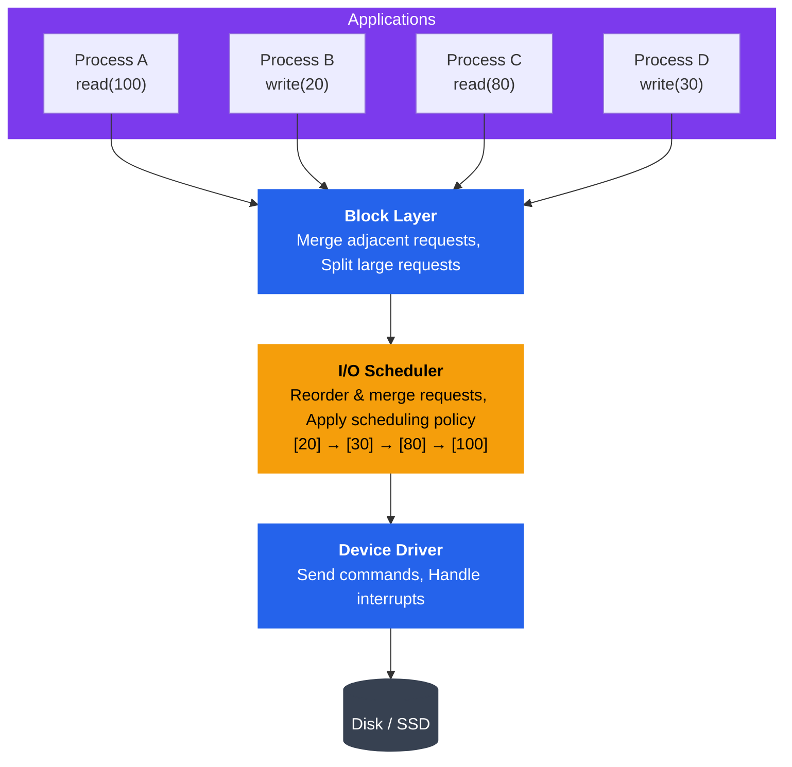
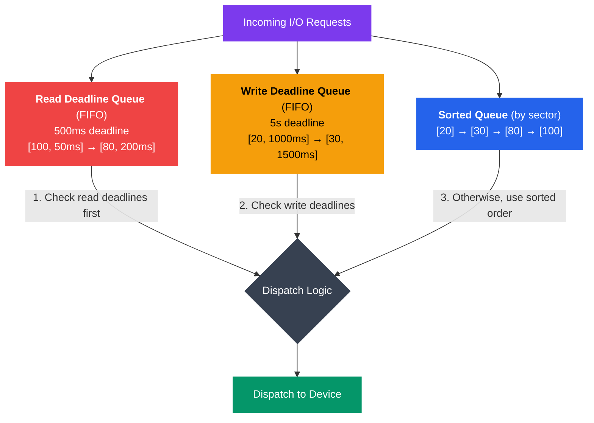

# I/O Scheduling

## What You'll Learn

In this tutorial, you will:

- Understand why I/O scheduling is necessary and how it impacts performance
- Learn about different Linux I/O schedulers (Noop, Deadline, CFQ, BFQ, mq-deadline)
- Explore I/O request queuing and elevator algorithms
- Understand I/O priorities and the `ionice` command
- Learn about I/O throttling and rate limiting mechanisms
- Understand optimization differences between HDDs and SSDs
- Use `iostat` and `iotop` for I/O performance monitoring
- Configure and tune I/O schedulers for different workloads

---

## Introduction

When multiple processes request I/O operations simultaneously, the operating system must decide the order in which to service these requests. I/O scheduling algorithms optimize disk access patterns, reduce seek time (for HDDs), ensure fairness, and prevent starvation. The choice of I/O scheduler can dramatically impact system performance, especially for disk-intensive workloads.

---

## Why I/O Scheduling?

### The Problem: Random Access is Slow

```
Random vs Sequential Disk Access (HDD):
┌────────────────────────────────────────────────────────┐
│                Disk Platter (HDD)                      │
│                                                        │
│    Request Order: A → B → C → D                       │
│                                                        │
│         D                                              │
│           ●                                            │
│                    A                                   │
│                    ●                                   │
│                                                        │
│    B                         C                         │
│    ●                         ●                         │
│                                                        │
│  ← ─ ─ ─ ─ ─ ─ ─ ─ ─ ─ ─ ─ ─ ─ ─ ─ → (Disk radius)   │
│                                                        │
│  Random Access:  A → B → C → D                        │
│  Seek distances: Long → Long → Long  ❌ SLOW          │
│                                                        │
│  With Scheduling: A → C → B → D                       │
│  Seek distances: Short → Short → Short ✅ FAST        │
└────────────────────────────────────────────────────────┘
```

### I/O Scheduling Goals

1. **Minimize Seek Time** (HDD): Reduce disk head movement
2. **Maximize Throughput**: Complete more I/O operations per second
3. **Ensure Fairness**: Prevent process starvation
4. **Reduce Latency**: Minimize wait time for critical requests
5. **Handle Priorities**: Service important requests first
6. **Batch Operations**: Group similar operations for efficiency

### Performance Impact Example

```
Without Scheduling:
Request Queue: [Block 100] → [Block 20] → [Block 80] → [Block 30]
Seek Distance: |100-20| + |20-80| + |80-30| = 80 + 60 + 50 = 190 blocks
Time: ~190ms (assuming 1ms per block seek)

With Scheduling (sorted):
Request Queue: [Block 20] → [Block 30] → [Block 80] → [Block 100]
Seek Distance: |20-30| + |30-80| + |80-100| = 10 + 50 + 20 = 80 blocks
Time: ~80ms (57% faster!)
```

---

## I/O Request Queue

### Request Queue Structure



```
I/O Request Queue Architecture:
┌────────────────────────────────────────────────────────┐
│                  Applications                          │
│  Process A    Process B    Process C    Process D      │
└────┬──────────────┬──────────────┬───────────┬─────────┘
     │              │              │           │
     │ read(100)    │ write(20)    │ read(80)  │ write(30)
     ↓              ↓              ↓           ↓
┌────────────────────────────────────────────────────────┐
│              Block Layer (Generic)                     │
│  • Merge adjacent requests                             │
│  • Split large requests                                │
│  • Request preparation                                 │
└────────────────────────┬───────────────────────────────┘
                         ↓
┌────────────────────────────────────────────────────────┐
│                 I/O Scheduler                          │
│  ┌──────────────────────────────────────────┐         │
│  │  Request Queue (sorted/prioritized)      │         │
│  │  [20] → [30] → [80] → [100]              │         │
│  └──────────────────────────────────────────┘         │
│  • Reorder requests                                    │
│  • Merge requests                                      │
│  • Apply scheduling policy                             │
└────────────────────────┬───────────────────────────────┘
                         ↓
┌────────────────────────────────────────────────────────┐
│              Device Driver                             │
│  • Send commands to hardware                           │
│  • Handle interrupts                                   │
└────────────────────────┬───────────────────────────────┘
                         ↓
                  ┌──────────────┐
                  │   Disk/SSD   │
                  └──────────────┘
```

### Request Merging

The I/O layer attempts to merge adjacent requests:

```
Before Merging:
[Read block 100, 1 block]
[Read block 101, 1 block]
[Read block 102, 1 block]
[Read block 103, 1 block]
Total: 4 I/O operations

After Merging:
[Read block 100, 4 blocks]
Total: 1 I/O operation (4x fewer operations!)
```

---

## Linux I/O Schedulers

### 1. Noop (No Operation) Scheduler

**Algorithm**: Simple FIFO queue with basic merging, minimal reordering.

```
Noop Scheduler:
┌────────────────────────────────────────────────────────┐
│  Incoming: [100] [20] [80] [30] [101] [21]            │
│              ↓    ↓    ↓    ↓     ↓     ↓             │
│  Merge:    [100] [20-21] [80] [30] [101]              │
│              ↓      ↓      ↓    ↓     ↓               │
│  Queue:    [100] [20-21] [80] [30] [101] → Dispatch   │
│            (FIFO order, minimal reordering)            │
└────────────────────────────────────────────────────────┘
```

**Characteristics**:
- Minimal CPU overhead
- No seek optimization
- Best for SSDs and NVMe (no mechanical seek)
- Best for hardware that does its own scheduling (RAID controllers)

**Use Cases**:
- SSDs and NVMe drives
- Virtual machines (hypervisor does scheduling)
- High-performance storage with intelligent controllers

### 2. Deadline Scheduler

**Algorithm**: Sorts requests by sector number but ensures no request waits beyond its deadline.



```
Deadline Scheduler:
┌────────────────────────────────────────────────────────┐
│  Three Queues:                                         │
│                                                        │
│  1. Sorted Queue (by sector):                         │
│     [20] → [30] → [80] → [100]                        │
│                                                        │
│  2. Read Deadline Queue (FIFO, 500ms deadline):       │
│     [100, 50ms] → [80, 200ms]                         │
│                                                        │
│  3. Write Deadline Queue (FIFO, 5s deadline):         │
│     [20, 1000ms] → [30, 1500ms]                       │
│                                                        │
│  Dispatch Logic:                                       │
│  • Check read deadlines first (reads block processes)  │
│  • Check write deadlines second                        │
│  • Otherwise, dispatch from sorted queue               │
└────────────────────────────────────────────────────────┘
```

**Characteristics**:
- Read requests: 500ms default deadline
- Write requests: 5 seconds default deadline
- Prevents starvation while optimizing seeks
- Prioritizes reads over writes (reads typically block processes)

**Use Cases**:
- General-purpose workloads
- Database servers
- Systems requiring bounded latency

**Configuration**:
```bash
# View deadline scheduler settings
cat /sys/block/sda/queue/iosched/read_expire
cat /sys/block/sda/queue/iosched/write_expire

# Tune deadlines (in milliseconds)
echo 300 > /sys/block/sda/queue/iosched/read_expire
echo 3000 > /sys/block/sda/queue/iosched/write_expire
```

### 3. CFQ (Completely Fair Queuing)

**Algorithm**: Allocates I/O bandwidth fairly among processes using time slices.

```
CFQ Scheduler:
┌────────────────────────────────────────────────────────┐
│  Per-Process Queues (Round-Robin with time slices):    │
│                                                        │
│  Process A Queue (10ms slice):                        │
│  [100] → [105] → [110]                                │
│                                                        │
│  Process B Queue (10ms slice):                        │
│  [20] → [25]                                          │
│                                                        │
│  Process C Queue (10ms slice):                        │
│  [80] → [82] → [84] → [86]                            │
│                                                        │
│  Dispatch: A (10ms) → B (10ms) → C (10ms) → A ...    │
│                                                        │
│  Priority Classes:                                     │
│  • RT (Real-time): Highest priority                    │
│  • BE (Best-effort): Normal priority (0-7)            │
│  • IDLE: Lowest priority (only when idle)             │
└────────────────────────────────────────────────────────┘
```

**Characteristics**:
- Fairness per process/thread
- Supports I/O priorities (8 levels)
- Time slice per process (default 10ms)
- Anticipatory logic (waits for more requests from same process)
- Good for desktop and interactive workloads

**Use Cases**:
- Desktop systems
- Multi-user environments
- Workloads where fairness is important

**Configuration**:
```bash
# View CFQ settings
cat /sys/block/sda/queue/iosched/slice_idle
cat /sys/block/sda/queue/iosched/quantum

# Disable slice idle for better throughput (at cost of fairness)
echo 0 > /sys/block/sda/queue/iosched/slice_idle
```

### 4. BFQ (Budget Fair Queuing)

**Algorithm**: Enhanced version of CFQ with better latency guarantees and bandwidth distribution.

```
BFQ Scheduler:
┌────────────────────────────────────────────────────────┐
│  Budget-Based Fair Queuing:                            │
│                                                        │
│  Process A (Budget: 128KB, Used: 64KB):               │
│  [100-116] (16 blocks = 64KB)                         │
│  Remaining budget: 64KB                                │
│                                                        │
│  Process B (Budget: 128KB, Used: 32KB):               │
│  [20-28] (8 blocks = 32KB)                            │
│  Remaining budget: 96KB                                │
│                                                        │
│  Process C (Budget: 128KB, Used: 128KB):              │
│  [80-112] (32 blocks = 128KB)                         │
│  Budget exhausted, requeue for next round              │
│                                                        │
│  • Proportional bandwidth sharing                      │
│  • Low-latency for interactive apps                    │
│  • Weight-based priority (1-1000)                      │
└────────────────────────────────────────────────────────┘
```

**Characteristics**:
- Better fairness than CFQ
- Lower latency for interactive applications
- Bandwidth allocation based on weights
- Automatic detection of interactive processes
- Good for both HDDs and SSDs

**Use Cases**:
- Desktop systems (especially with HDDs)
- Servers with mixed workloads
- Systems requiring low-latency I/O

### 5. mq-deadline (Multi-Queue Deadline)

**Algorithm**: Modern multi-queue version of deadline scheduler for high-performance devices.

```
mq-deadline (Multi-Queue):
┌────────────────────────────────────────────────────────┐
│  Multi-Queue Architecture (one queue per CPU core):    │
│                                                        │
│  CPU 0 Queue:          CPU 1 Queue:                    │
│  [100] → [105]        [20] → [25]                      │
│      ↓                     ↓                           │
│  CPU 2 Queue:          CPU 3 Queue:                    │
│  [80] → [82]          [30] → [35]                      │
│      ↓                     ↓                           │
│  ────────────────────────────────────                  │
│                   ↓                                    │
│         Hardware Queues (per device)                   │
│         [Sorted with deadlines]                        │
│                   ↓                                    │
│              NVMe Device                               │
│         (Parallel dispatch)                            │
└────────────────────────────────────────────────────────┘
```

**Characteristics**:
- Designed for modern multi-queue block devices (NVMe, modern SSDs)
- Per-CPU queues reduce lock contention
- Maintains deadline guarantees
- Scales well on multi-core systems
- Default scheduler for NVMe devices in modern Linux

**Use Cases**:
- NVMe SSDs
- High-performance SATA SSDs
- Multi-core systems with fast storage

---

## I/O Scheduler Comparison

| Scheduler | Algorithm | CPU Overhead | Seek Optimization | Fairness | Best For |
|-----------|-----------|--------------|-------------------|----------|----------|
| **Noop** | FIFO + merge | Very Low | None | Poor | SSDs, VMs, RAID |
| **Deadline** | Sorted + deadlines | Low | Good | Good | General purpose, databases |
| **CFQ** | Per-process queues | Medium | Good | Excellent | Desktops, multi-user |
| **BFQ** | Budget-based | Medium | Good | Excellent | Desktops, mixed workloads |
| **mq-deadline** | Multi-queue + deadlines | Low | Good | Good | NVMe, fast SSDs |

---

## Viewing and Changing I/O Schedulers

### Check Current Scheduler

```bash
# Check scheduler for specific device
cat /sys/block/sda/queue/scheduler

# Output (current scheduler in brackets):
# [mq-deadline] none

# Check for NVMe device
cat /sys/block/nvme0n1/queue/scheduler

# List all block devices with their schedulers
for dev in /sys/block/sd*/queue/scheduler; do
    echo "$dev: $(cat $dev)"
done
```

### Change I/O Scheduler

```bash
# Temporarily change scheduler (until reboot)
echo deadline > /sys/block/sda/queue/scheduler

# Verify change
cat /sys/block/sda/queue/scheduler
# Output: [deadline] none

# Change to noop (for SSD)
echo none > /sys/block/nvme0n1/queue/scheduler

# Permanently change (add to GRUB configuration)
# Edit /etc/default/grub:
# GRUB_CMDLINE_LINUX="elevator=deadline"
# Then update grub:
sudo update-grub
```

### Script to Display All Scheduler Info

```bash
#!/bin/bash
# show_schedulers.sh - Display I/O scheduler information

echo "=== I/O Schedulers for All Block Devices ==="
echo

for device in /sys/block/sd* /sys/block/nvme*; do
    if [ -d "$device" ]; then
        dev_name=$(basename $device)
        scheduler=$(cat $device/queue/scheduler 2>/dev/null)
        rotational=$(cat $device/queue/rotational 2>/dev/null)
        
        if [ "$rotational" = "1" ]; then
            disk_type="HDD"
        else
            disk_type="SSD"
        fi
        
        echo "Device: $dev_name ($disk_type)"
        echo "  Scheduler: $scheduler"
        echo "  Queue depth: $(cat $device/queue/nr_requests 2>/dev/null)"
        echo
    fi
done
```

---

## I/O Priorities

Linux supports I/O priority classes and levels using the `ionice` command.

### Priority Classes

```
I/O Priority Classes:
┌────────────────────────────────────────────────────────┐
│  Class 0: None (inherit from CPU priority)             │
│                                                        │
│  Class 1: Real-Time (RT)                              │
│  ┌──────────────────────────────────────┐             │
│  │ Priority 0 (highest) → Priority 7    │             │
│  └──────────────────────────────────────┘             │
│  • Immediate access to disk                            │
│  • Can starve other processes (use carefully!)        │
│                                                        │
│  Class 2: Best-Effort (BE) - Default                  │
│  ┌──────────────────────────────────────┐             │
│  │ Priority 0 (highest) → Priority 7    │             │
│  └──────────────────────────────────────┘             │
│  • Normal I/O priority                                 │
│  • Fair scheduling                                     │
│                                                        │
│  Class 3: Idle                                        │
│  • Only gets I/O time when system is idle             │
│  • Lowest priority                                     │
│  • Good for background tasks (backup, indexing)       │
└────────────────────────────────────────────────────────┘
```

### Using ionice

```bash
# View I/O priority of a process
ionice -p <pid>

# Example output:
# best-effort: prio 4

# Set I/O priority for a new command
# Real-time class, priority 0 (highest)
ionice -c 1 -n 0 dd if=/dev/sda of=/dev/null bs=1M

# Best-effort class, priority 7 (lowest)
ionice -c 2 -n 7 tar czf backup.tar.gz /home

# Idle class (only run when system is idle)
ionice -c 3 find / -name "*.log" > log_files.txt

# Change priority of running process
ionice -c 2 -n 0 -p 12345

# Run backup with idle priority
ionice -c 3 rsync -av /data /backup
```

### I/O Priority Example Program

```c
// set_io_priority.c - Set I/O priority for a process
#include <stdio.h>
#include <stdlib.h>
#include <unistd.h>
#include <sys/syscall.h>
#include <errno.h>

// I/O priority classes
#define IOPRIO_CLASS_NONE 0
#define IOPRIO_CLASS_RT   1
#define IOPRIO_CLASS_BE   2
#define IOPRIO_CLASS_IDLE 3

// Macros to construct I/O priority value
#define IOPRIO_CLASS_SHIFT 13
#define IOPRIO_PRIO_MASK   ((1UL << IOPRIO_CLASS_SHIFT) - 1)
#define IOPRIO_PRIO_CLASS(mask) ((mask) >> IOPRIO_CLASS_SHIFT)
#define IOPRIO_PRIO_DATA(mask)  ((mask) & IOPRIO_PRIO_MASK)
#define IOPRIO_PRIO_VALUE(class, data) (((class) << IOPRIO_CLASS_SHIFT) | data)

// System calls
static inline int ioprio_set(int which, int who, int ioprio) {
    return syscall(SYS_ioprio_set, which, who, ioprio);
}

static inline int ioprio_get(int which, int who) {
    return syscall(SYS_ioprio_get, which, who);
}

#define IOPRIO_WHO_PROCESS 1

int main() {
    int ioprio, class, prio;
    
    // Get current I/O priority
    ioprio = ioprio_get(IOPRIO_WHO_PROCESS, 0);
    if (ioprio < 0) {
        perror("ioprio_get");
        return 1;
    }
    
    class = IOPRIO_PRIO_CLASS(ioprio);
    prio = IOPRIO_PRIO_DATA(ioprio);
    
    printf("Current I/O priority:\n");
    printf("  Class: %d ", class);
    switch(class) {
        case IOPRIO_CLASS_NONE: printf("(none)\n"); break;
        case IOPRIO_CLASS_RT:   printf("(real-time)\n"); break;
        case IOPRIO_CLASS_BE:   printf("(best-effort)\n"); break;
        case IOPRIO_CLASS_IDLE: printf("(idle)\n"); break;
        default: printf("(unknown)\n");
    }
    printf("  Priority: %d\n", prio);
    
    // Set to idle class for demonstration
    printf("\nSetting I/O priority to idle class...\n");
    ioprio = IOPRIO_PRIO_VALUE(IOPRIO_CLASS_IDLE, 0);
    if (ioprio_set(IOPRIO_WHO_PROCESS, 0, ioprio) < 0) {
        perror("ioprio_set");
        return 1;
    }
    
    printf("I/O priority changed successfully!\n");
    
    // Verify change
    ioprio = ioprio_get(IOPRIO_WHO_PROCESS, 0);
    class = IOPRIO_PRIO_CLASS(ioprio);
    printf("New class: %d (idle)\n", class);
    
    return 0;
}
```

---

## I/O Throttling and Rate Limiting

### cgroups I/O Control

Linux cgroups (control groups) can limit I/O bandwidth per process group.

```bash
# Using cgroups v2 (modern systems)

# Create a cgroup for limited I/O
sudo mkdir /sys/fs/cgroup/io_limited

# Limit read bandwidth to 10 MB/s for device 8:0 (sda)
echo "8:0 rbps=10485760" > /sys/fs/cgroup/io_limited/io.max

# Limit write bandwidth to 5 MB/s
echo "8:0 wbps=5242880" > /sys/fs/cgroup/io_limited/io.max

# Limit IOPS (I/O operations per second)
echo "8:0 riops=1000 wiops=500" > /sys/fs/cgroup/io_limited/io.max

# Move a process to the limited cgroup
echo <pid> > /sys/fs/cgroup/io_limited/cgroup.procs

# Run a command in the limited cgroup
systemd-run --unit=limited_io --slice=io_limited.slice \
    dd if=/dev/zero of=/tmp/test bs=1M count=1000
```

### Example: Rate-Limited Backup Script

```bash
#!/bin/bash
# rate_limited_backup.sh - Backup with I/O rate limiting

BACKUP_SOURCE="/home"
BACKUP_DEST="/backup"
MAX_BANDWIDTH="10m"  # 10 MB/s

# Using ionice and pv (pipe viewer) for rate limiting
ionice -c 3 tar czf - "$BACKUP_SOURCE" | \
    pv -L "$MAX_BANDWIDTH" | \
    cat > "$BACKUP_DEST/backup_$(date +%Y%m%d).tar.gz"

echo "Backup completed with rate limiting"
```

---

## HDD vs SSD Optimization

### HDD (Hard Disk Drive) Considerations

```
HDD Characteristics:
┌────────────────────────────────────────────────────────┐
│         Mechanical Components                          │
│                                                        │
│    Spindle (rotation)                                  │
│    Platters (magnetic)                                 │
│    Read/Write Head (moves physically)                  │
│                                                        │
│  Seek Time: 5-15ms (moving head)                      │
│  Rotational Latency: 4-8ms (average)                  │
│  Transfer Rate: 100-200 MB/s                           │
│                                                        │
│  Optimization Goals:                                   │
│  • Minimize seek distance (sort requests)             │
│  • Maximize sequential access                          │
│  • Read-ahead and prefetching                         │
│  • Write coalescing                                    │
└────────────────────────────────────────────────────────┘
```

**Best Schedulers for HDD**:
- Deadline: Good balance of throughput and latency
- CFQ: Good for multi-user systems
- BFQ: Best for desktop with mixed workloads

### SSD (Solid State Drive) Considerations

```
SSD Characteristics:
┌────────────────────────────────────────────────────────┐
│         Electronic Components (No Moving Parts)        │
│                                                        │
│    NAND Flash Memory                                   │
│    Controller with firmware                            │
│    Internal DRAM cache                                 │
│                                                        │
│  Seek Time: ~0.1ms (essentially instant)              │
│  Random Access: As fast as sequential                  │
│  Transfer Rate: 500-3500 MB/s (SATA to NVMe)          │
│                                                        │
│  Optimization Goals:                                   │
│  • Minimize CPU overhead (sorting not needed)         │
│  • Distribute writes (wear leveling)                   │
│  • Avoid unnecessary seeks (already instant)           │
│  • Leverage internal parallelism                       │
└────────────────────────────────────────────────────────┘
```

**Best Schedulers for SSD**:
- None/Noop: Minimal overhead, let hardware handle it
- mq-deadline: For NVMe, good balance
- Deadline: For SATA SSDs

### Checking if Device is SSD or HDD

```bash
#!/bin/bash
# check_disk_type.sh - Determine if disk is HDD or SSD

for device in /sys/block/sd*; do
    dev_name=$(basename $device)
    rotational=$(cat $device/queue/rotational 2>/dev/null)
    
    echo -n "$dev_name: "
    if [ "$rotational" = "1" ]; then
        echo "HDD (rotational)"
        echo "  Recommended scheduler: deadline, cfq, or bfq"
    else
        echo "SSD (non-rotational)"
        echo "  Recommended scheduler: none or mq-deadline"
    fi
done

# For NVMe
for device in /sys/block/nvme*; do
    dev_name=$(basename $device)
    echo "$dev_name: NVMe SSD"
    echo "  Recommended scheduler: none or mq-deadline"
done
```

---

## I/O Performance Monitoring

### iostat - I/O Statistics

```bash
# Install sysstat package first (contains iostat)
# Ubuntu/Debian: sudo apt install sysstat
# RHEL/CentOS: sudo yum install sysstat

# Basic I/O statistics
iostat

# Output:
# avg-cpu:  %user   %nice %system %iowait  %steal   %idle
#            2.50    0.00    1.25    0.50    0.00   95.75
#
# Device    tps    kB_read/s    kB_wrtn/s    kB_read    kB_wrtn
# sda      5.23       125.34        89.23     512345     365234

# Extended statistics
iostat -x

# Per-device extended stats every 2 seconds
iostat -x 2

# Monitor specific device
iostat -x sda 1

# Key metrics:
# - tps: Transactions per second (I/O operations)
# - kB_read/s, kB_wrtn/s: Read/write throughput
# - await: Average wait time (ms)
# - %util: Device utilization (100% = saturated)
```

### iotop - Top for I/O

```bash
# Install iotop
# Ubuntu/Debian: sudo apt install iotop
# RHEL/CentOS: sudo yum install iotop

# Run iotop (requires root)
sudo iotop

# Show only processes doing I/O
sudo iotop -o

# Batch mode (non-interactive)
sudo iotop -b -n 3

# Show accumulated I/O
sudo iotop -a

# Output example:
# Total DISK READ:   10.52 M/s | Total DISK WRITE:   5.23 M/s
#   TID  PRIO  USER     DISK READ  DISK WRITE  COMMAND
#  1234  be/4  root        8.52 M/s    0.00 B/s tar czf backup.tar.gz
#  5678  be/4  user        2.00 M/s    5.23 M/s rsync -av /src /dest
```

### Complete I/O Monitoring Script

```bash
#!/bin/bash
# io_monitor.sh - Comprehensive I/O monitoring

echo "=== I/O SCHEDULER CONFIGURATION ==="
for dev in /sys/block/sd*; do
    name=$(basename $dev)
    scheduler=$(cat $dev/queue/scheduler 2>/dev/null)
    echo "$name: $scheduler"
done

echo -e "\n=== REAL-TIME I/O STATISTICS ==="
iostat -x 1 3

echo -e "\n=== TOP I/O PROCESSES ==="
timeout 5 sudo iotop -b -n 1 -o | head -20

echo -e "\n=== DISK UTILIZATION ==="
df -h | grep -E '(Filesystem|/dev/sd|/dev/nvme)'

echo -e "\n=== I/O WAIT TIME ==="
vmstat 1 5 | awk 'NR==1 || NR==2 || /[0-9]/'
```

---

## Practical Examples

### Example 1: Benchmark Different Schedulers

```bash
#!/bin/bash
# benchmark_schedulers.sh - Compare I/O scheduler performance

DEVICE="sda"
TEST_FILE="/tmp/testfile"
FILE_SIZE="1G"
SCHEDULERS=("deadline" "cfq" "noop")

echo "=== I/O Scheduler Benchmark ==="
echo "Device: $DEVICE"
echo "Test file: $TEST_FILE ($FILE_SIZE)"
echo

for sched in "${SCHEDULERS[@]}"; do
    echo "Testing scheduler: $sched"
    
    # Change scheduler
    echo $sched > /sys/block/$DEVICE/queue/scheduler
    
    # Drop caches
    sync
    echo 3 > /proc/sys/vm/drop_caches
    
    # Sequential write test
    echo "  Sequential write..."
    write_time=$(dd if=/dev/zero of=$TEST_FILE bs=1M count=1024 2>&1 | \
                 grep -oP '\d+\.\d+ MB/s' | cut -d' ' -f1)
    
    # Sequential read test
    echo "  Sequential read..."
    read_time=$(dd if=$TEST_FILE of=/dev/null bs=1M 2>&1 | \
                grep -oP '\d+\.\d+ MB/s' | cut -d' ' -f1)
    
    echo "  Results: Write=$write_time MB/s, Read=$read_time MB/s"
    echo
    
    # Cleanup
    rm -f $TEST_FILE
done
```

### Example 2: I/O Priority Demonstration

```c
// io_priority_demo.c - Demonstrate I/O priority effects
#include <stdio.h>
#include <stdlib.h>
#include <unistd.h>
#include <fcntl.h>
#include <sys/syscall.h>
#include <sys/time.h>
#include <sys/wait.h>

#define IOPRIO_CLASS_BE 2
#define IOPRIO_CLASS_IDLE 3
#define IOPRIO_CLASS_SHIFT 13
#define IOPRIO_PRIO_VALUE(class, data) (((class) << IOPRIO_CLASS_SHIFT) | data)
#define IOPRIO_WHO_PROCESS 1

static inline int ioprio_set(int which, int who, int ioprio) {
    return syscall(SYS_ioprio_set, which, who, ioprio);
}

double get_time() {
    struct timeval tv;
    gettimeofday(&tv, NULL);
    return tv.tv_sec + tv.tv_usec / 1000000.0;
}

void do_io(const char *label, int io_class, int io_prio) {
    char filename[256];
    sprintf(filename, "/tmp/io_test_%s_%d.dat", label, getpid());
    
    // Set I/O priority
    int ioprio = IOPRIO_PRIO_VALUE(io_class, io_prio);
    if (ioprio_set(IOPRIO_WHO_PROCESS, 0, ioprio) < 0) {
        perror("ioprio_set");
        return;
    }
    
    // Perform I/O operations
    double start = get_time();
    
    int fd = open(filename, O_WRONLY | O_CREAT | O_TRUNC, 0644);
    if (fd < 0) {
        perror("open");
        return;
    }
    
    char buffer[4096];
    for (int i = 0; i < 10000; i++) {
        write(fd, buffer, sizeof(buffer));
    }
    fsync(fd);
    close(fd);
    
    double elapsed = get_time() - start;
    printf("[%s] I/O class=%d prio=%d: %.2f seconds\n", 
           label, io_class, io_prio, elapsed);
    
    unlink(filename);
}

int main() {
    printf("=== I/O Priority Demo ===\n\n");
    
    // Test 1: High priority vs low priority
    printf("Test 1: Best-effort class, different priorities\n");
    
    if (fork() == 0) {
        do_io("high_prio", IOPRIO_CLASS_BE, 0);
        exit(0);
    }
    
    if (fork() == 0) {
        do_io("low_prio", IOPRIO_CLASS_BE, 7);
        exit(0);
    }
    
    wait(NULL);
    wait(NULL);
    
    printf("\n");
    
    // Test 2: Normal vs idle priority
    printf("Test 2: Best-effort vs Idle class\n");
    
    if (fork() == 0) {
        do_io("normal", IOPRIO_CLASS_BE, 4);
        exit(0);
    }
    
    if (fork() == 0) {
        do_io("idle", IOPRIO_CLASS_IDLE, 0);
        exit(0);
    }
    
    wait(NULL);
    wait(NULL);
    
    return 0;
}
```

---

## Exercises

### Beginner

1. **Check Schedulers**: Examine the I/O scheduler for all block devices on your system. Identify which devices are SSDs and which are HDDs based on the `/sys/block/*/queue/rotational` file.

2. **Change Scheduler**: Temporarily change the I/O scheduler for a device and observe the change. Restore the original scheduler afterward.

3. **Monitor I/O**: Use `iostat` to monitor I/O statistics for 30 seconds while copying a large file. Identify the peak throughput and average wait time.

### Intermediate

4. **Priority Experiment**: Run two `dd` commands simultaneously—one with high I/O priority and one with low priority. Compare their completion times.

5. **Scheduler Comparison**: Write a script that benchmarks sequential and random I/O performance under different schedulers. Create graphs or tables showing the results.

6. **Process I/O Monitor**: Write a program that lists the top 10 processes by I/O activity by parsing `/proc/[pid]/io` files.

### Advanced

7. **Custom Scheduler Analysis**: Read the Linux kernel source code for the deadline scheduler. Document how it implements the read and write deadline queues.

8. **I/O Throttling**: Use cgroups to create an I/O-throttled container. Run a disk-intensive application inside it and verify the bandwidth limits are enforced.

9. **Real-World Tuning**: Analyze a production database server's I/O patterns using `iostat`, `iotop`, and `blktrace`. Recommend scheduler settings and tuning parameters to optimize performance.

---

## Key Takeaways

1. **I/O Scheduling is Critical**: Proper scheduling can reduce disk access time by 50% or more, especially on HDDs.

2. **Scheduler Selection**: Choose schedulers based on workload and storage type (None/Noop for SSDs, Deadline/BFQ for HDDs).

3. **Multi-Queue Era**: Modern systems use multi-queue schedulers (mq-deadline) for better scalability on multi-core systems with fast storage.

4. **I/O Priorities**: Use `ionice` to control I/O priority for processes—critical for preventing background tasks from impacting foreground performance.

5. **HDD vs SSD**: HDDs benefit from seek optimization; SSDs don't need it and prefer minimal scheduling overhead.

6. **Monitoring Tools**: `iostat` shows device-level statistics; `iotop` shows per-process I/O activity—both are essential for performance analysis.

7. **Fairness vs Throughput**: CFQ and BFQ prioritize fairness; Deadline and Noop prioritize throughput. Choose based on your needs.

---

## Navigation

- [← Previous: I/O Hardware](./01_io_hardware.md)
- [Back to I/O Systems](./README.md)
- [Next: Device Drivers →](./03_device_drivers.md)

---

## Further Reading

- Linux Block Layer documentation
- "Linux Performance Tuning" by Phil Ezolt
- Kernel source: `block/` directory schedulers
- Red Hat Performance Tuning Guide
