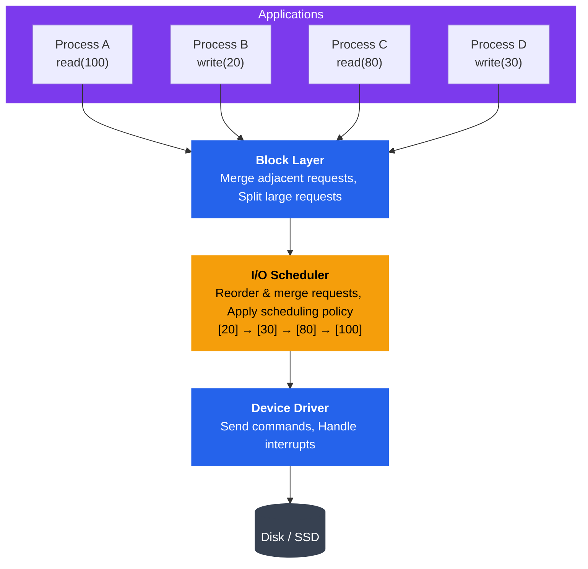
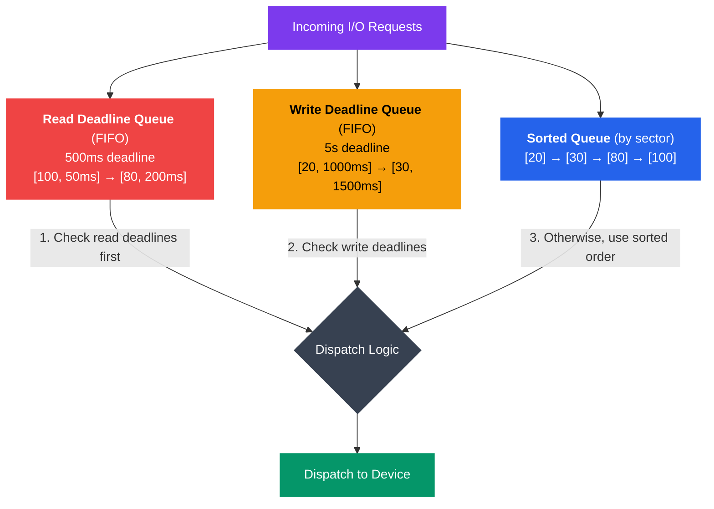

# I/O Scheduling

## Kya Seekhoge Is Tutorial Mein

Is tutorial mein tum ye samjhoge:

- I/O scheduling zaruri kyun hai aur performance pe kaisa impact daalti hai
- Linux ke different I/O schedulers (Noop, Deadline, CFQ, BFQ, mq-deadline)
- I/O request queuing aur elevator algorithms kaise kaam karte hain
- I/O priorities aur `ionice` command ka use
- I/O throttling aur rate limiting mechanisms
- HDD vs SSD ke liye optimization mein farak
- `iostat` aur `iotop` se I/O performance monitor karna
- Alag-alag workloads ke liye I/O scheduler configure aur tune karna

---

## Introduction

Socho tumhare paas ek railway station hai aur ek hi samay pe 4-5 trains platform maangti hain. Station master ko decide karna padta hai kaunsi train pehle jayegi, kaunsi wait karegi — warna chaos ho jayega. Bilkul yahi kaam OS ke andar **I/O scheduler** karta hai.

Jab multiple processes ek saath disk se read/write karna chahte hain, OS ko decide karna padta hai ki kis request ko pehle serve karna hai. I/O scheduling algorithms disk access patterns ko optimize karte hain, seek time kam karte hain (HDD ke liye), fairness ensure karte hain, aur starvation (koi process hamesha wait karta reh jaaye) rokte hain. Scheduler ka choice system performance pe dramatically impact daal sakta hai — especially disk-heavy workloads mein jaise database servers, backup jobs, ya video streaming.

Node.js developer hone ke naate tumne shayad kabhi socha na ho ki `fs.readFile()` call karne ke peeche kitna kuch chal raha hai — par disk tak pahunchte pahunchte OS ye sab decide kar chuka hota hai.

---

## I/O Scheduling Kyun Chahiye?

### Problem: Random Access Slow Hota Hai

Socho tum Swiggy delivery boy ho aur tumhe 4 alag-alag locations pe order deliver karne hain — A, B, C, D. Agar tum jis order mein orders aaye usi order mein jaoge (A → B → C → D), toh ho sakta hai tumhe pura shehar cross karna pade baar baar. Lekin agar tum route ko smartly plan karo (jaise Zomato ka delivery algorithm karta hai — nearby orders ek saath cluster karke), toh total distance bahut kam ho jayega.

HDD mein bhi yahi hota hai — disk head ek physical arm hai jo ghoom ghoom ke data padhta hai. Agar requests random order mein aayen (Block 100, phir 20, phir 80, phir 30), toh head ko baar baar lamba safar tay karna padta hai. Lekin agar hum unhe sort kar den (20 → 30 → 80 → 100), toh head ek hi direction mein smoothly move karta hai.

```
Random vs Sequential Disk Access (HDD):
┌────────────────────────────────────────────────────────┐
│                Disk Platter (HDD)                      │
│                                                        │
│    Request Order: A → B → C → D                       │
│                                                        │
│         D                                              │
│           ●                                            │
│                    A                                   │
│                    ●                                   │
│                                                        │
│    B                         C                         │
│    ●                         ●                         │
│                                                        │
│  ← ─ ─ ─ ─ ─ ─ ─ ─ ─ ─ ─ ─ ─ ─ ─ ─ → (Disk radius)   │
│                                                        │
│  Random Access:  A → B → C → D                        │
│  Seek distances: Long → Long → Long  ❌ SLOW          │
│                                                        │
│  With Scheduling: A → C → B → D                       │
│  Seek distances: Short → Short → Short ✅ FAST        │
└────────────────────────────────────────────────────────┘
```

> [!info]
> Ye problem sirf HDD mein hai. SSD mein koi mechanical head nahi hota (flash memory hai), toh random access ~instant hai. Isliye SSD ke liye scheduling ka logic bilkul alag hota hai — baad mein detail mein dekhenge.

### I/O Scheduling Ke Goals

1. **Seek Time Minimize Karna** (HDD): Disk head ka movement kam karna
2. **Throughput Maximize Karna**: Per second zyada I/O operations complete karna
3. **Fairness Ensure Karna**: Koi bhi process hamesha starve na ho (jaise ek hi customer ka order baar baar delay na ho)
4. **Latency Kam Karna**: Critical requests ke liye wait time minimum rakhna
5. **Priorities Handle Karna**: Important requests ko pehle serve karna (jaise CRED ka premium user support pehle handle hota hai)
6. **Batch Operations**: Similar operations ko group karke efficiency badhana

### Performance Impact Ka Example

Ye numbers dekho — kitna real farak padta hai:

```
Without Scheduling:
Request Queue: [Block 100] → [Block 20] → [Block 80] → [Block 30]
Seek Distance: |100-20| + |20-80| + |80-30| = 80 + 60 + 50 = 190 blocks
Time: ~190ms (assuming 1ms per block seek)

With Scheduling (sorted):
Request Queue: [Block 20] → [Block 30] → [Block 80] → [Block 100]
Seek Distance: |20-30| + |30-80| + |80-100| = 10 + 50 + 20 = 80 blocks
Time: ~80ms (57% faster!)
```

Bas requests ko sort karne se 57% faster ho gaya — bina hardware badle! Yahi power hai ek achhe scheduling algorithm ki.

---

## I/O Request Queue

### Request Queue Ka Structure

Jab tumhara Node.js app `fs.write()` ya database `INSERT` query chalata hai, wo request seedha disk tak nahi pahunchti. Beech mein kai layers hain — bilkul jaise ek Zomato order restaurant tak pahunchne se pehle app → order management system → kitchen dispatch → cook tak jaata hai.



```
I/O Request Queue Architecture:
┌────────────────────────────────────────────────────────┐
│                  Applications                          │
│  Process A    Process B    Process C    Process D      │
└────┬──────────────┬──────────────┬───────────┬─────────┘
     │              │              │           │
     │ read(100)    │ write(20)    │ read(80)  │ write(30)
     ↓              ↓              ↓           ↓
┌────────────────────────────────────────────────────────┐
│              Block Layer (Generic)                     │
│  • Merge adjacent requests                             │
│  • Split large requests                                │
│  • Request preparation                                 │
└────────────────────────┬───────────────────────────────┘
                         ↓
┌────────────────────────────────────────────────────────┐
│                 I/O Scheduler                          │
│  ┌──────────────────────────────────────────┐         │
│  │  Request Queue (sorted/prioritized)      │         │
│  │  [20] → [30] → [80] → [100]              │         │
│  └──────────────────────────────────────────┘         │
│  • Reorder requests                                    │
│  • Merge requests                                      │
│  • Apply scheduling policy                             │
└────────────────────────┬───────────────────────────────┘
                         ↓
┌────────────────────────────────────────────────────────┐
│              Device Driver                             │
│  • Send commands to hardware                           │
│  • Handle interrupts                                   │
└────────────────────────┬───────────────────────────────┘
                         ↓
                  ┌──────────────┐
                  │   Disk/SSD   │
                  └──────────────┘
```

Har layer ka apna kaam hai:
- **Block Layer**: Requests ko generic tarike se prepare karta hai, adjacent requests merge karta hai, bade requests ko chota karta hai
- **I/O Scheduler**: Yahi asli "traffic police" hai — requests ko reorder aur merge karta hai policy ke hisab se
- **Device Driver**: Actual hardware commands bhejta hai aur interrupts handle karta hai (jab disk kehta hai "mera kaam ho gaya")

### Request Merging

Ek smart trick jo I/O layer use karta hai — adjacent requests ko ek mein merge kar dena. Socho agar 4 log ek hi building ke alag-alag floors pe Swiggy se order kar rahe hain, toh delivery boy ek hi trip mein sabko deliver kar sakta hai instead of 4 alag trips karne ke.

```
Before Merging:
[Read block 100, 1 block]
[Read block 101, 1 block]
[Read block 102, 1 block]
[Read block 103, 1 block]
Total: 4 I/O operations

After Merging:
[Read block 100, 4 blocks]
Total: 1 I/O operation (4x fewer operations!)
```

> [!tip]
> Ye merging ka logic hai ki agar requests contiguous (lagatar) blocks maang rahe hain, toh unhe ek hi bade request mein convert kar do. Ye disk seeks aur CPU overhead dono kam karta hai.

---

## Linux I/O Schedulers

Ab main course pe aate hain — Linux mein kaunse schedulers available hain aur kab kaunsa use karna chahiye. Har scheduler ek different "philosophy" follow karta hai, bilkul jaise alag alag food delivery apps ke alag alag dispatch algorithms hote hain.

### 1. Noop (No Operation) Scheduler

**Algorithm**: Simple FIFO queue with basic merging, minimal reordering.

Ye sabse simple scheduler hai — bas ek line lagao aur jo pehle aaya usko pehle serve karo (adjacent requests merge karke). Koi fancy sorting nahi, koi seek-optimization nahi.

```
Noop Scheduler:
┌────────────────────────────────────────────────────────┐
│  Incoming: [100] [20] [80] [30] [101] [21]            │
│              ↓    ↓    ↓    ↓     ↓     ↓             │
│  Merge:    [100] [20-21] [80] [30] [101]              │
│              ↓      ↓      ↓    ↓     ↓               │
│  Queue:    [100] [20-21] [80] [30] [101] → Dispatch   │
│            (FIFO order, minimal reordering)            │
└────────────────────────────────────────────────────────┘
```

**Characteristics**:
- Minimal CPU overhead
- No seek optimization
- SSD aur NVMe ke liye best (koi mechanical seek nahi hoti)
- Aise hardware ke liye best jo khud apna scheduling karta hai (RAID controllers)

**Use Cases**:
- SSDs aur NVMe drives
- Virtual machines (hypervisor pehle se scheduling kar leta hai, double-scheduling ka koi faayda nahi)
- High-performance storage with intelligent controllers

Socho — agar dukaan mein saaman already sorted rakha hai (SSD ki tarah instant access), toh customer ko queue mein "smartly reorder" karne ki zarurat kya hai? Bas seedha serve karo. Noop yahi karta hai.

### 2. Deadline Scheduler

**Algorithm**: Sorts requests by sector number but ensures no request waits beyond its deadline.

Deadline scheduler ek smart balance banata hai — seek optimization ke liye requests ko sector number se sort karta hai (jaise elevator algorithm), lekin saath hi guarantee deta hai ki koi bhi request infinite time tak wait nahi karegi. Socho IRCTC ka Tatkal booking system — agar sab requests ko sirf "efficiency" ke hisab se process karte, toh kuch requests hamesha peeche reh jaate. Deadline scheduler ek deadline lagata hai taaki koi bhi request "bhookha" na reh jaaye.



```
Deadline Scheduler:
┌────────────────────────────────────────────────────────┐
│  Three Queues:                                         │
│                                                        │
│  1. Sorted Queue (by sector):                         │
│     [20] → [30] → [80] → [100]                        │
│                                                        │
│  2. Read Deadline Queue (FIFO, 500ms deadline):       │
│     [100, 50ms] → [80, 200ms]                         │
│                                                        │
│  3. Write Deadline Queue (FIFO, 5s deadline):         │
│     [20, 1000ms] → [30, 1500ms]                       │
│                                                        │
│  Dispatch Logic:                                       │
│  • Check read deadlines first (reads block processes)  │
│  • Check write deadlines second                        │
│  • Otherwise, dispatch from sorted queue               │
└────────────────────────────────────────────────────────┘
```

Yaha teen queues chal rahi hain ek saath:
1. **Sorted Queue**: Sector-number ke hisaab se sort ki hui — seek optimization ke liye
2. **Read Deadline Queue**: Reads ka apna FIFO, jisme default 500ms ka deadline hai
3. **Write Deadline Queue**: Writes ka FIFO, jisme default 5 second ka deadline hai

Reads ko writes se zyada priority milti hai kyunki jab tum `read()` call karte ho, tumhara process **block** ho jaata hai jab tak data na aaye — user ko turant response chahiye. Lekin `write()` mostly OS cache mein chala jaata hai aur background mein disk pe flush hota hai, toh usse thoda wait karwa sakte hain.

**Characteristics**:
- Read requests: 500ms default deadline
- Write requests: 5 seconds default deadline
- Starvation rokta hai jabki seeks bhi optimize karta hai
- Reads ko writes se priority deta hai (reads typically processes ko block karte hain)

**Use Cases**:
- General-purpose workloads
- Database servers
- Systems requiring bounded latency

**Configuration**:
```bash
# View deadline scheduler settings
cat /sys/block/sda/queue/iosched/read_expire
cat /sys/block/sda/queue/iosched/write_expire

# Tune deadlines (in milliseconds)
echo 300 > /sys/block/sda/queue/iosched/read_expire
echo 3000 > /sys/block/sda/queue/iosched/write_expire
```

### 3. CFQ (Completely Fair Queuing)

**Algorithm**: Allocates I/O bandwidth fairly among processes using time slices.

Ye scheduler apne naam ke hisaab se hi kaam karta hai — "completely fair". Har process ko apni khud ki queue milti hi hai, aur round-robin fashion mein sabko turn-by-turn time slice diya jaata hai. Socho ek shared WiFi router jisme har device ko fair bandwidth milta hai, koi ek device sab bandwidth hog nahi kar sakta.

```
CFQ Scheduler:
┌────────────────────────────────────────────────────────┐
│  Per-Process Queues (Round-Robin with time slices):    │
│                                                        │
│  Process A Queue (10ms slice):                        │
│  [100] → [105] → [110]                                │
│                                                        │
│  Process B Queue (10ms slice):                        │
│  [20] → [25]                                          │
│                                                        │
│  Process C Queue (10ms slice):                        │
│  [80] → [82] → [84] → [86]                            │
│                                                        │
│  Dispatch: A (10ms) → B (10ms) → C (10ms) → A ...    │
│                                                        │
│  Priority Classes:                                     │
│  • RT (Real-time): Highest priority                    │
│  • BE (Best-effort): Normal priority (0-7)            │
│  • IDLE: Lowest priority (only when idle)             │
└────────────────────────────────────────────────────────┘
```

**Characteristics**:
- Per process/thread fairness
- I/O priorities support karta hai (8 levels)
- Har process ke liye time slice (default 10ms)
- Anticipatory logic (usi process se aur requests aane ka thoda wait karta hai — is umeed mein ki agla request bhi nearby sector ka hoga)
- Desktop aur interactive workloads ke liye achha

**Use Cases**:
- Desktop systems
- Multi-user environments
- Workloads jaha fairness important ho

**Configuration**:
```bash
# View CFQ settings
cat /sys/block/sda/queue/iosched/slice_idle
cat /sys/block/sda/queue/iosched/quantum

# Disable slice idle for better throughput (at cost of fairness)
echo 0 > /sys/block/sda/queue/iosched/slice_idle
```

> [!warning]
> CFQ ab purane kernels mein hi milta hai — modern Linux distros (kernel 5.x+) mein CFQ ko deprecate kar diya gaya hai aur BFQ/mq-deadline use hote hain. Lekin concept samajhna zaruri hai kyunki interview mein aur legacy systems mein ye poocha jaata hai.

### 4. BFQ (Budget Fair Queuing)

**Algorithm**: Enhanced version of CFQ with better latency guarantees and bandwidth distribution.

BFQ, CFQ ka upgraded version hai. Time-slice dene ke bajaye ye har process ko ek "budget" (data ki matra, jaise KB) deta hai. Jab budget khatam, process ki turn khatam — chahe time slice bacha ho. Ye zyada fair aur predictable hai, especially jab requests ka size bahut alag-alag ho.

Socho tumhe Big Bazaar mein billing counter pe "10 items ya usse kam" wali line milti hai — time-based limit ki jagah quantity-based limit. BFQ isi tarah har process ko "itna data process karo, phir agle ki baari" wala rule follow karta hai.

```
BFQ Scheduler:
┌────────────────────────────────────────────────────────┐
│  Budget-Based Fair Queuing:                            │
│                                                        │
│  Process A (Budget: 128KB, Used: 64KB):               │
│  [100-116] (16 blocks = 64KB)                         │
│  Remaining budget: 64KB                                │
│                                                        │
│  Process B (Budget: 128KB, Used: 32KB):               │
│  [20-28] (8 blocks = 32KB)                            │
│  Remaining budget: 96KB                                │
│                                                        │
│  Process C (Budget: 128KB, Used: 128KB):              │
│  [80-112] (32 blocks = 128KB)                         │
│  Budget exhausted, requeue for next round              │
│                                                        │
│  • Proportional bandwidth sharing                      │
│  • Low-latency for interactive apps                    │
│  • Weight-based priority (1-1000)                      │
└────────────────────────────────────────────────────────┘
```

**Characteristics**:
- CFQ se behtar fairness
- Interactive applications ke liye kam latency
- Weight-based bandwidth allocation
- Interactive processes ko automatically detect kar leta hai
- HDD aur SSD dono ke liye achha

**Use Cases**:
- Desktop systems (especially HDD ke saath)
- Mixed workloads wale servers
- Low-latency I/O chahiye wale systems

> [!tip]
> BFQ aaj kal Linux desktop distros (jaise Fedora, Ubuntu newer versions) mein default choice hai HDD ke liye kyunki ye responsive feel deta hai — jab background mein bada file copy chal raha ho tab bhi UI smooth rehta hai.

### 5. mq-deadline (Multi-Queue Deadline)

**Algorithm**: Modern multi-queue version of deadline scheduler for high-performance devices.

Modern NVMe SSDs itni fast hain ki ek hi queue (single lock ke saath) bottleneck ban jaati hai. Isliye mq-deadline har CPU core ke liye alag queue banata hai — parallel processing jaisa. Socho ek bade railway station pe ek hi ticket counter ki jagah 4 alag counters khol dena, taaki line kam ho aur sab parallel mein serve ho.

```
mq-deadline (Multi-Queue):
┌────────────────────────────────────────────────────────┐
│  Multi-Queue Architecture (one queue per CPU core):    │
│                                                        │
│  CPU 0 Queue:          CPU 1 Queue:                    │
│  [100] → [105]        [20] → [25]                      │
│      ↓                     ↓                           │
│  CPU 2 Queue:          CPU 3 Queue:                    │
│  [80] → [82]          [30] → [35]                      │
│      ↓                     ↓                           │
│  ────────────────────────────────────                  │
│                   ↓                                    │
│         Hardware Queues (per device)                   │
│         [Sorted with deadlines]                        │
│                   ↓                                    │
│              NVMe Device                               │
│         (Parallel dispatch)                            │
└────────────────────────────────────────────────────────┘
```

**Characteristics**:
- Modern multi-queue block devices (NVMe, modern SSDs) ke liye design kiya gaya
- Per-CPU queues lock contention kam karte hain
- Deadline guarantees maintain karta hai
- Multi-core systems pe achhi tarah scale karta hai
- Modern Linux mein NVMe devices ka default scheduler

**Use Cases**:
- NVMe SSDs
- High-performance SATA SSDs
- Fast storage wale multi-core systems

---

## I/O Scheduler Comparison

Ek quick reference table — kaunsa scheduler kab choose karna hai:

| Scheduler | Algorithm | CPU Overhead | Seek Optimization | Fairness | Best For |
|-----------|-----------|--------------|-------------------|----------|----------|
| **Noop** | FIFO + merge | Very Low | None | Poor | SSDs, VMs, RAID |
| **Deadline** | Sorted + deadlines | Low | Good | Good | General purpose, databases |
| **CFQ** | Per-process queues | Medium | Good | Excellent | Desktops, multi-user |
| **BFQ** | Budget-based | Medium | Good | Excellent | Desktops, mixed workloads |
| **mq-deadline** | Multi-queue + deadlines | Low | Good | Good | NVMe, fast SSDs |

---

## I/O Schedulers Ko Dekhna Aur Change Karna

### Current Scheduler Check Karo

Linux mein har block device ka apna scheduler file hota hai `/sys` filesystem mein — bilkul ek settings file jaisa jo tum directly padh/likh sakte ho.

```bash
# Check scheduler for specific device
cat /sys/block/sda/queue/scheduler

# Output (current scheduler in brackets):
# [mq-deadline] none

# Check for NVMe device
cat /sys/block/nvme0n1/queue/scheduler

# List all block devices with their schedulers
for dev in /sys/block/sd*/queue/scheduler; do
    echo "$dev: $(cat $dev)"
done
```

Jo scheduler `[brackets]` mein dikhta hai, wahi currently active hai.

### I/O Scheduler Change Karo

```bash
# Temporarily change scheduler (until reboot)
echo deadline > /sys/block/sda/queue/scheduler

# Verify change
cat /sys/block/sda/queue/scheduler
# Output: [deadline] none

# Change to noop (for SSD)
echo none > /sys/block/nvme0n1/queue/scheduler

# Permanently change (add to GRUB configuration)
# Edit /etc/default/grub:
# GRUB_CMDLINE_LINUX="elevator=deadline"
# Then update grub:
sudo update-grub
```

> [!warning]
> `echo` se scheduler change karna sirf reboot tak rehta hai. Permanent karna hai toh GRUB config mein daalna padega, warna reboot ke baad wapas default pe chala jaayega.

### Script: Sab Devices Ki Scheduler Info Dikhao

```bash
#!/bin/bash
# show_schedulers.sh - Display I/O scheduler information

echo "=== I/O Schedulers for All Block Devices ==="
echo

for device in /sys/block/sd* /sys/block/nvme*; do
    if [ -d "$device" ]; then
        dev_name=$(basename $device)
        scheduler=$(cat $device/queue/scheduler 2>/dev/null)
        rotational=$(cat $device/queue/rotational 2>/dev/null)
        
        if [ "$rotational" = "1" ]; then
            disk_type="HDD"
        else
            disk_type="SSD"
        fi
        
        echo "Device: $dev_name ($disk_type)"
        echo "  Scheduler: $scheduler"
        echo "  Queue depth: $(cat $device/queue/nr_requests 2>/dev/null)"
        echo
    fi
done
```

---

## I/O Priorities

Ab baat karte hain **priorities** ki. Kabhi socha hai ki jab tum ek movie download kar rahe ho aur saath mein background mein `apt update` chal raha ho, toh download slow kyun nahi hota? Ye `ionice` jaisi cheezon ki wajah se possible hai.

Linux `ionice` command ke through I/O priority classes aur levels support karta hai.

### Priority Classes

```
I/O Priority Classes:
┌────────────────────────────────────────────────────────┐
│  Class 0: None (inherit from CPU priority)             │
│                                                        │
│  Class 1: Real-Time (RT)                              │
│  ┌──────────────────────────────────────┐             │
│  │ Priority 0 (highest) → Priority 7    │             │
│  └──────────────────────────────────────┘             │
│  • Immediate access to disk                            │
│  • Can starve other processes (use carefully!)        │
│                                                        │
│  Class 2: Best-Effort (BE) - Default                  │
│  ┌──────────────────────────────────────┐             │
│  │ Priority 0 (highest) → Priority 7    │             │
│  └──────────────────────────────────────┘             │
│  • Normal I/O priority                                 │
│  • Fair scheduling                                     │
│                                                        │
│  Class 3: Idle                                        │
│  • Only gets I/O time when system is idle             │
│  • Lowest priority                                     │
│  • Good for background tasks (backup, indexing)       │
└────────────────────────────────────────────────────────┘
```

Isko samajhne ke liye Zomato ka analogy lete hain:
- **Real-Time (RT)**: "Emergency delivery" jaisa — jo bhi ho, isko turant deliver karo, chahe baaki sab orders wait karen. Very risky agar overuse kiya toh baaki sab orders "starve" ho jaayenge.
- **Best-Effort (BE)**: Default class — normal order jaisa, apni turn pe fair tarike se serve hota hai. 99% processes yahi use karte hain.
- **Idle**: "Jab bhi delivery boy free ho tab deliver karna" — sabse low priority. Backup scripts, indexing jobs, virus scans jaise background tasks ke liye perfect hai jo user ko disturb nahi karna chahte.

### ionice Ka Use

```bash
# View I/O priority of a process
ionice -p <pid>

# Example output:
# best-effort: prio 4

# Set I/O priority for a new command
# Real-time class, priority 0 (highest)
ionice -c 1 -n 0 dd if=/dev/sda of=/dev/null bs=1M

# Best-effort class, priority 7 (lowest)
ionice -c 2 -n 7 tar czf backup.tar.gz /home

# Idle class (only run when system is idle)
ionice -c 3 find / -name "*.log" > log_files.txt

# Change priority of running process
ionice -c 2 -n 0 -p 12345

# Run backup with idle priority
ionice -c 3 rsync -av /data /backup
```

> [!tip]
> Production servers mein backup scripts ko hamesha `ionice -c 3` (idle class) ke saath chalao. Isse backup, live traffic (jaise database queries) ko slow nahi karega. Ye ek bahut common real-world mistake hai jo naye engineers karte hain — raat ko backup script chala dete hain bina ionice ke, aur production database slow ho jaata hai.

### I/O Priority Set Karne Ka Example Program

Ye C program dikhata hai ki kaise programmatically apne process ka I/O priority set kiya jaata hai, `ioprio_set` syscall use karke:

```c
// set_io_priority.c - Set I/O priority for a process
#include <stdio.h>
#include <stdlib.h>
#include <unistd.h>
#include <sys/syscall.h>
#include <errno.h>

// I/O priority classes
#define IOPRIO_CLASS_NONE 0
#define IOPRIO_CLASS_RT   1
#define IOPRIO_CLASS_BE   2
#define IOPRIO_CLASS_IDLE 3

// Macros to construct I/O priority value
#define IOPRIO_CLASS_SHIFT 13
#define IOPRIO_PRIO_MASK   ((1UL << IOPRIO_CLASS_SHIFT) - 1)
#define IOPRIO_PRIO_CLASS(mask) ((mask) >> IOPRIO_CLASS_SHIFT)
#define IOPRIO_PRIO_DATA(mask)  ((mask) & IOPRIO_PRIO_MASK)
#define IOPRIO_PRIO_VALUE(class, data) (((class) << IOPRIO_CLASS_SHIFT) | data)

// System calls
static inline int ioprio_set(int which, int who, int ioprio) {
    return syscall(SYS_ioprio_set, which, who, ioprio);
}

static inline int ioprio_get(int which, int who) {
    return syscall(SYS_ioprio_get, which, who);
}

#define IOPRIO_WHO_PROCESS 1

int main() {
    int ioprio, class, prio;
    
    // Get current I/O priority
    ioprio = ioprio_get(IOPRIO_WHO_PROCESS, 0);
    if (ioprio < 0) {
        perror("ioprio_get");
        return 1;
    }
    
    class = IOPRIO_PRIO_CLASS(ioprio);
    prio = IOPRIO_PRIO_DATA(ioprio);
    
    printf("Current I/O priority:\n");
    printf("  Class: %d ", class);
    switch(class) {
        case IOPRIO_CLASS_NONE: printf("(none)\n"); break;
        case IOPRIO_CLASS_RT:   printf("(real-time)\n"); break;
        case IOPRIO_CLASS_BE:   printf("(best-effort)\n"); break;
        case IOPRIO_CLASS_IDLE: printf("(idle)\n"); break;
        default: printf("(unknown)\n");
    }
    printf("  Priority: %d\n", prio);
    
    // Set to idle class for demonstration
    printf("\nSetting I/O priority to idle class...\n");
    ioprio = IOPRIO_PRIO_VALUE(IOPRIO_CLASS_IDLE, 0);
    if (ioprio_set(IOPRIO_WHO_PROCESS, 0, ioprio) < 0) {
        perror("ioprio_set");
        return 1;
    }
    
    printf("I/O priority changed successfully!\n");
    
    // Verify change
    ioprio = ioprio_get(IOPRIO_WHO_PROCESS, 0);
    class = IOPRIO_PRIO_CLASS(ioprio);
    printf("New class: %d (idle)\n", class);
    
    return 0;
}
```

---

## I/O Throttling Aur Rate Limiting

### cgroups I/O Control

Kabhi socha hai ki cloud providers (AWS, GCP) kaise guarantee dete hain ki tumhara VM "itna hi" disk bandwidth use karega, chahe baaki tenants kuch bhi karen? Wo **cgroups** (control groups) use karte hain. Linux cgroups process groups ke liye I/O bandwidth limit kar sakte hain.

Socho ek building mein har flat ke liye water meter lagana — har flat ki apni limit hai, koi ek flat pura building ka pani use nahi kar sakta.

```bash
# Using cgroups v2 (modern systems)

# Create a cgroup for limited I/O
sudo mkdir /sys/fs/cgroup/io_limited

# Limit read bandwidth to 10 MB/s for device 8:0 (sda)
echo "8:0 rbps=10485760" > /sys/fs/cgroup/io_limited/io.max

# Limit write bandwidth to 5 MB/s
echo "8:0 wbps=5242880" > /sys/fs/cgroup/io_limited/io.max

# Limit IOPS (I/O operations per second)
echo "8:0 riops=1000 wiops=500" > /sys/fs/cgroup/io_limited/io.max

# Move a process to the limited cgroup
echo <pid> > /sys/fs/cgroup/io_limited/cgroup.procs

# Run a command in the limited cgroup
systemd-run --unit=limited_io --slice=io_limited.slice \
    dd if=/dev/zero of=/tmp/test bs=1M count=1000
```

> [!info]
> Docker aur Kubernetes internally cgroups hi use karte hain resource limits (CPU, memory, I/O) enforce karne ke liye. Jab tum Kubernetes mein `resources.limits` set karte ho, background mein cgroups isi tarah kaam karte hain.

### Example: Rate-Limited Backup Script

```bash
#!/bin/bash
# rate_limited_backup.sh - Backup with I/O rate limiting

BACKUP_SOURCE="/home"
BACKUP_DEST="/backup"
MAX_BANDWIDTH="10m"  # 10 MB/s

# Using ionice and pv (pipe viewer) for rate limiting
ionice -c 3 tar czf - "$BACKUP_SOURCE" | \
    pv -L "$MAX_BANDWIDTH" | \
    cat > "$BACKUP_DEST/backup_$(date +%Y%m%d).tar.gz"

echo "Backup completed with rate limiting"
```

Yaha `ionice` (idle priority) aur `pv -L` (bandwidth cap) dono ka combo use ho raha hai — production servers mein backup jobs isi tarah likhi jaati hain taaki live traffic disturb na ho.

---

## HDD vs SSD Optimization

Ye section samajhna bahut zaruri hai kyunki modern deployment mein tumhe pata hona chahiye ki tumhara server SSD pe hai ya HDD pe, aur uske hisaab se scheduler choose karna chahiye.

### HDD (Hard Disk Drive) Ki Baatein

HDD mein physical moving parts hote hain — bilkul purane record player ki tarah jisme ek needle (head) ghoomti hui disk (platter) pe move karti hai data padhne ke liye.

```
HDD Characteristics:
┌────────────────────────────────────────────────────────┐
│         Mechanical Components                          │
│                                                        │
│    Spindle (rotation)                                  │
│    Platters (magnetic)                                 │
│    Read/Write Head (moves physically)                  │
│                                                        │
│  Seek Time: 5-15ms (moving head)                      │
│  Rotational Latency: 4-8ms (average)                  │
│  Transfer Rate: 100-200 MB/s                           │
│                                                        │
│  Optimization Goals:                                   │
│  • Minimize seek distance (sort requests)             │
│  • Maximize sequential access                          │
│  • Read-ahead and prefetching                         │
│  • Write coalescing                                    │
└────────────────────────────────────────────────────────┘
```

Kyunki head physically move karta hai, HDD ka seek time (5-15ms) SSD ke muqable bahut zyada hai. Isliye HDD ke liye scheduling ka poora focus hai — **requests ko is tarah arrange karo ki head ko kam se kam movement karna pade**.

**HDD Ke Liye Best Schedulers**:
- Deadline: Throughput aur latency ka achha balance
- CFQ: Multi-user systems ke liye achha
- BFQ: Mixed workloads wale desktop ke liye best

### SSD (Solid State Drive) Ki Baatein

SSD mein koi moving part nahi hota — sab kuch electronic hai, flash memory chips ke through. Isliye "seek time" ka concept practically khatam ho jaata hai.

```
SSD Characteristics:
┌────────────────────────────────────────────────────────┐
│         Electronic Components (No Moving Parts)        │
│                                                        │
│    NAND Flash Memory                                   │
│    Controller with firmware                            │
│    Internal DRAM cache                                 │
│                                                        │
│  Seek Time: ~0.1ms (essentially instant)              │
│  Random Access: As fast as sequential                  │
│  Transfer Rate: 500-3500 MB/s (SATA to NVMe)          │
│                                                        │
│  Optimization Goals:                                   │
│  • Minimize CPU overhead (sorting not needed)         │
│  • Distribute writes (wear leveling)                   │
│  • Avoid unnecessary seeks (already instant)           │
│  • Leverage internal parallelism                       │
└────────────────────────────────────────────────────────┘
```

SSD ke liye sorting/reordering karna bilkul waste of CPU cycles hai — jab access already instant hai, toh us pe extra CPU laga ke sort karna ulta overhead badhata hai. Isiliye SSD ke liye **minimal scheduling** best strategy hai.

**SSD Ke Liye Best Schedulers**:
- None/Noop: Minimum overhead, hardware ko khud handle karne do
- mq-deadline: NVMe ke liye, achha balance
- Deadline: SATA SSDs ke liye

> [!warning]
> Ek common mistake: log SSD pe bhi CFQ ya BFQ jaisa heavy scheduler chala dete hain jo purani HDD-optimization ki soch se bana hai. Ye ulta CPU overhead badha ke SSD ki speed ko waste karta hai. Hamesha `rotational` file check karo pehle.

### Check Karo Device SSD Hai Ya HDD

```bash
#!/bin/bash
# check_disk_type.sh - Determine if disk is HDD or SSD

for device in /sys/block/sd*; do
    dev_name=$(basename $device)
    rotational=$(cat $device/queue/rotational 2>/dev/null)
    
    echo -n "$dev_name: "
    if [ "$rotational" = "1" ]; then
        echo "HDD (rotational)"
        echo "  Recommended scheduler: deadline, cfq, or bfq"
    else
        echo "SSD (non-rotational)"
        echo "  Recommended scheduler: none or mq-deadline"
    fi
done

# For NVMe
for device in /sys/block/nvme*; do
    dev_name=$(basename $device)
    echo "$dev_name: NVMe SSD"
    echo "  Recommended scheduler: none or mq-deadline"
done
```

`rotational` file ka value `1` matlab HDD (ghoomta hua disk), `0` matlab SSD (koi ghoomna nahi).

---

## I/O Performance Monitoring

Ab jaante hain ki disk kitna busy hai, kaun sa process disk ko sabse zyada use kar raha hai — bilkul jaise ek dashboard jisse tum production issues debug karte ho.

### iostat - I/O Statistics

`iostat` device-level statistics dikhata hai — kitna data read/write ho raha hai, kitna wait time hai, disk kitna busy hai.

```bash
# Install sysstat package first (contains iostat)
# Ubuntu/Debian: sudo apt install sysstat
# RHEL/CentOS: sudo yum install sysstat

# Basic I/O statistics
iostat

# Output:
# avg-cpu:  %user   %nice %system %iowait  %steal   %idle
#            2.50    0.00    1.25    0.50    0.00   95.75
#
# Device    tps    kB_read/s    kB_wrtn/s    kB_read    kB_wrtn
# sda      5.23       125.34        89.23     512345     365234

# Extended statistics
iostat -x

# Per-device extended stats every 2 seconds
iostat -x 2

# Monitor specific device
iostat -x sda 1

# Key metrics:
# - tps: Transactions per second (I/O operations)
# - kB_read/s, kB_wrtn/s: Read/write throughput
# - await: Average wait time (ms)
# - %util: Device utilization (100% = saturated)
```

> [!tip]
> Agar tumhare production server mein `%iowait` high hai (jaise 20%+), matlab CPU ready hai kaam karne ke liye lekin disk se data aane ka wait kar raha hai. Ye ek clear sign hai ki disk bottleneck ban raha hai — scheduler tune karo ya faster storage (SSD/NVMe) pe move karo.

### iotop - Top for I/O

`iostat` device dikhata hai, lekin **kaunsa process** sabse zyada I/O kar raha hai wo `iotop` dikhata hai — bilkul `top` command jaisa but I/O ke liye.

```bash
# Install iotop
# Ubuntu/Debian: sudo apt install iotop
# RHEL/CentOS: sudo yum install iotop

# Run iotop (requires root)
sudo iotop

# Show only processes doing I/O
sudo iotop -o

# Batch mode (non-interactive)
sudo iotop -b -n 3

# Show accumulated I/O
sudo iotop -a

# Output example:
# Total DISK READ:   10.52 M/s | Total DISK WRITE:   5.23 M/s
#   TID  PRIO  USER     DISK READ  DISK WRITE  COMMAND
#  1234  be/4  root        8.52 M/s    0.00 B/s tar czf backup.tar.gz
#  5678  be/4  user        2.00 M/s    5.23 M/s rsync -av /src /dest
```

### Complete I/O Monitoring Script

Agar production issue debug kar rahe ho aur ek jagah sab kuch dekhna hai, toh ye script kaam aayega:

```bash
#!/bin/bash
# io_monitor.sh - Comprehensive I/O monitoring

echo "=== I/O SCHEDULER CONFIGURATION ==="
for dev in /sys/block/sd*; do
    name=$(basename $dev)
    scheduler=$(cat $dev/queue/scheduler 2>/dev/null)
    echo "$name: $scheduler"
done

echo -e "\n=== REAL-TIME I/O STATISTICS ==="
iostat -x 1 3

echo -e "\n=== TOP I/O PROCESSES ==="
timeout 5 sudo iotop -b -n 1 -o | head -20

echo -e "\n=== DISK UTILIZATION ==="
df -h | grep -E '(Filesystem|/dev/sd|/dev/nvme)'

echo -e "\n=== I/O WAIT TIME ==="
vmstat 1 5 | awk 'NR==1 || NR==2 || /[0-9]/'
```

---

## Practical Examples

### Example 1: Benchmark Different Schedulers

Sirf theory se kaam nahi chalega — chalo khud test karke dekhte hain ki alag alag scheduler se actual performance mein kya farak padta hai.

```bash
#!/bin/bash
# benchmark_schedulers.sh - Compare I/O scheduler performance

DEVICE="sda"
TEST_FILE="/tmp/testfile"
FILE_SIZE="1G"
SCHEDULERS=("deadline" "cfq" "noop")

echo "=== I/O Scheduler Benchmark ==="
echo "Device: $DEVICE"
echo "Test file: $TEST_FILE ($FILE_SIZE)"
echo

for sched in "${SCHEDULERS[@]}"; do
    echo "Testing scheduler: $sched"
    
    # Change scheduler
    echo $sched > /sys/block/$DEVICE/queue/scheduler
    
    # Drop caches
    sync
    echo 3 > /proc/sys/vm/drop_caches
    
    # Sequential write test
    echo "  Sequential write..."
    write_time=$(dd if=/dev/zero of=$TEST_FILE bs=1M count=1024 2>&1 | \
                 grep -oP '\d+\.\d+ MB/s' | cut -d' ' -f1)
    
    # Sequential read test
    echo "  Sequential read..."
    read_time=$(dd if=$TEST_FILE of=/dev/null bs=1M 2>&1 | \
                grep -oP '\d+\.\d+ MB/s' | cut -d' ' -f1)
    
    echo "  Results: Write=$write_time MB/s, Read=$read_time MB/s"
    echo
    
    # Cleanup
    rm -f $TEST_FILE
done
```

### Example 2: I/O Priority Demonstration

Ye C program dikhata hai ki high-priority process aur low-priority process (ya idle-class process) ka actual completion time kitna alag hota hai — jab dono ek saath compete karte hain disk bandwidth ke liye.

```c
// io_priority_demo.c - Demonstrate I/O priority effects
#include <stdio.h>
#include <stdlib.h>
#include <unistd.h>
#include <fcntl.h>
#include <sys/syscall.h>
#include <sys/time.h>
#include <sys/wait.h>

#define IOPRIO_CLASS_BE 2
#define IOPRIO_CLASS_IDLE 3
#define IOPRIO_CLASS_SHIFT 13
#define IOPRIO_PRIO_VALUE(class, data) (((class) << IOPRIO_CLASS_SHIFT) | data)
#define IOPRIO_WHO_PROCESS 1

static inline int ioprio_set(int which, int who, int ioprio) {
    return syscall(SYS_ioprio_set, which, who, ioprio);
}

double get_time() {
    struct timeval tv;
    gettimeofday(&tv, NULL);
    return tv.tv_sec + tv.tv_usec / 1000000.0;
}

void do_io(const char *label, int io_class, int io_prio) {
    char filename[256];
    sprintf(filename, "/tmp/io_test_%s_%d.dat", label, getpid());
    
    // Set I/O priority
    int ioprio = IOPRIO_PRIO_VALUE(io_class, io_prio);
    if (ioprio_set(IOPRIO_WHO_PROCESS, 0, ioprio) < 0) {
        perror("ioprio_set");
        return;
    }
    
    // Perform I/O operations
    double start = get_time();
    
    int fd = open(filename, O_WRONLY | O_CREAT | O_TRUNC, 0644);
    if (fd < 0) {
        perror("open");
        return;
    }
    
    char buffer[4096];
    for (int i = 0; i < 10000; i++) {
        write(fd, buffer, sizeof(buffer));
    }
    fsync(fd);
    close(fd);
    
    double elapsed = get_time() - start;
    printf("[%s] I/O class=%d prio=%d: %.2f seconds\n", 
           label, io_class, io_prio, elapsed);
    
    unlink(filename);
}

int main() {
    printf("=== I/O Priority Demo ===\n\n");
    
    // Test 1: High priority vs low priority
    printf("Test 1: Best-effort class, different priorities\n");
    
    if (fork() == 0) {
        do_io("high_prio", IOPRIO_CLASS_BE, 0);
        exit(0);
    }
    
    if (fork() == 0) {
        do_io("low_prio", IOPRIO_CLASS_BE, 7);
        exit(0);
    }
    
    wait(NULL);
    wait(NULL);
    
    printf("\n");
    
    // Test 2: Normal vs idle priority
    printf("Test 2: Best-effort vs Idle class\n");
    
    if (fork() == 0) {
        do_io("normal", IOPRIO_CLASS_BE, 4);
        exit(0);
    }
    
    if (fork() == 0) {
        do_io("idle", IOPRIO_CLASS_IDLE, 0);
        exit(0);
    }
    
    wait(NULL);
    wait(NULL);
    
    return 0;
}
```

---

## Exercises

### Beginner

1. **Check Schedulers**: Apne system ke sab block devices ka I/O scheduler check karo. `/sys/block/*/queue/rotational` file se pata karo kaunse devices SSD hain aur kaunse HDD.

2. **Change Scheduler**: Ek device ka I/O scheduler temporarily change karo aur farak observe karo. Baad mein original scheduler restore kar do.

3. **Monitor I/O**: `iostat` use karke ek badi file copy karte waqt 30 seconds tak I/O statistics monitor karo. Peak throughput aur average wait time identify karo.

### Intermediate

4. **Priority Experiment**: Do `dd` commands simultaneously chalao — ek high I/O priority ke saath aur ek low priority ke saath. Dono ke completion times compare karo.

5. **Scheduler Comparison**: Ek script likho jo sequential aur random I/O performance ko alag alag schedulers ke under benchmark kare. Results ko graph ya table mein dikhao.

6. **Process I/O Monitor**: Ek program likho jo `/proc/[pid]/io` files parse karke top 10 processes by I/O activity list kare.

### Advanced

7. **Custom Scheduler Analysis**: Linux kernel source code mein deadline scheduler ka code padho. Document karo ki wo read aur write deadline queues kaise implement karta hai.

8. **I/O Throttling**: cgroups use karke ek I/O-throttled container banao. Uske andar ek disk-intensive application chalao aur verify karo ki bandwidth limits enforce ho rahi hain.

9. **Real-World Tuning**: Ek production database server ke I/O patterns ko `iostat`, `iotop`, aur `blktrace` se analyze karo. Performance optimize karne ke liye scheduler settings aur tuning parameters recommend karo.

---

## Key Takeaways

- **I/O Scheduling Critical Hai**: Sahi scheduling disk access time 50% ya usse zyada kam kar sakti hai, especially HDDs pe.
- **Scheduler Selection**: Workload aur storage type ke hisaab se scheduler choose karo (SSDs ke liye None/Noop, HDDs ke liye Deadline/BFQ).
- **Multi-Queue Era**: Modern systems multi-queue schedulers (mq-deadline) use karte hain taaki multi-core systems pe fast storage ke saath better scalability mile.
- **I/O Priorities**: `ionice` use karo processes ka I/O priority control karne ke liye — background tasks ko foreground performance impact karne se rokna critical hai.
- **HDD vs SSD**: HDDs ko seek optimization se faayda hota hai; SSDs ko iski zarurat nahi, wo minimal scheduling overhead prefer karte hain.
- **Monitoring Tools**: `iostat` device-level statistics dikhata hai; `iotop` per-process I/O activity dikhata hai — dono hi performance analysis ke liye essential hain.
- **Fairness vs Throughput**: CFQ aur BFQ fairness ko priority dete hain; Deadline aur Noop throughput ko. Apni zarurat ke hisaab se choose karo.

---

## Navigation

- [← Previous: I/O Hardware](./01_io_hardware.md)
- [Back to I/O Systems](./README.md)
- [Next: Device Drivers →](./03_device_drivers.md)

---

## Further Reading

- Linux Block Layer documentation
- "Linux Performance Tuning" by Phil Ezolt
- Kernel source: `block/` directory schedulers
- Red Hat Performance Tuning Guide
