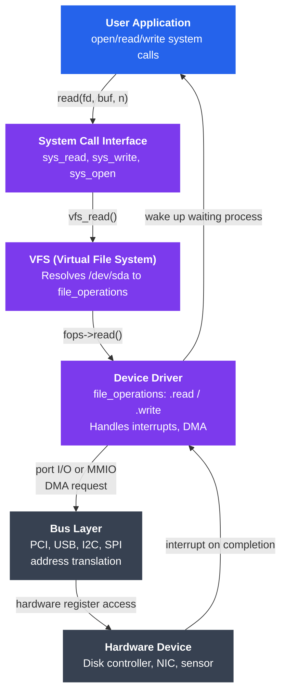

# Device Drivers

## What You'll Learn

In this tutorial, you will:

- Understand what device drivers are and why the kernel needs them
- Distinguish character devices, block devices, and network drivers
- Explore the Linux driver-kernel interface through the `file_operations` struct
- Learn how Loadable Kernel Modules (LKMs) work and how to manage them
- Compare user-space drivers (UIO, FUSE) with kernel-space drivers
- Walk through a minimal character device driver in C
- Use `lsmod`, `insmod`, `rmmod`, `dmesg`, and `/proc/devices` in practice

---

## Introduction

Every piece of hardware — disk, keyboard, NIC, GPU — speaks its own language. The CPU and user applications speak a standardized language (system calls, memory operations). **Device drivers** are the translators that sit between the two worlds. They live inside (or very close to) the kernel and expose a uniform interface to the rest of the system regardless of what the underlying hardware does.

---

## What Is a Device Driver?

A device driver is software that:

1. **Initializes** hardware on startup (reset, configure registers)
2. **Exposes** the hardware through the kernel's standard interfaces
3. **Handles interrupts** from the device
4. **Manages DMA** transfers between device and RAM
5. **Cleans up** when the device is removed or the system shuts down

```
Without drivers:                With drivers:
┌──────────────┐               ┌──────────────┐
│  Application │               │  Application │
│  open("/dev/sda")            │  open("/dev/sda")
│              │               └──────┬───────┘
│  ??? How to  │                      │ system call
│  talk to     │               ┌──────▼───────┐
│  this disk?  │               │   VFS layer  │
└──────────────┘               └──────┬───────┘
                                      │
                               ┌──────▼───────┐
                               │  Block driver│  ← standardized interface
                               │  (e.g. nvme) │
                               └──────┬───────┘
                                      │ register read/write
                               ┌──────▼───────┐
                               │   Hardware   │
                               └──────────────┘
```

---

## Driver Types

### Character Devices

Character devices transfer data as a stream of bytes, one character at a time. They are accessed sequentially and typically do not support random access (seeking).

Examples: terminals (`/dev/tty`), serial ports (`/dev/ttyS0`), mice (`/dev/input/mice`), random number generators (`/dev/urandom`)

```bash
# Character devices show 'c' in ls -l
ls -l /dev/ttyS0 /dev/urandom
# crw-rw---- 1 root dialout 4, 64 Jan 15 10:00 /dev/ttyS0
# crw-rw-rw- 1 root root  1,  9 Jan 15 10:00 /dev/urandom
#  ^--- 'c' = character device
#                           ^  ^--- minor number
#                           +------ major number
```

### Block Devices

Block devices transfer data in fixed-size chunks (blocks, typically 512 B or 4 KB). They support random access (seek to any block). The kernel buffers block device I/O through the page cache.

Examples: hard disks (`/dev/sda`), SSDs (`/dev/nvme0n1`), RAM disks (`/dev/ram0`)

```bash
# Block devices show 'b' in ls -l
ls -l /dev/sda /dev/nvme0n1
# brw-rw---- 1 root disk 8,  0 Jan 15 10:00 /dev/sda
# brw-rw---- 1 root disk 259, 0 Jan 15 10:00 /dev/nvme0n1
#  ^--- 'b' = block device
```

### Network Drivers

Network drivers do not appear as files under `/dev`. Instead, they register a **network interface** (`eth0`, `wlan0`) with the kernel's networking stack. Data moves as **packets** (sk_buff structures), not as a byte stream or blocks.

```bash
# Network interfaces
ip link show
# 1: lo: <LOOPBACK,UP,LOWER_UP> ...
# 2: eth0: <BROADCAST,MULTICAST,UP,LOWER_UP> ...

# Which driver is managing eth0?
ethtool -i eth0
# driver: e1000e
# version: 3.2.6-k
# firmware-version: 0.5-4
```

---

## The Driver-Kernel Interface: `file_operations`

In Linux, almost everything is a file. Character and block devices are accessed via file operations. The kernel defines a `struct file_operations` (in `<linux/fs.h>`) that a driver fills in to tell the kernel which functions to call for each operation.

```c
#include <linux/fs.h>

struct file_operations {
    struct module *owner;
    loff_t  (*llseek)  (struct file *, loff_t, int);
    ssize_t (*read)    (struct file *, char __user *, size_t, loff_t *);
    ssize_t (*write)   (struct file *, const char __user *, size_t, loff_t *);
    int     (*open)    (struct inode *, struct file *);
    int     (*release) (struct inode *, struct file *);
    long    (*unlocked_ioctl)(struct file *, unsigned int, unsigned long);
    int     (*mmap)    (struct file *, struct vm_area_struct *);
    /* ... many more ... */
};
```

A driver that only needs read/write sets just those pointers; unused operations are left NULL and the kernel handles them with sensible defaults.

---

## Loadable Kernel Modules (LKM)

The Linux kernel is monolithic but extensible. **Kernel modules** are compiled object files (`.ko`) that can be loaded into the running kernel without rebooting.

### Why Modules?

- Keep the core kernel small; load only what is needed
- Update drivers without recompiling the kernel
- Enable third-party drivers (NVidia, VirtualBox, etc.)

### Module Lifecycle

```
[Source code: driver.c]
        │
        ▼
  make -C /lib/modules/$(uname -r)/build M=$(pwd) modules
        │
        ▼
[driver.ko]
        │
   insmod / modprobe
        │
        ▼
[Driver loaded, init function called, /dev entry created]
        │
   rmmod / modprobe -r
        │
        ▼
[Cleanup function called, resources freed, module unloaded]
```

### Common Module Commands

```bash
# List loaded modules
lsmod

# Load a module
sudo insmod ./mydriver.ko          # by file path
sudo modprobe e1000e               # by name (searches module path)

# Unload a module
sudo rmmod mydriver
sudo modprobe -r e1000e

# Show module info (dependencies, parameters, description)
modinfo e1000e
modinfo ./mydriver.ko

# Show kernel log (driver init/cleanup messages)
dmesg | tail -20
journalctl -k | tail -20

# List all available modules
find /lib/modules/$(uname -r) -name "*.ko" | head -20

# Automatically load a module at boot
echo "e1000e" | sudo tee -a /etc/modules-load.d/mymodules.conf

# Pass parameters to a module
sudo modprobe usbcore autosuspend=0
# Or at load time:
sudo insmod mydriver.ko param1=42
```

---

## User Space vs Kernel Space Drivers

Kernel-space drivers are fast but a bug can crash the whole system. Two Linux frameworks allow drivers to run safely in user space:

### UIO — Userspace I/O

UIO exposes device memory and interrupts to user space through a character device (`/dev/uioX`). The user-space program maps the device's memory and handles interrupts by `read()`-ing the UIO device.

```
┌──────────────────────────────────────────┐
│           User Space                     │
│  ┌────────────────────────────────────┐  │
│  │   Your user-space driver program   │  │
│  │   mmap("/dev/uio0") → BAR0 regs    │  │
│  │   read("/dev/uio0") → blocks until │  │
│  │   interrupt, then processes it     │  │
│  └────────────────────────────────────┘  │
├─────────────────── syscall boundary ─────┤
│           Kernel Space                   │
│  ┌────────────────────────────────────┐  │
│  │   Tiny UIO kernel shim             │  │
│  │   (just maps memory, forwards IRQ) │  │
│  └────────────────────────────────────┘  │
└──────────────────────────────────────────┘
```

```bash
# Check if a device has UIO support
ls /dev/uio*
cat /sys/class/uio/uio0/name
```

### FUSE — Filesystem in Userspace

FUSE allows file systems to be implemented entirely in user space. The kernel FUSE module acts as a bridge, forwarding VFS operations to the user-space FUSE daemon.

```bash
# Examples of FUSE-based file systems
sshfs user@host:/remote /mnt/remote       # SSH file system
encfs ~/.encrypted ~/plaintext            # Encrypted FS
s3fs mybucket /mnt/s3                     # Amazon S3 as a FS

# Unmount FUSE file system
fusermount -u /mnt/remote
```

### Comparison

| Aspect | Kernel Driver | UIO | FUSE |
|--------|--------------|-----|------|
| Performance | Fastest | Fast (mmapped) | Slowest (context switches) |
| Safety | Bug crashes kernel | Bug crashes only program | Bug crashes only program |
| Development difficulty | Hard | Medium | Easy |
| Use case | All devices | Hardware acceleration, network cards | File systems |
| Debugging | Hard (kernel debugger) | Easy (gdb, printf) | Easy (gdb, printf) |

---

## Simple Character Device Driver in C

Here is a minimal character device driver that implements an in-kernel buffer. User programs can write data to it and read it back.

```c
// simple_char.c — minimal character device driver

#include <linux/init.h>
#include <linux/module.h>
#include <linux/fs.h>
#include <linux/uaccess.h>   // copy_to_user, copy_from_user
#include <linux/cdev.h>

MODULE_LICENSE("GPL");
MODULE_AUTHOR("Tutorial");
MODULE_DESCRIPTION("Simple character device driver");

#define DEVICE_NAME  "simple_char"
#define BUFFER_SIZE  1024

static int    major;             // assigned by kernel
static char   kernel_buf[BUFFER_SIZE];
static int    buf_len = 0;
static struct cdev  my_cdev;
static struct class *my_class;

/* Called when user opens /dev/simple_char */
static int dev_open(struct inode *inode, struct file *file)
{
    pr_info("simple_char: device opened\n");
    return 0;
}

/* Called when user closes the file descriptor */
static int dev_release(struct inode *inode, struct file *file)
{
    pr_info("simple_char: device closed\n");
    return 0;
}

/* Called on read(fd, buf, count) */
static ssize_t dev_read(struct file *file, char __user *user_buf,
                        size_t count, loff_t *offset)
{
    int bytes_to_copy;

    if (*offset >= buf_len)
        return 0;   /* EOF */

    bytes_to_copy = min((int)(buf_len - *offset), (int)count);

    /* copy_from_kernel_to_user: returns bytes NOT copied on failure */
    if (copy_to_user(user_buf, kernel_buf + *offset, bytes_to_copy))
        return -EFAULT;

    *offset += bytes_to_copy;
    pr_info("simple_char: sent %d bytes\n", bytes_to_copy);
    return bytes_to_copy;
}

/* Called on write(fd, buf, count) */
static ssize_t dev_write(struct file *file, const char __user *user_buf,
                         size_t count, loff_t *offset)
{
    int bytes_to_copy = min((int)count, BUFFER_SIZE);

    if (copy_from_user(kernel_buf, user_buf, bytes_to_copy))
        return -EFAULT;

    buf_len = bytes_to_copy;
    pr_info("simple_char: received %d bytes\n", bytes_to_copy);
    return bytes_to_copy;
}

/* The file_operations table — connects VFS to our functions */
static const struct file_operations fops = {
    .owner   = THIS_MODULE,
    .open    = dev_open,
    .release = dev_release,
    .read    = dev_read,
    .write   = dev_write,
};

/* Module init — called on insmod */
static int __init simple_char_init(void)
{
    dev_t dev_num;

    /* Allocate a major number dynamically */
    if (alloc_chrdev_region(&dev_num, 0, 1, DEVICE_NAME) < 0) {
        pr_err("simple_char: failed to allocate major number\n");
        return -1;
    }
    major = MAJOR(dev_num);

    /* Create sysfs class so udev creates /dev/simple_char automatically */
    my_class = class_create(THIS_MODULE, DEVICE_NAME);
    if (IS_ERR(my_class)) {
        unregister_chrdev_region(dev_num, 1);
        return PTR_ERR(my_class);
    }

    /* Initialize and add the cdev */
    cdev_init(&my_cdev, &fops);
    my_cdev.owner = THIS_MODULE;
    if (cdev_add(&my_cdev, dev_num, 1) < 0) {
        class_destroy(my_class);
        unregister_chrdev_region(dev_num, 1);
        return -1;
    }

    /* Create the /dev/simple_char node */
    device_create(my_class, NULL, dev_num, NULL, DEVICE_NAME);

    pr_info("simple_char: loaded, major=%d\n", major);
    return 0;
}

/* Module exit — called on rmmod */
static void __exit simple_char_exit(void)
{
    dev_t dev_num = MKDEV(major, 0);

    device_destroy(my_class, dev_num);
    cdev_del(&my_cdev);
    class_destroy(my_class);
    unregister_chrdev_region(dev_num, 1);

    pr_info("simple_char: unloaded\n");
}

module_init(simple_char_init);
module_exit(simple_char_exit);
```

### Makefile for the Module

```makefile
# Makefile
obj-m += simple_char.o

all:
	make -C /lib/modules/$(shell uname -r)/build M=$(PWD) modules

clean:
	make -C /lib/modules/$(shell uname -r)/build M=$(PWD) clean
```

### Building and Testing

```bash
# Build
make

# Load
sudo insmod simple_char.ko
dmesg | tail -5   # should show "loaded, major=X"

# Check device was created
ls -l /dev/simple_char

# Test write then read
echo "hello driver" | sudo tee /dev/simple_char
sudo cat /dev/simple_char     # should print "hello driver"

# Unload
sudo rmmod simple_char
dmesg | tail -3   # should show "unloaded"
```

---

## The Full Stack: How User App Reaches Hardware



---

## Useful Diagnostic Commands

```bash
# List all registered character and block devices with major numbers
cat /proc/devices

# Show all devices and their drivers (kernel's device tree)
cat /proc/bus/pci/devices
ls -la /sys/bus/pci/devices/

# Show which module owns a device
ls -l /sys/class/block/sda/device/driver

# Monitor kernel messages while loading a driver
dmesg -w &
sudo insmod mydriver.ko

# Check module dependencies
modinfo mydriver.ko | grep depends

# Show modules parameters
cat /sys/module/usbcore/parameters/autosuspend

# Dynamic debug: enable pr_debug() messages for a module
echo "module mydriver +p" | sudo tee /sys/kernel/debug/dynamic_debug/control
```

---

## Summary

- Device drivers are the kernel components that translate hardware specifics into the kernel's standard interfaces
- **Character devices** (byte streams), **block devices** (random-access blocks), and **network drivers** (packet-based) use different kernel interfaces
- The `struct file_operations` table is the core contract between a character/block driver and the VFS
- **Loadable Kernel Modules** allow drivers to be inserted and removed at runtime using `insmod`/`rmmod`/`modprobe`
- **UIO** and **FUSE** let you write drivers in user space, trading some performance for safety and ease of development
- A minimal driver must: register a major number, fill in `file_operations`, handle `copy_to_user`/`copy_from_user` carefully, and clean up in the exit function
