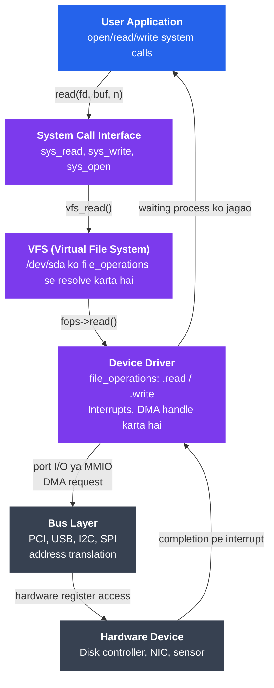

# Device Drivers

## Kya Seekhoge Is Tutorial Mein

- Device drivers hote kya hain aur kernel ko inki zarurat kyun padti hai
- Character devices, block devices, aur network drivers mein farak
- Linux ka driver-kernel interface — `file_operations` struct ke through
- Loadable Kernel Modules (LKMs) kaise kaam karte hain aur inhe kaise manage karte hain
- User-space drivers (UIO, FUSE) vs kernel-space drivers ka comparison
- Ek minimal character device driver C mein likh ke dekhenge
- `lsmod`, `insmod`, `rmmod`, `dmesg`, aur `/proc/devices` practically use karna

---

## Introduction

Socho tumhare paas ek naya Bluetooth speaker hai aur tum usse apne laptop se connect karna chahte ho. Tumhara laptop (CPU/OS) ek "standard language" bolta hai — system calls, memory operations. Lekin speaker apni khud ki electrical/firmware language bolta hai. Agar beech mein koi translator na ho, toh laptop aur speaker kabhi baat hi nahi kar payenge.

Yehi kaam **device driver** karta hai. Har hardware — disk ho, keyboard ho, NIC (network card) ho, GPU ho — apni khud ki bhasha bolta hai. CPU aur user applications ek standardized bhasha bolte hain (system calls, memory reads/writes). Device driver beech mein baithke translator ka role nibhata hai. Yeh kernel ke andar (ya bahut close) rehta hai, aur baaki poore system ko ek **uniform interface** deta hai — chahe niche hardware kuch bhi kar raha ho.

Isko aise socho jaise Zomato app hai. Tum app se "biryani order karo" bolte ho — tumhe fark nahi padta ki restaurant ka kitchen kaise chalta hai, gas stove hai ya induction, chef ka apna process hai. App (aur beech ka delivery system) ek standard interface deta hai: order karo, track karo, mil jayega. Waise hi, application `read()`/`write()` bolta hai, aur driver decide karta hai ki asal mein hardware ke saath kaise baat karni hai.

---

## Device Driver Hai Kya?

Ek device driver ek software hai jo yeh 5 kaam karta hai:

1. **Initialize karta hai** — startup pe hardware ko reset/configure karta hai (jaise naya router on karne pe woh apne registers set karta hai)
2. **Expose karta hai** — hardware ko kernel ke standard interfaces ke through baahar dikhata hai
3. **Interrupts handle karta hai** — jab device kuch bolna chahta hai ("mera kaam ho gaya!"), toh driver hi sunta hai
4. **DMA manage karta hai** — device aur RAM ke beech direct data transfer (CPU ko baar baar beech mein aana na pade)
5. **Cleanup karta hai** — jab device nikaal diya jaaye ya system shutdown ho, toh resources saaf karta hai

Socho jaise ek naya delivery partner Swiggy join karta hai — pehle onboarding/training hoti hai (initialize), phir woh app ke standard flow mein fit hota hai (expose), jab customer call karta hai toh woh respond karta hai (interrupt handle), order seedha kitchen se customer tak jaata hai bina restaurant manager ko baar baar involve kiye (DMA), aur jab partner logout karta hai toh uska session clean ho jaata hai (cleanup).

```
Bina drivers ke:                 Drivers ke saath:
┌──────────────┐               ┌──────────────┐
│  Application │               │  Application │
│  open("/dev/sda")            │  open("/dev/sda")
│              │               └──────┬───────┘
│  ??? Isse    │                      │ system call
│  baat kaise  │               ┌──────▼───────┐
│  karu?       │               │   VFS layer  │
└──────────────┘               └──────┬───────┘
                                      │
                               ┌──────▼───────┐
                               │  Block driver│  ← standardized interface
                               │  (e.g. nvme) │
                               └──────┬───────┘
                                      │ register read/write
                               ┌──────▼───────┐
                               │   Hardware   │
                               └──────────────┘
```

Bina driver ke, application ko pata hi nahi hoga ki `/dev/sda` (disk) se baat kaise ki jaaye — har disk manufacturer ka apna protocol hoga. Driver ke saath, application sirf `open()`, `read()`, `write()` bolta hai, aur baaki heavy lifting driver karta hai.

---

## Driver Ke Types

### Character Devices — Byte-by-Byte Stream

**Kya hota hai?** Character devices data ko ek stream of bytes ki tarah transfer karte hain — ek time pe ek character. Yeh sequentially access hote hain, aur usually random access (seek karna) support nahi karte.

Socho jaise WhatsApp pe live typing dekhna — characters ek ek karke aate hain, tum beech mein jump nahi kar sakte "5th character dikhao" bolke. Bas jo order mein aaya, wahi milega.

Examples: terminals (`/dev/tty`), serial ports (`/dev/ttyS0`), mice (`/dev/input/mice`), random number generators (`/dev/urandom`)

```bash
# Character devices 'c' dikhate hain ls -l mein
ls -l /dev/ttyS0 /dev/urandom
# crw-rw---- 1 root dialout 4, 64 Jan 15 10:00 /dev/ttyS0
# crw-rw-rw- 1 root root  1,  9 Jan 15 10:00 /dev/urandom
#  ^--- 'c' = character device
#                           ^  ^--- minor number
#                           +------ major number
```

> [!info]
> **Major number** batata hai kaunsa driver is device ko handle karta hai. **Minor number** us driver ke andar konsa specific device instance hai — jaise ek courier company (major = Delhivery) ke multiple branches (minor = Delhivery-Andheri, Delhivery-Powai).

### Block Devices — Fixed-Size Chunks

**Kya hota hai?** Block devices data ko fixed-size chunks (blocks, typically 512 B ya 4 KB) mein transfer karte hain. Yeh random access support karte hain — matlab tum kisi bhi block pe direct seek kar sakte ho. Kernel block device I/O ko **page cache** ke through buffer karta hai.

Isko IRCTC ki seat booking ki tarah socho — tumhe pura train ka data sequentially padhne ki zarurat nahi, seedha "Coach S4, Seat 23" pe jump kar sakte ho. Waise hi disk pe seedha kisi bhi block pe pahunch sakte ho, bina pehle wale sab blocks padhe.

Examples: hard disks (`/dev/sda`), SSDs (`/dev/nvme0n1`), RAM disks (`/dev/ram0`)

```bash
# Block devices 'b' dikhate hain ls -l mein
ls -l /dev/sda /dev/nvme0n1
# brw-rw---- 1 root disk 8,  0 Jan 15 10:00 /dev/sda
# brw-rw---- 1 root disk 259, 0 Jan 15 10:00 /dev/nvme0n1
#  ^--- 'b' = block device
```

### Network Drivers — Packet-Based

**Kya hota hai?** Network drivers `/dev` ke neeche file ki tarah dikhai nahi dete. Yeh ek **network interface** (`eth0`, `wlan0`) register karte hain kernel ke networking stack ke saath. Data yahan packets (sk_buff structures) ki form mein move karta hai — na ki byte stream ya blocks ki tarah.

Isko soch UPI transaction ki tarah — data ek continuous stream nahi hota, balki discrete "packets" hote hain (tumhara request packet, bank ka response packet, alag alag routes se jaa sakte hain, order kabhi kabhi badal bhi sakta hai).

```bash
# Network interfaces dekhna
ip link show
# 1: lo: <LOOPBACK,UP,LOWER_UP> ...
# 2: eth0: <BROADCAST,MULTICAST,UP,LOWER_UP> ...

# eth0 ko kaunsa driver manage kar raha hai?
ethtool -i eth0
# driver: e1000e
# version: 3.2.6-k
# firmware-version: 0.5-4
```

---

## Driver-Kernel Interface: `file_operations`

**Kyun zaruri hai?** Linux mein ek golden rule hai — "Everything is a file." Character aur block devices ko file operations ke through access kiya jaata hai. Kernel ek `struct file_operations` define karta hai (`<linux/fs.h>` mein), jise driver bharta hai — yeh batane ke liye ki har operation (read, write, open, ioctl, etc.) ke liye kaunsa function call karna hai.

Isko ek restaurant ke menu card ki tarah socho — customer (kernel/VFS) ko pata nahi ki kitchen mein kya ho raha hai, bas menu (file_operations struct) mein dekhkar order deta hai "Butter Chicken chahiye" (`.read`), aur kitchen (driver) apna kaam khud handle karta hai.

```c
#include <linux/fs.h>

struct file_operations {
    struct module *owner;
    loff_t  (*llseek)  (struct file *, loff_t, int);
    ssize_t (*read)    (struct file *, char __user *, size_t, loff_t *);
    ssize_t (*write)   (struct file *, const char __user *, size_t, loff_t *);
    int     (*open)    (struct inode *, struct file *);
    int     (*release) (struct inode *, struct file *);
    long    (*unlocked_ioctl)(struct file *, unsigned int, unsigned long);
    int     (*mmap)    (struct file *, struct vm_area_struct *);
    /* ... aur bhi bahut sare functions ... */
};
```

Jo driver sirf read/write handle karna chahta hai, woh sirf wahi pointers set karega; jo operations use nahi karta unhe `NULL` chhod dega, aur kernel unke liye sensible defaults handle kar lega (jaise agar `.llseek` na diya ho toh error return karega ki "seek support nahi hai").

> [!tip]
> Yeh bilkul waisa hi hai jaise Node.js mein tum Express route handlers define karte ho — `app.get()`, `app.post()` — jo function nahi diya, uska default 404 handler chal jaata hai. `file_operations` bhi ek "routing table" hai, bas HTTP methods ki jagah `read`/`write`/`open`/`ioctl` hain.

---

## Loadable Kernel Modules (LKM)

**Kya hota hai?** Linux kernel monolithic hai lekin extensible bhi hai. **Kernel modules** compiled object files (`.ko`) hote hain jinhe running kernel mein load kiya ja sakta hai — bina reboot kiye.

Isko socho jaise tum apne phone mein naya app install karte ho bina phone restart kiye — waise hi ek naya driver `.ko` file kernel mein "install" ho jaata hai on the fly.

### Modules Kyun?

- Core kernel ko chhota rakho; sirf zarurat ka load karo (jaise microservices — sab kuch ek monolith mein na daalo)
- Drivers update karo bina poora kernel recompile kiye
- Third-party drivers enable karo (NVidia, VirtualBox, etc.) — jaise Chrome extensions, browser ka core code change kiye bina naya feature add ho jaata hai

### Module Lifecycle

```
[Source code: driver.c]
        │
        ▼
  make -C /lib/modules/$(uname -r)/build M=$(pwd) modules
        │
        ▼
[driver.ko]
        │
   insmod / modprobe
        │
        ▼
[Driver load ho gaya, init function call hua, /dev entry ban gayi]
        │
   rmmod / modprobe -r
        │
        ▼
[Cleanup function call hua, resources free hue, module unload ho gaya]
```

### Common Module Commands

```bash
# Loaded modules ki list dekhna
lsmod

# Module load karna
sudo insmod ./mydriver.ko          # file path se
sudo modprobe e1000e               # naam se (module path mein search karta hai)

# Module unload karna
sudo rmmod mydriver
sudo modprobe -r e1000e

# Module ki info dekhna (dependencies, parameters, description)
modinfo e1000e
modinfo ./mydriver.ko

# Kernel log dekhna (driver init/cleanup messages)
dmesg | tail -20
journalctl -k | tail -20

# Saare available modules list karna
find /lib/modules/$(uname -r) -name "*.ko" | head -20

# Boot ke time automatically module load karna
echo "e1000e" | sudo tee -a /etc/modules-load.d/mymodules.conf

# Module ko parameters pass karna
sudo modprobe usbcore autosuspend=0
# Ya load time pe:
sudo insmod mydriver.ko param1=42
```

> [!warning]
> `rmmod` karte waqt agar module abhi bhi use ho raha hai (kisi process ne device open kar rakha hai), toh kernel unload karne se mana kar dega — "Device busy" error milega. Bilkul waise hi jaise Windows mein tum ek file delete nahi kar sakte jo kisi program ne khol rakhi hai.

---

## User Space vs Kernel Space Drivers

Kernel-space drivers fast hote hain, lekin agar usme koi bug hai toh poora system crash ho sakta hai — jaise ek galat wire connection se poore ghar ki light chali jaye. Do Linux frameworks hain jo drivers ko safely user space mein chalane dete hain:

### UIO — Userspace I/O

**Kya hota hai?** UIO device ki memory aur interrupts ko user space mein expose karta hai ek character device (`/dev/uioX`) ke through. User-space program device ki memory ko `mmap` karta hai aur interrupts ko `/dev/uioX` ko `read()` karke handle karta hai.

Isko soch jaise CRED app — CRED khud bank nahi hai, woh ek thin layer hai jo tumhare bank account se baat karta hai, lekin heavy lifting (actual money transfer) toh bank (kernel) hi karta hai. UIO ek "tiny shim" hai jo memory map karta hai aur IRQ forward karta hai, lekin asli logic user space mein hoti hai.

```
┌──────────────────────────────────────────┐
│           User Space                     │
│  ┌────────────────────────────────────┐  │
│  │   Tumhara user-space driver program │  │
│  │   mmap("/dev/uio0") → BAR0 regs    │  │
│  │   read("/dev/uio0") → block hota   │  │
│  │   hai jab tak interrupt na aaye,   │  │
│  │   phir process karta hai           │  │
│  └────────────────────────────────────┘  │
├─────────────────── syscall boundary ─────┤
│           Kernel Space                   │
│  ┌────────────────────────────────────┐  │
│  │   Chota sa UIO kernel shim         │  │
│  │   (sirf memory map karta hai,      │  │
│  │   IRQ forward karta hai)           │  │
│  └────────────────────────────────────┘  │
└──────────────────────────────────────────┘
```

```bash
# Check karo ki device UIO support karta hai ya nahi
ls /dev/uio*
cat /sys/class/uio/uio0/name
```

### FUSE — Filesystem in Userspace

**Kya hota hai?** FUSE file systems ko poori tarah user space mein implement karne deta hai. Kernel ka FUSE module ek bridge ki tarah kaam karta hai — VFS operations ko user-space FUSE daemon ko forward karta hai.

Socho jaise ek third-party delivery aggregator (jaise Dunzo) — woh khud kuch produce nahi karta, bas requests ko sahi jagah forward karta hai aur response wapas laata hai. FUSE bhi filesystem calls ko user-space program tak forward karta hai.

```bash
# FUSE-based file systems ke examples
sshfs user@host:/remote /mnt/remote       # SSH file system
encfs ~/.encrypted ~/plaintext            # Encrypted FS
s3fs mybucket /mnt/s3                     # Amazon S3 ko FS ki tarah use karna

# FUSE file system unmount karna
fusermount -u /mnt/remote
```

### Comparison

| Aspect | Kernel Driver | UIO | FUSE |
|--------|--------------|-----|------|
| Performance | Sabse fast | Fast (mmapped) | Sabse slow (context switches) |
| Safety | Bug pura kernel crash kar sakta hai | Bug sirf uss program ko crash karega | Bug sirf uss program ko crash karega |
| Development difficulty | Hard | Medium | Easy |
| Use case | Sab devices ke liye | Hardware acceleration, network cards | File systems |
| Debugging | Hard (kernel debugger) | Easy (gdb, printf) | Easy (gdb, printf) |

> [!tip]
> Yeh trade-off Node.js developers ke liye familiar lagega — jaise ek native C++ addon (fast lekin crash pura process kar sakta hai) vs pure JS module (thoda slow, lekin isolated aur debug karna easy). Kernel driver ≈ native addon, UIO/FUSE ≈ pure JS module.

---

## Simple Character Device Driver C Mein

Ab hands-on karte hain. Yeh ek minimal character device driver hai jo ek in-kernel buffer implement karta hai. User programs isme data write kar sakte hain aur wapas read kar sakte hain — bilkul ek simple key-value store ki tarah, jaise Redis ka ek tiny version, bas kernel ke andar.

```c
// simple_char.c — minimal character device driver

#include <linux/init.h>
#include <linux/module.h>
#include <linux/fs.h>
#include <linux/uaccess.h>   // copy_to_user, copy_from_user
#include <linux/cdev.h>

MODULE_LICENSE("GPL");
MODULE_AUTHOR("Tutorial");
MODULE_DESCRIPTION("Simple character device driver");

#define DEVICE_NAME  "simple_char"
#define BUFFER_SIZE  1024

static int    major;             // kernel dwara assign kiya jaayega
static char   kernel_buf[BUFFER_SIZE];
static int    buf_len = 0;
static struct cdev  my_cdev;
static struct class *my_class;

/* Jab user /dev/simple_char open karta hai tab call hota hai */
static int dev_open(struct inode *inode, struct file *file)
{
    pr_info("simple_char: device opened\n");
    return 0;
}

/* Jab user file descriptor close karta hai tab call hota hai */
static int dev_release(struct inode *inode, struct file *file)
{
    pr_info("simple_char: device closed\n");
    return 0;
}

/* read(fd, buf, count) call hone pe yeh chalta hai */
static ssize_t dev_read(struct file *file, char __user *user_buf,
                        size_t count, loff_t *offset)
{
    int bytes_to_copy;

    if (*offset >= buf_len)
        return 0;   /* EOF */

    bytes_to_copy = min((int)(buf_len - *offset), (int)count);

    /* copy_to_user: failure pe woh bytes return karta hai jo copy NAHI hue */
    if (copy_to_user(user_buf, kernel_buf + *offset, bytes_to_copy))
        return -EFAULT;

    *offset += bytes_to_copy;
    pr_info("simple_char: sent %d bytes\n", bytes_to_copy);
    return bytes_to_copy;
}

/* write(fd, buf, count) call hone pe yeh chalta hai */
static ssize_t dev_write(struct file *file, const char __user *user_buf,
                         size_t count, loff_t *offset)
{
    int bytes_to_copy = min((int)count, BUFFER_SIZE);

    if (copy_from_user(kernel_buf, user_buf, bytes_to_copy))
        return -EFAULT;

    buf_len = bytes_to_copy;
    pr_info("simple_char: received %d bytes\n", bytes_to_copy);
    return bytes_to_copy;
}

/* file_operations table — VFS ko hamare functions se connect karta hai */
static const struct file_operations fops = {
    .owner   = THIS_MODULE,
    .open    = dev_open,
    .release = dev_release,
    .read    = dev_read,
    .write   = dev_write,
};

/* Module init — insmod pe call hota hai */
static int __init simple_char_init(void)
{
    dev_t dev_num;

    /* Ek major number dynamically allocate karo */
    if (alloc_chrdev_region(&dev_num, 0, 1, DEVICE_NAME) < 0) {
        pr_err("simple_char: failed to allocate major number\n");
        return -1;
    }
    major = MAJOR(dev_num);

    /* sysfs class banao taaki udev automatically /dev/simple_char bana de */
    my_class = class_create(THIS_MODULE, DEVICE_NAME);
    if (IS_ERR(my_class)) {
        unregister_chrdev_region(dev_num, 1);
        return PTR_ERR(my_class);
    }

    /* cdev initialize karo aur add karo */
    cdev_init(&my_cdev, &fops);
    my_cdev.owner = THIS_MODULE;
    if (cdev_add(&my_cdev, dev_num, 1) < 0) {
        class_destroy(my_class);
        unregister_chrdev_region(dev_num, 1);
        return -1;
    }

    /* /dev/simple_char node banao */
    device_create(my_class, NULL, dev_num, NULL, DEVICE_NAME);

    pr_info("simple_char: loaded, major=%d\n", major);
    return 0;
}

/* Module exit — rmmod pe call hota hai */
static void __exit simple_char_exit(void)
{
    dev_t dev_num = MKDEV(major, 0);

    device_destroy(my_class, dev_num);
    cdev_del(&my_cdev);
    class_destroy(my_class);
    unregister_chrdev_region(dev_num, 1);

    pr_info("simple_char: unloaded\n");
}

module_init(simple_char_init);
module_exit(simple_char_exit);
```

**Code samajhte hain step by step:**

- `dev_open`/`dev_release` — jaise HTTP connection open/close hone pe log print karna, bas yeh device open/close hone pe hota hai
- `dev_read`/`dev_write` — yeh dhyan do ki data seedha copy nahi ho sakta! Kernel space aur user space ke memory address spaces alag hote hain (security ke liye — jaise ek tenant dusre tenant ka data seedha access nahi kar sakta multi-tenant system mein). Isliye `copy_to_user`/`copy_from_user` functions use karne padte hain, jo safely dono spaces ke beech data copy karte hain aur agar user ne invalid pointer diya toh `-EFAULT` return karte hain
- `fops` struct — yeh wahi "menu card" hai jo humne upar dekha
- `simple_char_init` — 4 steps: major number allocate karo → sysfs class banao (udev ke liye) → cdev register karo → `/dev/simple_char` node create karo
- `simple_char_exit` — bilkul reverse order mein sab cleanup karo (jaise restaurant band karte waqt: customers ko bahar bhejo → tables clean karo → lights off karo)

> [!warning]
> Kernel driver code mein bugs bahut costly padte hain — agar `copy_from_user` na use karke seedha user pointer ko dereference kar diya, toh crash ho sakta hai ya worse, security vulnerability ban sakti hai (kernel memory leak ho sakti hai user space ko). Isliye kernel development mein har boundary check zaruri hai.

### Module Ka Makefile

```makefile
# Makefile
obj-m += simple_char.o

all:
	make -C /lib/modules/$(shell uname -r)/build M=$(PWD) modules

clean:
	make -C /lib/modules/$(shell uname -r)/build M=$(PWD) clean
```

### Build Aur Test Karna

```bash
# Build karo
make

# Load karo
sudo insmod simple_char.ko
dmesg | tail -5   # "loaded, major=X" dikhna chahiye

# Check karo device create hua ya nahi
ls -l /dev/simple_char

# Pehle write, phir read test karo
echo "hello driver" | sudo tee /dev/simple_char
sudo cat /dev/simple_char     # "hello driver" print hona chahiye

# Unload karo
sudo rmmod simple_char
dmesg | tail -3   # "unloaded" dikhna chahiye
```

---

## Poora Stack: User App Se Hardware Tak Kaise Pahunchte Hain



Isko dekh ke samjho jaise ek online order ka safar — tum app pe order karte ho (system call), app backend ko request bhejta hai (syscall interface), backend decide karta hai kaunsa restaurant/warehouse handle karega (VFS resolve karta hai konsa driver), warehouse apna internal process chalata hai (driver `.read`/`.write`), delivery partner actual road/traffic navigate karta hai (bus layer — PCI/USB/I2C), aur finally saamaan tumhare ghar pahunchta hai (hardware). Jab kaam ho jaata hai, delivery partner tumhe notification bhejta hai (interrupt), aur tumhara app update ho jaata hai (process wake up).

---

## Useful Diagnostic Commands

```bash
# Saare registered character aur block devices ko unke major numbers ke saath dekho
cat /proc/devices

# Saare devices aur unke drivers dekho (kernel ka device tree)
cat /proc/bus/pci/devices
ls -la /sys/bus/pci/devices/

# Konsa module kis device ko own karta hai
ls -l /sys/class/block/sda/device/driver

# Driver load karte waqt kernel messages monitor karo
dmesg -w &
sudo insmod mydriver.ko

# Module dependencies check karo
modinfo mydriver.ko | grep depends

# Module parameters dekho
cat /sys/module/usbcore/parameters/autosuspend

# Dynamic debug: kisi module ke liye pr_debug() messages enable karo
echo "module mydriver +p" | sudo tee /sys/kernel/debug/dynamic_debug/control
```

---

## Key Takeaways

- Device drivers kernel ke woh components hain jo hardware-specific details ko kernel ke standard interfaces mein translate karte hain — bilkul ek translator ki tarah do alag bhasha bolne walon ke beech
- **Character devices** (byte streams, jaise live typing), **block devices** (random-access blocks, jaise IRCTC seat booking), aur **network drivers** (packet-based, jaise UPI transactions) — teeno alag kernel interfaces use karte hain
- `struct file_operations` ek "menu card" hai — yeh core contract hai character/block driver aur VFS ke beech
- **Loadable Kernel Modules** drivers ko runtime pe insert/remove karne dete hain `insmod`/`rmmod`/`modprobe` se — bina reboot kiye naya "app install" karne jaisa
- **UIO** aur **FUSE** drivers ko user space mein likhne dete hain — thodi performance ki keemat pe zyada safety aur easy development milta hai (native addon vs pure JS module wala trade-off)
- Ek minimal driver ko yeh karna hi padta hai: major number register karo, `file_operations` bharo, `copy_to_user`/`copy_from_user` bahut carefully handle karo (kernel-user boundary security ke liye critical hai), aur exit function mein sab kuch reverse order mein cleanup karo
