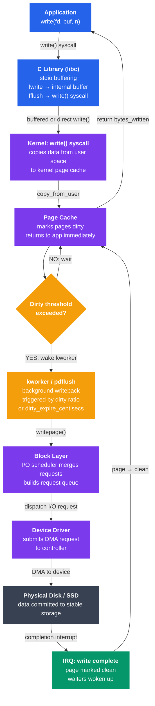

# I/O Buffering and Caching

## What You'll Learn

In this tutorial, you will:

- Understand why I/O buffering exists and how it improves performance
- Distinguish single, double, and circular buffering strategies
- Learn how the Linux page cache accelerates disk reads and writes
- Understand the historical buffer cache and how Linux unified it with the page cache
- Compare write-back and write-through caching trade-offs
- Use `fsync`, `fdatasync`, `O_DIRECT`, and `O_SYNC` correctly
- Explore cache eviction with the LRU and Clock algorithms
- Trace the write path from an application down to the physical disk

---

## Introduction

The speed gap between CPUs and storage devices spans several orders of magnitude. A modern CPU executes billions of instructions per second; a spinning disk delivers perhaps 150 random reads per second. Even NVMe SSDs are orders of magnitude slower than RAM. Buffering and caching are the techniques the OS uses to bridge this gap — accumulating small writes into larger ones, serving repeated reads from memory, and hiding storage latency behind fast RAM.

---

## Why I/O Buffering Exists

### The Speed Mismatch

```
Device speeds (approximate):
  CPU registers      : ~0.3 ns
  L1 cache           : ~1 ns
  L2 cache           : ~4 ns
  DRAM               : ~60 ns
  NVMe SSD (seq)     : ~100 µs
  SATA SSD (seq)     : ~500 µs
  HDD (seq)          : ~5 ms
  HDD (random)       : ~10 ms

Ratio: CPU is ~30,000,000× faster than a random HDD read
```

Without buffering, every `write()` call would stall the application until the hardware acknowledged the write — unacceptable for interactive software or high-throughput servers.

### Three Benefits of Buffering

1. **Decoupling speeds** — the producer (application) and consumer (hardware) run at their own speeds
2. **Batching small I/Os** — many small writes are merged into one large disk operation
3. **Absorbing bursts** — a burst of writes fills the buffer; the disk drains it at its own pace

---

## Buffering Strategies

### Single Buffering

One buffer sits between the application and the device. The application fills the buffer; the OS drains it to the device; the application waits while draining occurs.

```
App writes → [  Buffer  ] → Disk
              ↑           ↑
           App fills    OS drains
           (mutually exclusive — one at a time)

Timeline:
  Fill:  |======|
  Drain:        |======|
  Fill:                 |======|
  Drain:                       |======|
  Utilization: 50%
```

### Double Buffering

Two buffers alternate: while the OS is draining buffer A to disk, the application fills buffer B. Then they swap.

```
  App:  Fill A  |  Fill B  |  Fill A  |
  Disk: (wait)  |  Drain A |  Drain B |

  Timeline:
  Fill A:  |===|
  Drain A:      |===|
  Fill B:       |===|   ← overlap!
  Drain B:           |===|
  Fill A:            |===|   ← overlap!
  Utilization: ~100% when fill time ≈ drain time
```

### Circular (Ring) Buffering

N slots arranged in a ring. Producer writes to the head; consumer reads from the tail. Producer waits only when the ring is full; consumer waits only when empty.

```
Ring buffer with 8 slots:

  Indices:  0   1   2   3   4   5   6   7
           [D] [D] [D] [_] [_] [_] [_] [_]
             ↑           ↑
           tail          head
           (consumer)    (producer)

  Slots 0-2: filled, waiting to be drained to disk
  Slots 3-7: free, available for new writes

Used in: kernel log buffers, network ring buffers (DPDK, AF_XDP),
         pipe implementations, audio drivers
```

---

## The Linux Page Cache

The page cache is the kernel's main I/O cache. It stores disk content as memory pages (typically 4 KB each). All file reads and writes go through it by default.

### Read Path (Cache Hit vs Miss)

```
Application: read(fd, buf, 4096)
                   │
                   ▼
          Does page cache
          contain this page?
               /        \
           YES             NO
            │               │
    Copy page            Submit I/O request
    to user buf          to block layer
    (microseconds)            │
            │           Wait for disk
            │           (~1–10 ms)
            │                │
            │           Store page in cache
            │                │
            └────────────────┘
                   │
            Return data to app
```

### Write Path (Write-Back by Default)

```
Application: write(fd, buf, 4096)
                   │
                   ▼
          Mark page as "dirty"
          in page cache
                   │
          Return to app immediately
          (microseconds)
                   │
           ┌───────┘
           │  (later, background)
           ▼
     pdflush / kworker
     flushes dirty pages to disk
     after dirty_expire_centisecs
     (default 30 seconds) or when
     dirty ratio threshold exceeded
```

```bash
# View page cache usage
free -h
# Mem:  total=16G  used=4G  free=1G  buff/cache=11G

# More detail
cat /proc/meminfo | grep -E "Cached|Dirty|Writeback"
# Cached:        10485760 kB
# Dirty:            40960 kB   ← pages written but not yet on disk
# Writeback:         4096 kB   ← pages currently being written to disk

# Force all dirty pages to disk
sync

# Show per-process dirty page count
cat /proc/$(pgrep myapp)/status | grep VmDirty
```

### Page Cache Tuning

```bash
# View dirty page thresholds
sysctl vm.dirty_ratio           # max % of RAM that can be dirty
sysctl vm.dirty_background_ratio # background flush starts at this %
sysctl vm.dirty_expire_centisecs # how long a page can stay dirty (cs)
sysctl vm.dirty_writeback_centisecs # how often kworker wakes up (cs)

# Tune for a database workload (lower dirty ratio → more predictable latency)
sysctl -w vm.dirty_ratio=10
sysctl -w vm.dirty_background_ratio=5

# Tune for high-throughput sequential writes (allow more buffering)
sysctl -w vm.dirty_ratio=40
sysctl -w vm.dirty_background_ratio=20

# Drop page cache (useful for benchmarking, not for production)
echo 1 | sudo tee /proc/sys/vm/drop_caches  # drop page cache
echo 2 | sudo tee /proc/sys/vm/drop_caches  # drop dentries/inodes
echo 3 | sudo tee /proc/sys/vm/drop_caches  # drop all
```

---

## Buffer Cache vs Page Cache

### Historical Separation (Pre-Linux 2.4)

Early Linux had two separate caches:

- **Page cache** — cached file data (read/write via VFS)
- **Buffer cache** — cached raw disk blocks (used for metadata, direct block access)

The same disk block could be in both caches, wasting memory.

```
[Pre-2.4 Linux]
File read  → Page Cache  → disk block
Raw block  → Buffer Cache → same disk block
           DUPLICATE! Wastes RAM
```

### Unified Cache (Linux 2.4+)

Linux 2.4 merged the two caches. The page cache now holds all cached disk content. Buffer heads (the old buffer cache data structures) still exist but are attached to pages in the unified page cache.

```
[Modern Linux]
File read  ─┐
             ├─→ Page Cache (unified) → disk block
Raw block  ─┘
            No duplication — one copy in RAM
```

```bash
# "Buffers" in free(1) now refers only to block device metadata pages
# "Cached" refers to file-backed pages
# Together they are the unified page cache
free -h
#               total  used  free  shared  buff/cache  available
# Mem:           15Gi  3.8Gi  832Mi  312Mi      10Gi      10Gi
```

---

## Write-Back vs Write-Through

### Write-Back (Default in Linux)

Writes go to the page cache immediately; the kernel flushes dirty pages to disk asynchronously.

```
Pros:
  + Application writes return instantly
  + Small writes are coalesced into larger disk I/Os
  + Read-modify-write is efficient

Cons:
  - Data in dirty pages is lost on power failure
  - Latency spike when flush is triggered
  - Application cannot know when data is truly on disk
```

### Write-Through

Every write to the cache is also immediately written to disk before returning to the application.

```
Pros:
  + Data is immediately durable on disk
  + Simple consistency model
  + Safe for critical metadata

Cons:
  - Every write waits for disk acknowledgment
  - Much lower write throughput
  - Cannot coalesce writes efficiently
```

### How to Choose

```
Use write-back (default) when:
  - General purpose workloads
  - Performance is more important than per-write durability
  - Application explicitly calls fsync() at transaction boundaries

Use write-through / O_SYNC when:
  - Every write must survive a crash individually
  - Database WAL (write-ahead log) files
  - Journaling files
```

---

## fsync, fdatasync, O_DIRECT, O_SYNC

### `fsync(fd)`

Forces all dirty pages for the file (data + metadata) to be written to the physical device and acknowledged.

```c
#include <unistd.h>

int fd = open("important.db", O_WRONLY | O_CREAT, 0644);
write(fd, data, len);
if (fsync(fd) == -1) {
    perror("fsync failed");
    // handle error — write is NOT guaranteed on disk
}
close(fd);
```

### `fdatasync(fd)`

Like `fsync()` but skips flushing file metadata (e.g., atime, mtime) unless the metadata is needed to retrieve the data. Faster than `fsync()` when you only need data durability.

```c
// Faster than fsync for data-only durability
write(fd, data, len);
fdatasync(fd);
```

### `O_SYNC` Flag

Opens the file in synchronous mode. Every `write()` call blocks until the data and necessary metadata are on the physical device. Equivalent to calling `fdatasync()` after every write.

```c
int fd = open("wal.log", O_WRONLY | O_CREAT | O_SYNC, 0644);
write(fd, record, len);  // blocks until on disk
```

### `O_DIRECT` Flag

Bypasses the page cache entirely. Reads and writes go directly between the user buffer and the device. Requires aligned buffers and aligned transfer sizes (usually 512 B or 4096 B alignment).

```c
#include <fcntl.h>

// O_DIRECT requires aligned memory
void *buf;
posix_memalign(&buf, 4096, 4096);  // 4096-byte aligned buffer

int fd = open("/dev/sda", O_RDONLY | O_DIRECT);
ssize_t n = read(fd, buf, 4096);   // reads directly from device, no cache
```

```
O_DIRECT use cases:
  - Database storage engines (PostgreSQL, MySQL InnoDB manage their own cache)
  - Benchmarking raw device speed
  - Large sequential scans that would pollute the page cache

O_DIRECT pitfalls:
  - No read-ahead (you must do your own prefetching)
  - Alignment requirements are error-prone
  - Usually slower than cached I/O except for large sequential workloads
```

### Performance Impact Summary

```bash
# Benchmark: write 1 GB file with different sync modes
# (dd as a rough approximation)

# Write-back (no sync): fastest
dd if=/dev/zero of=test.dat bs=4M count=256
# → ~3000 MB/s (just fills page cache)

# fdatasync per write: moderate
dd if=/dev/zero of=test.dat bs=4M count=256 conv=fdatasync
# → ~500 MB/s (NVMe) or ~100 MB/s (HDD)

# O_DIRECT: bypasses cache
dd if=/dev/zero of=test.dat bs=4M count=256 oflag=direct
# → ~2000 MB/s (NVMe seq) or ~120 MB/s (HDD seq)
```

---

## Cache Eviction: LRU and Clock Algorithm

The page cache has limited size (bounded by available RAM). When new pages must be loaded but memory is full, the kernel must choose which pages to evict.

### LRU (Least Recently Used)

Evict the page that was accessed furthest in the past. In a perfect implementation, this requires tracking the exact time of every access.

```
Page accesses: A B C D A B E A B C

LRU with 3 frames:
Access A: [A _ _]  miss
Access B: [A B _]  miss
Access C: [A B C]  miss
Access D: [D B C]  miss → evict A (oldest)
Access A: [D A C]  miss → evict B (oldest)
Access B: [D A B]  miss → evict C (oldest)
Access E: [E A B]  miss → evict D (oldest)
Access A: [E A B]  HIT  → A moved to front
Access B: [E A B]  HIT  → B moved to front
Access C: [C A B]  miss → evict E (oldest)
```

True LRU is expensive (O(1) with a doubly-linked list + hash map). Linux uses an approximation.

### Clock Algorithm (Second-Chance FIFO)

The clock algorithm is an efficient LRU approximation used in Linux's page frame reclaimer. Pages sit on a circular list. Each page has a **reference bit** set to 1 when accessed.

```
Clock hand sweeps around the ring:
  - If reference bit = 1: clear it to 0, give a "second chance"
  - If reference bit = 0: EVICT this page

Pages arranged in a circle:
      ┌────────────────────────────────────────────────┐
      │                                                │
   [A: ref=0] ← [B: ref=1] ← [C: ref=1] ← [D: ref=0] ← clock hand
                                                        ↑
   Hand starts at D:
   D has ref=0 → EVICT D
   Hand moves to A:
   A has ref=0 → EVICT A (if need more space)
   Hand moves to B:
   B has ref=1 → clear to 0, skip (second chance)
   Hand moves to C:
   C has ref=1 → clear to 0, skip (second chance)
   Next sweep: B and C now have ref=0 → eligible for eviction
```

### Linux's Two-List Strategy (Active/Inactive Lists)

Linux maintains two LRU lists per memory zone:

```
Active list:   hot pages, recently accessed twice or more
Inactive list: cold pages, candidate for eviction

New page → Inactive list
Access on inactive page → promoted to Active list
Active list too large → demote pages to Inactive list
Need to free memory → evict from tail of Inactive list
```

```bash
# See active vs inactive page counts
cat /proc/meminfo | grep -E "Active|Inactive"
# Active(file):     2097152 kB   ← file-backed hot pages
# Inactive(file):   8388608 kB   ← file-backed cold pages (evictable)
# Active(anon):      524288 kB   ← anonymous hot pages
# Inactive(anon):    131072 kB   ← anonymous cold pages
```

---

## Full Write Path Diagram



**Key insight**: `write()` returns to the application as soon as the data reaches the page cache (the purple box). The orange path (background writeback) happens completely asynchronously — potentially seconds later. Only `fsync()` forces the application to wait for the green path (disk acknowledgment).

---

## Practical Recipes

```bash
# How much RAM is used as page cache right now?
free -h | awk '/^Mem:/ {print "Page cache: " $6}'

# Watch dirty pages in real time
watch -n 1 "grep -E 'Dirty|Writeback' /proc/meminfo"

# Force flush all dirty pages
sync; echo 3 | sudo tee /proc/sys/vm/drop_caches

# Check if a file is cached (fincore or vmtouch)
vmtouch /var/log/syslog
# [O..OO.....OOOO] 48/128 = 37.5%  ← O = cached, . = not cached

# Pre-warm cache for a file before benchmarking
vmtouch -t /path/to/datafile

# Evict a specific file from cache
vmtouch -e /path/to/file

# Show per-file cache usage
fincore /var/log/syslog
```

---

## Summary

- **I/O buffering** decouples application speed from device speed; circular buffers are the most general pattern
- The **Linux page cache** is the unified kernel cache for all file and block device content; it serves reads from RAM and batches writes asynchronously
- **Write-back** (default) maximizes throughput but risks data loss; `fsync()` provides explicit durability checkpoints
- `O_DIRECT` bypasses the page cache — useful for databases with their own buffer pool, but requires alignment and careful use
- Cache eviction uses **approximated LRU** via the clock algorithm and Linux's two-list (active/inactive) strategy
- The write path from application to disk crosses four layers: libc buffer → page cache → block layer → device driver → hardware; `fsync()` waits for the entire path to complete
