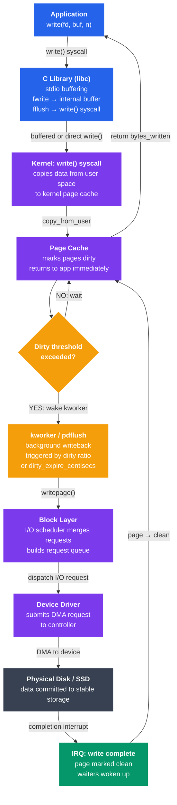

# I/O Buffering and Caching

## Is Tutorial Mein Kya Seekhoge

Is tutorial mein tum ye samjhoge:

- I/O buffering kyun exist karta hai aur ye performance kaise improve karta hai
- Single, double, aur circular buffering strategies mein farak
- Linux ka page cache disk reads/writes ko kaise fast banata hai
- Purana buffer cache kya tha aur Linux ne use page cache ke saath kaise merge kiya
- Write-back vs write-through caching ke trade-offs
- `fsync`, `fdatasync`, `O_DIRECT`, aur `O_SYNC` ka sahi use
- LRU aur Clock algorithm se cache eviction
- Application se lekar physical disk tak write path ka pura safar

---

## Introduction

Socho tumhara CPU ek Formula 1 car hai jo 300 km/h pe bhaag raha hai, aur disk ek bailgadi hai jo 5 km/h pe chal rahi hai. Ye gap itna zyada hai ki agar CPU har chhoti si cheez ke liye disk ka wait kare, toh poora system rुक jaayega — jaise Zomato ka delivery boy har order ke liye restaurant ke bahar khada rehke khana pakne ka wait kare, na ki dusre orders bhi saath mein handle kare.

CPU aur storage device ke beech speed ka gap kayi orders of magnitude ka hai. Ek modern CPU billions of instructions per second execute karta hai; ek spinning disk shayad 150 random reads per second de paata hai. NVMe SSDs bhi RAM ke comparison mein bahut slow hain. **Buffering aur caching** wo techniques hain jo OS use karta hai is gap ko paatne ke liye — chhoti-chhoti writes ko ek badi write mein jodna, repeated reads ko memory se serve karna, aur storage ki latency ko fast RAM ke peeche chhupana.

---

## I/O Buffering Kyun Zaruri Hai

### Speed Mismatch — Asli Problem

```
Device speeds (approximate):
  CPU registers      : ~0.3 ns
  L1 cache           : ~1 ns
  L2 cache           : ~4 ns
  DRAM               : ~60 ns
  NVMe SSD (seq)     : ~100 µs
  SATA SSD (seq)     : ~500 µs
  HDD (seq)          : ~5 ms
  HDD (random)       : ~10 ms

Ratio: CPU is ~30,000,000× faster than a random HDD read
```

Zara socho — agar buffering na ho, toh har `write()` call application ko tab tak rok degi jab tak hardware confirm na kare ki data disk pe likh diya gaya. Ye interactive software (jaise tumhara text editor) ya high-throughput servers (jaise Zomato ka order-processing backend) ke liye bilkul unacceptable hai. User ek button click kare aur screen 10ms tak freeze ho jaaye — koi use nahi karega aisa app.

### Buffering Ke Teen Fayde

1. **Speeds decouple karna** — producer (application) aur consumer (hardware) apni-apni speed pe kaam karte hain, ek dusre ka wait nahi karte
2. **Chhoti I/Os ko batch karna** — kayi chhoti writes ek badi disk operation mein merge ho jaati hain (jaise Swiggy multiple chhote orders ko ek batch mein pack karke bhejta hai instead of alag-alag trip lagane ke)
3. **Bursts ko absorb karna** — agar achanak bahut saari writes aa jaayein (burst), toh buffer unhe fill kar leta hai; disk apni pace pe usse drain karta hai

> [!info]
> Buffering ka core idea simple hai: **speed mismatch ke beech mein ek "waiting room" laga do**, taaki fast waala slow waale ka wait na kare.

---

## Buffering Strategies

### Single Buffering

Sirf ek buffer hota hai application aur device ke beech. Application buffer ko fill karta hai; OS use device pe drain karta hai; jab tak drain ho raha hai, application wait karta hai.

Socho ek chhoti si chai ki dukaan jahan sirf ek hi kettle hai — jab tak wo kettle khaali nahi hoti (drain), naya paani usme daal (fill) nahi sakte. Ek time pe ek hi kaam ho sakta hai.

```
App writes → [  Buffer  ] → Disk
              ↑           ↑
           App fills    OS drains
           (mutually exclusive — one at a time)

Timeline:
  Fill:  |======|
  Drain:        |======|
  Fill:                 |======|
  Drain:                       |======|
  Utilization: 50%
```

Yahan CPU aadha time idle baitha rehta hai — na fill ho raha, na drain. Bahut inefficient.

### Double Buffering

Do buffers hote hain jo alternate karte hain: jab OS buffer A ko disk pe drain kar raha hota hai, application buffer B ko fill karta hai. Phir dono swap ho jaate hain.

Isse socho jaise ek dhaba mein do tawe hain — ek pe roti sek rahi hai (serve ho rahi), doosre pe agli roti bel di ja rahi hai (fill ho rahi). Isse koi bhi idle nahi baithta.

```
  App:  Fill A  |  Fill B  |  Fill A  |
  Disk: (wait)  |  Drain A |  Drain B |

  Timeline:
  Fill A:  |===|
  Drain A:      |===|
  Fill B:       |===|   ← overlap!
  Drain B:           |===|
  Fill A:            |===|   ← overlap!
  Utilization: ~100% when fill time ≈ drain time
```

Jab fill aur drain time roughly equal hote hain, utilization ~100% tak pahunch jaata hai — koi bhi idle nahi baithta.

### Circular (Ring) Buffering

N slots ek ring (circle) mein arranged hote hain. Producer head pe likhta hai; consumer tail se padhta hai. Producer sirf tab wait karta hai jab ring full ho, consumer sirf tab wait karta hai jab ring empty ho.

Ye bilkul IRCTC ke waiting list system jaisa hai — jaise hi ek seat khaali hoti hai (consumer ne slot free kiya), waiting list ka agla banda us slot mein aa jaata hai (producer naya data daal deta hai). Aur agar list full hai, naya banda tab tak wait karta hai jab tak jagah na bane.

```
Ring buffer with 8 slots:

  Indices:  0   1   2   3   4   5   6   7
           [D] [D] [D] [_] [_] [_] [_] [_]
             ↑           ↑
           tail          head
           (consumer)    (producer)

  Slots 0-2: filled, waiting to be drained to disk
  Slots 3-7: free, available for new writes

Used in: kernel log buffers, network ring buffers (DPDK, AF_XDP),
         pipe implementations, audio drivers
```

Circular buffer sabse general aur widely-used pattern hai — kernel log buffers se lekar network drivers tak, sab jagah isi ka use hota hai kyunki isme dono producer aur consumer independently chal sakte hain, bina ek-dusre ko block kiye (jab tak buffer full/empty na ho).

---

## Linux Page Cache

**Kya hota hai?** Page cache Linux kernel ka main I/O cache hai. Ye disk ka content memory pages (typically 4 KB har ek) ke form mein store karta hai. **Default mein saari file reads aur writes isi ke through jaati hain.**

Isko socho jaise tumhare ghar ka fridge hai. Har baar sabzi mandi (disk) jaane ki bajaye, jo cheezein baar-baar chahiye hoti hain (doodh, sabzi) unhe fridge mein rakh lete ho. Agli baar chahiye toh fridge se turant mil jaati hai (cache hit) — mandi jaane ka time bach jaata hai. Agar fridge mein nahi hai toh mandi jaana padta hai (cache miss), aur wapas aake fridge mein rakh dete ho taaki agli baar kaam aaye.

### Read Path (Cache Hit vs Miss)

**Kyun zaruri hai?** Kyunki disk se baar-baar data padhna bahut slow hai. Agar ek hi file ko 100 baar padho, toh RAM se 100 baar padhna disk se 100 baar padhne se hazaron guna fast hai.

```
Application: read(fd, buf, 4096)
                   │
                   ▼
          Does page cache
          contain this page?
               /        \
           YES             NO
            │               │
    Copy page            Submit I/O request
    to user buf          to block layer
    (microseconds)            │
            │           Wait for disk
            │           (~1–10 ms)
            │                │
            │           Store page in cache
            │                │
            └────────────────┘
                   │
            Return data to app
```

Cache hit microseconds mein hota hai, cache miss milliseconds le sakta hai — ye 1000x ka farak hai! Isliye jab tumhara server "warm" ho jaata hai (yaani baar-baar use hone waali files cache ho chuki hoti hain), performance dramatically improve ho jaata hai.

### Write Path (Write-Back by Default)

Jab tum `write()` call karte ho, Linux turant disk pe nahi likhta — wo page cache mein page ko "dirty" mark kar deta hai aur application ko turant return kar deta hai, jaise Zomato mein order place karne ke baad turant "Order Confirmed" dikha deta hai app, chahe restaurant abhi khana banana shuru bhi na kiya ho. Actual "cooking" (disk write) background mein baad mein hota hai.

```
Application: write(fd, buf, 4096)
                   │
                   ▼
          Mark page as "dirty"
          in page cache
                   │
          Return to app immediately
          (microseconds)
                   │
           ┌───────┘
           │  (later, background)
           ▼
     pdflush / kworker
     flushes dirty pages to disk
     after dirty_expire_centisecs
     (default 30 seconds) or when
     dirty ratio threshold exceeded
```

> [!warning]
> Ye "instant return" ka matlab ye nahi ki data disk pe safely pahunch gaya hai! Agar is beech power cut ho jaaye, wo dirty pages RAM mein hi reh jaayenge aur **permanently lost** ho jaayenge. Isi wajah se durability ke liye `fsync()` jaisi cheezein zaruri ban jaati hain (aage discuss karenge).

```bash
# View page cache usage
free -h
# Mem:  total=16G  used=4G  free=1G  buff/cache=11G

# More detail
cat /proc/meminfo | grep -E "Cached|Dirty|Writeback"
# Cached:        10485760 kB
# Dirty:            40960 kB   ← pages written but not yet on disk
# Writeback:         4096 kB   ← pages currently being written to disk

# Force all dirty pages to disk
sync

# Show per-process dirty page count
cat /proc/$(pgrep myapp)/status | grep VmDirty
```

### Page Cache Tuning

Agar tum ek database server chala rahe ho jahan crash pe data loss unacceptable hai, tum dirty ratio ko kam rakhna chahoge (taaki jyada dirty pages RAM mein accumulate na hon). Lekin agar tum ek bulk-upload pipeline chala rahe ho jahan throughput important hai, tum jyada buffering allow karoge.

```bash
# View dirty page thresholds
sysctl vm.dirty_ratio           # max % of RAM that can be dirty
sysctl vm.dirty_background_ratio # background flush starts at this %
sysctl vm.dirty_expire_centisecs # how long a page can stay dirty (cs)
sysctl vm.dirty_writeback_centisecs # how often kworker wakes up (cs)

# Tune for a database workload (lower dirty ratio → more predictable latency)
sysctl -w vm.dirty_ratio=10
sysctl -w vm.dirty_background_ratio=5

# Tune for high-throughput sequential writes (allow more buffering)
sysctl -w vm.dirty_ratio=40
sysctl -w vm.dirty_background_ratio=20

# Drop page cache (useful for benchmarking, not for production)
echo 1 | sudo tee /proc/sys/vm/drop_caches  # drop page cache
echo 2 | sudo tee /proc/sys/vm/drop_caches  # drop dentries/inodes
echo 3 | sudo tee /proc/sys/vm/drop_caches  # drop all
```

> [!tip]
> `drop_caches` sirf benchmarking/testing ke liye use karo. Production mein isse chalana matlab jaan-boojh kar apni performance ko downgrade karna — jaise fridge khaali kar dena aur roz mandi jaana shuru kar dena.

---

## Buffer Cache vs Page Cache

### Historical Separation (Pre-Linux 2.4)

Purane Linux (2.4 se pehle) mein do alag caches the:

- **Page cache** — file data cache karta tha (VFS ke through read/write)
- **Buffer cache** — raw disk blocks cache karta tha (metadata, direct block access ke liye)

Problem ye thi ki same disk block dono caches mein duplicate ho sakta tha — RAM waste. Socho tumhare ghar mein do fridge hain aur galti se ek hi doodh ka packet dono mein rakh diya — jagah waste, aur confusion bhi ki latest wala kaunsa hai.

```
[Pre-2.4 Linux]
File read  → Page Cache  → disk block
Raw block  → Buffer Cache → same disk block
           DUPLICATE! Wastes RAM
```

### Unified Cache (Linux 2.4+)

Linux 2.4 ne dono caches ko merge kar diya. Ab page cache hi saara cached disk content rakhta hai. Buffer heads (purani buffer cache ki data structures) abhi bhi exist karte hain, lekin ab wo unified page cache ke pages se attached hote hain — koi duplicate copy nahi.

```
[Modern Linux]
File read  ─┐
             ├─→ Page Cache (unified) → disk block
Raw block  ─┘
            No duplication — one copy in RAM
```

```bash
# "Buffers" in free(1) now refers only to block device metadata pages
# "Cached" refers to file-backed pages
# Together they are the unified page cache
free -h
#               total  used  free  shared  buff/cache  available
# Mem:           15Gi  3.8Gi  832Mi  312Mi      10Gi      10Gi
```

> [!info]
> Aaj jab tum `free -h` chalate ho aur "buff/cache" dekhte ho, wo ek hi unified page cache hai — do alag cheezein nahi.

---

## Write-Back vs Write-Through

### Write-Back (Linux Mein Default)

Writes turant page cache mein chali jaati hain; kernel dirty pages ko asynchronously disk pe flush karta hai — jaise UPI transaction ka "Payment Successful" screen pe turant dikh jaata hai, lekin actual bank settlement thodi der baad (ya raat ko batch mein) hota hai.

```
Pros:
  + Application writes return instantly
  + Small writes are coalesced into larger disk I/Os
  + Read-modify-write is efficient

Cons:
  - Data in dirty pages is lost on power failure
  - Latency spike when flush is triggered
  - Application cannot know when data is truly on disk
```

### Write-Through

Har write cache mein hone ke saath-saath turant disk pe bhi likhi jaati hai, aur tabhi application ko return hota hai. Ye jaise CRED pe payment karte waqt tumhe tab tak "Processing..." dikhta hai jab tak actual bank confirmation na aa jaaye — slow hai, lekin guaranteed hai ki paisa gaya.

```
Pros:
  + Data is immediately durable on disk
  + Simple consistency model
  + Safe for critical metadata

Cons:
  - Every write waits for disk acknowledgment
  - Much lower write throughput
  - Cannot coalesce writes efficiently
```

### Kaunsa Choose Karein?

```
Use write-back (default) when:
  - General purpose workloads
  - Performance is more important than per-write durability
  - Application explicitly calls fsync() at transaction boundaries

Use write-through / O_SYNC when:
  - Every write must survive a crash individually
  - Database WAL (write-ahead log) files
  - Journaling files
```

Real-world example: Ek e-commerce app ka order-log (WAL) write-through/fsync use karega — kyunki agar server crash ho jaaye toh "order place hua ya nahi" ka record kho nahi sakta. Lekin thumbnail images generate karne waala background job write-back use karega, kyunki agar wo lost bhi ho jaaye toh dobara generate ho sakta hai.

---

## fsync, fdatasync, O_DIRECT, O_SYNC

### `fsync(fd)`

Ye file ke saare dirty pages (data + metadata) ko physical device pe force-write karta hai aur acknowledgment ka wait karta hai. Socho ye jaise WhatsApp ka "double tick" — jab tak dusre device pe pahunch confirm nahi hota, tumhe pata nahi ki message safe pahuncha.

```c
#include <unistd.h>

int fd = open("important.db", O_WRONLY | O_CREAT, 0644);
write(fd, data, len);
if (fsync(fd) == -1) {
    perror("fsync failed");
    // handle error — write is NOT guaranteed on disk
}
close(fd);
```

### `fdatasync(fd)`

`fsync()` jaisa hi hai, lekin file metadata (jaise atime, mtime) ko flush nahi karta jab tak wo data retrieve karne ke liye zaruri na ho. Sirf data durability chahiye ho toh `fsync()` se fast hai — kyunki tumhe extra metadata I/O nahi karna padta.

```c
// Faster than fsync for data-only durability
write(fd, data, len);
fdatasync(fd);
```

### `O_SYNC` Flag

File ko synchronous mode mein open karta hai. Har `write()` call tab tak block rehti hai jab tak data aur zaruri metadata physical device pe na chala jaaye. Ye har write ke baad `fdatasync()` call karne ke barabar hai — jaise har transaction ke baad manually confirm karna, na ki batch mein.

```c
int fd = open("wal.log", O_WRONLY | O_CREAT | O_SYNC, 0644);
write(fd, record, len);  // blocks until on disk
```

### `O_DIRECT` Flag

Page cache ko poori tarah bypass kar deta hai. Reads aur writes seedha user buffer aur device ke beech jaati hain. Iske liye aligned buffers aur aligned transfer sizes chahiye hoti hain (usually 512 B ya 4096 B alignment).

**Kyun use karte hain?** Databases jaise PostgreSQL aur MySQL apna khud ka smart buffer pool maintain karte hain (jo unke query patterns ke hisaab se optimized hota hai). Agar Linux ka generic page cache bhi beech mein aa jaaye, toh data do baar cache hoga (double buffering problem) — jagah waste, aur kabhi-kabhi performance bhi kharab.

```c
#include <fcntl.h>

// O_DIRECT requires aligned memory
void *buf;
posix_memalign(&buf, 4096, 4096);  // 4096-byte aligned buffer

int fd = open("/dev/sda", O_RDONLY | O_DIRECT);
ssize_t n = read(fd, buf, 4096);   // reads directly from device, no cache
```

```
O_DIRECT use cases:
  - Database storage engines (PostgreSQL, MySQL InnoDB manage their own cache)
  - Benchmarking raw device speed
  - Large sequential scans that would pollute the page cache

O_DIRECT pitfalls:
  - No read-ahead (you must do your own prefetching)
  - Alignment requirements are error-prone
  - Usually slower than cached I/O except for large sequential workloads
```

> [!warning]
> `O_DIRECT` ek "expert mode" feature hai. Agar tumhe exactly nahi pata ki alignment aur prefetching kaise handle karni hai, iska use mat karo — galat use se performance kaafi kharab ho sakta hai, cached I/O se bhi slow.

### Performance Impact Summary

```bash
# Benchmark: write 1 GB file with different sync modes
# (dd as a rough approximation)

# Write-back (no sync): fastest
dd if=/dev/zero of=test.dat bs=4M count=256
# → ~3000 MB/s (just fills page cache)

# fdatasync per write: moderate
dd if=/dev/zero of=test.dat bs=4M count=256 conv=fdatasync
# → ~500 MB/s (NVMe) or ~100 MB/s (HDD)

# O_DIRECT: bypasses cache
dd if=/dev/zero of=test.dat bs=4M count=256 oflag=direct
# → ~2000 MB/s (NVMe seq) or ~120 MB/s (HDD seq)
```

Dekho ye numbers — write-back sabse fast dikhta hai (~3000 MB/s) kyunki wo sirf RAM mein likh raha hai, disk pe nahi. Lekin ye ek "illusion" hai — actual disk commitment abhi baaki hai. `fdatasync` ka number asli disk speed dikhata hai.

---

## Cache Eviction: LRU Aur Clock Algorithm

**Kya hota hai?** Page cache ka size limited hota hai (available RAM tak bounded). Jab naye pages load karne hon aur memory full ho, kernel ko decide karna padta hai ki **kaunse pages evict (remove) kiye jaayein**.

### LRU (Least Recently Used)

Us page ko evict karo jo sabse purane time pe access hua tha. Ek perfect implementation mein, har access ka exact time track karna padta hai.

Socho ye jaise tumhari almari hai jisme limited jagah hai. Jo kapde tumne sabse zyada time se nahi pehne (least recently used), unhe sabse pehle nikaal ke daan mein de doge jab nayi shopping ke liye jagah chahiye ho.

```
Page accesses: A B C D A B E A B C

LRU with 3 frames:
Access A: [A _ _]  miss
Access B: [A B _]  miss
Access C: [A B C]  miss
Access D: [D B C]  miss → evict A (oldest)
Access A: [D A C]  miss → evict B (oldest)
Access B: [D A B]  miss → evict C (oldest)
Access E: [E A B]  miss → evict D (oldest)
Access A: [E A B]  HIT  → A moved to front
Access B: [E A B]  HIT  → B moved to front
Access C: [C A B]  miss → evict E (oldest)
```

True LRU mehenga hai implement karna (O(1) ke liye doubly-linked list + hash map chahiye, aur har access pe usko update karna padta hai). Millions of pages ke saath ye overhead significant ho jaata hai. Isliye Linux ek **approximation** use karta hai.

### Clock Algorithm (Second-Chance FIFO)

Clock algorithm ek efficient LRU approximation hai jo Linux ke page frame reclaimer mein use hota hai. Pages ek circular list pe baithe hote hain. Har page ka ek **reference bit** hota hai jo access hone pe 1 set ho jaata hai.

Isko socho ek clock ki tarah jiski suee (hand) ghadi ki tarah ghoomti hai. Jaise koi ticket-checker train mein ghoom-ghoom kar check kar raha ho ki kaun currently seat use kar raha hai (ref bit = 1) aur kaun nahi (ref bit = 0) — jo use nahi kar raha, uski seat kisi aur ko de do (evict).

```
Clock hand sweeps around the ring:
  - If reference bit = 1: clear it to 0, give a "second chance"
  - If reference bit = 0: EVICT this page

Pages arranged in a circle:
      ┌────────────────────────────────────────────────┐
      │                                                │
   [A: ref=0] ← [B: ref=1] ← [C: ref=1] ← [D: ref=0] ← clock hand
                                                        ↑
   Hand starts at D:
   D has ref=0 → EVICT D
   Hand moves to A:
   A has ref=0 → EVICT A (if need more space)
   Hand moves to B:
   B has ref=1 → clear to 0, skip (second chance)
   Hand moves to C:
   C has ref=1 → clear to 0, skip (second chance)
   Next sweep: B and C now have ref=0 → eligible for eviction
```

Clock algorithm ka fayda ye hai ki isme O(1) ke roughly close overhead hota hai per page, lekin behavior LRU jaisa hi milta hai bina expensive linked-list bookkeeping ke.

### Linux Ki Two-List Strategy (Active/Inactive Lists)

Linux har memory zone ke liye do LRU lists maintain karta hai — ye bhi ek smarter approximation hai:

```
Active list:   hot pages, recently accessed twice or more
Inactive list: cold pages, candidate for eviction

New page → Inactive list
Access on inactive page → promoted to Active list
Active list too large → demote pages to Inactive list
Need to free memory → evict from tail of Inactive list
```

Isko socho jaise ek restaurant ka "regular customers" vs "one-time visitors" list. Naya customer pehle "one-time visitor" list mein hai. Agar wo dobara aata hai, promote hoke "regular" list mein chala jaata hai — aur regulars ko easily kick out nahi kiya jaata jab tables chahiye hoti hain, pehle one-time visitors ko priority di jaati hai jagah khaali karne ke liye.

```bash
# See active vs inactive page counts
cat /proc/meminfo | grep -E "Active|Inactive"
# Active(file):     2097152 kB   ← file-backed hot pages
# Inactive(file):   8388608 kB   ← file-backed cold pages (evictable)
# Active(anon):      524288 kB   ← anonymous hot pages
# Inactive(anon):    131072 kB   ← anonymous cold pages
```

---

## Full Write Path Diagram

Chalo ab pura safar dekhte hain — jab tum apne Node.js app mein `fs.write()` call karte ho, data actually disk tak kaise pahunchta hai:



**Key insight**: `write()` application ko turant return kar deta hai jaise hi data page cache (purple box) tak pahunchta hai. Orange path (background writeback) poori tarah asynchronously hota hai — kabhi-kabhi seconds baad. Sirf `fsync()` hi application ko green path (disk acknowledgment) ke complete hone tak wait karwaata hai.

Isko Zomato ke analogy se dekho: "Order Placed" (write returns) turant dikh jaata hai. Restaurant ko order forward karna (kworker/writeback) background mein hota hai. "Order Delivered" confirmation (fsync completion) tabhi milta hai jab actual delivery ho jaaye.

---

## Practical Recipes

```bash
# How much RAM is used as page cache right now?
free -h | awk '/^Mem:/ {print "Page cache: " $6}'

# Watch dirty pages in real time
watch -n 1 "grep -E 'Dirty|Writeback' /proc/meminfo"

# Force flush all dirty pages
sync; echo 3 | sudo tee /proc/sys/vm/drop_caches

# Check if a file is cached (fincore or vmtouch)
vmtouch /var/log/syslog
# [O..OO.....OOOO] 48/128 = 37.5%  ← O = cached, . = not cached

# Pre-warm cache for a file before benchmarking
vmtouch -t /path/to/datafile

# Evict a specific file from cache
vmtouch -e /path/to/file

# Show per-file cache usage
fincore /var/log/syslog
```

> [!tip]
> Agar tum kabhi ye dekh rahe ho ki "database benchmark run 1 fast tha, run 2 aur bhi fast tha" — ye page cache warm-up effect ho sakta hai. Consistent benchmarking ke liye har run se pehle `drop_caches` use karo taaki fair comparison mile.

---

## Key Takeaways

- **I/O buffering** application ki speed ko device ki speed se decouple karta hai; circular buffer sabse general aur widely-used pattern hai (kernel log buffers, network drivers, pipes sab isi ka use karte hain)
- **Linux page cache** kernel ka unified cache hai jo saara file aur block device content store karta hai — reads ko RAM se serve karta hai aur writes ko asynchronously batch karta hai
- Pehle **page cache** aur **buffer cache** alag-alag the (duplicate memory waste karte the); Linux 2.4 se dono unified ho gaye — ab ek hi copy RAM mein
- **Write-back** (default) throughput maximize karta hai lekin data-loss ka risk rehta hai; `fsync()`/`fdatasync()` explicit durability checkpoints dete hain jahan zaruri ho (jaise WAL files)
- `O_DIRECT` page cache ko bypass karta hai — databases apna khud ka buffer pool manage karte hain isliye use karte hain, lekin alignment aur careful handling zaruri hai
- Cache eviction ke liye true LRU expensive hai, isliye Linux **Clock algorithm** (second-chance FIFO) aur **active/inactive two-list strategy** use karta hai — ek smart approximation jo real LRU jaisa behavior deta hai kam overhead mein
- Write path 4 layers cross karta hai: libc buffer → page cache → block layer → device driver → hardware; `fsync()` is poore path ke complete hone ka wait karta hai, jabki normal `write()` sirf page cache tak pahunchte hi return ho jaata hai
