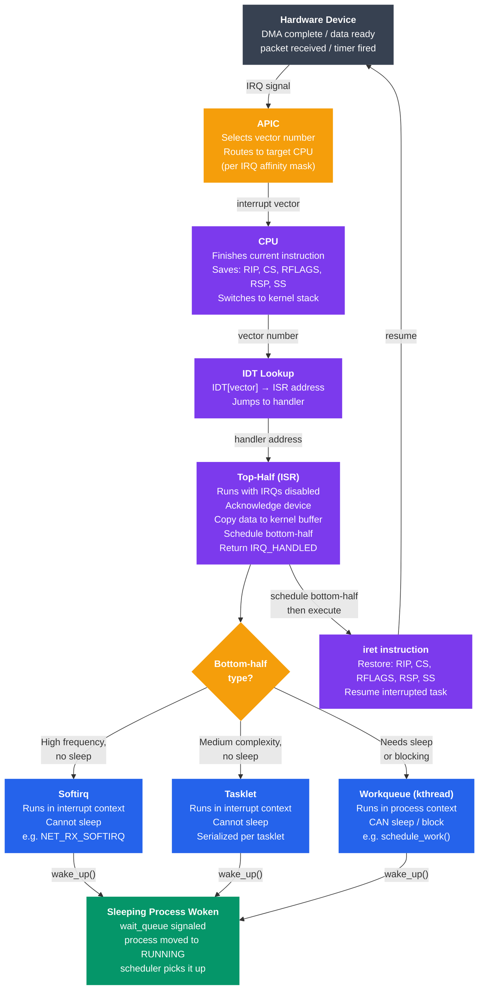

# Interrupt Handling

## Kya Seekhoge Is Tutorial Mein

Is tutorial mein tum ye samjhoge:

- Interrupts kya hote hain aur OS design mein ye itne fundamental kyun hain
- Hardware interrupts, software interrupts aur exceptions mein farak
- Interrupt Vector Table aur Interrupt Descriptor Table (IDT) kaise kaam karte hain
- Top-half / bottom-half split — aur softirq, tasklet, ya workqueue kab use karna hai
- Interrupt latency, jitter, aur real-time systems pe unka impact
- IRQ affinity configure karke interrupts ko specific CPU cores se bind karna
- Polling vs interrupt-driven I/O — kaunsa kab use karna hai

---

## Introduction

Socho agar interrupts hi nahi hote toh kya hota — CPU ko har device ko baar-baar poochna padta "bhai tera kaam ho gaya kya? ho gaya kya? ho gaya kya?" — bilkul waise hi jaise koi impatient customer Swiggy support ko har 2 second mein call karke poochta rahe "order kahan hai, order kahan hai". Ye process — jise **polling** kehte hain — CPU ka bohot sara time waste karta hai, kyunki zyada tar time device idle hi hota hai.

Interrupts isi problem ko solve karte hain. Hardware ko permission milti hai ki wo khud CPU ko signal bhej sake jab uska kaam ho jaye — bilkul jaise Swiggy delivery boy khud tumhe call kar de "bhaiya order deliver kar diya" instead of tumhe baar-baar app refresh karte rehna pade. CPU apna user program full speed pe chalata rehta hai; jab disk se read complete hota hai ya network pe packet aata hai, device ek interrupt raise karta hai aur CPU thoda sa ruk kar usko handle karta hai, phir wapas apne kaam pe laut aata hai.

---

## Interrupt Kya Hota Hai?

Interrupt ek signal hai CPU ko jo usko batata hai — "ruk jaa, ek zaruri kaam hai". CPU apna current execution rok deta hai, apni state save karta hai, ek special handler function (jise **Interrupt Service Routine**, ya **ISR** kehte hain) run karta hai, aur fir state restore karke wahi se resume karta hai jahan se chhoda tha.

Isko aisa socho — tum kitchen mein khana bana rahe ho (task A chal raha hai), tabhi doorbell baj jaati hai (interrupt). Tum gas ka flame low kar dete ho, yaad rakhte ho kya bana rahe the (state save), jaakar door kholte ho (ISR run hota hai), phir wapas kitchen mein aakar wahi se khana banana continue karte ho jahan chhoda tha.

```
Normal execution:
  CPU: [task A] → [task A] → [task A] → [task A] → ...

With interrupt:
  CPU: [task A] → [task A] → |IRQ| → [ISR] → [task A] → [task A]
                               ↑         ↑
                         hardware     ~microseconds
                         raises       to handle
                         interrupt
```

### Teen Categories

Interrupts teen tarah ke hote hain — kaun trigger karta hai uske hisaab se:

| Type | Trigger | Example |
|------|---------|---------|
| **Hardware interrupt** | External device CPU ko signal bhejta hai | NIC pe packet aaya, disk I/O complete hua, timer fire hua |
| **Software interrupt** (trap/syscall) | Software mein `int` ya `syscall` instruction | System call, `int 0x80` on x86 |
| **Exception** | CPU khud error detect karta hai | Page fault, division by zero, invalid opcode |

Yaad rakho — hardware interrupt bahar se (device se) aata hai, jabki software interrupt aur exception khud CPU ke andar generate hote hain program ke execution ke dauran.

---

## Hardware Interrupts

### IRQ Lines Aur PIC / APIC

x86 systems mein hardware devices CPU se connect hote hain ek **interrupt controller** ke through — direct CPU se baat nahi karte, beech mein ek middleman hota hai jo requests ko manage karta hai. Bilkul waise jaise ek call center mein customer directly CEO ko phone nahi lagata, ek receptionist (controller) call ko sahi department tak route karta hai.

- **PIC** (Programmable Interrupt Controller, legacy 8259A) — 15 IRQ lines, purane/simple systems mein use hota tha
- **APIC** (Advanced PIC) — modern x86 mein use hota hai; har CPU core ke paas apna ek **LAPIC** (Local APIC) hota hai, aur ek **IOAPIC** device IRQs ko sahi LAPIC tak route karta hai

```
Device → IOAPIC → LAPIC (CPU core) → CPU interrupt pin
            ↑
      Routes IRQ 10 to CPU 0, IRQ 11 to CPU 3, etc.
      (configurable — IRQ affinity)
```

Ye bilkul Zomato ke dispatch system jaisa hai — restaurant (device) order ready hone ka signal deta hai, central dispatch (IOAPIC) decide karta hai konsa delivery boy (CPU core) is order ko handle karega, aur wo configurable hota hai (IRQ affinity).

```bash
# View IRQ assignments on Linux
cat /proc/interrupts
#            CPU0   CPU1   CPU2   CPU3
#   0:        46      0      0      0   IO-APIC   2-edge      timer
#  16:         0      0      0   1842   IO-APIC  16-fasteoi  ehci_hcd
# 120:         0    554      0      0   PCI-MSI 524288-edge  nvme0q0
# LOC:   4521038  4487291 ...        Local timer interrupts
```

> [!tip]
> `/proc/interrupts` file dekh kar tum turant pata laga sakte ho kaunse device kitne interrupts generate kar rahe hain aur konse CPU pe load pad raha hai. Agar ek CPU pe hi saara load ja raha hai, IRQ affinity tune karne ki zarurat ho sakti hai.

### MSI Aur MSI-X

Modern PCIe devices physical IRQ lines use nahi karte — wo **MSI** (Message Signaled Interrupts) use karte hain. Idea simple hai: device ek special memory address pe likh kar interrupt signal kar deta hai, bilkul jaise koi UPI se ek chhota sa message bhej de "kaam ho gaya" instead of physically ja kar bolna. Isse fayda ye hota hai:

- Zyada interrupt vectors available hote hain (MSI-X 2048 tak support karta hai)
- Multi-queue NVMe/NICs ke liye per-queue interrupts mil jaate hain (matlab har CPU core ka apna alag IRQ)

```bash
# Check if a device uses MSI-X
lspci -v | grep -A 10 "Ethernet"
# Capabilities: [80] MSI-X: Enable+ Count=8 Masked-
#   Table: BAR=3 offset=00003000
```

---

## Interrupt Vector Table Aur IDT

### x86 Interrupt Vector Table

CPU ek **interrupt vector** (0 se 255 tak ka number) use karta hai ek table mein index karne ke liye jisme handler ke addresses hote hain. x86-64 mein is table ko **IDT** (Interrupt Descriptor Table) kehte hain.

Isko ek phone directory ki tarah socho — har vector number ek "extension number" hai, aur IDT batata hai ki us extension pe call aane par konsa function (handler) uthayega.

```
IDT (256 entries):
┌────────────┬────────────────────────────────────────────────────┐
│  Vector 0  │  handler: divide_error()          (exception)     │
│  Vector 1  │  handler: debug()                 (exception)     │
│  Vector 2  │  handler: nmi()                   (NMI)          │
│  Vector 3  │  handler: int3()                  (breakpoint)   │
│  Vector 6  │  handler: invalid_op()            (invalid opcode)│
│  Vector 14 │  handler: page_fault()            (page fault)   │
│  Vector 32 │  handler: timer_interrupt()       (IRQ 0)        │
│  Vector 33 │  handler: keyboard_interrupt()    (IRQ 1)        │
│    ...     │  ...                                              │
│  Vector 128│  handler: system_call()           (syscall trap) │
│    ...     │  ...                                             │
│  Vector 255│  (free / platform-specific)                      │
└────────────┴────────────────────────────────────────────────────┘
```

### Interrupt Fire Hone Par Kya Hota Hai?

Chalo step-by-step dekhte hain ki interrupt aane par CPU ke andar exactly kya hota hai — ye sequence samajhna zaruri hai kyunki isi mein saara "magic" chhupa hai:

```
1. Device raises IRQ
2. APIC picks a vector number, signals CPU
3. CPU finishes current instruction (atomic boundary)
4. CPU pushes: SS, RSP, RFLAGS, CS, RIP onto kernel stack
   (saving the interrupted context)
5. CPU loads handler address from IDT[vector]
6. CPU jumps to handler (now in kernel mode)
7. Handler runs (ISR top-half)
8. Handler calls iret (interrupt return)
9. CPU restores: RIP, CS, RFLAGS, RSP, SS
10. Execution resumes where it was interrupted
```

Step 3 pe dhyan do — CPU beech mein kabhi nahi rukta, wo current instruction ko poora complete karta hai pehle (atomic boundary), fir hi interrupt handle karta hai. Ye isliye zaruri hai taaki CPU state hamesha consistent rahe — half-executed instruction ke saath state save karna disaster hoga.

```bash
# View the IDT (requires kernel debugger or /proc)
# On Linux, interrupts are described in /proc/interrupts

# Count total interrupts per second
watch -n 1 "awk 'NR>1{for(i=2;i<=NF;i++) sum+=$i} END{print sum}' /proc/interrupts"
```

> [!info]
> IDT sirf hardware interrupts ke liye nahi hai — exceptions (vectors 0-31) aur software traps/syscalls (jaise vector 128) bhi isi table ka use karte hain. Mechanism same hai, sirf trigger source alag hai.

---

## Top-Half Vs Bottom-Half Processing

### Long ISRs Ki Problem

Interrupt handlers interrupts disabled karke (ya elevated priority pe) chalte hain. Agar ek ISR bohot lamba chal gaya, toh doosre saare interrupts block ho jaate hain — matlab har cheez ki latency badh jaati hai. Socho agar Swiggy ka ek delivery boy ek hi order ko deliver karne mein 2 ghante laga de — tab tak baaki saare orders queue mein atke rahenge.

Solution simple hai: ISR (top-half) mein sirf minimum kaam karo, aur baaki sab kaam ek safe context mein baad ke liye defer kar do (bottom-half).

```
Device raises interrupt
        │
        ▼
┌─────────────────────────────────────────────────────────┐
│  TOP-HALF (ISR — runs with interrupts disabled)         │
│  • Acknowledge the interrupt to the device              │
│  • Copy data from device to a kernel buffer             │
│  • Schedule bottom-half to run later                    │
│  • Return IMMEDIATELY (microseconds)                    │
└─────────────────────────────────────────────────────────┘
        │
        │  (interrupts re-enabled, other IRQs can fire)
        ▼
┌─────────────────────────────────────────────────────────┐
│  BOTTOM-HALF (deferred — runs in a safe context)        │
│  • Process the buffered data                            │
│  • Update kernel data structures                        │
│  • Wake up waiting processes                            │
│  • Run network stack, decode packets, etc.              │
└─────────────────────────────────────────────────────────┘
```

Isko aise socho — jab customer ka order aata hai (interrupt), delivery boy (top-half) sirf order pick karta hai aur "order accept kar liya" confirm karta hai (acknowledge) — actual delivery ka lamba kaam baad mein hota hai (bottom-half), taaki delivery boy jaldi se agla order bhi pick kar sake.

### Linux Ke Bottom-Half Mechanisms

Linux deferred interrupt processing ke liye teen mechanisms deta hai, flexibility aur overhead ke hisaab se badhte order mein:

#### 1. Softirq

Ye sabse low-level aur fastest bottom-half hai. Interrupt context mein chalta hai (matlab sleep karna allowed nahi hai). Softirq types ki ek chhoti si fixed list hoti hai.

```c
// Softirq types (defined in linux/interrupt.h):
// HI_SOFTIRQ       — high-priority tasklets
// TIMER_SOFTIRQ    — timer processing
// NET_TX_SOFTIRQ   — network transmit
// NET_RX_SOFTIRQ   — network receive  ← major user
// BLOCK_SOFTIRQ    — block device completion
// TASKLET_SOFTIRQ  — general tasklets
// SCHED_SOFTIRQ    — scheduler load balancing
// RCU_SOFTIRQ      — RCU callbacks
```

Softirqs usi CPU pe chalte hain jisne unko raise kiya (ya, agar bohot zyada aa gaye, toh `ksoftirqd` naam ke thread ke through). Ye multiple CPUs pe concurrently chal sakte hain, isliye inka code lock-free ya bohot careful locking wala hona chahiye.

#### 2. Tasklet

Ye softirq ke upar bana hua hai, lekin use karne mein zyada easy hai: same type ke tasklets serialize ho jaate hain (matlab do CPUs pe ek saath nahi chalenge). Zyadatar driver bottom-halves ke liye ye perfect fit hai.

```c
#include <linux/interrupt.h>

/* Define the bottom-half function */
static void my_tasklet_fn(unsigned long data)
{
    /* process data — no sleeping allowed */
    struct my_device *dev = (struct my_device *)data;
    process_received_data(dev);
}

/* Declare the tasklet */
DECLARE_TASKLET(my_tasklet, my_tasklet_fn, (unsigned long)&my_dev);

/* In the ISR (top-half), schedule it */
irqreturn_t my_isr(int irq, void *dev_id)
{
    /* acknowledge interrupt, copy data to buffer */
    copy_data_from_device(dev_id);

    /* schedule bottom-half */
    tasklet_schedule(&my_tasklet);

    return IRQ_HANDLED;
}
```

#### 3. Workqueue

Ye sabse flexible bottom-half mechanism hai. Ye process context mein chalta hai (ek kernel thread ki tarah), isliye ye **sleep kar sakta hai**, blocking functions call kar sakta hai, aur mutexes le sakta hai. Overhead tasklets se zyada hai, lekin flexibility bhi zyada hai.

```c
#include <linux/workqueue.h>

static struct work_struct my_work;

static void my_work_fn(struct work_struct *work)
{
    /* process context — sleeping is allowed! */
    struct my_device *dev = container_of(work, struct my_device, work);
    mutex_lock(&dev->lock);
    complex_processing(dev);      /* can sleep */
    mutex_unlock(&dev->lock);
    wake_up(&dev->wait_queue);
}

/* In init: */
INIT_WORK(&my_work, my_work_fn);

/* In ISR top-half: */
schedule_work(&my_work);
```

### Teenon Ka Comparison

| Mechanism | Context | Sleep Kar Sakta Hai? | Concurrency | Overhead | Use Case |
|-----------|---------|-----------|-------------|----------|----------|
| Softirq | Interrupt | Nahi | Multi-CPU parallel | Sabse kam | Network RX/TX, timer |
| Tasklet | Interrupt | Nahi | Serialized per tasklet | Kam | Zyadatar device drivers |
| Workqueue | Process (kthread) | Haan | Full | Medium | USB, I2C, koi bhi blocking work |

> [!warning]
> Softirq aur tasklet ke andar bhool kar bhi koi blocking call (jaise `mutex_lock`, disk read, ya sleep) mat daalna — ye interrupt context mein chalte hain, aur blocking se poora system deadlock ho sakta hai. Agar tumhe sleep karna hai, workqueue use karo.

---

## Interrupt Latency Aur Jitter

### Interrupt Latency

**Interrupt latency** wo time hai jab device interrupt raise karta hai se lekar ISR ki pehli instruction execute hone tak. Isko socho jaise tumne Zomato pe order place kiya (interrupt raised) — aur restaurant ne actual mein order dekhna kab start kiya (ISR start).

```
Sources of interrupt latency:
  1. Hardware propagation:  ~100 ns  (device → APIC → CPU pin)
  2. Instruction completion: ~1 ns   (CPU finishes current instruction)
  3. Context save:           ~50 ns  (push registers)
  4. IDT lookup + jump:      ~10 ns
  5. Interrupt masking delay:variable (if IRQs were disabled)

Typical total: 1–10 µs on a non-real-time Linux kernel
               < 100 µs worst-case with PREEMPT_RT patch
```

### Jitter

**Jitter** matlab interrupt latency mein time ke saath jo variation aata hai. Ek system zyadatar 5 µs mein interrupts handle karta hoga, lekin kabhi kabhi 500 µs bhi le sakta hai — kaaranon mein shaamil hai:

- ISR mein cache misses
- `spin_lock_irqsave` wale lamba critical sections hold karna
- SMI (System Management Interrupts firmware se — Linux ko dikhte hi nahi)
- NUMA effects (interrupt galat CPU pe aa gaya, data kisi doosre remote NUMA node pe hai)

Isko real life mein aise socho — IRCTC tatkal booking ke waqt zyadatar tumhara request 2 second mein process ho jaata hai, lekin peak load pe kabhi kabhi 30 second bhi lag sakta hai. Wo "kabhi kabhi ka spike" hi jitter hai.

### Latency Measure Kaise Kare

```bash
# cyclictest: the standard tool for measuring interrupt/scheduling latency
apt install rt-tests
sudo cyclictest --mlockall --smp --priority=80 --interval=200 --distance=0

# Output example:
# T: 0 (12345) P:80 I:200 C:100000 Min:    4 Act:    7 Avg:    8 Max:   42
#                                          ^^^                       ^^^
#                                   min latency (µs)        max latency (µs)

# ftrace: trace individual interrupt latencies
echo function > /sys/kernel/debug/tracing/current_tracer
echo 1 > /sys/kernel/debug/tracing/events/irq/irq_handler_entry/enable
cat /sys/kernel/debug/tracing/trace | head -30
```

### PREEMPT_RT

Standard Linux kernel fully preemptible nahi hota — spin locks preemption ko disable kar dete hain. **PREEMPT_RT** patch zyadatar spin locks ko sleeping mutexes mein convert kar deta hai, jisse kernel fully preemptible ban jaata hai aur worst-case latency dramatically kam ho jaati hai. Ye especially real-time systems ke liye important hai — jaise stock trading systems ya industrial control systems jahan ek bhi delayed response bohot mehenga pad sakta hai.

```bash
# Check kernel preemption model
uname -a
grep CONFIG_PREEMPT /boot/config-$(uname -r)
# CONFIG_PREEMPT_RT=y  ← real-time kernel
# CONFIG_PREEMPT=y     ← voluntary preemption (desktop default)
# CONFIG_PREEMPT_NONE=y ← server default (lowest overhead)
```

---

## IRQ Affinity Aur CPU Binding

By default kernel (ya IRQBALANCE daemon) automatically interrupts ko CPU cores assign karta hai. Tum isko override kar sakte ho NUMA locality optimize karne ke liye ya specific devices ke liye dedicated cores rakhne ke liye.

Isko aise socho jaise ek warehouse mein specific packers ko specific product categories assign karna — isse packer baar baar section change nahi karta aur cache/locality ka fayda milta hai, exactly waise hi jaise specific CPU cores ko specific IRQs assign karne se unka cache warm rehta hai aur performance behtar hoti hai.

### Affinity Dekhna Aur Set Karna

```bash
# View current IRQ affinity (bitmask of CPUs)
cat /proc/irq/120/smp_affinity
# f   ← hex bitmask: 0b1111 = CPUs 0-3 all eligible

cat /proc/irq/120/smp_affinity_list
# 0-3  ← human-readable CPU list

# Pin IRQ 120 to CPU 2 only (bitmask 0b0100 = 0x4)
echo 4 | sudo tee /proc/irq/120/smp_affinity

# Or by CPU list
echo 2 | sudo tee /proc/irq/120/smp_affinity_list

# Pin all NVMe interrupts to CPUs 4-7
for irq in $(grep nvme /proc/interrupts | awk -F: '{print $1}'); do
    echo "8-f" | sudo tee /proc/irq/$irq/smp_affinity
done
```

### IRQBALANCE Daemon

```bash
# IRQBALANCE automatically distributes IRQs for optimal NUMA/cache locality
systemctl status irqbalance

# View its current decisions
irqbalance --debug --oneshot 2>&1 | head -40

# Ban irqbalance from touching a specific IRQ (for manual control)
echo "IRQBALANCE_BANNED_INTERRUPTS=120 121" >> /etc/default/irqbalance
systemctl restart irqbalance
```

### NOHZ_FULL — Tickless CPUs

Latency-critical workloads ke liye tum CPUs ko kernel ke scheduling tick se isolate kar sakte ho — matlab wo CPUs periodically "check-in" karne wala scheduler interrupt bhi receive nahi karenge, jitna kam interrupt utna kam jitter.

```
# Add to kernel boot parameters (GRUB):
isolcpus=4-7 nohz_full=4-7 rcu_nocbs=4-7

# Effect:
# CPUs 4-7 receive no scheduler tick interrupts (0 jitter from timer)
# Useful for real-time tasks, network packet processing (DPDK)
# Managed by: taskset -c 4 myapp   or   numactl --cpunodebind=1
```

---

## Polling Vs Interrupt-Driven I/O

Dono hi valid strategies hain — sahi choice depend karta hai expected event rate pe.

### Polling (Busy-Wait)

CPU continuously device ke status register ko check karta rehta hai jab tak data ready na ho jaaye — bilkul waise jaise koi impatient banda railway station pe baar-baar announcement board dekhta rahe train aayi ki nahi.

```c
// Polling example: wait for serial port transmit buffer empty
while (!(inb(PORT + LSR) & LSR_THRE)) {
    /* spin — CPU doing nothing useful */
}
outb(PORT, data);
```

```
CPU utilization:  100% (even when device has no data)
Latency:          Very low (sub-microsecond — no interrupt overhead)
Power:            High (no sleep)
Good for:         High-frequency devices (>10,000 events/sec)
Bad for:          Low-frequency devices (keyboard, slow sensors)
```

### Interrupt-Driven I/O

CPU ek I/O operation start karta hai aur sleep kar jaata hai (ya doosra kaam karta rehta hai). Jab device ka kaam ho jaata hai, wo interrupt raise karta hai — bilkul waise jaise Swiggy order place karke tum apna doosra kaam karte raho, delivery boy pahunchne pe khud call/notification bhej dega, tumhe baar-baar app check nahi karna padega.

```c
// Interrupt-driven: start transfer, return immediately
start_dma_transfer(device, buffer, len);
wait_event_interruptible(device->wait_queue, device->transfer_done);
// CPU is free until the interrupt arrives
```

```
CPU utilization:  Low (CPU does other work or sleeps)
Latency:          Higher (interrupt overhead: ~1–10 µs)
Power:            Low (CPU can enter C-states)
Good for:         Low/medium frequency devices (disk, keyboard, NIC at normal load)
Bad for:          Very high frequency devices (interrupt storm)
```

> [!warning]
> Agar events bohot high-frequency pe aa rahe hain (jaise ek bohot busy network card), toh har packet ke liye interrupt raise karna khud hi overhead ban jaata hai — isko **interrupt storm** kehte hain, jahan CPU sirf interrupts handle karne mein hi busy rehta hai aur actual kaam ke liye time hi nahi bachta.

### Hybrid: NAPI (New API) Networks Ke Liye

Linux NICs ek hybrid approach use karte hain jise **NAPI** kehte hain — best of both worlds. Idea ye hai: kam traffic mein interrupts use karo (efficient), zyada traffic mein polling pe switch kar jaao (interrupt storm avoid karne ke liye).

1. Pehla packet aata hai → interrupt fire hota hai → top-half is NIC ke liye interrupts disable kar deta hai
2. NAPI poll loop softirq context mein chalta hai, jitne bhi packets available hain sab drain kar leta hai (polling)
3. Jab queue khaali ho jaaye → interrupts wapas enable kar diye jaate hain

Isko aise socho jaise Zomato ka support agent — agar ek ghante mein sirf 2 complaints aa rahi hain, wo har notification pe respond karega. Lekin agar Diwali sale ke time 1000 complaints ek saath aa rahi hain, toh wo notifications check karna band kar dega aur ek loop mein baith kar continuously queue process karega jab tak khaali na ho jaaye.

```
Low traffic:  interrupt per packet (efficient)
High traffic: switch to polling (avoid interrupt storm)
                                  ↑ "interrupt coalescing"
```

```bash
# View NAPI/interrupt coalescing settings
ethtool -c eth0
# Coalesce parameters for eth0:
# rx-usecs: 50        ← wait 50 µs before firing RX interrupt
# rx-frames: 25       ← or wait for 25 frames, whichever first

# Tune coalescing (lower latency: reduce usecs; higher throughput: increase)
ethtool -C eth0 rx-usecs 0 rx-frames 1    # lowest latency
ethtool -C eth0 rx-usecs 100 rx-frames 64 # higher throughput
```

---

## Interrupt Handling Flow Diagram

Poora flow ek diagram mein — device se lekar process wake-up tak:



---

## Linux Mein Interrupt Handler Register Karna

Ab dekhte hain practically ek device driver interrupt handler kaise register karta hai. Ye flow tumhe har Linux driver mein milega:

```c
#include <linux/interrupt.h>

#define MY_IRQ 17

/* The ISR (top-half) */
static irqreturn_t my_handler(int irq, void *dev_id)
{
    struct my_device *dev = (struct my_device *)dev_id;

    /* Check if this interrupt is for us (shared IRQ lines) */
    if (!device_caused_interrupt(dev))
        return IRQ_NONE;

    /* Acknowledge the interrupt */
    device_ack_interrupt(dev);

    /* Schedule tasklet for bottom-half processing */
    tasklet_schedule(&dev->tasklet);

    return IRQ_HANDLED;
}

/* In driver init: */
static int my_driver_probe(struct platform_device *pdev)
{
    int ret;

    ret = request_irq(MY_IRQ,          /* IRQ number */
                      my_handler,       /* handler function */
                      IRQF_SHARED,      /* flags: shared with other drivers */
                      "my_driver",      /* name shown in /proc/interrupts */
                      &my_dev);         /* passed back to handler as dev_id */
    if (ret) {
        pr_err("Failed to request IRQ %d: %d\n", MY_IRQ, ret);
        return ret;
    }
    return 0;
}

/* In driver remove: */
static int my_driver_remove(struct platform_device *pdev)
{
    free_irq(MY_IRQ, &my_dev);
    return 0;
}
```

> [!tip]
> `IRQF_SHARED` flag tab use hota hai jab multiple devices ek hi IRQ line share karte hain (purane systems mein aam baat thi). Isi wajah se handler ke andar `device_caused_interrupt()` jaisa check hota hai — kernel har registered handler ko call karega, aur jisko interrupt ka matlab nahi pata wo `IRQ_NONE` return kar dega.

---

## Useful Commands Summary

```bash
# View all IRQs, which CPUs handle them, and handler names
cat /proc/interrupts

# View per-IRQ affinity
for irq in $(awk 'NR>1{print $1}' /proc/interrupts | tr -d ':'); do
    printf "IRQ %3s affinity: %s\n" $irq "$(cat /proc/irq/$irq/smp_affinity_list 2>/dev/null)"
done

# Watch interrupt rate in real time
watch -n 1 cat /proc/interrupts

# Show softirq counts
cat /proc/softirqs

# Profile interrupt distribution with perf
perf stat -e irq:irq_handler_entry sleep 5

# Trace specific IRQ handlers
perf trace -e irq:irq_handler_entry --filter "irq==120" sleep 5
```

---

## Key Takeaways

- **Interrupt** hardware ko CPU ko asynchronously signal karne deta hai — interrupts na hote toh CPU har device ko baar-baar poll karke apna time waste karta rehta, bilkul waise jaise koi baar-baar Swiggy app refresh kare instead of notification ka wait karna
- **IDT** interrupt vector numbers ko handler addresses se map karta hai — exceptions (vectors 0-31), hardware IRQs, aur software traps sab isi ek mechanism ko use karte hain
- **Top-half** ISR interrupts disabled karke chalta hai, sirf minimum kaam karta hai, aur baaki heavy lifting **bottom-half** ko de deta hai
- Linux teen bottom-half mechanisms deta hai: **softirq** (sabse fast, interrupt context mein chalta hai), **tasklet** (serialized, interrupt context), aur **workqueue** (sleep kar sakta hai, process context mein chalta hai)
- **Interrupt latency** batata hai ISR start hone mein kitna time lagta hai; **jitter** us latency mein variation hai; **PREEMPT_RT** real-time workloads ke liye worst-case latency kam karta hai
- **IRQ affinity** se tum interrupts ko specific CPU cores se bind kar sakte ho — NUMA locality ke liye ya I/O processing ke liye cores dedicate karne ke liye
- **Polling** ki latency kam hoti hai lekin CPU waste hota hai; **interrupts** CPU bachate hain lekin overhead add karte hain; **NAPI** ek hybrid approach hai jo load ke hisaab se dono ke beech automatically switch karta rehta hai
