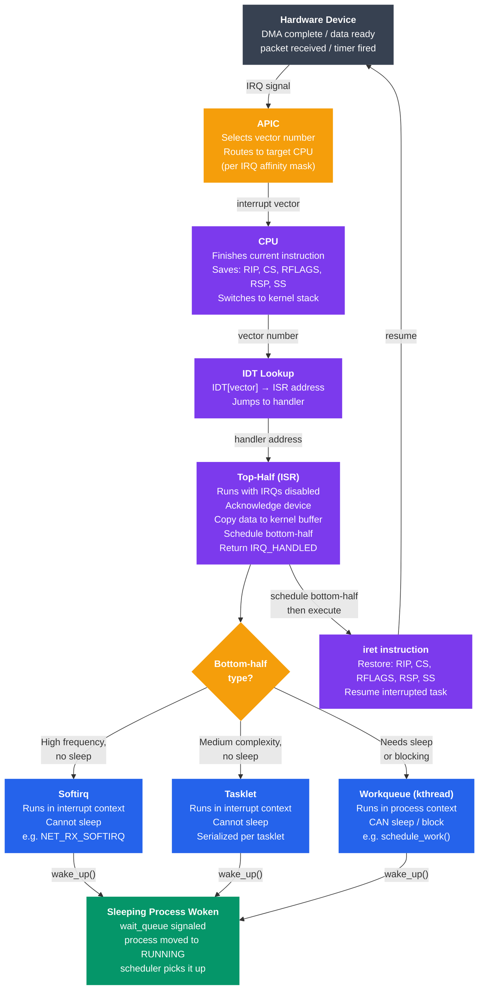

# Interrupt Handling

## What You'll Learn

In this tutorial, you will:

- Understand what interrupts are and why they are fundamental to OS design
- Distinguish hardware interrupts, software interrupts, and exceptions
- Explore the Interrupt Vector Table and Interrupt Descriptor Table (IDT)
- Learn the top-half / bottom-half split and when to use softirq, tasklet, or workqueue
- Understand interrupt latency, jitter, and their impact on real-time systems
- Configure IRQ affinity to bind interrupts to specific CPU cores
- Compare polling vs interrupt-driven I/O and know when to use each

---

## Introduction

Without interrupts, the CPU would have to constantly poll every device to check if it needs attention — wasting enormous processing time on checking hardware that is almost always idle. Interrupts allow hardware to signal the CPU only when something needs to happen. The CPU can run user programs full-speed; when a disk read completes or a network packet arrives, the device raises an interrupt and the CPU briefly handles it before returning to whatever it was doing.

---

## What Is an Interrupt?

An interrupt is a signal to the CPU that causes it to stop its current execution, save its state, run a special handler function (the **Interrupt Service Routine**, ISR), and then restore state and resume where it left off.

```
Normal execution:
  CPU: [task A] → [task A] → [task A] → [task A] → ...

With interrupt:
  CPU: [task A] → [task A] → |IRQ| → [ISR] → [task A] → [task A]
                               ↑         ↑
                         hardware     ~microseconds
                         raises       to handle
                         interrupt
```

### Three Categories

| Type | Trigger | Example |
|------|---------|---------|
| **Hardware interrupt** | External device signals CPU | NIC receives packet, disk completes I/O, timer fires |
| **Software interrupt** (trap/syscall) | `int` instruction or `syscall` instruction in software | System call, `int 0x80` on x86 |
| **Exception** | CPU detects error condition | Page fault, division by zero, invalid opcode |

---

## Hardware Interrupts

### IRQ Lines and the PIC / APIC

On x86 systems, hardware devices connect to the CPU through an interrupt controller:

- **PIC** (Programmable Interrupt Controller, legacy 8259A) — 15 IRQ lines, used in older/simple systems
- **APIC** (Advanced PIC) — modern x86; each CPU core has a **LAPIC** (Local APIC), and an **IOAPIC** routes device IRQs to the right LAPIC

```
Device → IOAPIC → LAPIC (CPU core) → CPU interrupt pin
            ↑
      Routes IRQ 10 to CPU 0, IRQ 11 to CPU 3, etc.
      (configurable — IRQ affinity)
```

```bash
# View IRQ assignments on Linux
cat /proc/interrupts
#            CPU0   CPU1   CPU2   CPU3
#   0:        46      0      0      0   IO-APIC   2-edge      timer
#  16:         0      0      0   1842   IO-APIC  16-fasteoi  ehci_hcd
# 120:         0    554      0      0   PCI-MSI 524288-edge  nvme0q0
# LOC:   4521038  4487291 ...        Local timer interrupts
```

### MSI and MSI-X

Modern PCIe devices use **MSI** (Message Signaled Interrupts) instead of physical IRQ lines. They write a special memory address to signal an interrupt. This allows:

- More interrupt vectors (MSI-X supports up to 2048)
- Per-queue interrupts for multi-queue NVMe/NICs (one IRQ per CPU core)

```bash
# Check if a device uses MSI-X
lspci -v | grep -A 10 "Ethernet"
# Capabilities: [80] MSI-X: Enable+ Count=8 Masked-
#   Table: BAR=3 offset=00003000
```

---

## Interrupt Vector Table and IDT

### x86 Interrupt Vector Table

The CPU uses an **interrupt vector** (a number 0–255) to index into a table of handler addresses. On x86-64, this table is the **IDT** (Interrupt Descriptor Table).

```
IDT (256 entries):
┌────────────┬────────────────────────────────────────────────────┐
│  Vector 0  │  handler: divide_error()          (exception)     │
│  Vector 1  │  handler: debug()                 (exception)     │
│  Vector 2  │  handler: nmi()                   (NMI)          │
│  Vector 3  │  handler: int3()                  (breakpoint)   │
│  Vector 6  │  handler: invalid_op()            (invalid opcode)│
│  Vector 14 │  handler: page_fault()            (page fault)   │
│  Vector 32 │  handler: timer_interrupt()       (IRQ 0)        │
│  Vector 33 │  handler: keyboard_interrupt()    (IRQ 1)        │
│    ...     │  ...                                              │
│  Vector 128│  handler: system_call()           (syscall trap) │
│    ...     │  ...                                             │
│  Vector 255│  (free / platform-specific)                      │
└────────────┴────────────────────────────────────────────────────┘
```

### What Happens When an Interrupt Fires

```
1. Device raises IRQ
2. APIC picks a vector number, signals CPU
3. CPU finishes current instruction (atomic boundary)
4. CPU pushes: SS, RSP, RFLAGS, CS, RIP onto kernel stack
   (saving the interrupted context)
5. CPU loads handler address from IDT[vector]
6. CPU jumps to handler (now in kernel mode)
7. Handler runs (ISR top-half)
8. Handler calls iret (interrupt return)
9. CPU restores: RIP, CS, RFLAGS, RSP, SS
10. Execution resumes where it was interrupted
```

```bash
# View the IDT (requires kernel debugger or /proc)
# On Linux, interrupts are described in /proc/interrupts

# Count total interrupts per second
watch -n 1 "awk 'NR>1{for(i=2;i<=NF;i++) sum+=$i} END{print sum}' /proc/interrupts"
```

---

## Top-Half vs Bottom-Half Processing

### The Problem with Long ISRs

Interrupt handlers run with interrupts disabled (or at elevated priority). A long ISR blocks other interrupts, increasing latency for everything else. The solution: do the minimum in the ISR (top-half) and defer the rest to a safe context (bottom-half).

```
Device raises interrupt
        │
        ▼
┌─────────────────────────────────────────────────────────┐
│  TOP-HALF (ISR — runs with interrupts disabled)         │
│  • Acknowledge the interrupt to the device              │
│  • Copy data from device to a kernel buffer             │
│  • Schedule bottom-half to run later                    │
│  • Return IMMEDIATELY (microseconds)                    │
└─────────────────────────────────────────────────────────┘
        │
        │  (interrupts re-enabled, other IRQs can fire)
        ▼
┌─────────────────────────────────────────────────────────┐
│  BOTTOM-HALF (deferred — runs in a safe context)        │
│  • Process the buffered data                            │
│  • Update kernel data structures                        │
│  • Wake up waiting processes                            │
│  • Run network stack, decode packets, etc.              │
└─────────────────────────────────────────────────────────┘
```

### Linux Bottom-Half Mechanisms

Linux provides three mechanisms for deferred interrupt processing, in order of increasing flexibility and overhead:

#### 1. Softirq

The lowest-level, fastest bottom-half. Runs in interrupt context (no sleeping allowed). There are a small fixed set of softirq types.

```c
// Softirq types (defined in linux/interrupt.h):
// HI_SOFTIRQ       — high-priority tasklets
// TIMER_SOFTIRQ    — timer processing
// NET_TX_SOFTIRQ   — network transmit
// NET_RX_SOFTIRQ   — network receive  ← major user
// BLOCK_SOFTIRQ    — block device completion
// TASKLET_SOFTIRQ  — general tasklets
// SCHED_SOFTIRQ    — scheduler load balancing
// RCU_SOFTIRQ      — RCU callbacks
```

Softirqs run on the CPU that raised them (or via `ksoftirqd` thread if too many arrive). They can run concurrently on multiple CPUs, so they need lock-free or lock-careful code.

#### 2. Tasklet

Built on top of softirqs. Easier to use: tasklets of the same type are serialized (won't run on two CPUs simultaneously). Suitable for most driver bottom-halves.

```c
#include <linux/interrupt.h>

/* Define the bottom-half function */
static void my_tasklet_fn(unsigned long data)
{
    /* process data — no sleeping allowed */
    struct my_device *dev = (struct my_device *)data;
    process_received_data(dev);
}

/* Declare the tasklet */
DECLARE_TASKLET(my_tasklet, my_tasklet_fn, (unsigned long)&my_dev);

/* In the ISR (top-half), schedule it */
irqreturn_t my_isr(int irq, void *dev_id)
{
    /* acknowledge interrupt, copy data to buffer */
    copy_data_from_device(dev_id);

    /* schedule bottom-half */
    tasklet_schedule(&my_tasklet);

    return IRQ_HANDLED;
}
```

#### 3. Workqueue

The most flexible bottom-half. Runs in process context (a kernel thread), so it **can sleep**, call blocking functions, and take mutexes. Higher overhead than tasklets.

```c
#include <linux/workqueue.h>

static struct work_struct my_work;

static void my_work_fn(struct work_struct *work)
{
    /* process context — sleeping is allowed! */
    struct my_device *dev = container_of(work, struct my_device, work);
    mutex_lock(&dev->lock);
    complex_processing(dev);      /* can sleep */
    mutex_unlock(&dev->lock);
    wake_up(&dev->wait_queue);
}

/* In init: */
INIT_WORK(&my_work, my_work_fn);

/* In ISR top-half: */
schedule_work(&my_work);
```

### Comparison

| Mechanism | Context | Can Sleep? | Concurrency | Overhead | Use Case |
|-----------|---------|-----------|-------------|----------|----------|
| Softirq | Interrupt | No | Multi-CPU parallel | Lowest | Network RX/TX, timer |
| Tasklet | Interrupt | No | Serialized per tasklet | Low | Most device drivers |
| Workqueue | Process (kthread) | Yes | Full | Medium | USB, I2C, any blocking work |

---

## Interrupt Latency and Jitter

### Interrupt Latency

**Interrupt latency** is the time from when the device raises the interrupt to when the first instruction of the ISR executes.

```
Sources of interrupt latency:
  1. Hardware propagation:  ~100 ns  (device → APIC → CPU pin)
  2. Instruction completion: ~1 ns   (CPU finishes current instruction)
  3. Context save:           ~50 ns  (push registers)
  4. IDT lookup + jump:      ~10 ns
  5. Interrupt masking delay:variable (if IRQs were disabled)

Typical total: 1–10 µs on a non-real-time Linux kernel
               < 100 µs worst-case with PREEMPT_RT patch
```

### Jitter

**Jitter** is the variation in interrupt latency over time. A system might handle most interrupts in 5 µs but occasionally take 500 µs due to:

- Cache misses in the ISR
- Long critical sections holding `spin_lock_irqsave`
- SMI (System Management Interrupts from firmware — invisible to Linux)
- NUMA effects (interrupt arrives on wrong CPU, data is on remote NUMA node)

### Measuring Latency

```bash
# cyclictest: the standard tool for measuring interrupt/scheduling latency
apt install rt-tests
sudo cyclictest --mlockall --smp --priority=80 --interval=200 --distance=0

# Output example:
# T: 0 (12345) P:80 I:200 C:100000 Min:    4 Act:    7 Avg:    8 Max:   42
#                                          ^^^                       ^^^
#                                   min latency (µs)        max latency (µs)

# ftrace: trace individual interrupt latencies
echo function > /sys/kernel/debug/tracing/current_tracer
echo 1 > /sys/kernel/debug/tracing/events/irq/irq_handler_entry/enable
cat /sys/kernel/debug/tracing/trace | head -30
```

### PREEMPT_RT

The standard Linux kernel is not fully preemptible — spin locks disable preemption. The **PREEMPT_RT** patch converts most spin locks to sleeping mutexes, making the kernel fully preemptible and dramatically reducing worst-case latency.

```bash
# Check kernel preemption model
uname -a
grep CONFIG_PREEMPT /boot/config-$(uname -r)
# CONFIG_PREEMPT_RT=y  ← real-time kernel
# CONFIG_PREEMPT=y     ← voluntary preemption (desktop default)
# CONFIG_PREEMPT_NONE=y ← server default (lowest overhead)
```

---

## IRQ Affinity and CPU Binding

By default the kernel (or IRQBALANCE daemon) assigns interrupts to CPU cores automatically. You can override this to optimize for NUMA locality or to dedicate cores to specific devices.

### Viewing and Setting Affinity

```bash
# View current IRQ affinity (bitmask of CPUs)
cat /proc/irq/120/smp_affinity
# f   ← hex bitmask: 0b1111 = CPUs 0-3 all eligible

cat /proc/irq/120/smp_affinity_list
# 0-3  ← human-readable CPU list

# Pin IRQ 120 to CPU 2 only (bitmask 0b0100 = 0x4)
echo 4 | sudo tee /proc/irq/120/smp_affinity

# Or by CPU list
echo 2 | sudo tee /proc/irq/120/smp_affinity_list

# Pin all NVMe interrupts to CPUs 4-7
for irq in $(grep nvme /proc/interrupts | awk -F: '{print $1}'); do
    echo "8-f" | sudo tee /proc/irq/$irq/smp_affinity
done
```

### IRQBALANCE Daemon

```bash
# IRQBALANCE automatically distributes IRQs for optimal NUMA/cache locality
systemctl status irqbalance

# View its current decisions
irqbalance --debug --oneshot 2>&1 | head -40

# Ban irqbalance from touching a specific IRQ (for manual control)
echo "IRQBALANCE_BANNED_INTERRUPTS=120 121" >> /etc/default/irqbalance
systemctl restart irqbalance
```

### NOHZ_FULL — Tickless CPUs

For latency-critical workloads, you can isolate CPUs from the kernel's scheduling tick:

```
# Add to kernel boot parameters (GRUB):
isolcpus=4-7 nohz_full=4-7 rcu_nocbs=4-7

# Effect:
# CPUs 4-7 receive no scheduler tick interrupts (0 jitter from timer)
# Useful for real-time tasks, network packet processing (DPDK)
# Managed by: taskset -c 4 myapp   or   numactl --cpunodebind=1
```

---

## Polling vs Interrupt-Driven I/O

Both are valid strategies; the right choice depends on the expected event rate.

### Polling (Busy-Wait)

The CPU continuously checks the device status register until data is ready.

```c
// Polling example: wait for serial port transmit buffer empty
while (!(inb(PORT + LSR) & LSR_THRE)) {
    /* spin — CPU doing nothing useful */
}
outb(PORT, data);
```

```
CPU utilization:  100% (even when device has no data)
Latency:          Very low (sub-microsecond — no interrupt overhead)
Power:            High (no sleep)
Good for:         High-frequency devices (>10,000 events/sec)
Bad for:          Low-frequency devices (keyboard, slow sensors)
```

### Interrupt-Driven I/O

The CPU starts an I/O operation and goes to sleep (or continues other work). The device raises an interrupt when done.

```c
// Interrupt-driven: start transfer, return immediately
start_dma_transfer(device, buffer, len);
wait_event_interruptible(device->wait_queue, device->transfer_done);
// CPU is free until the interrupt arrives
```

```
CPU utilization:  Low (CPU does other work or sleeps)
Latency:          Higher (interrupt overhead: ~1–10 µs)
Power:            Low (CPU can enter C-states)
Good for:         Low/medium frequency devices (disk, keyboard, NIC at normal load)
Bad for:          Very high frequency devices (interrupt storm)
```

### Hybrid: NAPI (New API) for Networks

Linux NICs use a hybrid approach called **NAPI**:

1. First packet arrives → interrupt fires → top-half disables interrupts for this NIC
2. NAPI poll loop runs in softirq context, draining all available packets (polling)
3. When queue is empty → re-enable interrupts

```
Low traffic:  interrupt per packet (efficient)
High traffic: switch to polling (avoid interrupt storm)
                                  ↑ "interrupt coalescing"
```

```bash
# View NAPI/interrupt coalescing settings
ethtool -c eth0
# Coalesce parameters for eth0:
# rx-usecs: 50        ← wait 50 µs before firing RX interrupt
# rx-frames: 25       ← or wait for 25 frames, whichever first

# Tune coalescing (lower latency: reduce usecs; higher throughput: increase)
ethtool -C eth0 rx-usecs 0 rx-frames 1    # lowest latency
ethtool -C eth0 rx-usecs 100 rx-frames 64 # higher throughput
```

---

## Interrupt Handling Flow Diagram



---

## Registering an Interrupt Handler in Linux

```c
#include <linux/interrupt.h>

#define MY_IRQ 17

/* The ISR (top-half) */
static irqreturn_t my_handler(int irq, void *dev_id)
{
    struct my_device *dev = (struct my_device *)dev_id;

    /* Check if this interrupt is for us (shared IRQ lines) */
    if (!device_caused_interrupt(dev))
        return IRQ_NONE;

    /* Acknowledge the interrupt */
    device_ack_interrupt(dev);

    /* Schedule tasklet for bottom-half processing */
    tasklet_schedule(&dev->tasklet);

    return IRQ_HANDLED;
}

/* In driver init: */
static int my_driver_probe(struct platform_device *pdev)
{
    int ret;

    ret = request_irq(MY_IRQ,          /* IRQ number */
                      my_handler,       /* handler function */
                      IRQF_SHARED,      /* flags: shared with other drivers */
                      "my_driver",      /* name shown in /proc/interrupts */
                      &my_dev);         /* passed back to handler as dev_id */
    if (ret) {
        pr_err("Failed to request IRQ %d: %d\n", MY_IRQ, ret);
        return ret;
    }
    return 0;
}

/* In driver remove: */
static int my_driver_remove(struct platform_device *pdev)
{
    free_irq(MY_IRQ, &my_dev);
    return 0;
}
```

---

## Useful Commands Summary

```bash
# View all IRQs, which CPUs handle them, and handler names
cat /proc/interrupts

# View per-IRQ affinity
for irq in $(awk 'NR>1{print $1}' /proc/interrupts | tr -d ':'); do
    printf "IRQ %3s affinity: %s\n" $irq "$(cat /proc/irq/$irq/smp_affinity_list 2>/dev/null)"
done

# Watch interrupt rate in real time
watch -n 1 cat /proc/interrupts

# Show softirq counts
cat /proc/softirqs

# Profile interrupt distribution with perf
perf stat -e irq:irq_handler_entry sleep 5

# Trace specific IRQ handlers
perf trace -e irq:irq_handler_entry --filter "irq==120" sleep 5
```

---

## Summary

- An **interrupt** allows hardware to signal the CPU asynchronously; without interrupts, the CPU would waste cycles polling every device
- The **IDT** maps interrupt vector numbers to handler addresses; exceptions (vectors 0-31), hardware IRQs, and software traps all use the same mechanism
- The **top-half** ISR runs with interrupts disabled, does the minimum work, and schedules a **bottom-half** for the rest
- Linux provides three bottom-half mechanisms: **softirq** (fastest, runs in interrupt context), **tasklet** (serialized, interrupt context), and **workqueue** (can sleep, process context)
- **Interrupt latency** is how long it takes to start the ISR; **jitter** is the variation in that latency; PREEMPT_RT reduces worst-case latency for real-time workloads
- **IRQ affinity** lets you bind interrupts to specific CPU cores for NUMA locality or to dedicate cores to I/O processing
- **Polling** has lower latency but wastes CPU; **interrupts** save CPU but add overhead; **NAPI** uses a hybrid approach that automatically switches between the two based on load
