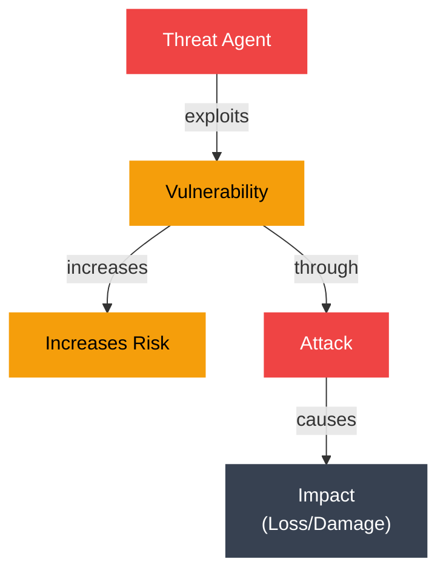
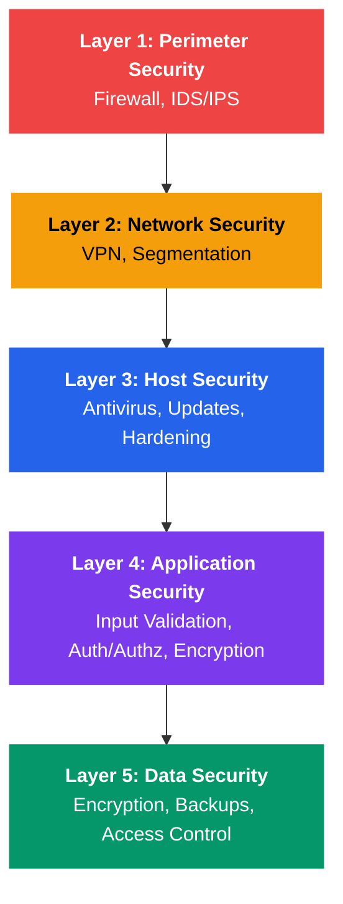

# Security Fundamentals

## Kya seekhoge is note mein?

Socho ek second — tumne apna Paytm ya PhonePe app khola, balance check kiya, ek transaction kiya, aur app ne bina rukawat ke sab kuch turant kar diya. Peeche kitni cheezein chal rahi hain jo tumhe dikhti nahi — tumhara data koi aur na dekh paaye (confidentiality), tumhara balance koi tamper na kar paaye (integrity), aur app 3am ko bhi down na ho (availability). Yeh sab **operating system security** ke fundamentals hain, aur wahi hum is note mein deeply samjhenge.

Is tutorial mein cover karenge:

- CIA triad: confidentiality, integrity, aur availability — security ke teen pillars
- Threat, vulnerability, aur attack mein difference
- Core security principles jo har production system follow karta hai
- Protection domains aur CPU privilege rings (Ring 0 se Ring 3)
- Security policy vs mechanism — "kya karna hai" vs "kaise karna hai"
- Trusted Computing Base (TCB) ka concept
- Classic security models — Bell-LaPadula, Biba, Clark-Wilson
- Common vulnerability types aur unki classification
- CVE database aur security patching

**Time chahiye**: 45-60 minutes

> [!tip]
> Yeh topic sirf "theory" nahi hai — jab tum production mein Node.js API deploy karte ho, ya koi Spring Boot service run karte ho, yeh saare concepts directly apply hote hain. Least privilege, defense in depth — yeh sab tumhare deployment decisions ko drive karte hain.

---

## 1. CIA Triad: Security ke Teen Goals

Security ka poora building tin pillars pe khada hai — **Confidentiality, Integrity, Availability**. Isko CIA triad kehte hain (FBI wali CIA nahi, confuse mat hona).

```
        CIA TRIAD
        =========
    
    Confidentiality
         /\
        /  \
       /    \
      /      \
     /________\
    
    Integrity <---> Availability
```

Socho isko ek bank locker system ki tarah — sirf tum (authorized person) locker khol sako (confidentiality), koi bhi tumhare locker ka contents change na kar sake (integrity), aur jab bhi tumhe zaroorat ho, bank open ho aur locker access ho paaye (availability). Teeno mein se ek bhi miss ho jaaye, poora system fail hai.

### Confidentiality — "Sirf authorized banda hi dekh sakta hai"

**Kya hota hai?** Confidentiality ka matlab hai ki information sirf unhi logo/systems tak pahunche jinko access karne ki permission hai. Baaki sab ke liye woh data invisible honi chahiye.

Socho Swiggy app mein tumhara saved credit card number — sirf tum aur Swiggy ka payment system usko dekh sakta hai (woh bhi masked form mein), koi random delivery boy ya dusra user usko access nahi kar sakta. Yeh confidentiality hai.

**Kaise achieve karte hain (Mechanisms)**:
- **Encryption** — data ko rest mein (disk pe) aur transit mein (network pe) encrypt karna, taaki beech mein koi padhe toh bhi samajh na paaye
- **Access control** — permissions, ACLs (Access Control Lists) set karna ki kaun kya padh sakta hai
- **Authentication** — pehle verify karo ki banda wahi hai jo woh claim kar raha hai (jaise UPI PIN daalna)

**Threats (khatre)**:
- Unauthorized data access — koi bina permission ke file padh le
- Eavesdropping — network traffic beech mein intercept karna (jaise koi tumhara WiFi traffic sniff kare)
- Data leaks — accidental ya intentional data exposure

**Example**:
```c
// File permission check for confidentiality
#include <stdio.h>
#include <sys/stat.h>
#include <unistd.h>

int check_file_confidentiality(const char *filename) {
    struct stat file_stat;
    
    if (stat(filename, &file_stat) != 0) {
        perror("stat");
        return -1;
    }
    
    // Check if file is readable by others
    if (file_stat.st_mode & S_IROTH) {
        printf("WARNING: File %s is world-readable!\n", filename);
        printf("Confidentiality risk detected.\n");
        return 0;
    }
    
    printf("File %s has appropriate confidentiality settings.\n", filename);
    return 1;
}

int main() {
    check_file_confidentiality("/etc/shadow");  // Should not be world-readable
    check_file_confidentiality("/etc/passwd");  // Typically world-readable
    return 0;
}
```

Yeh code check karta hai ki `/etc/shadow` (jisme password hashes store hote hain) galti se world-readable toh nahi ban gaya. Agar ban gaya, toh koi bhi user usko padh sakta hai — bahut bada confidentiality risk.

### Integrity — "Data tamper toh nahi hua"

**Kya hota hai?** Integrity ensure karti hai ki data accurate hai aur usse koi unauthorized tarike se badla nahi gaya. Socho IRCTC ka train ticket — booking ke baad koi beech mein tumhara seat number ya PNR silently change nahi kar sakta. Agar kar de, toh integrity violate ho gayi.

**Kaise achieve karte hain (Mechanisms)**:
- **Checksums aur hashing** (SHA-256, MD5) — data ka ek "fingerprint" banate hain, agar data change hua toh fingerprint bhi change ho jaayega
- **Digital signatures** — cryptographically prove karte hain ki data kisne banaya aur woh unchanged hai
- **File permissions** (write protection) — sirf authorized log hi write kar sakein
- **Version control** — Git jaisa system jo har change ko track karta hai

**Threats**:
- Data modification — unauthorized changes
- Data corruption — accidental ya malicious damage
- Man-in-the-middle attacks — network mein beech mein data intercept karke modify karna

**Example (Bash)**:
```bash
#!/bin/bash
# Integrity checking using SHA-256 checksums

# Create a checksum for critical system files
echo "Creating checksums for system binaries..."
sha256sum /bin/bash /bin/ls /bin/cat > system_checksums.txt

# Later, verify integrity
echo "Verifying integrity..."
if sha256sum -c system_checksums.txt; then
    echo "✓ All files passed integrity check"
else
    echo "✗ INTEGRITY VIOLATION DETECTED!"
    echo "System may be compromised!"
fi
```

Yahan hum critical system binaries (`/bin/bash`, `/bin/ls`, `/bin/cat`) ka SHA-256 checksum bana rahe hain. Baad mein jab bhi verify karna ho, checksum dobara calculate karke compare kar lete hain — agar match nahi hua, matlab koi file tamper hui hai (jaise koi malware ne `/bin/ls` ko replace kar diya ho).

### Availability — "System jab chahiye, tab available ho"

**Kya hota hai?** Availability ensure karti hai ki authorized users ko system/resource use karna ho, toh woh mile — bina delay ke, bina downtime ke. Socho Zomato app agar lunch time pe (peak load) crash ho jaaye, toh confidentiality aur integrity perfect hone ke bawajood system useless hai.

**Kaise achieve karte hain (Mechanisms)**:
- **Redundancy** (RAID, clustering) — ek server fail ho toh dusra turant le le
- **Backup aur disaster recovery** — data loss se protection
- **Resource management** — DoS attacks se bachne ke liye resource limits
- **Fault tolerance** — system graceful degrade ho, crash na ho

**Threats**:
- Denial of Service (DoS) attacks — jaanbujh kar system ko overload karna
- System crashes
- Resource exhaustion — CPU, memory, disk, file descriptors khatam ho jaana

**Example**:
```c
// Simple resource limiting for availability
#include <stdio.h>
#include <sys/resource.h>

void set_resource_limits() {
    struct rlimit limit;
    
    // Limit CPU time to prevent resource exhaustion
    limit.rlim_cur = 10;  // 10 seconds soft limit
    limit.rlim_max = 15;  // 15 seconds hard limit
    
    if (setrlimit(RLIMIT_CPU, &limit) != 0) {
        perror("setrlimit CPU");
    } else {
        printf("CPU time limit set to %ld seconds\n", limit.rlim_cur);
    }
    
    // Limit number of open files
    limit.rlim_cur = 1024;
    limit.rlim_max = 2048;
    
    if (setrlimit(RLIMIT_NOFILE, &limit) != 0) {
        perror("setrlimit NOFILE");
    } else {
        printf("File descriptor limit set to %ld\n", limit.rlim_cur);
    }
}

int main() {
    set_resource_limits();
    printf("Resource limits configured for availability protection\n");
    return 0;
}
```

Yahan hum ek process ke CPU time aur open file descriptors pe limit laga rahe hain. Isse ek buggy ya malicious process poore system ko resources kha kar down nahi kar sakta — jaise ek greedy customer poori Swiggy kitchen ka gas na khatam kar de, uske liye har order ka ek limit hota hai.

> [!warning]
> CIA triad mein trade-offs hote hain. Bahut zyada encryption/checks (confidentiality/integrity) availability ko slow kar sakte hain. Real systems mein balance dhoondhna padta hai — jaise IRCTC peak booking time pe extra security checks add karne se system slow ho sakta hai.

---

## 2. Threats, Vulnerabilities, aur Attacks — Teeno Alag Cheez Hain

Bahut log inhe confuse karte hain, isliye clearly samajhte hain:

| Concept | Definition | Example |
|---------|-----------|---------|
| **Threat** | Potential danger jo kisi vulnerability ko exploit kar sakta hai | Malicious hacker, malware, natural disaster |
| **Vulnerability** | System mein weakness jise exploit kiya ja sakta hai | Buffer overflow bug, weak password, unpatched software |
| **Attack** | Threat dwara vulnerability ka actual exploitation | SQL injection, DoS attack, privilege escalation |

Socho apne ghar ki tarah — **threat** hai chor (jo koshish kar sakta hai ghar mein ghusne ki), **vulnerability** hai tumhara toota hua taala (weakness), aur **attack** hai jab chor us toote taale ka fayda uthake ghar mein ghus jaata hai. Agar taala mazboot hoga (no vulnerability), toh chor (threat) hone ke bawajood attack safal nahi hoga.



```
Relationship Diagram
====================

    Threat Agent
         |
         | exploits
         v
    Vulnerability ---------> Increases Risk
         |
         | through
         v
      Attack
         |
         | causes
         v
      Impact
   (Loss/Damage)
```

**Kyun zaroori hai yeh distinction?** Kyunki security strategy tumhe teeno level pe alag kaam karni padti hai:
- **Threat** ko poori tarah khatam nahi kar sakte (hackers hamesha rahenge duniya mein)
- **Vulnerability** ko patch/fix kar sakte ho (yahi sabse controllable part hai)
- **Attack** ko detect aur respond kar sakte ho (monitoring, incident response)

Isliye jab CRED ya Paytm jaisi company security audit karwati hai, woh basically apni vulnerabilities dhoondh rahi hoti hai — taaki threats attack mein convert na ho paayein.

---

## 3. Core Security Principles

Yeh woh fundamental rules hain jo har secure system design follow karta hai — chahe woh Linux kernel ho ya tumhara Node.js backend.

### Principle of Least Privilege — "Sirf utni hi power do jitni zaroorat hai"

**Kya hota hai?** Har user/process ko sirf utne hi privileges do jitne uska kaam karne ke liye zaroori hain — ek bhi extra nahi.

Socho Zomato ke delivery partner ko — usko sirf order details aur customer ka address dikhna chahiye, poora customer database access karne ki zaroorat nahi. Agar delivery app ka backend har delivery boy ko full database access de de, toh ek compromised delivery account poori company ka data leak kar sakta hai.

```bash
#!/bin/bash
# Example: Running a web server with minimal privileges

# Bad: Running as root
# sudo /usr/sbin/nginx

# Good: Running as unprivileged user
sudo -u www-data /usr/sbin/nginx

# Even better: Using capabilities instead of root
sudo setcap 'cap_net_bind_service=+ep' /usr/sbin/nginx
# Now nginx can bind to port 80 without being root
```

Yahan `nginx` ko root ke bajaye `www-data` user se run kar rahe hain. Aur `setcap` se bas woh specific capability de rahe hain (port 80 pe bind karna) jo usko chahiye — poora root access nahi. Isse agar `nginx` mein koi vulnerability exploit bhi ho jaaye, attacker ko poora system control nahi milta.

> [!tip]
> Node.js developers ke liye: production mein apna Express server root user se kabhi mat chalao. Docker container mein bhi non-root user use karo (`USER node` in Dockerfile).

### Defense in Depth — "Ek nahi, kai layers ki security"

**Kya hota hai?** Security ka ek hi layer kabhi bharosemand nahi hota — isliye multiple independent layers use karte hain, taaki agar ek fail ho jaaye toh dusra bachaye.

Socho ek bank ki security ki tarah — sirf ek guard nahi hota, balki gate pe security, CCTV cameras, vault ka alag lock, alarm system, aur police response — sab layers milke security banate hain. Agar guard so bhi jaaye, CCTV pakad legi. Agar CCTV fail ho jaaye, vault lock rok lega.



```
Defense in Depth Layers
=======================

    Perimeter ─────────────────┐
    Security    Firewall       │
                IDS/IPS        │ Layer 1: Network
                               │
    Network ───────────────────┤
    Security    VPN            │
                Segmentation   │ Layer 2: Network
                               │
    Host ──────────────────────┤
    Security    Antivirus      │
                Updates        │ Layer 3: System
                Hardening      │
                               │
    Application ───────────────┤
    Security    Input Valid.   │
                Auth/Authz     │ Layer 4: Application
                Encryption     │
                               │
    Data ──────────────────────┤
    Security    Encryption     │
                Backups        │ Layer 5: Data
                Access Control │
```

Ek real-world Indian fintech app (jaise CRED) mein dekho — firewall network level pe hai, VPN internal services connect karta hai, host level pe OS hardened hai, application level pe input validation aur JWT auth hai, aur data level pe database encrypted hai. Agar attacker ek layer todh bhi de, agli layer usko rok legi.

### Fail-Safe Defaults — "Default deny karo, explicitly allow karo"

**Kya hota hai?** System ka default behavior hamesha "access deny" hona chahiye — permissions ko explicitly grant karna padta hai, implicitly nahi milna chahiye.

Socho ek naye employee ka office access card — jab tak HR specifically usko kisi floor/room ka access na de, woh card kahin bhi nahi khulega. Yeh fail-safe default hai. Agar ulta hota (default sab kuch open, specifically restrict karna pade), toh ek mistake se sensitive area expose ho sakta hai.

```c
// Example: Secure file creation with fail-safe defaults
#include <stdio.h>
#include <fcntl.h>
#include <sys/stat.h>
#include <unistd.h>

int create_secure_file(const char *filename) {
    int fd;
    mode_t old_umask;
    
    // Set umask to create file with restrictive permissions
    // Fail-safe default: deny all access initially
    old_umask = umask(0077);  // Creates files as 0600 (owner only)
    
    fd = open(filename, O_CREAT | O_WRONLY | O_EXCL, 0600);
    
    umask(old_umask);  // Restore original umask
    
    if (fd == -1) {
        perror("open");
        return -1;
    }
    
    printf("Created file %s with secure permissions (0600)\n", filename);
    return fd;
}

int main() {
    int fd = create_secure_file("secure_data.txt");
    if (fd != -1) {
        write(fd, "Sensitive data\n", 15);
        close(fd);
    }
    return 0;
}
```

Yahan `umask(0077)` set kar rahe hain — matlab naya file default se hi sirf owner ke liye readable/writable banega (0600), baaki sabke liye deny by default.

### Complete Mediation — "Har baar check karo, ek baar nahi"

**Kya hota hai?** Har access request ko har baar verify karo — sirf pehli baar check karke result cache mat karo. Socho metro station mein — agar ek baar token check karke phir sabko andar-bahar free chodh do, koi bhi bina ticket ghus sakta hai. Har entry pe check hona chahiye.

### Open Design — "Security secrecy pe depend nahi honi chahiye"

**Kya hota hai?** Tumhare system ki security algorithm ya design secret rakhne pe depend nahi honi chahiye — security sirf keys/passwords ki secrecy pe honi chahiye, mechanism pe nahi. Jaise AES encryption algorithm poori duniya ko pata hai, phir bhi secure hai kyunki key secret hoti hai. Iske ulta "security through obscurity" (design chhupa ke security) ek anti-pattern maana jaata hai.

### Separation of Privilege — "Ek akela access nahi de sakta, do log chahiye"

**Definition**: Access ke liye multiple independent conditions poori honi chahiye — ek akela banda/factor kaafi nahi hona chahiye.

Socho bank locker ki tarah — dono chaabiyan chahiye (tumhari aur bank manager ki) locker kholne ke liye. Ya production database delete karna ho toh do senior engineers ki approval chahiye — yeh "two-person rule" hai.

```bash
#!/bin/bash
# Example: Two-person rule for critical operations

# Require two authorized users to approve deletion of critical data
delete_critical_data() {
    local file="$1"
    local approver1="$2"
    local approver2="$3"
    
    if [ "$approver1" == "$approver2" ]; then
        echo "Error: Two different approvers required"
        return 1
    fi
    
    # Check if both approvers are in the authorized group
    if groups "$approver1" | grep -q "data_admins" && \
       groups "$approver2" | grep -q "data_admins"; then
        echo "Approved by $approver1 and $approver2"
        rm -f "$file"
        echo "File deleted: $file"
    else
        echo "Error: Both approvers must be in data_admins group"
        return 1
    fi
}

# Usage: delete_critical_data "/critical/data.db" "admin1" "admin2"
```

Yeh 2FA (two-factor authentication) ka bhi philosophy hai — sirf password (ek factor) kaafi nahi, OTP bhi (dusra factor) chahiye. Isliye tumhare UPI transactions mein PIN + phone dono chahiye hote hain.

---

## 4. Protection Domains aur Privilege Rings

### CPU Privilege Rings — "Kaun kitni deep access kar sakta hai"

**Kya hota hai?** Modern CPUs hierarchical protection levels implement karte hain jinhe "rings" kehte hain. Yeh hardware-level security hai — software isse enforce nahi karta, CPU khud enforce karta hai.

Socho ek company ki hierarchy ki tarah — CEO (Ring 0) ke paas sab kuch access hai, managers (Ring 1-2) ke paas limited access, aur normal employees (Ring 3) ke paas sirf apna kaam karne jitna access. Ek normal employee directly company ke bank account access nahi kar sakta — usse ek proper channel (system call) se request karni padti hai.

```
Intel x86 Privilege Rings
=========================

         Ring 0 (Kernel Mode)
              /\
             /  \
            / OS \
           / Kernel\
          /________\
         /          \
        /   Ring 1   \
       /  (Unused on  \
      /   most OSes)   \
     /                  \
    /      Ring 2        \
   /    (Unused on        \
  /     most OSes)         \
 /                          \
/___________________________\
        Ring 3
    (User Mode)
    Applications
    
Ring 0: Full privileges (kernel code)
Ring 1-2: Device drivers (rarely used)
Ring 3: User applications (restricted)
```

- **Ring 0 (Kernel mode)**: Poora control — hardware access, memory management, sab kuch. Yahan sirf OS kernel chalta hai.
- **Ring 1-2**: Theoretically device drivers ke liye, par modern OS (Linux, Windows) mostly use nahi karte.
- **Ring 3 (User mode)**: Tumhara Chrome browser, Node.js app, koi bhi normal application — yahan restricted access hota hai. Direct hardware ya kernel memory access nahi.

**Kyun zaroori hai?** Agar sab process Ring 0 mein chalein (jaise purane DOS systems), toh ek buggy ya malicious app poora system crash ya compromise kar sakta hai. Rings ki wajah se ek normal app crash bhi ho jaaye, kernel safe rehta hai — jaise ek employee ka mistake poori company ko down nahi kar sakta.

### Switching Between Rings — System Calls ka Jaadu

Jab bhi tumhara user-mode program (Ring 3) ko kuch privileged karna hota hai — jaise file padhna, network pe data bhejna — woh direct nahi kar sakta. Usko **system call** karni padti hai, jo temporarily Ring 3 se Ring 0 mein "trap" karti hai, kaam karke wapas Ring 3 mein aa jaati hai.

```c
// System call: transitioning from Ring 3 to Ring 0
#include <stdio.h>
#include <unistd.h>
#include <sys/syscall.h>

void demonstrate_ring_transition() {
    printf("User mode (Ring 3): About to make system call\n");
    
    // System call causes transition to Ring 0
    pid_t pid = syscall(SYS_getpid);  // Trap into kernel
    
    // Returned to Ring 3
    printf("Back in user mode (Ring 3): PID = %d\n", pid);
}

int main() {
    demonstrate_ring_transition();
    
    // This would cause a protection fault (can't access Ring 0 directly):
    // write_to_kernel_memory(0xc0000000, data);  // Segmentation fault!
    
    return 0;
}
```

Yeh bilkul aise hai jaise tum bank counter pe ja ke request karte ho ("mera balance batao") — tum khud bank ke vault mein ghus ke apna balance calculate nahi karte. Bank clerk (kernel) verify karke tumhe result deta hai, aur tum wapas apni jagah (Ring 3) aa jaate ho.

### Protection Domain Example

```bash
#!/bin/bash
# Demonstrating protection domains in Linux

echo "=== User Mode (Ring 3) ==="
whoami
echo "Can access: user files, call system calls"

echo -e "\n=== Attempting Privileged Operation ==="
# Try to read kernel memory (will fail in Ring 3)
if dd if=/dev/kmem of=/dev/null bs=1 count=1 2>/dev/null; then
    echo "Success (running in Ring 0 or on old kernel)"
else
    echo "Failed: Cannot access kernel memory from user mode"
fi

echo -e "\n=== Checking CPU Ring Level ==="
# Use /proc to check privilege level
cat /proc/self/status | grep "^Uid:"
```

Yeh script dikhata hai ki `/dev/kmem` (kernel memory) ko directly access karne ki koshish karne pe user mode process fail ho jaata hai — protection domain kaam kar raha hai.

---

## 5. Security Policies vs Mechanisms

Yeh ek bahut important distinction hai jo bahut log confuse karte hain.

**Kya farak hai?** Policy batati hai "**kya**" protect karna hai aur "**kis condition** mein", jabki mechanism batata hai "**kaise**" us protection ko enforce karte hain. Socho company ka HR policy ("sirf managers salary data dekh sakte hain") vs actual implementation (system mein role-based access control code karna).

| Aspect | Policy | Mechanism |
|--------|--------|-----------|
| **Definition** | Kya protect karna hai aur kis condition mein | Protection kaise enforce hota hai |
| **Example** | "Users apni files hi padh sakte hain ya jinka unhe access diya gaya hai" | File permissions, ACLs, chmod/chown |
| **Flexibility** | OS change kiye bina badla ja sakta hai | OS mein fixed implementation |
| **Scope** | High-level rules | Low-level implementation |

**Kyun zaroori hai yeh separation?** Kyunki ek hi policy ko kai alag mechanisms se implement kiya ja sakta hai. Jaise "confidential files sirf authorized logo ko dikhein" ek policy hai — isko implement karne ke liye tum chmod use karo, ya ACL, ya encryption, ya SELinux — mechanism badal sakta hai, policy same rehti hai.

### Example: File Access

**Policy**: "Confidential files sirf authorized personnel ko accessible hone chahiye"

**Mechanisms** (isko implement karne ke alag tareeke):
```bash
#!/bin/bash
# Implementing the policy through various mechanisms

# Mechanism 1: DAC (Discretionary Access Control)
chmod 600 confidential.txt  # Only owner can access
chown alice:finance confidential.txt

# Mechanism 2: ACL (Access Control List)
setfacl -m u:bob:r confidential.txt  # Grant Bob read access

# Mechanism 3: Encryption
gpg --encrypt --recipient alice@company.com confidential.txt

# Mechanism 4: SELinux (MAC)
chcon -t confidential_file_t confidential.txt
# SELinux policy enforces access based on context
```

Ek hi policy ko implement karne ke chaar alag tareeke dikhaye — DAC (discretionary, owner decide karta hai), ACL (fine-grained), encryption (content level protection), aur SELinux (mandatory access control, jahan admin decide karta hai, owner nahi).

---

## 6. Trusted Computing Base (TCB)

**Kya hota hai?** TCB woh saara hardware, firmware, aur software hai jo system ki security ke liye "critical" hai — agar TCB compromise ho gaya, toh poori security guarantee tooti hai.

Socho isko bank ke "trust boundary" ki tarah — bank ke vault, uski security system, aur core banking software TCB hain. Agar yeh compromise ho jaaye, toh koi bhi baaki security measure (jaise customer ka apna PIN) matter nahi karega. Lekin bank ka lobby furniture ya waiting area TCB ka part nahi hai — woh compromise ho bhi jaaye, core security affect nahi hoti.

```
TCB Components
==============

    +----------------------------------+
    |         Applications             |  (Outside TCB)
    +----------------------------------+
    |      System Libraries            |  (Part of TCB)
    +----------------------------------+
    |      Operating System Kernel     |  (Core TCB)
    +----------------------------------+
    |      Hardware (CPU, MMU)         |  (Foundation)
    +----------------------------------+

TCB Properties:
- Must be tamper-resistant
- Must be correct (no bugs)
- Should be as small as possible (smaller = fewer bugs)
- Must be verifiable
```

**Kyun TCB ko chota rakhna zaroori hai?** Simple hai — jitna zyada code TCB mein hoga, utni zyada bugs hone ka chance hai, aur ek bhi bug poori security compromise kar sakta hai. Isliye modern secure systems (microkernels jaise seL4) TCB ko minimum rakhne ki koshish karte hain — jitna kam critical code, utna easy verify karna.

> [!info]
> Yeh bilkul software engineering ke "attack surface reduction" jaisa hai. Jitna kam code production mein critical path pe hoga, utna kam risk. Yeh principle tumhare Node.js microservices design mein bhi apply hota hai — jitni kam services sensitive data touch karein, utna better.

### Reducing TCB Size — Privilege Separation

```c
// Example: Privilege separation to minimize TCB
#include <stdio.h>
#include <unistd.h>
#include <sys/types.h>

int main() {
    // Start with elevated privileges (part of TCB)
    if (getuid() == 0) {
        printf("Running as root (in TCB)\n");
        
        // Do privileged initialization
        FILE *fp = fopen("/var/log/myapp.log", "a");
        
        // Drop privileges ASAP to minimize TCB exposure
        if (setuid(1000) == 0) {
            printf("Dropped privileges to user 1000 (outside TCB)\n");
        }
        
        // Now process untrusted data outside TCB
        char buffer[256];
        printf("Enter data: ");
        fgets(buffer, sizeof(buffer), stdin);
        
        if (fp) {
            fprintf(fp, "Logged: %s", buffer);
            fclose(fp);
        }
    }
    
    return 0;
}
```

Idea yeh hai — program root privileges se start hota hai (jaise log file open karne ke liye, jo restricted directory mein hai), lekin jaise hi privileged kaam ho jaata hai, turant `setuid()` se privileges drop kar deta hai. Isse untrusted user input process karte waqt process ke paas root access nahi hota — agar koi buffer overflow bhi ho jaaye, attacker ko root nahi milta. Yeh bilkul nginx worker processes ka pattern hai — master process root se start hota hai (port 80 bind karne ke liye), phir worker processes unprivileged user pe drop ho jaate hain.

---

## 7. Security Models — Formal Rules for Access Control

Yeh mathematical models hain jo define karte hain ki information kaise flow kar sakti hai system mein. Yeh mostly military aur high-security systems se aaye hain, par unke principles commercial systems mein bhi use hote hain.

### Bell-LaPadula Model (Confidentiality-focused)

**Goal**: Information high security level se low security level tak flow na ho — matlab secrets "neeche" na leak hon.

**Rules**:
- **Simple Security Property** (no read up): Level L wala subject apne se **upar** level ke objects nahi padh sakta
- **Star Property** (no write down): Level L wala subject apne se **neeche** level pe write nahi kar sakta

Socho ek defence organization ki tarah — ek "Secret" clearance wala officer "Top Secret" documents nahi padh sakta (no read up — usse itni sensitive info dena risky hai). Aur woh apni Secret-level knowledge ko "Unclassified" report mein bhi nahi likh sakta (no write down — kyunki isse Secret info leak ho jaayegi neeche ke logo tak).

```
Bell-LaPadula Example
=====================

Security Levels: Top Secret > Secret > Confidential > Unclassified

User (Secret clearance):
  ✓ Can read: Secret, Confidential, Unclassified
  ✗ Cannot read: Top Secret (no read up)
  
  ✓ Can write: Secret, Top Secret
  ✗ Cannot write: Confidential, Unclassified (no write down)
```

### Biba Model (Integrity-focused)

**Goal**: Information low integrity se high integrity tak flow na ho — matlab "kharab" ya unverified data high-trust jagah pe corrupt na kare.

**Rules**:
- **Simple Integrity Property** (no read down): Level L wala subject apne se **neeche** level ke objects nahi padh sakta (kyunki woh contaminated ho sakte hain)
- **Star Integrity Property** (no write up): Level L wala subject apne se **upar** level pe write nahi kar sakta (kyunki woh corrupt kar sakta hai)

Socho ek e-commerce ki payment verification pipeline ki tarah — jo data abhi "unverified" hai (jaise koi naya customer ka claim), usse "verified" ya "checked" level ke financial records ko modify karne ki permission nahi honi chahiye. Isse fraud/galat data core system ko corrupt nahi kar payega. Biba, Bell-LaPadula ka bilkul opposite hai — ek confidentiality ke liye "upar dekhna" rokta hai, dusra integrity ke liye "neeche se lena" rokta hai.

```
Biba Example (Database System)
===============================

Integrity Levels: Verified > Checked > Unverified

Process (Checked integrity):
  ✓ Can read: Checked, Verified
  ✗ Cannot read: Unverified (no read down - prevents contamination)
  
  ✓ Can write: Checked, Unverified
  ✗ Cannot write: Verified (no write up - prevents corruption)
```

### Clark-Wilson Model (Integrity via Well-Formed Transactions)

**Goal**: Data sirf well-defined, controlled transactions ke through hi change ho — random direct modification allowed nahi.

**Components**:
- **Constrained Data Items (CDIs)**: Protected critical data (jaise bank balance)
- **Unconstrained Data Items (UDIs)**: Unprotected data (jaise raw user input)
- **Transformation Procedures (TPs)**: Woh procedures jo data ko validate aur transform karke change karte hain
- **Integrity Verification Procedures (IVPs)**: Jo verify karte hain ki data abhi bhi consistent state mein hai

Yeh model bilkul banking system ka core hai — tum apna bank balance directly edit nahi kar sakte (CDI protected hai). Har change ek "transaction" (TP) ke through hoti hai — jaise `transfer_funds()` — jo pehle verify karta hai (IVP) ki accounts consistent hain, phir atomic transaction karta hai. Yeh double-entry bookkeeping ka digital version hai.

```bash
#!/bin/bash
# Clark-Wilson model example: banking transaction

# IVP: Integrity Verification Procedure
verify_account_integrity() {
    local account_file="$1"
    local checksum=$(sha256sum "$account_file" | awk '{print $1}')
    local stored_checksum=$(cat "${account_file}.checksum" 2>/dev/null)
    
    if [ "$checksum" == "$stored_checksum" ]; then
        return 0  # Integrity verified
    else
        return 1  # Integrity violation
    fi
}

# TP: Transformation Procedure (well-formed transaction)
transfer_funds() {
    local from_account="$1"
    local to_account="$2"
    local amount="$3"
    
    # Verify integrity before transaction
    if ! verify_account_integrity "$from_account" || \
       ! verify_account_integrity "$to_account"; then
        echo "Error: Account integrity check failed"
        return 1
    fi
    
    # Atomic transaction (both succeed or both fail)
    (
        flock -x 200  # Exclusive lock
        
        # Debit from source
        local from_balance=$(cat "$from_account")
        if [ "$from_balance" -lt "$amount" ]; then
            echo "Error: Insufficient funds"
            return 1
        fi
        echo $((from_balance - amount)) > "$from_account"
        
        # Credit to destination
        local to_balance=$(cat "$to_account")
        echo $((to_balance + amount)) > "$to_account"
        
        # Update checksums (maintain integrity)
        sha256sum "$from_account" | awk '{print $1}' > "${from_account}.checksum"
        sha256sum "$to_account" | awk '{print $1}' > "${to_account}.checksum"
        
        echo "Transfer complete: $amount from $from_account to $to_account"
    ) 200>/var/lock/accounts.lock
}
```

Dekho, `transfer_funds` ek "well-formed transaction" hai — pehle integrity verify karta hai, phir `flock` se exclusive lock leta hai (taaki race condition na ho), atomically debit-credit karta hai, aur end mein checksum update karta hai. Yeh exactly Clark-Wilson model ka real implementation hai — jaisa UPI backend systems mein hota hai.

### Model Comparison Table

| Model | Focus | Key Principle | Use Case |
|-------|-------|---------------|----------|
| **Bell-LaPadula** | Confidentiality | No read up, no write down | Military classification |
| **Biba** | Integrity | No read down, no write up | Database systems |
| **Clark-Wilson** | Integrity | Well-formed transactions | Commercial applications (banking, e-commerce) |

---

## 8. Common Vulnerabilities

Ab baat karte hain un common weaknesses ki jo attackers exploit karte hain.

### Buffer Overflow — Sabse Classic Vulnerability

**Kya hota hai?** Jab program ek fixed-size buffer mein utni hi jagah check kiye bina zyada data likh deta hai, toh woh memory ke adjacent hisso ko overwrite kar deta hai — jisse crash ya (worse case mein) attacker apna malicious code execute karwa sakta hai.

Socho ek chhota sa dabba (buffer) hai jisme sirf 5 laddoo aa sakte hain, lekin koi 10 laddoo zabardasti thoons de — extra 5 laddoo bagal ke dabbe (adjacent memory) mein overflow karke unko bhi bigaad denge.

```c
// Example: Buffer overflow vulnerability
#include <stdio.h>
#include <string.h>

// VULNERABLE: No bounds checking
void vulnerable_function(char *input) {
    char buffer[64];
    strcpy(buffer, input);  // Dangerous!
    printf("Copied: %s\n", buffer);
}

// SECURE: Bounds checking
void secure_function(char *input) {
    char buffer[64];
    strncpy(buffer, input, sizeof(buffer) - 1);
    buffer[sizeof(buffer) - 1] = '\0';  // Ensure null termination
    printf("Copied: %s\n", buffer);
}

int main(int argc, char *argv[]) {
    if (argc < 2) {
        printf("Usage: %s <input>\n", argv[0]);
        return 1;
    }
    
    printf("=== Demonstrating buffer overflow ===\n");
    // vulnerable_function(argv[1]);  // Don't actually call this!
    secure_function(argv[1]);
    
    return 0;
}
```

`vulnerable_function` mein `strcpy` bina length check kiye copy karta hai — agar `input` 64 bytes se lamba hua, toh stack ke adjacent memory (jisme return address bhi ho sakta hai) overwrite ho jaayega. `secure_function` mein `strncpy` use karke max length limit kiya, aur explicitly null-terminate kiya — yeh safe pattern hai.

### Common Vulnerability Types

| Vulnerability | Description | Impact | Mitigation |
|---------------|-------------|--------|------------|
| **Buffer Overflow** | Buffer boundaries ke aage likhna | Code execution, crash | Bounds checking, stack canaries, ASLR |
| **Privilege Escalation** | Higher privileges hasil karna | Full system compromise | Least privilege, input validation |
| **Race Condition** | Time-of-check to time-of-use gap | Data corruption, checks bypass | Atomic operations, proper locking |
| **Injection** | Untrusted data ko code ki tarah execute karna | Data theft, system compromise | Input validation, parameterized queries |
| **Use-After-Free** | Freed memory ko dobara use karna | Code execution, information leak | Memory safety, garbage collection |

Node.js developers ke liye sabse relevant yahan **Injection** hai — jaise SQL injection (raw query mein user input daalna) ya command injection (`child_process.exec` mein user input pass karna bina sanitize kiye). Yeh sab Express/Spring Boot backend mein bhi utna hi relevant hai jitna C mein buffer overflow.

---

## 9. CVE Database — Vulnerabilities ka Common Registry

**CVE**: Common Vulnerabilities and Exposures — yeh ek global, publicly available database hai jahan har discovered vulnerability ko ek unique ID diya jaata hai, taaki poori industry ek common language mein baat kar sake.

**Format**: `CVE-YEAR-XXXXX` (jaise CVE-2021-44228 — yeh wahi mashhoor "Log4Shell" vulnerability hai jisne 2021 mein poori internet duniya hila di thi)

Socho isko FIR number ki tarah — jaise police case ka ek unique number hota hai jisse har koi reference kar sake, waise hi CVE number se security researchers, companies, aur tools ek specific vulnerability ko globally track kar sakte hain.

```bash
#!/bin/bash
# Checking for known vulnerabilities

echo "=== System Vulnerability Check ==="

# Check kernel version
kernel_version=$(uname -r)
echo "Kernel version: $kernel_version"

# Check for known vulnerable packages
echo -e "\n=== Checking installed packages ===" 

# On Debian/Ubuntu
if command -v apt &> /dev/null; then
    # Check for security updates
    apt list --upgradable 2>/dev/null | grep -i security
fi

# On RHEL/CentOS
if command -v yum &> /dev/null; then
    yum list updates --security
fi

# Check specific CVEs (example: Shellshock)
echo -e "\n=== Checking for Shellshock (CVE-2014-6271) ==="
env x='() { :;}; echo VULNERABLE' bash -c "echo Test" 2>/dev/null

# List security updates needed
echo -e "\n=== Security Updates Needed ==="
if command -v unattended-upgrade &> /dev/null; then
    unattended-upgrade --dry-run -d
fi
```

### Vulnerability Severity (CVSS)

Har CVE ko ek severity score milta hai — **CVSS (Common Vulnerability Scoring System)** — jo 0 se 10 tak hota hai, taaki teams decide kar sakein ki kya urgently patch karna hai aur kya baad mein.

```
CVSS Score Ranges
=================

0.0         None
0.1 - 3.9   Low        ░░░░░░░░░░
4.0 - 6.9   Medium     ░░░░░░░░░░░░░░░
7.0 - 8.9   High       ░░░░░░░░░░░░░░░░░░░░
9.0 - 10.0  Critical   ░░░░░░░░░░░░░░░░░░░░░░░░░
```

Jaise Log4Shell (CVE-2021-44228) ka CVSS score 10.0 tha — highest possible, kyunki remote code execution bina authentication ke possible tha, aur Log4j itna widely used tha ki lagbhag har Java application affected thi.

---

## 10. Security Updates aur Patching — Ongoing Kaam

Security ek "ek baar setup kar diya, ho gaya" wala kaam nahi hai — naye vulnerabilities har roz discover hote hain, isliye patching ek continuous process hona chahiye.

### Patch Management Strategy

```bash
#!/bin/bash
# Automated security patching script

LOG_FILE="/var/log/security_patches.log"

log_message() {
    echo "[$(date '+%Y-%m-%d %H:%M:%S')] $1" | tee -a "$LOG_FILE"
}

check_and_apply_security_updates() {
    log_message "Starting security update check..."
    
    # Update package cache
    if command -v apt &> /dev/null; then
        log_message "Updating package cache (apt)..."
        apt update
        
        # List security updates
        security_updates=$(apt list --upgradable 2>/dev/null | grep -c security)
        log_message "Found $security_updates security updates"
        
        # Apply security updates only
        if [ "$security_updates" -gt 0 ]; then
            log_message "Applying security updates..."
            apt install -y unattended-upgrades
            unattended-upgrade -d
        fi
        
    elif command -v yum &> /dev/null; then
        log_message "Checking for security updates (yum)..."
        security_updates=$(yum list updates --security | wc -l)
        log_message "Found $security_updates security updates"
        
        if [ "$security_updates" -gt 0 ]; then
            log_message "Applying security updates..."
            yum update -y --security
        fi
    fi
    
    # Check if reboot is required
    if [ -f /var/run/reboot-required ]; then
        log_message "REBOOT REQUIRED for updates to take effect"
    fi
    
    log_message "Security update check complete"
}

# Run security updates
check_and_apply_security_updates
```

Real-world companies (chahe Flipkart ho ya koi bank) isko automate karte hain — kyunki manually har server pe patch check karna scale nahi karta. Lekin dhyan rakhna — production mein direct auto-patch lagana risky bhi ho sakta hai agar patch khud koi naya bug le aaye, isliye staging environment mein test karke phir production mein rollout karna best practice hai.

> [!warning]
> "Patch Tuesday se dar kyun lagta hai" — bahut baar naye patches khud naye issues introduce kar dete hain. Isliye enterprise teams pehle staging pe test karte hain, phir gradually production rollout karte hain (canary deployment jaisa).

---

## Key Takeaways

1. **CIA Triad**: Security ki poori duniya Confidentiality, Integrity, aur Availability ke around ghoomti hai — teeno mein balance zaroori hai
2. **Threat vs Vulnerability vs Attack**: Threat khatra hai, vulnerability weakness hai, attack us weakness ka actual exploitation hai
3. **Security Principles**: Least privilege, defense in depth, aur fail-safe defaults — yeh fundamentals har secure system mein use hote hain
4. **Protection Domains**: CPU rings (0-3) hardware level pe kernel aur user code ke beech privilege separation enforce karte hain
5. **Policy vs Mechanism**: Policy define karti hai "kya" protect karna hai; mechanism define karta hai "kaise" — ek policy ko kai mechanisms se implement kar sakte ho
6. **TCB**: Trusted Computing Base ko jitna chota aur simple rakho, utna kam attack surface aur bugs
7. **Security Models**: Bell-LaPadula confidentiality ke liye, Biba aur Clark-Wilson integrity ke liye — alag models alag concerns address karte hain
8. **Vulnerabilities**: Buffer overflow, injection, race conditions jaisi common vulnerability types samajhna prevention ke liye zaroori hai
9. **CVE Database**: Discovered vulnerabilities ko globally track karta hai, taaki teams timely patch kar sakein
10. **Layered Security**: Koi ek mechanism kaafi nahi hota — hamesha multiple defensive layers use karo
11. **Regular Updates**: Security ek one-time setup nahi, balki ongoing process hai — patching ko continuous banao

---

## Exercises

### Beginner

1. Ek bash script likho jo file permissions check kare aur ek directory mein world-readable files ke baare mein warn kare
2. Ek C program banao jo least privilege principle demonstrate kare — initialization ke baad root privileges drop karke
3. Teen recent CVEs research karo aur unke impact aur mitigation ka summary likho

### Intermediate

4. SHA-256 hashes use karke ek simple integrity checking system implement karo
5. Ek program likho jo Ring 0 aur Ring 3 operations ka difference demonstrate kare
6. Ek secure file deletion utility banao jo fail-safe defaults aur complete mediation follow kare
7. Ek multi-user system ke liye security policy design karo aur usko enforce karne ke mechanisms describe karo

### Advanced

8. C mein ek simplified Bell-LaPadula access control system implement karo
9. Ek kernel module likho jo kisi specific process ke saare system calls log kare (TCB concept demonstrate karta hai)
10. Ek vulnerability scanner banao jo Linux system mein common security issues check kare
11. Ek secure logging system design aur implement karo jo log data ki integrity aur confidentiality ensure kare

---

## Navigation

- [← Back to Module Overview](./README.md)
- [Next: Authentication and Authorization →](./02_auth_and_authz.md)
- [Security and Protection Home](./README.md)

---

**Further Reading**:
- "Computer Security: Principles and Practice" by Stallings and Brown
- [NIST Computer Security Resource Center](https://csrc.nist.gov/)
- [CVE Database](https://cve.mitre.org/)
- [CWE (Common Weakness Enumeration)](https://cwe.mitre.org/)
