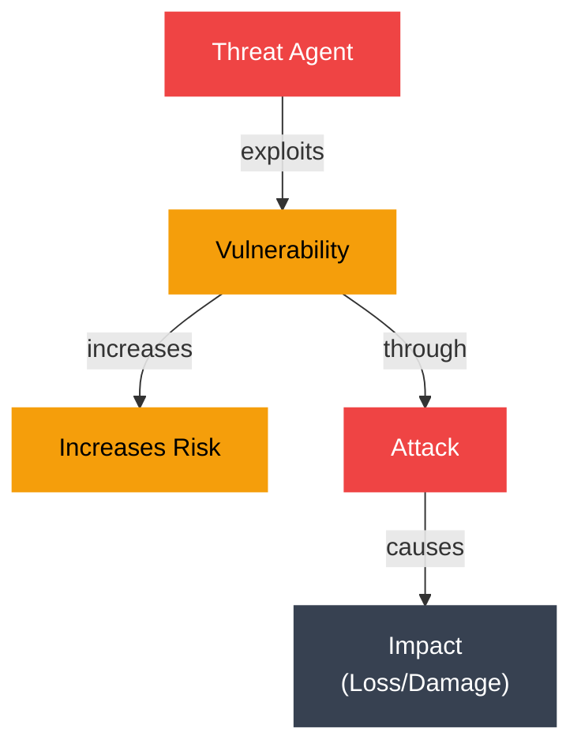
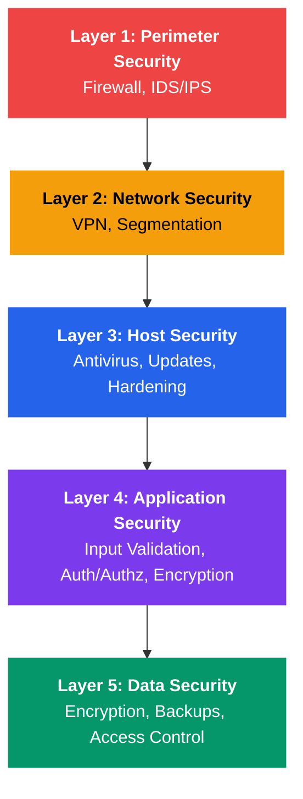

# Security Fundamentals

## What You'll Learn

In this tutorial, you'll master the foundational concepts of operating system security:

- The CIA triad: confidentiality, integrity, and availability
- Differences between threats, vulnerabilities, and attacks
- Core security principles and best practices
- Protection domains and CPU privilege rings
- Security policies vs mechanisms
- Trusted Computing Base (TCB) concept
- Classic security models (Bell-LaPadula, Biba, Clark-Wilson)
- Common vulnerability types and classifications
- CVE database and security updates

**Time Required**: 45-60 minutes

---

## 1. The CIA Triad: Security Goals

The three fundamental goals of information security:

```
        CIA TRIAD
        =========
    
    Confidentiality
         /\
        /  \
       /    \
      /      \
     /________\
    
    Integrity <---> Availability
```

### Confidentiality

**Definition**: Ensuring that information is accessible only to authorized entities.

**Mechanisms**:
- Encryption (data at rest and in transit)
- Access control (permissions, ACLs)
- Authentication (verify identity)

**Threats**:
- Unauthorized data access
- Eavesdropping
- Data leaks

**Example**:
```c
// File permission check for confidentiality
#include <stdio.h>
#include <sys/stat.h>
#include <unistd.h>

int check_file_confidentiality(const char *filename) {
    struct stat file_stat;
    
    if (stat(filename, &file_stat) != 0) {
        perror("stat");
        return -1;
    }
    
    // Check if file is readable by others
    if (file_stat.st_mode & S_IROTH) {
        printf("WARNING: File %s is world-readable!\n", filename);
        printf("Confidentiality risk detected.\n");
        return 0;
    }
    
    printf("File %s has appropriate confidentiality settings.\n", filename);
    return 1;
}

int main() {
    check_file_confidentiality("/etc/shadow");  // Should not be world-readable
    check_file_confidentiality("/etc/passwd");  // Typically world-readable
    return 0;
}
```

### Integrity

**Definition**: Ensuring that data is accurate and hasn't been tampered with.

**Mechanisms**:
- Checksums and hashing (SHA-256, MD5)
- Digital signatures
- File permissions (write protection)
- Version control

**Threats**:
- Data modification
- Data corruption
- Man-in-the-middle attacks

**Example (Bash)**:
```bash
#!/bin/bash
# Integrity checking using SHA-256 checksums

# Create a checksum for critical system files
echo "Creating checksums for system binaries..."
sha256sum /bin/bash /bin/ls /bin/cat > system_checksums.txt

# Later, verify integrity
echo "Verifying integrity..."
if sha256sum -c system_checksums.txt; then
    echo "✓ All files passed integrity check"
else
    echo "✗ INTEGRITY VIOLATION DETECTED!"
    echo "System may be compromised!"
fi
```

### Availability

**Definition**: Ensuring that authorized users can access resources when needed.

**Mechanisms**:
- Redundancy (RAID, clustering)
- Backup and disaster recovery
- Resource management (prevent DoS)
- Fault tolerance

**Threats**:
- Denial of Service (DoS) attacks
- System crashes
- Resource exhaustion

**Example**:
```c
// Simple resource limiting for availability
#include <stdio.h>
#include <sys/resource.h>

void set_resource_limits() {
    struct rlimit limit;
    
    // Limit CPU time to prevent resource exhaustion
    limit.rlim_cur = 10;  // 10 seconds soft limit
    limit.rlim_max = 15;  // 15 seconds hard limit
    
    if (setrlimit(RLIMIT_CPU, &limit) != 0) {
        perror("setrlimit CPU");
    } else {
        printf("CPU time limit set to %ld seconds\n", limit.rlim_cur);
    }
    
    // Limit number of open files
    limit.rlim_cur = 1024;
    limit.rlim_max = 2048;
    
    if (setrlimit(RLIMIT_NOFILE, &limit) != 0) {
        perror("setrlimit NOFILE");
    } else {
        printf("File descriptor limit set to %ld\n", limit.rlim_cur);
    }
}

int main() {
    set_resource_limits();
    printf("Resource limits configured for availability protection\n");
    return 0;
}
```

---

## 2. Threats, Vulnerabilities, and Attacks

Understanding these three concepts is crucial:

| Concept | Definition | Example |
|---------|-----------|---------|
| **Threat** | Potential danger that could exploit a vulnerability | Malicious hacker, malware, natural disaster |
| **Vulnerability** | Weakness in a system that can be exploited | Buffer overflow bug, weak password, unpatched software |
| **Attack** | Actual exploitation of a vulnerability by a threat | SQL injection, DoS attack, privilege escalation |



```
Relationship Diagram
====================

    Threat Agent
         |
         | exploits
         v
    Vulnerability ---------> Increases Risk
         |
         | through
         v
      Attack
         |
         | causes
         v
      Impact
   (Loss/Damage)
```

---

## 3. Core Security Principles

### Principle of Least Privilege

**Definition**: Grant users/processes only the minimum privileges needed to perform their tasks.

```bash
#!/bin/bash
# Example: Running a web server with minimal privileges

# Bad: Running as root
# sudo /usr/sbin/nginx

# Good: Running as unprivileged user
sudo -u www-data /usr/sbin/nginx

# Even better: Using capabilities instead of root
sudo setcap 'cap_net_bind_service=+ep' /usr/sbin/nginx
# Now nginx can bind to port 80 without being root
```

### Defense in Depth

**Definition**: Use multiple layers of security controls.



```
Defense in Depth Layers
=======================

    Perimeter ─────────────────┐
    Security    Firewall       │
                IDS/IPS        │ Layer 1: Network
                               │
    Network ───────────────────┤
    Security    VPN            │
                Segmentation   │ Layer 2: Network
                               │
    Host ──────────────────────┤
    Security    Antivirus      │
                Updates        │ Layer 3: System
                Hardening      │
                               │
    Application ───────────────┤
    Security    Input Valid.   │
                Auth/Authz     │ Layer 4: Application
                Encryption     │
                               │
    Data ──────────────────────┤
    Security    Encryption     │
                Backups        │ Layer 5: Data
                Access Control │
```

### Fail-Safe Defaults

**Definition**: Default configuration should deny access; explicitly grant permissions.

```c
// Example: Secure file creation with fail-safe defaults
#include <stdio.h>
#include <fcntl.h>
#include <sys/stat.h>
#include <unistd.h>

int create_secure_file(const char *filename) {
    int fd;
    mode_t old_umask;
    
    // Set umask to create file with restrictive permissions
    // Fail-safe default: deny all access initially
    old_umask = umask(0077);  // Creates files as 0600 (owner only)
    
    fd = open(filename, O_CREAT | O_WRONLY | O_EXCL, 0600);
    
    umask(old_umask);  // Restore original umask
    
    if (fd == -1) {
        perror("open");
        return -1;
    }
    
    printf("Created file %s with secure permissions (0600)\n", filename);
    return fd;
}

int main() {
    int fd = create_secure_file("secure_data.txt");
    if (fd != -1) {
        write(fd, "Sensitive data\n", 15);
        close(fd);
    }
    return 0;
}
```

### Complete Mediation

**Definition**: Check permissions on every access, not just the first.

### Open Design

**Definition**: Security should not depend on secrecy of design.

### Separation of Privilege

**Definition**: Require multiple conditions to be met for access.

```bash
#!/bin/bash
# Example: Two-person rule for critical operations

# Require two authorized users to approve deletion of critical data
delete_critical_data() {
    local file="$1"
    local approver1="$2"
    local approver2="$3"
    
    if [ "$approver1" == "$approver2" ]; then
        echo "Error: Two different approvers required"
        return 1
    fi
    
    # Check if both approvers are in the authorized group
    if groups "$approver1" | grep -q "data_admins" && \
       groups "$approver2" | grep -q "data_admins"; then
        echo "Approved by $approver1 and $approver2"
        rm -f "$file"
        echo "File deleted: $file"
    else
        echo "Error: Both approvers must be in data_admins group"
        return 1
    fi
}

# Usage: delete_critical_data "/critical/data.db" "admin1" "admin2"
```

---

## 4. Protection Domains and Privilege Rings

### CPU Privilege Rings

Modern CPUs implement hierarchical protection domains:

```
Intel x86 Privilege Rings
=========================

         Ring 0 (Kernel Mode)
              /\
             /  \
            / OS \
           / Kernel\
          /________\
         /          \
        /   Ring 1   \
       /  (Unused on  \
      /   most OSes)   \
     /                  \
    /      Ring 2        \
   /    (Unused on        \
  /     most OSes)         \
 /                          \
/___________________________\
        Ring 3
    (User Mode)
    Applications
    
Ring 0: Full privileges (kernel code)
Ring 1-2: Device drivers (rarely used)
Ring 3: User applications (restricted)
```

### Switching Between Rings

```c
// System call: transitioning from Ring 3 to Ring 0
#include <stdio.h>
#include <unistd.h>
#include <sys/syscall.h>

void demonstrate_ring_transition() {
    printf("User mode (Ring 3): About to make system call\n");
    
    // System call causes transition to Ring 0
    pid_t pid = syscall(SYS_getpid);  // Trap into kernel
    
    // Returned to Ring 3
    printf("Back in user mode (Ring 3): PID = %d\n", pid);
}

int main() {
    demonstrate_ring_transition();
    
    // This would cause a protection fault (can't access Ring 0 directly):
    // write_to_kernel_memory(0xc0000000, data);  // Segmentation fault!
    
    return 0;
}
```

### Protection Domain Example

```bash
#!/bin/bash
# Demonstrating protection domains in Linux

echo "=== User Mode (Ring 3) ==="
whoami
echo "Can access: user files, call system calls"

echo -e "\n=== Attempting Privileged Operation ==="
# Try to read kernel memory (will fail in Ring 3)
if dd if=/dev/kmem of=/dev/null bs=1 count=1 2>/dev/null; then
    echo "Success (running in Ring 0 or on old kernel)"
else
    echo "Failed: Cannot access kernel memory from user mode"
fi

echo -e "\n=== Checking CPU Ring Level ==="
# Use /proc to check privilege level
cat /proc/self/status | grep "^Uid:"
```

---

## 5. Security Policies vs Mechanisms

| Aspect | Policy | Mechanism |
|--------|--------|-----------|
| **Definition** | What should be protected and under what conditions | How protection is enforced |
| **Example** | "Users can only read files they own or have been granted access to" | File permissions, ACLs, chmod/chown |
| **Flexibility** | Can be changed without modifying the OS | Fixed implementation in the OS |
| **Scope** | High-level rules | Low-level implementation |

### Example: File Access

**Policy**: "Confidential files should only be accessible to authorized personnel"

**Mechanisms**:
```bash
#!/bin/bash
# Implementing the policy through various mechanisms

# Mechanism 1: DAC (Discretionary Access Control)
chmod 600 confidential.txt  # Only owner can access
chown alice:finance confidential.txt

# Mechanism 2: ACL (Access Control List)
setfacl -m u:bob:r confidential.txt  # Grant Bob read access

# Mechanism 3: Encryption
gpg --encrypt --recipient alice@company.com confidential.txt

# Mechanism 4: SELinux (MAC)
chcon -t confidential_file_t confidential.txt
# SELinux policy enforces access based on context
```

---

## 6. Trusted Computing Base (TCB)

**Definition**: The set of all hardware, firmware, and software components that are critical to system security.

```
TCB Components
==============

    +----------------------------------+
    |         Applications             |  (Outside TCB)
    +----------------------------------+
    |      System Libraries            |  (Part of TCB)
    +----------------------------------+
    |      Operating System Kernel     |  (Core TCB)
    +----------------------------------+
    |      Hardware (CPU, MMU)         |  (Foundation)
    +----------------------------------+

TCB Properties:
- Must be tamper-resistant
- Must be correct (no bugs)
- Should be as small as possible (smaller = fewer bugs)
- Must be verifiable
```

### Reducing TCB Size

```c
// Example: Privilege separation to minimize TCB
#include <stdio.h>
#include <unistd.h>
#include <sys/types.h>

int main() {
    // Start with elevated privileges (part of TCB)
    if (getuid() == 0) {
        printf("Running as root (in TCB)\n");
        
        // Do privileged initialization
        FILE *fp = fopen("/var/log/myapp.log", "a");
        
        // Drop privileges ASAP to minimize TCB exposure
        if (setuid(1000) == 0) {
            printf("Dropped privileges to user 1000 (outside TCB)\n");
        }
        
        // Now process untrusted data outside TCB
        char buffer[256];
        printf("Enter data: ");
        fgets(buffer, sizeof(buffer), stdin);
        
        if (fp) {
            fprintf(fp, "Logged: %s", buffer);
            fclose(fp);
        }
    }
    
    return 0;
}
```

---

## 7. Security Models

### Bell-LaPadula Model (Confidentiality)

**Goal**: Prevent information flow from high to low security levels.

**Rules**:
- **Simple Security Property** (no read up): Subject at level L cannot read objects at level > L
- **Star Property** (no write down): Subject at level L cannot write to objects at level < L

```
Bell-LaPadula Example
=====================

Security Levels: Top Secret > Secret > Confidential > Unclassified

User (Secret clearance):
  ✓ Can read: Secret, Confidential, Unclassified
  ✗ Cannot read: Top Secret (no read up)
  
  ✓ Can write: Secret, Top Secret
  ✗ Cannot write: Confidential, Unclassified (no write down)
```

### Biba Model (Integrity)

**Goal**: Prevent information flow from low to high integrity levels.

**Rules**:
- **Simple Integrity Property** (no read down): Subject at level L cannot read objects at level < L
- **Star Integrity Property** (no write up): Subject at level L cannot write to objects at level > L

```
Biba Example (Database System)
===============================

Integrity Levels: Verified > Checked > Unverified

Process (Checked integrity):
  ✓ Can read: Checked, Verified
  ✗ Cannot read: Unverified (no read down - prevents contamination)
  
  ✓ Can write: Checked, Unverified
  ✗ Cannot write: Verified (no write up - prevents corruption)
```

### Clark-Wilson Model (Integrity)

**Goal**: Well-formed transactions and separation of duties.

**Components**:
- **Constrained Data Items (CDIs)**: Protected data
- **Unconstrained Data Items (UDIs)**: Unprotected data
- **Transformation Procedures (TPs)**: Validate and transform data
- **Integrity Verification Procedures (IVPs)**: Verify data integrity

```bash
#!/bin/bash
# Clark-Wilson model example: banking transaction

# IVP: Integrity Verification Procedure
verify_account_integrity() {
    local account_file="$1"
    local checksum=$(sha256sum "$account_file" | awk '{print $1}')
    local stored_checksum=$(cat "${account_file}.checksum" 2>/dev/null)
    
    if [ "$checksum" == "$stored_checksum" ]; then
        return 0  # Integrity verified
    else
        return 1  # Integrity violation
    fi
}

# TP: Transformation Procedure (well-formed transaction)
transfer_funds() {
    local from_account="$1"
    local to_account="$2"
    local amount="$3"
    
    # Verify integrity before transaction
    if ! verify_account_integrity "$from_account" || \
       ! verify_account_integrity "$to_account"; then
        echo "Error: Account integrity check failed"
        return 1
    fi
    
    # Atomic transaction (both succeed or both fail)
    (
        flock -x 200  # Exclusive lock
        
        # Debit from source
        local from_balance=$(cat "$from_account")
        if [ "$from_balance" -lt "$amount" ]; then
            echo "Error: Insufficient funds"
            return 1
        fi
        echo $((from_balance - amount)) > "$from_account"
        
        # Credit to destination
        local to_balance=$(cat "$to_account")
        echo $((to_balance + amount)) > "$to_account"
        
        # Update checksums (maintain integrity)
        sha256sum "$from_account" | awk '{print $1}' > "${from_account}.checksum"
        sha256sum "$to_account" | awk '{print $1}' > "${to_account}.checksum"
        
        echo "Transfer complete: $amount from $from_account to $to_account"
    ) 200>/var/lock/accounts.lock
}
```

### Model Comparison Table

| Model | Focus | Key Principle | Use Case |
|-------|-------|---------------|----------|
| **Bell-LaPadula** | Confidentiality | No read up, no write down | Military classification |
| **Biba** | Integrity | No read down, no write up | Database systems |
| **Clark-Wilson** | Integrity | Well-formed transactions | Commercial applications |

---

## 8. Common Vulnerabilities

### Vulnerability Classification

```c
// Example: Buffer overflow vulnerability
#include <stdio.h>
#include <string.h>

// VULNERABLE: No bounds checking
void vulnerable_function(char *input) {
    char buffer[64];
    strcpy(buffer, input);  // Dangerous!
    printf("Copied: %s\n", buffer);
}

// SECURE: Bounds checking
void secure_function(char *input) {
    char buffer[64];
    strncpy(buffer, input, sizeof(buffer) - 1);
    buffer[sizeof(buffer) - 1] = '\0';  // Ensure null termination
    printf("Copied: %s\n", buffer);
}

int main(int argc, char *argv[]) {
    if (argc < 2) {
        printf("Usage: %s <input>\n", argv[0]);
        return 1;
    }
    
    printf("=== Demonstrating buffer overflow ===\n");
    // vulnerable_function(argv[1]);  // Don't actually call this!
    secure_function(argv[1]);
    
    return 0;
}
```

### Common Vulnerability Types

| Vulnerability | Description | Impact | Mitigation |
|---------------|-------------|--------|------------|
| **Buffer Overflow** | Writing past buffer boundaries | Code execution, crash | Bounds checking, stack canaries, ASLR |
| **Privilege Escalation** | Gaining higher privileges | Full system compromise | Least privilege, input validation |
| **Race Condition** | Time-of-check to time-of-use gap | Data corruption, bypass checks | Atomic operations, proper locking |
| **Injection** | Untrusted data executed as code | Data theft, system compromise | Input validation, parameterized queries |
| **Use-After-Free** | Using freed memory | Code execution, information leak | Memory safety, garbage collection |

---

## 9. CVE Database

**CVE**: Common Vulnerabilities and Exposures

**Format**: CVE-YEAR-XXXXX (e.g., CVE-2021-44228 - Log4Shell)

```bash
#!/bin/bash
# Checking for known vulnerabilities

echo "=== System Vulnerability Check ==="

# Check kernel version
kernel_version=$(uname -r)
echo "Kernel version: $kernel_version"

# Check for known vulnerable packages
echo -e "\n=== Checking installed packages ===" 

# On Debian/Ubuntu
if command -v apt &> /dev/null; then
    # Check for security updates
    apt list --upgradable 2>/dev/null | grep -i security
fi

# On RHEL/CentOS
if command -v yum &> /dev/null; then
    yum list updates --security
fi

# Check specific CVEs (example: Shellshock)
echo -e "\n=== Checking for Shellshock (CVE-2014-6271) ==="
env x='() { :;}; echo VULNERABLE' bash -c "echo Test" 2>/dev/null

# List security updates needed
echo -e "\n=== Security Updates Needed ==="
if command -v unattended-upgrade &> /dev/null; then
    unattended-upgrade --dry-run -d
fi
```

### Vulnerability Severity (CVSS)

```
CVSS Score Ranges
=================

0.0         None
0.1 - 3.9   Low        ░░░░░░░░░░
4.0 - 6.9   Medium     ░░░░░░░░░░░░░░░
7.0 - 8.9   High       ░░░░░░░░░░░░░░░░░░░░
9.0 - 10.0  Critical   ░░░░░░░░░░░░░░░░░░░░░░░░░
```

---

## 10. Security Updates and Patching

### Patch Management Strategy

```bash
#!/bin/bash
# Automated security patching script

LOG_FILE="/var/log/security_patches.log"

log_message() {
    echo "[$(date '+%Y-%m-%d %H:%M:%S')] $1" | tee -a "$LOG_FILE"
}

check_and_apply_security_updates() {
    log_message "Starting security update check..."
    
    # Update package cache
    if command -v apt &> /dev/null; then
        log_message "Updating package cache (apt)..."
        apt update
        
        # List security updates
        security_updates=$(apt list --upgradable 2>/dev/null | grep -c security)
        log_message "Found $security_updates security updates"
        
        # Apply security updates only
        if [ "$security_updates" -gt 0 ]; then
            log_message "Applying security updates..."
            apt install -y unattended-upgrades
            unattended-upgrade -d
        fi
        
    elif command -v yum &> /dev/null; then
        log_message "Checking for security updates (yum)..."
        security_updates=$(yum list updates --security | wc -l)
        log_message "Found $security_updates security updates"
        
        if [ "$security_updates" -gt 0 ]; then
            log_message "Applying security updates..."
            yum update -y --security
        fi
    fi
    
    # Check if reboot is required
    if [ -f /var/run/reboot-required ]; then
        log_message "REBOOT REQUIRED for updates to take effect"
    fi
    
    log_message "Security update check complete"
}

# Run security updates
check_and_apply_security_updates
```

---

## Key Takeaways

1. **CIA Triad**: Security revolves around Confidentiality, Integrity, and Availability
2. **Security Principles**: Least privilege, defense in depth, and fail-safe defaults are fundamental
3. **Protection Domains**: CPU rings (0-3) enforce privilege separation between kernel and user code
4. **Policy vs Mechanism**: Policies define "what" to protect; mechanisms define "how"
5. **TCB**: Keep the Trusted Computing Base as small and simple as possible
6. **Security Models**: Different models address different aspects (confidentiality vs integrity)
7. **Vulnerabilities**: Understanding common vulnerability types is essential for prevention
8. **CVE Database**: Track and patch known vulnerabilities promptly
9. **Layered Security**: No single mechanism is sufficient; use multiple defensive layers
10. **Regular Updates**: Security is an ongoing process, not a one-time configuration

---

## Exercises

### Beginner

1. Write a bash script that checks file permissions and warns about world-readable files in a directory
2. Create a C program that demonstrates the principle of least privilege by dropping root privileges after initialization
3. Research three recent CVEs and write a summary of their impact and mitigation

### Intermediate

4. Implement a simple integrity checking system using SHA-256 hashes
5. Write a program that demonstrates the difference between Ring 0 and Ring 3 operations
6. Create a secure file deletion utility that follows fail-safe defaults and complete mediation
7. Design a security policy for a multi-user system and describe the mechanisms to enforce it

### Advanced

8. Implement a simplified Bell-LaPadula access control system in C
9. Write a kernel module that logs all system calls made by a specific process (demonstrates TCB concept)
10. Create a vulnerability scanner that checks for common security issues in a Linux system
11. Design and implement a secure logging system that ensures integrity and confidentiality of log data

---

## Navigation

- [← Back to Module Overview](./README.md)
- [Next: Authentication and Authorization →](./02_auth_and_authz.md)
- [Security and Protection Home](./README.md)

---

**Further Reading**:
- "Computer Security: Principles and Practice" by Stallings and Brown
- [NIST Computer Security Resource Center](https://csrc.nist.gov/)
- [CVE Database](https://cve.mitre.org/)
- [CWE (Common Weakness Enumeration)](https://cwe.mitre.org/)
