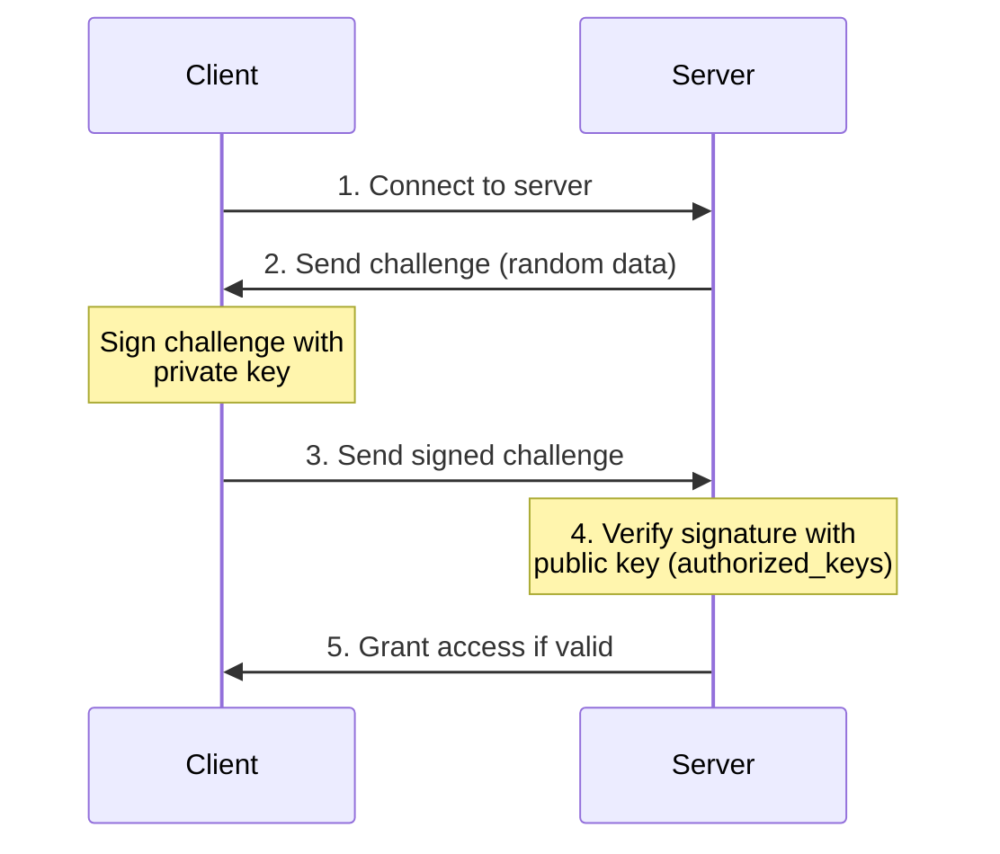
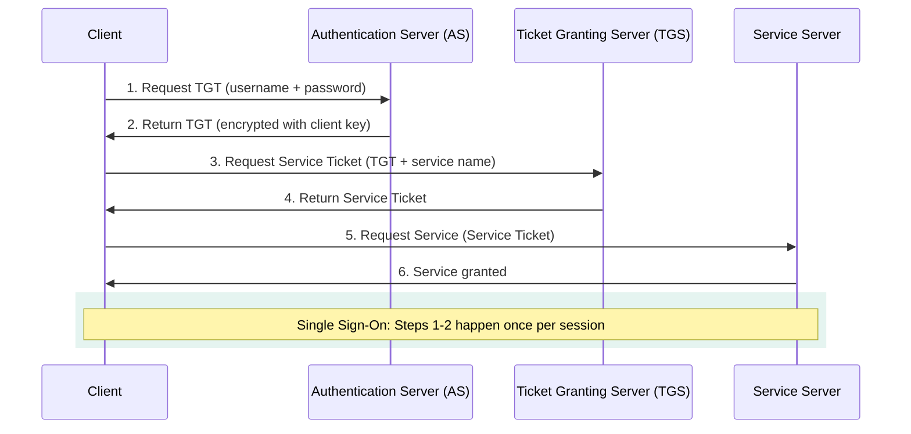

# Authentication and Authorization

## What You'll Learn

In this tutorial, you'll master identity verification and access control in operating systems:

- Distinction between authentication (who you are) and authorization (what you can do)
- Password-based authentication with hashing and salting
- Multi-factor authentication (2FA/MFA) concepts
- Biometric and public key authentication
- Kerberos authentication protocol
- PAM (Pluggable Authentication Modules) in Linux
- Authorization mechanisms and sudo
- User and group management in Linux
- Password policies and security best practices

**Time Required**: 40-50 minutes

---

## 1. Authentication vs Authorization

```
Authentication vs Authorization
===============================

┌─────────────────────────────────────────────────┐
│                                                 │
│  Authentication: "Who are you?"                 │
│  ┌─────────────────────────────────────┐        │
│  │ User: alice                         │        │
│  │ Password: ********                  │        │
│  │ → Verify identity                   │        │
│  └─────────────────────────────────────┘        │
│                   │                             │
│                   ▼                             │
│              Authenticated                      │
│                   │                             │
│                   ▼                             │
│  Authorization: "What can you do?"              │
│  ┌─────────────────────────────────────┐        │
│  │ Check permissions:                  │        │
│  │ - Can alice read file X?            │        │
│  │ - Can alice write to directory Y?   │        │
│  │ - Can alice execute program Z?      │        │
│  └─────────────────────────────────────┘        │
│                                                 │
└─────────────────────────────────────────────────┘

Key Difference:
- Authentication: Identity verification (login)
- Authorization: Permission checking (access control)
```

### Example: Web Application Flow

```c
// Simple authentication and authorization example
#include <stdio.h>
#include <string.h>
#include <stdbool.h>

typedef struct {
    char username[32];
    char password_hash[65];  // SHA-256 hash
    char role[16];
} User;

// Simulated user database
User users[] = {
    {"alice", "5e884898da28047151d0e56f8dc6292773603d0d6aabbdd62a11ef721d1542d8", "admin"},
    {"bob", "6ca13d52ca70c883e0f0bb101e425a89e8624de51db2d2392593af6a84118090", "user"},
};

// Authentication: Verify identity
bool authenticate(const char *username, const char *password_hash) {
    for (int i = 0; i < sizeof(users) / sizeof(User); i++) {
        if (strcmp(users[i].username, username) == 0 &&
            strcmp(users[i].password_hash, password_hash) == 0) {
            printf("✓ Authentication successful for %s\n", username);
            return true;
        }
    }
    printf("✗ Authentication failed\n");
    return false;
}

// Authorization: Check permissions
bool authorize(const char *username, const char *required_role) {
    for (int i = 0; i < sizeof(users) / sizeof(User); i++) {
        if (strcmp(users[i].username, username) == 0) {
            if (strcmp(users[i].role, required_role) == 0 ||
                strcmp(users[i].role, "admin") == 0) {
                printf("✓ Authorization successful: %s has %s access\n",
                       username, required_role);
                return true;
            }
        }
    }
    printf("✗ Authorization failed: insufficient privileges\n");
    return false;
}

int main() {
    const char *username = "alice";
    const char *password_hash = "5e884898da28047151d0e56f8dc6292773603d0d6aabbdd62a11ef721d1542d8";
    
    // Step 1: Authentication
    if (authenticate(username, password_hash)) {
        // Step 2: Authorization
        authorize(username, "admin");  // Check if user can perform admin actions
    }
    
    return 0;
}
```

---

## 2. Password-Based Authentication

### Password Storage: Never Store Plaintext!

```
Password Storage Evolution
==========================

❌ Plaintext:
   password → "mypassword123" (NEVER DO THIS!)

❌ Simple Hash:
   password → MD5("mypassword123") = "482c811da5d5b4bc6d497ffa98491e38"
   (Vulnerable to rainbow table attacks)

❌ Hash with Fixed Salt:
   password → SHA256("mypassword123" + "fixedsalt")
   (Vulnerable if salt is discovered)

✅ Hash with Random Salt:
   password → SHA256("mypassword123" + random_salt)
   Store: salt + hash
   (Secure against rainbow tables)

✅✅ Key Derivation Function (Best):
   password → bcrypt/scrypt/Argon2("mypassword123", cost_factor)
   (Slow hashing prevents brute force)
```

### Implementation: Secure Password Hashing

```c
// Password hashing with salt (simplified example)
#include <stdio.h>
#include <stdlib.h>
#include <string.h>
#include <time.h>
#include <openssl/sha.h>

#define SALT_LENGTH 16

// Generate random salt
void generate_salt(unsigned char *salt, size_t length) {
    srand(time(NULL));
    for (size_t i = 0; i < length; i++) {
        salt[i] = rand() % 256;
    }
}

// Hash password with salt
void hash_password(const char *password, const unsigned char *salt,
                   unsigned char *hash_output) {
    unsigned char data[256];
    size_t password_len = strlen(password);
    
    // Combine password and salt
    memcpy(data, password, password_len);
    memcpy(data + password_len, salt, SALT_LENGTH);
    
    // Hash with SHA-256
    SHA256(data, password_len + SALT_LENGTH, hash_output);
}

// Verify password
int verify_password(const char *password, const unsigned char *stored_salt,
                    const unsigned char *stored_hash) {
    unsigned char computed_hash[SHA256_DIGEST_LENGTH];
    
    hash_password(password, stored_salt, computed_hash);
    
    return memcmp(computed_hash, stored_hash, SHA256_DIGEST_LENGTH) == 0;
}

int main() {
    const char *password = "SecurePassword123!";
    unsigned char salt[SALT_LENGTH];
    unsigned char hash[SHA256_DIGEST_LENGTH];
    
    printf("=== Password Hashing Demo ===\n\n");
    
    // Create new password
    generate_salt(salt, SALT_LENGTH);
    hash_password(password, salt, hash);
    
    printf("Password: %s\n", password);
    printf("Salt (hex): ");
    for (int i = 0; i < SALT_LENGTH; i++) {
        printf("%02x", salt[i]);
    }
    printf("\n");
    
    printf("Hash (hex): ");
    for (int i = 0; i < SHA256_DIGEST_LENGTH; i++) {
        printf("%02x", hash[i]);
    }
    printf("\n\n");
    
    // Verify password
    if (verify_password(password, salt, hash)) {
        printf("✓ Password verification successful\n");
    } else {
        printf("✗ Password verification failed\n");
    }
    
    if (verify_password("WrongPassword", salt, hash)) {
        printf("✓ Wrong password accepted (BUG!)\n");
    } else {
        printf("✗ Wrong password rejected (correct)\n");
    }
    
    return 0;
}

// Compile: gcc -o password_hash password_hash.c -lssl -lcrypto
```

### /etc/shadow Format

```bash
#!/bin/bash
# Understanding /etc/shadow file structure

echo "=== /etc/shadow Format ==="
echo "username:\$id\$salt\$hash:lastchange:min:max:warn:inactive:expire:reserved"
echo ""

# Example entry breakdown
echo "alice:\$6\$rounds=5000\$saltsaltsal\$hash...:18800:0:99999:7:::"
echo ""
echo "Field breakdown:"
echo "1. username: alice"
echo "2. password: \$6\$rounds=5000\$saltsaltsal\$hash..."
echo "   - \$6 = SHA-512 algorithm"
echo "   - \$rounds=5000 = cost factor"
echo "   - saltsaltsal = random salt"
echo "   - hash... = actual password hash"
echo "3. lastchange: 18800 (days since Jan 1, 1970)"
echo "4. min: 0 (minimum days between password changes)"
echo "5. max: 99999 (maximum days password is valid)"
echo "6. warn: 7 (days before expiration to warn user)"
echo "7. inactive: (days after expiration before account is disabled)"
echo "8. expire: (account expiration date)"
echo ""

# View your shadow entry (requires sudo)
if [ "$EUID" -eq 0 ]; then
    echo "Your shadow entry:"
    grep "^$(logname):" /etc/shadow
else
    echo "Run with sudo to view /etc/shadow"
fi
```

---

## 3. Multi-Factor Authentication (MFA)

### Authentication Factors

```
Three Authentication Factors
=============================

┌────────────────────────────────────────┐
│ Factor 1: Something You Know           │
│ ├─ Password                            │
│ ├─ PIN                                 │
│ └─ Security question answer            │
├────────────────────────────────────────┤
│ Factor 2: Something You Have           │
│ ├─ Security token (RSA SecurID)        │
│ ├─ Smart card                          │
│ ├─ Phone (for SMS/app)                 │
│ └─ Hardware key (YubiKey)              │
├────────────────────────────────────────┤
│ Factor 3: Something You Are            │
│ ├─ Fingerprint                         │
│ ├─ Face recognition                    │
│ ├─ Iris scan                           │
│ └─ Voice recognition                   │
└────────────────────────────────────────┘

2FA/MFA = Using 2 or more different factors
```

### TOTP (Time-Based One-Time Password) Example

```bash
#!/bin/bash
# Simulating TOTP 2FA (like Google Authenticator)

# Install required package: apt-get install oathtool

echo "=== Setting Up TOTP 2FA ==="

# Generate a secret key (base32 encoded)
SECRET=$(head -c 16 /dev/urandom | base32 | tr -d '=')
echo "Your secret key: $SECRET"
echo "(Scan QR code or enter manually in authenticator app)"

# Generate QR code URL for Google Authenticator
USER="alice@example.com"
ISSUER="MyApp"
QR_URL="otpauth://totp/${ISSUER}:${USER}?secret=${SECRET}&issuer=${ISSUER}"
echo ""
echo "QR Code URL: $QR_URL"
echo ""

# Generate current TOTP code
generate_totp() {
    local secret="$1"
    oathtool --totp -b "$secret"
}

# Verify TOTP code
verify_totp() {
    local secret="$1"
    local user_code="$2"
    local current_code=$(generate_totp "$secret")
    
    if [ "$user_code" == "$current_code" ]; then
        return 0  # Valid
    else
        return 1  # Invalid
    fi
}

# Demo: Generate codes every 30 seconds
echo "=== TOTP Codes (change every 30 seconds) ==="
if command -v oathtool &> /dev/null; then
    for i in {1..5}; do
        CODE=$(generate_totp "$SECRET")
        echo "$(date '+%H:%M:%S'): $CODE"
        sleep 5
    done
else
    echo "Install oathtool: sudo apt-get install oathtool"
fi
```

---

## 4. Public Key Authentication (SSH)

### How SSH Key Authentication Works



```
SSH Public Key Authentication Flow
===================================

Client                                    Server
┌──────┐                                ┌──────┐
│      │                                │      │
│  1. Connect to server                 │      │
│  ────────────────────────────────────>│      │
│      │                                │      │
│      │  2. Server sends challenge    │      │
│  <────────────────────────────────────│      │
│      │     (random data)              │      │
│      │                                │      │
│  3. Sign challenge with private key   │      │
│     (only client has private key)     │      │
│  ────────────────────────────────────>│      │
│      │                                │      │
│      │  4. Verify signature with      │      │
│      │     public key                 │      │
│      │     (stored in authorized_keys)│      │
│      │                                │      │
│      │  5. Grant access if valid      │      │
│  <────────────────────────────────────│      │
│      │                                │      │
└──────┘                                └──────┘
```

### SSH Key Setup

```bash
#!/bin/bash
# Complete SSH key authentication setup

echo "=== SSH Key Authentication Setup ==="

# Generate SSH key pair
generate_ssh_key() {
    echo "Generating RSA key pair..."
    ssh-keygen -t rsa -b 4096 -C "alice@example.com" -f ~/.ssh/id_rsa_demo -N ""
    
    echo ""
    echo "✓ Generated key pair:"
    echo "  Private key: ~/.ssh/id_rsa_demo"
    echo "  Public key:  ~/.ssh/id_rsa_demo.pub"
    echo ""
    
    # Display public key
    echo "Public key content:"
    cat ~/.ssh/id_rsa_demo.pub
}

# Copy public key to server
setup_server_auth() {
    local server="$1"
    
    echo ""
    echo "Copying public key to server..."
    ssh-copy-id -i ~/.ssh/id_rsa_demo.pub "$server"
    
    echo "✓ Public key added to $server:~/.ssh/authorized_keys"
}

# Test SSH connection
test_connection() {
    local server="$1"
    
    echo ""
    echo "Testing SSH connection..."
    ssh -i ~/.ssh/id_rsa_demo "$server" "echo '✓ SSH key authentication successful!'"
}

# Secure SSH configuration
secure_ssh_config() {
    echo ""
    echo "=== Recommended /etc/ssh/sshd_config settings ==="
    cat << 'EOF'
# Disable password authentication (use keys only)
PasswordAuthentication no
ChallengeResponseAuthentication no

# Disable root login
PermitRootLogin no

# Enable public key authentication
PubkeyAuthentication yes

# Limit authentication attempts
MaxAuthTries 3

# Use strong ciphers
Ciphers aes256-gcm@openssh.com,aes128-gcm@openssh.com

# Enable strict mode (check file permissions)
StrictModes yes
EOF
}

# Usage
# generate_ssh_key
# setup_server_auth "user@remote-server.com"
# test_connection "user@remote-server.com"
secure_ssh_config
```

---

## 5. Kerberos Authentication

### Kerberos Architecture



```
Kerberos Authentication Protocol
=================================

Components:
- Client: User requesting service
- KDC (Key Distribution Center):
  ├─ AS (Authentication Server)
  └─ TGS (Ticket Granting Server)
- Service Server: Resource being accessed

Flow:
         ┌─────────────────┐
         │   Client (C)    │
         └────────┬────────┘
                  │
         1. Request TGT
         (username + password)
                  │
                  ▼
         ┌─────────────────┐
         │ AS (Auth Server)│
         └────────┬────────┘
                  │
         2. Return TGT
         (encrypted with client's key)
                  │
                  ▼
         ┌─────────────────┐
         │   Client (C)    │
         └────────┬────────┘
                  │
         3. Request Service Ticket
         (TGT + service name)
                  │
                  ▼
         ┌─────────────────┐
         │  TGS (Ticket    │
         │  Granting Srv)  │
         └────────┬────────┘
                  │
         4. Return Service Ticket
                  │
                  ▼
         ┌─────────────────┐
         │   Client (C)    │
         └────────┬────────┘
                  │
         5. Request Service
         (Service Ticket)
                  │
                  ▼
         ┌─────────────────┐
         │ Service Server  │
         └─────────────────┘

Advantages:
✓ Single Sign-On (SSO)
✓ No password sent over network
✓ Mutual authentication
✓ Time-limited tickets
```

---

## 6. PAM (Pluggable Authentication Modules)

### PAM Architecture

```
PAM Architecture
================

Application (login, ssh, sudo)
        │
        ▼
┌───────────────────┐
│   PAM Library     │
│  (libpam.so)      │
└─────────┬─────────┘
          │
    ┌─────┴─────┬─────────┬─────────┐
    ▼           ▼         ▼         ▼
┌────────┐ ┌────────┐ ┌────────┐ ┌────────┐
│ Module │ │ Module │ │ Module │ │ Module │
│ pam_   │ │ pam_   │ │ pam_   │ │ pam_   │
│ unix   │ │ ldap   │ │ krb5   │ │ google │
│ .so    │ │ .so    │ │ .so    │ │ _auth  │
└────────┘ └────────┘ └────────┘ └────────┘
    │           │         │         │
    └───────────┴─────────┴─────────┘
                  │
                  ▼
        Authentication Result
```

### PAM Configuration

```bash
#!/bin/bash
# Understanding PAM configuration

echo "=== PAM Configuration Files ==="
echo "Location: /etc/pam.d/"
echo ""

# Show PAM configuration for login
cat << 'EOF'
Example: /etc/pam.d/login
=========================

# Authentication
auth       required     pam_unix.so
auth       required     pam_env.so

# Account validation
account    required     pam_unix.so
account    required     pam_time.so

# Password management
password   required     pam_unix.so sha512 shadow
password   required     pam_pwquality.so retry=3

# Session management
session    required     pam_unix.so
session    required     pam_limits.so
session    optional     pam_mail.so standard

PAM Control Flags:
- required:   Must succeed; continue checking
- requisite:  Must succeed; stop if fails
- sufficient: Success is enough; stop checking
- optional:   Result ignored
EOF

echo ""
echo "=== Configuring Password Quality with PAM ==="
cat << 'EOF'
/etc/security/pwquality.conf
============================

# Minimum password length
minlen = 12

# Require at least one digit
dcredit = -1

# Require at least one uppercase
ucredit = -1

# Require at least one lowercase
lcredit = -1

# Require at least one special character
ocredit = -1

# Maximum consecutive characters
maxrepeat = 3

# Check against dictionary
dictcheck = 1
EOF
```

### Custom PAM Module Example

```c
// Simple custom PAM module (pam_time_restriction.c)
#include <security/pam_modules.h>
#include <security/pam_ext.h>
#include <time.h>
#include <syslog.h>

// PAM authentication function
PAM_EXTERN int pam_sm_authenticate(pam_handle_t *pamh, int flags,
                                   int argc, const char **argv) {
    time_t now;
    struct tm *timeinfo;
    int hour;
    
    // Get current time
    time(&now);
    timeinfo = localtime(&now);
    hour = timeinfo->tm_hour;
    
    // Only allow login during business hours (9 AM - 5 PM)
    if (hour >= 9 && hour < 17) {
        pam_syslog(pamh, LOG_INFO, "Login allowed during business hours");
        return PAM_SUCCESS;
    } else {
        pam_syslog(pamh, LOG_WARNING, "Login denied outside business hours");
        return PAM_AUTH_ERR;
    }
}

// PAM account management function
PAM_EXTERN int pam_sm_acct_mgmt(pam_handle_t *pamh, int flags,
                                int argc, const char **argv) {
    return PAM_SUCCESS;
}

// Compile: gcc -fPIC -shared -o pam_time_restriction.so pam_time_restriction.c -lpam
// Install: sudo cp pam_time_restriction.so /lib/x86_64-linux-gnu/security/
// Configure: Add to /etc/pam.d/login: auth required pam_time_restriction.so
```

---

## 7. sudo and Privilege Escalation

### sudo Configuration

```bash
#!/bin/bash
# Understanding and configuring sudo

echo "=== sudo Configuration ==="

# View sudoers file (NEVER edit directly, use visudo!)
cat << 'EOF'
/etc/sudoers
============

# User privilege specification
root    ALL=(ALL:ALL) ALL

# Allow members of group sudo to execute any command
%sudo   ALL=(ALL:ALL) ALL

# User alice can run all commands without password
alice   ALL=(ALL) NOPASSWD: ALL

# User bob can only restart nginx
bob     ALL=(ALL) NOPASSWD: /usr/sbin/service nginx restart

# User charlie can run commands as user www-data
charlie ALL=(www-data) /usr/bin/php

# Users in webadmin group can manage web services
%webadmin ALL=(ALL) /usr/sbin/service apache2 *, /usr/sbin/service nginx *

Syntax: user host=(runas_user:runas_group) commands
EOF

echo ""
echo "=== sudo Security Best Practices ==="
cat << 'EOF'
1. Use visudo to edit /etc/sudoers (prevents syntax errors)
2. Grant minimum necessary privileges
3. Avoid NOPASSWD except for specific commands
4. Use groups instead of individual users
5. Log all sudo usage
6. Set timeout (Defaults timestamp_timeout=5)
7. Require password for sensitive commands
EOF
```

### Logging sudo Usage

```bash
#!/bin/bash
# Monitor sudo usage

echo "=== Monitoring sudo Activity ==="

# View sudo logs
echo "Recent sudo commands:"
grep sudo /var/log/auth.log | tail -20

echo ""
echo "=== sudo Usage by User ==="
grep sudo /var/log/auth.log | grep COMMAND | \
    awk '{print $5}' | sort | uniq -c | sort -rn

echo ""
echo "=== Failed sudo Attempts ==="
grep "sudo.*incorrect password" /var/log/auth.log | tail -10

# Real-time monitoring
echo ""
echo "=== Real-time sudo Monitoring (Ctrl+C to stop) ==="
echo "Watching /var/log/auth.log for sudo activity..."
# tail -f /var/log/auth.log | grep --line-buffered sudo
```

---

## 8. User and Group Management

### User Management Commands

```bash
#!/bin/bash
# Complete user and group management guide

echo "=== User Management ==="

# Create new user
create_user_demo() {
    echo "Creating user 'testuser'..."
    
    # Method 1: useradd (low-level)
    sudo useradd -m -s /bin/bash -c "Test User" testuser
    sudo passwd testuser
    
    # Method 2: adduser (high-level, interactive)
    # sudo adduser testuser
    
    echo "✓ User created"
    grep testuser /etc/passwd
}

# Modify user
modify_user_demo() {
    echo "Modifying user 'testuser'..."
    
    # Change shell
    sudo usermod -s /bin/zsh testuser
    
    # Add to group
    sudo usermod -aG sudo testuser
    
    # Change home directory
    sudo usermod -d /home/newtest -m testuser
    
    # Lock account
    sudo usermod -L testuser
    
    # Unlock account
    sudo usermod -U testuser
    
    echo "✓ User modified"
}

# Delete user
delete_user_demo() {
    echo "Deleting user 'testuser'..."
    
    # Delete user but keep home directory
    sudo userdel testuser
    
    # Delete user and home directory
    sudo userdel -r testuser
    
    echo "✓ User deleted"
}

echo "=== Group Management ==="

# Create group
create_group_demo() {
    echo "Creating group 'developers'..."
    sudo groupadd developers
    
    # Create with specific GID
    sudo groupadd -g 1500 admins
    
    echo "✓ Groups created"
    tail -2 /etc/group
}

# Add users to groups
manage_group_membership() {
    echo "Managing group membership..."
    
    # Add user to group
    sudo usermod -aG developers testuser
    
    # Add user to multiple groups
    sudo usermod -aG developers,admins testuser
    
    # View user's groups
    groups testuser
    id testuser
}

# Display functions available
cat << 'EOF'

User Management Commands:
=========================

Create Users:
  useradd [options] username
    -m          Create home directory
    -s shell    Set login shell
    -G groups   Add to supplementary groups
    -c comment  Set comment (full name)

Modify Users:
  usermod [options] username
    -aG group   Append to group
    -L          Lock account
    -U          Unlock account
    -s shell    Change shell
    -d dir      Change home directory

Delete Users:
  userdel [options] username
    -r          Remove home directory

Group Commands:
  groupadd groupname
  groupdel groupname
  groupmod -n newname oldname

View Information:
  id username
  groups username
  getent passwd username
  getent group groupname
EOF
```

### /etc/passwd, /etc/shadow, /etc/group

```bash
#!/bin/bash
# Understanding authentication files

echo "=== /etc/passwd Format ==="
echo "username:x:UID:GID:comment:homedir:shell"
echo ""
echo "Example:"
echo "alice:x:1000:1000:Alice Smith:/home/alice:/bin/bash"
echo ""
echo "Fields:"
echo "1. Username"
echo "2. x (password stored in /etc/shadow)"
echo "3. UID (user ID)"
echo "4. GID (primary group ID)"
echo "5. Comment/Full Name"
echo "6. Home directory"
echo "7. Login shell"
echo ""

echo "=== /etc/shadow Format ==="
echo "username:\$algorithm\$salt\$hash:lastchange:min:max:warn:inactive:expire"
echo ""
echo "Example:"
echo "alice:\$6\$xyz\$abc...:18800:0:99999:7:::"
echo ""

echo "=== /etc/group Format ==="
echo "groupname:x:GID:members"
echo ""
echo "Example:"
echo "developers:x:1001:alice,bob,charlie"
echo ""

# Display actual entries
if [ "$EUID" -eq 0 ]; then
    echo "=== Your Entries ==="
    echo "/etc/passwd:"
    grep "^$(logname):" /etc/passwd
    echo ""
    echo "/etc/shadow:"
    grep "^$(logname):" /etc/shadow
    echo ""
    echo "/etc/group (groups containing you):"
    groups $(logname)
fi
```

---

## 9. Password Policies

### Implementing Password Policies

```bash
#!/bin/bash
# Configure comprehensive password policies

echo "=== Password Policy Configuration ==="

# 1. Password Aging (/etc/login.defs)
cat << 'EOF'
/etc/login.defs
===============

# Password aging controls
PASS_MAX_DAYS   90      # Maximum password age
PASS_MIN_DAYS   1       # Minimum days between changes
PASS_MIN_LEN    12      # Minimum password length
PASS_WARN_AGE   7       # Days warning before expiration

# Umask for user home directories
UMASK           077     # Restrictive by default
EOF

echo ""
echo "=== Set Password Aging for User ==="
cat << 'EOF'
# Set maximum password age (90 days)
sudo chage -M 90 username

# Set minimum password age (1 day)
sudo chage -m 1 username

# Set warning period (7 days)
sudo chage -W 7 username

# Set account expiration date
sudo chage -E 2024-12-31 username

# View password aging information
sudo chage -l username
EOF

echo ""
echo "=== Password Quality Requirements (PAM) ==="
cat << 'EOF'
/etc/security/pwquality.conf
============================

# Length
minlen = 12
minclass = 3        # Minimum character classes

# Character requirements
dcredit = -1        # At least 1 digit
ucredit = -1        # At least 1 uppercase
lcredit = -1        # At least 1 lowercase
ocredit = -1        # At least 1 special char

# Restrictions
maxrepeat = 3       # Max consecutive characters
maxclassrepeat = 4  # Max same class consecutive
gecoscheck = 1      # Check against GECOS field
dictcheck = 1       # Dictionary check
usercheck = 1       # Check against username

# History
remember = 5        # Remember last 5 passwords
EOF

# Apply password aging to existing user
apply_password_policy() {
    local username="$1"
    
    echo ""
    echo "Applying password policy to $username..."
    
    sudo chage -M 90 -m 1 -W 7 "$username"
    sudo passwd -e "$username"  # Force password change at next login
    
    echo "✓ Password policy applied"
    sudo chage -l "$username"
}

# Force password change
force_password_change() {
    local username="$1"
    
    echo "Forcing password change for $username..."
    sudo passwd -e "$username"
    echo "✓ User will be prompted to change password at next login"
}

echo ""
echo "=== Password Policy Checker Script ==="
cat << 'EOF'
#!/bin/bash
# check_password_policies.sh

for user in $(getent passwd | awk -F: '$3 >= 1000 {print $1}'); do
    echo "User: $user"
    chage -l "$user" | grep -E "Last password change|Password expires"
    echo "---"
done
EOF
```

---

## Key Takeaways

1. **Authentication vs Authorization**: Authentication verifies identity; authorization determines permissions
2. **Password Security**: Always hash passwords with salt; use bcrypt/scrypt/Argon2 for new systems
3. **Multi-Factor Authentication**: Combining multiple factors significantly improves security
4. **Public Key Cryptography**: SSH keys provide stronger authentication than passwords
5. **Kerberos**: Enables single sign-on and mutual authentication in distributed systems
6. **PAM**: Provides flexible, pluggable authentication for Linux applications
7. **sudo**: Use for temporary privilege escalation; configure with principle of least privilege
8. **User Management**: Proper user/group management is fundamental to system security
9. **Password Policies**: Enforce strong passwords and regular changes through system policies
10. **Defense in Depth**: Use multiple authentication mechanisms together

---

## Exercises

### Beginner

1. Write a bash script that checks if passwords in /etc/shadow are properly encrypted
2. Create users with different password policies and test expiration
3. Set up SSH key authentication between two systems
4. Configure sudo to allow a user to restart a service without full root access

### Intermediate

5. Implement a C program that verifies passwords using SHA-256 with salt
6. Create a custom PAM module that restricts login based on time of day
7. Write a script that audits sudo usage and reports suspicious activity
8. Configure password quality requirements and test with various passwords
9. Set up a simple 2FA system using TOTP (Google Authenticator)

### Advanced

10. Implement a simplified Kerberos-like ticket system in C
11. Create a comprehensive user provisioning system with automated password policies
12. Build an authentication broker that supports multiple authentication methods (password, SSH key, 2FA)
13. Develop a password strength meter that checks against common vulnerabilities
14. Design and implement a single sign-on (SSO) system for multiple applications

---

## Navigation

- [← Back: Security Fundamentals](./01_security_fundamentals.md)
- [Next: Access Control Models →](./03_access_control.md)
- [Security and Protection Home](./README.md)

---

**Further Reading**:
- [PAM System Administrator's Guide](http://www.linux-pam.org/Linux-PAM-html/)
- [SSH Protocol Specification (RFC 4251)](https://tools.ietf.org/html/rfc4251)
- [Kerberos Protocol (RFC 4120)](https://tools.ietf.org/html/rfc4120)
- [NIST Password Guidelines](https://pages.nist.gov/800-63-3/)
